# Discovering Requirement 发掘需求

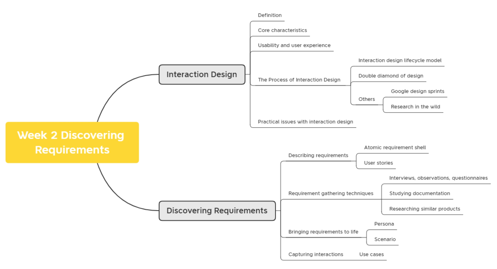

## Interaction Design 交互设计

### Definition 对交互设计的定义

> “Designing **interactive** **products** to support the way people **communicate** and **interact** in their **everyday** and **working** lives.
>
> “设计互动产品以支持人们在他们在日常和工作中的沟通和互动。

> “The design of **spaces** for human **communication** and **interaction**.“
>
> 为人类交流和互动设计的空间 。

**Terminologies:** 

User interface design (UI), software design, user centered design, product design, web design, user experience design (UX), interactive system design

用户界面设计 （UI）、软件设计、以用户为中心的设计、产品设计、网页设计、用户体验设计 （UX）、交互式系统设计

**Interaction design** is the **umbrella term** covering all of these aspects:

- Fundamental to all disciplines, fields, and approaches concerned with researching and designing computer based systems for people

  为人们研究和设计基于计算机的系统的所有学科、领域和方法的基础

### Core characteristics of interaction design 交互设计的核心特性

1. **Users** should be involved throughout the development of the project

   **用户**应该参与整个项目的开发

2. Specific **usability and user experience goals** need to be identified, clearly documented, and agreed to at the beginning of the project

   需要在项目开始时确定、明确记录并同意具体的 **可用性和用户体验目标**

3. **Iteration** is needed through the core activities

   迭代需要通过核心活动

### Importance of involving users 用户参与的重要性

- **Understanding of users’ goals leading to better products**

  了解用户的目标是否能够引领出一个表现更好的产品

- **Expectation management** 

  预值管理

  - Realistic expectations 

    切合实际的期望

  - No surprises, no disappointments

    没有惊喜，没有失望

  - Timely training

    及时的培训

  - Communication, but no hype

    沟通，但没有炒作

- **Ownership**

  所有权

  - Make the users active stakeholders （**not all stakeholders are users**, e.g., investors they may just fund the product but not use it.）

    使用户成为积极的利益相关者（**并非所有利益相关者都是用户**，例如，投资者，他们可能只是为产品提供资金，但不使用它。

  - More likely to forgive or accept problems
  
    更有可能原谅或接受问题
  
  - Can make a big difference in acceptance and success of product
  
    可以对产品的接受度和成功产生重大影响

### Degree of user involvement 用户参与程度

- **Member** of the design team

  设计团队的**成员**

  - Full-time: constant input, but lose touch with users

    全日制：持续参与，但与用户失去联系

  - Part-time: patchy input, and very stressful

    兼职：参与不完整，压力很大

  - Participatory design: involve all stakeholders in the early stages of design

    参与式设计：让所有利益相关者参与设计的早期阶段

- **Face-to-face** group or individual activities

  面对面交流小组 或者 个人活动

- **Online contributions** from thousands of users

  来自数千名用户的在线贡献

  - Online Feedback Exchange (OFE) systems

  - Crowdsourcing design ideas

  - Citizen science

- User involvement **after product release**

  用户在产品问世之后参与

  - Customer review analysis

    顾客评价与分析

## Activity1: Who to involve? 谁需要参与到项目当中 (定义与项目有关的人员)

### Example of goal 项目目标

一个项目的目标可以被分为很多个标准，可以从简单地实现这个项目的基本功能，到每个功能都能做到最精进。**能用和好用是两个标准**!(Usability and user experience are two different standard)

1. Effective to use (effectiveness) – how good it is

   有效使用(有效性) - - 它有多好

2. Efficient to use (efficiency) – how easy / fast it is

   有效使用(效率) - - 多么容易/快捷

3. Safe to use (safety)

   使用起来有多安全

4. Have good utility (utility)

   有没有实用性

5. Easy to learn (learnability)

   方不方便上手

6. Easy to remember how to use (memorability)

   是否需要额外的记忆成本

### Usability and user experience goals  可用性和用户体验目标

- There is no clear cut between them

  它们之间没有明确的界限

- Usability goals differ from user experience goals

  可用性目标与用户体验目标不同

  - **Usability** is more **objective**: how useful or productive a system is from its own perspective

    **可用性** 更 **客观**：从系统自身的角度来看，系统的有用性或生产力

  - **User experience** is more **subjective**: how users experience an interactive product from their own perspective

    **用户体验** 更 **主观**：用户如何从自己的角度体验交互式产品

- Trade-offs between the two kinds of goals
  
  两种目标之间的权衡
  
  - Can a product be both fun and safe?
  
    产品可以既有趣又安全吗？
  
- Historically HCI was concerned primarily with **usability**, but it has since become concerned with understanding, designing for, and evaluating a wider range of **user experience** aspects.

  从历史上看，HCI 主要关注 **可用性**，但后来它开始关注理解、设计和评估更广泛的 **用户体验** 方面。

## The process of interaction design  交互设计的过程

### Four basic activities of Interaction Design  交互设计的四个基本活动

1. **Discovering requirements** for the interactive product.

   发现交互式产品的需求。

2. **Designing alternatives** that meet those requirements.

   设计满足这些要求的替代方案。

3. **Prototyping** the alternative designs so that they can be communicated and assessed.

   原型设计 备选设计，以便进行沟通和评估。

4. **Evaluating** the product and the user experience it offers throughout the process

   评估 产品及其在整个过程中提供的用户体验

### Interaction design lifecycle model 交互设计生命周期模型 (Very Important)

Exemplifies a user-centered design approach  以用户为中心的设计方法示例

体现了以用户为中心的设计方式

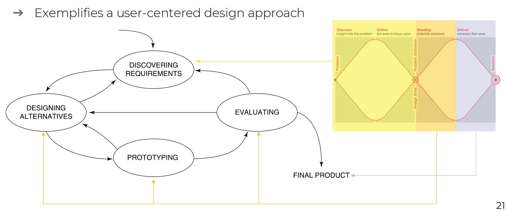

### Understanding the problem space 理解问题空间

- **Explore** 探索阶段

  - **What** is the current user experience?

    现阶段的用户体验

  - **Why** is a change needed?

    为什么改变需求

  - **How** will this change improve the situation?

    这个改变怎么提升当前的使用情况

- **Articulating** the problem space  阐明问题空间
  
  - Team effort
  
    团队贡献
  
  - Explore different perspectives
  
    探索不同的观点
  
  - Avoid incorrect assumptions and unsupported claims
  
    避免不正确的假设和不受支持的声明

### Frameworks 框架

#### The double diamond design （Very Important 非常重要）

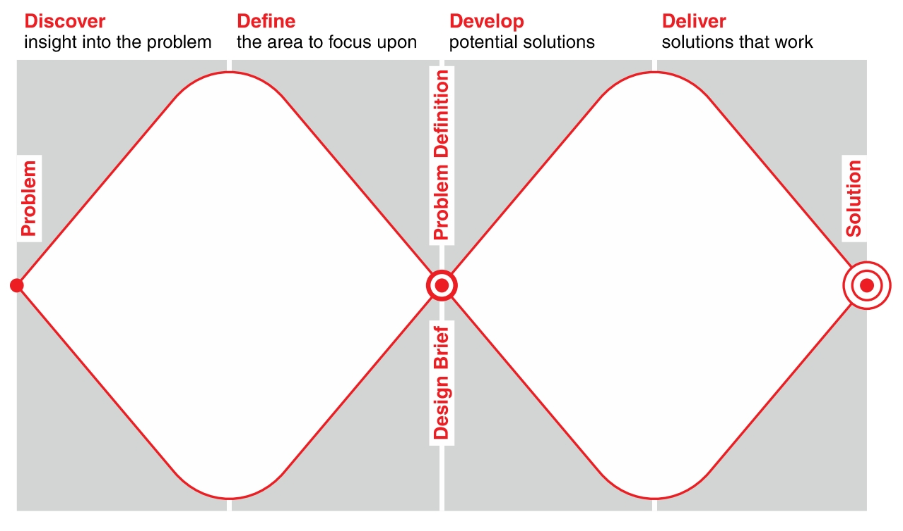

1. 第一个钻石（问题空间）：
   - **探索/调研（Discover/Research）**：通过用户调研、数据分析等方法，广泛收集信息，发现潜在问题。
   - **定义/合成（Define/Synthesis）**：对收集的信息进行分析，提炼核心问题，明确设计目标。
2. 第二个钻石（解决方案空间）：
   - **构思/发展（Develop/Ideation）**：围绕核心问题，发散思维，提出多种解决方案。
   - **实现/交付（Deliver/Implementation）**：对方案进行评估和优化，最终交付可行的设计解决方案

#### Google Design Sprint

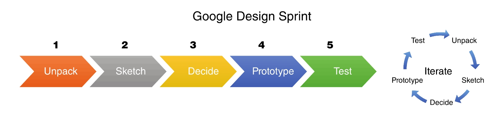

#### Research in the wild

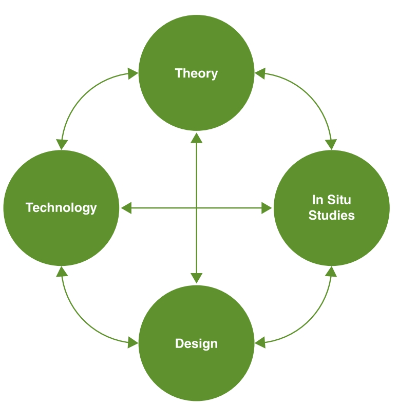

### What is involved in Interaction Design 交互设计涉及什么

- It is a process:

  这是一个过程:

  - Focused on discovering requirements, designing to fulfil requirements, producing prototypes and evaluating them

    专注于发现需求、设计以满足需求、制作原型并对其进行评估

  - Focused on **users** and their **goals**

    专注于 **用户** 及其 **目标**

  - Involves trade-offs to balance conflicting requirements

    涉及权衡以平衡冲突的需求

- Generating alternatives and choosing between them is key

  生成替代方案并在它们之间进行选择是关键的
  
  - “The best way to get a good idea is to get lots of ideas”, Linus Pauling
  
    “**获得好主意的最好方法是获得大量想法**”，Linus Pauling

## Practical Issues in Interaction Design 交互设计中的实际问题

### User-centered approaches: 3 principals 3个以用户为中心的原则

1. **Early focus on users and tasks**: directly studying cognitive, behavioral, anthropomorphic, and attitudinal characteristics

   **早期关注用户和任务**：直接研究认知、行为、拟人化和态度特征

2. **Empirical measurement**: users’ reactions and performance to scenarios, manuals, simulations, and prototypes are observed, recorded, and analysed

   **实证测量**：观察、记录和分析用户对场景、手册、模拟和原型的反应和表现

3. **Iterative design**: when problems are found in user testing, fix them and carry out more tests

   **迭代设计**：当用户测试中发现问题时，修复问题并进行更多测试

#### Early focus on users and tasks  尽早关注用户和任务

1. Users’ **tasks and goals** are the driving force behind the development.

   用户的**任务和目标**是开发背后的驱动力。

2. Users’ **behaviour and context of use** are studied, and the system is designed to support them.

   研究了用户的行**为和使用环境**，并设计了系统来支持他们。

3. Users’ **characteristics** are captured and designed for.

   用户的**特征**被捕获并被包含在设计当中。

4. Users are **consulted** throughout development **from earliest phases to the latest**.

   在整个开发过程中从最早阶段到最新阶段，都会**征求**用户的意见。

5. All design decisions are taken within the context of the **users**, their **activities**, and their **environment**.

   所有设计决策都是在**用户**、他们的**活动**和**环境**的上下文条件中做出的。

需要发现项目潜在的问题是什么，下面是一些在项目前期比较需要重视的问题。在项目前期，需要关注的一些方面是潜在用户，和需要满足的核心需求

### Who are the users and stakeholders? 谁可以成为客户或者利益相关者

- Users are not always obvious

  用户通常不会被轻易地全部发掘出来

  - 382 distinct types of users for smartphone apps (Zhao et al, 2016)

  - Many products are intended for use by large sections of the population, so user is “everybody”

    许多产品旨在供大部分人群使用，因此用户是“每个人”

  - More targeted products are associated with specific roles

    更有针对性的产品与特定角色相关联

- Stakeholders

  利益相关者

  - The individuals or groups that can influence or be influenced by the success or failure of a project

    可以影响项目成功或失败或受其影响的个人或团体

  - Larger than the group of direct users
  
    大于直接用户组
  
  - Identifying stakeholders helps identify groups to include in interaction design activities
  
    确定利益相关者有助于确定要包含在交互设计活动中的具体成员组

### What are the users’ needs? 用户需要什么

- **Users rarely know what is possible**

  用户通常一无所知，对自己的需求也不明确

  - “un-dreamed-of” needs

    可能包括一些“做梦也想不到”的需求

- Instead:

  - Explore the **problem space**

    需要我们自己去探索问题空间

  - Investigate **who are the users**

    研究潜在的用户群体

  - Investigate **user activities** to see what can be improved

    调查用户活动去探索什么可以被提升

  - **Try out ideas** with potential users

    想办法吸引更多潜在用户

- Focus on peoples’ goals, **usability, and user experience goals**, rather than expect stakeholders to articulate requirements

  关注人们的目标、可用性和用户体验目标，而不是期望利益相关者阐明需求

## Activity2: Discovering  Requirement 发掘需求

### What How & Why

- What is the purpose of the requirements activity?

  需求活动的目的是什么?

  - Explore the **problem space** to gain insights

    探索问题空间以获得深层了解

  - Establish a description of **what will be developed**

    确定将要开发的内容的的描述

- How to capture requirements once discovered?

  一旦发现需求,如何捕捉?

  - In prototypes or operational product

    在原型或操作产品中

  - Through structured or rigorous notations

    通过结构化或严格的标识

  - Good to be explicit to keep record of key requirements

    明确记录关键要求是有好处的

  - Different capturing mechanisms emphasize and de-emphasize different aspects

    不同的捕获机制强调和淡化不同的方面

### Requirements 需求

- A **statement** about an intended product that **specifies what** **it is expected to do** or **how it will perform**

  关于预期产品的 声明，其中 **指定预期做什么** 或 **它将如何表现**

- Different forms and different levels of abstraction

  不同形式和不同程度的抽象

  - **Atomic requirement shell**

  - **User stories**

#### Atomic requirement shell 原子需求壳

Example 1:

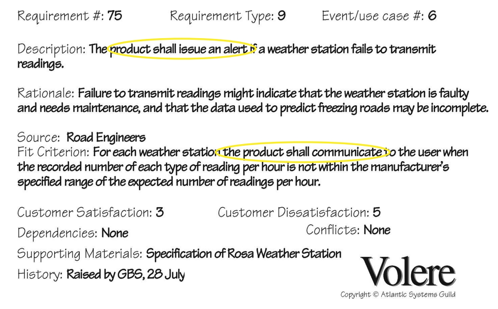

Example 2:

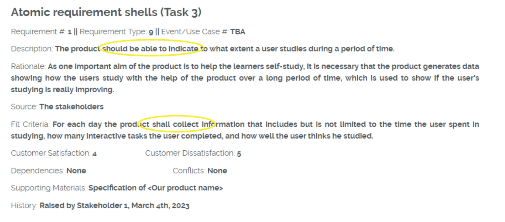

#### User stories 用户故事

**Format 格式**:

- **As a <role>, I want <behavior> so that <benefit>** 

Example user stories for a travel organizer might be:

- As a `traveler`, I want `to save my favorite airline for all my flights` so that `I will be able to collect air miles`

- As a `travel agent`, I want `my special discount rates to be displayed to me`so that `I can offer my clients competitive rates`

Most prevalent in agile development contexts

通常在敏捷开发环境中更常见

Real example of user stories in a sport app:

> As a user, I want to have an improved **social community feature** on the sports app, similar to Keep app, so that I can connect with other fitness enthusiasts, share my progress and receive motivation from the community.
>
> - As a user, I want to have **a profile page** on the app, so that I can customize my personal information and view my fitness progress. 
>
> - As a user, I want to **join fitness groups or communities**, so that I can connect with other fitness enthusiasts and receive motivation from them. 
>
> - As a user, I want to have **a leaderboard function**, so that I can compete with other users and motivate myself to achieve my fitness goals. 
>
> - As a user, I want to have **a chat function**, so that I can communicate with other users in real-time and receive motivation and support from them. 
>
> - As a user, I want to have **a feature that allows me to share my fitness progress on social media**, so that I can inspire my friends and receive encouragement from them.

### Different kinds of requirements 两种不同类型的需求

- **Functional requirements**

  功能性要求

  - What the system should do

    系统应该做什么

  - Example: As a video game, it will be challenging for a range of user abilities

    示例：作为一款视频游戏，它对一系列用户能力来说将是一项挑战

- **Non-functional requirements**

  非功能性要求

  - The characteristics (sometimes called constraints) of the product
  
    产品的特性（有时称为约束）
  
  - Example: As a video game, it can run on a variety of platforms, such as the Microsoft Xbox, Sony PlayStation, and Nintendo Switch game systems
  
    示例：作为视频游戏，它可以在各种平台上运行，例如 Microsoft Xbox、Sony PlayStation 和 Nintendo Switch 游戏系统

### A Comprehensive Categorization of Requirements Types 需求类型的全面分类

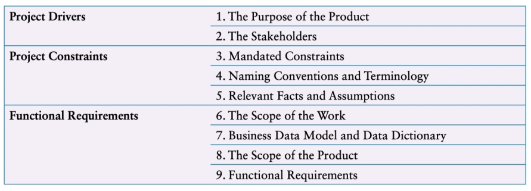

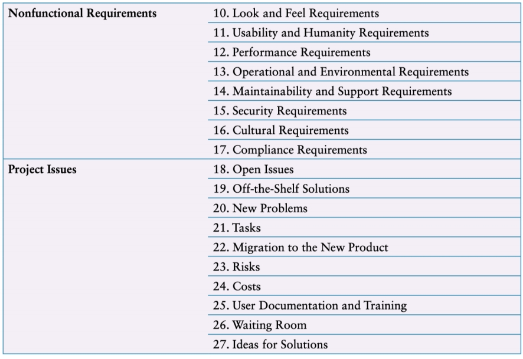

### The SEVEN product dimensions 七大产品维度

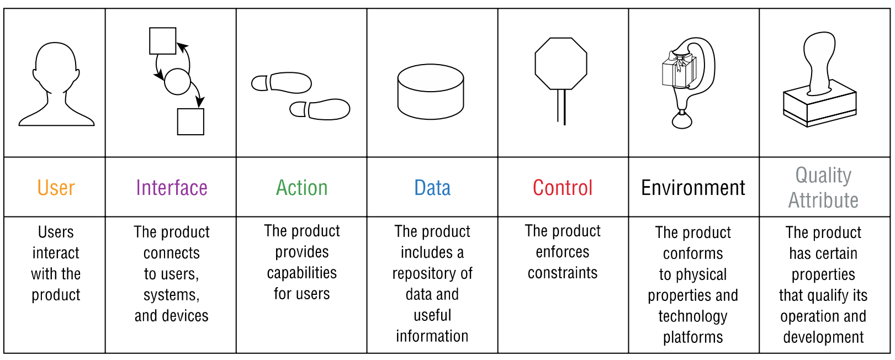

### Six most common types of requirements  六种最常见的需求类型

1. **Functional requirements**

   功能要求

   - What the system should do

     系统应该做什么

2. **Data requirements**

   数据要求

   - What kinds of data need to be stored?

     需要存储哪些类型的数据？

   - How will they be stored (for example, database

     它们将如何存储（例如，数据库）

3. **Environment requirements** or context of use:

   环境要求 或使用环境：

   - **Physical**: dusty? noisy? vibration? light? heat? humidity? …. (for example, in a hospital)

     物理：尘土飞扬？吵？振动？光？热？湿度？….（例如，在医院）

   - **Social**: collaboration and co-ordination, data sharing, distributed, synchronous or asynchronous, privacy 

     社交：协作和协调、数据共享、分布式、同步或异步、隐私

   - **Organizational**: user support, communications structure and infrastructure, availability of training

     组织：用户支持、通信结构和基础设施、培训可用性

   - **Technical**: On what technologies will it run or need to be compatible?

     技术：它将在哪些技术上运行或需要兼容？

4. **Users characteristics**

   用户特性

   - Nationality, educational background, attitude to computers

     国籍、教育背景、对计算机的态度

   - System use: novice, expert, casual, frequent

     系统使用：新手、专家、休闲、频繁

     - Novice: prompted, constrained, clear

       新手：提示，约束，清晰

     - Expert: flexibility, access/power

       专家：灵活性、访问/权利

     - Frequent: shortcuts

       频繁:快捷键

     - Casual/infrequent: clear menu paths

       随意/不频繁：清除菜单路径

   - User profile

     用户身份信息

5. **Usability goals**

   可用性目标

6. **User experience goals**

   用户体验目标

Different products have different requirements and may be implemented in different ways

不同的产品有不同的要求，并且可能以不同的方式实现

### Data Gathering for Requirements  需求数据收集

- **Interviews, observations, and questionnaires**

  访谈、观察和问卷

- **Studying documentation**

  学习文档

  - Procedures and rules are often written down in manuals 

    程序和规则通常写在手册中

  - Good source of data about the steps involved in an activity and any regulations governing a task

    有关活动中涉及的步骤以及管理任务的任何法规的良好数据来源

  - Good for understanding legislation and getting background information

    有利于了解法规和获取背景信息

  - Does not involve stakeholder time

    不涉及利益相关者的时间

- **Researching similar products**

  研究同类产品

  - Good for prompting requirements

    有利于提示需求

#### Combining data gathering  结合数据收集

- Observation (direct and indirect)

  观察（直接和间接）

- Interviews (individual and group)

  访谈（个人和团体）

- Diaries

  日记

- Surveys

  调查

- Think-aloud evaluation

  Think-aloud 评估

- Working prototype evaluation

  工作原型评估

- Studying documentation

  学习文档

- Evaluating other systems

  评估其他系统

- Ethnographic study

  人种学研究

- Usability tests

  可用性测试

#### Using probes to engage with users  使用调查表与用户互动

Many types of probe:

有许多类型的调查表

- Designed to prompt users into action

  旨在提示用户采取行动

- For researchers to learn about users

  供研究人员了解用户

### Contextual Inquiry Process  情境查询流程

- Part of **Contextual Design**, but also used on its own to gather requirement

  作为 **上下文设计** 的一部分，但也单独用于收集需求

- One-on-one field interviews (contextual interviews)

  一对一实地访谈（情境访谈）

  - 1.5 to 2 hours long

  - Focus on daily life at home or work relevant to the project

    专注于与项目相关的家庭或工作

  - Uses a model of master (participant) and apprentice (researcher)

    使用导师 （参与者） 与学徒 （研究人员） 模型

- Four main principles:

  四大原则：

  - **Context**: Going to the user, wherever they are, and seeing what they do as they do it

    上下文：转到用户，无论他们身在何处，并看到他们在做什么

  - **Partnership**: User and interviewer explore user’s life together

    合作：用户和访问员一起探索用户的生活

  - **Interpretation**: Observations interpreted by user and interviewer together

    解释：用户和访问员一起解读的观察结果

  - **Focus**: Project focus to understand what should be paid attention

    重点：项目重点了解应该注意什么

#### Interview

- Interview guided by seven “cool concepts” divided into two groups 

  面试由七个“酷概念”指导，分为两组

- **Joy of life concepts** (How products make our lives richer and more fulfilling)

  Joy of life 概念 （产品如何让我们的生活更丰富、更充实）

  - Accomplish (empower users)

    完成（授权用户）

  - Connection (enhance real relationships)

    联系（增强真实关系）

  - Identity (support users’ sense of self)

    身份（支持用户的自我意识）

  - Sensation (pleasurable moments) 

    感觉（愉悦的时刻）

- **Joy of use concepts** (Describe impact of using the product)

  Joy of use 概念 （描述使用产品的影响）

  - Direct in action (provide fulfillment of intent)

    直接行动（提供意图的实现）

  - The hassle factor (remove all glitches and inconveniences)

    麻烦因素（消除所有故障和不便）

  - The learning delta (reduce the time to learn)

    学习增量（减少学习时间）

- Interview in **four** parts 

  采访的**4**个重要的步骤：

  - Overview

    纵览

  - Transition

    承接

  - Main interview

    采访主体内容

  - Wrap-up

    总结

- Following interview, **interpretation** session

  在采访之后，需要立即对收集到的数据和信息进行分析和解析。

  - Contextual design models are created or consolidated

    创建或整合上下文设计模型

  - Most relevant models are chosen by team, out of 10 suggested

    最相关的模型由团队选择，从 10 个建议中选出

### Brainstorming for innovation  集思广益，创新

1. Include participants from **a wide range of disciplines**, with a broad range of experience

   包括来自 广泛学科 的参与者，具有广泛的经验

2. Don’t ban silly stuff

   不要禁止愚蠢的东西

3. Use catalysts for further inspiration

   使用催化剂获得更多灵感

4. **Keep records**. Capture every idea, without censoring

   保留记录。捕捉每一个想法，无需审查

5. **Sharpen the focus**

   锐化焦点

6. Use warm-up exercises and **make the session fun**

   使用热身练习并 让训练变得有趣

### Bring requirements to life  将需求变为现实

- Augmenting the basic requirements expressed as **user stories**

  扩充以 用户故事 表示的基本要求

- **Personas**

  角色

  - Rich descriptions of typical users, not specific people

    典型用户的丰富描述，而不是特定人员的描述

- **Scenarios**

  场景

  - An informal narrative story, simple, ‘natural’, personal, and not generalizable

    一个非正式的叙述故事，简单、“自然”、个人化且不可概括

#### Persona 用户画像

- Capture a set of **user characteristics** (user profile)

  捕获一组 用户特征（用户配置文件）

- Synthesized from real people based on user research

  根据从真实人物的用户研究中合成

- **Typical**, not idealised

  典型，非理想化

- Bring to life with name, characteristics, goals, and personal background 

  通过姓名、特征、目标和个人背景栩栩如生地呈现

  - Relevant to product under development

    与正在开发的产品相关

- Two goals of persona 目的

  - Helps **designer** with design decisions and 

    帮助设计师做出设计决策

  - Reminds **team** about who will use the product

    提醒团队谁将使用该产品

- Develop a small **set of personas with one primary**

  用一个主要persona开发一组personas

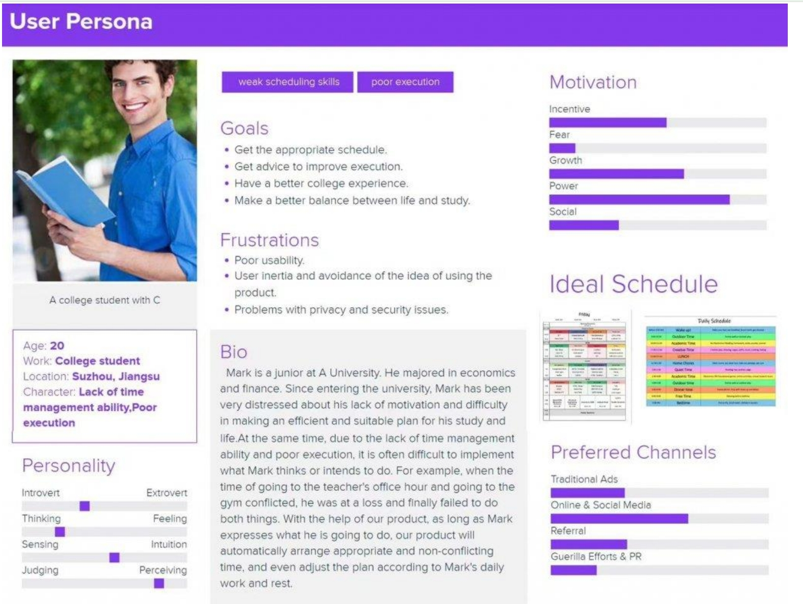

#### Scenarios  场景

Persona提供“用户是谁”的背景信息，Scenario基于这些信息构建具体的使用情境。

##### Scenarios and Persona

1. Persona: defines who the story is about. This main character has attitudes, motivations, goals, and pain points, etc.

   Persona：定义故事的作者。这个主角有态度、动机、目标和痛点等。

2. Scenarios: Defines when, where, and how the story of the persona takes place. The scenario is the narrative that described how the persona behaves as a sequence of events.

   场景：定义角色故事发生的时间、地点和方式。场景是描述角色如何作为一系列事件的行为的叙述。

3. Goals: Defines what the persona wants of needs to fulfill. The goal is the motivation of why persona is taking action. When that goal is taking action. When that goal reached, the scenario ends.

   目标： 定义角色想要满足的需求。目标是 persona 采取行动的动机。当该目标是采取行动时。当达到该目标时，场景结束。

- **Persona（用户画像）**
  - 对目标用户的**抽象化、典型化描述**，基于调研数据构建的虚构角色。
  - 包含用户的基本属性（年龄、职业、收入）、行为习惯、需求痛点、心理动机等。
  - **目标**：帮助团队理解“用户是谁”，从而设计符合其需求的产品或服务。
- **Scenario（场景）**
  - 描述用户在**特定情境下**完成某项任务的过程，包含环境、动作、交互和可能的决策分支。
  - 通常以故事形式呈现，例如：“一位忙碌的上班妈妈如何在通勤路上快速订购孩子的午餐”。
  - **目标**：帮助团队理解“用户会如何使用产品”，从而优化功能流程或体验。

| **维度**     | **Persona**                       | **Scenario**                        |
| ------------ | --------------------------------- | ----------------------------------- |
| **关注点**   | 用户的属性和特征                  | 用户的行为和情境                    |
| **输出形式** | 卡片/文档（包含标签、画像名称等） | 故事/流程图（包含步骤、分支、痛点） |
| **应用场景** | 需求优先级排序、市场细分          | 交互设计、功能流程验证、测试用例    |
| **动态性**   | 静态描述（用户“是谁”）            | 动态描述（用户“怎么做”）            |

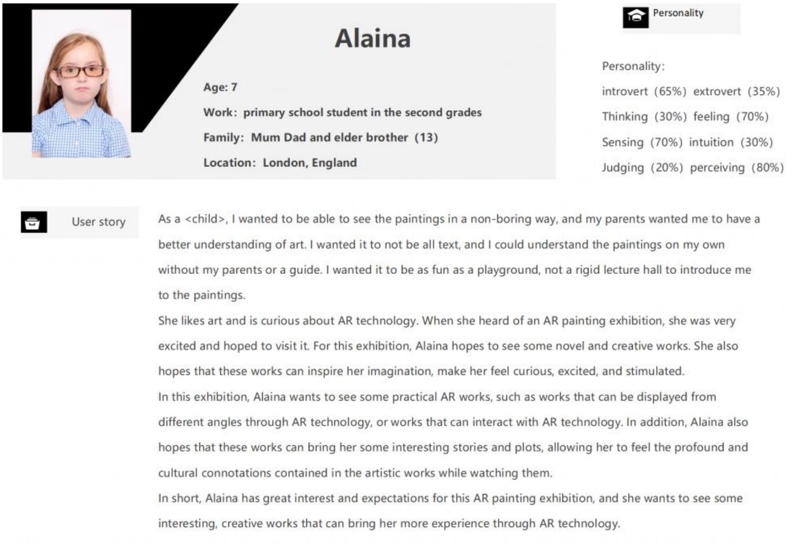

## Use case  用例

### Definition

- Focus on **functional requirements** and capture **interaction**

  关注 **功能需求** 并捕获 **交互**

- Can be used in design or to capture requirements

  可用于设计或捕获需求

- **Use cases** are step-by-step descriptions of interactions, **user stories** focuses on outcomes and user goals

  **用例** 是交互的分步描述，**用户故事** 侧重于结果和用户目标

- Two styles:

  两种样式：

  - **Essential use cases**: division of tasks, no implementation detail

    基本用例：任务划分，无实施细节

  - **Use case with normal and alternative courses**: more detail

    普通课程和替代课程的用例：更多详情

**Example of use case for travel organizer**

1. The **product** asks for the name of the destination country

   product 要求提供目的地国家/地区的名称

2. The **user** provides the country’s name

   用户 提供国家/地区的名称

3. The **product** checks that the country is valid

   product 检查国家/地区是否有效

4. The **product** asks the user for their nationality

   product 询问用户的国籍

5. The **user** provides their nationality

   用户 提供他们的国籍

6. The **product** checks the visa requirements of that country for a passport holder of the user’s nationality

   产品 检查该国家/地区对用户国籍的护照持有人的签证要求

7. The **product** provides the visa requirements

   产品 提供签证要求

8. The **product** asks whether the user wants to share the visa requirements on social media

   产品 询问用户是否想在社交媒体上分享签证要求

9. The **user** provides appropriate social media information

   用户 提供适当的社交媒体信息

**Alternative courses for travel organizer**

4. If the country name is invalid:

   如果国家/地区名称无效：

   - 4.1: The product provides an error message

     产品提供错误消息

   - 4.2: The product returns to step 1

     产品返回到步骤 1

6. If the nationality is invalid:

   如果国籍无效：

   - 6.1: The product provides an error message

     产品提供错误消息

   - 6.2: The product returns to step 4

     产品返回到步骤 4

7. If no information about visa requirements is found:

   如果未找到有关签证要求的信息：

   - 7.1: The product provides a suitable message

     产品提供合适的信息

   - 7.2: The product returns to step 1

     产品返回到步骤 1

