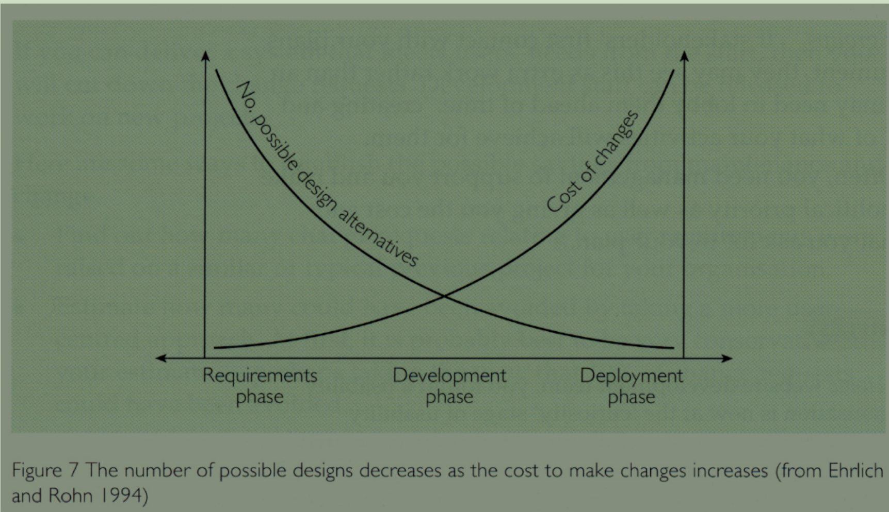
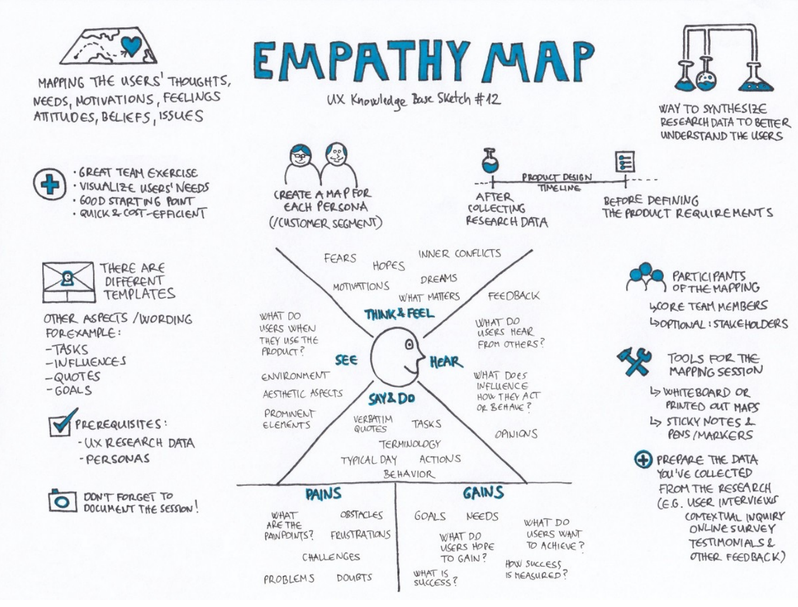
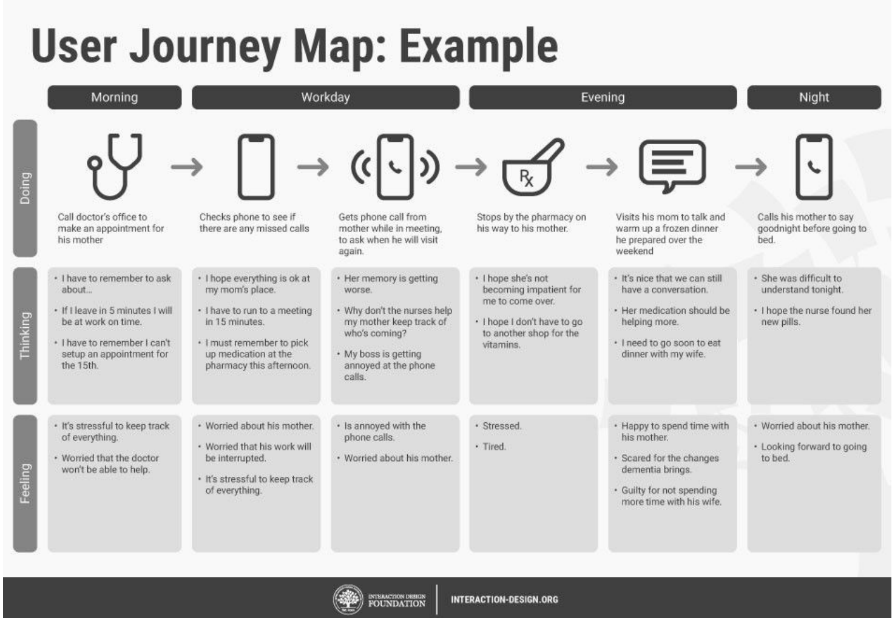
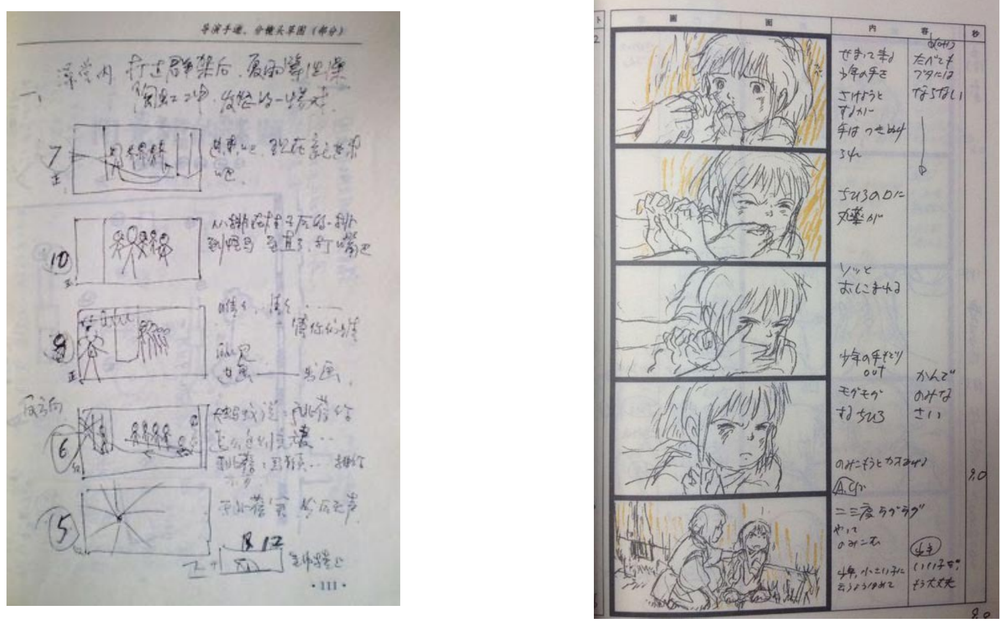

# Conceptual Prototyping and Practical Guide概念原型设计与实践指南

## Outline

1. Introduction of prototyping

2. Three reasons/usages of prototyping
3. Common tools in prototyping
4. Fidelity in prototyping

## Prototyping and Implementation 原型与实现

### Prototyping 原型

**What is a prototyping?**

In other design fields a prototype is a small scale model: such as a miniature model car or miniature city

在其他设计领域,原型是一个小比例模型: 例如一个小的模型汽车或者城市

The definition of `prototyping`: "**A first, typical or preliminary model** of something, especially a machine, from which other forms are developed or copied", or "**first example**"

**Some common examples of prototype:**

一些常见的原型示例:

- Drawing alternative furniture layouts is a prototype for decorating your house

  绘制替代家具布局是装饰房屋的原型

- Architects create models and prototypes that are used to test floor plans, airflow, daylight, and materials

  建筑师创建用于测试楼层平面图、气流、日光和材质的模型和原型

- Industrial designers sketch and prototype before choosing the proper, final form for their specific use case

  工业设计师在为其特定用例选择合适的最终形式之前，先绘制草图和原型

**Some commonalities:** 

原型之间的一些共性:

- Cheaper & Faster!

  便宜且能够以较快的速度预先生产出来

- Easier to communicate!

  容易针对原型设计产生交流

- Direct feel!

  直观感受

### What is a prototype?

**Everything Is a Prototype**

- Each thing that you make or activity that you do can be improved.

  你做的每件事或活动都可以改进。任何东西都是下一版的原型设计

- Nothing is ever completely finished; you simply run out of time for the current release. Even if you’re happy with the product you deliver, your users will have feedback, and there are bound to be tweaks and changes that you need to make for future versions or releases.

  没有什么是完全完成的;您只是没有时间使用当前版本。即使您对交付的产品感到满意，您的用户也会收到反馈，并且您肯定会需要对未来的版本或版本进行调整和更改

**Instead of an object, it is more a way of thinking.**

- The design can not be done at once

  设计不能一次完成

- Be brave to show the work in progress

  勇于展示正在进行的工作

- Listen to feedbacks

  听取反馈意见

- Be practical

  务实为本

### What is the prototype (in design)

**In interaction design it can be (among other things), for example:** 

- a series of screen sketches
- a storyboard, i.e., a cartoon-like series of scenes 
- a PowerPoint slide show
- a video simulating the use of a system

### Why prototype?

- **Evaluation and feedback** are central to interaction design

  评估和反馈是交互设计的核心

- Stakeholders **can see, hold, interact** with a prototype more easily than a document or a drawing

  利益相关者 可以查看、持有原型、与原型交互 比文档或图纸更容易

- Team members can **communicate effectively**

  团队成员可以有效沟通

- You can **test out ideas** for yourself 

  你可以自己测试想法

- It encourages **reflection**: very important aspect of design 

  鼓励反思:设计中非常重要的方面

- Prototypes answer questions, and support designers in choosing between alternatives

  回答原型问题，并支持设计人员在备选方案之间进行选择

The number of possible design decreases as the cost to make changes increase

随着更改成本的增加，可能的设计数量会减少。也就是说项目越是初期能够产生的原型想法会更多，因为此时很多事情还没有敲定，可以进行更改。但是随着生产的逐步进行，后面的原型设计就需要考虑兼容已经存在的部分。正所谓：船大难掉头。

### Why prototype? --- understanding

Understanding avoid false assumptions

理解避免错误假设

Prototype could help you to **understand**

原型可以帮助你理解

- Design alternatives

  设计备选方案

- Strategy

  战略

- User-centred processes

  以用户为中心的流程

#### Understand design alternative 理解设计替代方案

**“All roads lead to Rome”**

条条大路通罗马

- How can you be sure that the one you choose is the right one for your design?

- Don’t be sure, make many of them and try!

#### Understand Strategy 理解策略

**What are pros and cons?**

- How would you compete with other designs?

  你将如何与其他设计竞争?

- **Intangible -> tangible**

  无形 -> 有形

#### Understand user-centred processes 理解以用户为中心的流程

**User-centred design**

- Don’t make false assumptions

  不要做出错误的假设

- Prototype could build **empathy** between designers and users with concrete ideas

  原型可以在设计师和用户之间建立 **同理心**

- Useful tools:

  有用的工具

  - **Empathy map**
  - 同理心地图是一种视觉化工具，旨在帮助设计师深入理解用户的行为、态度和情感。它通过捕捉用户的声音、想法、感受和行为，将用户置于中心，帮助团队从用户的角度思考问题。同理心地图通常包含四个象限：
    - **Say（说）** ：用户的输入句子，反映用户的需求和期望。
    - **Thinks（想）** ：用户的内心想法和感受。
    - **Does（做）** ：用户的行为和行动。
    - **Feels（感）** ：用户的情感状态

  - User journey map
  - 用户旅行地图是一种线性工具，用于描绘用户在使用产品或服务过程中的行为、挑战和期望。它通过记录用户在不同阶段的行为和情感变化，帮助设计师理解用户的旅程，并验证概念和测试想法

Example of empathy map :

同理心地图的构建步骤包括：

- 确定目标用户和期望结果。
- 收集定性数据（如访谈、问卷调查）。
- 分析数据，分类发现用户模式。
- 总结和分享洞察。

同理心地图的优势在于：

- 提高团队对用户需求的理解，促进设计决策。
- 帮助设计师发现用户的痛点和需求，优化产品设计

Example of User journey map

用户旅行地图的关键要素包括：

- 用户在不同阶段的目标和期望。
- 用户遇到的挑战和障碍。
- 用户的情感变化和行为模式。

用户旅行地图的作用在于：

- 提供用户与产品互动的可视化，帮助设计师优化功能和用户体验。
- 验证设计概念，确保产品满足用户需求

### Why prototype? - Communication

Communication increase the efficiency in making decision

沟通提高决策效率

Prototype could help you to **Communicate with**

原型可以帮助你沟通

- Same “language”

  相同的语言，在设计前，中，后期都能保持相同的要求

- Different stakeholder

  不同的利益相关者

- No ”maybe”

  不要模棱两可的语言

#### With different stakeholders 与不同的利益相关者

Imagine how would you present the prototype with these stakeholders:

想象一下,你将如何向这些利益相关者展示原型:

- Investors (Highlights/potentials)

  投资者 (亮点/潜力)

- Factory (Materials, scales)

  工厂 (材料、规模)

- Users

  用户

  - Elderly (caring?)

    婴儿

  - Child (warmth?)

    孩童

  - Male or female (Cost or privilege?)

    不同性别

#### No "Maybe" 不要模棱两可

Prototype could save efforts in determining **style, size, colour, and interactions** through **observable objects** and **peer discussion**

原型可以通过可观察对象和同行讨论确定样式,尺寸,颜色和交互来节省精力消耗

### Why prototype? – Test and reflection 测试与反响

The main aim of prototype is to **examine and improve** the current design

原型的主要目的是 **检查和改进** 当前的设计

Prototype could help you to **test and reflect on**

原型可以帮助您**测试和反思**

- Hypotheses and assumptions

  假设和假设

- Other’s comments

  其他人的评论

#### Hypotheses and assumptions 假设与猜测

When we begin the design, we have to make assumptions no matter how hard we try to understand users, for example:

当我们开始设计时，无论我们多么努力地尝试理解用户，我们都必须做出假设，例如：

- Users could find the way to specific functions

  用户可以找到特定功能的方法

- The information displayed is straightforward

  显示的信息很简单

- Users could understand the UI and texts

  用户可以理解UI和文本

- Users‘ needs could be fully satisfied within this page

  用户的需求可以在这个页面内得到充分满足

The only way to find the answer is to let them play with a mock system, like you need to **practice before the presentation**

找到答案的唯一方法是让他们体验模拟系统，就像你需要 **在演示前练习**

#### Others’ comments 其他评论

The test and reflection are not only about users, but also **within the design group**

The prototype is an opportunity for you to **present and promote the idea to peers**, and reflect on the availability and values from different perspectives

## Fidelity in prototyping  原型制作中的保真度

### What is fidelity? 什么是保真度

The fidelity of a prototype **refers to how it conveys the look-and-feel of the final product** (basically, its level of detail and realism). Select the right level of fidelity in prototyping is the key to the success of design process.

原型的保真度是指它如何 **传达最终产品的外观和感觉** （基本上，它的细节水平和真实感）。在原型设计中选择 **正确的保真度级别** 是设计过程成功的关键。

- Lower fidelity may be useless, higher fidelity may be time- and money-consuming

  较低的保真度可能毫无用处，较高的保真度可能耗时耗钱

### Low-fidelity Prototyping 低保真度模型

Uses a medium which is **unlike the final medium**, e.g., paper, cardboard

使用与最终介质不同的介质，例如纸张、纸板

Is **quick, cheap** and **easily changed**

是 **快速**、**便宜** 和 **易于更改**

Examples:

- sketches of screens, task sequences, etc.

  屏幕草图,任务序列等。

- ’Post-it’ notes

  "Post-it"便条

- Storyboards

  故事板

- ’Wizard-of-Oz

  '绿野仙踪

- **简洁**

  低保真原型设计简洁，重点突出产品的结构和功能，而非视觉细节，比如颜色、图标等。这些元素通常是简化或省略的，甚至有时仅通过文本或框架来表示。

- **快速迭代**

  由于低保真原型设计简单，因此绘制速度非常快，便于快速迭代和修改，这使得它在早期设计阶段非常有用，帮助团队及时发现并调整问题。

- **静态或者极少交互**

  低保真原型侧重产品想法交流与验证，它的目的是确保设计思路是可行的，且符合用户需求。因此，低保真原型交互程度很低，很多只是静态的线框图。低保真原型的作用是表现产品中最重要的用户流程和功能所涉及的页面关系。

- **节省资源**

  绘制低保真原型所需的时间和成本相对较低，可以帮助团队节省资源，尤其在设计初期，避免过早地陷入过于精细的设计细节。

#### Storyboards 故事板

- Often used with **scenarios**, bringing more detail, and a chance to role play

  常与 情境 一起使用，带来更多细节，并有机会进行角色扮演

- It is **a series of sketches** showing how a user might progress through a task using the device 

  它是 一系列草图 显示用户如何使用该设备完成任务

- Used **early in design**

  早期设计使用

不需要绘制的非常精细，主要就是初步地展示大概的场景是什么样的，为不了解的人方便在脑海中构造出初步的场景。

#### Sketching 素描

Sketching is important to low-fidelity prototyping. Same with the storyboard - **Don’t be inhibited about** **drawing ability**. Practice simple symbols with pencil and paper

草图绘制对于低保真原型制作非常重要。同故事板绘画能力。用铅笔和纸练习简单的符号

#### Using index cards 索引卡

Index cards (3 X 5 inches) 

Each card represents **one screen**. Often used in 

- **Website development**

- **Application**

- **MiniProgram**

#### ‘Wizard-of-Oz’ prototyping 绿野仙踪原型

- The user thinks they are interacting with a computer, but a **developer is responding** to output rather than the system. 

  用户认为他们正在与计算机交互，但响应并输出的是 **开发人员**  而不是系统。实际上电脑后面有真人再跟你交互（有点像自动售卖机实际上是背后藏了个人）

- Usually **done early** in design to understand users’ expectations

  尽早设计, 以了解用户的期望（这种模式或许更方便手机用户的使用情况，人比机器分析的要更准确）

- What is ’wrong’ with this approach?

  - It is “Artificial Intelligence”

    这是真·"人工"智能

### High-fidelity prototyping 高保真原型

- Uses materials that you would **expect to be in the final product**. 

  使用您**期望在最终产品**中使用的材料。

- Prototype looks **more like the final system** than a low-fidelity version. 

  原型看起来更像**最终系统**,而不是低保真版本。

- For a high-fidelity software prototype common environments include Macromedia Director, Visual Basic, and Smalltalk. 

- Danger that users think they have a full system…….

  危险在于用户认为他们拥有完整的系统。

- **高度还原**

  高保真原型在视觉和交互方面高度还原了最终产品，包括完整的配色方案、字体样式、图标、图片以及详细的界面布局等，这种原型可以为用户提供接近真实应用的体验。

- **真实的内容呈现**

  绘制低保真原型时，通常会使用占位符来填充内容，但高保真原型一般要求包含真实的文本、图片和数据等内容，需要更准确地呈现产品的信息架构和用户界面。

### Compromises in prototyping  原型制作中的妥协

- All prototypes involve **compromises**

  所有原型都涉及妥协

- For software-based prototyping maybe there is a slow response? sketchy icons? limited functionality? 

  对于基于软件的原型设计,可能存在响应速度慢?图标粗略?功能有限?

- Two common types of compromise

  两种常见的妥协方式

  - **‘horizontal’:** provide a wide range of functions, but with little detail

    '横向的': 提供了广泛的功能，但几乎没有细节

  - **‘vertical’:** provide a lot of detail for only a few functions

    '纵向的'：只为少数功能提供大量细节

- Compromises in prototypes mustn’t be ignored.

  原型中的妥协决不能被忽视。

有关我们现在正在用的是低保真原型还是高保真原型并没有一个明确的界限。因为两者之间总是有取舍的，有些时候需要做出一些妥协

**Neither** of these is inherently **good or bad**. 

这些都不是本质上的 **好或坏**。

- There are **costs and trade-offs** with raising or lowering fidelity in any dimension. 

  在任何维度中提高或降低保真度都需要 **成本和权衡**。

- The path you take as the designer to get from the first image to the last is **up to you to determine**.

  作为设计师，您从第一张图像到最后一张图像所采取的路径是由您决定。