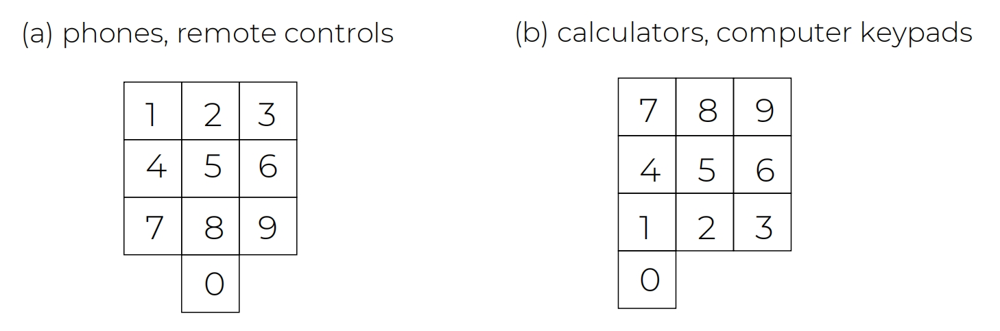

# Design Principles and Design Alternatives   设计原则和设计备选方案

## Outlines

1. Additional considerations on **Accessibility and Inclusiveness**

2. Understand the use and details of **design principles**

3. Understand the use and details of **Shneiderman's Eight Golden Rules of Interface Design**

4. How to generate and choose among **alternative designs**

## Accessibility and Inclusiveness  可及性和包容性

20世纪初，在人道主义的呼唤下，建筑领域产生了一种新的建筑设计方法——无障碍设计。它利用现代技术建设和改造环境，为广大残疾人提供行动和安全的空间。一个非常常见的案例，国际通行设计标准要求，所有公共建筑的入口都应设置坡道，而不是台阶，坡度不超过112度。但是需要关注的是，糟糕的设计会给残障人士带来伤害和不便，例如坡道设计的非常陡峭。

**Accessibility**: the extent to which an interactive product is accessible by as many people as possible

**可访问性:**一个交互式产品被尽可能多的人访问的程度

- Focus is on people with **disabilities**; for instance, those using android OS or apple **voiceover**

  重点是 残障人士;例如，那些使用 Android 作系统或 Apple voiceOver 的人

**Inclusiveness**: making products and services that accommodate the widest possible number of people 

**包容性：**制作适合尽可能广泛人群的产品和服务

- For example, smartphones designed for all and made available to everyone regardless of their disability, education, age, or income

  例如，为所有人设计的智能手机，无论其残疾、教育程度、年龄或收入如何，每个人都可以使用

### Understanding the Disability 理解残疾人

Disabilities can be classified as:

残疾可分为:

- **Sensory impairment** 

  感官障礙

  - such as loss of vision or hearing

    如视力或听力丧失

- **Physical impairment**

  身体损伤

  - having loss of functions to one or more parts of the body after a stroke or spinal cord injury

    中风或脊髓损伤后身体一个或多个部位功能丧失

- **Cognitive** 

  认知障碍

  - including learning impairment or loss of memory/cognitive function due to old age

    包括因年老而导致的学习障碍或记忆/认知功能丧失

Each type can be further defined in terms of capability: 

每种类型都可以根据能力进一步定义:

- For example, someone might have only peripheral vision, be color blind, or have no light perception

  例如,某人可能只有周边视觉,色盲,或者没有光感

Impairment can be categorized:

损伤可分为:

- **Permanent**

  永久性的

  - such as long-term wheelchair user

    需要长期使用轮椅的患者

- **Temporary**

  后天的

  - that is, after an accident or illness

    在某个疾病之后

- **Situational**

  有条件诱发

  - for example, a noisy environment means that a person can’t hear

    在嘈杂的环境中听力受损

好的设计应该即使他们想要的，又是他们需要的

## Design Principles 设计原则

Some design principles:

- Generalizable abstractions for thinking about different aspects of design

  **泛化**的抽象概念,用于思考设计的不同方面

- The **do’s and don'ts** of interaction design

  交互设计的"做"与"不做"

- What to provide and what not to provide at the interface

  在界面上提供什么和不提供什么

- Derived from a mix of:

  驱动力主要是有下面的方面混合而来：

  - theory-based knowledge

    基于理论的知识

  - experience, and 

    个人经验

  - common-sense

    大众共识

### Visibility 可视性

例如有人设计坐电梯需要刷卡之后才能前往对应的楼层，但是刷卡的卡槽又不明显，所以就会有人及时进入了电梯也不知道该怎么到达想去的楼层。如果呼叫管理员则需要等待很长时间，并且如果做错了楼层那么也没办法改变。所以最好的情况是能在刷卡槽旁加上醒目的提醒标识

一些比较常见的可见性：

- 系统状态可见性：系统的当前状态和运行情况应该对用户清晰可见，避免用户对系统状态感到困惑或不确定。
- 操作和功能的可见性： 用户能够轻松发现和理解可用的操作和功能，避免隐藏或模糊的设计。
- 反馈的可见性：用户的操作应该立即得到系统的反馈，确保用户知道他们的操作是否成功或失败。
- 约束条件的可见性：系统的限制和约束条件应该对用户清晰可见，避免用户尝试不可能的操作。
- 重要通知的可见性：关键信息和提示应该突出显示，确保用户不会忽略。

### Feedback 反馈

- Sending information back to the user about what has been done

  向用户发送有关已完成操作的信息

- Includes sound, highlighting, animation, and combinations of these

  包括声音、高亮显示、动画以及这些元素的组合

  - For example, when screen button is clicked, it provides sound or red highlight feedback:

    例如,当点击屏幕按钮时,它会提供声音或红色高亮反馈:

### Constraints 约束

- **Restricting** the possible actions that can be performed

  约束可以执行的可能操作

- Helps prevent user from selecting incorrect options

  帮助用户避免选择错误选项

- Physical objects can be designed to constrain things 

  物理对象可以被设计来约束事物

  - 例如鼠标和键盘的接口不一样，那么怎么才能直观的看出来哪一个接口对应的是鼠标，哪一个对应的是键盘呢

### Consistency 一致性

- Design interfaces to have similar operations and use similar elements for similar tasks. 

  设计具有类似操作的界面,并使用类似的元素来完成类似的任务。

  - For example, always use Ctrl key plus first initial of the command for an operation: Ctrl+c, Ctrl+s, Ctrl+o

    例如,始终使用 Ctrl 键加上命令的第一个首字母进行操作:Ctrl+c、Ctrl+s、Ctrl+o

  - **What are these and why?** What about Ctrl+p, Ctrl+v, and Ctrl+x?

    这些是什么,为什么? Ctrl+p、Ctrl+v 和 Ctrl+x 呢?

- The main benefit is that consistent interfaces are easier to learn and use

  主要好处是一致的界面更容易学习和使用

- What happens if there is more than one command starting with the same letter? (for example, save, spelling, select, style)

  如果有多个命令以相同的字母开头,会发生什么情况? (例如,保存、拼写、选择、样式)

  - You have to find other initials or combinations of keys, thereby breaking the consistency rule (for example, Ctrl+s, Ctrl+Sp, Ctrl+shift+l)

    您必须找到其他首字母或组合键,从而违反一致性规则(例如,Ctrl + s,Ctrl + Sp,Ctrl + shift + l)

  - Increases learning burden on user, making them more prone to errors

    增加用户的学习负担,使他们更容易犯错误

一致性的重要性：

- **降低学习成本**：用户不需要重新学习系统的操作方式，可以快速上手。
- **提升效率**：用户能够基于已有的经验快速完成任务。
- **增强信任感**：一致性让用户感到系统是可靠和可预测的。
- **减少错误**：统一的规则和模式可以避免用户因混淆而犯错。

#### Internal Consistency 内部一致性

- **Internal consistency** refers to designing operations to behave the same **within** an application

  **内部一致性** 是指将在应用程序内的操作设计 [内部] 都具有相同的行为

  - Consistency with other elements in the system

    与系统中其他元素的一致性

  - Cultivates a sense of orientation and trust

    培养方向感和信任感

  - Indicate the system is well thought out and planned

    表明该系统经过深思熟虑和规划

  - Difficult to achieve with complex interfaces

    复杂的界面难以实现

#### External Consistency 外部一致性

- **External consistency** refers to designing operations, interfaces, and so on to be the same **across** applications and devices

  **外部一致性** 是指将操作、界面等设计为 **跨** 应用程序和设备之间保持相同

  - Consistency with other elements in the environment

    与环境中其他元素的一致性

  - Extends the benefits of internal consistency across multiple, independent systems

    将内部一致性的优势扩展到多个独立的系统

  - More difficult to achieve because different systems rarely observe the same design standards

    更难实现，因为不同的系统很少遵循相同的设计标准

A case of external inconsistency

#### Aesthetic Consistency 美学设计一致性

- **Aesthetic consistency** refers to the style and appearance is repeated enhance recognition, communicates membership and sets emotional tone

  **美学一致性** 是指风格和外观的重复使用,增强识别力,传达成员身份并设定情感基调

  - Mercedes Benz vehicles are instantly recognizable because the company consistently feature its logo on all its vehicles

    例如，梅赛德斯奔驰汽车一眼就能认出，因为该公司的所有车辆上都始终印有其标志

  - Associated with quality and prestige, respected and admired, fine craftsmanship and reliable

    这已经让该设计与质量和声望变得息息相关,变成受人尊敬和钦佩的精湛的工艺和可靠的代表

#### Functional Consistency 功能一致性

- **Functional consistency** refers to the meaning and action are consistent to improve learnability and understanding

  **功能一致性** 是指某项操作的意义和动作一致，以提高可学习性和理解力

  - Consistent use of symbols to represent similar concepts, leverages prior knowledge and makes new things easier to learn

    一致使用符号来表示相似的概念，利用先前的知识并使新事物更容易学习

  - Traffic light always turns yellow before red

    交通灯总是在红色之前变成黄色

#### Affordance 功能可见性，通过情景帮助理解功能

- Refers to an attribute of an object that **allows people to know how to use it.**

  指对象通常拥有一个明显的属性，该属性 **允许人们知道如何使用它**。

  - For example, a mouse button invites pushing, a door handle affords pulling

    例如，鼠标按钮邀请推动，门把手提供拉动

- Norman (1988) used the term to discuss the design of everyday objects

  Norman(1988)使用该术语来讨论日常物品的设计

- Has since been popularized in interaction design to discuss how to design interface objects 

  自此在交互设计中普及,讨论如何设计界面对象

  - For example, scrollbars to enable moving up and down

    例如, 滚动条能使上下移动

- Interfaces are virtual and do not have affordances like physical objects

  界面是虚拟的，不像物理对象那样具有 affordance.

- Instead, interfaces are better conceptualized as **‘perceived’ affordances**:

  相反，界面是最好被概念化为 '有感知' 的 affordance：

  - Learned conventions of arbitrary mappings between action and effect at the interface

    学习了界面上 action 和 effect 之间任意映射的约定
  
  - Some mappings are better than others
  
    某些映射比其他映射更好

Examples:

## Shneiderman's Eight Golden Rules  施奈德曼的八条黄金法则

1. Strive for **consistency**
2. Enable frequent users to use **shortcuts**
3. Offer informative **feedback**
4. Design dialog to **yield closure**
5. Offer simple **error handling**
6. Permit **easy traversal of actions**
7. Support **internal locus of control**
8. Reduce short-term **memory load**

### Strive for consistency  追求一致性

- **定义**：界面中的元素、行为和语言应保持一致，确保用户在不同场景下能够快速理解并预测系统的行为。
- 示例
  - 使用相同的颜色、字体和图标表示相同的功能。
  - 确保相同的操作（如保存、删除）在不同页面中具有相同的行为。
  - 例如所有人都知道车上的双闪按钮是两个嵌套的红色等边三角形
- **重要性**：降低学习成本，提升用户的操作效率和信心

Consistent sequences of actions should be required in similar situations; identical terminology should be used in prompts, menus, and help screens; and consistent commands should be employed throughout.

在类似的情况下,应该要求一致的操作顺序;电脑中的menu, prompts 和 help 等功能应该使用相同的术语; 并且应该始终使用一致的命令。

- **Workflows/Processes**

  工作流程

- **Functionality**

  功能性

- **Appearance**

  外表设计

- **Terminology**

  专业术语

### Enable frequent users to use shortcuts  允许经常使用的用户使用快捷方式

- **定义**：为熟练用户提供快捷方式（如快捷键、命令、手势），以提升他们的操作效率。
- 示例
  - 在文本编辑器中提供快捷键（如 Ctrl+C 复制，Ctrl+V 粘贴）。
  - 在应用程序中支持手势操作（如滑动删除）。
- **重要性**：满足熟练用户的需求，提升他们的操作速度。

随着使用频率的增加，用户减少交互次数和加快交互速度的愿望也随之增加。缩写、功能键、隐藏命令和宏工具对专业用户非常有用。

- **Keyboard shortcuts**

  键盘快捷键

- **Hidden “power user” features**

  开发者选项或者高级选项通常会被放在不显眼的位置

- **Automation**

  自动化

手动寻找复制指令 -> 使用快捷键 -> 直接拖拽

### Offer informative feedback 提供信息丰富的反馈

- **定义**：用户的操作应得到及时且明确的反馈，确保用户知道系统正在做什么以及操作的结果。
- 示例
  - 在提交表单后显示“提交成功”或“提交失败”的提示。
  - 在加载数据时显示进度条或加载动画。
- **重要性**：增强用户的控制感，减少不确定性。

对于每个作员作，都应该有一些系统反馈。对于频繁和次要的行动，响应可以是适度的，而对于不频繁的重大行动，响应应该更实质性。

- **Relevant**

  相关性

- **Fits importance and urgency**

  符合重要性和紧迫性

- **Comprehensible and meaningful**

  易于理解并且有意义

- **Within appropriate context (time and place)**

  在适当的（时间和地点）背景下

### Design dialog to yield closure 设计对话以形成闭环

- **定义**：用户的操作应形成一个完整的闭环，确保用户知道任务已完成，并明确下一步该做什么。
- 示例
  - 在完成购买后显示“订单已确认”页面。
  - 在保存文件后显示“保存成功”提示。
- **重要性**：避免用户对任务状态感到困惑，提升任务完成的清晰度。

行动的顺序应该分成有开头、中间和结尾的几组。在一组行动完成时的信息反馈能够提供给操作员成就感，一种解脱感，从他们的头脑中放弃应急计划和选择的信号，并表明为下一组行动做准备的道路是明确的。

- **Grouping of actions**

  对操作进行分组

- **Explicit completion of an action**

  定义一个清晰的结束标记

- **Well-defined options for the next step**

  明确下一步的选择

### Offer simple error handling 提供简单易懂的错误处理

- **定义**：错误信息应清晰、简洁，并提供明确的解决方案，帮助用户快速纠正错误。
- 示例
  - 在输入错误时显示“密码长度至少为 8 个字符”的提示。
  - 在系统错误时提供“重试”按钮或联系支持的方式。
- **重要性**：减少用户的挫败感，提升系统的可用性。

尽可能地通过设计和完善系统的错误处理功能使用户不会犯严重错误。如果发生了错误，系统应该能够检测到错误，并提供简单易懂的机制来处理错误

- **Error prevention over error correction**

  错误预防和错误纠正

- **Automatic detection of errors**

  自动检测错误

- **Clear error notifications**

  清晰的错误通知

- **Hints for solving the problem**

  提供解决问题的建议

### Permit easy reversal of actions 允许简单的回溯操作

- **定义**：用户应能够轻松撤销或重做操作，避免因误操作而带来严重后果。
- 示例
  - 提供“撤销”和“重做”按钮。
  - 在删除文件前显示确认对话框。
- **重要性**：增强用户的控制感，减少误操作的风险。

这个特性减轻了焦虑，因为用户知道错误是可以撤销的；因此，它鼓励探索不熟悉的选项。可逆性的单位可以是单个动作、一个数据条目或一组完整的动作。

- **No interference with workflow**

  不干扰工作流程

- **More freedom for the user**

  用户可以无约束地去进行尝试

- **Single-action undo vs. action history**

  可以选择单一操作撤回，或者直接记录操作的历史

### Support internal locus of control 内部支持控制点

- **定义**：用户应感到他们能够控制系统，而不是被系统控制。
- 示例
  - 提供明确的选项和操作，让用户自主选择。
  - 避免强制用户执行不必要的操作。
- **重要性**：增强用户的信心和满意度。

经验丰富的操作人员强烈希望感觉到他们对系统负责，系统对他们的行动作出反应。设计系统，让用户成为行动的发起者，而不是被操纵者

- **The user commands, the system obeys**

  用户命令,系统服从

- **Strongly relies on the informative feedback**

  强烈依赖信息反馈

- **“The principle of least surprise”**

  系统要尽量保证不会产生意料之外的 "惊喜"

### Reduce short-term memory load 减少短期记忆负担

- **定义**：界面设计应尽量减少用户需要记住的信息量，通过可见的提示和默认值降低记忆负担。
- 示例
  - 在表单中显示默认值或提示信息。
  - 使用面包屑导航（Breadcrumb）显示用户的当前位置。
- **重要性**：降低用户的认知负担，提升操作效率。

人类在短期记忆中处理信息的局限性要求界面显示保持简单，多页显示整合，减少窗口运动频率，为代码和动作序列分配足够的训练时间。

- **Clear structure: windows, dialogs, app in its entirety**

  清晰的结构：窗口，对话框，整体的应用程序

- **“Recognition over recall”**

  辨识胜过查找回忆

- **Implicit help**

  隐含的帮助

## Alternative Designs 替代设计

### How to generate alternatives?  如何生成替代品？

- 人类倾向于坚持使用有效的东西 

- 考虑替代方案有助于确定更好的设计 

- 替代设计来自哪里？ 

  - “天赋和创造力”：研究和综合 

  - 不同角度的想法交叉融合 

  - 用户可能产生不同的设计 

  - 根据不断变化的用途发展产品 

  - 寻求灵感：相似的产品和领域，或不同的产品和领域 

- 平衡约束和权衡

### How to choose among alternatives? 如何从替代品中进行选择呢

- 交互设计侧重于**外部可见**和**可测量的**行为 
  - 使用 PC 与 CPU、GPU、内存等。 

- 技术可行性 
- 与用户和利益相关者一起**评估** 
  - 原型，而不是静态文档，因为行为是关键 

- **A/B 测试**：告知备选方案的选择 

  - Online method to inform choice between alternatives

    在线方法，告知备选方案的选择

  - Nontrivial to set appropriate metrics and choose user group sets

    设置适当的指标并选择用户组集是重要的

- **质量阈值** 

  - Different stakeholder groups have different quality thresholds (think of photo taking on the phone)

    不同的利益相关者群体有不同的质量阈值（想想在手机上拍照）

  - Usability and user experience goals lead to relevant criteria

    可用性和用户体验目标导致了相关标准

