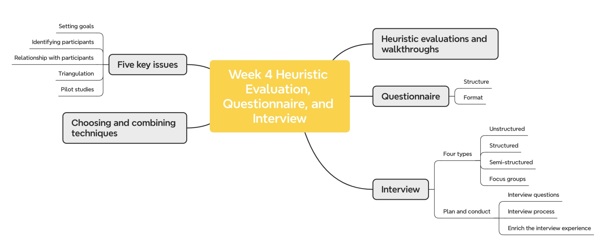
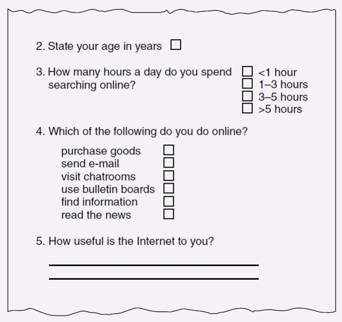
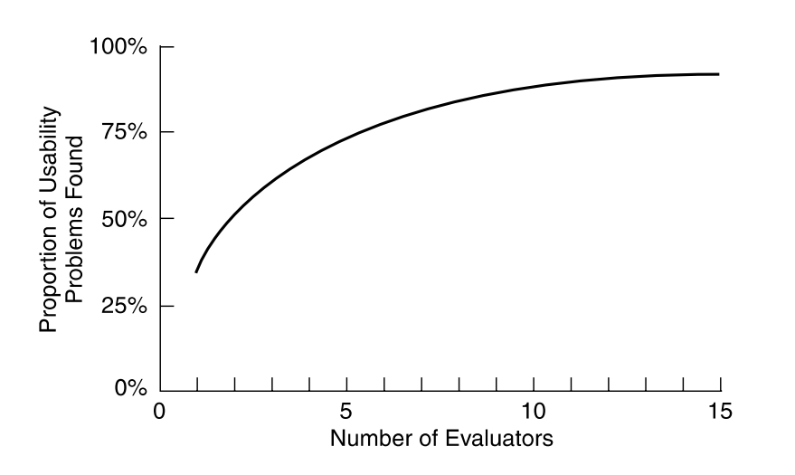

# Heuristic Evaluation, Questionnaire and Interview 启发式评价、问卷调查和访谈

## Questionnaires 问卷调查

- Questions can be **closed-ended** or **open-ended**

  问题可以是 **封闭式** 或 **开放式**

  - 封闭式：多选或者单选，以及选择固定的分数
  - 开放式：请留下你额外的评论

- Closed questions are easier to analyze, and may be distributed and analyzed by computer

  封闭式问题更容易分析，并且可以由计算机分发和分析，因为形势很固定

- They can be administered to large populations

  它们（问卷）可以用于大量人群

- Disseminated by paper, email and the web

  通过纸张、电子邮件和 Web 传播

### Questionnaire Design 问卷设计

- The impact of a question can be influenced by **question order**.

  问题的影响可能会受到 **问题顺序** 的影响。

- You may need different versions of the questionnaire for different **populations.**

  对于不同的 **人群** ，您可能需要不同版本的问卷。

- Provide **clear instructions** on how to complete the questionnaire. 

  提供有关如何完成问卷的 **明确说明与指导**。给要填写问卷的人一个对于将要展开的话题的快速认知

- **Avoid very long questions** and questionnaires.

  一定要避免长问题

- Decide on whether phrases will all be **positive**, all **negative**, or **mixed**.

  决定短语是全部为 **positive**、全部为 **negative** 还是 **mixed**。

- Strike a balance between using white space and **keeping the questionnaire compact**.

  在使用空白和 **保持问卷简洁** 之间取得平衡。

- 一定要避免主动引导用户去进行回答

### Question and Response Format 问题和回应格式

- ‘Yes’ and ‘No’ checkboxes

  ✓ 与 ✕

- Checkboxes that offer many options

  提供许多选项的复选框

- Rating scales

  打分

  - Likert scales

    喜欢程度

  - Semantic scales

    语意范围

  - 3, 5, 7 or more points

- Open-ended responses

  开放式回答

### Try to Encourage a Good Response 鼓励受访者提供正反馈

- Make sure that **the purpose of study is clear**

  确保 **学习目的明确**

- Promise **anonymity**

  承诺 **匿名**

- Ensure that questionnaire is **well designed**

  确保问卷问题结构 **设计合理**

- Offer a **short version** for those who do not have time to complete a long questionnaire

  为没有时间完成长问卷的人提供 **简短版本** （相对来说，封闭式问题会更容易回答）

- **Follow-up** with emails, phone calls, or letters

  通过电子邮件、电话或信件进行跟进

- Provide an **incentive**

  提供 **完成激励**

- If mailed, include **a stamped, addressed envelope**

  如果邮寄，请附上 一个贴邮票、写有地址的信封

### Pro and Con 好与坏

1. You can collect data from **a large number of people**, at a relatively **low cost**

   您可以从 **大量人员** 那里收集数据，成本相对 **低廉**

2. You can get an **overview** of a population of users in a **short amount of time**

   您可以在 **短时间内** 获得用户群体的 **总览**

3. Surveys do not require any **special equipment**

   这种形式的调查不需要任何 **特殊设备**

4. Surveys are generally **approved** by institutional review boards because they are typically **non-intrusive**

   调查通常由机构审查委员会 **批准**，因为它们通常是 **不会让人感到特别冒犯的**

5. Surveys are good at getting **shallow** data from a large number of people, but are not good at getting “**deep**” data

   调查擅长从大量人群中获取 **表面** 数据，但不擅长获取 **深层** 数据

6. Since surveys are usually **self-administered**, it is usually not possible to ask **follow-up questions**

   由于调查通常是受访者 **自己主导的**，因此通常无法询问 **后续问题**

7. Surveys can lead to **biased data** when the questions are related to **patterns of usage**, or feelings about a **previous experience**, rather than clear **factual phenomena**

   当问题与 **使用模式** 或对 **以前的经历** 的感受有关时，调查可能会导致 **有偏见的数据**，而不是明确的 **事实现象**

   - Example recall question: *how many times did you use this software application over 6 months?*

     像这种数据就是明显基于问题设计者自己曾经的经历而主观设置的问题，并不代表大众都一定会使用这个软件

### Deploying online questionnaires 问卷上线之前的准备

1. Plan the timeline

   规划时间表

2. Design the questionnaire offline

   在线下要先提前设计好问卷

3. Program/complete online survey

   在线上完成问卷

4. **Test the survey** **to make sure that it behaves as you would expect**

   在公布前提前测试问卷是否符合预期

5. **Test it with a group that will not be part of the survey to check that the questions are clear**

   找其他小组成员进行进行预先测试，确保问卷对于未参与过设计过程的人依然清晰易懂

6. Recruit participants

   最后，招募愿意回答问卷的成员

### 问卷问题纠正案例

这其中主要的问题是：

1. 在问题 3 中存在选项中的时间重叠
2. 在问题 2 中没有提供明确的作答格式，例如是写英文的年龄还是写阿拉伯数字。不同规格的答案最终不方便做统一的整理
3. 问题 4 中没有为用户提供 others 的补充选项，有可能用户没有买过所以功德选项中的任何东西

## Interview 采访

- **Unstructured**: Not directed by a script. Rich but not replicable.

  **非结构化**：没有预设的样本。内容丰富但不可复制。

- **Structured**: Tightly scripted, often like a questionnaire. Replicable but may lack richness.

  **结构化**：过程紧密围绕预设的样本展开，通常像一份问卷。可复制，但可能缺乏丰富性。

- **Semi-structured**: Guided by a script, but interesting issues can be explored in more depth. Can provide a good balance between richness and replicability.

  **半结构化**：部分内容由预设样本指导，但可以更深入地探索有趣的问题。可以在丰富性和可复制性之间提供很好的平衡。

- **Focus groups**: A group interview

  **焦点小组**：小组访谈

### Interview Questions 采访问题

Two types:

- "**Closed questions**" have a predetermined answer format, for example, ‘yes’ or ‘no’

  **封闭式问题**有一个预定的答案格式，例如，是或否

- "**Open questions**" do not have a predetermined format

  **开放式问题**没有预先确定的格式

Closed questions are easier to analyze

封闭式问题更容易进行分析，因为回答格式统一。

### Interview Questions to Avoid 采访时要避免的问题

- Long questions

  避免长问题

- Compound sentences

  避免使用复合句

  - Split them into two

    讲困难句进行拆分

- Jargon and language that the interviewee may not understand 

  受访者可能不理解的行话和语言

- Leading questions that make assumptions

  不要带有假设性的问题

  - For example, why do you like …?

- Unconscious biases

  无意识的偏见

  - For instance, gender stereotypes

    例如，性别刻板印象

### Running the Interview 采访进行时

1. **Introduction**: Introduce yourself, **explain the goals of the interview**, reassure about the **ethical issues**, ask to record, and present the **informed consent form**.

   简介：自我介绍，**说明面谈目的**，安抚伦理问题，要求录音，并**出示知情同意书**。

2. **Warm-up**: Make first questions easy and non-threatening.

   **热身**：让第一个问题变得简单且没有威胁性。

   - **Build rapport** (a close and harmonious relationship)

     **建立融洽的关系**（亲密和谐的关系）

3. **Main body**: Present questions in a logical order

   **主体**：按逻辑顺序提出问题

4. **A cool-off period**: Include a few easy questions to defuse tension at the end

   **冷静期**：包括一些简单的问题，以缓解最后的紧张情绪

5. **Closure**: Thank interviewee, signal the end, for example, switch recorder off

   **结束语**：感谢受访者，发出结束信号，例如关闭录音机

### Other forms of interviews 其他形式的采访

- **Digital conferencing systems** such as Skype, Zoom, email, and smartphones can be used to conduct interviews. Some advantages are:

  **数字会议系统**，如 Skype、Zoom、电子邮件和智能手机可用于进行面试。一些优点是：

  - Participants are in their own environment so are more relaxed

    参与者在自己的环境中，因此更加放松

  - Participants don’t need to travel

    参与者无需旅行

  - Participants don’t need to worry about what to wear

    参与者无需担心穿什么

  - For interviews involving sensitive issues, it is easier for interviewees to be anonymous

    对于涉及敏感问题的访谈，受访者更容易匿名

### Pros and Cons 优缺点

- Pros

  - Go **deep**: encourage reflection and consideration

    深入探索：鼓励反思和考虑

  - **Flexible**: open-ended and exploratory

    灵活：开放式和探索性

- Cons

  - **Skill** to manage

    管理技能

  - **Time and resource** intensive

    时间和资源 密集型

  - Data **analysis**

    数据分析

  - **Recall** problems

    **回忆**问题

  - Separated from the task and context under consideration

    与正在考虑的任务和上下文分开

### Enriching the interview process 丰富访谈过程

- Use devices for prompting interviewee, for example, use a **prototype**, **scenario**

  使用提示受访者的设备，例如，使用 **原型**、**场景**

### Choosing and combing techniques 选择以及结合技巧

- Depends on the:

  - **Focus** of the study

    聚焦于学习

  - **Participants** involved

    包含参与者

  - **Nature** of the technique(s)

    自然技巧

  - **Resources** available

    可利用的资源

  - **Time** available

    可利用的时间

### Five Key Issues 五个重要的问题

1. Setting **goals**

   提前设定采访想要取得的目标

   - What information to collect 

     想要收集什么数据

   - How to analyze data once collected

     怎么去分析和收集这些收据

2. Identifying participants

   定义参与者

   - Decide from **whom to gather data** and how many

     决定从谁那里收集数据，以及手机多少数据

3. Relationship with participants

   和参与者之间的关系

   - Clear and **professional**

     是否清楚要参与的事情以及是否是专业人士

   - **Informed consent** when appropriate

     知情同意 （如适用）

4. Triangulation

   - Look at data **from more than one perspective**

   - Collect more than one type of data, for instance, **quantitative** data from experiments and **qualitative** data from interviews

5. **Pilot studies!!!!!!**

在研究时需要保证道德标准

### 总结 🌟

- Questionnaires may be on paper, online, or telephone

  问卷可以是纸质、在线或电话

- Interviews may be structured, semi-structured, or unstructured

  访谈可以是结构化的、半结构化的或非结构化的

- Focus groups are group interviews

  焦点小组是小组访谈

- Observation may be direct or indirect, in the field, or in controlled settings

  观察可以是直接或间接的，也可以在现场或在受控环境中进行

-  Techniques can be combined depending on the study focus, participants, nature of technique, and available resources and time

  可以根据研究重点、参与者、技术的性质以及可用的资源和时间来组合技术

-  Data may be recorded using handwritten notes, audio or video recording, a camera, or any combination of these

  可以使用手写笔记、音频或视频记录、相机或这些的任意组合来记录数据

-  Data gathering sessions should have clear goals

  数据收集会议应有明确的目标

-  An informed consent is needed

  需要知情同意

- Five key issues of data gathering are: goals, choosing participants, participant relationship, triangulation, pilot

  数据收集的五个关键问题是：目标、选择参与者、参与者关系、三角测量、试点

## Heuristic Evaluation 启发式评估

### Nielsen’s heuristics

1. Visibility of system status

   系统状态的可见性

2. Match between system and real world

   系统与现实世界之间的匹配

3. User control and freedom

   用户控制和自由

4. Consistency and standards

   一致性和标准

5. Error prevention

   错误预防

6. Recognition rather than recall

   认可而不是回忆

7. Flexibility and efficiency of use

   使用的灵活性和效率

8. Aesthetic and minimalist design

   美学和极简主义设计

9. Help users recognize, diagnose, recover from errors

   帮助用户识别、诊断和恢复错误

10. Help and documentation

    帮助和文档

#### 1. Visibility of System Status  系统状态的可见性

The design should always keep users **informed** about what is going on, through appropriate **feedback** within a reasonable amount of time.

设计应始终通过适当的 **反馈** 并在合理的时间内让用户 **了解** 正在发生的事情。

例如 windows 电脑上的声音控制器，在滑动音量条的时候不光实际上喇叭外面的波纹数量会增减，同时也会根据音量的大小播放提示音

#### 2. Match Between System and the Real World  系统与现实世界之间的匹配

The design should speak **the users' language**. Use words, phrases, and concepts familiar to the user, rather than internal jargon. Follow real-world conventions, making information appear in a natural and logical order.

设计应使用 **用户的语言**。使用用户熟悉的单词、短语和概念，而不是内部术语。遵循现实世界的惯例，使信息以自然和合乎逻辑的顺序显示。

例如手机计算器的布局和现实中的计算器的布局是相同的

#### 3. User Control and Freedom  用户可以自动控制

Users often perform actions by mistake. They need a clearly marked "emergency exit" to leave the **unwanted action** without having to go through an extended process.

用户经常错误地执行作。他们需要一个明确标记的 “紧急出口” 来撤回 **不需要的行动**，而不必经过一个漫长的过程。

例如微信消息可以通过邮件选择进行撤回

#### 4. Consistency and Standards 一致性和标准

Users should not have to wonder whether different words, situations, or actions mean the same thing. Follow platform and industry conventions.

用户不必怀疑不同的词语、情况或作是否意味着同一事物。设计可以遵循平台和行业惯例。

例如购物网站都会在最上面添加明显的搜索框，同时都会使用购物车图标来代表自己已经加购的商品;

WPS 和 Office 的文本编辑设计都是类似的

#### 5. Error Prevention  错误预防

Good error messages are important, but the best designs carefully **prevent** problems from occurring in the first place

好的错误消息很重要，但最好的设计会首先小心 **防止** 问题的发生

在进行删除或修改等可能造成错误的操作后，弹出是否确认更改的弹窗，比如关闭未保存的文件的时候弹出是否需要保存的弹窗

#### 6. Recognition Rather than Recall  让用户熟悉操作而不是需要回忆才能使用

Minimize the user's **memory load** by making elements, actions, and options **visible**. The user should not have to remember information from one part of the interface to another.

通过使元素、操作和选项 **可见** 来最小化用户的 **记忆负担**。用户不必记住从界面的一个部分到另一个部分的具体操作信息。

#### 7. Flexibility and Efficiency of Use  使用的灵活性和效率

Shortcuts hidden from novice users may speed up the interaction for the expert user such that the design can cater to both inexperienced and experienced users. Allow users to **tailor frequent actions**.

对新手用户隐藏的快捷方式可以加快专家用户的交互速度，以便设计可以同时满足没有经验和有经验的用户的需求。允许用户 定制频繁的作。

在 Unity 中调整不同页面窗口的大小和布局

#### 8. Aesthetic and Minimalist Design  美学和极简主义设计

Dialogues should not contain information which is **irrelevant or rarely needed**. Every extra unit of information in a dialogue competes with the relevant units of information and diminishes their relative visibility.

对话不应包含 不相关或很少需要的信息。对话中每一个额外的信息单位都会与相关的信息单位竞争，并降低它们的相对可见性。

例如浏览器的主页面只有一个搜索框，就是用来强调用户使用的主要目的就是为了搜索

#### 9. Help Users Recognize, Diagnose, and Recover from Errors 帮助用户认识，诊断，恢复错误

Error messages should be expressed in plain language (no error codes), precisely indicate the **problem**, and constructively **suggest a solution**.

错误消息应以通俗易懂的语言表示（无错误代码），准确指出 问题，并建设性地 建议解决方案。

例如请求有错误的时候会展示404的页面

#### 10. Help and Documentation 帮助和用户手册

It’s best if the system doesn’t need any additional explanation. However, it may be necessary to provide **documentation** to help users understand how to complete their tasks.

如果系统不需要任何其他解释，那最好是。但是，可能需要提供 documentation 来帮助用户了解如何完成他们的任务。

例如 Java 的开发者手册

### Shneiderman’s Eight Golden Rules

1. Strive for consistency.

   努力保持一致性

2. Seek universal usability.

   寻求普遍可用性。

3. Offer informative feedback

   提供信息反馈

4. Design dialogs to yield closure.

   设计对话框以产生闭合。

5. Prevent errors.

   防止错误。

6. Permit easy reversal of actions.

   允许轻松撤消作。

7. Keep users in control.

   让用户处于控制之中。

8. Reduce short-term memory load.

   减少短期内存负荷

### Number of evaluators and problems 评估和问题的数量

在通过不同数量的评估者（evaluators）进行启发式评估时，发现界面中可用性问题（usability problems）的比例。

#### Number of evaluators

- Nielsen suggests that on average **five evaluators** identify **75-80 percent** of usability problems

  尼尔森建议，平均 **五名评估员** 识别出 75-80% 的可用性问题

- Cockton and Woolrych (2001) point out that the number of users needed to find 75-80 percent of usability problems depends on **the context and nature of the task problems**

  Cockton 和 Woolrych （2001） 指出，找到 75-80% 的可用性问题所需的用户数量取决于 **任务问题的上下文和性质**

### Doing heuristic evaluation  执行启发式评估

1. **Briefing session** to tell experts what to do

   **简报会** 告诉专家该怎么做

2. Evaluation period of 1-2 hours in which:

   评估期为 1-2 小时，其中：

   - Each expert works separately

     每个专家单独工作

   - Take one pass to **get a feel** for the product

     只需一次即可**初步感受**一下产品

   - Take a second pass to **focus** on specific features

     再来一次可以 **聚焦** 特定功能

3. **Debriefing session** in which experts work together to prioritize problems

   **汇报会议**，专家们共同确定问题的优先级

- Suggesting **tasks** may be helpful, but can be difficult if the evaluation is done **early in design** when there are only screen mock-ups or a specification.

  建议 **任务** 可能会有所帮助，但如果评估是在 设计早期 完成的，此时只有屏幕模型或规范，则可能会很困难。

- **A second researcher** may record the problems identified.

  第二位研究人员记录 **可能会发现的问题**。

- Strategies such as ‘**think aloud**’ can be used, and the process can be video recorded.

  可以使用诸如 “大声思考” 之类的策略，并且可以对过程进行视频录制。

### Advantages and Problems 优点和问题

- Few **ethical and practical issues** to consider because users are not involved

  由于用户不参与，因此需要考虑的 **道德和实际问题** 很少

- Can be difficult and expensive to find **experts**

  找到 **专家** 可能既困难又昂贵

- Best experts have knowledge of **application domain** and **users**

  最好的专家了解 **应用程序域** 和 **用户**

- Biggest problems:

  - Important problems may get missed

    可能会错过重要的问题

  - Many trivial problems are often identified, such as false alarms

    经常会发现许多琐碎的问题，例如误报

  - Experts have **biases**

    专家有 **偏见**

### A more detailed procedure with 8 steps

1. **Know what to test and how** – Whether it’s the entire product or one procedure, clearly define the parameters of what to test and the objective.
2. **Know your users and have clear definitions of the target audience’s goals, contexts, etc**. User personas can help evaluators see things from the users’ perspectives.
3. **Select 3–5 evaluators**, ensuring their expertise in usability *and* the relevant industry.
4. **Define the heuristics** (around 5–10) – This will depend on the nature of the system/product/design. Consider adopting/adapting the Nielsen-Molich heuristics and/or using/defining others.
5. **Brief evaluators on what to cover in a selection of tasks**, suggesting a scale of severity codes (e.g., critical) to flag issues.
6. **1st Walkthrough** – Have evaluators use the product freely so they can **identify** elements to analyze.

7. **2nd Walkthrough** – Evaluators **scrutinize** individual elements according to the heuristics. They also examine how these fit into the overall design, clearly **recording** all issues encountered.

8. **Debrief evaluators** in a session so they can collate results for analysis and suggest fixes.

## Walkthroughs 演练

### Cognitive walkthroughs 认知演练

- Simulating how users go about problem-solving at each step in a human-computer interaction

  模拟用户如何在人机交互的每个步骤中解决问题

- Focus on **ease of learning**

  专注于 **易学性**

#### Cognitive Walkthroughs Procedure 认知演练的过程

1. Preparations

   准备

   - Identify and document the **characteristics of typical users**.

     识别并记录 **典型用户的特征**。

   - Develop **sample tasks**, focusing on the aspects of the design.

     开发 **示例任务**，专注于设计的各个方面。

   - Produce a description, mock-up, or prototype of the interface to be developed, along with a clear **sequence of the actions** needed for the users to complete the task.

     生成待开发界面的描述、模型或原型，以及用户完成任务所需的**清晰操作序列**。

2. A designer and one or more researchers come together to do the analysis.

   一名设计人员和一名或多名研究人员一起进行分析。

3. The researchers walk through the **action sequences** for each task, placing it within the context of **a typical scenario**. As they do this, they try to answer three questions.

   研究人员介绍了每项任务的 **动作序列**，并将其置于 **典型场景** 的上下文中。在执行此作时，他们尝试回答三个问题。

4. Compile **a record of critical information** – assumptions, notes of issues and design changes, etc.

   编译 **关键信息记录** – 假设、问题注释和设计更改等。

5. (Check with real users and) **Revise the design** to fix the problems presented.

   （与真实用户核实并）**修改设计**以解决出现的问题。

### The Three Questions 三个主要的问题

1. Will the correct action be sufficiently evident to the user?

   正确的作对用户来说是否足够明显？

   - Users know what to do

     用户是否清楚要去做什么

2. Will the user notice that the correct action is available? 

   用户是否会注意到有正确的作可用？

   - Users know how to do it

     用户是否知道怎么去做

3. Will the user associate and interpret the response from the action correctly? 

   用户是否能正确关联和解释来自作的响应？

   - Users understand the feedback

     用户理解反馈

## 问卷设计建议

在最开始添加帮助用户快速对该文件内容进行大致理解的见解

添加问卷发起人的联系方式，一边用户进行更深层的提问

首先需要感谢用户花费时间参与问卷调查

问卷结束时需要再次感谢用户为问卷做出的帮助

