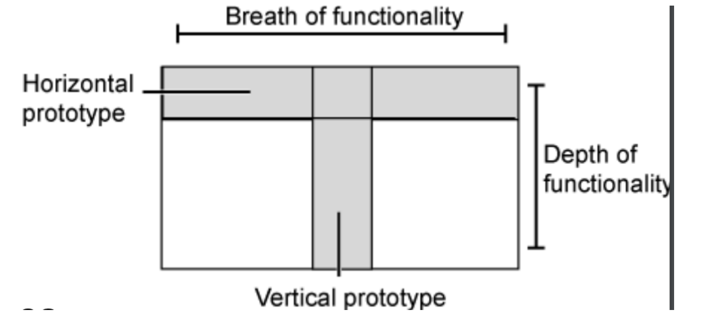
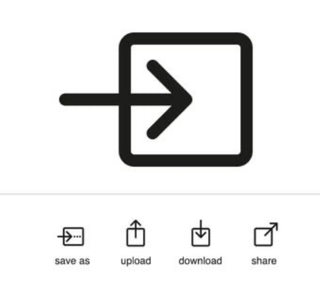
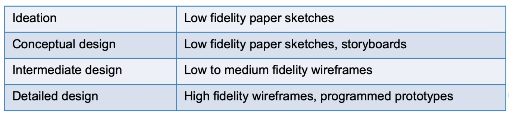

# Prototyping Fidelity and Dimensions 原型, 保真度和尺寸

## Fidelity in Prototyping 原型设计中的保真度

**Q**: Are we using the low- or high-fidelity prototype if we used the colored UI/operable interface/coding…?

问：如果使用彩色用户界面/可操作界面/编码......，我们使用的是低保真原型还是高保真原型？

**A**: There is **no clear separations**! But we do have measures from different perspectives.

答：没有明确的分隔, 但我们确实有来自不同 	 角度的措施。

### fidelity is a spectrum 光谱保真度

是不是可以考虑吧一条纯色的线条或者形状修改为使用渐变颜色

### Remember the compromise! 有些时候需要妥协

- **Neither** of these is inherently **good or bad**. 

  选择高保真或者低保真没有本质上的 **好或坏**。

- There are **costs and trade-offs** with raising or lowering fidelity in any dimension. 

  在任何维度中提高或降低保真度都需要 **成本和权衡** 。

- The path you take as the designer to get from the first image to the last is **up to you to determine.**

  作为设计师，您从第一张图像到最后一张图像的路径由您决定。

实际上在第四周的要求中我们在做一个 **低保真度** 的蓝图模板，但是最终的作业需要是一个 **高保真度** 的成品

### 要提前考虑使用什么保真度

- We’re **wasting time and sanity** with imprecise language about fidelity.

  如果使用低保真度，那么我们实际上 **需要花费更多的时间和精力** 来通过语言解释我们的项目

- Even worse, we risk falsely validating one thing today and failing to validate a better way tomorrow. 

  更糟糕的是，我们有可能今天错误地验证了一件事 而明天却无法验证更好的方法。

- Teams are prone to over-engineering a prototype prematurely, leading to wasted effort. In other words, a prototype may be low fidelity except for one crucial dimension that may require quality and fidelity at near-production levels to validate fairly.

  团队很容易过早地对原型进行过度设计，导致精力浪费。换句话说，原型的保真度可能很低，只有一个关键维度需要接近生产水平的质量和保真度才能进行公平验证。

## Dimensions 维度

### Five dimensions in prototyping 原型制作的五个维度

- **Visual:** How real does it look?

  **视觉：** 它看起来有多真实？

- **Interaction:** How real does it feel?

  **互动：** 交互有多真实？

- **Breadth:** To what degree is this the whole or just a part?

  **广度：** 这是整体还是部分？

- **Depth:** At a given level of breadth, to what degree is the user constrained*?*

  **深度：** 在给定的广度水平上，用户在多大程度上受到限制*？

- **Content:** How real is the stuff and is it contextual to the user?

  **内容：** 内容的真实性如何？

#### Dimensions - Visual fidelity 视觉保真度

“I’ll know it when I see it. I can see what you’ve done there and I like it.”

- We judge books by their **covers**, even when we’re told not to — because we can’t help it.

  我们通过书籍的 **封面** 来评判书籍，即使我们被告知不要这样做——因为我们通常是潜意识的。

- It is the **most direct dimension** that user feels about the prototype

  视觉表现是用户对原型的 **最直接的维度**

Refers to the devotion and granularity put into the design for **visual interfaces and physical objects**

指设计**视觉界面和对象时的输入水平和粒度**

- In early stages, the visual fidelity are rather low, so users will focus on the **actions/procedures/concepts**..

  在早期阶段，视觉保真度相当低，因此用户将 **专注于动作/过程/概念**..

- In later stages, it should be higher to test the **accessibility/touch/visual details**…

  在后期阶段，应该会更高来测试 **辅助功能/触摸/视觉细节......**

- The **big, obvious problem** involves **jumping to high visual fidelity too early** in the process.

  在此过程中涉及大而明显的问题会导致过早地跳到高视觉保真度。  

  - There’s a feeling that when something looks done, it must be done.

    人们常常会有一种“强迫症”，当一件事看起来已经完成时，它就必须完成。

- Just because a designer **is capable of prototyping fairly quickly** at high visual fidelity **does not make it the right decision**. 

  仅仅因为设计师能够相当快地以高视觉保真度制作原型并不代表这一定是正确的决定。

  - Designers should sometimes intentionally keep visual fidelity low to encourage the kind of communication and feedback they want

    设计师有时应该有意保持较低的视觉保真度，以鼓励他们得到想要的那种沟通和反馈

#### Dimensions - Interaction fidelity 交互保真度

**“I’ll know how what is the feedback if I click/tap/swap**

- **InVision** lets anyone stitch screens together to increase interaction fidelity. **Balsamiq** has screen-linking capabilities that combine with a low-visual-fidelity component library.

  **InVision** 允许任何人将屏幕“连接”在一起，以提高交互保真度。**Balsamiq** 具有与低视觉保真度组件库相结合的屏幕链接功能。

Refers to the objective degree of **exactness with which real-world interactions can be reproduced**

指可以复现现实世界交互的 **精确性** 的客观程度

- Users can **click, tap, and swipe** through screens and **get the feel**. 

  用户可以 **点击、点按和滑动** 屏幕并 **获得反馈体验**。

- It allowed the team to **quickly and cheaply test hundreds of variations.**

  它允许团队 **快速、廉价地测试数百种变体**。

Example:

- **The palm pilot**

  掌上飞行员

  - The most creative use of a chopstick

    最有创意的筷子用途

  - Imagine the era that there is no smart phone

    在没有智能手机的时代

  - How would design and test **the way how people use portable computers**

    如何设计和测试 人们使用便携式计算机的方式

#### Dimensions - Breadth fidelity 尺寸保真度

**Let’s say we wanted to redesign Amazon.com. Where would we start?**

假设我们想重新设计 Amazon.com。我们从哪里开始呢？

- Should we just start by prototyping the home page and checkout pages? 

  我们是否应该从制作主页和结账页面的原型开始？

- What about product pages, search results, filtering, or wish list pages? 

  那么产品页面、搜索结果、筛选或愿望清单页面呢？

- **Amazon.com is huge**. Choosing where to draw the lines of your prototype’s edges sets up its **breadth**.

  亚马逊网站本身很复杂，但是可以选择你要进行修改和编辑的蓝图设计的边界

Simply speaking, it refers to **the number of features covered.**

简而言之，它指**涵盖的功能数量**。

- Sometimes you will want to prototype it all. Sometimes you should avoid most of the product’s surface area because it can’t change anyway. 

  有时，您会想要全部原型。有时你应该避免产品的大部分表面区域，因为无论如何都无法改变。

- It’s up to you to decide because **the entry and exit points** to your redesign may matter more than you think.

  这取决于您的决定，因为重新设计的**入口和出口**可能比您想象的更重要。

#### Dimensions - Depth fidelity 深度保真度

Imagine that this time, we’re prototyping a voice assistant (e.g., Siri, Alexa).

想象一下，这一次我们正在制作一个语音助手（如 Siri、Alexa）的原型。

- Pretend we **limited the breadth** of our voice assistant prototype to a single domain: **weather**. 

  假设我们将语音助手原型的范围**限制在一个领域： **天气 

- If I can ask about **anything at all related to weather** and get a response, that’s high depth fidelity — in other words, it’s **deep**. 

  如果我能询问**任何与天气有关的问题**并得到答复，这就是高深度保真度--换句话说，这就是**深度**。

- If I can only inquire about forecasts in major cities, that’s less depth. If I can ask only about my current location’s temperature, that’s even lower

  如果我只能查询主要城市的天气预报，那深度就更低了。如果我只能查询我当前所在位置的温度，那就更低了

Simply speaking, it refers to **the degree of functionality.**

简而言之，它指功能程度。

- Remind yourself about depth by asking **if the interactions are shallow**. 

  通过询问互动是否肤浅来提醒自己注意深度。

- How **significant** are my constraint handcuffs?

  我的约束手段作用有多大

#### Dimensions - Depth fidelity

Simply speaking, it refers to **the degree of functionality.**

- Remind yourself about depth by asking **if the interactions are shallow**. 

- How **significant** are my constraint handcuffs?

### Dimensions - Breadth and Depth

#### Dimensions - Content fidelity

**“No one reads the user notice.”**

没有人会去花时间读用户注意事项

- Content is the **king**. The video, the data, and the names of their teams are what customers care about in our tools.

  内容为“王”，用户客户关心的是视频、数据和团队名称。

- Make good decisions in showing **the right content** in prototypes

  在展示正确的内容时做出很好的决定

Refers to the **degree of realism** for the content.

指内容的贴近现实的程度。

- Imagine your prototype about serious recruitment apps with fake names as SpongeBob

  试想一下，你关于严肃招聘应用程序的原型是海绵宝宝

- The content fidelity will impact on the feedback from users

  内容保真度将影响用户的反馈

Have you ever confused someone with **lorem ipsum** when you hoped they would comment on your impeccable use of negative space?

当你希望别人对你无懈可击的负面空间用法发表评论时，你是否曾用 **lorem ipsum** 迷惑过别人？

#### Other Dimensions

- **Autonomy**:
  
  - operates alone vs requires “supervision” 
  
    单独操作与需要“监督”
  
- **Platform**:
  
  - interim vs. final implementation
  
    临时与最终应用

### Important Lesson

- it is **COMPLICATED** (slow, expensive) to prototype multiple dimensions at once.

  一次构思多个维度的原型是**复杂**（缓慢，昂贵）的。

  - so don’t. Instead: modularity of prototyping. 

    所以不要这样做，而是：模块化原型。

- Each prototyping tool has **strengths and weaknesses** 

  每个原型工具具有优点和劣势

  - may be better (more efficient and capable) for some of these prototyping dimensions than others.

    在某些原型设计方面可能比其他方面更好（更有效、更有能力）。

  - you may need multiple tools throughout your design’s life cycle.

    在设计的整个生命周期中，你可能需要多种工具。

## Physical Design 物理设计

### Getting concrete (vs. conceptual design) 具体化（与概念设计相比）

- Considers **more concrete, detailed issues** of designing the interface

  考虑设计界面中**更具体、更详细的问题**

- **Iteration** between physical and conceptual design

  物理设计和概念设计之间的 **迭代**

- Guidelines for physical design

  物理设计指南

- Nielsen’s heuristics

  尼尔森启发法

- Shneiderman’s eight golden rules

  施奈德曼的八条黄金法则

- Styles guides: commercial, corporate decide ‘look and feel’ for your widgets prescribed, e.g., icons, toolbar

  风格指南：商业、企业风格，决定小部件的 "外观和感觉"，如图标、工具栏等。

### Getting concrete  获取具体信息

- **Different kinds of widget (dialog boxes, toolbars, icons, menus etc.)**

  **不同类型的部件（对话框、工具栏、图标、菜单等）**

  - menu design

    菜单设计

  - icon design
  
    图标设计
  
  - screen design
  
    屏幕设计
  
  - information display
  
    信息内容设计

#### Menu Design 菜单设计

如果把所有的选项链接都直接丢在首页展示，那么新用户很难发现自己想去的地方应该通过哪个链接前往

- **How long** is the menu to be?

  菜单应该有多长

- **In what order** will the items appear?

  菜单中的选项应该怎么排列或者展示

- How is the menu to be **structured**, e.g., when to use sub-menus, dialog boxes?

  菜单如何 **结构化**，例如，何时使用子菜单、对话框？

- **What categories** will be used to group menu items?

  **哪些类别** 将用于对菜单项进行分组？

- How will **division into groups** be denoted, e.g., different colors, dividing lines?

  如何表示 **组的划分** ，例如，不同的颜色、分割线？

- **How many** menus will there be?

  **会有多少**菜单？

- **What terminology** to use? (results of requirements activities will indicate this,remember **the project about climbing**!)

  **使用什么术语**？（需求活动的结果会说明这一点，记住 **关于攀岩的项目** ！）

- How will any **physical constraints** be accommodated, e.g., mobile phone?

  如何适应任何 **物理限制**，例如手机与电脑之间的现实差异？

#### Icon Design 图标设计

- Good icon design is **difficult**

  好的图标设计是 **困难的**

- Meaning of icons is **cultural and context sensitive**

  图标的含义是 **文化和上下文敏感的**，也就是能否符合绝大部分人的第一印象

- Some tips: 

  - always draw on **existing traditions or standards**

    始终借鉴 **现有的传统或标准**

  - **concrete objects or things** are easier to represent than actions

    图标使用**具体物体或事物** 比动作更容易表示

#### Screen Design 屏幕设计

- Two aspects:

  - **How to split across screens**

    **如何跨屏幕划分页面**

    - moving around within and between screen show much interaction per screen? serial or workbench style?

      在屏幕内和屏幕之间移动显示每个屏幕的交互量？串行还是工作台风格？

  - **Individual screen design**

    个人屏幕设计

    - white space: balance between enough information/interaction and clarity

      空白：足够的信息/交互与清晰度之间的平衡

    - grouping items together: separation with boxes? lines? colors?

      是否考虑将项目分组：用方框、线条、颜色分隔？

##### Splitting functions across screens  跨屏幕分割功能

- **Task analysis** as a starting point

  **以任务分析**为起点

  - Each screen contains a single simple step?

    每个屏幕都包含一个简单的步骤？

  - **Frustration** if too many simple screens

    如果有太多只包含简单功能的的页面，用户**会感到沮丧**

- Keep **information available**

  每一个屏幕页面需要提供足够可用的信息

  - multiple screens open at once

    可以同时打开多个屏幕页面

##### individual screen design 个性化屏幕设计

- Draw **user attention** to **salient point**, e.g., colour, motion, boxing (Visibility?)

  将 **用户注意力** 吸引到 **突出点**，例如颜色、动作、框（可见性？)

  - **Animation** is very powerful but can be distracting

    **动画**非常强大，但可能会分散注意力

  - **Good organization** helps: grouping, physical proximity

    **良好的组织能力** 有助于：分组、物理上接近

- **Trade off** between sparse population and overcrowding

  在稀少人口和过度拥挤之间进行 **权衡**

#### Information display 信息展示

- **Relevant** information available at all times

  **相关信息随时可用**

- Different types of information imply **different kinds of display**

  不同类型的信息暗示 **不同种类的显示**

- **Consistency** between paper display and screen data entry

  纸张显示和屏幕数据输入之间的 **一致性** （例如电脑的快捷键提示贴纸信息和实际使用保持不变）

## Tips for Prototyping 蓝图建议

### What type of Prototyping 蓝图的类型

- **throw-away**

  丢掉

  - prototype only serves to elicit user reaction 

    原型只是为了引起用户的回应

  - creating prototype must be rapid, otherwise too expensive

    创建原型必须迅速，否则成本太高

- **incremental**

  递增式开发

  - product built as separate components (modules) 

    作为独立组件（模块）构建的产品

  - each component prototyped and tested, then added to the final system 

    每个组件都经过原型设计和测试，然后添加到最终系统中

- **evolutionary**

  分析评估

  - prototype altered to incorporate design changes

    修改原型以纳入设计更改

  - eventually becomes the final product

    最终成为交付产品

- **Progress prototype fidelity** during the design life cycle to… 

  **在设计生命周期中提高原型保真度** 以...

  - Understand the **ecological (low), interactive, and emotional perspectives (high)** and to …. 

    理解 **生态 （低）、互动和情感 （高）** 并 ....

  - Focus on **behavior first then appearance**

    注重**先表现方式后外表样式**

### Cautions 注意事项

- **Rationalize cost-value tradeoffs**

  **合理化成本-价值权衡**

- **Do not oversell** - capabilities that can’t be delivered, development completeness 

  **不要过度推销** - 无法交付的功能、开发的完整性

- **Do not overbuild** – “good enough” as a prototype 

  **不要过度构建** – “足够好”作为原型

- Decide early on **exploratory or evolutionary** prototypes

  尽早决定**探索性或进化性**原型

### Activities 活动

- discuss the following questions for your own projects: 

  针对您自己的项目讨论以下问题：

  - what are the **main challenges** that your prototype **means to solve**? 

    您的原型 **打算解决的 ** **主要挑战** 是什么？

  - **what fidelity seems right** for your prototype? 

    **哪种保真度适合您的原型？**

  - **what dimensions** you need to consider? 

    您需要考虑的 **哪些尺寸** ？

  - what are some **possible tools** for your project? what are the **tradeoffs**?

    您的项目有哪些 **潜在使用的工具**？ 什么是 **权衡**？

## Take-aways 采取行动

### Summary

- No “low fidelity” versus “high fidelity” in a generic way. Instead, refer to the **primary dimensions** and why they matter for your prototype. 

  没有通用方式的“低保真度”与“高保真度”。相反，请参阅 **主要维度** 以及它们对原型的重要性。

- Ask yourself **if you are controlling the less obvious dimensions**. Will any of them create an unintended distraction or hindrance during your tests?

  问问自己 **您是否正在控制不太明显的尺寸**。它们中的任何一个会在您的测试期间造成意外的干扰或阻碍吗？

- **The levels** of each dimension.

  每个维度的 **级别** 。

- Articulate how your **prototype connects to your key research questions**.

  阐明您的 **原型 如何与您的关键研究问题**相关联。

- Ask if you’re **picking the right fidelity** to answer those questions fairly and efficiently.

  询问您是否 **选择了正确的保真度** 来公平有效地回答这些问题。

- **Different kinds of prototyping** are used for different purposes and at different stages

  **不同种类的原型设计** 用于不同的目的和不同的阶段

- Prototypes **answer questions**, so prototype appropriately

  原型会被用来 **回答问题**，所以要适当地制作原型

- **Physical design**: e.g., menus, icons, screen design, information display

  **物理设计**：例如菜单、图标、屏幕设计、信息显示

- Prototypes and scenarios are used **throughout design**

  在整个设计过程中**使用原型和方案**

