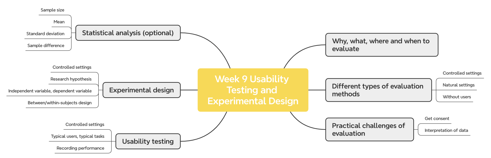
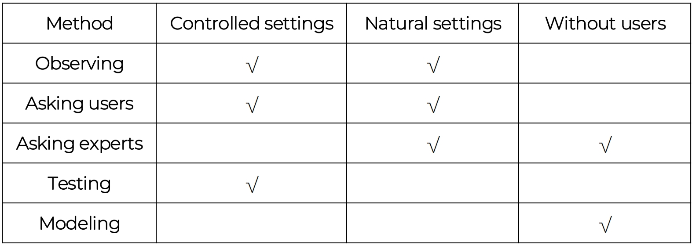
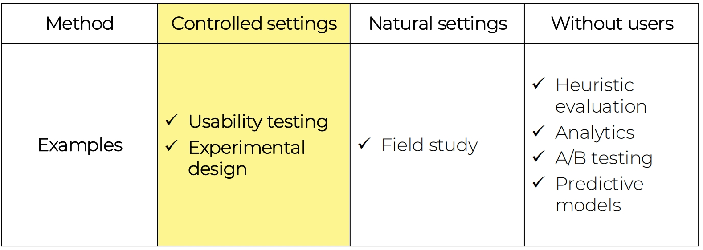
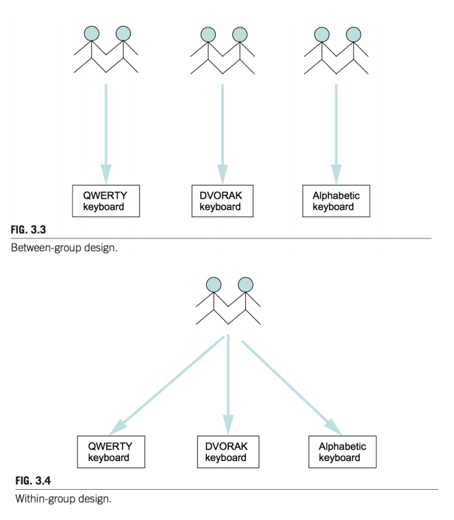
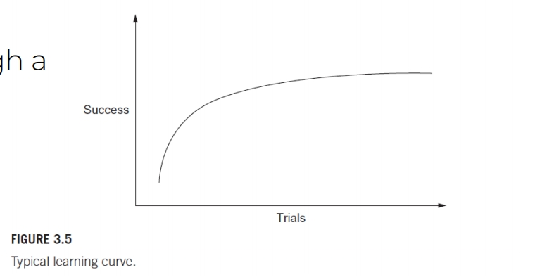

# Usability Testing and Experimental Design 可用性测试和实验设计

考试会检查对 evaluation method 的理解

## Outcomes

1. Understand the **why, what, where and when** of evaluation

   了解评估的  **原因、内容、地点和时间** 

2. Introduce a range of different types of **evaluation methods**

   引入一系列不同类型的  **评价方法** 

3. Discuss some of the **practical challenges** of doing evaluation

   讨论进行评估时的一些  **实际挑战** 

4. Explain how to do **usability testing**

   解释如何进行  **可用性测试** 

5. Outline the basics of **experimental design**

   概述  **实验设计的基础知识**

## Why, what, where and when to evaluate

**Iterative design and evaluation is a continuous process.**

- **Why**: To **check** users’ requirements and **confirm** that users can utilize the product and that they like it

  **为什么**：检查用户的需求，确认用户可以使用该产品并且喜欢它

- **What**: A **conceptual model**, early and subsequent **prototypes** of a new system, more **complete prototypes**, and a prototype to compare with **competitors’ products**

  内容：**概念模型**、新系统的 **早期和后续原型**、更多 **完整原型** 以及与 **竞争对手产品** 进行比较的原型

- **Where**: In **natural**, **in-the-wild**, and **laboratory** settings

  地点：在 **自然**、**野外** 和 **实验室** 环境中

- **When**: **Throughout design**; finished products can be evaluated to collect information to inform new products

  何时：**贯穿整个设计**；可以对成品进行评估，以收集信息为新产品提供信息

### HCI Research Methods and Measurement HCI研究方法和衡量标准

- Early days HCI research measurements were based on human **performance (task-based)** 下面这些都是 Micro-HCI

  早期HCI研究测量基于人类**绩效（基于任务）**

  - How fast could someone complete a task?

    某人能以多快的速度完成任务？

  - How many tasks were completed successfully?

    成功完成了多少任务？

  - How many errors were made?

    犯了多少错误？

  - Time performance

    时间性能

  - Task correctness / accuracy

    任务正确性/准确性

  - Error rate

    错误率

  - Time to learn and retention over time

    学习和记忆的时间

  - User satisfaction

    用户满意度

- Marco-HCI

  - Motivation

    动机

  - Collaboration

    合作

  - Social participation

    社会参与度

  - Trust

    信任度

  - Empathy

    同理心

## Different types of evaluation methods 不同类型的分析方法

### Types of evaluation methods 分析方法

1. **Controlled settings** that directly involve users 

    直接涉及用户的 **受控设置** 

   - For example, usability and research labs

     例如，可用性和研究实验室

2. **Natural settings** involving users 

   涉及用户的 **自然设置**

   - For instance, online communities and products that are used in public places

     例如，在公共场所使用的在线社区和产品

   - Often there is **little or no control** over what users do, especially in in-the-wild settings

     通常，对用户的行为 **很少或根本没有控制权** ，尤其是在野外环境中

3. Any setting that **doesn’t directly involve users** 

   - For example, consultants and researchers critique the prototypes, and may predict and model how successful they will be when used by users

Example:

## Practical challenges of evaluation 评估的实际挑战

### Participants’ consent 参与者同意

确保信息的收集是 **ethical** 的。

下面的这两个标粗的内容主要是用来提前告知用户信息收集符合要求，并有人监督。

- Participants need to be told why the evaluation is being done, what they will be asked to do and informed about their rights

  需要告诉参与者为什么要进行评估，他们将被要求做什么，并被告知他们的权利

- **Informed consent forms** provide this information and act as a contract between participants and researchers

  **知情同意书** 提供此信息，并充当参与者和研究人员之间的合同

- The design of the informed consent form, the evaluation process, data analysis, and data storage methods are typically approved by a high authority, such as the **Institutional Review Board**
  
  知情同意书的设计、评估过程、数据分析和数据存储方法通常由上级机构批准，例如 **机构审查委员会**
  
  - Example: XJTLU University Ethics Committee (UEC)

### Interpreting data 解释数据

- **Reliability**: Does the method produce the same results on separate occasions?

   **可靠性** ：该方法在不同情况下是否能够得到相同的结果？

- **Validity**: Does the method measure what it is intended to measure?

  **有效性**： 该方法是否测量它原本就预期测量的内容？

- **Ecological validity**: Does the environment of the evaluation distort the results?

  **生态效度**：评价的环境是否会扭曲或干扰结果？

- **Biases**: Are there biases that distort the results?

   **偏差** ：是否存在扭曲结果的偏差？

- **Scope**: How generalizable are the results?

  **范围**：结果的可推广性如何，是否 general 或者受众群体是那些？

## Usability testing 可用性测试

- **Controlled** settings 

   **受控**  设置

- Users are observed and timed

  用户被观察和计时

- Data is recorded on video, and key presses are logged

  数据被记录在视频中，按键被记录下来

- The data is used to calculate performance times and to identify and explain errors

  这些数据用于计算性能时间，并识别和解释错误

- **User satisfaction** is evaluated using questionnaires and interviews

  **用户满意度**通过问卷调查和访谈进行评估

- Field observations may be used to provide **contextual understanding**

  实地观察可用于提供  **背景了解** 

- Involves recording **performance** of **typical users** doing **typical tasks**

  涉及记录 **典型用户** 执行 **典型任务** 的 性能

### Quantitative performance measures 量化性能指标

- **Number** of users successfully completing the **task**

  成功完成  **任务**  的 **用户数** 

- **Time** to complete **task**

  完成 **任务** 花费的 **时间**

- **Time** to complete task after time away from **task**

  离开 **任务** 一段时间后完成任务的 **时间**

- **Number** and type of errors per **task**

  每种 **任务** 出现的 **错误类型**

- **Number of errors** per unit of time

  每单位时间的 **错误数**

- **Number of navigations** to online help or manuals

  在线帮助或手册的 **导航搜索数量**

- **Number of users** making a particular type of error

   发生 **特定类型错误** 的用户数量 

- Count and calculate **data**

  统计并计算 **数据**

### Usability testing conditions 可用性测试条件

- Usability lab or other controlled space

  可用性实验室或其他受控空间

- Emphasis on:
  
  强调
  
  - Selecting **representative users**
  
    选择  **代表用户** 
  
  - Developing **representative tasks**
  
    制定 **代表性任务**
  
- 5-10 users typically selected

  通常选择5-10个用户

- Tasks usually around 30 minutes

  任务通常在30分钟左右

- **Test conditions are the same** for every participant

  每个参与者的 **测试条件都是相同的**

- **Informed consent form** explains procedures and deals with ethical issues

  **知情同意书** 解释程序并处理道德问题

### How many participants is enough 多少人参加才够

- The number is a practical issue

  参与人数是一个非常实际的问题

- Depends on:

  取决于

  - Schedule for testing

    测试时间安排

  - Availability of participants

    参与者的可用性

  - Cost of running tests

    运行测试的成本

- **Typically 5-10 participants** 

  一般5-10人 

  - Some experts argue that testing should **continue until no new insights are gained**

    一些专家认为，测试应该持续进行，**直到无法从中获得新的见解**

#### Example: System Usability Score (SUS) 常见的用户实用性测试评估

1. I think that I would like to use this system frequently.

   我想我会经常使用这个系统。

2. I found the system **unnecessarily complex**.

3. I thought the system was easy to use.

4. I think that I would **need the support of a technical person** to be able to use this system.

5. I found the various functions in this system were well integrated.

6. I thought there was **too much inconsistency** in this system.

7. I would imagine that most people would learn to use this system very quickly.

8. I found the system **very cumbersome** to use.

9. I felt very confident using the system.

10. I **needed to learn a lot of things** before I could get going with this system

如果使用这种方法，需要首先确保只对那些有意义的数据进行评估（如果有的用户全选择了"Strongly agree" 或者 “strongly disagree”）。并且需要指定统一的打分标准，例如统一都是从0~5.

To calculate a score between 0 and 100 for the product:

要计算产品在0和100之间的分数，请执行以下操作：

- Convert SUS responses to numbers, 1 for “Strongly Disagree”, and 5 for “Strongly Agree”.

  将SUS响应转换为数字，1表示“非常不同意”，5表示“非常同意”。

- For odd-numbered questions, subtract 1 from the response.

  对于奇数问题，得分 = 原始分 - 1。

- For even-numbered questions, subtract the response from 5.

  对于偶数问题，得分 = 5 - 原始分。

- Add the scores from each question and multiply the total by 2.5.

  将所有题目转换后的得分相加 × 2.5 → **总分范围0~100**。

- Remember to present the **numbers** as a SUS score, not a **percentage**. Based on research, a SUS score **above a 68** would be considered **above average** and anything below 68 is below average, however the best way to interpret your results involves “normalizing” the scores to produce a percentile ranking.

  请记住将  数字  表示为SUS分数，而不是  百分比 。根据研究，SUS分数  **高于68 将被视为**  高于平均水平 ，**低于68** 的任何分数都低于平均水平，但是解释结果的最佳方法是将分数 **“标准化”** 以产生百分位排名。

#### More Examples of Established Questionnaires 更多的问卷案例

- Questionnaire for User Interface Satisfaction (QUIS)
- Software Usability Measurement Inventory (SUMI)
- Visual Aesthetics of Website Inventory (VisAwi)
- NASA Task Load Index (NASA TLX)
- Computer System Usability Questionnaire (CSUQ)

### Usability Testing and Experiments 可用性测试和实验

- Usability testing is applied experimentation

  可用性测试是应用实验

- Developers check that the system is **usable** by the intended user population by collecting data about participants’ **performance** on prescribed **tasks**

  开发人员通过收集参与者在规定的任务上的  **表现**  的数据，检查系统是否对预期的用户群体可用 

- Experiments test **hypotheses** to discover new knowledge by investigating the **relationship** between two or more **variables**

  实验通过调查两个或多个 **变量** 之间的 关系 来检验 **假设** 以发现新知识

#### Usability Testing

- Improve **products**

  改进 **产品**

- Few participants

  少量的参与者

- **Results inform design**

  结果为设计提供信息

- Usually not completely replicable

  通常不能完全复制

- Conditions controlled as much as possible

  尽可能控制条件

- **Procedure planned**

  计划程序

- Results reported to developers

  向开发人员报告结果

#### Experiments for Research

- Discover **knowledge**
- Many participants

- Results validated statistically 

- Must be replicable
- Strongly controlled conditions
- Experimental design
- Scientific report to scientific community

## Experimental design 研究设计

- Test **hypothesis**

  针对测试提出的假设

- Predict the **relationship** between two or more **variables**

  预测两个或多个  **变量**  之间的  **关系** 

- **Independent variable** is manipulated by the researcher

  **自变量** 被研究人员控制

- **Dependent variable** influenced by the independent variable

  **因变量 **受自变量影响

- Typical **experimental designs** have one or two independent variables

  **典型的实验设计** 有一个或两个（少量的）自变量

- Validated statistically and replicable

  经过统计验证且可复制

### Research Hypotheses 针对研究提出假设

- An experiment normally starts with a **research hypothesis**

  实验通常以 **研究假设** 开始

- A hypothesis is **a precise problem statement that can be directly tested through an empirical investigation**

  假设是一个精确的问题陈述，可以通过实证调查直接检验 

#### Type of Hypotheses 假设的类型

- **Null hypothesis**: typically states that there is **no difference** between experimental treatments

  **零假设**：通常表示实验治疗之间没有差异

- **Alternative hypothesis**: a statement that is mutually exclusive with the null hypothesis

   **备择假设** ：与原假设互斥的陈述

- The **goal** of an experiment is to find statistical evidence to **reject the null hypothesis** in order to **support the alternative hypothesis**

  实验的目标是找到统计证据来 **拒绝原假设**，以 **支持备选假设**

Example:

- H0: There is **no difference** in academic performance between students who are in a relationship and those who are not.

  H0：谈恋爱和不谈恋爱的学生在学习成绩上 **没有差异** 。

- H1: There is **a difference** in academic performance between students who are in a relationship and those who are not.

  H1：谈恋爱的的学生和没有谈恋爱的学生在学习成绩上有 **差异** 。

### Experimental designs 实验设计

- **Between subjects design** 

  主体间设计

  - Different participants 

    不同参与者

  - Single group of participants is allocated randomly to the experimental conditions

    将一组参与者随机分配到实验条件下

- **Within subjects design**

  主题内设计

  - Same participants

    相同的参与者

  - All participants appear in both conditions

    所有参与者都出现在这两种情况下

| Design           | Advantages                                 | Disadvantages                                        |
| ---------------- | ------------------------------------------ | ---------------------------------------------------- |
| Between-subjects | No order effects                           | Many subjects and individual difference is a problem |
| Within-subjects  | Few individuals, no individual differences | Counter-balancing needed because of ordering effects |

### Good Practices

- **Counterbalancing** condition orders through a **Latin Square Design**.

  通过 **拉丁方设计** 平衡条件订单。

  - A B C D
  - D A B C
  - C D A B
  - ?

- Provide sufficient **training time** for users to get acquainted with a system to eliminate the learning effect

  为用户提供足够的 **培训时间**，以熟悉系统，消除学习效果

- A single experiment session should be 60-90 minutes or shorter (Nielson, 2005)

  单次实验时间应为 **60-90分钟** 或更短（Nielson，2005）

### Experimental design lifecycle

1. Identify a research **hypothesis**

   确定一项 **研究假设**

2. Specify the **design** of the study

   指定研究的设计

3. Run a **pilot study** to test the design, the system, and the study instruments

   进行 **试点研究**，测试设计、系统和研究仪器

4. Recruit participants

   招募参与者

5. Run the **actual data collection sessions**

   运行 **实际数据收集会话**

6. Analyze the data

   分析数据

7. Report the results

   报告结果

### Experiment Procedure (Data Collection)

1. Preparation

   准备

2. Greet participants

   问候与会者

3. Introduce the purpose of the study and the procedures

   介绍研究目的和程序

4. Get consent

   获得同意

5. Assign participants to a specific experiment condition 

   将参与者分配到特定的实验条件

6. Training task(s)

   训练任务

7. Actual task(s)

   实际任务

8. Participants answer questionnaires (if any)

   参与者回答问卷（如有）

9. Debriefing session

   汇报会

10. Payment (if any)

    付款（如有）

## Statistical analysis  统计分析

### Statistical Analysis Exercise  统计分析练习

Given the sample data: {5, 5, 4, 3, 4, 1, 5, 4, 4, 4}

- What is the sample size? 

  样本量是多少？

- **=COUNT(B2:B11)**

- What is the mean value?

  平均值是多少

- **=AVERAGE(B2:B11)**

- What is the standard deviation?

  标准差是多少

- **=STDEV.S(B2:B11)** （Standard Deviation：数字越小代表变化越小，越稳定）

Given another sample data: {4, 4, 2, 5, 5, 3, 2, 1, 3, 3}

- How do the two samples differ?

  这两个样品有何不同？

- **F-test** to check variances, then **t-Test**.

  F-test检查差异，然后t-test。

- There is **no significant difference** between the two samples.

  两个样本之间  无显著差异 。