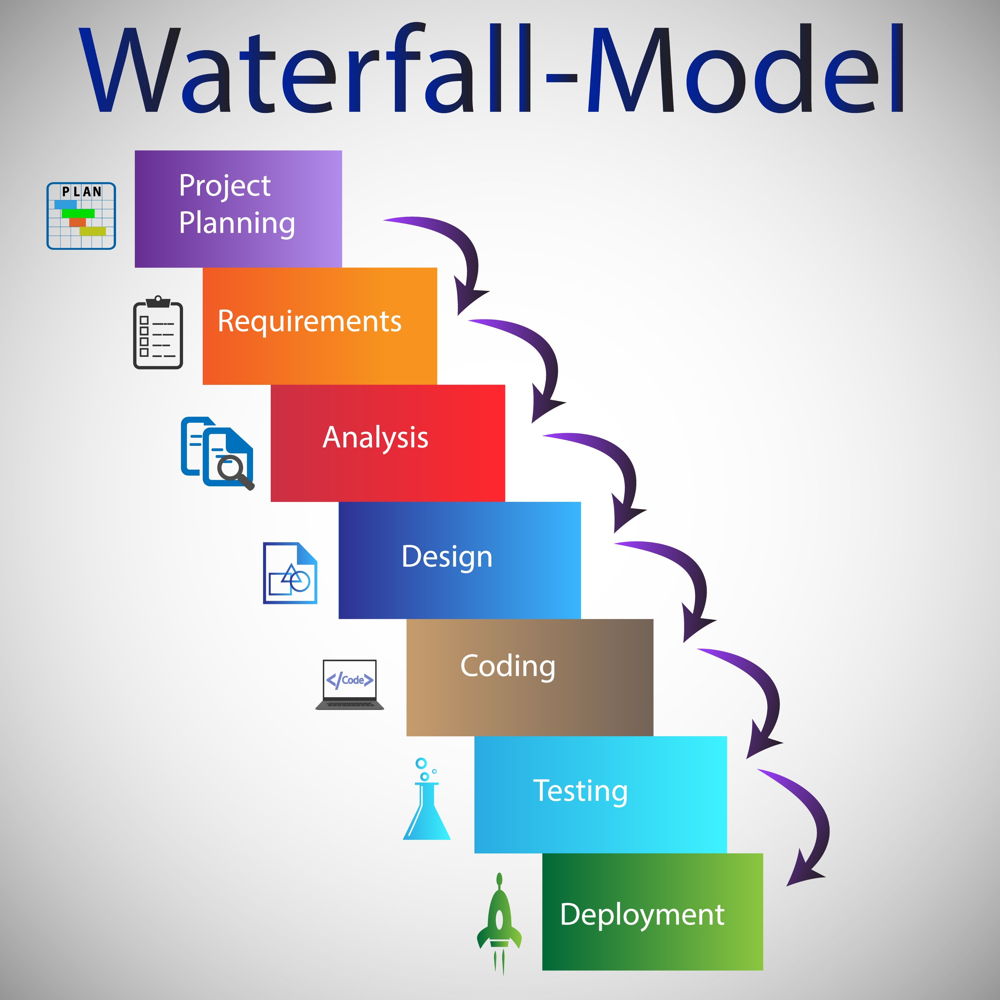

# 10 Open Source Development

## 知识图谱

```plaintext
Week 10 Open Source Development
├── 1. Introduction 开源开发导论
│   ├── 1.1 Definition of Open Source Software
│   │   ├── Source code is released under a license
│   │   ├── Users can study, change, and distribute the software
│   │   ├── Anyone can use it for any purpose
│   │   └── Contrast: Proprietary Software
│   │       ├── Source code hidden
│   │       ├── Restrictive copyright
│   │       └── Limited user rights
│   │
│   ├── 1.2 Historical Context
│   │   ├── 1960s–1970s: Hacker culture
│   │   ├── 1980s: Free Software Movement
│   │   │   └── Richard Stallman
│   │   └── 1990s: Internet and Web growth
│   │       └── Open Source Initiative, OSI, founded in 1998
│   │
│   └── 1.3 The Cathedral and the Bazaar
│       ├── Published by Eric S. Raymond in 1997
│       ├── Uses Linux kernel as case study
│       ├── Argues open source can produce high-quality software
│       ├── Cathedral Model
│       │   └── Centralized and authoritative
│       └── Bazaar Model
│           └── Decentralized and highly collaborative
│
├── 2. Cathedral Model 大教堂模式
│   ├── 2.1 Characteristics
│   │   ├── Closed and centralized development
│   │   ├── Limited developer access
│   │   └── Long release cycles
│   │
│   ├── 2.2 Advantages
│   │   ├── Strong control over development
│   │   ├── Better consistency with original design
│   │   ├── Easier security control
│   │   └── Easier quality management
│   │
│   └── 2.3 Limitation
│       ├── Limited user feedback
│       ├── Limited external contribution
│       └── Lower adaptability to changing needs
│
├── 3. Bazaar Model 集市模式
│   ├── 3.1 Characteristics
│   │   ├── Open and decentralized development
│   │   ├── Public source code
│   │   ├── Large developer community
│   │   └── Rapid iteration and release cycles
│   │
│   ├── 3.2 Advantages
│   │   ├── Diverse contributions
│   │   ├── More innovation
│   │   ├── Faster adaptation to user needs
│   │   └── Quick bug fixing
│   │       └── Linus’s Law:
│   │           Given enough eyeballs, all bugs are shallow
│   │
│   ├── 3.3 Limitation
│   │   ├── Quality assurance challenges
│   │   ├── Difficult coordination
│   │   └── Hard to maintain consistent architecture
│   │
│   └── 3.4 Examples
│       ├── Linux kernel
│       ├── Python
│       └── Apache software projects
│
├── 4. Key Principles of Open Source Development
│   ├── 4.1 Meritocracy and Community-driven Development
│   │   ├── Decision power depends on contribution
│   │   ├── High-quality code is valued
│   │   └── Active contributors gain influence
│   │
│   ├── 4.2 User Feedback and Iterative Improvement
│   │   ├── Users are not only passive recipients
│   │   ├── Users can report bugs
│   │   ├── Users can suggest features
│   │   ├── Users can submit patches
│   │   └── Continuous feedback improves software
│   │
│   ├── 4.3 Transparency and Collaboration
│   │   ├── Development process is visible
│   │   ├── Knowledge sharing
│   │   ├── Mutual learning
│   │   └── Trust building
│   │
│   └── 4.4 Licensing and Legal Considerations
│       ├── Licenses define use, modification, and distribution rights
│       ├── Licenses preserve openness
│       ├── Licenses protect contributors
│       └── Different licenses have different terms
│
├── 5. Case Studies of Open Source Projects
│   ├── 5.1 Linux Kernel
│   │   ├── Created by Linus Torvalds in 1991
│   │   ├── Thousands of global contributors
│   │   └── Foundation of Android, Ubuntu, and other systems
│   │
│   ├── 5.2 Python
│   │   ├── Developed in late 1980s
│   │   ├── Publicly available in 1991
│   │   ├── Popular because of simplicity and power
│   │   └── Managed by Python Software Foundation
│   │
│   ├── 5.3 Apache HTTP Server
│   │   ├── Maintained by Apache Software Foundation
│   │   ├── Supports many websites
│   │   └── Uses collaborative consensus-based development
│   │
│   └── 5.4 Lessons Learned
│       ├── Strong community is key
│       ├── Clear governance is important
│       └── Sustaining momentum is difficult
│           ├── Contributor burnout
│           ├── Lack of new contributors
│           └── Competition from other projects
│
├── 6. Social and Cultural Aspects
│   ├── 6.1 Community Building
│   │   ├── Users, developers, contributors form the community
│   │   ├── Community shapes project direction
│   │   └── Respect, inclusivity, openness, collaboration
│   │
│   ├── 6.2 Communication and Collaboration
│   │   ├── Mailing lists
│   │   ├── Forums
│   │   ├── Chat rooms
│   │   ├── Issue trackers
│   │   └── Global collaboration
│   │
│   ├── 6.3 Conflict Resolution
│   │   ├── Conflicts are common in decentralized communities
│   │   ├── Need fair and transparent process
│   │   └── Productive dialogue is important
│   │
│   ├── 6.4 Recognition and Reputation
│   │   ├── Contributions are publicly acknowledged
│   │   ├── Reputation comes from code and problem solving
│   │   └── Reputation can support career development
│   │
│   ├── 6.5 Learning and Mentorship
│   │   ├── New contributors learn from experienced contributors
│   │   ├── Learn coding
│   │   ├── Learn software development practice
│   │   └── Learn teamwork and problem-solving
│   │
│   └── 6.6 Diversity and Inclusion
│       ├── Encourage different backgrounds
│       ├── Bring broader ideas and perspectives
│       └── Improve project health and innovation
│
└── 7. Final Takeaway
    ├── Open source is not only a development method
    ├── It is also a philosophy
    ├── It promotes openness, collaboration, and shared learning
    └── It can support robust software, community, and innovation
```


## Topics

This lecture note provides an overview of open source development principles, drawing insights from "The Cathedral and the Bazaar" and related concepts to equip students with a deeper understanding of this important software engineering paradigm

本讲义概述了开源开发原则，借鉴了《大教堂与集市》及相关概念，旨在帮助学生深化对这一重要软件工程范式的理解。

- Introduction
- The Cathedral Model
- The Bazzar Model
- Key Principles of Open Source Development
- Case Studies of Open Source Projects
- The Social and Cultural Aspects of Open Source Development

## Introduction

Definition of **Open Source Software**

- Open-source software (OSS) is a type of computer **software** in which source code is released **under a license** in which the copyright **holder** grants users the rights to **study, change, and distribute** the software to anyone and for any purpose.

  开源软件是一种计算机软件类型，其依据许可协议发布源代码，版权持有人授予用户研究、修改和分发该软件的权限，且可向任何人、用于任何目的。

This is in contrast to **proprietary software**, where the software is under restrictive copyright and the source code is usually hidden from the users.

- **开源软件 (Open-Source Software)** 的定义
  - **核心权利**：版权持有人通过特定许可证授予用户研究、修改、分发源代码的权利。
  - **开放性**：这些权利面向任何人，且不限制使用目的。
- **对比：专有软件 (Proprietary Software)**：
  - **封闭性**：受到严格的版权保护，源代码通常对用户隐藏。
  - **限制性**：用户仅拥有有限的使用权，无法获知软件的内部运作机制。

Historical context of open source development

- The open source movement finds its roots in the early days of computing, with the hacker culture of the 1960s and 1970s.

- It was in the 1980s, with the advent of the Free Software Movement spearheaded by Richard Stallman, that the principles of **free** (as in freedom, not price) **software** started to be formulated and codified.

- However, it was not until the 1990s, with the emergence of the Internet and web, that open source started to gain significant traction, leading to the formation of the **Open Source Initiative** (OSI) in 1998.

- **萌芽阶段 (1960s - 1970s)**
  - 起源于早起计算机领域的“黑客文化”（hacker culture）
- **法理化阶段 (1980s)**：
  - **自由软件运动 (Free Software Movement)**：由 Richard Stallman 领导，确立了自由软件的原则。
  - **核心理念**：这里的“自由”是指**权利的自由** (Freedom)，而非价格的免费 (Free of charge)。
- **爆发与规范化阶段 (1990s)**：
  - **互联网的推动**：互联网和 Web 的兴起使开源获得巨大动力。
  - **OSI 的建立**：1998 年成立了开源促进会 (Open Source Initiative, OSI)，标志着“开源”这一术语的正式采用。

Importance of "The Cathedral and the Bazaar" essay

- In 1997, Eric S. Raymond published the inspiring essay, where he presented the argument that the open source development model leads to superior software quality.

- Using the Linux kernel as a case study, Raymond identified a number of key principles and practices that are characteristic of successful open-source projects.

- Profound impact on how we think about and practice software development, particularly in the context of open source.

- ‘Cathedral' model of development, which is centralized and authoritative

- ‘Bazaar' model of development, which is decentralized and highly collaborative

  Eric S. Raymond (ESR) 在 1997 年发表的这篇文章改变了软件工程的范式：

- **核心主张**：ESR 认为开源开发模式能够带来**卓越的软件质量**。
- **典型案例：Linux 内核**：ESR 以 Linux 为案例，总结了成功开源项目的关键原则。
- **两种截然不同的开发模型**：
  - **大教堂模式 (Cathedral Model)**：
    - **特点**：中心化 (Centralized)、权威性 (Authoritative)，开发过程在封闭的专家团体中进行。
  - **集市模式 (Bazaar Model)**：
    -  **特点**：去中心化 (Decentralized)、高度协作 (Highly Collaborative)，仿佛一个充满不同议程和方法的喧闹集市

### The Cathedral Model

**Characteristics**

- Closed and centralized development: Traditional approach to software development where the entire process is tightly controlled by a select group of developers. The codebase is not shared with the public until it's finalized and ready for release.

- Limited developer access: Only a few trusted individuals are given access to the code. This is meant to maintain control over the design and development process, ensuring that the final software aligns with the original vision and specifications.

- Long release cycles: Comprehensive testing, debugging, and refinement are conducted internally before release. This meticulous checking process ensures the stability of the end product but at the cost of longer development times.


大教堂模式将软件开发视作建造一座宏伟的宗教建筑，每一块砖瓦的堆砌都必须符合中央计划：

- **封闭且中心化的开发**：这是一种传统方法，整个开发过程由一个选定的开发小组紧密控制。
- **代码隐私性**：在软件最终定型并准备发布之前，源代码不会向公众公开。
- **有限的开发者权限**：只有少数受信任的个人被授予代码访问权限。
- **设计一致性**：限制权限是为了维持对设计和开发过程的控制，确保最终产品与原始愿景及规格说明保持一致。
- **漫长的发布周期**：内部会进行全面的测试、调试和优化。
- **追求稳定性**：这种细致的内部检查过程确保了最终产品的稳定性，但代价是开发时间较长。

**Advantages**

- Control over the development process: Greater control over the development process. Because code is developed internally, there is a better assurance of quality, consistency, and adherence to design principles.

- Potential for security and quality control: With the limited number of developers, there is a better opportunity to maintain the security of the code. It's also easier to keep the project on track and manage quality control with fewer people involved.

  虽然这种模式在开源时代受到挑战，但它在特定环境下具有明显的管理优势：

- **极强的开发掌控力**：由于开发在内部进行，对质量、一致性以及设计原则的遵循有更好的保障。
- **安全与质量控制**：通过限制开发人员数量，能更有效地维护代码安全性。
- **项目管理便利**：参与人数较少，使得管理层更容易让项目保持在既定轨道上并管理质量控制。

**Limitation**

- Limited user feedback and contribution: Lack of user participation. The closed nature of the model hinders the opportunity for real-time user feedback and contributions, potentially limiting the software's adaptability.

  大教堂模式最大的弱点在于其“隔离性”：

- **缺乏用户反馈与贡献**：由于模式的封闭性，阻碍了实时获取用户反馈和贡献的机会。
- **适应性差**：这种缺乏参与的现状限制了软件根据不断变化的用户需求和环境进行调整的能力。

**补充介绍：**  

根据 Eric S. Raymond 在 *cathedral_and_bazaar.pdf* 中的描述，我们可以进一步理解大教堂模式的心理学基础：

- **“巫师”与“法师”的隔离**：ESR 形象地描述了大教堂模式是由“个体巫师或一小群法师在灿烂的孤寂中精心打造”的，在时机成熟前绝不发布测试版。
- **对复杂性的误解**：传统的思维（包括当时的 ESR 自己）认为，当软件复杂性超过一定阈值时，必须采取这种中心化的 a priori（先验）方法才能成功。
- **管理神话的挑战**：大教堂模式依赖于传统管理，但 ESR 指出，这种管理往往无法按时、按预算或按所有规格要求交付软件，其高昂的开销有时并未换来预期的回报。



### The Bazaar Model

**Characteristics**

- Open and **decentralized** development: Open and community-driven approach. The source code is readily available to the public for examination, modification, and contribution. The development process involves various developers from different backgrounds working together.

- Large developer **community**: Allows any interested party to contribute code, making the size of the developer community potentially vast. This diversity brings a wide range of skills, expertise, and perspectives to the process, often leading to innovative and efficient solutions.

- **Rapid** iteration and release cycles: Encourages frequent updates and rapid iterations. Minor updates and bug fixes are releas

集市模式打破了传统软件开发的围墙，其运作方式极具颠覆性：

- **开放与去中心化开发**：这是一种社区驱动的方法，源代码对公众完全透明，任何人都可以检查、修改和贡献。
- **多元化的开发背景**：开发过程吸引了来自不同背景、拥有不同技能和视角的人才共同协作。
- **庞大的开发者社区**：因为门槛开放，社区规模可以变得非常巨大。
- **快速迭代与发布周期**：鼓励频繁更新。小修补和 Bug 修复一旦完成就立即发布，而不是等待大型版本更新。

**Advantages**

- **Diverse** contributions and innovations: With many developers contributing, the software can evolve rapidly, adopt innovative solutions, and quickly adapt to changing user needs.

- **Quick** issue resolution and bug fixing: With large community of developers, bugs are found and fixed swiftly. Eric Raymond's famous quote, "Given enough eyeballs, all bugs are shallow," encapsulates this principle.

集市模式之所以能产生高质量软件，核心在于“规模效应”：

- **多元贡献与创新**：软件能够迅速进化，吸收创新方案并快速适应不断变化的用户需求。
- **极速的问题解决与修复**：由于社区庞大，Bug 被发现和修复的速度极快。
- **林纳斯定律 (Linus's Law)**：埃里克·雷蒙德将其总结为：“只要有足够的眼球，所有的 Bug 都是浅显的” (Given enough eyeballs, all bugs are shallow)。这意味着在海量测试者面前，再复杂的 Bug 也会变得容易解决。

**Limitation**

- Potential for **quality assurance** challenges: Difficulty of maintaining quality control. With many contributors, coordinating and managing code updates can become quite complex, and it may be challenging to maintain consistent architecture and design principles.

尽管高效，但集市模式也面临管理上的难题：

- **质量保证 (QA) 的挑战**：由于贡献者众多，协调和管理代码更新变得非常复杂。
- **架构一致性难以维持**：在多人协作下，保持一致的软件架构和设计原则是一项巨大的挑战。

Despite these challenges, the Bazaar model has proven to be an effective way to develop **robust, high-quality software**, as demonstrated by successful projects like the Linux kernel, Python, and various **Apache software** projects. The Bazaar model emphasizes the power of community collaboration and has set the standard for modern open source development.

尽管面临挑战，集市模式已通过以下著名项目证明了其开发健壮、高质量软件的能力：

- **Linux 内核**
- **Python 编程语言**
- **Apache 软件项目**

## Key Principles of Open Source Development

Meritocracy 指的是在开源社区中，决策权通常来自贡献。贡献越多、质量越高，个人在社区中的影响力越大。User feedback and iterative improvement 指用户不只是软件接受者，他们也可以报告 bug、提出改进建议、甚至提交补丁。Transparency and collaboration 指开发过程开放透明，这可以帮助开发者互相学习，并建立社区信任。Licensing and legal considerations 指开源许可证规定了软件使用、修改和分发的法律边界，同时保护开放性和贡献者权利。

- Key Principles 核心原则

  - **Meritocracy and community-driven development**

    **精英政治和社区驱动的发展**

  - **User feedback and iterative improvement**

    **用户反馈和迭代进步**

  - **Transparency and collaboration**

    **透明和合作**

  - **Licensing and legal considerations**

    **权威认证且合法**

- The key principles represent the philosophy and values of the open source movement.

  关键原则代表了开源运动的理念与价值观。

- They shape how open source software is developed and create a unique culture within the open source community.

  他们塑造了开源软件的开发方式，并在开源社区中创造了独特的文化。

### Meritocracy and community-driven development   精英治与社区驱动

- In open source development, the power to make decisions often lies with those who have made significant contributions to the project.
- Quality code contributions are highly valued, and those who make such contributions regularly often gain influence over project decisions.
- This meritocratic system encourages active participation and promotes a focus on improving the quality of the software.

开源社区的权力分配不依赖于职位，而是依赖于“贡献”：

- **决策权的来源**：在开源开发中，决策权通常掌握在那些对项目做出重大贡献的人手中。
- **贡献的价值**：高质量的代码贡献受到高度重视，经常做出贡献的人会获得更大的项目决策影响力。
- **激励机制**：这种精英治系统鼓励开发者积极参与，并促使大家专注于提升软件质量。

### User Feedback and Iterative Improvement

- Open source development sees users not just as passive recipients of software, but also as **valuable contributors** to the development process.
- Users are often developers themselves and can provide valuable **feedback**, report bugs, suggest enhancements, and even submit patches to fix issues.
- This active feedback loop is central to the **continuous improvement** of the software and helps ensure the software meets the needs of its users.

开源模式模糊了“制作者”与“使用者”的界限：

- **用户即贡献者**：用户不再是软件的被动接受者，而是开发过程中的重要参与者。
- **反馈回路**：用户通常本身也是开发者，他们能提供反馈、报告 Bug、提出改进建议，甚至直接提交补丁 (Patches)。
- **持续改进**：这种活跃的反馈回路是软件持续改进的核心，确保了软件能真正满足用户需求。

### Transparency and collaboration

- Open source development promotes **transparency** at every stage of the development process.

- This transparency fosters a collaborative environment where developers can learn from each other, **share knowledge** and improve upon each other’s work.

- It also helps in building **trust** among the development community and creates an inclusive and engaging community.

透明是信任的基石：

- **全阶段透明**：开源开发提倡在开发的每一个阶段都保持透明。
- **相互学习**：这种透明度营造了协作环境，开发者可以互相学习、分享知识并在他人的工作基础上进行改进。
- **建立信任**：透明有助于在社区内建立信任，创造一个包容且具有参与感的环境。

### Licensing and legal considerations

- Open source software is governed by licenses that provide rights to study, change, and distribute the software to anyone and for any purpose.

- These licenses are key to preserving the openness of the software while also protecting the rights of the contributors.

- There are various types of open source licenses, each with different terms and conditions, so understanding these licenses and their implications is an important aspect of open source development.

法律许可确保了“集市”的规则被遵守：

- **授权范围**：开源许可证授予用户研究、修改和分发软件的权利，且不限用途。
- **核心作用**：许可证是保持软件开放性的关键，同时也保护了贡献者的权利。
- **多样性**：存在多种类型的开源许可证，每种都有不同的条款，理解这些条款及其影响是开源开发的重要环节

## Case Studies of Open Source Projects

Linux Kernel 由 Linus Torvalds 在 1991 年创建，后来发展成由全球数千名开发者贡献的大型项目，并成为 Android、Ubuntu 等系统的基础。Python 诞生于 1980s 后期，1991 年公开发布，因为简单和强大而流行，现在由 Python Software Foundation 管理。Apache HTTP Server 由 Apache Software Foundation 维护，采用 collaborative, consensus-based development process，并拥有活跃社区。

这些案例说明成功开源项目通常需要三个条件：**强社区、清晰治理结构、长期持续动力**。很多失败项目并不是因为代码一开始不好，而是因为贡献者 burnout、缺乏新贡献者，或者被其他项目竞争替代。

Successful examples of open source development

- Linux Kernel: Created by **Linus Torvalds** in 1991, the Linux Kernel is a prominent example of open source software development. Despite being started by an individual, it evolved into a project with contributions from thousands of developers worldwide. It serves as the foundation for many operating systems, including Android and Ubuntu.

- Python: Python was developed in the late 1980s and made available to the public in 1991. It has gained immense popularity due to its simplicity and power. The development of Python is now overseen by the **Python Software Foundation**, and it boasts a large community of developers who contribute to its development and upkeep.

- Apache HTTP Server: Developed and maintained by the **Apache Software Foundation**, this web server software powers a significant proportion of the Internet. The project utilizes a collaborative, consensus-based development process and has a large and active community of developers.

- **Linux 内核 (Linux Kernel)**：
  - **起源与演变**：1991 年由 Linus Torvalds 创建，最初只是个人项目，现已演变为拥有全球数千名开发者贡献的巨型项目。
    - **应用广泛性**：它是 Android 和 Ubuntu 等众多操作系统的基石。
    - **集市体现**：它证明了即使是操作系统这样复杂的“大教堂”，也可以通过去中心化的协作来完成。
- **Python**：
  - **特点**：诞生于 20 世纪 80 年代后期，以简洁和强大著称。
  - **治理模式**：现由 Python 软件基金会 (PSF) 管理，拥有庞大的社区负责其开发和维护。
- **Apache HTTP Server**：
  - **地位**：支撑着互联网很大比例的网站运行。
  - **协作方式**：采用基于共识 (Consensus-based) 的开发流程，展示了严谨的社区治理如何驱动核心基础设施。

Lessons learned from both successful and failed projects

- The importance of **community**: A strong and active community is often the key to a successful open source project. It provides a steady supply of contributors who help maintain and improve the software.

- Clear **governance and decision-making processes**: Successful open source projects often have clear governance structures and decision-making processes in place. This ensures that contributors understand how decisions are made and how they can influence the project's direction

- **Sustaining momentum** over time: Many open source projects start strong but gradually lose momentum. This could be due to a variety of reasons, including burnout of key contributors, lack of new contributors, or competition from other projects.

  并非所有开源项目都能成功，课件总结了决定成败的三个关键维度：

- **社区的重要性**：强大且活跃的社区是成功的关键，它能为软件提供源源不断的维护与改进动力。
- **清晰的治理与决策**：成功的项目通常拥有明确的治理结构，让贡献者知道决策是如何做出的，以及他们如何影响项目方向。
- **持续动力 (Momentum)**：许多项目起步很快但随后沉寂，原因通常包括核心贡献者职业倦怠 (Burnout)、缺乏新鲜血液或面临同类项目的竞争。

## The Social and Cultural Aspects of Open

开源项目不只是技术项目，也是社会和文化系统

Source Development

- Community Building

  社区构建

- Communication and Collaboration

  交流于与沟通

- Conflict Resolution

  冲突解决

- Recognition and Reputation

  认可与声誉

- Learning and Mentorship

  学习与导师制

- Diversity and Inclusion

  多样性与包容性

- Understanding the **social and cultural aspects** of open-source development is important as they directly impact the success and health of an open-source project. The functioning of these communities sets the stage for how the software evolves and how decisions are made, hence constituting a vital aspect of open-source development.

  了解开源开发的社会和文化方面非常重要，因为它们直接影响开源项目的成功和健康。这些社区的运作为软件如何发展和如何作出决定奠定了基础，因此构成了开放源码开发的一个重要方面。

### Community Building

- An integral part of any open-source project is the **community** that forms around it.
- These communities, consisting of users, developers, and contributors, shape the course of the project and contribute to its evolution.
- Building a strong community involves fostering an atmosphere of respect, inclusivity, openness, and collaboration.

社区是开源项目的灵魂，由用户、开发者和贡献者共同构成。

- **共同塑造**：社区成员共同决定项目的演进方向。
- **核心氛围**：成功的社区需要培养一种**尊重、包容、开放与协作**的氛围。

### Communication and Collaboration

- In open-source development, **effective communication and collaboration** become crucial to the project’s success.

- The vast majority of communication in these projects happens online via mailing lists, forums, chat rooms, and issue trackers.

- This fosters global collaboration, wherein contributors from different regions, cultures, and backgrounds can participate and contribute.

由于成员遍布全球，沟通方式高度数字化。

- **主要工具**：绝大多数沟通发生在邮件列表 (Mailing lists)、论坛、聊天室和问题追踪器 (Issue trackers) 上。
- **全球性**：这种模式打破了地理限制，使不同文化背景的开发者能协同工作。

### Conflict Resolution

- Given the diverse and decentralized nature of open source communities, conflicts and disagreements can arise.

- It's important to have established **processes for conflict resolution** that are fair, transparent, and promote a productive dialogue.

在多元且去中心化的社区中，分歧不可避免。

- **必要性**：必须建立公正、透明且能促进生产性对话的冲突处理流程。

### Recognition and Reputation

- In an open source project, contributions are often publicly acknowledged, giving contributors recognition within the community.

- Some contributors gain reputation based on their code contributions, problem-solving skills, or communal activities, which can help in career progression.

在没有工资条的情况下，这是主要的驱动力。

- **公开认可**：贡献会被公开记录，给予贡献者社区内的认可。
- **职业资本**：良好的代码贡献和问题解决记录能积累声誉，有助于职业发展。

### Learning and Mentorship

- Open source projects provide a platform for continuous learning and **mentorship**.

- Newcomers to the project learn from more experienced contributors, not just about code, but also about software development practices, teamwork, and problem-solving.

开源社区是一个巨大的“活教室”。

- **知识传递**：新手可以通过观察经验丰富的成员，学习软件工程实践、团队合作和解决问题的能力。

### Diversity and Inclusion

- Inclusion and diversity are continual points of focus and discussion within open source communities.

- An environment that encourages diversity and inclusion leads to a broader range of ideas, perspectives, and solutions.

多样性是创新的催化剂。

- **思想库**：包容的环境能带来更广泛的想法、视角和解决方案。

## Final Takeaway

- As software engineers, understanding and embracing open source development principles can **enrich your professional journey**. It equips you with the necessary tools to contribute to your field meaningfully, develop robust software solutions, foster community, and drive innovation.
- Open source is not just a method of developing software; it's a **philosophy** that promotes openness, collaboration, and shared learning. Its principles can guide us in creating and nurturing an inclusive, innovative, and transparent world.

- **不仅仅是方法**：开源不仅是一种开发方法，更是一种促进开放、协作和共享学习的**哲学**。

- **职业成长**：作为软件工程师，拥抱这些原则能让你开发出更健壮的方案，并驱动创新。

# 潜在考试问题与参考答案

## Question 1: Define open-source software and compare it with proprietary software.

**Answer:**
 Open-source software is software whose source code is released under a license that allows users to study, modify, and distribute it. Users can use it for any purpose. In contrast, proprietary software is protected by restrictive copyright, and its source code is usually hidden from users. Therefore, the key difference is user freedom. Open-source software gives users more control and participation, while proprietary software limits access and modification.

------

## Question 2: Explain the historical development of open source software.

**Answer:**
 Open source development started from hacker culture in the 1960s and 1970s. In the 1980s, Richard Stallman led the Free Software Movement, which emphasized software freedom rather than free price. In the 1990s, the growth of the Internet and Web helped open source spread widely. In 1998, the Open Source Initiative was founded, which helped formalize and promote the open source movement.

------

## Question 3: What is the Cathedral Model? Give its advantages and limitation.

**Answer:**
 The Cathedral Model is a centralized and closed software development model. In this model, development is controlled by a small group of trusted developers, and the source code is usually not released until the software is ready. Its advantages are strong control, better quality consistency, easier security control, and easier project management. However, its main limitation is limited user feedback and limited external contribution, which makes the software less adaptable to changing user needs.

------

## Question 4: What is the Bazaar Model? How is it different from the Cathedral Model?

**Answer:**
 The Bazaar Model is an open, decentralized, and community-driven development model. The source code is available to the public, and many developers from different backgrounds can contribute. It supports rapid iteration and frequent releases. Compared with the Cathedral Model, the Bazaar Model is more open and collaborative, while the Cathedral Model is more closed and centralized. The Bazaar Model can fix bugs faster and encourage innovation, but it may also face quality assurance and coordination challenges.

------

## Question 5: Explain Linus’s Law.

**Answer:**
 Linus’s Law states that “Given enough eyeballs, all bugs are shallow.” It means that when many users and developers inspect and test the software, bugs become easier to find and fix. This explains why large open source communities can often solve problems quickly. However, this also depends on having active contributors and good coordination.

------

## Question 6: Explain meritocracy in open source development.

**Answer:**
 Meritocracy in open source development means that influence and decision-making power are gained through contribution. Contributors who regularly provide high-quality code, useful bug fixes, or important project support can gain more trust and influence in the community. This system encourages active participation and keeps the focus on improving software quality.

------

## Question 7: Why is user feedback important in open source projects?

**Answer:**
 User feedback is important because users are not only passive software users. In many open source projects, users can report bugs, suggest new features, and even submit patches. This creates an active feedback loop. Through this process, the software can be improved continuously and can better meet real user needs.

------

## Question 8: Why are licenses important in open source software?

**Answer:**
 Licenses are important because they define the legal rights and responsibilities of users and contributors. They specify how the software can be used, modified, and distributed. Licenses help preserve the openness of the software while also protecting the rights of contributors. Different open source licenses may have different terms, so developers must understand their legal implications.

------

## Question 9: Give one successful open source project and explain why it succeeded.

**Answer:**
 The Linux kernel is a successful open source project. It was created by Linus Torvalds in 1991 and later developed into a global project with thousands of contributors. It succeeded because it had a strong community, continuous contributions, and practical value. It became the foundation of many operating systems, such as Android and Ubuntu. This shows the power of decentralized collaboration in open source development.

------

## Question 10: What common challenges do open source projects face?

**Answer:**
 Open source projects often face challenges such as coordinating distributed contributors, maintaining code quality, ensuring security, and sustaining momentum over time. Some projects lose activity because of contributor burnout, lack of new contributors, or competition from other projects. These challenges can be reduced through clear governance, strong leadership, active community engagement, and good quality assurance processes.

------

## Question 11: Explain the social and cultural aspects of open source development.

**Answer:**
 Open source development depends heavily on its community. Important social and cultural aspects include community building, communication, collaboration, conflict resolution, recognition, reputation, learning, mentorship, diversity, and inclusion. These aspects affect how the project evolves and how decisions are made. A healthy community can attract contributors, resolve disagreements, support newcomers, and improve the long-term success of the project.

------

## Question 12: What is Inner Source?

**Answer:**
 Inner Source means applying open source development methods inside a single organization. Teams within the same company collaborate as if they were working in an open source community. This can improve transparency, encourage cross-team collaboration, promote code reuse, and improve software quality.

------

## Question 13: How can open source principles be applied in a corporate setting?

**Answer:**
 In a corporate setting, open source principles can be used to improve transparency, collaboration, and innovation. Companies can use open source tools, contribute to open source projects, or open source some of their own projects. They can also use Inner Source, where teams inside the company share code and collaborate more openly. This can reduce duplication and improve code quality.

------

## Question 14: How can open source principles be applied in government?

**Answer:**
 Government can apply open source principles by using open source software, releasing public data, and allowing citizens or external developers to contribute to public software projects. This can improve transparency, public trust, and citizen engagement. It can also reduce dependence on closed vendor systems.

------

## Question 15: What is the final takeaway of open source development?

**Answer:**
 Open source is not only a method of developing software. It is also a philosophy based on openness, collaboration, and shared learning. For software engineers, understanding open source principles can help them build better software, work with communities, learn from others, and contribute to innovation.