# 11 Software Testing - Black Box

## 知识图谱

```plaintext
Week 11 Software Testing - Black-box Testing
│
├── 1. Software Testing Overview 软件测试概述
│   ├── 1.1 Definition of Software Testing
│   │   ├── 评估和验证软件是否满足需求
│   │   ├── 检查系统是否按预期运行
│   │   └── 测试只能发现缺陷，不能证明没有缺陷
│   │
│   ├── 1.2 Why Testing?
│   │   ├── Discover problems / errors
│   │   ├── Ensure quality
│   │   ├── Check requirements satisfaction
│   │   └── Testing never ends
│   │
│   ├── 1.3 Testing Activities
│   │   ├── Identify: 找出要测试的条件
│   │   ├── Design: 设计如何测试
│   │   ├── Build: 构建测试用例、脚本、数据
│   │   ├── Execute: 运行系统
│   │   └── Compare: 比较实际结果和预期结果
│   │
│   └── 1.4 Test Stopping Criteria
│       ├── Meet deadline / exhaust budget
│       ├── Achieved desired coverage
│       └── Achieved desired level of failure intensity
│
├── 2. Black-box / Functional Testing 黑盒测试
│   ├── 2.1 Definition
│   │   ├── Based on external behavior
│   │   ├── No knowledge of internal code / structure
│   │   ├── Focus on inputs and outputs
│   │   └── Validate against specification and user expectation
│   │
│   ├── 2.2 Advantages
│   │   ├── Independent of implementation
│   │   └── Test case design can happen in parallel with coding
│   │
│   ├── 2.3 Problems
│   │   ├── Redundant test cases
│   │   └── Gaps of untested functionality
│   │
│   └── 2.4 Main Techniques
│       ├── Boundary Value Testing
│       ├── Equivalence Class Testing
│       └── Decision Table Based Testing
│
├── 3. Boundary Value Testing 边界值测试
│   ├── 3.1 Basic Idea
│   │   ├── Program input forms domain
│   │   ├── Program output forms range
│   │   ├── Errors often occur near extreme values
│   │   └── Focus on boundaries of input space
│   │
│   ├── 3.2 Five Basic Boundary Values
│   │   ├── min
│   │   ├── min+
│   │   ├── nom
│   │   ├── max-
│   │   └── max
│   │
│   ├── 3.3 Two Key Assumptions
│   │   ├── Whether invalid values are included
│   │   │   ├── Normal: only valid values
│   │   │   └── Robust: valid + invalid values
│   │   │
│   │   └── Whether single fault assumption is accepted
│   │       ├── Single fault: only one variable abnormal at a time
│   │       └── Multiple fault: multiple variables may be extreme together
│   │
│   ├── 3.4 Four BVT Variants
│   │   ├── Normal Boundary Value Testing
│   │   │   └── 4n + 1 test cases
│   │   ├── Robust Boundary Value Testing
│   │   │   └── 6n + 1 test cases
│   │   ├── Worst-case Boundary Value Testing
│   │   │   └── 5^n test cases
│   │   └── Robust Worst-case Boundary Value Testing
│   │       └── 7^n test cases
│   │
│   ├── 3.5 Generalization
│   │   ├── Number of variables
│   │   ├── Bounded discrete variables
│   │   ├── Unbounded discrete variables
│   │   └── Logical variables
│   │
│   ├── 3.6 Limitations
│   │   ├── Works better for physical variables
│   │   ├── Less useful for logical variables
│   │   ├── Ignores semantic meaning of variables
│   │   └── May create redundancy and coverage gaps
│   │
│   └── 3.7 Examples
│       ├── Triangle Problem
│       └── NextDate Function
│
├── 4. Equivalence Class Testing 等价类测试
│   ├── 4.1 Motivation
│   │   ├── BVT assumes inputs are independent
│   │   ├── BVT may generate more test cases
│   │   └── Equivalence classes reduce redundancy
│   │
│   ├── 4.2 Definition
│   │   ├── Partition input domain into disjoint subsets
│   │   ├── Union of subsets forms the whole set
│   │   ├── One representative value from each class
│   │   └── Quality depends on equivalence relation
│   │
│   ├── 4.3 Important Properties
│   │   ├── Completeness: entire domain is represented
│   │   └── Non-redundancy: classes are mutually disjoint
│   │
│   ├── 4.4 Four Types
│   │   ├── Weak Normal Equivalence Class Testing
│   │   │   └── Covers each valid class at least once
│   │   ├── Strong Normal Equivalence Class Testing
│   │   │   └── Cartesian product of valid classes
│   │   ├── Weak Robust Equivalence Class Testing
│   │   │   └── Adds invalid classes, one invalid variable at a time
│   │   └── Strong Robust Equivalence Class Testing
│   │       └── Cartesian product of valid and invalid classes
│   │
│   ├── 4.5 Input and Output Equivalence Classes
│   │   ├── Input domain equivalence classes
│   │   └── Output domain equivalence classes
│   │
│   ├── 4.6 Effective Coverage
│   │   ├── Apply to both input and output domains
│   │   ├── Include robust classes
│   │   └── Combine with BVT and worst-case thinking
│   │
│   └── 4.7 Suitable Scenarios
│       ├── Large input domains
│       ├── Clearly defined input ranges
│       ├── Boundary-related defects
│       ├── Reducing redundancy
│       └── Early bug discovery
│
└── 5. Decision Table Based Testing 决策表测试
    ├── 5.1 Definition
    │   ├── Compact model for complex logic
    │   ├── Connects conditions with actions
    │   └── Useful when many independent conditions affect outputs
    │
    ├── 5.2 Advantages
    │   ├── Ensures all possible condition combinations are considered
    │   ├── Good for complex business rules
    │   └── Helps identify missing rules
    │
    ├── 5.3 Structure
    │   ├── Condition Stubs
    │   ├── Condition Entries
    │   ├── Action Stubs
    │   └── Action Entries
    │
    ├── 5.4 Types
    │   ├── Limited Entry Decision Table
    │   │   └── Boolean True / False conditions
    │   └── Extended Entry Decision Table
    │       └── Conditions may have multiple values
    │
    └── 5.5 Example
        ├── f(x1, x2)
        ├── If x1 and x2 are both valid, compute y
        └── Otherwise output error
```

### Outline

- Overview of Software Testing

- Black Box / Functional Testing

- White Box / Structural Testing

- Integration Testing

- System Testing

## Overview of Software Testing 软件测试基础与黑盒测试概述

### Software Testing: Definition 软件测试的定义

- Software testing is the process of evaluating and verifying that a software application or system meets its requirements and functions as expected

  软件测试是评估和验证软件应用程序或系统是否满足其需求并按预期运行的过程。

- Testing can never establish the correctness of computer software. It can only find defects, not prove that there are none.

  测试只能发现缺陷，而不能证明软件没有缺陷。

**Why Testing?**

- To discover more problems
  - Meyer’s definition: “Software testing is a process of finding the errors in the product”
  - Testing never ends
- To ensure quality
  - Check whether the product matches with the requirements
- 测试的目的主要有两个：第一是发现更多错误，Meyer 的定义也把测试看作寻找产品错误的过程；第二是保证质量，也就是检查产品是否满足需求。测试活动包括 Identify、Design、Build、Execute 和 Compare，最后比较实际输出和预期输出。测试停止标准则包括管理因素，例如截止日期和预算，也包括技术因素，例如达到目标覆盖率或达到期望的 failure intensity。

### Testing Activities

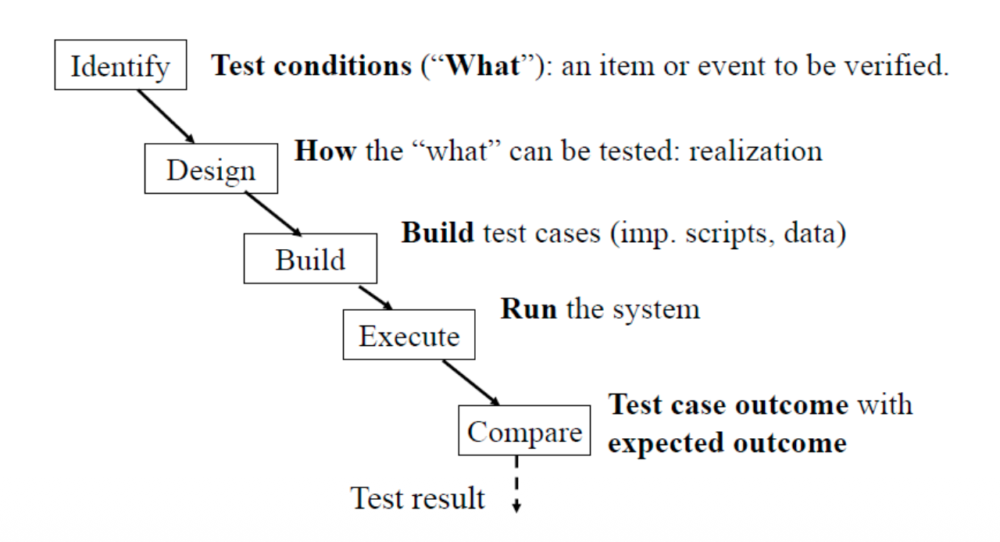

### Test Stopping Criteria 测试停止的标准

- **Meet deadline, exhaust budget, … (management decision)**

  **基于管理层决定（如达到截止日期、耗尽预算）**

- **Achieved desired coverage**

  **达到预期的测试覆盖率**

- **Achieved desired level of failure intensity**

  **或达到了期望的故障强度水平**

## Black Box / Functional Testing

### Black-box Testing

- The only information used is the specification of the software.

  一种只根据软件的规格说明书进行评估的方法

- Functional test cases have two distinct **advantages** :

  - They are independent of how the software is developed, so if the implementation changes, the test cases are still useful;

    **测试用例独立于软件的开发方式（即使实现发生变化，测试用例仍然有效）**；

  - Test case development can occur in parallel with the implementation, thereby reducing overall project development interval;

    测试用例的设计可以与代码实现并行发生，从而缩短项目开发周期。

- Functional test cases suffer from two **problems** :

  - Significant redundancies may exist among test cases;

    测试用例之间可能存在显著的冗余

  - Compounded by the possibility of gaps of untested software;

    可能会遗漏对某些软件逻辑的测试（测试空白）。

### Definition fo Black-box Testing 黑盒测试定义

黑盒测试只根据软件规格说明书进行测试，不关心内部代码、结构或实现细节。测试人员主要关注输入和输出，判断系统的外部行为是否符合需求和用户预期。课件中也明确说明，黑盒测试的重点是 I/O behavior，如果对于给定输入可以预测输出，并且实际输出符合预期，那么模块通过测试。

黑盒测试有两个明显优点。第一，测试用例独立于实现方式，所以即使代码实现发生改变，测试用例仍然可能有效。第二，测试用例设计可以和代码实现并行进行，从而缩短整体开发时间。它也有两个问题：测试用例之间可能存在冗余，并且可能存在未测试到的软件功能空白。

黑盒测试主要包含三类技术：Boundary Value Testing、Equivalence Class Testing 和 Decision Table Based Testing。课件进一步把边界值测试分成四类，把等价类测试也分成四类。

**Black-box testing** is a software testing methodology where the system under test is evaluated based on its **external behavior, without knowledge** of its internal code, structure, or implementation details. Testers focus on **inputs and outputs**, validating whether the software functions according to specified requirements, user expectations, and desired outcomes.

 黑盒测试  是一种软件测试方法，其中被测系统基于其外部行为进行评估，而不知道其内部代码，结构或实现细节。测试人员关注  输入和输出 ，验证软件是否按照指定的需求、用户期望和期望的结果运行。

- Focus: **I/O behavior**. If for any given input, we can predict the output, then the module passes the test.

  重点：I/O行为。如果对于任何给定的输入，我们可以预测输出，那么模块通过测试。

  - Almost always impossible to generate all possible inputs ("test cases")

    测试用例每次都能生成预期中的输出是不太可能的。

- Goal: Reduce number of test cases by equivalence partitioning:

  目标：通过等价划分减少测试用例的数量：

  - Divide input conditions into equivalence classes

    将输入条件划分为等价类

  - Choose test cases for each equivalence class. (Example: If an object is supposed to accept a negative number, testing one negative number is enough)

    为每个等价类选择测试用例。（示例：如果对象应该接受负数，则测试一个负数就足够了）

#### There are three testing measures:

- **Boundary Value Testing (BVT)**

  - Normal boundary value testing

  - Robust boundary value testing

  - Worst-case boundary value testing

  - Robust worst-case boundary value testing

- **Equivalence Class Testing**

  - Weak Normal Equivalence Class Testing

  - Strong Normal Equivalence Class Testing

  - Weak Robust Equivalence Class Testing

  - Strong Robust Equivalence Class Testing

- **Decision Table Based Testing**

### Boundary Value Testing 边界测试

边界值测试的核心思想是：程序可以被看成一个函数，输入形成 domain，输出形成 range。边界值分析重点关注输入空间的边界，因为错误往往容易出现在输入变量的极值附近。课件也指出，BVT 特别适合处理有明确上下界的 **physical variables**，例如温度、压力、速度等，但对 PIN、电话号码这类 logical variables 不太适合。

#### Overview

- Any program can be considered to be a function

  任何程序都可以被认为是一个函数

  - Program inputs form its **domain**

    程序输入形成其**域** 

  - Program outputs form its **range**

    程序输出形成其**范围** 

- Boundary value analysis is the best known functional testing technique.

  边界值分析是最著名的功能测试技术。

- The objective of functional testing is to use knowledge of the functional nature of a program to identify test cases.

  功能测试的目的是利用程序的功能特性来识别测试用例。

- Historically, functional testing has focused on the input domain, but it is a good supplement to consider test cases based on the range **(outputs)** as well.

  从历史上看，功能测试关注于输入域，但考虑基于范围 **（输出）** 的测试用例也是一个很好的补充。

- Boundary value testing focuses on the boundary of the input space to identify test cases.

  边界值测试关注输入空间的边界来识别测试用例。

- The rationale behind boundary value analysis is that **errors tend to occur near the extreme values of an input variable**.

  边界值分析背后的基本原理是，误差往往发生在输入变量的极值附近。

- Programs written in not strongly typed languages are more appropriate candidates for boundary value testing.

  用非强类型语言编写的程序更适合边界值测试。(such as python)

- BVT tends to generate **more test cases** with **poorer test coverage** than domain or equivalence testing.

  BVT倾向于生成更多的测试用例，而测试覆盖率比range或等价测试更差。

- Due to its simplicity, BVT test case generation can be easily automated.

  由于其简单性，BVT测试用例生成可以很容易地自动化。

- In our discussion we will assume a program P accepting two inputs y1 and y2 such that a ≤ y1 ≤ b and c ≤ y2 ≤ d

  在我们的讨论中，我们假设一个程序P接受两个输入y1和y2，使得a ≤ y1 ≤ B和c ≤ y2 ≤ d

##### Validate for Program P

- consider the following function:

  - $f(y_!, y_2),\text{where } a \le y_1 \le b, c \le y_2 \le d$

- boundary inequalities of **n** input variables define an **n**-dimensional

  n个输入变量的边界不等式定义了一个n维空间。

  input space (domain):
  
  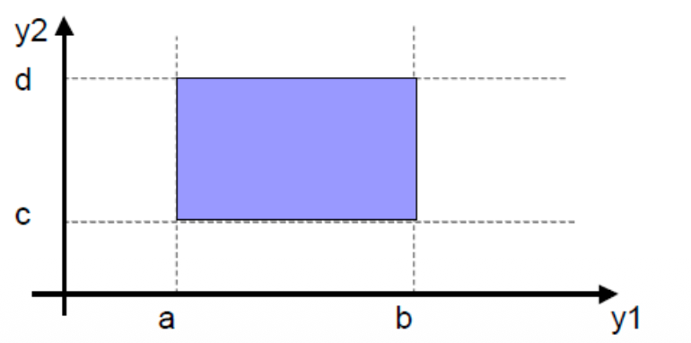

#### Variant of Boundary Value Testing 边界测试的变量

- Two independent considerations:

  两个独立的考虑因素

  - **Concerned with invalid values of variables?**

    关注变量的无效值

    - Only valid values – Normal

      只有有效值 - Normal

    - Both valid and invalid values – Robust

      同时关注有效值和无效值 - Robust

  - **Single fault assumption?**

    单一故障假设

    - Fault are due to invalidity of single variable.

      故障是由于单个变量无效。

    - Fault are due to the interaction among two or more variables.

      故障是由于两个及以上的变量交互造成的

- Two considerations yield **4** type of boundary value testing:

  两种考虑产生**4**种类型的边值检验

  - Normal boundary value testing

  - Robust boundary value testing

  - Worst-case boundary value testing

  - Robust worse-case value testing

| 类型                  | 是否考虑非法值 | 是否接受单一故障假设 | 测试用例数量 |
| --------------------- | -------------- | -------------------- | ------------ |
| Normal BVT            | 否             | 是                   | 4n + 1       |
| Robust BVT            | 是             | 是                   | 6n + 1       |
| Worst-case BVT        | 否             | 否                   | 5^n          |
| Robust Worst-case BVT | 是             | 否                   | 7^n          |

Normal BVT 的方法是：一次只让一个变量取 min、min+、nom、max-、max，其他变量保持 nominal value，所以 n 个变量会产生 4n + 1 个测试用例。Robust BVT 在此基础上加入 min- 和 max+，所以是 6n + 1。Worst-case BVT 不再使用单一故障假设，而是对每个变量的五个边界值做笛卡尔积，因此是 5^n。Robust Worst-case BVT 则对七个值做笛卡尔积，因此是 7^n。

#### Normal Boundary Value Testing

基于**单一缺陷假设**（假设失效很少是由两个或多个缺陷同时发生引起的），只考虑有效值（最小值、略高于最小值、正常值、略低于最大值、最大值）。产生 4*n*+1 个测试用例。

- The basic idea in boundary value analysis is to select input variable values at their:

  边界值分析的基本思想是在以下条件下选择输入变量值：

  - Minimum 最小值

  - Just above the minimum 刚好大于最小值

  - A nominal value ( **(minmum+maximum)/2**) 标准值

  - Just below the maximum 刚好小于最大值

  - Maximum 最大值

  - We use the conventions (min, min+, nom, max-, and max) to refer to these values 

    我们使用约定（min、min+、nom、max-和max）来引用这些值

- The normal boundary value testing augmented by the **single fault assumption** principle.

  用单一故障假设原理扩充的正态边值检验。

  - Failures occur rarely as the result of the simultaneous occurence of two (or more) faults

    由于两个（或多个）故障同时发生而导致的故障往往很少发生

- In this respect, normal boundary value test cases can be obtained by holding all but one at the nominal values and let the remaining variable assume the min, min+, nom, max–, and max values, repeating this for each variable. Thus, for a function of n variables, boundary value analysis yields 4n + 1 unique test cases.

##### Normal Boundary Value Testing for Program P

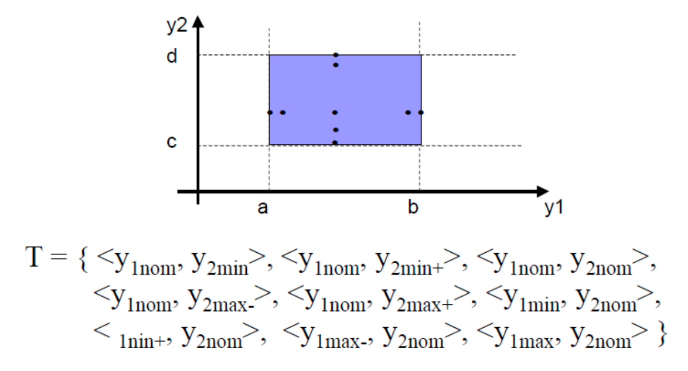

##### Generalizing Boundary Value Analysis

- Boundary value analysis is a test design technique used to identify and select input or output values.

  边界值分析是一种用于识别和选择输入或输出值的测试设计技术。

- The basic boundary value analysis for **normal boundary value testing** can be generalized in two ways:

  正态边值检验的基本边值分析可以概括为两种方式：

  - By the number of variables - (4n +1) test cases for n variables

    按变量数（4n +1）测试n个变量的情况

  - By the kinds of ranges of variables

    根据变量范围的种类

    - Bounded discrete variable – 5 test values (min, min+, nom, max-, max)

    - Unbounded discrete (no upper or lower bounds clearly defined), create “artificial” bounds

    - Logical variables present a problem for boundary value analysis, only true and false

#### Limitations of Boundary Value Analysis

- Boundary value analysis works well when the program to be tested is a function of several independent variables that represent bounded physical quantities.

  当被测程序是一个代表有限物理量的多个独立变量的函数时，边界值分析方法效果良好。

- Boundary value analysis selected test data with no consideration of the function of the program, nor of the semantic meaning of the variables.

  边界值分析选定的测试数据未考虑程序的功能，也未考虑变量的语义含义。

- We shall distinguish between physical and logical type of variables (e.g. temperature, pressure speed, or PIN numbers, telephone numbers etc.) . BVT works well for physical variables but not for logical variables.

  我们应区分变量的物理类型与逻辑类型（例如温度、压力、速度，以及密码、电话号码等）。边界值测试对物理型变量效果良好，但对逻辑型变量则不适用。

#### Robust Boundary Value Testing

- Robustness testing is a simple extension of boundary value analysis.

  鲁棒性测试是边界值分析的简单扩展。

- In addition to the five boundary value analysis values of variables, we add values slightly greater that the maximum (max+) and a value slightly less than the minimum (min-).

  除了变量的五个边界值分析值之外，我们还添加了略大于最大值（max+）和略小于最小值（min-）的值。

- In this respect, for a function of n variables, there will be 6n + 1 unique test cases.

  从这个角度来看，对于具有n个变量的函数，将存在6n + 1个独立的测试用例。

- The main value of robustness testing is to force attention on exception handling.

  鲁棒性测试的主要价值在于促使人们重视异常处理。

- In some strongly typed languages values beyond the predefined range will cause a run-time error. 

  在某些强类型语言中，超出预定义范围的值将导致运行时错误。

- It is a choice of using a weak typed language with exception handling or a strongly typed language with explicit logic to handle out of range values.

  这是在弱类型语言中采用异常处理，与在强类型语言中使用显式逻辑处理超范围值之间的一种选择。

##### Robustness Test Cases for Program P

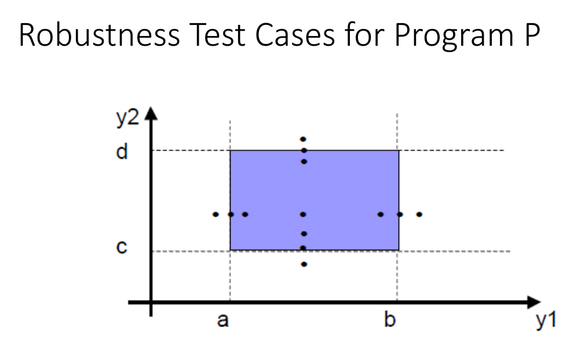

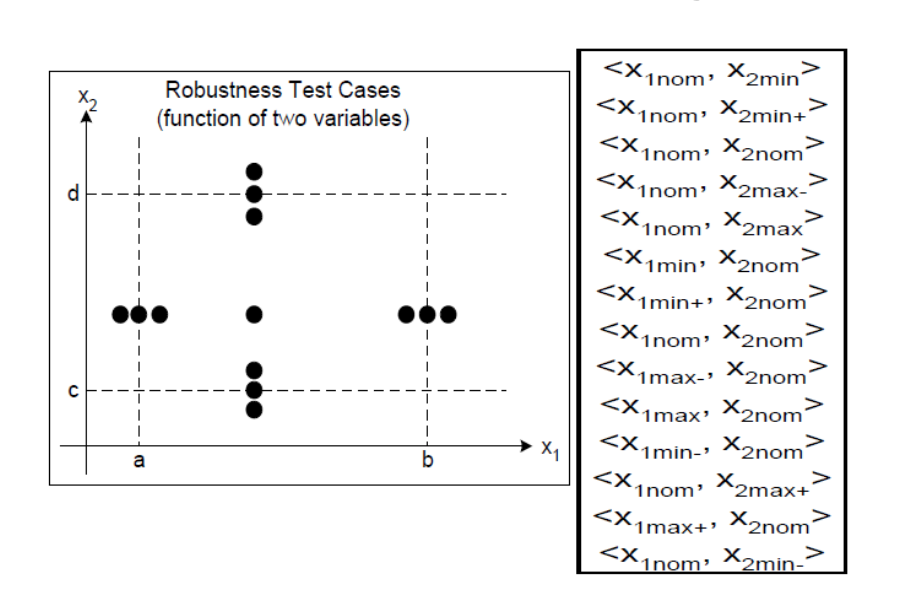

#### Worst-case Boundary Value Testing 最坏情况边界值测试

- In worst case testing we reject the single fault assumption and we are interested in what happens when more than one variable has an extreme value. 

  在最坏情况测试中，我们排除单一故障假设，关注多个变量同时出现极值时的情形。

- Considering that we have five different values that can be considered during normal boundary value testing for one variable, now we take the Cartesian product of these possible values for 2, 3, … n variables. In this respect we can have 5n test cases for n input variables. 

  考虑到我们在单个变量的常规边界值测试中涉及五个不同的取值，现在我们将这些可能取值推广至2、3乃至n个变量，计算其笛卡尔积。据此，对于n个输入变量，我们将产生5的n次方个测试用例。

- The best application of worst case testing is where physical variables have numerous interactions and failure of a program is costly.

  最坏情况测试的最佳应用场景是当物理变量存在大量交互作用，且程序故障代价高昂时。

##### Worst-case Boundary Value Testing for Program P

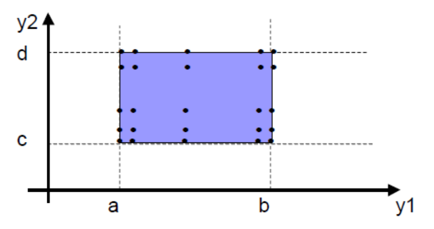

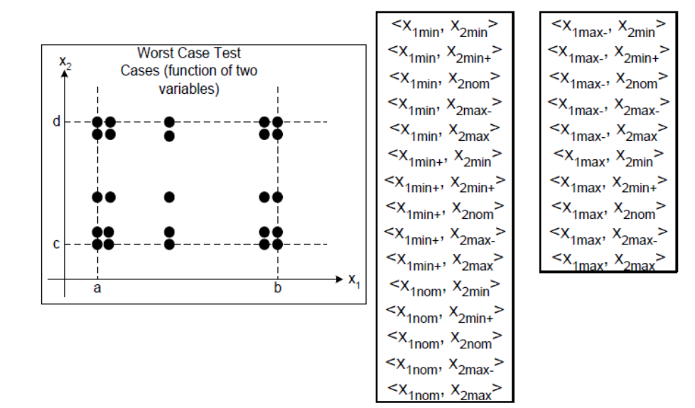

#### Robust Worst-case Boundary Value Testing 鲁棒最坏情况边界值测试

- Worst case testing can be further augmented by considering robust worst case testing (i.e. adding slightly out of bounds values to the five already considered). This involves the Cartesian product of the seven-element sets we used in robustness testing. 

  最坏情况测试可以通过考虑鲁棒最坏情况测试（即在已有五个值的基础上，增加稍超边界的值）得到进一步增强。这涉及我们用于鲁棒性测试的七元素集合的笛卡尔积。

- In this respect we can have 7n test cases for n input variables.

  在此方面，对于n个输入变量，我们可以有7n个测试用例。

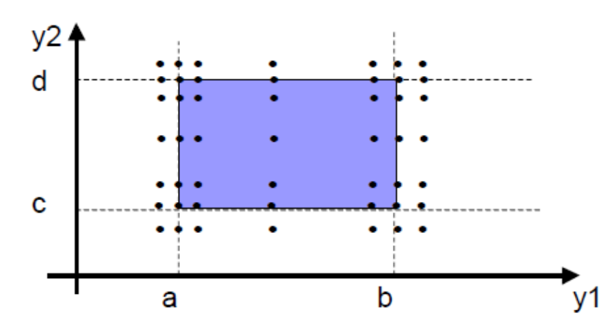

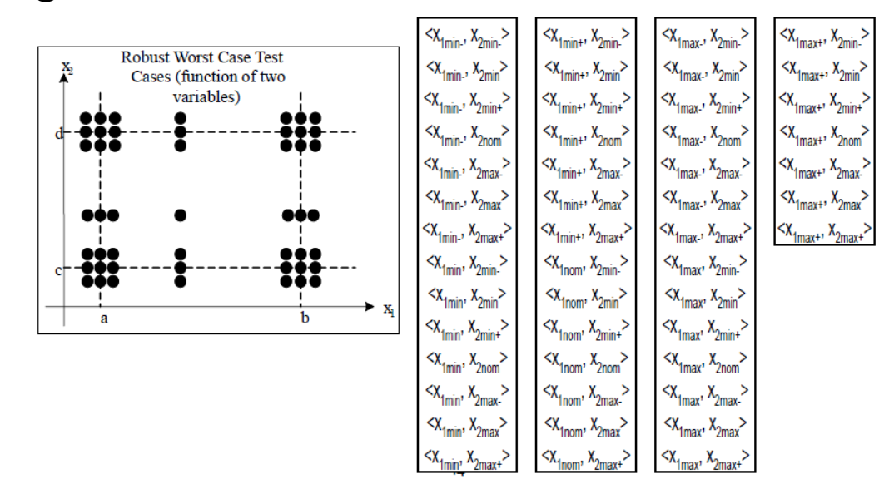

#### Example - Triangle Problem

- Problem Statement 问题描述

  - Input: 3 integers (sides of a triangle) 

  - Output: Type of Triangle (Equilateral, Isosceles, Scalene or NotATriangle) 

  - Extended Version: Additional Output Type: Right Triangle

    扩展版：附加输出类型：直角三角形

-  In the problem statement, no conditions are specified on the triangle sides, other than being integers. 

  题目陈述中未对三角形边长设定条件，仅要求其为整数。

- Obviously, the lower bounds of the ranges are all 1. 

  显然，这些范围的下界均为1。

- We arbitrarily take **200** as an upper bound. 

  我们任意选择，将200作为上界。

- For each side, the test values are {**1, 2, 100, 199, 200**}. 

- Robust boundary value test cases will add {**0, 201**}. 

- The table contains **Normal Boundary value test** cases using these ranges. 

  - Test cases 3, 8, and 13 are identical – Redundant 
  - There is no test case for scalene triangles 不等边三角形

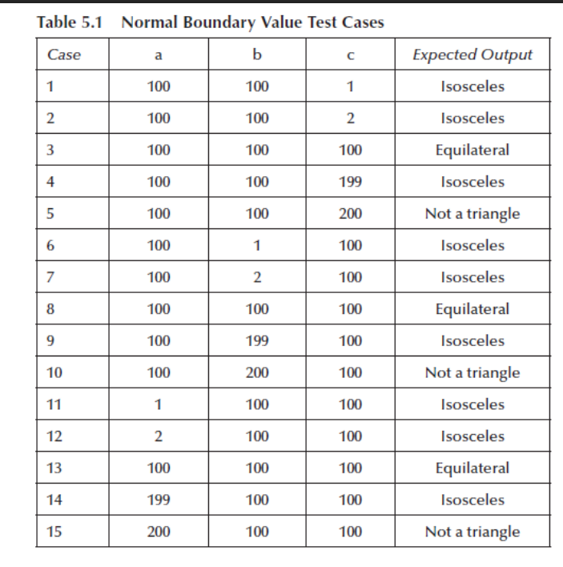

#### Example - The NextDate Function

- The function takes 3 variables, month, the day, and the year. It return the next day of the input. 

  该函数接收三个变量：月份、日期和年份，并返回输入日期的下一天。

- We could encode these, so that January would correspond to 1, February to 2, and so on. 

  我们可以对这些进行编码，使一月对应1，二月对应2，以此类推。

- In this example, we use Worst-case boundary value testing. All 125 worst-case test cases for NextDate are listed in the table on next page. 

  在此例中，采用最坏情况边界值测试方法。 NextDate 函数所需全部 125 个最坏情况测试用例。下面的表格中提供了一部分的测试用例

- Examine the following:

  - Gaps of untested functionality 

    未经测试的功能中存在空白

  - Redundant testing 

    重复测试

- Questions: 

  - Would anyone actually want to **test January 1 in five different years**? 
  - Is **the end of February** tested sufficiently?

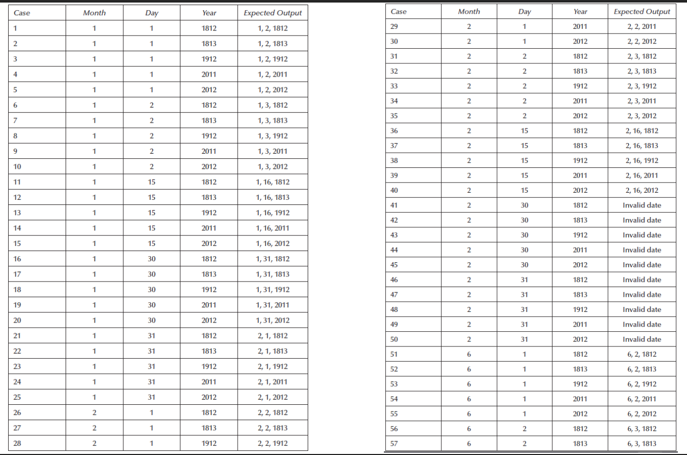

### Equivalence Class Testing 等价类测试

等价类测试的目的主要是减少测试用例数量和冗余。它把输入域划分成多个互不相交的子集，这些子集的并集等于整个输入集合。这样做带来两个好处：整个输入域被表示出来，体现一定的 completeness；同时每个类互不相交，可以减少 redundancy。

等价类测试的关键点不是随便分组，而是要选择合适的 equivalence relation。也就是说，要根据需求、输入语义和变量之间的关系进行划分。课件也强调，等价类选择更像一种 craft，需要理解输入域，有时仅靠接口说明是不够的

| 类型          | 核心思想                        | 测试数量特点                       |
| ------------- | ------------------------------- | ---------------------------------- |
| Weak Normal   | 每个合法等价类至少覆盖一次      | 最少，偏实用                       |
| Strong Normal | 所有合法等价类做笛卡尔积        | 更多，可测试交互                   |
| Weak Robust   | 在 Weak Normal 基础上加入非法类 | 覆盖非法输入，但一次主要测一个异常 |
| Strong Robust | 合法和非法等价类全部做笛卡尔积  | 最多，覆盖最强但成本高             |

#### Overview

- BVT assumes that input variables are independent of one another 

  BVT假设输入变量彼此独立。

- BVT tends to generate more test cases with poorer test coverage (with the independence assumption) than domain or equivalence testing. 

  BVT倾向于生成更多的测试用例，但测试覆盖率较低（基于独立性假设），性能不如域测试或等价测试。

- Equivalence classes form a partition of a set that is a collection of mutually disjoint subsets whose union is the entire set. 

  等价类构成集合的一个划分，即一组彼此不相交的子集，其并集为整个集合。

- Two important implications for testing: 

  对测试的两项重要影响：

  - The fact that the entire set is represented provides a form of completeness 

    整个集合被表示出来，体现了一种完整性。

  - The disjointness assures a form of non-redundancy

    这种不相交性保证了某种形式的非冗余性。

#### Equivalence Classes 等价类

- **The idea of equivalence class testing is to identify test cases by using one element from each equivalence class.** 

  **等价类测试的思想是通过从每个等价类中选取一个元素来确定测试用例。**

- If the equivalence classes are chosen wisely this greatly reduces the potential redundancy among test cases. 

  若等价类划分得当，这将极大减少测试用例之间的潜在冗余性。

- The key point in equivalence class testing is the choice of the **equivalence relation that determines the classes** (partitions).

  等价类测试的关键在于选择决定类（划分）的等价关系。

#### Equivalence Class Selection 等价类筛选

- tends to much of a “craft”: 

  过于偏向“手工技艺”。

  - no dependence on knowledge of code, only the specification 

    无需依赖编程知识，只需规格说明即可。

  - needs knowledge of input domain that usually goes beyond what an interface design specification provides 

    需要了解输入领域的知识，而这通常超出了接口设计规范所提供的内容范围。

  - must understand how inputs are mutually dependent

    必须理解输入之间如何相互依赖。

#### Equivalence Class Testing for 2-variable function

- Consider a function f(x1,x2) where the values of x1 and x2 are defined to be 
  - a <= x1 <= b and c <= x2 <= d 
- Assume the following equivalence classes for x1 
  - {a, a+1, …, ta}, {ta+1, ta+2, …, tb}, {tb+1, tb+2, …, b} 
- Assume the following equivalence classes for x2 
  - {c, c+1, …, tc}, {tc+1, tc+2, …, td}, {td+1, td+2, …, d}

##### Graphical Representation

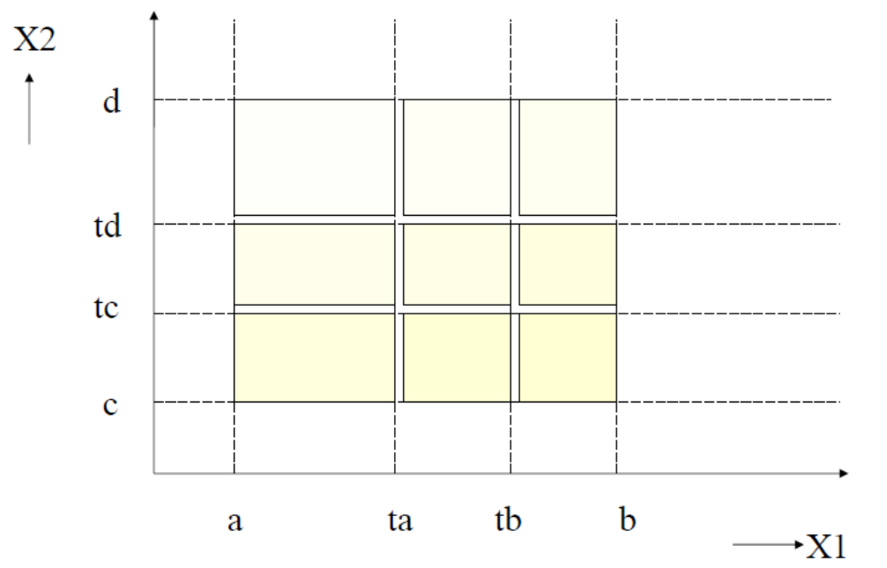

#### Test Data selection for 2-variable function

- Choose one value from each shaded region 

  从每个阴影区域中选择一个值

  - Each value serves as a representative for all values in that region 

    每个值代表该区域内的所有值。

- Total number of values = n * m where 

  值的总个数 = n * m，其中

  - ‘n’ is the number of partitions for input X1 

    'n' 是输入 X1 的分区数。

  - ‘m’ is the number of partitions for input X2

    “m”是输入X2的分区数

#### Equivalence Class Testing for 2-variable function – Robustness Testing

- Extended equivalence classes for x1 

  x1的扩展等价类

  - {values < a}, {a, a+1, …, ta}, {ta+1, ta+2, …, tb}, {tb+1, tb+2, …, b}, {values > b} 

- Extended equivalence classes for x2 

  x2 的扩展等价类

  - {values < c}, {c, c+1, …, tc}, {tc+1, tc+2, …, td}, {td+1, td+2, …, d}, {values > d} 

##### Graphical Representation

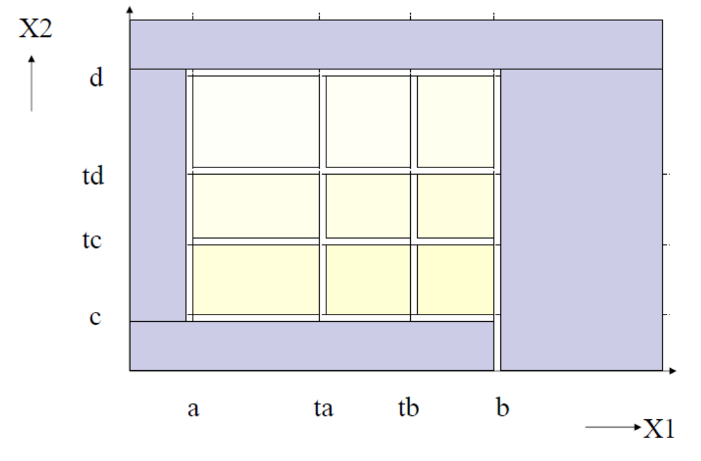

#### Weak Normal Equivalence Class Testing

- In weak equivalence class testing, the aim is to cover all the equivalence classes at least once, and to do this we don’t need to cover all possible combinations. 

  在弱等价类测试中，目标是至少覆盖一次所有等价类，为此我们无需覆盖所有可能的组合。

- The minimum number of test cases is equal to the number of classes in the partition with the largest number of subsets.

  最小测试用例数量等于划分中具有最多子集的类数量。

- Variable x1 
  - V1 = {a, a+1, …, ta} 
  - V2 = {ta+1, ta+2, …, tb} 
  - V3 = {tb+1, tb+2, …, b} 
- Variable x2 
  - V4 = {c, c+1, …, tc} 
  - V5 = {tc+1, tc+2, …, td} 
  - V6 = {td+1, td+2, …, d}

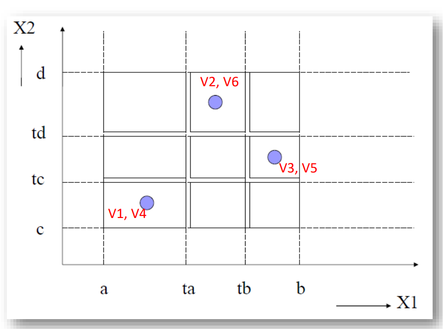

#### Strong Normal Equivalence Class Testing

- Strong equivalence class testing is based on the Cartesian Product of the partition subsets. 

  强等价类测试基于划分子集的笛卡尔积。

- From the previous example, this would generate: 

  从之前的示例来看，这将生成：

  - 3 * 3 = 9 test cases 

- Generates more test cases which test for any interaction between the representative values from each of the subsets.

  生成更多的测试用例，以测试各个子集中代表值之间的任何交互。

##### Example

- Variable x1 
  - V1 = {a, a+1, …, ta} 
  - V2 = {ta+1, ta+2, …, tb} 
  - V3 = {tb+1, tb+2, …, b} 
- Variable x2 
  - V4 = {c, c+1, …, tc} 
  - V5 = {tc+1, tc+2, …, td} 
  - V6 = {td+1, td+2, …, d} 
- Test cases
  - \<V1, V4>, \<V1, V5>, \<V1, V6>
  - \<V2, V4>, \<V2, V4>, \<V2, V4>
  - \<V3, V4>, \<V3, V4>, \<V3, V4>

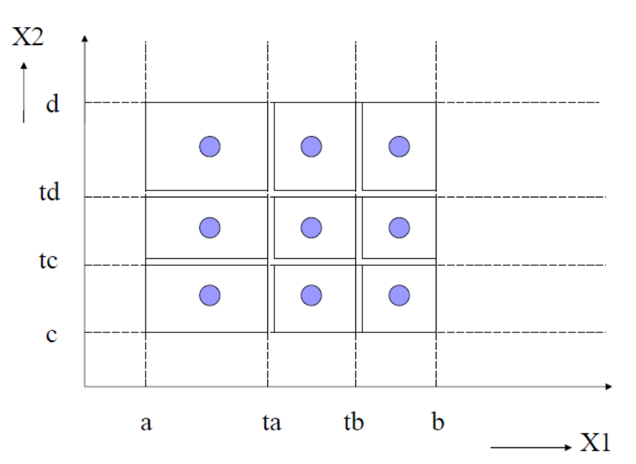

#### Weak and Strong Robust Equivalence Class Testing 弱健壮等价类测试与强健壮等价类测试

-  Weak Robust Equivalence Class Testing 

  弱健壮等价类测试

  - Similar to Weak Normal, except additional test cases are chosen from equivalence classes outside the range 

    与弱一般法类似，不同之处在于额外的测试用例从范围之外的等价类中选择。

  - One test case to cover out of range values for each variable 

    一个覆盖每个变量超出范围值的测试用例。

- Strong Robust Equivalence Class Testing 

  强健等价类测试

  - Similar to Strong Normal, except additional equivalence classes are added to cover out of range values 

    类似于强正常相，但增加了额外的等价类别以覆盖超出范围的值

  - Test cases once again derived from the Cartesian product of all equivalence classes 

    测试用例再次来自于所有等价类的笛卡尔积。(笛卡尔积是两个集合中所有可能有序对组成的集合)

##### Weak Robust Equivalence class Testing

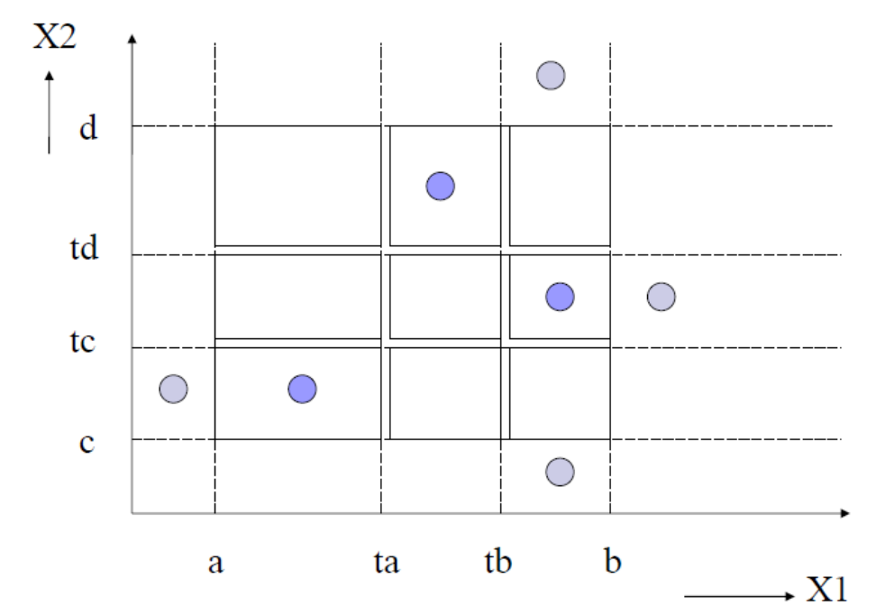

##### Strong Robust Equivalence class Testing

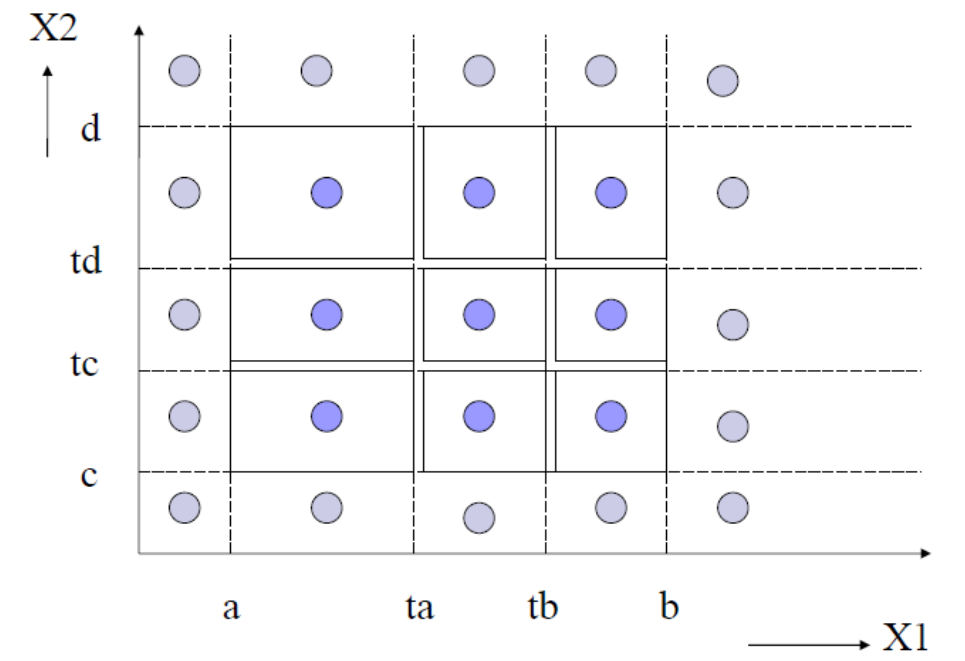

#### Example

- Consider a basic system that accepts two integer inputs, X and Y, and performs a division operation X/Y. 
- Here are some equivalence classes for both X and Y: 
  - Variable X: {values <= -1}, 0, {values >= 1} 
  - Variable Y (denominator): {values <= -1}, **0 (invalid)**, {values >= 1} 
- Weak Normal Equivalence Class test cases • (X, Y) = (-3, -5), (0, 8), (12, 2)

#### Output Equivalence Class

- Equivalence class partitioning can be applied also to the output domain of the software under test. 

  等价类划分同样可应用于被测软件的输出域。

- Represent the different responses or behaviors that the software may exhibit based on its input. 

  表示软件基于其输入可能展现的不同响应或行为。

- Verify whether the software behaves as expected for each class of outputs, which can be more efficient than testing every individual output.

  验证该软件对于每一类输出是否按预期运行，这比逐一测试每个输出更为高效。

##### Output Equivalence Class Example

- Consider an example of a simple car rental system where the desired output is the rental cost. 

  考虑一个简单的汽车租赁系统的示例，其中所需的输出是租赁费用。

- The system calculates the cost based on the type of car, rental duration (in days), and whether the customer has a membership for a discount. 

  系统根据车辆类型、租用时长（以天计）及客户是否持有享受折扣的会员资格计算费用。

- Here are the rules: 

  1. Economy cars cost $20 per day, SUVs $50 per day, and Luxury cars are $100 per day. 

     经济型汽车每日租金为20美元，运动型多功能车为50美元，豪华轿车则为100美元。

  2. Members get a 10% discount on the total cost.

     会员享受总费用10%的折扣。

- The output equivalence classes here would be:
  1. Economy car cost for non-members: $20/day 
  2. Economy car cost for members: $20/day with a 10% discount 
  3. SUV cost for non-members: $50/day 
  4. SUV cost for members: $50/day with a 10% discount 
  5. Luxury car cost for non-members: $100/day 
  6. Luxury car cost for members: $100/day with a 10% discount

- **Weak Normal Equivalence Class Testing**, we would choose one representative from each equivalence class and test. 

  弱一般等价类测试，我们需要从每个等价类中选择一个代表并实施测试。

  1. Renting an Economy car for 3 days by a non-member. 
  2. Renting an Economy car for 2 days by a member. 
  3. Renting an SUV for 4 days by a non-member. 
  4. Renting an SUV for 7 days by a member. 
  5. Renting a Luxury car for 1 day by a non-member. 
  6. Renting a Luxury car for 5 days by a member.

- **Strong Normal Equivalence Class Testing**, you would now choose one representative from each equivalence class and test for all possible combinations. Here are some representative test cases:

  强健等价类测试，需要从每个等价类中选取一个代表，并针对所有可能的组合进行测试。以下是部分具有代表性的测试用例：

  1. Economy car rented by a non-member for 1 day. 
  2. Economy car rented by a non-member for 2 days. 
  3. Economy car rented by a member for 1 day. 
  4. Economy car rented by a member for 2 days. 
  5. SUV rented by a non-member for 1 day. 
  6. SUV rented by a non-member for 2 days. 
  7. SUV rented by a member for 1 day. 
  8. SUV rented by a member for 2 days. 
  9. Luxury car rented by a non-member for 1 day. 
  10. Luxury car rented by a non-member for 2 days. 
  11. Luxury car rented by a member for 1 day. 
  12. Luxury car rented by a member for 2 days.

- **Robust Equivalence Class Testing** involves testing with both valid and 'just outside' invalid inputs. 

  健壮等价类测试涉及使用有效输入与“恰好超出边界”的无效输入进行测试。

  - In our car rental example, the valid inputs are: 

    在我们的汽车租赁示例中，有效的输入包括：

    - Type of car: Economy, SUV, or Luxury. 

      车辆类型：经济型、SUV或豪华型。

    - Duration of rental: A positive integer for rental days. 

      租期：以正整数计算的租赁天数。

    - Membership status: Whether the customer is a member or not. 

      会员状态：客户是否为会员。

  - And the invalid inputs could be: 

    无效输入可能包括：

    - Type of car: Any type other than Economy, SUV, or Luxury (e.g., compact, pickup). 

      车型：除经济型、SUV、豪华型之外的任何类型（例如紧凑型车、皮卡）。

    - Duration of rental: Non-positive integers (e.g., 0 or negative numbers). 

      租赁期限：非正整数（例如，0 或负数）。

    - Membership status: Any status other than member or non-member (e.g., pending).

      成员身份：除正式成员或非成员以外的任何状态（例如，待审核）。

#### Effective coverage of test cases 测试用例的高效覆盖

- It is preferable to apply equivalence class testing for both input domain and output domain

  建议对输入域和输出域均应用等价类测试。

  - In practice, many people apply the technique only for input domain

    在实践中，许多人仅针对输入域应用此技术。

- It is preferable to include “Robust equivalence classes” 

  测试用例的高效覆盖

- It is preferable to combine equivalence class testing with boundary value analysis and apply worst-case scenario (or multiple-fault assumption – more than one variable may be at fault)

  **最好将等价类测试与边界值分析结合起来，并应用最坏情况场景**（或多故障假设——可能存在不止一个变量出错的情况）。

#### Scenario for Equivalence Class Testing 等价类测试场景

1. **Large Input Domain**: When the system under test has a large number of inputs, it's impractical to test them all. Equivalence class testing allows you to divide the input into groups (equivalence classes) and test a representative input from each group, greatly reducing the number of test cases. 

   大输入域：当被测系统存在大量输入时，逐一测试是不切实际的。等价类测试方法可将输入划分为若干组（等价类），并从每组中选取具有代表性的输入进行测试，从而大幅降低测试用例的数量。

2. **Boundary Conditions**: Equivalence class testing is useful for identifying boundary conditions where defects often occur. When you divide the inputs into valid and invalid classes, the boundaries between these classes often reveal errors. 

   边界条件：等价类测试对于识别常见的缺陷边界条件非常有效。将输入划分为有效类和无效类时，这些类别之间的边界往往能暴露出错误。

3. **Reducing Redundancy**: If you believe that testing one value from an equivalence class is equivalent to testing all other values in that class, this method can eliminate redundant or duplicate testing and save considerable time and effort.

   减少冗余：若认为从某个等价类中测试一个值与测试该类中的所有其他值等效，此方法可消除重复或冗余测试，从而节省大量时间与精力。

4. **Software with Defined Inputs**: It works best when the software has clearly defined input domains that can be easily divided into classes. For example, choosing a country from a drop-down list or entering an age in a text box. 

   定义输入的软件：当软件的输入域明确界定且易于划分为多个类别时，其运行效果最佳。例如，从下拉列表中选择国家或在文本框中输入年龄。

5. **Quick and Early Bug Discovery**: It enables faster testing and helps in identifying high-risk defects at an early stage of testing which improves the quality of the software product. While equivalence class testing can identify many issues, it doesn't guarantee finding all errors, and should be used as part of a broader testing strategy that includes other techniques as well.

   快速且早期发现缺陷：它能够加速测试进程，并有助于在测试早期阶段及早识别高风险缺陷，从而提升软件产品的质量。尽管等价类测试能发现大量问题，但无法保证检测出所有错误，因此应将其作为包括其他技术在内的综合性测试策略的组成部分来运用。

### Example

#### Given Information

函数：

```
f(x1, x2)
```

输入范围：

```
1000 <= x1 <= 10000
10-year <= x2 <= 50-year
```

已给出的有效等价类：

```
x1:
V1 = [1000 to 5000]
V2 = [5001 to 10000]

x2:
V3 = [10-year to 19-year]
V4 = [20-year to 29-year]
V5 = [30-year to 50-year]
```

所以：

```
x1 有 2 个 valid equivalence classes
x2 有 3 个 valid equivalence classes
```

------

#### a. Weak Normal Equivalence Class Testing 的最少测试用例

Weak Normal Equivalence Class Testing 的目标是：**每一个 valid equivalence class 至少被覆盖一次**，但不需要覆盖所有组合。

因为：

```
x1 有 2 个 class
x2 有 3 个 class
```

所以最少测试用例数量是：

```
max(2, 3) = 3 test cases
```

可以选择以下 3 个测试用例：

| Test Case | x1 value | x1 class | x2 value | x2 class |
| --------- | -------- | -------- | -------- | -------- |
| TC1       | 2000     | V1       | 15-year  | V3       |
| TC2       | 7000     | V2       | 25-year  | V4       |
| TC3       | 7000     | V2       | 40-year  | V5       |

这样所有 class 都至少被覆盖一次：

```
x1: V1, V2 都被覆盖
x2: V3, V4, V5 都被覆盖
```

##### 图形表示

```
                    x2
          V3          V4          V5
       10-19       20-29       30-50
        ┌──────────┬──────────┬──────────┐
V1      │   TC1    │          │          │
1000-   │ (2000,15)│          │          │
5000    │          │          │          │
        ├──────────┼──────────┼──────────┤
V2      │          │   TC2    │   TC3    │
5001-   │          │(7000,25) │(7000,40) │
10000   │          │          │          │
        └──────────┴──────────┴──────────┘
                        x1
```

所以 Weak Normal 的最少测试用例是：

```
TC1 = (2000, 15-year)
TC2 = (7000, 25-year)
TC3 = (7000, 40-year)
```

------

#### b. 为什么 Strong Normal 比 Weak Normal 生成更多测试用例？

Strong Normal Equivalence Class Testing 会生成更多测试用例，因为它需要测试 **所有 valid equivalence classes 的组合**，也就是使用 Cartesian product。课件中也说明，Strong Equivalence Class Testing 是基于 partition subsets 的 Cartesian product，用来测试不同等价类代表值之间的 interaction。

在这个题中：

```
x1 有 2 个 valid classes: V1, V2
x2 有 3 个 valid classes: V3, V4, V5
```

所以 Strong Normal 的测试用例数量是：

```
2 × 3 = 6 test cases
```

组合如下：

| x1 class | x2 class |
| -------- | -------- |
| V1       | V3       |
| V1       | V4       |
| V1       | V5       |
| V2       | V3       |
| V2       | V4       |
| V2       | V5       |

而 Weak Normal 只需要覆盖每个 class 至少一次，所以只需要：

```
max(2, 3) = 3 test cases
```

因此：

```
Strong Normal generates more test cases because it tests every combination of equivalence classes, while Weak Normal only ensures each class is covered at least once.
```

中文理解：

```
强一般等价类测试会测试所有组合，所以可以检查变量之间的交互问题。
弱一般等价类测试只保证每个等价类至少出现一次，所以测试数量更少。
```

------

#### c. Robustness Testing 的等价类

Robustness Testing 要加入 **invalid equivalence classes**。课件中说明，Robust equivalence class testing 会在正常范围之外加入额外的等价类，用来覆盖 out-of-range values。

##### x1 的 robust equivalence classes

x1 的合法范围是：

```
1000 <= x1 <= 10000
```

所以 x1 的等价类包括：

```
I1 = x1 < 1000              invalid lower class
V1 = 1000 <= x1 <= 5000     valid class
V2 = 5001 <= x1 <= 10000    valid class
I2 = x1 > 10000             invalid upper class
```

可以写成：

| Class | Range         | Type    |
| ----- | ------------- | ------- |
| I1    | x1 < 1000     | Invalid |
| V1    | 1000 to 5000  | Valid   |
| V2    | 5001 to 10000 | Valid   |
| I2    | x1 > 10000    | Invalid |

------

##### x2 的 robust equivalence classes

x2 的合法范围是：

```
10-year <= x2 <= 50-year
```

所以 x2 的等价类包括：

```
I3 = x2 < 10-year              invalid lower class
V3 = 10-year <= x2 <= 19-year  valid class
V4 = 20-year <= x2 <= 29-year  valid class
V5 = 30-year <= x2 <= 50-year  valid class
I4 = x2 > 50-year              invalid upper class
```

可以写成：

| Class | Range              | Type    |
| ----- | ------------------ | ------- |
| I3    | x2 < 10-year       | Invalid |
| V3    | 10-year to 19-year | Valid   |
| V4    | 20-year to 29-year | Valid   |
| V5    | 30-year to 50-year | Valid   |
| I4    | x2 > 50-year       | Invalid |

------

#### d. Weak Robust Equivalence Class Testing 的最少测试用例

Weak Robust Equivalence Class Testing 和 Weak Normal 类似，但是会额外选择范围外的 invalid equivalence classes。课件中说明，Weak Robust 会为每个变量的 out-of-range values 选择测试用例；Strong Robust 才会再次使用所有等价类的 Cartesian product。

所以这里的做法是：

```
先做 Weak Normal，覆盖所有 valid classes
再加入 invalid classes
一次主要测试一个 invalid class，其他变量保持 valid value
```

##### Step 1：Weak Normal 的 3 个 valid test cases

| Test Case | x1   | x1 class | x2      | x2 class |
| --------- | ---- | -------- | ------- | -------- |
| TC1       | 2000 | V1       | 15-year | V3       |
| TC2       | 7000 | V2       | 25-year | V4       |
| TC3       | 7000 | V2       | 40-year | V5       |

------

##### Step 2：加入 invalid equivalence classes

x1 有两个 invalid classes：

```
I1 = x1 < 1000
I2 = x1 > 10000
```

x2 有两个 invalid classes：

```
I3 = x2 < 10-year
I4 = x2 > 50-year
```

为每个 invalid class 选择一个测试用例，其他变量保持 valid value：

| Test Case | x1    | x1 class | x2      | x2 class | Expected   |
| --------- | ----- | -------- | ------- | -------- | ---------- |
| TC4       | 999   | I1       | 25-year | V4       | Invalid x1 |
| TC5       | 10001 | I2       | 25-year | V4       | Invalid x1 |
| TC6       | 7000  | V2       | 9-year  | I3       | Invalid x2 |
| TC7       | 7000  | V2       | 51-year | I4       | Invalid x2 |

所以 Weak Robust 最少测试用例可以写成：

```
3 valid cases + 4 invalid cases = 7 test cases
```

------

##### 图形表示：Weak Robust Equivalence Class Testing

```
                              x2
          I3          V3          V4          V5          I4
        <10        10-19       20-29       30-50        >50
        ┌──────────┬──────────┬──────────┬──────────┬──────────┐
I1      │          │          │   TC4    │          │          │
x1<1000 │          │          │ (999,25) │          │          │
        ├──────────┼──────────┼──────────┼──────────┼──────────┤
V1      │          │   TC1    │          │          │          │
1000-   │          │(2000,15) │          │          │          │
5000    │          │          │          │          │          │
        ├──────────┼──────────┼──────────┼──────────┼──────────┤
V2      │   TC6    │          │   TC2    │   TC3    │   TC7    │
5001-   │(7000,9)  │          │(7000,25) │(7000,40) │(7000,51) │
10000   │          │          │          │          │          │
        ├──────────┼──────────┼──────────┼──────────┼──────────┤
I2      │          │          │   TC5    │          │          │
x1>10000│          │          │(10001,25)│          │          │
        └──────────┴──────────┴──────────┴──────────┴──────────┘
```

#### f. Robust equivalence classes

##### x1 的等价类

```
I1 = x1 < 1000              invalid
V1 = 1000 to 5000           valid
V2 = 5001 to 10000          valid
I2 = x1 > 10000             invalid
```

所以 x1 一共有：

```
4 classes
```

##### x2 的等价类

```
I3 = x2 < 10-year           invalid
V3 = 10-year to 19-year     valid
V4 = 20-year to 29-year     valid
V5 = 30-year to 50-year     valid
I4 = x2 > 50-year           invalid
```

所以 x2 一共有：

```
5 classes
```

------

##### 2. Strong Robust 的测试用例数量

因为 Strong Robust 要测试所有组合：

```
x1 classes × x2 classes
= 4 × 5
= 20 test cases
```

所以答案是：

```
Strong Robust Equivalence Class Testing = 20 test cases
```

------

##### 3. 图形表示

```
                              x2
          I3          V3          V4          V5          I4
        <10        10-19       20-29       30-50        >50
        ┌──────────┬──────────┬──────────┬──────────┬──────────┐
I1      │   TC1    │   TC2    │   TC3    │   TC4    │   TC5    │
x1<1000 │          │          │          │          │          │
        ├──────────┼──────────┼──────────┼──────────┼──────────┤
V1      │   TC6    │   TC7    │   TC8    │   TC9    │   TC10   │
1000-   │          │          │          │          │          │
5000    │          │          │          │          │          │
        ├──────────┼──────────┼──────────┼──────────┼──────────┤
V2      │   TC11   │   TC12   │   TC13   │   TC14   │   TC15   │
5001-   │          │          │          │          │          │
10000   │          │          │          │          │          │
        ├──────────┼──────────┼──────────┼──────────┼──────────┤
I2      │   TC16   │   TC17   │   TC18   │   TC19   │   TC20   │
x1>10000│          │          │          │          │          │
        └──────────┴──────────┴──────────┴──────────┴──────────┘
```

##### 4. 可以选择的 20 个测试用例示例

| Test Case | x1    | x1 class | x2   | x2 class |
| --------- | ----- | -------- | ---- | -------- |
| TC1       | 999   | I1       | 9    | I3       |
| TC2       | 999   | I1       | 15   | V3       |
| TC3       | 999   | I1       | 25   | V4       |
| TC4       | 999   | I1       | 40   | V5       |
| TC5       | 999   | I1       | 51   | I4       |
| TC6       | 2000  | V1       | 9    | I3       |
| TC7       | 2000  | V1       | 15   | V3       |
| TC8       | 2000  | V1       | 25   | V4       |
| TC9       | 2000  | V1       | 40   | V5       |
| TC10      | 2000  | V1       | 51   | I4       |
| TC11      | 7000  | V2       | 9    | I3       |
| TC12      | 7000  | V2       | 15   | V3       |
| TC13      | 7000  | V2       | 25   | V4       |
| TC14      | 7000  | V2       | 40   | V5       |
| TC15      | 7000  | V2       | 51   | I4       |
| TC16      | 10001 | I2       | 9    | I3       |
| TC17      | 10001 | I2       | 15   | V3       |
| TC18      | 10001 | I2       | 25   | V4       |
| TC19      | 10001 | I2       | 40   | V5       |
| TC20      | 10001 | I2       | 51   | I4       |

### Decision Table Based Testing 基于决策表的测试

#### Decision Table

- Decision tables are a precise yet compact way to model complicated logic. 

  决策表是一种精确且简洁的方式，用于建模复杂的逻辑。

- Decision tables, like if-then-else and switch-case statements, associate conditions with actions to perform. 

  决策表，如同if-then-else和switch-case语句一样，将条件与待执行的动作相关联。

- But, unlike the control structures found in traditional programming languages, decision tables can associate many independent conditions with several actions in an elegant way. “http://en.wikipedia.org/wiki/Decision_table” 

  然而，与传统编程语言中的控制结构不同，决策表能够以优雅的方式将多个独立条件与多个动作关联起来。

- Decision tables make it easy to observe that all possible conditions are accounted for.

  决策表让人能很直观地看出所有可能的情况都被考虑到了。 

- Decision tables can be used for Specifying complex program logic.

  决策表可用于指定复杂的程序逻辑。

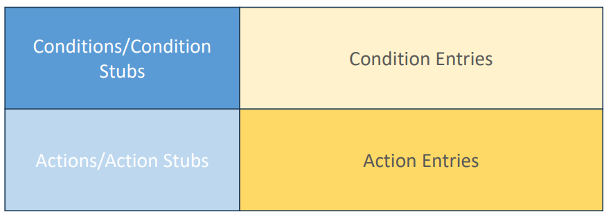

##### Decision Table Structure

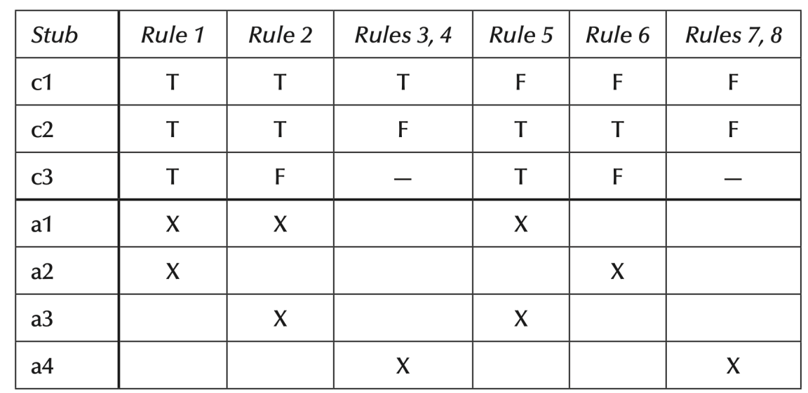

- **Each condition corresponds to a variable, relation or predicate** 

  **每个条件对应一个变量、关系或谓词。**

- **Possible values for conditions are listed among the condition entries** 

  **condition可能的取值列于条件条目中。**

  - **Boolean values (True / False) – Limited Entry Decision Tables** 

    **布尔值（是/否）——有限项决策表**

  - **Several values – Extended Entry Decision Tables** 

    **多个值——扩展录入决策表**

  - **Don’t care value** 

    **莫问代价。**

- **Each action is a procedure or operation to perform** 

  **每个action都是即将执行的一个步骤或操作。**

- **The Action entries specify whether the action is to be performed**

  **action条目指定是否执行该操作。**

| 部分              | 含义                        |
| ----------------- | --------------------------- |
| Condition Stubs   | 条件名称，例如 x1 是否有效  |
| Condition Entries | 条件取值，例如 True / False |
| Action Stubs      | 可能执行的动作              |
| Action Entries    | 对应规则下是否执行动作      |

##### Decision Table Example

- Consider a function f(x1,x2) where the values of x1 and x2 are defined to be 

  考虑函数f(x1,x2)，其中x1和x2的值已定义。

  - a <= x1 <= b and c <= x2 <= d 

- When both input values x1 and x2 are within their ranges (defined in the condition stubs), compute y value (described in the action stubs). 

  当输入值 x1 和 x2 均位于各自范围（已在条件桩中定义）内时，计算 y 值（如动作桩所述）。

- In all other situations, output an error message 

  在所有其他情况下，输出错误消息。

table 1:

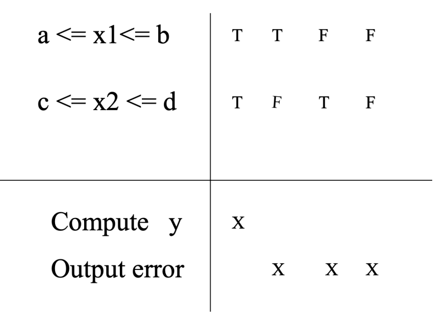

table 2:

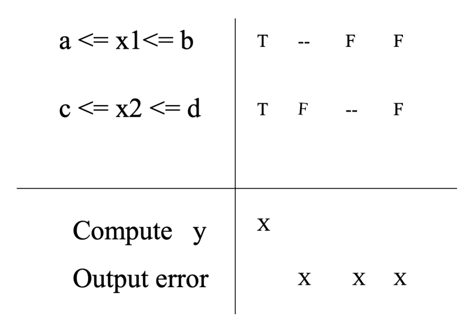

"--" indicate "Don't care"

table 3:

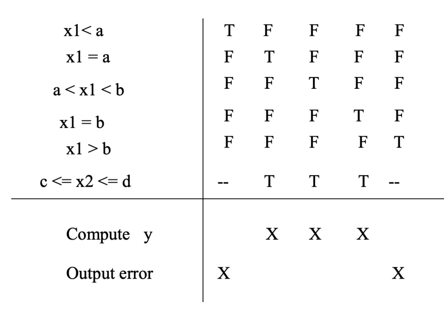

##### Decision Table Example – Extended Entry Decision Table

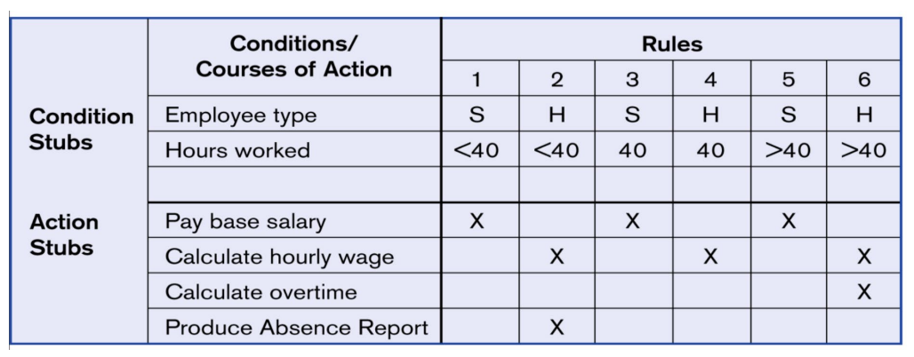

#### Decision Table Development Methodology

1. Determine conditions and values 

   确定条件和值

2. Determine maximum number of rules 

   确定规则的最大数量

3. Determine actions 

   确定行动并执行

4. Encode possible rules 

   对可能的规则进行编码

5. Encode the appropriate actions for each rule 

   为每项规则编码适当的操作。

6. Verify the policy 

   验证策略

7. Simplify the rules (reduce the number of columns whenever possible)

   简化规则（尽量缩减栏目数量）

#### Decision Table - Usage

- The use of the decision-table model is applicable when : 

  决策表模型的适用条件为：

  - The specification is given or can be converted to a decision table. 

    该规范是给定的，或者可以转换为决策表。

  - The order in which the predicates are evaluated does not affect the interpretation of the rules or resulting action. 

    谓词的评估顺序不影响规则的解释或由此产生的动作。

  - The order of rule evaluation has no effect on resulting action. 

    规则评估的顺序对最终结果没有影响。

  - Once a rule is satisfied and the action selected, no other rule need be examined. 

    一旦满足某个规则并选定操作后，就无需再检查其他规则。

  - The order of executing actions in a satisfied rule is of no consequence. 

    满足条件的规则中动作的执行顺序无关紧要。

#### Decision Table -Issue

Before using the tables, ensure: 

使用表格前，请确保：

- rules must be complete 

  要求必须完善

  - every combination of predicate truth values plus default cases are explicit in the decision table 

    决策表中每个谓词真值组合及默认情况均明确列出。

- rules must be consistent 

  规则须保持一致

  - every combination of predicate truth values results in only one action or set of actions 

    每个谓词真值的组合仅对应于一个动作或一组动作。

#### Inconsistent Decision Table 不一致决策表

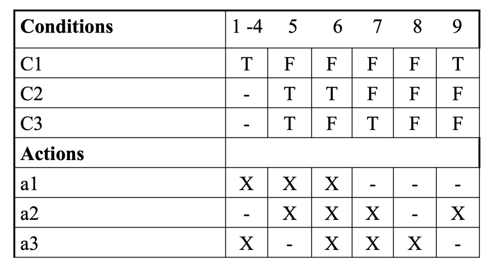

#### Decision Table for Triangle Problem

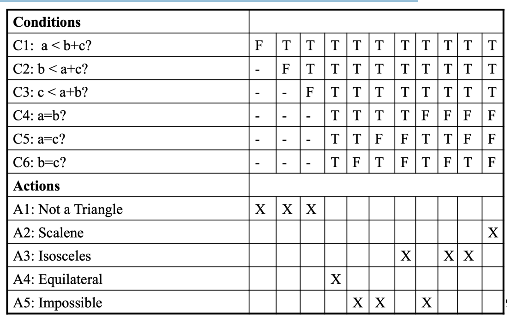

##### Test Cases for Triangle Problem

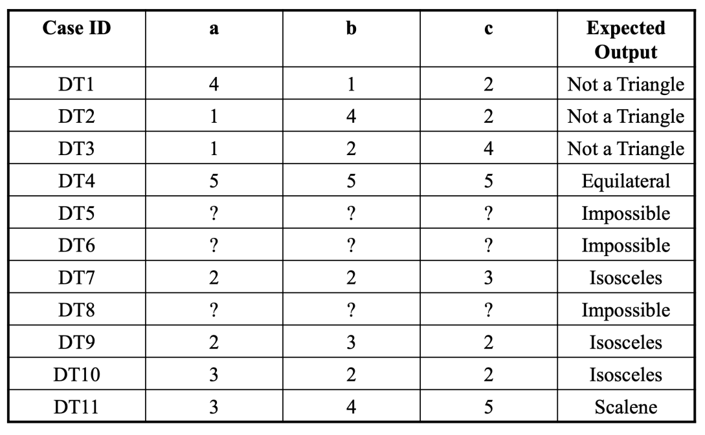

## Observation 

- Decision Table testing is most appropriate for programs where 

  决策表测试最适用于以下场景的程序：

  - Prominent if-then-else logic 

    突出的if-then-else逻辑

  - there are important logical relationships among input variables 

    输入变量之间存在重要的逻辑关联关系

  - There are calculations involving subsets of input variables 

    涉及输入变量子集的计算

  - There are cause and effect relationships between input and output 

    输入与输出之间存在因果关系

  - There is complex computation logic (high cyclomatic complexity) 

    包含复杂的计算逻辑（高圈复杂度）

- Decision tables do not scale up very well 

  决策表在扩展性方面表现不佳

- Decision tables can be iteratively refined 

  决策表可以被逐步优化


