# 12 Software Testing - White Box

## 知识图谱

```plaintext
Week 12 / White Box Testing 白盒测试
├── 1. White Box Testing 基本概念
│   ├── 又称 Glass Box / Structural / Clear Box / Open Box Testing
│   ├── 基于程序内部结构、源代码、逻辑、算法、数据结构设计测试用例
│   ├── 与 Black Box Testing 对比
│   │   ├── Black Box：根据 specification / 外部输入输出测试
│   │   └── White Box：根据 source code / internal logic 测试
│   └── 白盒测试的特点
│       ├── Rigorous Definitions 严格定义
│       ├── Mathematical Analysis 数学分析
│       └── Useful Measurement 可量化度量
│
├── 2. Program Graph / Control Flow Graph 程序图 / 控制流图
│   ├── 定义
│   │   ├── Directed graph 有向图
│   │   ├── Nodes = statement fragments 语句片段
│   │   └── Edges = flow of control 控制流
│   ├── Edge 存在条件
│   │   └── node j 对应语句可以在 node i 之后立即执行
│   ├── 作用
│   │   └── 可视化所有可能执行路径
│   └── 4种基本结构
│       ├── If-Then-Else
│       ├── Case / Switch
│       ├── Pretest Loop, 如 while
│       └── Posttest Loop, 如 do-until
│
├── 3. Program Graph Example 三角形程序图例
│   ├── Non-executable statements 不包含在图中
│   ├── Sequence 顺序结构
│   ├── If-then-else 选择结构
│   ├── Nested if-then-else 嵌套选择结构
│   ├── Source node
│   │   └── indeg = 0，单入口
│   ├── Sink node
│   │   └── outdeg = 0，单出口
│   └── Directed acyclic graph
│       └── 如果没有 loop，则为有向无环图
│
├── 4. DD-Paths 决策到决策路径
│   ├── 定义
│   │   ├── Decision-to-decision path
│   │   ├── CFG 的 sub-path
│   │   └── 从一个 decision node 到另一个 decision node 或 terminal node
│   ├── DD-Path 五种形式
│   │   ├── Case 1: single node with indeg = 0
│   │   ├── Case 2: single node with outdeg = 0
│   │   ├── Case 3: single node with indeg ≥ 2 or outdeg ≥ 2
│   │   ├── Case 4: single node with indeg = 1 and outdeg = 1
│   │   └── Case 5: maximal chain of length ≥ 1
│   └── DD-Path Graph
│       ├── Nodes = DD-paths
│       └── Edges = control flow between successor DD-paths
│
├── 5. Test Coverage Metrics 测试覆盖率指标
│   ├── 使用 DD-Path 的原因
│   │   ├── 精确描述测试覆盖情况
│   │   ├── 发现 functional test 的 redundancy
│   │   └── 发现 functional test 的 gaps
│   ├── E.F. Miller’s Coverage Metrics
│   │   ├── C0: Every statement
│   │   ├── C1: Every DD-path
│   │   ├── C1p: Every predicate to each outcome
│   │   ├── C2: C1 coverage + loop coverage
│   │   ├── Cd: C1 coverage + every dependent pair of DD-paths
│   │   ├── CMCC: Multiple condition coverage
│   │   ├── Cik: Every program path with up to k loop repetitions
│   │   ├── Cstat: Statistically significant fraction of paths
│   │   └── C∞: All possible execution paths
│   └── 覆盖率指标的作用
│       ├── 衡量测试用例对程序结构的覆盖程度
│       ├── 作为 functional testing 的 cross-check
│       └── 设置最低测试标准
│
├── 6. Statement and Predicate Coverage
│   ├── Statement Coverage C0
│   │   └── 所有 statement 至少执行一次
│   ├── Predicate / Branch / Decision Coverage C1
│   │   ├── 每个 simple predicate 都要取 True 和 False
│   │   └── 等价于遍历 DD-Path Graph 每一条 edge
│   ├── DD-Path Graph Edge Coverage C1
│   │   └── 覆盖每条 DD-path edge
│   └── DD-Path Coverage C1p
│       └── 对 predicate 组合覆盖所有可能 outcome
│
├── 7. Multiple Condition Coverage 多条件覆盖
│   ├── 针对 compound predicate
│   │   └── 如 if (A or B)
│   ├── 要求
│   │   └── 每个 condition 的所有组合都测试
│   ├── 例子
│   │   ├── A=True, B=True
│   │   ├── A=True, B=False
│   │   ├── A=False, B=True
│   │   └── A=False, B=False
│   └── 缺点
│       └── n 个条件需要 2^n 个测试用例，增长很快
│
├── 8. Dependent DD-Path Pairs Coverage Cd
│   ├── 在 C1 基础上增加 data flow dependency
│   ├── DD-path dependent 的条件
│   │   └── 一个 DD-path define 变量，另一个 DD-path reference 该变量
│   ├── Cd 目标
│   │   ├── 覆盖 DD-path graph 所有 edges
│   │   └── 覆盖所有 dependent DD-path pairs
│   └── 重要性
│       └── 与 infeasible paths 不可行路径问题相关
│
├── 9. Loop Coverage 循环覆盖
│   ├── 简单循环
│   │   ├── 覆盖进入循环
│   │   └── 覆盖退出或不进入循环
│   ├── 可结合边界值思想
│   │   ├── min
│   │   ├── min+
│   │   ├── nominal
│   │   ├── max-
│   │   └── max
│   ├── Nested loops
│   │   └── 从 innermost loop 开始向外测试
│   └── Knotted loops
│       └── 需要 data flow analysis testing
│
├── 10. Basis Path Testing 基本路径测试
│   ├── McCabe’s Basis Path Testing
│   ├── 目的
│   │   ├── 计算 logical complexity
│   │   └── 得到 basic set of execution paths
│   ├── 核心指标
│   │   └── Cyclomatic Complexity 圈复杂度
│   ├── 四个步骤
│   │   ├── 1. Compute the program graph
│   │   ├── 2. Calculate cyclomatic complexity
│   │   ├── 3. Select a basis set of paths
│   │   └── 4. Generate test cases for each path
│   ├── Cyclomatic Complexity 公式
│   │   ├── V(G) = e - n + 2p
│   │   └── V(G) = e - n + p
│   └── Linearly Independent Path
│       └── 至少引入一个新的处理语句或新条件的路径
│
├── 11. McCabe Baseline Method
│   ├── 选择 baseline path
│   │   └── 正常执行路径，并尽可能包含更多 decisions
│   ├── 逐个 flip condition
│   ├── 生成新的 basis paths
│   └── 问题
│       ├── Topologically independent 不等于 logically feasible
│       ├── 可能产生 infeasible paths
│       └── basis path set 不一定充分
│
└── 12. Guidelines and Observations 总结性观察
    ├── Functional testing 离 source code 较远
    ├── Path testing 可能过于关注 graph，而忽视代码语义
    ├── Basis path testing 提供最低测试数量下界
    ├── Coverage metrics 可作为 functional testing 的交叉检查
    ├── 多个 functional test 走同一路径，可能存在 redundancy
    ├── 未达到 DD-path graph coverage，说明存在 gaps
    └── Coverage metrics 可用于设置最低测试标准与选择性加强测试
```


Program Graph / Control Flow Graph 

程序图 / 控制流图

- DD-Paths 
- Test Coverage Metrics 
- Basis Path Testing 

Guidelines and Observations

## White Box Testing

- Also known as glass box, structural, clear box and open box testing. 

  也称为玻璃箱、结构、透明盒和开箱测试。

- A software testing technique whereby **explicit knowledge** of the internal workings of the item being tested are used to select the test data. 

  白盒测试：一种软件测试技术，利用对被测试项目内部工作原理的明确知识来选择测试数据。

- Unlike black box testing that is using the program specification to examine outputs, **white box testing is based on specific knowledge of the source code to define the test cases** and to examine outputs.

  与通过程序规范检查输出的黑盒测试不同，白盒测试基于对源代码的具体知识定义测试用例并检查输出结果。

The nature of white box testing allows for: 

- **Rigorous Definitions**: In white box testing, testers have complete knowledge of the software's internal logic, including the code, algorithms, and data structures. This allows for a high level of specificity in defining what is to be tested and how. 

  严格定义：在白盒测试中，**测试人员全面了解软件的内部逻辑，包括代码、算法和数据结构**。这使得在确定测试内容及方法时能够达到高度的精确性。

- **Mathematical Analysis**: The inner workings of software can often be represented mathematically, using concepts like graphs, trees, and matrices. This allows testers to apply mathematical analysis methods for better understanding and assessment of the code. 

  数学分析：软件的内在运作常可通过图形、树形结构与矩阵等数学概念加以表征。这使得测试人员能够运用数学分析方法，更深入地理解与评估代码。

- **Useful Measurement**: Since white box testing involves testing the internal structures of the application, it provides opportunities to gather detailed metrics about the code. These can include metrics related to code coverage, path coverage, and complexity. This data can be invaluable in identifying problem areas, optimizing performance, and improving overall code quality.

  实用度量：由于白盒测试涉及对应用内部结构的测试，因此能够收集关于代码的详细度量指标。这些指标包括代码覆盖率、路径覆盖率和复杂度相关数据。此类数据对于识别问题区域、优化性能以及提升整体代码质量具有不可估量的价值。

## Program Graphs

- Given a program written in an imperative programming language, its program graph is a directed graph in which nodes are statement fragments, and edges represent flow of control. 

  给定一个用命令式编程语言编写的程序，其程序图是一个有向图，**其中节点表示语句片段，边表示控制流。**

- A.k.a. Control Flow Graph 

- If i and j are nodes in the program graph, an edge exists from node i to node j **if and only if** the statement fragment corresponding to node j can be executed immediately after the statement fragment corresponding to node i.

  如果 i 和 j 是程序图中的节点，那么当且仅当节点 j 对应的语句可以在节点 i 对应的语句片段之后立即执行时，从节点 i 到节点 j 存在一条边。

- In short: 

  - In the context of white box testing, a program graph is used **to visualize all possible execution paths** in a piece of code. Each node in the graph represents program statement or statement fragment, and each directed edge represents the transition from one state to another.

    在白盒测试的情境下，**程序图用于可视化代码中所有可能的执行路径**。图中的每个节点代表一条程序语句或语句片段，每条有向边则表示从一种状态到另一种状态的转换。

#### Basic Structure of Program Graph

- 4 basic structures

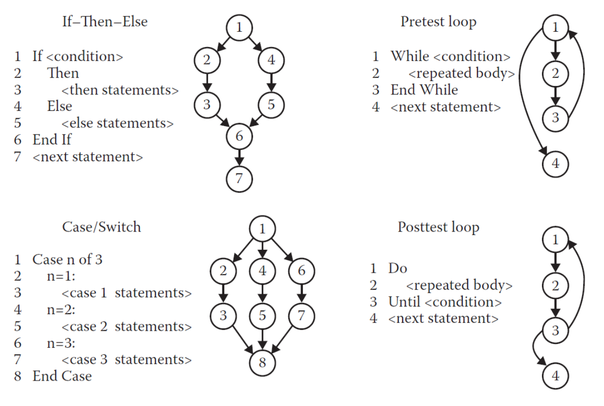

#### Example

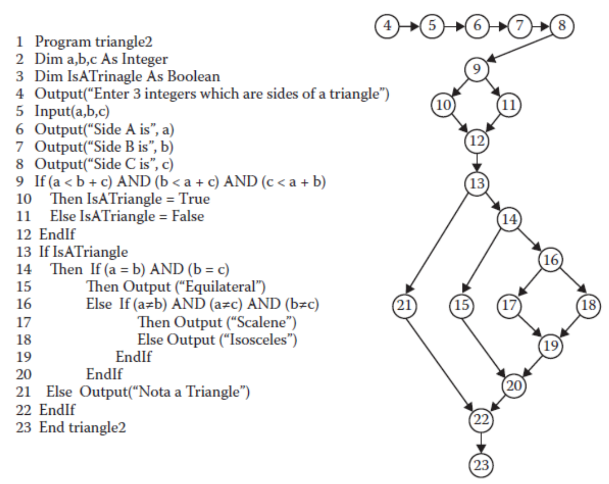

- Non-executable statements are not included 
- Nodes 4 to 8 are a sequence, nodes 9 to 12 are an if-then-else construct, nodes 13 to 22 are nested if-then-else construct. 
- Node 4 is a program source that signify single-entry (indeg = 0) 
- Node 23 is a sink node that signify single-exit (outdeg = 0) 
- No loops exist, so this is a directed acyclic graph

### DD-Paths

- The best known form of structural testing is based on a construct known as a decision-to-decision path.

  最广为人知的结构化测试形式基于一种称为“决策到决策路径”的结构。

- A DD-Path is a chain obtained from a program graph. It is a sub-path **of the Control Flow Graph**. 

  DD-Path是从程序图中获得的一条链，它是控制流图的一个子路径。

- It is the path from one decision node to another, or from a decision node to a terminal node

  这是从一个决策节点到另一个决策节点，或从一个决策节点到终端节点的路径。

- More formally a DD-Path is a chain obtained from a program graph such that: 

  更正式地说，DD-路径（DD-Path）是从程序图中获得的链，其满足以下条件：

  - Case1: it consists of a single node with indeg=0. 
  - Case2: it consists of a single node with outdeg=0, 
  - Case3: it consists of a single node with indeg ≥ 2 or outdeg ≥ 2 (for example, node D and A) 
  - Case4: it consists of a single node with indeg =1, and outdeg = 1 
  - Case5: it is a maximal chain of length ≥ 1

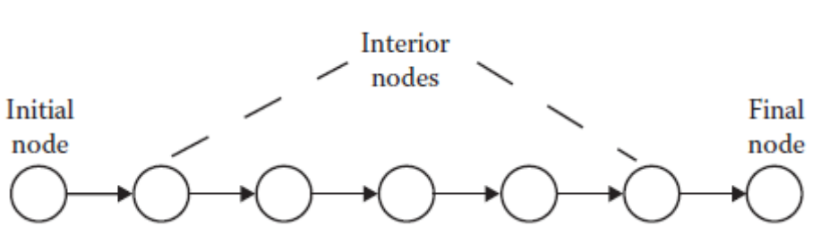

- Given a program written in an imperative language, its DD-path graph is the directed graph in which nodes are DD-paths of its program graph, and edges represent control flow between successor DD-paths.

  给定一个用命令式语言编写的程序，其DD路径图是一种有向图，其中节点对应程序图中的DD路径，而边则表示后继DD路径之间的控制流。

#### CFG to DD-Path Graph

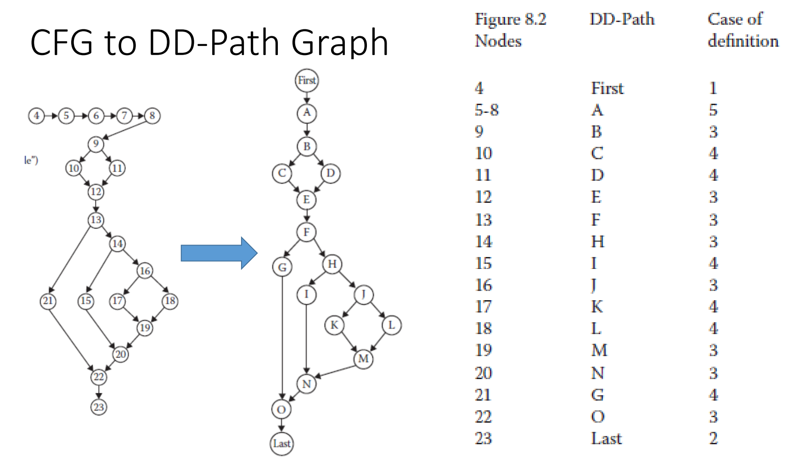

### Test Coverage Metrics

- The motivation of using DD-paths is that they enable **very precise descriptions of test coverage**. 

  使用DD-路径的动机在于它们能够实现对测试覆盖率非常精确的描述。

- The fundamental limitations of specification-based testing is that it is impossible to know either the extent of redundancy or the possibility of gaps corresponding to the way a set of functional test cases exercises a program 

  基于规格说明的测试的一个根本局限性在于，无法确定一组功能测试用例对程序进行测试时，其冗余程度如何，也无法判断是否存在与程序执行路径相对应的测试缺口。

- Test coverage metrics are a device to measure the extend to which a set of test cases covers a program.

  测试覆盖率指标是一种用来衡量测试用例集对程序覆盖程度的工具。

#### E.F. Miller’s Test Coverage Metrics

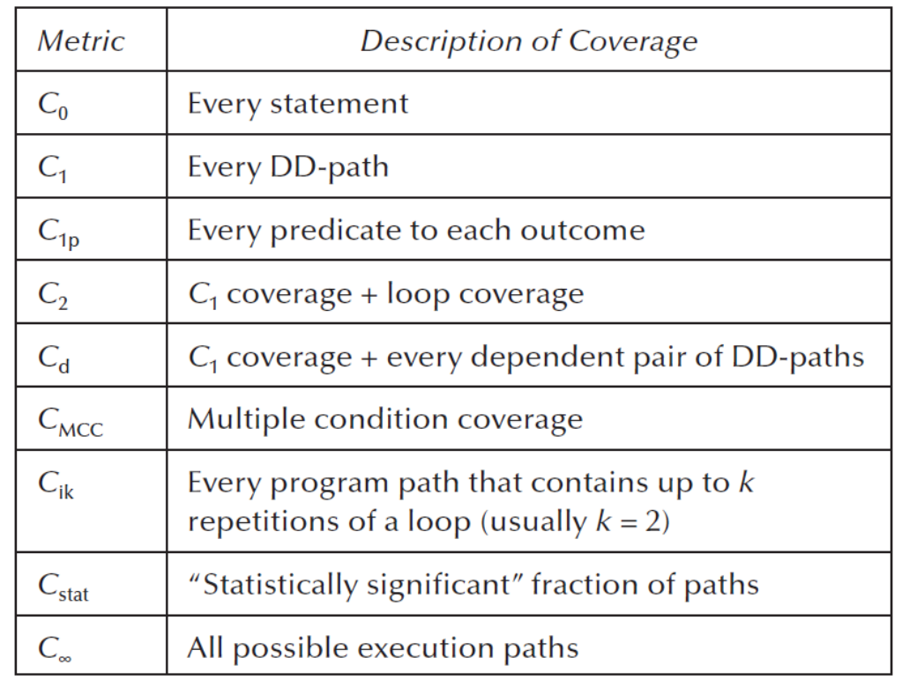

#### Statement and Predicate Coverage Testing

- Statement coverage based testing aims to devise test cases that collectively exercise all statements in a program. 

  基于语句覆盖的测试旨在设计测试用例，使其能够共同执行程序中的所有语句。

- Predicate coverage (or branch coverage, or decision coverage) based testing aims to devise test cases that evaluate each simple predicate of the program to True and False. Here the term simple predicate refers to either a single predicate or a compound Boolean expression that is considered as a single unit that evaluates to True or False. This amounts to traversing every edge in the DD-Path graph. • For example in predicate coverage for the condition.

  基于谓词覆盖（或分支覆盖、判定覆盖）的测试旨在设计测试用例，使程序中每个简单谓词取值True和False。此处的术语"简单谓词"指代可被视为单一评估单元并取值为True或False的单个谓词或复合布尔表达式。这等同于遍历DD-路径图中的每一条边。• 例如，在针对该条件的谓词覆盖测试中

- if(A or B) then C we could consider the test cases A=True, B= False (true case), and A=False, B=False (false case)

  若满足条件A或B则执行C，可考虑测试用例：A=True, B=False（真值情况）及A=False, B=False（假值情况）。

#### DD-Path Graph Edge Coverage C<sub>1</sub>

Here a T,T and F,F combination will suffice to have DD-Path Graph edge coverage or Predicate coverage C<sub>1</sub>

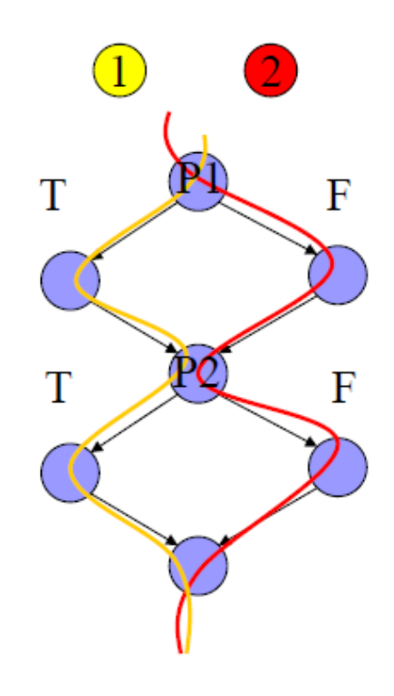

#### DD-Path Coverage Testing C<sub>1P</sub>

This is the same as the C1 but now we must consider test cases that exercise **all possible outcomes** of the choices T,T, T,F, F,T, F,F for the predicates P1, and P2 respectively, in the DD-Path graph.

这与C1相同，但现在我们必须考虑在DD路径图中，针对谓词P1和P2分别测试所有可能的选择结果T,T、T,F、F,T、F,F的测试用例。

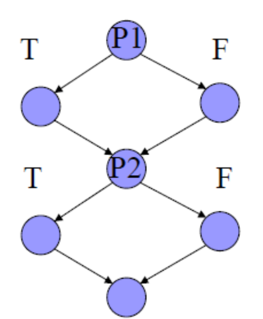

#### Multiple Condition Coverage Testing 多条件覆盖测试

- Now if we consider that the predicates P1 is a compound predicate (i.e. (A or B)) then Multiple Condition Coverage Testing requires that **each possible combination of inputs be tested for each decision**. 

  现在考虑谓词P1是复合谓词（即A或B）的情况。对于这种由简单条件通过逻辑运算符连接而成的情况，多条件覆盖测试中的谓词"决定"指的是整个"决策",而非单个条件。多条件覆盖测试要求对每个决策都测试所有可能的输入组合.

- Example: “if (A or B)” requires 4 test cases: 

  - A = True, B = True 
  - A = True, B = False 
  - A = False, B = True 
  - A = False, B = False 

- The problem: **For n conditions, 2<sup>n</sup> test cases** are needed, and this grows exponentially with n问题：若存在 n 个条件，则需要 2n 个测试用例，且该数量随 n 呈指数级增长。

#### Dependent DD-Path Pairs Coverage Testing C<sub>d</sub>

- In simple C<sub>1</sub> coverage criterion we are interested simply to traverse all edges in the DD-Path graph. 

  简单的C1覆盖准则中，我们的目标仅是遍历DD-路径图中的所有边。

- If we enhance this coverage criterion by ensuring that we traverse dependent pairs of DD-Paths also we may have the chance of revealing more errors that are based on data flow dependencies.

  如果我们通过确保遍历DD路径的依赖对来增强这一覆盖准则，我们可能会有机会揭示更多基于数据流依赖关系的错误。

- More specifically, two DD-Paths are said to be dependent iff there is a define/reference relationship between these DD-Paths, in which a variable is defined (receives a value) in one DD-Path and is referenced in the other. 

  更具体地说，两条DD路径之间被称为存在依赖关系，当且仅当它们之间存在定义/引用关系，即某变量在其中一条DD路径中被定义（获得值），而在另一条DD路径中被引用。

- In Cd testing we are interested on covering all edges of the DD-Path graph and all dependent DD-Path pairs. 

  在条件测试中，我们关注覆盖DD-路径图的所有边以及所有相互依赖的DD-路径对。

- The importance of these dependencies is that they are closely related to the problem of infeasible paths. We have good examples of dependent pairs of DD-paths: in slide 16, C and H are such a pair, as are DD-paths D and H.

  这些依赖关系的重要性在于它们与不可达路径问题密切相关。我们已掌握DD-路径依赖对的典型示例：在第16张幻灯片中，C与H构成一对依赖关系，D与H同样如此。

#### Loop Coverage

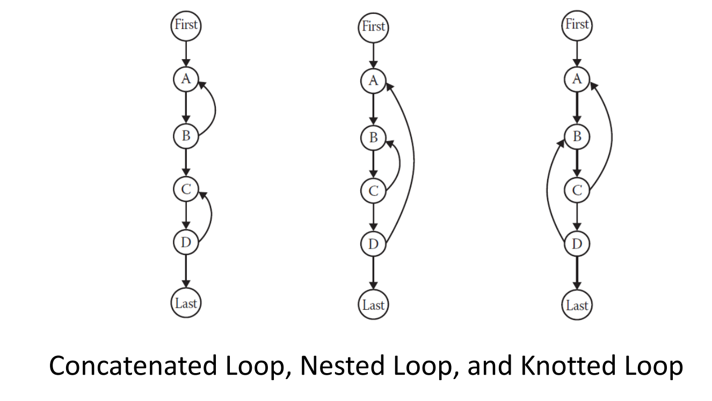

- The simple view of loop testing coverage is that we must devise test cases that exercise the two possible outcomes of the decision of a loop condition that is one to traverse the loop and the other to exit (or not enter) the loop. 

  循环测试覆盖的简单观点是，我们必须设计测试用例，以覆盖循环条件决策的两种可能结果：一种是遍历循环，另一种是退出（或不进入）循环。

- An extension would be to consider a modified boundary value analysis approach where the loop index is given a minimum, minimum +, a nominal, a maximum -, and a maximum value or even robustness testing.

  一种扩展思路可以考虑采用修正的边界值分析方法，即对循环索引取最小值、最小值加、典型值、最大值减和最大值，甚至进行健壮性测试。

-  In the case of nested loops we start with the inner most loop and we proceed outwards. 

  对于嵌套循环的情况，我们从最内层循环开始，然后逐步向外处理。

- If loops are knotted then we must apply data flow analysis testing techniques, that we will examine later in the module.

  循环若存在嵌套，则须应用数据流分析测试技术，该技术将在本模块后续章节中详述。

#### Example

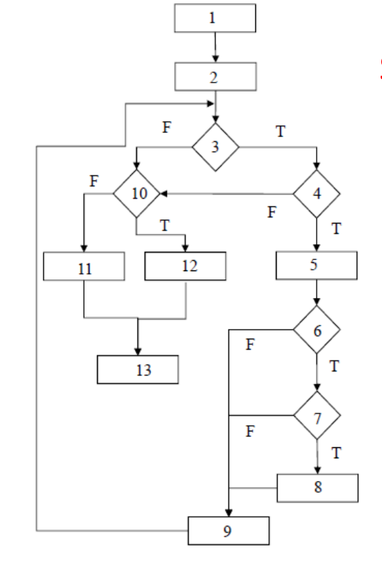

-  Statement Coverage C0 : 
  - SCPath1: 1-2-3(F)-10(F)-11-13 
  - SCPath2: 1-2-3(T)-4(T)-5-6(T)-7(T)-8-9-3(F)-10(T)-12-13 
- Branch or Decision Coverage C1 : 
  - BCPath1: 1-2-3(F)-10(F)-11-13 
  - BCPath2: 1-2-3(T)-4(T)-5-6(T)-7(T)-8-9-3(F)-10(T)-12-13 
  - BCPath3: 1-2-3(T)-4(F)-10(F)-11-13 
  - BCPath4: 1-2-3(T)-4(T)-5-6(F)-9-3(F)-10(F)-11-13 
  - BCPath5: 1-2-3(T)-4(T)-5-6(T)-7(F)-9-3(F)-10(F)-11-13

### Basic Path Testing

#### McCabe’s Basis Path Testing

- Basis Path Testing is a white box testing approach proposed by Tom McCabe. The idea is to derive a measure of the logical complexity of a program and use this as a guide for defining a basic set of execution paths to test. 

  基本路径测试是汤姆·麦凯布提出的一种白盒测试方法。其核心理念在于计算程序逻辑复杂性的度量指标，并以此为依据确定一组需要测试的基础执行路径集合。

- The measure of complexity used is typically the cyclomatic complexity, which is based on the control flow structure of the program. 

  所使用的复杂度度量通常是圈复杂度，其基于程序的控制流结构。

- The method to carry out basis path testing has four steps: 

  基本路径测试方法的执行包含四个步骤：

  1. Compute the program graph 

     计算程序图

  2. Calculate the cyclomatic complexity 

     计算圈复杂度

  3. Select a basis set of paths 

     选择一组路径基集

  4. Generate test cases for each of these paths.

     为每一条路径生成测试用例。

##### Step 1: 

- To begin, we need a program graph from which to construct a basis 

  步骤1：首先，我们需要一个程序图来构建基。

- The below figure is a directed graph which is the DD-Path graph of some program. 

  下图是一个有向图，它是某个程序的DD路径图。

- The program has a single entry (A) and a single exit (G).

  程序具有单个入口(A)和单个出口(G)。

##### Step 2:

- The cyclomatic complexity of a program, according to McCabe's method, is calculated as the number of linearly independent paths through the program's source code. 

  根据McCabe方法，程序的圈复杂度通过计算程序中线性独立路径的数量得出。

- Essentially, it provides a **count of the number of decisions** in the source code to give an indication of the program's overall complexity.

  本质上，它通过对源代码中的决策数量进行计数，来反映出程序的整体复杂度。

------

- The formula for cyclomatic complexity is given by 

  圈复杂度的公式如下：

  - **V(G) = e – n + 2p or V(G) = e – n + p** 

  - **Where, e: the number edges; n: the number of nodes; p: number of connected regions.** 

    **其中，e 为边数；n 为节点数；p 为连通区域数。**

- **The number of linearly independent paths from source node to sink node in the graph is** 

  **图中从源节点到汇节点的线性无关路径的数量为**

  - **V(G) = e – n + 2p = 10 – 7 + 2(1) = 5** 

- **The number of linearly independent circuits in the graph is** 

  **图中线形独立回路的数目为**

  - **V(G) = e – n + p = 11 – 7 + 1 = 5**

------

##### Step 3: 

- A linearly independent path is any path through the source code that introduces at least one new set of processing statements or a new condition. 

  线性独立路径是指贯穿源代码的任意路径，该路径至少引入一组新的处理语句或一个新条件。

- McCabe’s Baseline Method 

  - The method begins with the selection of a “baseline path”, which should correspond to a normal execution of a program (from start node to end node, and has as many decisions as possible). 

    该方法首先选择一条“基线路径”，该路径应对应于程序的正常执行过程（从起始节点到终止节点，并包含尽可能多的决策分支）。

  - The algorithm proceeds by retracing the paths visited and flipping the conditions one at a time. 

    该算法通过回溯已访问的路径并逐一翻转条件来实现。

  - The process repeats up to the point all flips have been considered.

    该过程持续重复，直至所有翻转情况均被考虑完毕。

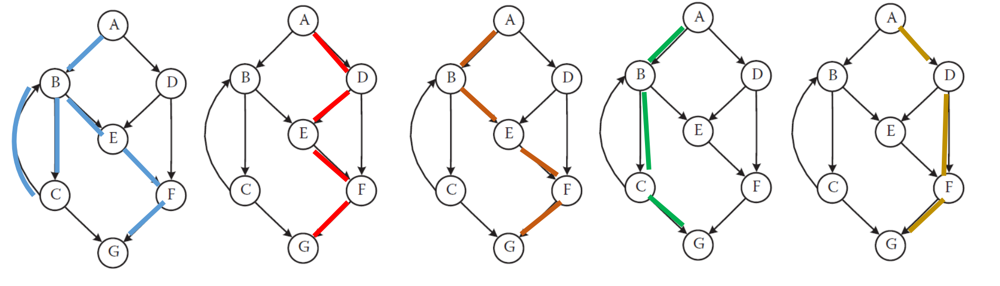

#### Observation on Basis Path Method

- Two major soft spots occur in McCabe’s view: 

  在麦凯布看来，存在两大明显薄弱环节：

  - Testing the set of basis paths is sufficient (it is not!) 

    测试基本路径集是否充分（实际上并不充分！）

  - Have to make program paths look like a vector space.

    必须使程序路径看起来像向量空间。

- V(G)=e-n+2p =18-15+2(1) =5 
  - Original p1: A-B-C-E-F-H-J-K-M-N-O-Last (Scalene) 
  - Flip p1 at B - p2: A-B-D-E-F-H-J-K-M-N-O-Last (Infeasible) 
  - Flip p1 at F - p3: A-B-C-E-F-G-O-Last (Infeasible) 
  - Flip p1 at H - p4: A-B-C-E-F-H-I-N-O-Last (Equilateral) 
  - Flip p1 at J - p5:A-B-C-E-F-H-J-L-M-N-O-Last (Isosceles)

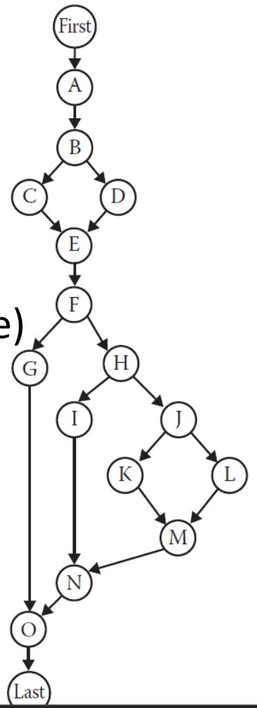

- McCabe’s procedure successfully identifies basis path that are topologically independent, but when these contradict semantic dependences, topologically possible paths are seen to be logically infeasible.

  McCabe的过程成功识别出拓扑上独立的基路径，但当这些路径与语义依赖相矛盾时，拓扑上可能的路径会被视为逻辑上不可行的。

-  If we assume that the logic of the program dictates that “if node C is traversed, then we must traverse node H, and if node D is traversed, then we must traverse Node G” 

  假设程序逻辑规定“若遍历节点C，则必须遍历节点H；若遍历节点D，则必须遍历节点G”。

- These constraints will eliminate Paths 2,3 

  这些限制条件将排除路径2和路径3。

  - We also need a basis path for the NotATriangle case 

    另外，我们还需要为NotATriangle情况设置一个基础路径。

  - We are left to consider four feasible paths: 

    我们剩下来需要考虑四种可行的路径：

    - p1: A-B-C-E-F-H-J-K-M-N-O-Last (Scalene) 
    - p4: A-B-C-E-F-H-I-N-O-Last (Equilateral) 
    - p5:A-B-C-E-F-H-J-L-M-N-O-Last (Isosceles) 
    - p6: A-B-D-E-F-G-O-Last (Not a triangle)

## Guidelines and Observations

-  Functional testing focuses on properties that are “too far” or disassociated from the source code being tested 

  功能测试关注的是与待测源代码“距离过远”或已脱钩的属性。

- Path testing focuses too much on the graph and not the logic of the code, but is very useful to measure the quality of the testing (coverage criteria) 

  路径测试过度关注控制流图而非代码逻辑，但在评估测试质量（覆盖准则）方面具有重要实用价值。

- Basis path testing is giving us a lower bound of how much testing is necessary

  基路径测试为我们提供了所需测试量的下界。

-  Path testing is providing a set of metrics that act as cross checks to functional testing 

  路径测试提供了一组指标，作为对功能测试的一种交叉校验手段。

  - **When a program path is traversed by several functional test cases we suspect redundancy** 

    **当某程序路径被多个功能测试用例覆盖时，我们疑其存在冗余。**

  - **When we fail to attain DD-Path graph coverage, we know that there are gaps in the functional test cases** 

    **当我们未能达到DD路径图覆盖率时，意味着功能测试用例存在遗漏。**

- Coverage metrics can be used as 

  覆盖度指标可用作

  - Setting minimum testing standards and as mechanism to selectively test portions of the code more rigorously than others

    设置最低测试标准，并将其作为对不同代码部分进行差异化严格测试的机制。

# 1. DD-path 到底是什么？

## 1.1 先理解 CFG

白盒测试会先把代码画成 **Control Flow Graph, CFG 控制流图**。

在 CFG 里面：

```
Node = 一句代码 / 一小段代码
Edge = 程序执行方向
```

例如：

```
1  input x
2  if (x > 0)
3      print("positive")
4  else
5      print("not positive")
6  print("end")
```

它的执行路线大概是：

```
1 → 2
2 → 3 → 6    // x > 0 为 True
2 → 5 → 6    // x > 0 为 False
```

这里 node 2 是 decision node，因为它有两个方向：True 和 False。

------

## 1.2 DD-path 是什么？

DD-path 全称是 **Decision-to-Decision Path**，也就是“从一个决策点到另一个决策点的路径”。

但是为了初学理解，你可以先这样记：

```
DD-path = CFG 中一段连续执行的路。
遇到分支点、汇合点、入口、出口，就切一刀。
```

也就是说，DD-path 会把很多普通 statement 合并成一段，让 CFG 变得更简单。

课件中定义 DD-path 是从 program graph 得到的 chain，是 CFG 的 sub-path，可以是从一个 decision node 到另一个 decision node，或者从 decision node 到 terminal node。

------

# 2. 用一个简单代码看 DD-path

看这段代码：

```
1  start
2  input x
3  if (x > 0)
4      y = x + 1
5  else
6      y = x - 1
7  print(y)
8  end
```

## 2.1 先画执行路线

```
1 → 2 → 3
          ├── True  → 4 → 7 → 8
          └── False → 6 → 7 → 8
```

## 2.2 找出 DD-path

我们把连续的普通语句合并：

```
DD-path A: 1 → 2
DD-path B: 3                 // decision node
DD-path C: 4                 // True branch
DD-path D: 6                 // False branch
DD-path E: 7 → 8             // merge 后的共同路径
```

所以原来的 CFG：

```
1 → 2 → 3 → 4 → 7 → 8
        ↘ 6 ↗
```

可以简化成 DD-path graph：

```
A → B
    ├── C → E
    └── D → E
```

这个图更容易分析测试覆盖率。

------

# 3. 为什么需要 DD-path？

因为如果直接看代码行数，会太细碎。

例如一段代码有 30 行，但其中 10 行都是连续顺序执行的普通语句。测试时只要走进这段路，这 10 行通常都会一起执行。DD-path 就把它们合并成一段。

所以 DD-path 的好处是：

```
1. 简化 CFG
2. 更容易看出有哪些执行路径
3. 更容易判断测试用例有没有覆盖所有分支
4. 更方便计算 test coverage
```

课件也说，DD-path graph 的 node 是 DD-path，edge 表示后继 DD-path 之间的控制流。

------

# 4. Test Coverage Metrics 是什么？

Test coverage metrics 就是“覆盖率指标”。

它回答的问题是：

```
你的测试用例到底测试到了程序的哪些部分？
有没有漏掉的 statement？
有没有漏掉的 branch？
有没有重复测试同一条路径？
有没有复杂条件没有完全测到？
```

课件中说，functional testing 的问题是：我们很难知道测试用例有没有 redundancy，也很难知道有没有 gaps；coverage metrics 就是用来衡量 test cases 覆盖程序程度的工具。

------

# 5. 用同一个例子解释 Coverage

还是这段代码：

```
1  start
2  input x
3  if (x > 0)
4      y = x + 1
5  else
6      y = x - 1
7  print(y)
8  end
```

DD-path graph 是：

```
A → B
    ├── C → E
    └── D → E
```

其中：

```
A = 1 → 2
B = 3, if (x > 0)
C = 4, y = x + 1
D = 6, y = x - 1
E = 7 → 8
```

------

## 5.1 C0：Statement Coverage 语句覆盖

C0 要求：

```
每一条 statement 至少执行一次。
```

如果我们只设计一个 test case：

```
Test case 1: x = 5
```

执行路线是：

```
A → B → C → E
```

也就是：

```
1 → 2 → 3 → 4 → 7 → 8
```

这时第 6 行没有执行：

```
6 y = x - 1
```

所以 **C0 没有达到 100%**。

如果再加一个 test case：

```
Test case 2: x = -3
```

执行路线是：

```
A → B → D → E
```

这时所有 statement 都执行过了，所以 C0 达到 100%。

课件中说，statement coverage 的目标就是设计测试用例，使所有 statements 都被执行。

------

## 5.2 C1：Branch / Predicate Coverage 分支覆盖

C1 要求：

```
每个 decision 的 True 和 False 都要测试到。
```

在这个例子里，decision 是：

```
if (x > 0)
```

它有两个 outcome：

```
True: x > 0
False: x <= 0
```

所以我们需要：

```
Test case 1: x = 5     // True branch
Test case 2: x = -3    // False branch
```

这样 C1 就达到了。

课件中说，predicate coverage 也叫 branch coverage 或 decision coverage，它要求每个 simple predicate 都取 True 和 False；这等价于遍历 DD-path graph 的每一条 edge。

------

# 6. C0 和 C1 的区别

你可以这样理解：

```
C0 问：每一句代码有没有执行过？
C1 问：每一个分支方向有没有走过？
```

举一个容易混淆的例子：

```
1  if (x > 0)
2      print("positive")
3  print("end")
```

如果测试：

```
x = 5
```

执行：

```
1 → 2 → 3
```

所有 statement 都执行过了，所以 C0 = 100%。

但是 False branch 没有走过，也就是 `x <= 0` 没测，所以 C1 没有达到 100%。

因此：

```
C1 比 C0 更强。
达到 C1 通常可以达到 C0。
但达到 C0 不一定达到 C1。
```

------

# 7. C1p 是什么？

C1p 比 C1 更细。

C1 只关心：

```
每个判断结果有没有 True 和 False？
```

C1p 更关心：

```
多个 predicate 的组合有没有都测到？
```

看这个例子：

```
if (A)
    if (B)
        print("X")
```

这里有两个 predicate：

```
P1 = A
P2 = B
```

C1 可能只需要让 A 有 True/False，B 有 True/False。

但是 C1p 会要求考虑组合：

```
A=True,  B=True
A=True,  B=False
A=False, B=True
A=False, B=False
```

不过在真实程序中，有些组合可能走不到。例如 A=False 的时候，里面的 if(B) 根本不会执行。所以 C1p 在实际使用时也要注意 feasible / infeasible path 问题。

课件中也说，C1p 和 C1 类似，但是要考虑 P1 和 P2 的所有 outcome 组合，例如 TT、TF、FT、FF。

------

# 8. Multiple Condition Coverage 是什么？

Multiple Condition Coverage 主要针对这种情况：

```
if (A || B)
```

这里整个 decision 是：

```
A || B
```

但是里面有两个 small condition：

```
A
B
```

C1 只要求整个 decision 出现 True 和 False：

```
A=True,  B=False   // 整体 True
A=False, B=False   // 整体 False
```

这样已经满足 C1。

但是 Multiple Condition Coverage 要求所有组合都测：

```
A=True,  B=True
A=True,  B=False
A=False, B=True
A=False, B=False
```

课件中给的例子也是 `if (A or B)` 需要 4 个 test cases；缺点是 n 个条件需要 2^n 个测试用例，数量增长很快。

------

# 9. Dependent DD-path Pairs Coverage, Cd 是什么？

这个比较抽象，你可以先理解为：

```
Cd 不只是看控制流，还看变量的数据流。
```

也就是说，C1 只关心有没有走过每条边。

Cd 进一步问：

```
一个变量在哪里被定义？
这个变量后来在哪里被使用？
你的测试有没有覆盖这种 define-use 关系？
```

例如：

```
1  input x
2  if (x > 0)
3      y = x + 1
4  else
5      y = x - 1
6  if (y > 10)
7      print("large")
8  else
9      print("small")
```

这里有两个地方定义 y：

```
DD-path C: y = x + 1
DD-path D: y = x - 1
```

然后后面有地方使用 y：

```
DD-path F: if (y > 10)
```

所以：

```
C 和 F 是 dependent DD-path pair
D 和 F 也是 dependent DD-path pair
```

为什么？因为 C/D 定义了 y，F 使用了 y。

如果你的测试只让程序走：

```
x = 20
```

可能只覆盖：

```
y = x + 1  → if (y > 10)
```

但没有覆盖：

```
y = x - 1  → if (y > 10)
```

所以 Cd 可能还不够。

课件中说，两个 DD-path dependent 的条件是存在 define/reference relationship：变量在一个 DD-path 中被定义，在另一个 DD-path 中被引用；Cd testing 要覆盖 DD-path graph 的所有 edges 和所有 dependent DD-path pairs。

------

# 10. 把几个 Coverage 放在一起对比

用这个代码：

```
1  input x
2  input y
3  if (x > 0 || y > 0)
4      z = x + y
5  else
6      z = x - y
7  if (z > 10)
8      print("large")
9  else
10     print("small")
```

## C0：Statement Coverage

要求每行至少执行一次。

可能需要：

```
Test 1: x=5, y=1     → 走 line 4
Test 2: x=-5, y=-1   → 走 line 6
Test 3: x=20, y=1    → 走 print large
Test 4: x=1, y=1     → 走 print small
```

重点是覆盖 statements。

------

## C1：Branch Coverage

要求每个 if 的 True/False 都走到。

第一个 if：

```
x > 0 || y > 0
True 要走
False 要走
```

第二个 if：

```
z > 10
True 要走
False 要走
```

重点是覆盖 branch。

------

## Multiple Condition Coverage

第一个 if 是 compound condition：

```
x > 0 || y > 0
```

这里有两个 condition：

```
A = x > 0
B = y > 0
```

所以要测：

```
A=True,  B=True
A=True,  B=False
A=False, B=True
A=False, B=False
```

重点是覆盖 compound condition 的所有组合。

------

## Cd：Dependent DD-path Pair Coverage

看变量 z：

```
z = x + y
z = x - y
```

后面：

```
if (z > 10)
```

所以要覆盖：

```
z = x + y 之后使用 z
z = x - y 之后使用 z
```

重点是覆盖 define-use relationship。

------

# 11. 你可以这样背考试答案

## DD-path 简答版

```
A DD-path is a decision-to-decision path obtained from a Control Flow Graph.
It is a chain or sub-path in the program graph, usually from one decision node to another decision node, or from a decision node to a terminal node.
DD-paths simplify the CFG by grouping sequential statements together.
They are useful because they allow more precise measurement of test coverage.
```

中文理解：

```
DD-path 就是把 CFG 中连续执行的一段路抽出来。
遇到决策点、汇合点、入口、出口就切开。
它的作用是简化控制流图，让测试覆盖率更容易计算。
```

------

## Test coverage metrics 简答版

```
Test coverage metrics are measures used to evaluate how much of a program is exercised by a set of test cases.
They help identify redundant test cases and gaps in testing.
For example, statement coverage checks whether every statement is executed, while branch coverage checks whether every decision outcome is tested.
```

中文理解：

```
Test coverage metrics 就是测试覆盖率指标。
它用来判断测试用例到底覆盖了多少代码、多少分支、多少路径。
它可以帮助发现重复测试和漏测。
```

------

# 12. 最容易混淆的地方

你重点记住这张表：

| 指标                           | 它问的问题                                    | 简单例子                           |
| ------------------------------ | --------------------------------------------- | ---------------------------------- |
| C0 Statement Coverage          | 每一句代码有没有执行？                        | line 1 到 line 10 都至少跑一次     |
| C1 Branch / Predicate Coverage | 每个判断的 True/False 有没有执行？            | if 的 True 和 False 都要走         |
| C1p DD-path Predicate Outcome  | 多个 predicate outcome 组合有没有考虑？       | P1/P2 的 TT、TF、FT、FF            |
| Multiple Condition Coverage    | compound condition 内部小条件组合有没有全测？ | `A or B` 要测 TT、TF、FT、FF       |
| Cd Dependent DD-path Pairs     | 变量定义和使用的路径有没有覆盖？              | `y=...` 后面 `if(y>10)` 是否都测到 |

------

# 13. 最简单的记忆方式

你可以这样记：

```
DD-path = 程序路线分段
Coverage metrics = 检查测试走了多少路线
C0 = 走过每一句
C1 = 走过每个分支
Multiple Condition = 走过复合条件的所有组合
Cd = 走过变量定义到变量使用的关系
```

所以这节课的逻辑其实是：

```
Source Code
    ↓
CFG 控制流图
    ↓
DD-path graph 简化后的路径图
    ↓
Coverage metrics 衡量测试用例走了多少路径
    ↓
发现 redundancy 和 gaps
```

------

# 1. McCabe’s Procedure 是什么？

完整流程是：

```
1. Compute the program graph
   先把代码画成 CFG 或 DD-path graph。

2. Calculate the cyclomatic complexity
   计算圈复杂度 V(G)，得到至少需要多少条 independent paths。

3. Select a basis set of paths
   选择一组 linearly independent paths。

4. Generate test cases for each path
   为每条路径设计输入数据。
```

简单说就是：

```
代码 → 控制流图 → 算复杂度 → 找独立路径 → 为路径设计 test case
```

------

# 2. Cyclomatic Complexity 是什么？

Cyclomatic Complexity 中文一般叫 **圈复杂度**。

你可以把它理解成：

```
程序中 decision 越多，可能路径越多，复杂度越高。
Cyclomatic complexity 就是用来衡量程序控制流复杂度的数字。
```

课件中说，它本质上是通过计算 source code 中 decision 的数量，反映程序整体复杂度；同时它也表示程序中 linearly independent paths 的数量。

也就是说，如果算出来：

```
V(G) = 4
```

那么意思是：

```
这个程序至少需要 4 条 linearly independent paths 来做 basis path testing。
```

注意这里是 **至少**，不是“只测 4 条就一定完全够”。课件后面也提醒，basis path testing 给的是 testing effort 的 lower bound。

------

# 3. 两个公式分别是什么？

课件中给了两个公式：

```
V(G) = e - n + 2p
```

和：

```
V(G) = e - n + p
```

其中：

```
e = number of edges，边的数量
n = number of nodes，节点的数量
p = number of connected regions / connected components，连通区域数量
```

课件中也给了两个用法：`V(G)=e-n+2p` 用来计算从 source node 到 sink node 的 linearly independent paths；`V(G)=e-n+p` 用来计算图中的 linearly independent circuits。

------

# 4. 第一个公式：V(G) = e - n + 2p

这个是考试里最常用的公式。

它通常用于这种情况：

```
程序图有一个入口 source node，也有一个出口 sink node。
我们想知道从开始到结束至少有多少条 independent paths。
```

## 例子 1：一个简单 if-else

代码：

```
1  start
2  input x
3  if (x > 0)
4      print("positive")
5  else
6      print("not positive")
7  end
```

控制流大概是：

```
A → B → C
        ├── D → F
        └── E → F
```

其中：

```
A = start
B = input x
C = if (x > 0)
D = print positive
E = print not positive
F = end
```

现在数：

```
n = 6 个 nodes
e = 6 条 edges
p = 1，因为这是一个连通的程序图
```

edges 是：

```
A→B
B→C
C→D
C→E
D→F
E→F
```

所以：

```
V(G) = e - n + 2p
     = 6 - 6 + 2(1)
     = 2
```

结果是 2，意思是：这个程序至少需要 2 条独立路径。

这两条路径就是：

```
Path 1: A → B → C → D → F    // x > 0
Path 2: A → B → C → E → F    // x <= 0
```

对应 test cases：

```
Test case 1: x = 5
Test case 2: x = -1
```

所以这里的 V(G)=2 很合理，因为一个 if-else 有两个主要分支。

------

# 5. 第二个公式：V(G) = e - n + p

这个公式课件中说是用来计算：

```
number of linearly independent circuits
```

也就是图中 **线性独立回路 / 独立环路** 的数量。

为什么这个公式少了一个 p？

因为第一个公式通常是对“从入口到出口的程序图”使用；第二个公式更像是在看图里面有多少个独立 circuit。对于一般考试中的 basis path testing，最常用的是：

```
V(G) = e - n + 2p
```

你可以这样记：

```
算 source 到 sink 的 independent paths：用 e - n + 2p
算 graph 中 independent circuits：用 e - n + p
```

------

# 6. 用一个 while loop 例子解释两个公式的差别

代码：

```
1  start
2  i = 0
3  while (i < 3)
4      print(i)
5      i = i + 1
6  end
```

控制流：

```
A → B → C
        ├── True → D → E → C
        └── False → F
```

其中：

```
A = start
B = i = 0
C = while (i < 3)
D = print(i)
E = i = i + 1
F = end
```

edges：

```
A→B
B→C
C→D
D→E
E→C
C→F
```

所以：

```
n = 6
e = 6
p = 1
```

## 用第一个公式

```
V(G) = e - n + 2p
     = 6 - 6 + 2(1)
     = 2
```

意思是：从 start 到 end，至少有 2 条 independent paths：

```
Path 1: A → B → C → F
        while 条件一开始就是 False，不进入 loop

Path 2: A → B → C → D → E → C → F
        进入 loop，然后退出
```

所以 basis path testing 至少要考虑：

```
1. loop 不执行
2. loop 执行至少一次
```

这和 loop testing 的直觉一致。

## 用第二个公式

如果只看图中的 independent circuit：

```
C → D → E → C
```

这是一个 loop circuit。

用：

```
V(G) = e - n + p
     = 6 - 6 + 1
     = 1
```

意思是：这个图里面有 1 个独立回路。

所以两个公式的关注点不同：

```
e - n + 2p：问从入口到出口至少有多少条独立路径
e - n + p：问图里面有多少个独立回路
```

------

# 7. Linearly Independent Path 是什么？

课件中说，linearly independent path 是任何一条会引入至少一个新的 processing statement 或 new condition 的路径。

用简单话说：

```
一条路径只要比之前的路径多走了一条新的边、一个新的分支、或者新的条件，
它就是 independent path。
```

例如 if-else：

```
Path 1: A → B → C → D → F
Path 2: A → B → C → E → F
```

Path 2 和 Path 1 的不同点是：

```
C → E 这条 False branch 是新的。
```

所以 Path 2 是 independent path。

------

# 8. McCabe’s Baseline Method 是怎么选路径的？

课件中的 McCabe’s Baseline Method 是这样做的：

```
1. 先选择一条 baseline path。
   这条路径应该是程序的正常执行路径，从 start 到 end，并尽可能包含更多 decisions。

2. 然后沿着这条路径回溯。

3. 每次 flip 一个 condition。
   也就是本来走 True 的地方改走 False，
   或本来走 False 的地方改走 True。

4. 重复这个过程，直到所有 flip 都考虑过。
```

课件原文也是这样说：先选择 baseline path，然后 retracing visited paths，并 one at a time flipping the conditions。

------

# 9. 用一个具体代码走 McCabe’s procedure

看这个代码：

```
1  start
2  input age
3  input member
4  if (age >= 18)
5      if (member == true)
6          price = 80
7      else
8          price = 100
9  else
10     price = 50
11 print(price)
12 end
```

这个程序有两个 decision：

```
Decision 1: age >= 18
Decision 2: member == true
```

控制流：

```
A → B → C
        ├── age>=18 True → D
        │                  ├── member True → E → H
        │                  └── member False → F → H
        └── age>=18 False → G → H
```

其中：

```
A = start/input
C = if age >= 18
D = if member == true
E = price = 80
F = price = 100
G = price = 50
H = print/end
```

## Step 1: 画 program graph

我们已经画了。

## Step 2: 计算 cyclomatic complexity

数 nodes：

```
n = 7
A, C, D, E, F, G, H
```

数 edges：

```
A→C
C→D
C→G
D→E
D→F
E→H
F→H
G→H
```

所以：

```
e = 8
p = 1
```

计算：

```
V(G) = e - n + 2p
     = 8 - 7 + 2(1)
     = 3
```

所以至少需要 3 条 independent paths。

## Step 3: 选择 baseline path

选择一条正常路径，并尽可能经过更多 decision。

比如：

```
Path 1: A → C(True) → D(True) → E → H
```

对应：

```
age = 20, member = true
```

## Step 4: 每次 flip 一个 condition

原始 baseline path 是：

```
age >= 18 = True
member == true = True
```

### Flip member condition

把第二个 decision 从 True 改成 False：

```
Path 2: A → C(True) → D(False) → F → H
```

对应：

```
age = 20, member = false
```

### Flip age condition

把第一个 decision 从 True 改成 False：

```
Path 3: A → C(False) → G → H
```

对应：

```
age = 16
```

最后得到 3 条路径，正好等于 V(G)=3：

```
Path 1: adult + member
Path 2: adult + non-member
Path 3: underage
```

这就是 McCabe’s procedure 的实际意义。

------

# 10. McCabe’s procedure 的重点作用

它主要有三个作用：

## 作用 1：告诉你最低测试路径数量

比如刚才算出：

```
V(G) = 3
```

意思是你至少需要 3 条 basis paths。

这不是说“只测 3 条一定完美”，而是说：

```
少于 3 条，通常连基本路径覆盖都不够。
```

------

## 作用 2：帮助你系统地选测试路径

不是随便挑测试用例，而是根据控制流图挑：

```
Path 1: baseline path
Path 2: flip condition 1
Path 3: flip condition 2
...
```

这样可以避免你只测试 happy path。

------

## 作用 3：衡量代码复杂度

如果一个函数的 cyclomatic complexity 很高，例如：

```
V(G) = 15
```

说明这个函数有很多分支和路径，可能：

```
1. 难测试
2. 难维护
3. 容易出 bug
4. 可能需要重构
```

所以它不只是测试工具，也是代码质量度量。

------

# 11. 但 McCabe’s procedure 有什么问题？

它最大的问题是：

```
图上能走，不代表逻辑上真的能走。
```

课件中说，McCabe’s procedure 能找出 topologically independent 的 basis paths，但是如果这些路径违反 semantic dependences，那么这些图上可能的路径会变成 logically infeasible。

例如课件中的三角形程序里：

```
Original p1: A-B-C-E-F-H-J-K-M-N-O-Last
Flip at B 得到 p2: A-B-D-E-F-H-J-K-M-N-O-Last
Flip at F 得到 p3: A-B-C-E-F-G-O-Last
```

但是如果程序逻辑规定：

```
如果走了 C，就必须走 H；
如果走了 D，就必须走 G；
```

那么 p2 和 p3 就会被排除，因为它们虽然在图上看起来可能，但逻辑上不可能。课件最后剩下的 feasible paths 是 Scalene、Equilateral、Isosceles、Not a triangle 四类。

所以你要记住：

```
McCabe’s procedure gives a lower bound, not a complete guarantee.
It finds topologically independent paths, but some paths may be logically infeasible.
```

------

# 12. 两个公式的考试记忆方式

你可以这样背：

```
V(G) = e - n + 2p
用于计算从 source node 到 sink node 的 linearly independent paths。
这是 basis path testing 最常用的公式。
V(G) = e - n + p
用于计算 graph 中 linearly independent circuits。
它更关注图中独立回路的数量。
```

更简单的中文记法：

```
+2p：算完整程序路径，从入口到出口。
+p：算图里的独立环路。
```

------

# 13. 考试回答模板

## 问：Explain McCabe’s Basis Path Testing.

你可以答：

```
McCabe’s Basis Path Testing is a white box testing technique used to derive a basic set of execution paths for testing. 
It first constructs the program graph, then calculates cyclomatic complexity, selects a set of linearly independent paths, and finally generates test cases for each path.
Cyclomatic complexity gives a lower bound on the number of independent paths that should be tested.
```

------

## 问：What is cyclomatic complexity?

你可以答：

```
Cyclomatic complexity is a measure of the logical complexity of a program based on its control flow structure. 
It indicates the number of linearly independent paths through the program.
It can be calculated by V(G) = e - n + 2p, where e is the number of edges, n is the number of nodes, and p is the number of connected components.
```

------

## 问：Given e = 12, n = 10, p = 1, calculate V(G).

```
V(G) = e - n + 2p
     = 12 - 10 + 2(1)
     = 4
```

所以：

```
The cyclomatic complexity is 4.
This means at least 4 linearly independent paths should be tested.
```

------

## 问：What is the limitation of McCabe’s procedure?

你可以答：

```
McCabe’s procedure identifies paths that are topologically independent, but these paths may not always be logically feasible. 
A path may appear possible in the control flow graph, but program semantics may make it impossible to execute.
Therefore, basis path testing provides only a lower bound on the necessary testing effort, not a guarantee of complete testing.
```

------

# 14. 最后用一句话总结

```
McCabe’s procedure = 用控制流图计算程序复杂度，并找出至少要测试的独立路径。
V(G)=e-n+2p = 算 source 到 sink 的独立路径数量。
V(G)=e-n+p = 算图中的独立回路数量。
```

你在考试中最需要会的是第一个公式 `V(G)=e-n+2p`，因为它直接告诉你 basis path testing 至少要设计多少条测试路径。
