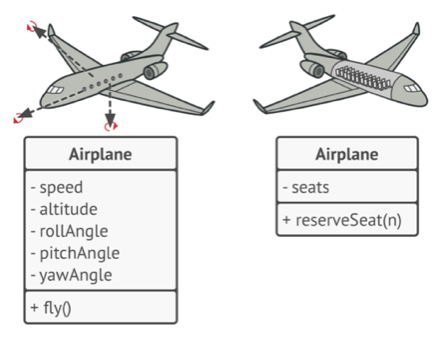
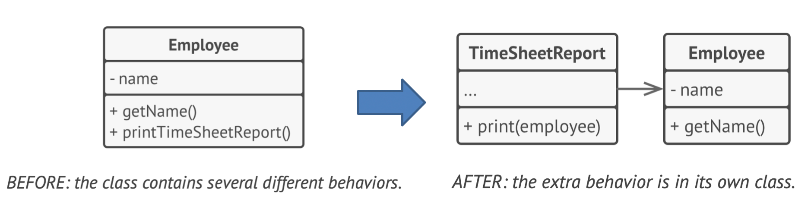
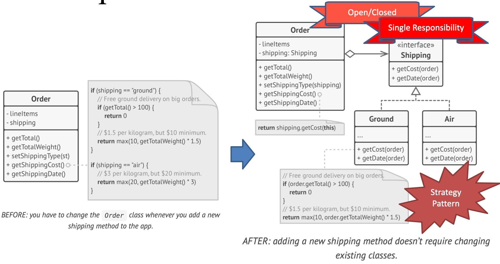
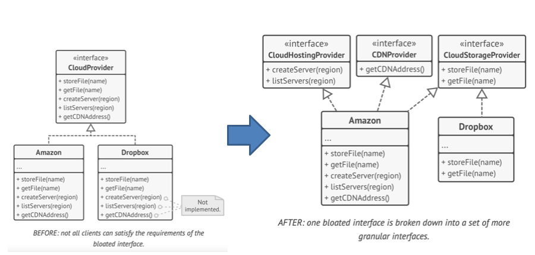
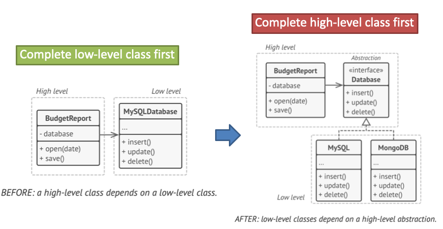
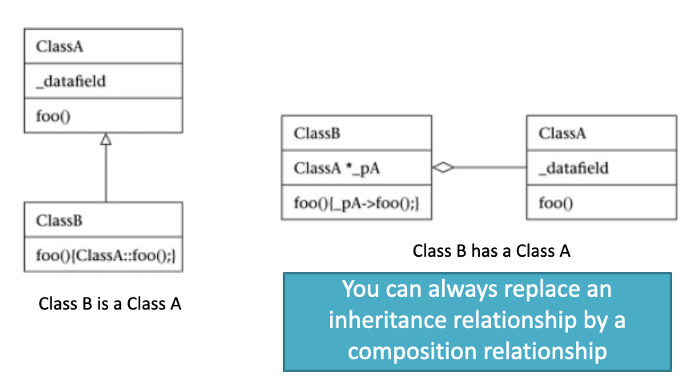
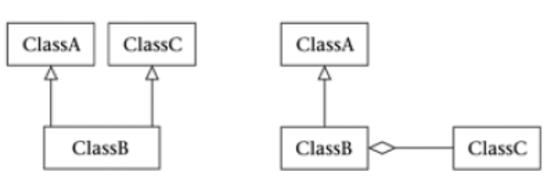
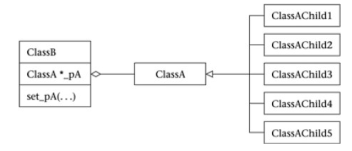
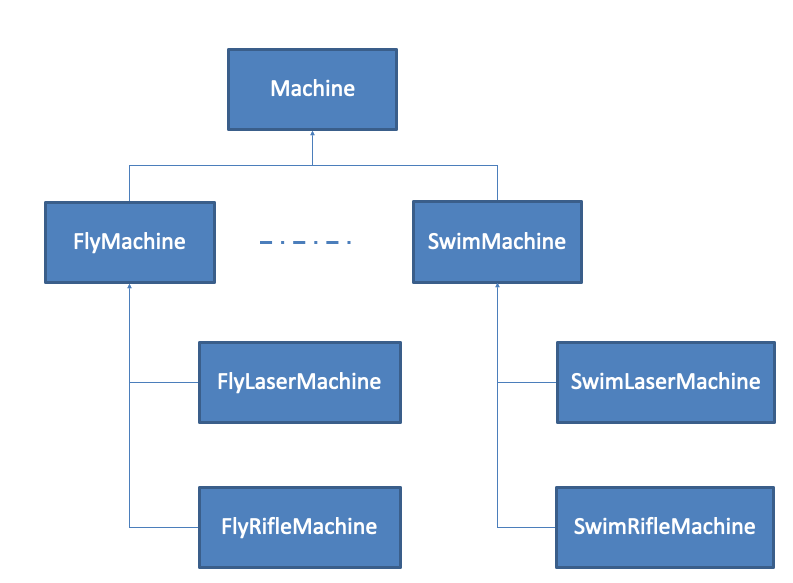

# 2 - Object Oriented Concept

## 知识图谱

```plaintext
Week02 Object-Oriented Concepts
│
├── 1. OOP Recap 面向对象基础回顾
│   │
│   ├── 1.1 Four Pillars of OOP 面向对象四大特性
│   │   │
│   │   ├── Abstraction 抽象
│   │   │   ├── 只建模特定 context 中相关的属性和行为
│   │   │   ├── 忽略与当前业务无关的细节
│   │   │   ├── 让开发者在更高层级理解系统
│   │   │   └── 例子：飞机
│   │   │       ├── 飞行控制系统：速度、高度、飞行姿态、Fly()
│   │   │       └── 订票系统：座位数、reserveSeat()
│   │   │
│   │   ├── Encapsulation 封装
│   │   │   ├── 隐藏对象内部状态和行为
│   │   │   ├── 只暴露有限 interface 给外部
│   │   │   ├── interface 用来定义对象之间的 contract
│   │   │   ├── 绑定 contract 的 class 必须实现 contract 中的方法
│   │   │   └── Interface 的三个含义
│   │   │       ├── 对象暴露给外部的 public part
│   │   │       ├── 编程语言中的 interface keyword
│   │   │       └── 人机交互界面
│   │   │
│   │   ├── Inheritance 继承
│   │   │   ├── 在已有 class 基础上构建新 class
│   │   │   ├── 主要目的：code reuse
│   │   │   ├── subclass 继承 superclass 的 fields 和 methods
│   │   │   ├── 大多数语言中一个 subclass 只能 extend 一个 superclass
│   │   │   └── 一个 class 可以 implement 多个 interfaces
│   │   │
│   │   └── Polymorphism 多态
│   │       ├── 一个对象/类可以以多种形式出现
│   │       ├── 通过相同 interface 访问不同类型对象
│   │       └── Parent class reference can refer to child class object
│   │
│   └── 1.2 OOP 的核心目的
│       ├── 管理复杂性
│       ├── 提高复用性
│       ├── 降低修改成本
│       └── 为后续 SOLID 和 Design Pattern 做基础
│
├── 2. Good Design 什么是好的设计
│   │
│   ├── 2.1 Good Design 的定义
│   │   ├── Hides inherent complexity
│   │   ├── Eliminates accidental complexity
│   │   └── 软件修改成本越低，设计越好
│   │
│   ├── 2.2 Hides Inherent Complexity 隐藏内在复杂性
│   │   ├── Abstraction
│   │   ├── Encapsulation
│   │   └── Inheritance
│   │
│   ├── 2.3 Eliminates Accidental Complexity 消除意外复杂性
│   │   ├── Simplification
│   │   ├── Reusability
│   │   └── Design Patterns
│   │
│   └── 2.4 实现 Good Design 的两个核心指标
│       ├── High Cohesion 高内聚
│       └── Low Coupling 低耦合
│
├── 3. Cohesion 内聚
│   │
│   ├── 3.1 定义
│   │   ├── 衡量一个 module/class 内部职责是否集中
│   │   ├── Code is narrow and focused
│   │   └── It does only one thing and does it well
│   │
│   ├── 3.2 High Cohesion 高内聚
│   │   ├── 相似/相关功能放在一起
│   │   ├── class 职责清晰
│   │   ├── 更容易理解
│   │   ├── 更容易维护
│   │   ├── 更容易复用
│   │   └── 软件演进时改动频率更低
│   │
│   ├── 3.3 Low Cohesion 低内聚
│   │   ├── 一个 class 承担多个不相关职责
│   │   ├── 修改一个小功能可能要改多个 class
│   │   ├── 代码难理解、难定位、难测试
│   │   └── 例子：Staff 同时处理 Speaker 和 Product
│   │       └── 改进：拆成 SpeakerService 和 ProductService
│   │
│   └── 3.4 与 SRP 的关系
│       ├── High Cohesion 是 SRP 的设计结果
│       └── 一个 class 只有一个 reason to change
│
├── 4. Coupling 耦合
│   │
│   ├── 4.1 定义
│   │   ├── 衡量模块之间的依赖程度
│   │   └── 问题核心：改 Module A 是否会影响 Module B
│   │
│   ├── 4.2 Tight Coupling 强耦合
│   │   ├── 直接依赖 concrete class
│   │   ├── 修改一个 class 容易导致连锁修改
│   │   ├── 代码不灵活
│   │   └── 例子：
│   │       ├── Order 直接依赖 Delivery class
│   │       └── 增加 ChinaDelivery/BritishDelivery 时必须修改 Order
│   │
│   ├── 4.3 Loose Coupling 低耦合
│   │   ├── 不是 No Coupling
│   │   ├── 完全没有依赖是不现实的
│   │   ├── 目标是让依赖变得稳定、抽象、可替换
│   │   └── 依赖 interface 而不是 concrete class
│   │
│   └── 4.4 低耦合实现方式
│       ├── 定义 interface
│       ├── 具体 class implements interface
│       ├── 高层 class 只依赖 interface
│       ├── 通过 constructor injection 传入具体实现
│       └── 例子：
│           ├── Delivery interface
│           ├── ChinaDelivery implements Delivery
│           ├── BritishDelivery implements Delivery
│           └── Order depends on Delivery interface
│
├── 5. SOLID Principles
│   │
│   ├── 5.1 SOLID 总体作用
│   │   ├── 让软件更容易理解
│   │   ├── 更灵活
│   │   ├── 更容易维护
│   │   ├── 但不能过度使用
│   │   └── Always be pragmatic
│   │
│   ├── 5.2 S - Single Responsibility Principle 单一职责原则
│   │   │
│   │   ├── 定义
│   │   │   └── A class should have one, and only one, reason to change
│   │   │
│   │   ├── 核心思想
│   │   │   ├── 每个 class 只负责一个责任
│   │   │   └── 该责任应由这个 class 完整封装
│   │   │
│   │   ├── 目标
│   │   │   └── Reducing complexity
│   │   │
│   │   ├── 违反 SRP 的问题
│   │   │   ├── difficult to understand
│   │   │   ├── cluttered with code
│   │   │   ├── hard to navigate
│   │   │   ├── hard to find specific code
│   │   │   └── 修改一个功能可能破坏另一个功能
│   │   │
│   │   └── 例子
│   │       ├── Employee 同时保存数据和打印 timesheet
│   │       │   └── 改进：Employee + TimeSheetReport
│   │       └── NotificationService 同时负责 Email/SMS/Push/Log
│   │           └── 改进：
│   │               ├── EmailService
│   │               ├── SMSService
│   │               ├── PushNotificationService
│   │               ├── NotificationLogger
│   │               └── NotificationController
│   │
│   ├── 5.3 O - Open/Closed Principle 开闭原则
│   │   │
│   │   ├── 定义
│   │   │   └── Open for extension, closed for modification
│   │   │
│   │   ├── 核心思想
│   │   │   ├── 添加新功能时不修改已有稳定代码
│   │   │   └── 避免破坏已经测试过的旧代码
│   │   │
│   │   ├── 实现方式
│   │   │   ├── 可以用 inheritance
│   │   │   ├── 但 inheritance 可能引入 tight coupling
│   │   │   └── 更推荐使用 interface
│   │   │
│   │   └── 例子
│   │       ├── 违反 OCP：
│   │       │   └── Order.getShippingCost() 用 if 判断 ground/air
│   │       └── 符合 OCP：
│   │           ├── Shipping interface
│   │           ├── GroundShipping
│   │           ├── AirShipping
│   │           └── 增加新 shipping method 时只新增 class，不改 Order
│   │
│   ├── 5.4 L - Liskov Substitution Principle 里氏替换原则
│   │   │
│   │   ├── 定义
│   │   │   ├── 子类对象应能替换父类对象
│   │   │   └── 替换后不能破坏 client code
│   │   │
│   │   ├── 核心判断
│   │   │   ├── If B can be used anywhere A is used → inheritance
│   │   │   └── If B only uses A → composition
│   │   │
│   │   ├── 核心句子
│   │   │   └── 子类不能要求更多，也不能承诺更少
│   │   │
│   │   ├── LSP 规则
│   │   │   ├── Rule 1: 子类方法参数类型应相同或更 general
│   │   │   ├── Rule 2: 子类方法返回类型应相同或更 specific
│   │   │   ├── Rule 3: 子类不能抛出父类没有预期的更宽泛异常
│   │   │   ├── Rule 4: 子类不能 strengthen preconditions
│   │   │   ├── Rule 5: 子类不能 weaken postconditions
│   │   │   ├── Rule 6: 子类必须 preserve superclass invariants
│   │   │   └── Rule 7: 子类不应改变父类 private/protected states 的有效语义
│   │   │
│   │   └── 重要性
│   │       ├── 遵守 LSP 的代码更 flexible
│   │       ├── 更 reusable
│   │       ├── 不需要大量 instanceof checks
│   │       └── 违反 LSP 会导致 tight coupling 和维护困难
│   │
│   ├── 5.5 I - Interface Segregation Principle 接口隔离原则
│   │   │
│   │   ├── 定义
│   │   │   └── Clients should not be forced to depend upon interfaces they do not use
│   │   │
│   │   ├── 核心思想
│   │   │   ├── interface 应该足够 narrow
│   │   │   ├── class 不应被迫实现自己不需要的方法
│   │   │   └── 大接口应该拆成多个小接口
│   │   │
│   │   ├── 目标
│   │   │   ├── 降低复杂度
│   │   │   ├── 减少副作用
│   │   │   └── 减少变化频率
│   │   │
│   │   └── 例子
│   │       ├── 违反 ISP：
│   │       │   └── Machine interface 同时有 print/scan/fax
│   │       └── 符合 ISP：
│   │           ├── Printable
│   │           ├── Scannable
│   │           └── Faxable
│   │
│   └── 5.6 D - Dependency Inversion Principle 依赖倒置原则
│       │
│       ├── 定义
│       │   ├── High-level modules should not depend on low-level modules
│       │   ├── Both should depend on abstractions
│       │   ├── Abstractions should not depend on details
│       │   └── Details should depend on abstractions
│       │
│       ├── High-level modules
│       │   ├── 负责复杂业务逻辑
│       │   └── 例如 BudgetReport / OrderService
│       │
│       ├── Low-level modules
│       │   ├── 负责底层工具功能
│       │   ├── 数据库
│       │   ├── 文件系统
│       │   ├── 网络传输
│       │   └── 第三方服务
│       │
│       ├── 违反 DIP
│       │   ├── BudgetReport 直接依赖 MySQLDatabase
│       │   └── 更换数据库时必须修改 BudgetReport
│       │
│       └── 符合 DIP
│           ├── 定义 Database interface
│           ├── BudgetReport depends on Database
│           ├── MySQLDatabase implements Database
│           ├── MongoDB implements Database
│           └── 更换底层实现时不影响高层逻辑
│
└── 6. Loosen Coupling using Composition 用组合降低耦合
    │
    ├── 6.1 Composition vs Inheritance
    │   ├── Inheritance = is a
    │   │   └── B extends A → B 是 A 的一种特殊形式
    │   ├── Composition = has a
    │   │   └── B contains A → B 拥有并使用 A 的功能
    │   └── 很多继承关系都可以用组合替代
    │
    ├── 6.2 什么时候用 Inheritance
    │   ├── 真正存在 is-a 关系
    │   ├── 子类能完全替代父类
    │   └── 满足 LSP
    │
    ├── 6.3 什么时候用 Composition
    │   ├── 只是想使用另一个对象的功能
    │   ├── 想降低耦合
    │   ├── 想运行时切换行为
    │   └── 不想建立复杂继承层级
    │
    ├── 6.4 Composition 的用途
    │   │
    │   ├── Alternative to multiple inheritance
    │   │   ├── Java 中一个 class 只能 extend 一个 superclass
    │   │   └── 组合多个 interface 实例可以模拟多重能力
    │   │
    │   ├── Dynamic flexibility at runtime
    │   │   ├── 对象可以通过替换内部组件改变行为
    │   │   └── 例子：Order 根据用户偏好选择 Email 或 Facebook message service
    │   │
    │   └── Avoid combinatorial explosion
    │       ├── 继承建模多个独立特性会导致 subclass 数量爆炸
    │       ├── 例子：Machine
    │       │   ├── Movement: Fly / Swim
    │       │   ├── Attack: Laser / Rifle / None
    │       │   └── 继承会产生大量 FlyLaserMachine、SwimRifleMachine 等 class
    │       └── 组合解决方案：
    │           ├── Movement interface / abstract class
    │           ├── Weapon interface
    │           ├── Machine has a Movement
    │           ├── Machine has a Weapon
    │           └── 不同能力通过对象组合实现，而不是靠大量子类
    │
    └── 6.5 Composition 与 SOLID 的关系
        ├── 支持 OCP：新增行为只需新增实现类
        ├── 支持 LSP：避免错误继承
        ├── 支持 ISP：行为拆成小接口
        ├── 支持 DIP：高层类依赖抽象接口
        └── 支持 Low Coupling：减少对具体类的直接依赖
```

## OOP Topic

- OOP Recap
- What is a good design
- SOLID Principles
- Loosen coupling using composition

面向对象的四个核心的特性：

- Abstraction
- Encapsulation
- Polymorphism
- Inheritance

### OOP 的核心作用

- 管理复杂性
- 提高复用性
- 降低修改成本
- 为后续 SOLID 和 Design Pattern 做基础

### OOP Abstraction

- Objects only **model** attributes and behaviors of real objects in a specific context, ignoring the rest.

  抽象是指根据特定的业务上下文（Context），只保留对象中相关的属性和行为，而忽略不必要的细节。 

- **Abstraction** is a model of a real-world object or phenomenon, limited to a specific context, which represents all details relevant to this context with high accuracy and omits all the rest.

  **抽象**是对现实世界对象或现象的一种模型，它限定于特定情境，以高精度呈现该情境相关的所有细节，同时忽略其余部分。

- Abstraction allows developers to interact with a system at a higher level without needing to understand the intricate details of its implementation.

  允许开发人员在更高层级上与系统交互，而无需理解底层的复杂实现逻辑。

- **抽象是指在特定业务上下文中，只保留对象相关的属性和行为，忽略不重要的细节。课件中强调，抽象不是完整复制现实世界对象，而是在某个 context 中建立一个有用模型。比如同样是“飞机”，在飞行控制系统中需要关注高度、速度、姿态和 fly() 行为；但在订票系统中可能只需要座位数和 reserveSeat()。你当前笔记已经很好地覆盖了这一点。**

Example：

对于同一个“飞机”对象，在**飞行控制**上下文中需要关注速度、高度和飞行姿态（Fly()）；而在**订票系统**上下文中，则只需关注座位数和预订功能（reserveSeat()）



### OOP Encapuslation 封装

- The ability of an object to hide parts of its state and behaviors from other objects, exposing only a **limited interface** to the rest of the program.

  对象向其他对象隐藏其部分状态和行为，仅向程序其余部分暴露**有限接口**的能力。

- The interface mechanism lets you define **contracts** of interaction between objects.

  接口机制允许定义对象之间的交互**契约**。

  - The class that bind to the contract must implement the methods defined in the contract.

    **强制性**：绑定该契约（接口）的类必须实现其中定义的所有方法。

  - When class X is working with other classes that binds to a contract, class X has definite confident that the classes it is working with have implemented methods defined in the contract.

    **确定性**：当类 X 与符合契约的类交互时，可以确信这些类已实现了必要的抽象方法。

- 封装是对象隐藏内部状态和行为，只向外暴露有限接口的能力。这里的核心不是“把变量设成 private”这么简单，而是通过 interface 或 public methods 建立对象之间的交互契约。课件中特别强调 interface 有三个含义：对象暴露给外部的 public part、编程语言中的 interface 关键字、以及人机交互界面。你当前笔记也已经包含这一点。

  需要记住一个考试点：

- 在 Java 中，创建 contract 的方式是定义 interface；让一个类绑定到这个 contract 的方式是使用 implements，并实现接口中定义的方法。

Interface with different meaning:

Interface本身有三个含义：

1. Public part of an object

   对象暴露给外部的公有部分（Public part）

2. Keyword in some programming language

   编程语言中的关键字（如 Java 中的 `interface`）

3. The mean of communication between human and computer

   人机交互的界面

**Exercise**:

- How do you create a contract in Java?

  - 在 Java 中，contract 通常通过 `interface` 创建。例如

  - ```java
    public interface Delivery {
        double getExpressCharge();
    }
    ```

- How do you create a Java class that bind to a contract?

  - 一个类通过 `implements` 绑定到该 contract，并且必须实现接口中定义的方法。这样用户只需要以来 Delivery 接口，不需要知道具体的实现类。

  - ```java
    public class ChinaDelivery implements Delivery {
        @Override
        public double getExpressCharge() {
            return 10.0;
        }
    }
    ```


### OOP - Inheritance 继承

- The ability to build new classes on top of existing ones. 

  继承是指在现有类的基础上构建新类的能力。

- The main benefit of inheritance is code reuse. 

  **核心效益**：**代码重用**。  

- Achieve code reuse by extending the existing class and put the extra functionality into a resulting subclass, which inherits fields and methods of the superclass. 

  通过扩展现有类，将额外功能放入子类中，子类自动继承父类的字段和方法。

- In most programming languages a subclass can extend only one superclass. 

  大多数语言中，子类只能**继承一个**超类（父类）。

- On the other hand, any class can implement several interfaces at the same time. 

  一个类可以同时**实现多个**接口。

- if a superclass implements an interface, subclasses inherits the implementation of the interface from its superclass. 

  如果父类实现了一个接口，其子类也会自动继承该接口的实现。

- 继承是在已有类基础上构建新类。它的主要好处是 code reuse。子类继承父类字段和方法，并在此基础上增加额外功能。课件中也强调，大多数语言中一个子类只能 extend 一个 superclass，但一个类可以 implement 多个 interfaces。

### OOP - Polymorphism 多态

- Allow a class to can takes different forms.

  多态允许一个类以多种形式呈现

- The concept that you can access objects of different types through the same interface.

  即通过相同的接口访问不同类型的对象

- Parent class reference is used to refer to a child class object.

  使用**父类引用**来指向子类对象

- 多态是指可以通过同一个接口访问不同类型的对象。典型表达是：parent class reference refers to child class object。比如 `Delivery del = new ChinaDelivery();` 和 `Delivery del = new BritishDelivery();`，Order 不需要知道具体配送类，只需要调用接口方法。

## Good design 面向对象程序中的优秀设计

### What is a good design?

- The one that **hides inherent complexity** and **eliminates the accidental complexity**

  好的设计是隐藏内在复杂性并消除意外产生的复杂性

- Hides inherent complexity

  隐藏内在复杂性

  - Abstraction, encapsulation, inheritance

- Eliminate accidental complexity

  消除意外复杂性

  - Simplification, reusability, design patterns

- A software has a good design if the cost of changing it is minimum

  一个软件在进行更改的时候只需要承担很小的改动代价，那么这个软件就可以被称为是优秀设计。

- How to achieve?

  - High Cohesion

    高内聚

    - The code is narrow and focus; It does only one thing and does it well.

      内聚衡量的是一个模块内部各个元素彼此结合的紧密程度 。

  - Low Coupling

    低耦合

    - The degree of dependency in the code

      耦合衡量的是代码之间相互依赖的程度 

- Week02 的 good design 可以看作是 Week01 “essence vs accident” 的延伸。软件的 inherent complexity 通常不能被完全消除，只能通过 abstraction、encapsulation、inheritance 被隐藏和管理；而 accidental complexity 主要来自不良代码结构、重复代码、强耦合和不合理依赖，可以通过 simplification、reuse、design patterns、SOLID principles 来减少。

### High Cohesion, Low Coupling 高内聚，低耦合

- **Cohesion: High cohesion ensures that related functions stay together, which reduces the frequency of changes as the software evolves.**

  **内聚性：高内聚确保相关功能集中在一起，从而降低软件演进过程中变更的频率。**

- **Coupling: Low (loose) coupling prevents a change in one class from forcing cascading changes in others.**

  **耦合度：低（松散）耦合能避免一个类的变更强制引发其他类的级联更改。**

#### Highly cohesive code 高内聚

- Code with similar/related (narrow and focus) functions stay together.

  代码应该是“窄而专注”的，即一个类只做一件事，并把它做好 。

- For the software that evolve constantly, high cohesive code got to change less frequently

  **高内聚的优势**：相关的函数聚集在一起，当软件演进时，可以减少代码变动的频率 。

- For code with low cohesion

  - Every time you want to make a single small change (e.g., adding a new tax type), you have to go into multiple different classes and make small edits in all of them.

    **低内聚的问题**：如果代码内聚性低，即使是做一个微小的改动（例如增加一种税费类型），也可能需要深入多个不同的类进行修改 。

#### Loose coupling code 低耦合

- Loose(low) coupling, instead of No coupling. Impossible to have no dependency.

  **设计目标**：追求**低（松）耦合**，而不是“无耦合”，因为完全没有依赖是不可能的 。

- Make the coupling loose.

  - Depending on a class is tight(high) coupling.

    **强耦合（危险）**：直接依赖于一个具体的**类（Class）** 。例如，`Order` 类中直接声明 `private Delivery del;`，这会导致 `Order` 与特定的配送逻辑捆绑在一起 。

  - Depending on an interface is loose coupling.

    **松耦合（推荐）**：依赖于一个**接口（Interface）** 。

**低耦合的优势**：防止一个类的改变强迫其他类发生连锁反应（级联更改） 

**Example of Tight coupling code** 强耦合代码设计

`Order` 类内部直接引用具体的 `Delivery` 类 。如果以后要增加“英国配送”或“中国配送”，就必须修改 `Order` 类的代码

```java
pubic class Order {
  private Date orderDate;
  private double orderTotal;
  private Delivery del;
  
  public double calculateTotal(){
    return orderTotal + del.getExpressCharge();
  }
}

public class Delivery {
  public double getExpressCharge() {
    double charge = 0.00;
    
    /*
    charge = ...
    */
    
    return charge;
    
  }
}
```


**Example of Loose coupling code** 低耦合设计

需要记住的是，完全没有 coupling 是不可能的。在一定程度上不同类之间一定会存在耦合关系。

1. 定义一个 `Delivery` **接口**，包含 `getExpressCharge()` 方法 。

2. 创建不同的实现类，如 `ChinaDelivery` 和 `BritishDelivery` 。

3. `Order` 类只依赖于 `Delivery` 接口，并通过构造函数注入具体的实现 。

```java
public interface Delivery {
  public double getExpressCharge();
}

public class Order {
  private Date orderDate;
  private double orderTotal;
  private Delivery del = new ChinaDelivery();
  
  public Order (Delivery del) {
    this.del = del;
  }
  
  public double calculateTotal() {
    return orderTotal + del.getExpressCharge();
  }
}

public class ChinaDelivery implements Delivery {
  @Override
  public double getExpressCharge() {
    double charge = xxx; // China price
    
    return charge;
  }
}

public class BritishDelivery implements Delivery {
  @Override
  public double getExpressCharge() {
    double charge = xxx; // British price
    
    return charge;
  }
}
```

**Exercise**

- Modify the following code to improve its cohesion

  `Staff` 类同时包含了处理 `Speaker`（演讲者）和 `Product`（产品）的方法 。**优化建议**：应拆分为 `SpeakerService` 和 `ProductService` 两个类，使职责更明确。

```java
public class Staff {
  public Speaker saveSpeaker(Speaker speaker);
  
  public Speaker removeSpeaker(int speakerId);
  
  public void updateSpeakerPhot0(int speakerId, String photoUrl);
  
  public Product saveProduct(Product product);
  
  public void deleteProduct(List<Integer> productsId);
  
  public boolean deleteProduct(int productId);
}

// 修改：实际上就是将 product 相关的方法单独提取出来创建一个新的类
```

- Modify the following code to lower its coupling

  `Payroll`（工资单）类直接依赖于 `ParttimeStaff`（兼职员工）具体类 。**优化建议**：应让 `Payroll` 依赖于一个通用的 `Staff` 接口，这样无论员工是全职还是兼职，工资计算逻辑都不需要修改

```java
public class ParttimeStaff{
  public double getWorkedHours() {
    ...
  }
}

public class Payroll {
  private ParttimeStaff staff;
  public Payroll(ParttimeStaff ps) {
    this.staff = ps;
  }
  
  public double CalculatePay() {
    return staff.getWorkedHours() * ......
  }
}

public class Car {
  public void move() {
    System.out.println("Car is moving");
  }
}

class Traveler {
  Car c = new Car();
  public void startJourney() {
    c.move();
  }
}
```

```java
// 实现低耦合，单独创建临时工和合同工类，统一实现员工接口
public interface Staff {
  public double getWorkedHours();
  ......
  ......
}

public class Payroll {
  private Staff s;
  
  public Payroll(Staff s) {
    this.s = s;
  }
  
  public double calculatePay() {
    return s.getWorkedHours() * .... + ....;
  }
}

public class Partimer implements Staff {
  @Override
  public double getWorkedHours() {
    return 10.0;
  }
}

public class Fulltimer implements Staff {
  @Override
  public double getWorkedHours() {
    return 100.0;
  }
}

public static void main(String[] args) {
  private Staff s1 = new Parttimer();
  private Payrol p = new Payroll(s1);
  p.calculatePay();
}
```

### SOLID Principles

SOLID is a mnemonic for five design principles intended to make software designs more understandable, flexible and maintainable. 

SOLID 是五个设计原则的缩写首字母，旨在使软件设计更易于理解、更灵活且更易于维护 

The cost of applying these principles into a program’s architecture might be making it more complicated than it should be. 

**权衡（Pragmatism）**：虽然追求这些原则是好事，但应用它们的成本可能会使架构变得比实际需要的更复杂 。因此，在应用时应保持务实（Pragmatic） 。

Striving for these principles is good, but always try to be pragmatic.

- *S – Single Responsibility Principle*

  **S** – 单一职责原则 (Single Responsibility Principle)

- *O – Open/closed Principle*

  **O** – 开闭原则 (Open/closed Principle)

- *L – Liskov Substitute Principle*

  **L** – 里氏替换原则 (Liskov Substitution Principle)

- *I – Interface Segregation Principle*

  **I** – 接口隔离原则 (Interface Segregation Principle)

- *D – Dependency inversion Principle*

  **D** – 依赖倒置原则 (Dependency Inversion Principle)

#### S - Single Responsibility Principle 单一职责原则

- A class should have one, and only one, reason to change.

  该原则的核心思想是：**一个类应该有且只有一个引起它变化的原因** 。

- Make every class to have single responsibility, and make that responsibility entirely encapsulated by the class.

  每个类应只负责一项职责，并且该职责应完全由该类封装 。

- The main goal of this principle is reducing complexity. 

  主要目标是**降低复杂性** 。

- A class with many responsibilities: 

  如果一个类承担了太多职责，会导致以下问题：

  - is more difficult to understand

    难以理解

  - often clutter with codes

    代码臃肿

  - difficult to navigate and hard to find a specific code

    难以导航和查找特定的代码

  - change to one feature might accidentally break another feature inside the same class

    **副作用风险**：修改其中一个功能的代码时，可能会意外破坏类中的另一个功能 。

Example:



**修改前**：`Employee` 类既包含获取姓名（核心属性），又包含打印工时报表（打印逻辑） 。

- 原有的 `NotificationService` 类承担了四种不同的职责 ：
  1. 发送邮件逻辑。
  2. 发送短信逻辑。
  3. 发送推送通知逻辑。
  4. 日志记录逻辑（`logNotification`）。

**修改后**：将打印逻辑拆分到专门的 `TimeSheetReport` 类中。现在 `Employee` 只负责数据，而 `TimeSheetReport` 负责展示 。

- 为了符合 SRP，我们需要将不同的职责拆分到独立的类中，使每个类只负责一种通知方式或辅助功能：
  1. **`EmailService` 类**：专门负责执行发送邮件的具体逻辑。
  2. **`SMSService` 类**：专门负责短信发送。
  3. **`PushNotificationService` 类**：专门负责移动端推送。
  4. **`NotificationLogger` 类**：专门负责将通知详情记录到日志或数据库中。
  5. **`NotificationController` (或协调者)**：负责调用上述服务来完成业务流程。

#### O – Open/Closed Principle 开闭原则

- Software entities (classes, modules, functions, etc.) should be open for extension, but closed for modification.

  开闭原则是面向对象设计的核心，其定义为：**软件实体（类、模块、函数等）应该对扩展开放，对修改关闭** 。

- The main idea of this principle is to keep existing code from breaking when you implement new features. 

  **防止破坏旧代码**：实现新功能时，应避免修改已经过测试且稳定运行的现有代码，以防引入新的 Bug 。

- We can achieve Open/Closed Principle using inheritance. However, inheritance introduces tight coupling if the subclasses depend on implementation details of their parent class.

  **继承**：我们可以通过继承来实现开放/封闭原则。但如果子类依赖父类的实现细节，继承会引入紧耦合。

- Use interfaces instead of superclasses to allow different implementations without changing the code that uses them. 

  **接口（推荐）**：使用接口而非超类，以便在不改变使用它们的代码的前提下，允许不同的实现方式。接口本身对修改关闭，但可以通过新的实现类扩展功能。

- The interfaces are closed for modifications, and you can provide new implementations to extend the functionality of your software.

  接口对修改是封闭的，但你可以通过提供新的实现类来扩展功能 。

Example:

**修改前（违反 OCP）**：`Order` 类中的 `getShippingCost()` 方法使用了大量的 `if` 语句来判断配送方式（如 "ground" 或 "air"） 。

- **问题**：每次增加一种新的配送方式，都必须修改 `Order` 类的源代码 。

**修改后（符合 OCP）**：引入 `Shipping` 接口，将不同的配送逻辑封装在独立的实现类（如 `Ground`、`Air`）中 。

- **优势**：添加新配送方式时，只需新建一个实现类，完全不需要改动 `Order` 类 。



原来 `Order.getShippingCost()` 用大量 if 判断 shipping type，比如 ground、air。每加一种 shipping method 都要修改 Order，违反 OCP。
 改进后定义 `Shipping` interface，让 `GroundShipping`、`AirShipping` 实现它。以后增加新的 shipping，只需要新增实现类，不需要修改 Order。


You are provided with the following class design for a simple notification system. The class below does not adhere to the SOLID principles, particularly the Single Responsibility Principle (SRP) and the Open/Closed Principle (OCP).

以下是一个简单的通知系统类设计。该设计未遵循SOLID原则，特别是单一职责原则（SRP）和开闭原则（OCP）。

```java
public class NotificationService {
  public void sendEmail(String recepient, String subject, String body) {
    // code to send an email
  }
  
  public void snedSMS(String phoneNumber, String message) {
    // code to send SMS
  }
  
  public void sendPushNotification(String deviceToken, String message) {
    // code to send a push notification
  }
  
  public void logNotification(String type, String message) {
    // code to log the notification details
  }
}
```

**Exercise Tasks:**

Redesign the class structure to ensure that each class has only one reason to change, adhering to the Single Responsibility Principle.

Modify your design to comply with the Open/Closed Principle, allowing the system to support new notification methods without modifying existing code.

```java
// 修改后的结果
public interface NotificationStrategy {
  void send(String recipient, String message);
}


public class EmailNotification implements NotificationStrategy {
  @Override
  void send(String recipient, String message) {
    // code to send email
  }
}

public class SMSNotification implements NotificationStrategy {
  @Override
  void send(String recipient, String message) {
    // code to send SMS
  }
}

public class PushNotification implements NotificationStrategy {
  @Override
  void send(String recipient, String message) {
    // code to send push
  }
}

public class NotificationService {
    // 关键：依赖于抽象接口
  NotificationStrategy strategy = new EmailNotification();
  
    public void sendNotification(NotificationStrategy strategy, String recipient, String message) {
        strategy.send(recipient, message);
    }
}
```

#### L – Liskov Substitution Principle 里氏替换原则

- Inheritance should be used only for substitutability

  里氏替换原则的核心在于**继承的正确性**，需要确保正确的**可替代性**。子类必须能够完全替代父类，且不改变父类已有的行为逻辑 。它规定：如果对象 $B$ 是类 $A$ 的子类，那么程序中所有使用类 $A$ 对象的地方，都可以透明地替换为类 $B$ 的对象，而不会导致程序出错 。

  - If an object of B should be used anywhere an object of A is used, then use **inheritance**.

    如果 $B$ “是一个” $A$（为了实现可替换性），使用**继承** 。

  - If an object of B should use an object of A, then use **composition**.

    如果 $B$ 只是需要“使用” $A$ 的功能，使用**组合** 。

- Inheritance demands more from a developer than composition does

  **对开发者的要求**：继承比组合要求更高

  - Services of the derived class should require no more and promise no less than the corresponding services of the base class.

    派生类的服务要求不应多于基类，承诺不应少于基类。

- Why?

  - The user of a base class should be able to use an instance of a derived class without knowing the difference.

    基类的使用者应当能够使用派生类的实例，而不察觉其中的差异。

- When extending a class, remember that you should be able to pass objects of the subclass in place of objects of the parent class without breaking the client code. 

  Extend 类时，请记住应能传递子类对象以替代父类对象，且不破坏客户端代码。

- **This means that the subclass should remain compatible with the behavior of the superclass.**

  **这意味着子类应保持与父类行为的兼容性。**

**Rules:**

可以简单理解成子类的输入范围可以比父类更宽泛，但是子类的输出类型必须比父类更严格。

**Rule 1 参数类型规则** - Parameter types in a method of a subclass should match or be more abstract (more general) than parameter types in the method of the super- class.

子类方法中的参数类型必须与父类一致，或者比父类更抽象（更通用） 

- 如果子类缩小了参数范围（例如父类接受所有 `Number`，子类只接受 `Integer`），那么原本调用父类的代码在替换为子类时会崩溃。

```JAVA
class Printer {
    void print(String document) { /* 打印逻辑 */ }
}
class FancyPrinter extends Printer {
    @Override
    void print(Object document) { /* 接受更通用的 Object，符合规则 */ }
}
```

**Rule 2 返回类型规则** - The return type in a method of a subclass should match or be a subtype (more specific) of the return type in the method of the superclass.

子类方法的返回类型必须与父类一致，或者是父类返回类型的子类（更具体） 。

- 父类返回 `Number`，子类可以覆盖并返回 `Integer` 。

```java
public abstract class Foo {
    public abstract Number generateNumber();
}
public class Bar extends Foo {
    @Override
    public Integer generateNumber() { 
        return 10; // Integer 是 Number 的子类，有效
    }
}
```

**Rule 3 异常类型规则** - A method in a subclass shouldn’t throw types of exceptions which the base method isn’t expected to throw.

子类方法抛出的异常类型应与父类一致，或者是父类异常的子类型 。

- types of exceptions should match or be subtypes of the ones that the base method is already able to throw. 

  异常类型应与基方法已能抛出的异常类型相匹配或是其子类型。

```java
class FileSaver {
    void save() throws IOException { }
}
class CloudSaver extends FileSaver {
    @Override
    void save() throws FileNotFoundException { 
        // FileNotFoundException 是 IOException 的子类，有效
    }
}
```

**Rule 4 不得强化前置条件** - A subclass shouldn’t strengthen pre-conditions.

- A subclass shouldn’t override some methods and strengthen/increase the pre-condition.

  子类不能比父类要求更多的输入约束 

- **有效示例**：父类要求输入范围 $1-5$，子类可以放宽到 $1-10$（这是允许的），但不能缩小到 $1-2$ 

```java
public class Foo {
    // 前置条件: 0 < num <= 5
    public void doStuff(int num) {
        if (num <= 0 || num > 5) throw new IllegalArgumentException();
    }
}
public class Bar extends Foo {
    @Override
    // 前置条件: 0 < num <= 10 (放宽了条件，有效)
    public void doStuff(int num) {
        if (num <= 0 || num > 10) throw new IllegalArgumentException();
    }
}
```

**Rule 5 不得削弱后置条件** - A subclass shouldn’t weaken post-conditions.

- A subclass shouldn’t override some methods and weaken/reduce the post-condition.

  子类必须完成父类定义的所有方法，当然也可以额外定义更多独属于自己的方法 。

```java
public abstract class Car {
    protected int speed;
    // 后置条件: 调用后 speed 必须减小
    protected abstract void brake();
}
public class HybridCar extends Car {
    @Override
    protected void brake() {
        // 减速的同时还增加了电量（承诺更多，有效）
        speed -= 10;
        charge += 5;
    }
}
```

**Rule 6 保留类不变性** - Invariants of a superclass must be preserved.

类不变性（Invariants）是指对象在任何有效状态下都必须满足的断言 。子类不能违反父类设定的这些全局约束 。

- This is probably the least formal rule of all. 

  这大概是所有规则中最不拘形式的一条了。

- A class invariant is an assertion concerning object properties that must be true for all valid states of the object.

  类不变式是一种关于对象属性的断言，对于对象的所有有效状态都必须为真。

- The rule on invariants is the easiest to violate because you might misunderstand or not realize all of the invariants of a complex class. 

  关于不变量的规则最容易违反，因为你可能误解或未意识到复杂类的所有不变量。

- The safest way to extend a class is to introduce new fields and methods, and not to modify with any existing members of the superclass. 

  扩展类最安全的方法是引入新字段和方法，而不是修改超类的任何现有成员。

```java
public abstract class Car {
    protected int limit;
    protected int speed; // 不变性: speed < limit

    protected abstract void accelerate();
}
public class HybridCar extends Car {
    @Override
    protected void accelerate() {
        // 确保加速后依然满足 speed < limit
        if (speed + 5 < limit) speed += 5;
    }
}
```

**Rule 7 保护私有/保护状态** - A subclass shouldn’t change values of private/protected states of the superclass

子类不应更改父类中定义为不可变的或有特定修改逻辑的私有/保护状态的值 。

- **无效示例**：父类 `Car` 规定里程表只能增加不能重置，子类 `ToyCar` 增加 `reset()` 方法将里程归零，这违反了 LSP 。

```java
public abstract class Car {
    protected int mileage; // 约定: 只能增加，不可重置 
    public Car(int mileage) { this.mileage = mileage; }
}
public class ToyCar extends Car {
    public void reset() { 
        mileage = 0; // 错误！重置了不可重置的状态
    }
}
```

**Why LSP is important? **为什么里氏替换原则

- Code that adhere to LSP is flexible and promote high degree of reusability.

  代码遵循 LSP 后，客户端可以自由使用任何子类而无需感知差异，极大增强了系统的可扩展性 。

- Code that violate LSP is **tightly coupled** and creates unnecessary entanglements.

  违反里氏替换原则的代码会紧密耦合，并造成不必要的纠缠。

- If client code cannot substitute a superclass reference with a subclass object freely, it would be forced to do **instanceof** checks and specially handle some subclasses.

  违反 LSP 会导致客户端代码充斥着 `instanceof` 检查和特定的子类处理逻辑 。

- If this kind of conditional code is spread across the codebase, it will be difficult to maintain.

  如果不遵守 LSP，条件判断逻辑会散布在整个代码库中，一旦增加新子类，所有判断点都需要修改 。

- Code that adheres to the LSP is code that makes the right abstractions. 

  遵循 LSP 意味着你做出了正确的抽象设计 。

假设我们有一个不支持重置里程的基类，子类不能强行破坏这个逻辑。

```java
// 父类定义了里程的“不变性”：只能增加，不能重置
class Car {
    protected int mileage;

    public Car(int mileage) {
        this.mileage = mileage;
    }

    public void drive(int distance) {
        if (distance > 0) {
            this.mileage += distance;
        }
    }

    public int getMileage() {
        return mileage;
    }
}

// 错误示范 (违反 LSP Rule 7):
// class ToyCar extends Car {
//     public void reset() { this.mileage = 0; } // 破坏了父类关于里程不可重置的契约
// }

// 正确方案：如果需要重置功能，考虑该类是否真的应该继承自 Car，或者使用组合
class ToyCar {
    private final Car mechanicalPart; // 使用组合

    public ToyCar(int mileage) {
        this.mechanicalPart = new Car(mileage);
    }

    public void play() {
        mechanicalPart.drive(10);
    }

    // ToyCar 自己的逻辑，不影响 Car 类的契约
    public void resetDisplay() {
        System.out.println("Toy display reset, but real mileage is " + mechanicalPart.getMileage());
    }
}

public class LSPDemo {
    public static void main(String[] args) {
        Car myCar = new Car(1000);
        myCar.drive(50);
        System.out.println("Mileage: " + myCar.getMileage()); // 1050
    }
}
```

#### I - Interface Segregation Principle 接口隔离原则 

- Clients should not be forced to depend upon interfaces that they do not use.

  该原则的核心思想是：**客户端不应被迫依赖它们不使用的接口** 

- Make your interface narrow enough that client don’t need to implements the behaviors they don’t need.

  **精简接口**：应当使接口足够“窄”，以便客户端不需要实现它们不需要的行为 。

- This principle is easy to violate, especially if your software evolves and you have to add more and more features over time.

  **防止肥大（Bloated）**：随着软件演进，接口容易变得越来越臃肿，包含过多的功能 。

- Like the Single Responsibility Principle, the goal of this principle is to reduce complexity and hence the side effects and frequency of required changes by splitting the software into multiple, independent parts.

  **降低副作用**：通过将软件拆分为多个独立的部分，减少复杂性，从而降低修改代码时产生副作用的频率 。

Example:



**修改前（违反 ISP）**：存在一个巨大的 `CloudProvider` 接口，包含文件存储（`storeFile`）、服务器创建（`createServer`）和 CDN 地址获取（`getCDNAddress`）等所有功能 。

- **问题**：像 Dropbox 这样的客户端只需要文件存储功能，但因为它实现了这个“肥大”的接口，被迫也要保留服务器和 CDN 相关的空方法 。

**修改后（符合 ISP）**：将一个大的接口拆分为一组更小、更具体的接口 ：

- `CloudStorageProvider`（负责文件存储） 
- `CloudHostingProvider`（负责服务器管理） 
- `CDNProvider`（负责 CDN 服务） 
- **结果**：Amazon 可以根据需要实现所有接口，而 Dropbox 只需要实现 `CloudStorageProvider` 即可 。

**问题**：如何改进一个包含打印、扫描、传真功能的 `SmartDevice` 接口？

**答案**：应当将 `SmartDevice` 拆分为 `Printer`、`Scanner` 和 `Fax` 三个独立接口。这样，普通的打印机只需实现 `Printer`，而不需要被迫实现它不具备的 `fax()` 功能。

```java
// 1. 将臃肿的接口拆分为多个窄接口 (遵循 ISP)
interface Printer {
    void print(String content);
}

interface Scanner {
    void scan(String content);
}

interface FaxMachine {
    void fax(String content);
}

// 2. 基础设备：仅实现它需要的功能
class BasicPrinter implements Printer {
    @Override
    public void print(String content) {
        System.out.println("Basic printing: " + content);
    }
}

// 3. 多功能一体机：通过实现多个接口来组合功能
class MultiFunctionMachine implements Printer, Scanner, FaxMachine {
    @Override
    public void print(String content) {
        System.out.println("MFM printing: " + content);
    }

    @Override
    public void scan(String content) {
        System.out.println("MFM scanning content.");
    }

    @Override
    public void fax(String content) {
        System.out.println("MFM faxing content.");
    }
}

// 4. 客户端调用
public class Main {
    public static void main(String[] args) {
        // BasicPrinter 不会被迫依赖 scan 或 fax 逻辑
        Printer simplePrinter = new BasicPrinter();
        simplePrinter.print("Hello World");

        // 高级设备具备完整能力
        MultiFunctionMachine advancedMachine = new MultiFunctionMachine();
        advancedMachine.scan("Document A");
    }
}
```

LSP 的考试版规则：

1.  子类方法参数类型应与父类一致，或比父类更 general。
2.  子类方法返回类型应与父类一致，或比父类更 specific。
3.  子类不能抛出父类方法没有声明或不预期的更宽泛异常。
4.  子类不能强化前置条件。
5.  子类不能削弱后置条件。
6.  子类必须保持父类 invariants。
7.  子类不应直接改变父类 private/protected states 的语义或有效状态。

#### D - Dependency Inversion Principle 依赖倒置原则

该原则的核心在于**解除高层逻辑与底层实现之间的直接耦合** 

- High-level modules, which provide complex logic, should be easily reusable and unaffected by changes in low-level modules, which provide utility features.

  提供复杂逻辑的高层模块应当易于复用，且不受提供实用功能的低层模块变更的影响。

- To achieve that, you need to introduce an abstraction that decouples the high-level and low-level modules from each other.

  为此，你需要引入一个抽象层，将高层模块与低层模块解耦。

- Definition of the Dependency Inversion Principle consists of two parts:

  依赖倒置原则的定义包含两个部分：

  - High-level modules should not depend on low-level modules. Both should depend on abstractions.

    高层模块不应依赖于低层模块。两者都应依赖于抽象。

  - Abstractions should not depend on details. Details should depend on abstractions.

    抽象不应依赖于细节，细节应依赖于抽象。

- **Low-level classes** implement basic operations such as working with a disk, transferring data over a network, connecting to a database, etc.

  底层类实现基本操作，例如处理磁盘、通过网络传输数据、连接数据库等。

- **High-level classes** contain complex business logic that directs low-level classes to do something.

  高层类包含复杂的业务逻辑，用于指导低层类执行特定任务。

- The dependency inversion principle suggests to work on the high-level classes first.

  依赖倒置原则建议首先处理高层级的类。

- Complete the high-level classes by dependent on abstraction of the low-level classes (the interface).

  通过依赖低层类的抽象（接口）来完成高层类的构建。

- Then complete the low-level classes by writing the concrete classes of the abstraction (implementing the interface).

  随后通过编写抽象的具体类（实现接口）来完成低层级的类。



**修改前（违反 DIP）**：

`BudgetReport`（高层类）直接依赖于 `MySQLDatabase`（底层类） 。

- **问题**：如果数据库从 MySQL 换成 MongoDB，就必须修改 `BudgetReport` 的代码，这使得高层业务逻辑变得脆弱且难以复用 。

**修改后（符合 DIP）**：

1. 引入一个 `Database` **接口**（抽象） 。
2. `BudgetReport` 仅依赖于 `Database` 接口 。
3. `MySQL` 和 `MongoDB` 分别实现该接口 。

- **结果**：底层类的变化不会影响到高层的业务逻辑 。

```java
// 1. 定义抽象接口 (Abstraction)
interface Database {
    void insert();
    void update();
    void delete();
}

// 2. 底层模块实现 (Details - Low-level)
class MySQLDatabase implements Database {
    @Override
    public void insert() {
        System.out.println("Inserting data into MySQL...");
    }
    @Override
    public void update() { /* 实现略 */ }
    @Override
    public void delete() { /* 实现略 */ }
}

class MongoDB implements Database {
    @Override
    public void insert() {
        System.out.println("Inserting data into MongoDB...");
    }
    @Override
    public void update() { /* 实现略 */ }
    @Override
    public void delete() { /* 实现略 */ }
}

// 3. 高层模块 (High-level - 仅依赖于抽象)
class BudgetReport {
    private Database database;

    // 通过构造函数注入依赖 (Dependency Injection)
    public BudgetReport(Database db) {
        this.database = db;
    }

    public void save() {
        // 高层逻辑只需调用接口方法，无需关心具体是哪种数据库
        database.insert();
    }
}

// 4. 客户端调用演示
public class Main {
    public static void main(String[] args) {
        // 可以根据需要灵活切换数据库，而无需修改 BudgetReport 类
        Database mySql = new MySQLDatabase();
        BudgetReport report1 = new BudgetReport(mySql);
        report1.save();

        Database mongo = new MongoDB();
        BudgetReport report2 = new BudgetReport(mongo);
        report2.save();
    }
}
```

**Exercise:**

1. According to SOLID principles, which is the most suitable situation to use inheritance? 
2. According to SOLID principles, which is the most suitable situation to use composition?
3. Explain in detail the problem when the return type in an override method of a subclass is a long data type while the return type in the method of the superclass is an int data type? 
4. Discuss the Single Responsibility Principle (SRP) and provide an example of how it can be applied in a software design. 
5. How does the Open/Closed Principle (OCP) contribute to software maintainability and extensibility? Provide a real-world example to illustrate this principle. 
6. Explain the Interface Segregation Principle (ISP) and discuss its role in software design.
7. Describe how the Dependency Inversion Principle (DIP) helps to decouple software modules and enhance flexibility in a software architecture.

**Answer:**

1. 根据 SOLID 原则，使用继承（Inheritance）最合适的场景是什么？

- **答案**：继承应仅用于实现**可替换性（Substitutability）** 。
- **解释**：只有当子类对象可以在任何地方替换父类对象（遵循里氏替换原则 LSP）且不破坏程序逻辑时，才使用继承 。这通常对应逻辑上的“是一个（Is a）”关系 。

2. 根据 SOLID 原则，使用组合（Composition）最合适的场景是什么？

- **答案**：当一个对象需要**使用**另一个对象的功能，而不是替代它时，应使用组合 。
- **解释**：组合对应“有一个（Has a）”关系 。它在处理多重独立特性时能避免“组合爆炸”（即为了覆盖所有特性组合而创建过多的子类） ，并且允许在运行时动态改变行为 。

3. 如果子类覆盖方法的返回类型是 `long`，而父类是 `int`，会有什么问题？

- **答案**：这违反了里氏替换原则（LSP）关于**返回类型**的规则（Rule 2） 。
- **详细问题**：
  - **类型不兼容**：子类覆盖方法的返回类型必须与父类一致，或者是其子类型（更具体） 。
  - **数据溢出/错误**：由于 `long` 的范围比 `int` 宽，调用者期待一个 32 位的 `int` 结果，但子类却提供了一个 64 位的 `long`。这可能导致客户端代码出现数据溢出、类型转换错误或编译失败 。
  - **破坏承诺**：子类承诺的行为不能比父类“给出的更少”或“要求的更多” 。

4. 讨论单一职责原则 (SRP) 并提供软件设计中的应用示例。

- **概念**：一个类应该有且只有一个引起它变化的原因 。每个类应只负责一项职责，并将其完全封装 。
- **示例**：
  - **重构前**：一个 `Employee` 类既包含获取员工姓名，又包含打印工时报表的逻辑 。
  - **重构后**：将打印逻辑提取到独立的 `TimeSheetReport` 类中，使 `Employee` 只负责核心数据 。这样降低了复杂性，避免了修改报表格式时意外破坏员工数据逻辑 。

5. 开闭原则 (OCP) 如何贡献于可维护性和扩展性？提供现实示例。

- **贡献**：OCP 要求软件实体对扩展开放，对修改关闭 。它通过保持现有代码不动来防止新功能引入时破坏旧代码，从而降低维护成本 。
- **现实示例**：
  - 一个订单处理系统，最初只有陆运（Ground）和空运（Air） 。
  - 如果直接在 `Order` 类里写 `if-else` 来计算运费，每次加新运送方式都要改 `Order` 类 。
  - **符合 OCP 的做法**：定义一个 `Shipping` 接口，每种运送方式都是一个独立的实现类 。增加“无人机配送”时，只需新建一个类，无需修改现有的 `Order` 类 。

6. 解释接口隔离原则 (ISP) 并讨论其在设计中的作用。

- **解释**：客户端不应被迫依赖它们不使用的接口 。
- **作用**：
  - **减少复杂性**：通过将臃肿的“胖接口”拆分为多个细粒度的“窄接口”，降低了类之间的依赖 。
  - **降低变更频率**：当某个功能变化时，只有依赖该特定接口的类会受到影响，避免了因实现无关功能而导致的频繁修改 。

7. 描述依赖倒置原则 (DIP) 如何帮助解耦模块并增强灵活性。

- **核心机制**：高层模块不应依赖底层模块，二者都应依赖于抽象（接口） 。
- **解耦与灵活性**：
  - **消除直接依赖**：高层业务逻辑（如 `BudgetReport`）不再直接绑定到特定的底层实现（如 `MySQLDatabase`） 。
  - **易于替换**：由于高层依赖的是抽象接口，我们可以轻松地将 MySQL 换成 MongoDB，或者在测试时使用 Mock 对象，而完全不需要改动高层逻辑的代码 。

## Loosen Coupling using Composition

Composition 的考试重点有三个：

1. 它可以替代多重继承。
2. 它允许运行时动态切换行为。
3. 它可以避免 combinatorial explosion。
   - 例如 Machine 同时有移动方式和攻击方式。如果使用继承，每一种组合都要创建一个子类，例如 FlyLaserMachine、FlyRifleMachine、SwimLaserMachine、SwimRifleMachine。随着特性增加，类数量会爆炸。使用组合后，可以拆成 `MoveBehavior` 和 `AttackBehavior` 两个接口，让 Machine 持有这两个接口对象，从而动态组合行为。

### Composition (has a) and Inheritance (is a)




**继承 (Inheritance)**：表现为 **"是一个 (is a)"** 的关系 。例如：类 B 继承自类 A，意味着 B 是 A 的一种特殊形式。

**组合 (Composition)**：表现为 **"有一个 (has a)"** 的关系 。例如：类 B 包含类 A，意味着 B 拥有并使用 A 的功能。

**转换性**：在设计上，您几乎总是可以用**组合**关系来替换**继承**关系 。

### Usage of Composition

- Use composition as an alternative to **multiple inheritance**

  作为多重继承的替代方案

  在大多数编程语言（如 Java）中，一个类只能继承一个父类。

  - **组合的作用**：通过在一个类中包含多个不同接口的实例，可以绕过单继承限制，实现类似多重继承的效果 。



- **Dynamic Flexibility:** Composition makes dynamic changes possible at runtime (often through polymorphism), allowing an object to change its behavior by swapping out its composed parts.

  运行时动态灵活性 (Dynamic Flexibility)：这是组合相对于继承的最大优势之一。

  - **动态切换行为**：组合允许对象在**运行时**通过更换其内部组合的部件（通常通过多态性实现）来改变自身行为 。

  - **示例 (Example 10)**：一个 `Order` 类拥有一个消息服务接口 `IMessageService` 。根据客户的偏好（`IsPreferEmail`），该订单对象可以在运行时动态决定是使用 `Email` 还是 `Facebook` 服务来发送消息 



- **Avoids Combinatorial Explosion:** Composition allows you to combine behaviors dynamically without creating a new class for every possible combination of traits.

  避免“组合爆炸” (Avoiding Combinatorial Explosion)：当使用继承来对多个独立的特性建模时，子类的数量会呈指数级增长 。

  - **问题所在**：为了覆盖每一种可能的特性组合，必须创建大量的子类 。
  - **组合的解决方案**：组合可以避免 combinatorial explosion。比如 Machine 有 fly/swim 两种移动方式，又有 laser/rifle 两种攻击方式。如果用继承，会出现 `FlyLaserMachine`、`FlyRifleMachine`、`SwimLaserMachine`、`SwimRifleMachine` 等大量组合类。使用组合后，可以把 movement 和 attack 拆成独立接口，在运行时自由组合

##### Combinational Explosion 解决组合爆炸

- Occurs when inheritance is used to model multiple independent traits
- Increase in the number of subclasses required to cover every possible combination of those traits

1. 什么是组合爆炸？

   当使用继承来对多个**独立特性**进行建模时，子类的数量会因为特性的叠加而呈指数级增长 。

   - **现象**：为了覆盖每一个可能的特性组合，必须创建大量的子类，导致类层次结构变得极其复杂且难以维护 

2. 案例分析：机器系统

   课件描述了一个包含多种机器的系统，它们具有不同的独立特性 ：

   - **移动方式 (Movement)**：飞行 (Fly) 或 游泳 (Swim) 。

   - **攻击能力 (Attack Capability)**：激光 (Laser)、步枪 (Rifle) 或 无攻击能力 。

❌方案 A：使用继承（导致爆炸）

如果使用继承，为了实现所有组合，你需要建立如下冗长的体系 ：

1. `Machine` (基类)
2. `FlyMachine` / `SwimMachine` (第一层：移动)
3. `FlyLaserMachine` / `FlyRifleMachine` / `SwimLaserMachine` / `SwimRifleMachine` (第二层：武器)

- **后果**：每增加一种移动方式或武器，子类数量都会翻倍。

Inheritance Hierarchy



✅方案 B：使用组合（解耦与简化）

通过**组合**代替继承，我们将“移动”和“武器”提取为独立的接口，让 `Machine` 类持有这些接口的实例 。

```java
// 1. 定义功能接口 (遵循 ISP 和 DIP)
interface Weapon {
    double shot(); 
}

abstract class Movement {
    private int x, y;
    public void setPositionX(int x) { this.x = x; }
    public void setPositionY(int y) { this.y = y; }
    public int getPositionX() { return x; }
    public int getPositionY() { return y; }
    public abstract void move();
}

// 2. 具体的行为实现
class Rifle implements Weapon {
    @Override
    public double shot() {
        System.out.println("I am shooting using Rifle");
        return 1.5;
    }
}

class Jump extends Movement {
    @Override
    public void move() {
        System.out.println("I am JUMPING to (" + getPositionX() + "," + getPositionY() + ")");
    }
}

// 3. 核心机器类：使用组合 (Has-a 关系)
class Machine {
    private Weapon weapon;   // 组合武器
    private Movement movement; // 组合移动方式

    public Machine(Weapon w, Movement m) {
        this.weapon = w;
        this.movement = m;
    }

    public void attack() {
        weapon.shot();
    }

    public void moveToPosition(int x, int y) {
        movement.setPositionX(x);
        movement.setPositionY(y);
        movement.move();
    }
}

// 4. 客户端调用：动态组合功能
public class MachineApp {
    public static void main(String[] args) {
        // 创建一个会跳跃并使用步枪的机器
        Machine soldier = new Machine(new Rifle(), new Jump());
        
        soldier.moveToPosition(10, 20); // 输出: I am JUMPING to (10,20)
        soldier.attack();               // 输出: I am shooting using Rifle
    }
}
```

# 潜在考试问题与参考答案

## Question 1: What are the four pillars of OOP? Explain each briefly.

Answer:
 The four pillars of OOP are abstraction, encapsulation, inheritance, and polymorphism. Abstraction means modelling only the relevant attributes and behaviours of an object in a specific context. Encapsulation means hiding internal states and exposing only a limited interface to the outside. Inheritance allows a new class to be built based on an existing class for code reuse. Polymorphism allows objects of different types to be accessed through the same interface, such as using a parent class reference to refer to a child class object.

------

## Question 2: What is a good design in object-oriented software?

Answer:
 **A good design is one that hides inherent complexity and eliminates accidental complexity**. Inherent complexity comes from the real problem domain and cannot be removed completely, so we use abstraction, encapsulation, and inheritance to manage it. Accidental complexity is caused by poor implementation choices, such as duplicated code or tight coupling, so we reduce it through simplification, reuse, design patterns, and SOLID principles. In practical terms, software has a good design if the cost of changing it is low.

------

## Question 3: Explain cohesion and coupling. Why do we want high cohesion and low coupling?

Answer:
 Cohesion measures how closely related the responsibilities inside a class or module are. High cohesion means a class is narrow and focused, doing one thing well. Coupling measures the degree of dependency between modules. Low coupling means changes in one class do not easily cause changes in other classes. We want high cohesion because it makes code easier to understand, reuse, and modify. We want low coupling because it prevents cascading changes and makes the system more flexible.

------

## Question 4: How can tight coupling be improved using interfaces?

Answer:
 Tight coupling happens when a class directly depends on a concrete implementation. For example, if `Order` directly uses `ChinaDelivery`, then changing to `BritishDelivery` requires modifying the `Order` class. To improve this, we can define a `Delivery` interface and let `ChinaDelivery` and `BritishDelivery` implement it. Then `Order` only depends on the `Delivery` interface. The concrete delivery object can be passed through the constructor. This reduces coupling because Order no longer needs to know the exact delivery implementation.

------

## Question 5: Explain the Single Responsibility Principle with an example.

Answer:
 The Single Responsibility Principle states that a class should have one, and only one, reason to change. This means each class should focus on one responsibility. For example, if an `Employee` class stores employee data and also prints timesheet reports, it has more than one responsibility. A better design is to keep employee data in `Employee` and move report printing into a separate `TimeSheetReport` class. This makes the system easier to maintain because changing report format will not affect the employee data class.

------

## Question 6: Explain the Open/Closed Principle with an example.

Answer:
 The Open/Closed Principle states that software entities should be open for extension but closed for modification. This means we should be able to add new features without changing existing tested code. For example, if an `Order` class uses if-statements to calculate shipping cost for ground and air shipping, adding sea shipping requires modifying Order. A better design is to define a `Shipping` interface and create separate classes such as `GroundShipping`, `AirShipping`, and `SeaShipping`. New shipping types can be added by creating new classes instead of modifying Order.

------

## Question 7: What is the Liskov Substitution Principle? Why is it important?

Answer:
 The Liskov Substitution Principle states that objects of a subclass should be usable anywhere objects of the superclass are expected, without breaking the program. In other words, inheritance should only be used when true substitutability exists. It is important because it keeps inheritance safe and prevents client code from needing special checks for different subclasses. If LSP is violated, the code becomes tightly coupled and may require many `instanceof` checks, making it harder to maintain and reuse.

------

## Question 8: According to SOLID principles, when should we use inheritance and when should we use composition?

Answer:
 **Inheritance should be used when a subclass can truly substitute its superclass**. This means the relationship should be an “is a” relationship and should obey the Liskov Substitution Principle. **Composition should be used when one object only needs to use another object’s functionality**. This is a “has a” relationship. Composition is often safer because it reduces coupling, supports runtime behaviour changes, and avoids creating too many subclasses for different combinations of features.

------

## Question 9: Explain the Interface Segregation Principle with an example.

Answer:
 The Interface Segregation Principle states that clients should not be forced to depend on interfaces they do not use. This means large, general interfaces should be split into smaller and more focused interfaces. For example, if a `Machine` interface contains `print()`, `scan()`, and `fax()`, a simple printer may be forced to implement methods it does not support. A better design is to split it into `Printable`, `Scannable`, and `Faxable`. Each class only implements the interfaces it really needs.

------

## Question 10: Explain the Dependency Inversion Principle with an example.

Answer:
 The Dependency Inversion Principle states that high-level modules should not depend on low-level modules. Both should depend on abstractions. For example, a `BudgetReport` class should not directly depend on `MySQLDatabase`. Otherwise, changing the database to MongoDB requires modifying the report class. A better design is to define a `Database` interface. `BudgetReport` depends on `Database`, while `MySQLDatabase` and `MongoDB` implement `Database`. This makes the high-level business logic independent from database implementation details.

------

## Question 11: How does composition help loosen coupling?

Answer:
 Composition helps loosen coupling because an object can depend on abstract components instead of concrete parent classes. For example, a `Machine` can contain a `MoveBehavior` and an `AttackBehavior`. Different behaviours such as flying, swimming, laser attack, or rifle attack can be combined dynamically. This avoids a large inheritance hierarchy like `FlyLaserMachine`, `FlyRifleMachine`, and `SwimLaserMachine`. Composition also allows behaviour to be changed at runtime by replacing the composed object.

------

## Question 12: Why should SOLID principles be applied pragmatically?

Answer:
 SOLID principles help make software more **understandable, flexible, and maintainable.** However, applying them too aggressively can make the architecture more complicated than necessary. For a small or simple program, creating many interfaces and classes may increase complexity instead of reducing it. Therefore, SOLID should be used pragmatically. Developers should apply these principles when they reduce change cost, improve clarity, or support future extension, rather than blindly adding abstraction everywhere.
