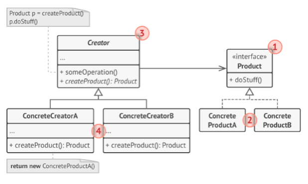
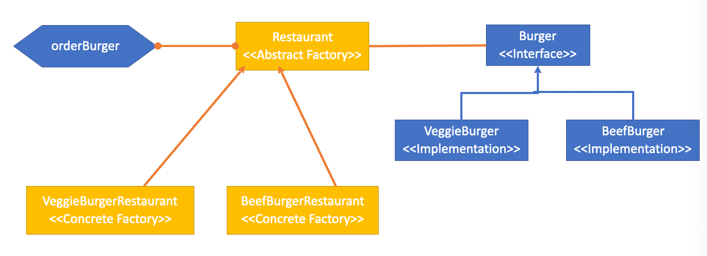
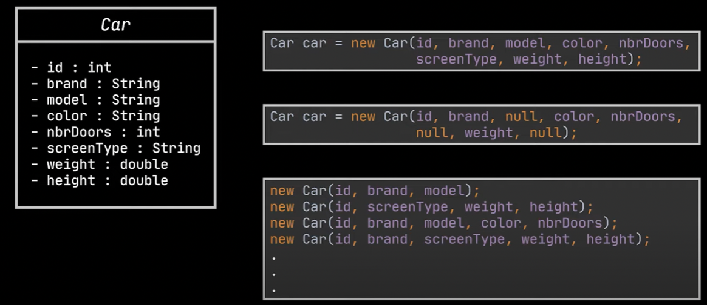
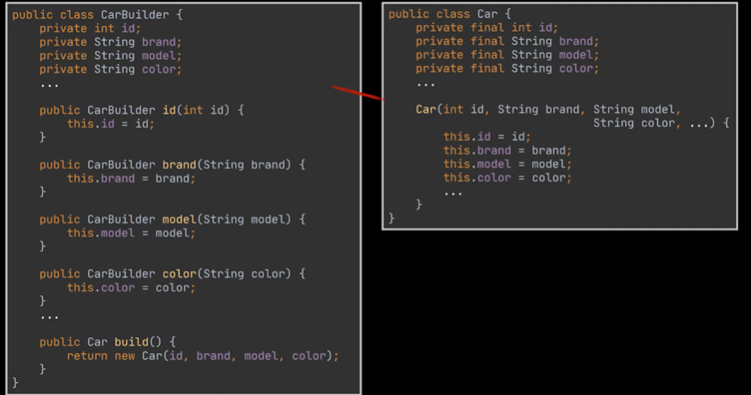
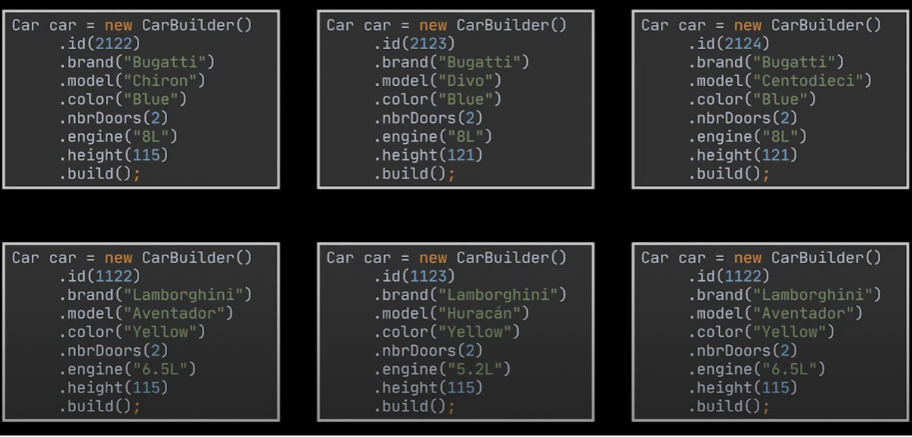
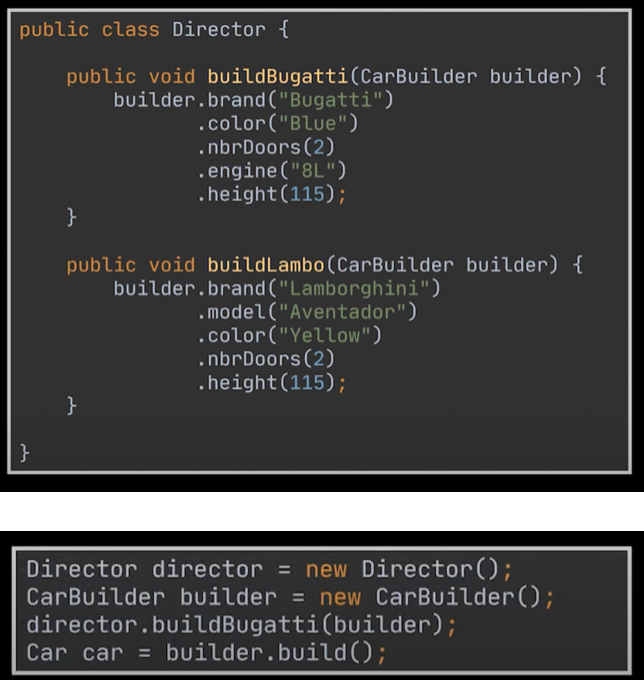
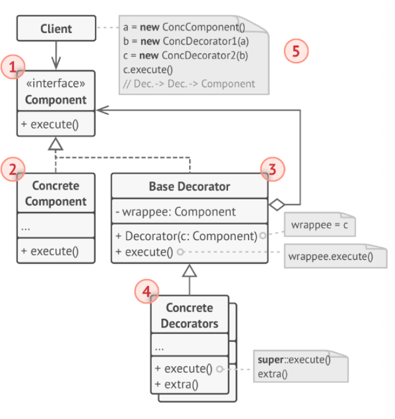
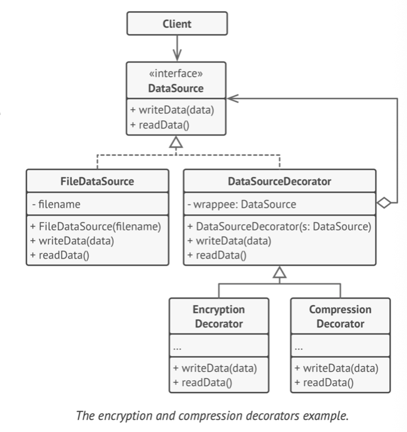
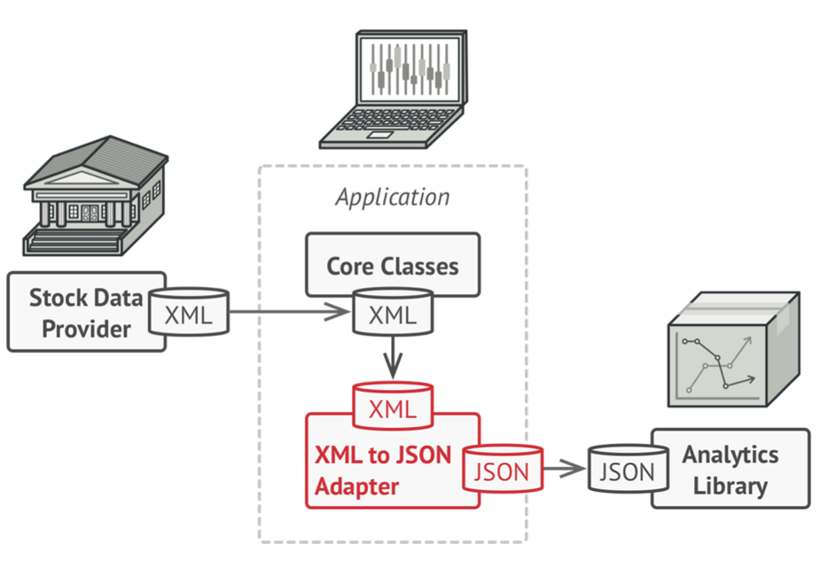
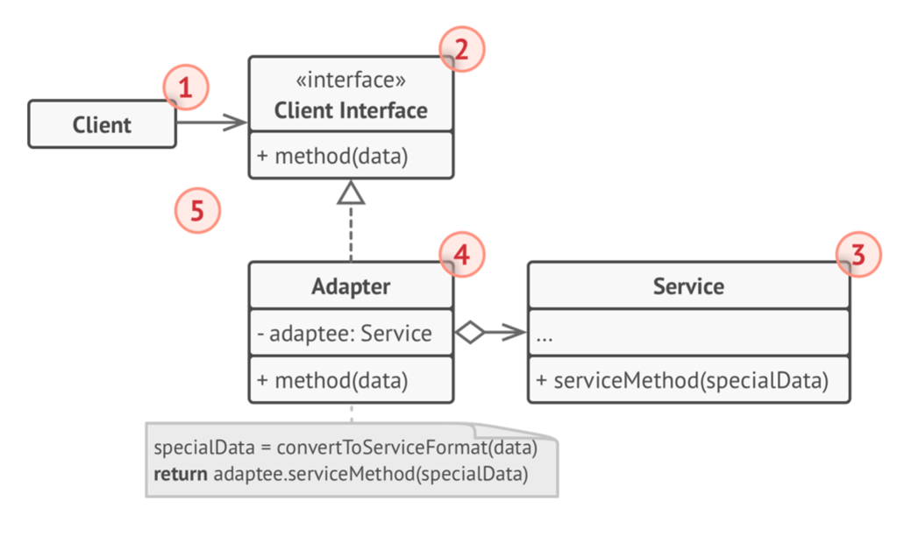

# 3 Design Patterns

## 知识图谱

```plaintext
Week 03 – Design Patterns 1
│
├── 1. Introduction to Design Patterns
│   │
│   ├── 1.1 Design Pattern 是什么
│   │   ├── 软件设计中反复出现问题的典型解决方案
│   │   ├── 不是可以直接复制粘贴的代码
│   │   ├── 是一种通用设计思想 / blueprint
│   │   └── 需要根据具体项目进行定制
│   │
│   ├── 1.2 Pattern 描述通常包含什么
│   │   ├── Intent：模式意图，说明问题和解决方案
│   │   ├── Motivation：解释问题背景和解决思路
│   │   ├── Structure：展示类之间的结构关系
│   │   ├── Code Example：通过代码帮助理解
│   │   └── Consequences：使用该模式后的结果和取舍
│   │
│   ├── 1.3 如何使用 Design Pattern
│   │   ├── 主要作为 communication tool，而不是一开始就强行作为 design tool
│   │   ├── 不应该一开始就寻找模式套用
│   │   ├── 应该在设计自然接近某个模式时，再向该模式靠拢
│   │   └── 不要强行使用模式，否则会制造不必要复杂度
│   │
│   ├── 1.4 Benefits
│   │   ├── Reusability：提高复用性
│   │   ├── Best Practices：总结成熟经验
│   │   ├── Understandability and Maintainability：提高可理解性和维护性
│   │   └── Communication：提供团队共同词汇
│   │
│   └── 1.5 Drawbacks
│       ├── Overuse：过度使用会增加复杂度
│       ├── Initial Overhead：学习和实现有初始成本
│       ├── Specificity：不是所有情况都适合
│       ├── Dependence：过度依赖会限制创新思维
│       └── Difficulty in Learning：部分模式较难理解
│
├── 2. Classification of Design Patterns
│   │
│   ├── 2.1 Creational Patterns
│   │   ├── 关注对象创建
│   │   ├── 提高创建过程的灵活性和复用性
│   │   ├── 隐藏实例化细节
│   │   └── 让系统不依赖具体创建方式
│   │
│   ├── 2.2 Structural Patterns
│   │   ├── 关注类和对象如何组合成更大结构
│   │   ├── 保持结构灵活和高效
│   │   ├── 改善模块化
│   │   └── 降低系统耦合
│   │
│   └── 2.3 Behavioral Patterns
│       ├── 关注对象之间的通信
│       ├── 关注职责分配
│       └── Week 04 会重点讲
│
├── 3. Creational Patterns
│   │
│   ├── 3.1 创建型模式的目标
│   │   ├── 处理对象创建问题
│   │   ├── 让对象创建方式适合当前场景
│   │   ├── 提供 flexibility
│   │   ├── 提供 reusability
│   │   ├── 提供 abstraction
│   │   └── 提供 control over object creation
│   │
│   ├── 3.2 五种创建型模式
│   │   ├── Factory Pattern
│   │   ├── Abstract Factory Pattern
│   │   ├── Builder Pattern
│   │   ├── Prototype Pattern
│   │   └── Singleton Pattern
│   │
│   ├── 3.3 Factory Pattern
│   │   ├── GoF Definition
│   │   │   ├── Define an interface for creating an object
│   │   │   ├── Let subclasses decide which class to instantiate
│   │   │   └── Defer instantiation to subclasses
│   │   │
│   │   ├── 适用场景
│   │   │   ├── 高层类无法提前知道要创建哪种具体对象
│   │   │   ├── 希望子类决定创建什么对象
│   │   │   ├── 希望避免高层模块直接 new 低层类
│   │   │   └── 希望降低对具体实现的依赖
│   │   │
│   │   ├── Burger Example
│   │   │   ├── Burger interface
│   │   │   ├── BeefBurger / VeggieBurger / ChickenBurger
│   │   │   ├── Restaurant abstract factory
│   │   │   ├── BeefBurgerRestaurant / VeggieBurgerRestaurant / ChickenBurgerRestaurant
│   │   │   └── orderBurger() 调用 createBurger()
│   │   │
│   │   ├── Document Management Example
│   │   │   ├── IDocument interface
│   │   │   ├── PDFDocument / WordDocument / ExcelDocument
│   │   │   ├── DocumentFactory
│   │   │   ├── PDFFactory / WordFactory / ExcelFactory
│   │   │   └── 高层逻辑只依赖 IDocument 和 DocumentFactory
│   │   │
│   │   ├── Factory Pattern 与 DIP
│   │   │   ├── 高层模块不应依赖低层模块
│   │   │   ├── 二者都应依赖 abstraction
│   │   │   ├── 抽象不依赖细节
│   │   │   └── 细节依赖抽象
│   │   │
│   │   ├── Factory Pattern with DI
│   │   │   ├── 高层类不自己创建 factory
│   │   │   ├── factory 通过 constructor injection 传入
│   │   │   └── 进一步降低耦合
│   │   │
│   │   └── Factory Pattern with Composition Root
│   │       ├── 具体 factory 的 new 操作只在程序启动处发生
│   │       ├── Business Logic 与 Tooling 分离
│   │       └── 修改具体工具时，不影响业务逻辑
│   │
│   └── 3.4 Builder Pattern
│       │
│       ├── 定义
│       │   ├── 创建型模式
│       │   ├── 用于创建和配置复杂对象
│       │   ├── 通过 step-by-step 构建对象
│       │   └── 避免构造函数参数过多
│       │
│       ├── 要解决的问题
│       │   ├── telescoping constructor problem
│       │   ├── 对象参数太多
│       │   ├── 可选参数太多
│       │   ├── 构造函数难读、难维护
│       │   └── 对象构建逻辑不应该全部塞进主类
│       │
│       ├── 核心思想
│       │   ├── 把对象构建逻辑从产品类中抽离
│       │   ├── 放到单独 Builder 对象中
│       │   ├── 客户端通过链式调用逐步配置
│       │   └── 最后通过 build() 返回对象
│       │
│       ├── Key Components
│       │   ├── Builder：定义构建步骤
│       │   ├── ConcreteBuilder：实现具体构建逻辑
│       │   ├── Product：最终复杂对象
│       │   └── Director：可选，控制构建顺序
│       │
│       ├── Director
│       │   ├── 管理构建步骤顺序
│       │   ├── 复用特定配置
│       │   ├── 隐藏构建细节
│       │   └── 不是必须存在
│       │
│       └── 适用场景
│           ├── 有很多可选参数
│           ├── 需要创建同一产品的不同表示
│           ├── Robot 多部件配置
│           ├── Pizza 多选项配置
│           └── 3D Game Character 多属性配置
│
├── 4. Structural Patterns
│   │
│   ├── 4.1 结构型模式目标
│   │   ├── 简化软件实体之间的关系
│   │   ├── 将类和对象组合成更大结构
│   │   ├── 保持结构灵活和高效
│   │   ├── 提高代码复用
│   │   ├── 提高模块化
│   │   ├── 提高维护性
│   │   └── 提高灵活性
│   │
│   ├── 4.2 七种结构型模式
│   │   ├── Adapter Pattern
│   │   ├── Bridge Pattern
│   │   ├── Composite Pattern
│   │   ├── Decorator Pattern
│   │   ├── Facade Pattern
│   │   ├── Flyweight Pattern
│   │   └── Proxy Pattern
│   │
│   ├── 4.3 Decorator Pattern
│   │   │
│   │   ├── 定义
│   │   │   ├── 动态地给对象添加功能或行为
│   │   │   ├── 不影响同类其他对象
│   │   │   ├── 又叫 Wrapper
│   │   │   └── 基于 composition 而不是 inheritance
│   │   │
│   │   ├── 与 inheritance 对比
│   │   │   ├── inheritance 是 compile-time 扩展
│   │   │   ├── 所有实例都会获得扩展行为
│   │   │   ├── Decorator 是 runtime 扩展
│   │   │   └── 可以只增强某一个具体对象
│   │   │
│   │   ├── Key Components
│   │   │   ├── Component：共同接口
│   │   │   ├── Concrete Component：被包装对象
│   │   │   ├── Base Decorator：持有 Component 引用并委托调用
│   │   │   └── Concrete Decorator：在委托前后添加额外行为
│   │   │
│   │   ├── Robot Example
│   │   │   ├── Robot interface: Move(), Cook()
│   │   │   ├── JapaneseRobot / ChineseRobot
│   │   │   ├── RobotDecorator 持有 Robot r
│   │   │   ├── RationalRobotDecorator 根据顾客性别调整份量
│   │   │   ├── SmartRobotDecorator 加入 deep learning cooking
│   │   │   └── 一个 Robot 可以同时 rational and smart
│   │   │
│   │   ├── Coffee Example
│   │   │   ├── PlainCoffee 是基础对象
│   │   │   ├── Milk / Sugar / WhippedCream / VanillaSyrup 是装饰器
│   │   │   ├── 每个装饰器增加 description
│   │   │   ├── 每个装饰器增加 cost
│   │   │   └── 可以动态组合不同配料
│   │   │
│   │   ├── Java I/O Example
│   │   │   ├── FileInputStream：读取原始字节
│   │   │   ├── BufferedInputStream：增加 buffering
│   │   │   ├── DataInputStream：增加读取特定数据类型
│   │   │   └── 多层包装形成装饰器链
│   │   │
│   │   └── 适用场景
│   │       ├── 需要 runtime 添加额外行为
│   │       ├── 不想破坏使用该对象的代码
│   │       ├── inheritance 不方便或不可用
│   │       └── 需要多个功能自由组合
│   │
│   └── 4.4 Adapter Pattern
│       │
│       ├── 定义
│       │   ├── 让两个不兼容接口可以协同工作
│       │   ├── 不需要修改已有代码
│       │   ├── 使用一个 adapter class 连接不兼容接口
│       │   └── adapter 也可以叫 wrapper，但目的不同于 decorator
│       │
│       ├── 与 Decorator 的区别
│       │   ├── Adapter 目的是 interface compatibility
│       │   ├── Decorator 目的是 add extra responsibility
│       │   ├── Adapter 改变接口
│       │   └── Decorator 保持接口不变并增强行为
│       │
│       ├── Key Components
│       │   ├── Client Interface：客户端期望的接口
│       │   ├── Service：已有但接口不兼容的类
│       │   └── Adapter：实现 Client Interface，并包装 Service
│       │
│       ├── Robot / Weapon Example
│       │   ├── 系统已有统一 Robot 接口
│       │   ├── 第三方 robot 或 weapon 接口不兼容
│       │   ├── 通过 adapter 转换调用格式
│       │   └── 让旧类或第三方类能被当前系统使用
│       │
│       └── 适用场景
│           ├── 想复用已有类，但接口不兼容
│           ├── 使用第三方 API
│           ├── 使用 legacy system
│           └── 多个外部系统 API 不统一
```


## Topic Objective

- Coursework 1
- Introduction to design patterns
- Creation patterns
- Structural patterns

## Introduction to Design Pattern

### What is Design Pattern?

- **Design patterns** are typical solutions to commonly occurring problems in software design.

  设计模式是针对软件设计中普遍存在的、反复出现的问题所提出的**典型解决方案** 。

- They are like pre-made blueprints that you can customize to solve a recurring design problem in your code. 

  它们如同预制的蓝图，您可以根据需求进行定制，以解决代码中反复出现的设计问题。

- The pattern is not a specific piece of code that you can copy and paste, but a general concept for solving a particular problem.

  这种模式并非可供复制粘贴的具体代码片段，而是解决特定问题的通用概念。

- You can follow the pattern details and implement a solution that suits the realities of your own program. 

  您可以参照模式细节并实施适合您自身程序实际情况的解决方案。

### What Can I Find in A Pattern?

- Most patterns are described very formally so people can reproduce them in many contexts. 

  大多数模式都以非常正式的形式描述，以便人们能够在多种情境中复现它们。

- Here are the sections that are usually present in a pattern description: 
  
  以下是模式描述中通常包含的章节：
  
  - **Intent** of the pattern briefly describes both the problem and the solution. 
  
    **意图 (Intent)**：简要描述问题及解决方案 。
  
  - **Motivation** further explains the problem and the solution the pattern makes possible. 
  
    动机进一步阐释了该模式所解决的问题及其实现的解决方案。
  
  - **Structure** of classes shows each part of the pattern and how they are related. 
  
    结构部分展示了模式的各个组成部分及其相互关系。
  
  - **Code example** in one of the popular programming languages makes it easier to grasp the idea behind the pattern. 
  
    在一种流行编程语言中提供代码示例，有助于更轻松地理解该模式背后的核心思想。
  
  - The **consequences** are the results and trade-offs of applying the pattern.
  
    后果是应用模式所产生的结果与权衡。
  
  - etc

### How Do You Use Design Pattern?

- Use it primarily as a **communication tool** instead of a design tool.

  主要将其用作沟通工具，而非设计工具。

- Sometime it can become a cautionary tale – things to do or not to do.

  有时它会成为一个警示故事——指明何事可为或不可为。

- We don’t jump on to a design pattern, rather we arrive at a design pattern.

  我们并非直接采用设计模式，而是逐步演进至设计模式。

  - When YOUR design come close to a design pattern, you should consider to lean toward that design pattern, rather than seeking for a design pattern in the very beginning.

    **不要预设模式**：我们不应该在项目开始时就生搬硬套某个模式，而是应该在设计过程中发现设计趋向于某种模式时，再考虑向其靠拢 。

  - Do not force yourself to use a pattern.

    **顺势而为**：如果你的设计自然而然地接近某个模式，那才是考虑使用它的最佳时机，切忌强制使用 。

- 考试重点理解：

  - Design Pattern 应该主要作为 communication tool，而不是一开始就强行使用的 design tool。我们不是先选一个模式再写代码，而是在设计逐渐接近某个模式时，才考虑向这个模式靠拢。如果问题本身很简单，强行使用设计模式反而会导致 over-engineering，使代码更复杂。


### Benefits of Design Pattern

- **Reusability**: Design patterns provide solutions that can be reused in multiple projects, reducing the overall development time.

  **可复用性**：提供跨项目的通用解决方案，减少开发时间 。

- **Best Practices**: They reflect the experience and insights of software development professionals, thereby representing best practices in the field.

  **最佳实践**：凝聚了专业人士的经验，代表了领域内的顶尖实践 。

- **Understandability and Maintainability**: They apply a consistent, well-understood, and well-documented approach to software design which makes the code easier to understand and maintain.

  **易于维护**：采用一致且文档化的设计方法，使代码更易理解 。

- **Communication**: The use of well-known design patterns can improve communication within the development team by providing a common vocabulary.

  **团队沟通**：提供统一的专业词汇，提高团队沟通效率 。

### Drawbacks of Design Patterns

- **Overuse**: Sometimes, a simple solution is more efficient and easier to understand. Using a design pattern where it's not needed can lead to unnecessary complexity.

  **过度使用**：在简单问题上应用模式会导致不必要的复杂度 。

- **Initial Overhead**: Understanding and implementing design patterns can be time-consuming initially and may slow down the development process.

  **初始开销**：学习和实现模式在初期非常耗时，可能减缓进度 。

- **Specificity**: Design patterns are not one-size-fits-all solutions. They provide solutions for specific situations and might not be applicable to all cases.

  **局限性**：模式并非万能，不一定适用于所有特定情况 。

- **Dependence**: Over-reliance on design patterns could limit the developer's ability to think outside the box and come up with innovative solutions.

  **思维依赖**：过度依赖可能限制开发者的创新思维 。

- **Difficulty in Learning**: Some design patterns can be complex to learn and implement, especially for less experienced developers.

  **学习难度**：某些设计模式的学习与实现较为复杂，对经验不足的开发者而言尤为困难。

### Classification Of Design Patterns 设计模式分类  ！！！

- All patterns can be categorized by their *intent*, or purpose. This chapter covers three main groups of patterns: 
  
  所有的设计模式根据其**意图**或**目的**可分为三大类：
  
  - **Creational patterns** provide object creation mechanisms that increase flexibility and reuse of existing code. 
  
    **创建型模式 (Creational patterns)**：提供对象创建机制，增加代码的灵活性和复用性 。
  
  - **Structural patterns** explain how to assemble objects and classes into larger structures, while keeping the structures flexible and efficient. 
  
    **结构型模式 (Structural patterns)**：讲解如何将对象和类组装成更大的结构，并保持结构的灵活与高效 。
  
  - **Behavioral patterns** take care of effective communication and the assignment of responsibilities between objects. 
  
    **行为型模式 (Behavioral patterns)**：负责对象间的高效沟通和职责分配 。

## Creational Patterns 创建型模式

Creational design patterns are used to deal with **object creation**, aiming to create objects in a manner suitable to the situation.

创建型设计模式主要处理**对象的创建**，目的是根据具体情况以合适的方式创建对象 。

- Flexibility: provide a way to make a system independent of how its objects are created, composed, and represented.

  **灵活性**：使系统独立于对象的创建、组合和表示方式 。

- Reusability: By defining separate factory classes or methods for object creation, the same code can be reused to get instances of classes rather than creating them again and again, making for less redundant code.

  **可复用性**：通过定义单独的工厂类或方法，可以重复使用相同的代码来获取实例，减少冗余 。

- Abstraction: Creational design patterns abstract the instantiation process. They hide the implementation details of the objects that are being created.

  **抽象化**：隐藏了对象创建的具体实现细节（即实例化过程） 。

- Control Over Object Creation: Creational patterns give more control over the object creation process and encapsulate this process in a separate function or class, allowing the developer to change or refine what classes do without affecting other parts of the code.

  **控制力**：将创建过程封装在特定函数或类中，开发者可以在不影响其他代码的情况下修改类行为 。

### 5 creational patterns

- <u>**The Factory Pattern**</u> provides a simple decision making class that returns one of several possible subclasses of an abstract base class depending on the data that are provided.

  **工厂模式**提供了一个简单的决策类，该类根据所提供的数据返回抽象基类的若干可能子类之一。

- **The Abstract Factory Pattern** provides an interface to create and return one of several families of related objects.

  **抽象工厂模式**提供了一个接口，用于创建和返回多个相关对象族中的某一个。

- <u>**The Builder Pattern**</u> as name implies, is an alternative way to construct complex objects. This should be used only when you want to build different immutable objects using same object building process.

  **建造者模式**，顾名思义，是一种构建复杂对象的替代方法。仅当您希望使用相同的对象构建流程来创建不同的不可变对象时，才应使用此模式。

- **The Prototype Pattern** starts with an initialized and instantiated class and copies or clones it to make new instances rather than creating new instances.

  **原型模式**始于一个已初始化并实例化的类，通过复制或克隆该实例来创建新对象，而非直接生成新的实例。

- **The Singleton Pattern** is a class of which there can be no more than one instance. It provides a single global point of access to that instance.

  **单例模式**是一类只能存在唯一实例的设计模式。它为访问该实例提供了全局唯一的入口点。

### The Factory Pattern 工厂模式

- Gang Of Four Definition
  
  - Define an interface for **creating an object**, but let subclasses decide **which class to instantiate**. The Factory method lets a class defer instantiation it uses to subclasses
  
    **核心定义**：定义一个用于创建对象的接口，但让子类决定实例化哪一个类 。**延迟实例化**：它允许一个类将实例化的工作推迟到子类中进行 。
  
- One of the most used design patterns in the real-world applications

  工厂模式是现实世界应用中最常用的设计模式之一

- This pattern is particularly useful when a class cannot anticipate the class of objects it needs to create, or when a class wants its subclasses to specify the objects it creates.

  **适用场景**：当一个类无法预知它需要创建哪种类对象时，或者希望由子类来指定所创建的对象时，该模式非常有用 。



Example:



```java
public abstract class Restaurant {
  public Burger orderBurger() {
    Burger burger = createBurger();
    burger.prepare();
    
    return burger;
  }
  
  public abstract Burger createBurger();
}

public class BeefBurgerRestaurant extends Restaurant{
  @Override
  public Burger createBurger() {
    return new BeefBurger;
  }
}

@GetMapping("/burger/{request}")
public Burger orderBurger(@PathVariable("request") String request) {
  if ("BEEF".equals(request)) {
    Restaurant beefBurgerRestaurant = new BeefBurgerReaurant;
    return beefBurgerResturant.orderBurger();
  } else {
    Restaurant veggieBurgerRestaurant = new VeggieBurgerRestaurant;
    return veggieBurgerRestaurant.orderBurger();
  }
}
```

#### Exercise 1

- Extend the Burger Restaurant
  - Base on the factory example, extend the code following Factory Pattern to accept the ordering of Chicken Burger.
  
    基于现有的工厂模式示例（BeefBurger 和 VeggieBurger），扩展代码以支持订购 **Chicken Burger（鸡肉汉堡）** 。

```java
// 1. 新增具体产品类
public class ChickenBurger implements Burger {
    @Override
    public void prepare() {
        System.out.println("Preparing Chicken Burger...");
    }
}

// 2. 新增具体工厂类
public class ChickenBurgerRestaurant extends Restaurant {
    @Override
    public Burger createBurger() {
        return new ChickenBurger(); // 延迟实例化到子类
    }
}

// 3. 修改客户端调用逻辑 (Controller)
@GetMapping("/burger/{request}")
public Burger orderBurger(@PathVariable("request") String request) {
    if ("BEEF".equals(request)) {
        return new BeefBurgerRestaurant().orderBurger();
    } else if ("CHICKEN".equals(request)) {
        return new ChickenBurgerRestaurant().orderBurger(); // 新增分支
    } else {
        return new VeggieBurgerRestaurant().orderBurger();
    }
}
```

#### Exercise 2

- A document management system in which documents can be in different formats like Word, PDF, Excel, etc. The documents need to be opened, saved, and closed. How Factory Pattern handle this diversity, keeping in mind that in the future we may have to introduce more document types?

  设计一个支持 Word、PDF、Excel 等多种格式的文档管理系统。如何利用工厂模式处理这种多样性，并确保未来能轻松引入新格式？

```java
// 1. 定义抽象产品接口
interface IDocument {
    void open();
    void save();
}

// 2. 具体产品实现
class PDFDocument implements IDocument {
    public void open() { System.out.println("Opening PDF..."); }
    public void save() { System.out.println("Saving PDF..."); }
}

class WordDocument implements IDocument {
    public void open() { System.out.println("Opening Word..."); }
    public void save() { System.out.println("Saving Word..."); }
}

// 3. 抽象工厂接口
abstract class DocumentFactory {
    public abstract IDocument createDocument();
    
    // 业务逻辑只依赖于接口
    public void manageDocument() {
        IDocument doc = createDocument();
        doc.open();
        doc.save();
    }
}

// 4. 具体工厂实现
class PDFFactory extends DocumentFactory {
    public IDocument createDocument() { return new PDFDocument(); }
}
```

Factory Pattern 的核心不是简单地把 new 语句换一个地方，而是解决“高层模块在哪里创建具体对象”的问题。

如果 DocumentManager 直接 new PDFDocument，那么 DocumentManager 就依赖具体实现 PDFDocument。
当以后改成 WordDocument 或 ExcelDocument 时，高层类必须修改，这违反 Dependency Inversion Principle。

使用 Factory 后：

1. 高层模块只依赖 IDocument 抽象接口。
2. 具体对象的创建交给 DocumentFactory。
3. 如果以后加入 ExcelDocument，只需要新增 ExcelDocument 和 ExcelFactory，而不需要修改大量业务类。

#### Observation

- In standard programming, a "High-Level" class (like a DocumentManager) often creates an instance of a "Low-Level" class (like a PDFDocument) directly using the new keyword. 

  **现状**：在标准的编程实践中，一个“高层”类（例如 `DocumentManager`）通常会直接使用 `new` 关键字来创建一个“低层”类的实例（例如 `PDFDocument`）。

- **The Issue:** The High-Level class is now "stuck" to that specific Low-Level class. If you want to switch to an ExcelDocument, you have to modify the code inside DocumentManager. 

  **后果**：这种做法导致高层类与具体的低层类紧密耦合（"stuck"）。如果将来需要将文档类型从 PDF 切换到 Excel（`ExcelDocument`），就必须修改 `DocumentManager` 内部的代码。

- This violates the Dependency Inversion Principle because a high-level module depends on a concrete implementation. 

  **违反原则**：这违反了**依赖倒置原则**（Dependency Inversion Principle），因为高层模块直接依赖于具体的实现细节，而不是抽象。

#### Observation solutions

- Dependency Inversion suggests two things:
  
  **依赖倒置原则的建议**
  
  - High-level modules should not depend on low-level modules. Both should depend on **abstractions** (interfaces).
  
    高层模块不应依赖低层模块，两者都应依赖于**抽象**（接口）
  
  - Abstractions should not depend on details. Details should depend on abstractions. 
  
    抽象不应依赖细节，细节应依赖抽象。
  
- By introducing an interface (e.g., IDocument), the DocumentManager no longer cares *which* writer it's using, as long as it follows the rules of the interface. 

  **初步改进**：通过引入接口（例如 `IDocument`），`DocumentManager` 可以只依赖接口，而不关心具体使用的是哪种文档实现。

  **遗留的实际问题**：即使使用了接口，代码中仍然 somewhere 需要有人调用 `new PDFDocument()` 来创建具体对象。如果在高层类中进行实例化，就会重新引入之前试图避免的耦合

#### Observation – Why Factory Pattern?

**核心作用**：工厂模式解决了“在哪里实例化具体对象”的问题。

**工作机制**：高层类不再自己实例化对象，而是调用一个“工厂”。工厂方法负责处理创建具体对象的“脏活”（dirty work），并将其作为抽象接口返回给高层类。

- Imagine you have 50 different classes in your app that need to process documents. 

- Without a Factory: All 50 classes have new *PDFDocument()*. If you switch to *ExcelDocument()*, you must find and change 50 files.

  **没有工厂时**：假设有50个类都需要处理文档，每个类里都写着 `new PDFDocument()`。如果要换成 Excel，需要修改50个文件。

- With a Factory: All 50 classes call *factory.openDocument()*. Only one file (the Factory) contains the *new* keyword.

  **有工厂时**：所有50个类只调用 `factory.openDocument()`。只有**一个文件**（即工厂类）包含 `new` 关键字。如果需要切换实现，只需修改工厂类即可。

#### Observation – Factory Pattern with DI

- In a well-designed system, your 50 classes don't *create* the factory; they **receive** it.

  **依赖注入 (DI)**：在一个设计良好的系统中，这50个类甚至不需要自己创建工厂，而是通过构造函数“接收”（注入）工厂实例。

- Imagine a UserDashboard class. Instead of it reaching out to create a factory, you "inject" the factory through the constructor.

```java
class UserDashboard {
  private DocumentFactory documentFactory;
  
  // The dashboard doesn't care WHERE this factory come frome
  public UserDashBoard(DocumentFactory documentFactory) {
    this.documentFactory = documentFactory;
  }
  
  public void onButtonClick() {
    documentFactory.openDocument().save();
  }
}
```

#### Observation – Factory Pattern with Composition Root

`new PDFDocumentFactory()` 这样的实例化操作在整个程序中只发生**一次**，通常是在程序启动的最开始阶段。通过这种方式，工厂模式成功实现了**业务逻辑**（Business Logic）与**工具/具体实现**（Tooling）之间的分离。

- Where does the *new* *PDFDocumentFactory()* finally happen? **Only once**, at the very start of your program.
- By using the Factory Method, you have built a **separation** between your "Business Logic" and your "Tooling."

```java
class DocumentManagementSystem {
  public static void main(String[] args) {
    DocumentFactory myFactory = new WordDocumentFactory();
    UserDashBoard dashBoard = new UserDashboard(myFactory);
    DocumentPrinting printing = new DocumentPrinting(myFactory);
    OrderProcessor orders = new OrderProcessor(myFactory);
  }
}
```

### Builder Pattern

- The Builder pattern is a creational pattern –it's used to create and configure complex objects.

  建造者模式用于分步骤构建复杂的对象。它允许你使用相同的构建过程来创建不同类型的产品（即不同的表示）

- Use to simplify the complexity of the object initialization by letting you construct an object step by step.

  当一个对象非常复杂，包含许多可选参数或配置项时，直接使用构造函数（尤其是带有大量参数的构造函数）会导致代码难以阅读和维护（即“伸缩构造函数”问题）。

#### Builder Pattern – The Problem to Solve



- The builder pattern extract the object construction code out of its own class and move it to a separate objects called Builder.

  将对象的构建逻辑从主类中分离出来，避免主类变得过于臃肿



#### Using the Builder Class



#### Enhancement to The Builder

- Referring to the previous slide, can we make the construction of the object easier?
- Introduce a Director class to manage the order in which we should call the construction steps so that we can reuse specific configurations of the products we are building.
- Director is an optional class in the pattern.
- It helps to hides the details of the product construction from the client code.

#### Director



建造模式的几个关键角色：

- **Builder (抽象建造者)**：
  - 这是一个接口或抽象类，定义了构建产品各个部件的步骤（例如 `buildPartA()`, `buildPartB()`）。
  - 它还定义了一个 `getResult()` 方法，用于返回最终构建好的产品。
- **ConcreteBuilder (具体建造者)**：
  - 实现 `Builder` 接口。
  - 负责具体的构建逻辑，维护一个正在构建的产品实例。
  - 不同的具体建造者可以创建不同内部结构的产品（例如：`HouseBuilder` 建房子，`CarBuilder` 建车子，或者 `WindowsBuilder` 和 `LinuxBuilder` 构建不同操作系统的电脑）。
- **Product (产品)**：
  - 这是最终被构建出来的复杂对象。它通常包含多个部件，这些部件是由 `ConcreteBuilder` 逐步组装起来的。
- **Director (指挥者/导演)** *(可选类)*：
  - **作用**：负责控制构建过程的顺序。它知道先调用哪个步骤，再调用哪个步骤，以生成特定配置的产品。
  - **优势**：它将“如何构建”的逻辑与“构建什么”的逻辑分离。客户端只需要告诉 Director 想要哪种类型的产品，而不需要关心具体的构建步骤。
  - **注意**：课件提到 Director 是可选的。在某些简单场景下，客户端可以直接调用 Builder 的方法来按顺序构建。

#### Application of Builder Pattern

- Use the Builder pattern to get rid of a constructor with many optional parameters.

  **消除多参数构造函数**：当你的类需要一个有很多可选参数的构造函数时，使用建造者模式可以让代码更清晰（链式调用）

- Use the Builder pattern when you want your code to be able to create different representations of same product without confusing the client. 

  **创建不同表示**：当你需要用同一套构建流程创建不同版本的产品时。

#### Scenario Where We Use builder Pattern

- A Robot might have many parts like head, body, arms, legs, etc., and each of these parts might have many options. For example, the robot's body could be made of metal, plastic, or some advanced alloy. The robot's head might contain different types of sensors and processors.

  **机器人 (Robot)**：机器人由头、身体、手臂、腿等部分组成，每个部分又有多种材质或传感器选项。直接实例化会非常复杂。

- When you're dealing with an object that has a complex configuration. For instance, consider an online pizza ordering system. Pizzas can have a wide variety of options (e.g., crust type, size, toppings, cheese, sauce) and the ordering process can be effectively managed using a Builder pattern.

  **披萨订购系统**：披萨有饼底、尺寸、配料、芝士、酱汁等多种组合。建造者模式可以很好地管理这种逐步添加配料的过程。

- Consider a scenario where you are designing a complex 3D game with different types of characters. Each character in the game could have multiple attributes like strength, speed, health, weapon, and abilities. Building these characters directly could be quite complex as each character could have different kinds of abilities, weapons and attributes.

  **3D游戏角色**：角色有力气、速度、血量、武器、技能等属性。不同职业的角色属性组合不同，适合用建造者来逐步配置。

## Structural Patterns

Structural design patterns are essential because they provide a manner to simplify and manage the relationships between different software entities. They guide us in composing objects to form larger structures while keeping these structures flexible and efficient.

结构设计模式至关重要，因为它们提供了一种简化和管理不同软件实体之间关系的方法。它们指导我们将对象组合成更大的结构，同时保持这些结构的灵活性与高效性。

- Code Reusability: They provide solutions to problems that occur frequently in software design, and by using these patterns, we can reuse solutions that have been proven effective.

  **代码复用 (Reusability)**：通过复用已验证有效的解决方案来解决常见设计问题。

- Improved Modularity: Structural patterns can greatly improve modularity in a program by providing ways to decouple systems and create interfaces.

  **提高模块化 (Improved Modularity)**：通过解耦系统和创建接口来增强程序的模块化。

- Code Maintenance: They make the code easier to understand and maintain by ensuring that classes and objects are well-organized and well-structured.

  **易于维护 (Code Maintenance)**：确保类和对象组织良好、结构清晰，使代码更易理解和维护。

- Flexibility: They enable us to change the system's components independently, which leads to higher flexibility.

  **灵活性 (Flexibility)**：允许独立更改系统的组件，从而提高系统的适应性。

7种模式：

- **Adapter Pattern** acts as a connector between two incompatible interfaces that otherwise cannot be connected directly. An adapter wraps an existing class with a new interface so that it becomes compatible with the client’s interface.

  **Adapter (适配器)**：连接两个不兼容的接口。

- **Bridge Pattern** is to decouple an abstraction from its implementation so that the two can vary independently.

  **Bridge (桥接)**：将抽象与实现分离，使它们可以独立变化。

- **Composite Pattern** is meant to allow treating individual objects and compositions of objects, or “composites” in the same way. 

  **Composite (组合)**：将对象组合成树形结构以表示“部分-整体”的层次结构，使得客户端对单个对象和组合对象的使用具有一致性。

- **Decorator Pattern** can be used to attach additional responsibilities to an object either statically or dynamically.

  **Decorator (装饰器)**：动态地给对象添加额外的职责。

- **Facade Pattern** encapsulates a complex subsystem behind a simple interface. It hides much of the complexity and makes the subsystem easy to use.

  **Facade (外观)**：为复杂的子系统提供一个简单的接口

- **Flyweight Pattern** allows programs to support vast quantities of objects by keeping their memory consumption low. Pattern achieves it by sharing parts of object state between multiple objects.

  **Flyweight (享元)**：通过共享状态来支持大量细粒度的对象，降低内存消耗。

- **Proxy Pattern** specifies a design where substitute or placeholder object is put in-place of the actual target object to control access to it. Client accesses the proxy object to work with the target object.

  **Proxy (代理)**：为其他对象提供一种代理以控制对这个对象的访问。

Structural Patterns 场景判断关键词：
- Adapter：接口不兼容，需要转换接口。
- Bridge：抽象和实现都可能变化，需要分离两者。
- Composite：树形结构，部分-整体关系，单个对象和组合对象统一处理。
- Decorator：运行时动态添加功能，避免继承爆炸。
- Facade：复杂子系统前面加一个简单入口。
- Flyweight：大量小对象，占用内存高，需要共享状态。
- Proxy：通过替代对象控制访问，例如延迟加载、权限控制、远程访问、缓存。

### Decorator Pattern

- The **decorator design pattern** allows us to dynamically add functionality and behavior to an object without affecting the behavior of other existing objects in the same class.

  **目的**：允许在**运行时**动态地向单个对象添加功能或行为，而不影响同类中其他对象的行为。

- We use inheritance to extend the behavior of the class. This takes place at compile time, and all the instances of that class get the extended behavior.

  **相较于继承**：在编译时扩展行为，所有该类的实例都会获得扩展后的行为，缺乏灵活性。

- Apply decorator to an individual object based on our requirement and choice.

  **装饰器**：针对特定实例按需应用，基于**组合**（Composition）而非继承。

- Decorator a.k.a. Wrapper

  **别名**：Wrapper（包装器）

- **Uses abstract classes or interfaces with the composition to implement the wrapper.**

  **使用抽象类或接口与组合方式实现包装器。**

- Decorator pattern create decorator classes, which wrap the original class and provide additional functionality by keeping the class methods' signature unchanged.

  装饰器模式创建装饰器类，这些类包装原始类并通过保持类方法签名不变来提供附加功能。

#### Decorator Pattern - The Structure



#### Key Component

- The **Component** declares the common interface for both wrappers and wrapped objects. 

  **Component (组件接口)**：声明了包装器和被包装对象通用的接口。

- **Concrete Component** is a class of objects being wrapped. It defines the basic behavior, which can be altered by decorators. 

  **Concrete Component (具体组件)**：被包装的原始对象，定义了基础行为

- The **Base Decorator** class has a field for referencing a wrapped object. The field’s type should be declared as the component interface so it can contain both concrete components and decorators. The base decorator delegates all operations to the wrapped object. 

  **Base Decorator (基础装饰器)**：持有一个指向被包装对象（Component类型）的引用字段；将所有操作委托（delegate）给被包装的对象；确保装饰器链可以无限延伸（因为装饰器本身也是Component）。

- **Concrete Decorator** define extra behaviors that can be added to components dynamically. Concrete decorators override methods of the base decorator and execute their behavior either before or after calling the parent method. 

  **Concrete Decorator (具体装饰器)**：继承自基础装饰器；重写方法，在执行父类方法（委托给下层）的前后添加额外的行为。

#### Decorator Pattern - Data Source Example



Example

- Suppose we have a Robot interface, which included Move() and Cook(). You want some of your robot instances to do more things.

  **场景**：有一个 `Robot` 接口，包含 `Move()` 和 `Cook()` 方法。

  1. 某些机器人需要根据顾客性别调整烹饪份量（女性小份，男性大份） -> **RationalRobotDecorator**。
  2. 某些机器人需要应用深度学习变得更聪明 -> **SmartRobotDecorator** (Exercise 3)。

- **实现逻辑**：

  - 装饰器类实现 `Robot` 接口。
  - 内部持有一个 `Robot` 类型的成员变量 `r`。
  - 在 `Cook()` 方法中，先执行 `r.Cook()`，然后在此基础上修改份量或应用智能算法。

- **组合效果**：一个机器人可以同时被 `RationalRobotDecorator` 和 `SmartRobotDecorator` 包装，从而既理性又聪明。这展示了装饰器模式的**嵌套/链式**特性。

```java
public interface Robot {
  public void Move(int x, int y, int speed);
  
  public void Cook();
}

class PlayRobot {
  private List<Robot> robots = new ArrayList<Robot>();
  
  public void AddRobot(Robot r) {
    robots.add(r);
  }
  
  pblic void AllRobotsCook() {
    robots.stream().forEach(r -> r.Cook());
  }
}

class JapaneseRobot implements Robot {
  @Override
  pubic void Move(int x, int y, int speed) {
    // TODO: Auto-generated method stub
    System.out.println("Japanese robot moved to " + + x);
    
  }
  
  @Override
  public void Cook() {
    // TODO: Auto-generated method stub
    System.out.println("Cooking Japanese food");
  }
}
```

- I want my third robot to cook according to customer’s gender. Female get a small portion, male get a big portion.

  我希望我的第三个机器人能根据顾客性别进行烹饪。女性提供小份，男性提供大份。

```java
public static void main(String[] args) {
  PlayRobot play = new PlayRobot();
  play.AutoRobot(r);
  
  r = new japaneseRobot();
  play.AddRobot(r);
  
  r = new ChineseRobot();
  play.AddRobot(r);
  
  play.AllRobotsCook();
}
```

- A decorator implements Robot interface and hold an instance of Robot (r), which would like to have additional functionalities.

  装饰器实现了机器人接口，并持有一个机器人实例（r），旨在为其增添额外功能。

- The decorator must ensure all methods in the interface are implemented by delegating to robot r.

  装饰器必须确保通过委托给机器人r来实现接口中的所有方法。

```java
public class RobotDecorator implements Robot {
  private Robot r;
  
  protected RobotDecorator(Robot r) {
    this.r = r;
  }
  
  #@Override
    public void Move(int x, int y, int speed) {
    r.Move(x, y, speed);
  }
  
  @Override
  public void Cook() {
    r.Cook();
  }
}
```

- To add functionalities, the class (RationalRobotDecorator) extends RobotDecorator and adding new functions by overriding the decorator’s methods.

```java
public class RationalRobotDecorator extends RobotDecorator {
    private boolean gender;
    
    public RationalRobotDecorator(Robot r, boolean gender) {
        super(r);
        this.gender = gender;
    }
    
    @Override
    public void Move(int x, int y, int speed) {
        super.Move(x, y, speed);
    }
    
    @Override
    public void Cook() {
        if (gender) {
            System.out.println("I will cook you a small portion");
        } else {
            System.out.println("I will cook you a big portion");
        }
        super.Cook();
    }
}
```

#### Application of Decoration Pattern

- Use the Decorator pattern when you need to be able to assign extra behaviors to objects at runtime without breaking the code that uses these objects. 

  当你需要在运行时为对象动态添加额外行为，同时不破坏使用这些对象的代码时，请使用装饰器模式。

- Use the pattern when it’s awkward or not possible to extend (class with final keyword) an object’s behavior using inheritance. 

  当通过继承扩展对象行为显得笨拙或不可行（例如类被final关键字修饰）时，应使用该模式。

#### Stream I/O (The "Classic" Industry Implementation)

```java
InputStream file = new FileInputStream("data.txt");
InputStream buffered = new BufferedInputStream(file);
DataInputStream data = new DataInputStream(buffered);
```

- If you have ever written code in Java or C#, you have used the Decorator Pattern without realizing it. The entire standard library for Input/Output (I/O) is built this way.

  如果你曾经用Java或C#编写过代码，你已经在不知不觉中使用了装饰器模式。整个标准输入/输出库正是以这种方式构建的。

- **The Implementation:**

  - You start with a basic *FileInputStream* (reads raw bytes).

    你从一个基本的FileInputStream（读取原始字节）开始。

  - You wrap it in a *BufferedInputStream* (adds the "behavior" of buffering for speed).

    您将其封装于BufferedInputStream中（通过添加缓冲行为以提升处理速度）。

  - You wrap that in a *DataInputStream* (adds the "behavior" of reading specific data types like Integers or Strings).

    将其封装于DataInputStream中（添加读取特定数据类型如整数或字符串的"行为"）。

- 课件指出 Java/C# 的 I/O 流是装饰器模式的经典应用：
  - 基础：`FileInputStream` (读取原始字节)。
  - 第一层包装：`BufferedInputStream` (添加缓冲行为以提高速度)。
  - 第二层包装：`DataInputStream` (添加读取特定数据类型如Integer/String的行为)。
  - **结果**：通过层层包装，最终对象拥有了所有叠加的功能。

#### Exercise 3

- A new type of Robot is invented. It is smarter because it can apply deep learning to cook better.

  一种新型机器人问世。它更智能，因为能运用深度学习来提升烹饪技艺。

- Now, any Robot can be a rational robot at the same time smart robot.

  如今，任何机器人都可以同时成为理性的机器人与智能的机器人。

- Enhance the above example by implement a SmartRobotDecorator.

  通过实现一个SmartRobotDecorator来增强上述示例。

- Illustrate that a Robot can be rational and smart at the same time.

  阐明机器人能够同时具备理性与智能。

```java
// 1. 具体装饰器：智能机器人
class SmartRobotDecorator extends RobotDecorator {
    public SmartRobotDecorator(Robot robot) {
        super(robot);
    }

    @Override
    public void cook() {
        // 添加智能行为：应用深度学习算法优化烹饪
        System.out.println("Applying Deep Learning to optimize cooking...");
        super.cook(); // 调用被包装对象的cook方法
        System.out.println("Cooking completed with AI optimization.");
    }
}

// 2. 客户端使用演示
public class Main {
    public static void main(String[] args) {
        // 创建基础机器人
        Robot basicRobot = new SimpleRobot(); 
        
        // 包装一层：变成理性机器人
        Robot rationalRobot = new RationalRobotDecorator(basicRobot);
        
        // 再包装一层：变成既理性又智能的机器人
        Robot smartAndRationalRobot = new SmartRobotDecorator(rationalRobot);
        
        // 调用方法，会依次执行：Smart逻辑 -> Rational逻辑 -> 基础逻辑
        smartAndRationalRobot.cook(); 
    }
}
```

#### Exercise 4

- Let's think about a cafe scenario. When you go to a cafe, you usually start with a basic type of coffee, then you customize it by adding extra features like milk, sugar, flavors, whipped cream, etc. Plus, each of these additions affects the final cost of the coffee. 

  设想一个咖啡馆的场景。当你走进咖啡馆时，通常会先选择一款基础咖啡，随后通过添加牛奶、糖、风味糖浆、搅打奶油等额外配料来自定义口味。此外，每一种添加物都会影响咖啡的最终价格。

- Implementing this in a straightforward way could quickly become complicated and messy, especially if you want to be able to add, remove, and modify these customizations dynamically.

  以直截了当的方式实现这一功能可能会迅速变得复杂而混乱，尤其是在需要动态添加、移除和修改这些自定义配置的情况下。

- This is a perfect scenario for the Decorator pattern. In this pattern, a class represents the base object (in this case, a plain coffee), while other decorator classes represent the optional extras. The decorators wrap the base class and other decorators, forming a chain of objects where each object adds its own behavior (and cost) to the final product.

  这是装饰器模式的完美应用场景。该模式中，一个类代表基础对象（本例中的原味咖啡），而其他装饰器类则代表可选的附加配料。装饰器会包裹基础类及其他装饰器，形成对象链结构——每个对象都在最终产品上叠加自身的行为特性（与成本计算）。

  ```java
  // Coffee.java - 组件接口
  public interface Coffee {
      String getDescription(); // 获取描述（包含所有配料）
      double getCost();        // 获取总价格
  }
  
  // SimpleCoffee.java - 具体组件：基础黑咖啡
  public class SimpleCoffee implements Coffee {
      @Override
      public String getDescription() {
          return "Simple Coffee";
      }
  
      @Override
      public double getCost() {
          return 2.00; // 基础价格 $2.00
      }
  }
  
  // Espresso.java - 具体组件：浓缩咖啡
  public class Espresso implements Coffee {
      @Override
      public String getDescription() {
          return "Espresso";
      }
  
      @Override
      public double getCost() {
          return 2.50; // 基础价格 $2.50
      }
  }
  
  // CoffeeDecorator.java - 抽象装饰器
  public abstract class CoffeeDecorator implements Coffee {
      protected Coffee decoratedCoffee; // 持有被装饰的咖啡对象
  
      // 构造函数：传入要被装饰的咖啡
      public CoffeeDecorator(Coffee coffee) {
          this.decoratedCoffee = coffee;
      }
  
      @Override
      public String getDescription() {
          // 默认直接返回被装饰对象的描述
          return decoratedCoffee.getDescription();
      }
  
      @Override
      public double getCost() {
          // 默认直接返回被装饰对象的价格
          return decoratedCoffee.getCost();
      }
  }
  
  // Milk.java - 具体装饰器：牛奶
  public class Milk extends CoffeeDecorator {
      public Milk(Coffee coffee) {
          super(coffee);
      }
  
      @Override
      public String getDescription() {
          return decoratedCoffee.getDescription() + ", Milk";
      }
  
      @Override
      public double getCost() {
          return decoratedCoffee.getCost() + 0.50; // 牛奶加价 $0.50
      }
  }
  
  // Sugar.java - 具体装饰器：糖
  public class Sugar extends CoffeeDecorator {
      public Sugar(Coffee coffee) {
          super(coffee);
      }
  
      @Override
      public String getDescription() {
          return decoratedCoffee.getDescription() + ", Sugar";
      }
  
      @Override
      public double getCost() {
          return decoratedCoffee.getCost() + 0.20; // 糖加价 $0.20
      }
  }
  
  // WhippedCream.java - 具体装饰器：搅打奶油
  public class WhippedCream extends CoffeeDecorator {
      public WhippedCream(Coffee coffee) {
          super(coffee);
      }
  
      @Override
      public String getDescription() {
          return decoratedCoffee.getDescription() + ", Whipped Cream";
      }
  
      @Override
      public double getCost() {
          return decoratedCoffee.getCost() + 0.75; // 奶油加价 $0.75
      }
  }
  
  // VanillaSyrup.java - 具体装饰器：香草糖浆
  public class VanillaSyrup extends CoffeeDecorator {
      public VanillaSyrup(Coffee coffee) {
          super(coffee);
      }
  
      @Override
      public String getDescription() {
          return decoratedCoffee.getDescription() + ", Vanilla Syrup";
      }
  
      @Override
      public double getCost() {
          return decoratedCoffee.getCost() + 0.60; // 糖浆加价 $0.60
      }
  }
  ```

### Adapter Pattern

- The adapter pattern makes two incompatible interfaces compatible without changing their existing  code.

  适配器模式使两个不兼容的接口能够协同工作，且无需修改其现有代码。

- Adapter patterns use a single class (the adapter class) to join functionalities of independent or incompatible interfaces/classes.

  适配器模式通过单一类（即适配器类）将独立或互不兼容的接口/类的功能进行整合。

- The adapter pattern also is known as the wrapper, an alternative naming shared with the decorator design pattern.

  适配器虽然和装饰器都叫Wrapper，但意图完全不同。装饰器是为了**增强**功能，适配器是为了**兼容**接口

- The adapter implements the interface of one object and wraps the other one. 

  适配器类实现了客户端需要的接口，内部包裹（wrap）着一个服务类（Service）。

- The adapter gets an interface, compatible with one of the existing objects. 

  当客户端调用适配器方法时，适配器将请求转换为服务类能理解的格式并转发。

- Using this interface, the existing object can safely call the adapter’s methods. 

  通过此接口，现有对象可安全调用适配器的方法。

- Upon receiving a call, the adapter passes the request to the second object, but in a format and order that the second object expects. 

  接收到调用时，适配器将请求传递给第二个对象，但需采用该对象预期的格式与顺序。



#### Sample



#### Key Components

- The **Client Interface** describes a protocol that other classes must follow to be able to collaborate with the client code. 

  **Client Interface (客户端接口)**：客户端代码期望使用的协议。

- The **Service** is some useful class (usually 3rd-party or legacy). The client can’t use this class directly because it has an incompatible interface. 

  **Service (服务/被适配者)**：现有的、有用的类（通常是第三方或遗留代码），其接口与客户端不兼容。

- The **Adapter** is a class that’s able to work with both the client and the service: it implements the client interface, while wrap- ping the service object. The adapter receives calls from the client via the adapter interface and translates them into calls to the wrapped service object in a format it can understand. 

  **Adapter (适配器)**：

  - 实现 `Client Interface`。
  - 内部持有 `Service` 的实例。
  - 负责转换数据格式或调用顺序，桥接两者。

#### Example

- Suppose we have a project of controlling robots, in which we are required to develop different kinds of robots that will be used in the **PlayRobot** via a common interface called **Robot**. 

- As we progress, we come to know that there are some **extra robots** that are already developed either by some other team within our organization. Or, we have a third-party API, which is available to us.

```java
interface Robot {
    public void MOve(int x, int y, int speed);
    
    public void Cook();
}

class PlayRobot {
    private List<Robot> robots = new ArrayList<Robot>();
    
    public void AddRobot(Robot r) {
        robots.add(r);
    }
    
    public void AllRobotsCook() {
        robots.stream().forEach(r -> r.Cook());
    }
}

public abstract class Machine {
    private int speed;
    
    public void SetSpeed(int speed) {
        this.speed = speed;
    }
    
    public int GetSpeed() {
        return speed;
    }
    
    public abstract void kill();
    
    public abstract void Run(int x, int y);
}

public class MilitaryMachine extends Machine{
    @Override
    public void Kill() {
        // TODO Auto-generate method stub
        System.out.println("Aim for the heart");
    }
    
    @Override
    public void Run(int x, int y) {
        // TODO Auto-generate method stub
        System.out.println("Soldiers runs to " + x + ", " + y + " at the speed of " + GetSpeed());
    }
}

public class ZombineMachine extends Machine {
    @Override
    public void Kill() {
        // TODO Auto-generate method stub
        System.out.println("Aim for the brain");
    }
}

class MachineAdapter implements Robot {
    private Machine m;
    
    public MachineAdapter(Machine m) {
        this.m = m;
    }
    
    // 在这里转义 Robot 的 move 为 Machine 的 Run
    @Override
    public void Move(int x, int y, int speed) {
        // TODO Auto-generate method stub
        m.SetSpeed(speed);
        m.run(x, y);
    }
    
    @Override
    public void Cook() {
        // TODO Auto-generate method stub
        if (m instanceof ZombineMachine) {
            System.out.println("Cooking zombie food");
        } else if (m instanceof MilitaryMachine) {
            System.out.println("Cooking Soldier food");
        } else {}
        System.out.println("Cooking cannot be completed");
    }
}


```

#### Application of Adapter Pattern

- **Use the Adapter class when you want to use some existing class, but its interface isn’t compatible with the rest of your code.** 

  **当您希望使用某个现有类，但其接口与代码其余部分不兼容时，应使用适配器类。**

- **Use the pattern when you want to reuse several existing sub- classes that lack some common functionality that can’t be added to the superclass.** 

  **当您希望重用多个现有子类，但这些子类缺少无法添加到超类中的某些通用功能时，请使用此模式。**

#### Exercise 5

- Consider an e-commerce scenario where users can make payments using different payment systems like PayPal, CreditCards, and cryptocurrencies.

  假设一个电子商务场景，用户可以通过不同的支付系统如PayPal、信用卡和加密货币进行付款。

- Each of these payment systems has a different API and integration process. When a user chooses a payment method, your system should process the payment using the respective payment system's API. Directly integrating these different APIs into your system can lead to a lot of complexities and code 

  clutter.

  每种支付系统都拥有不同的应用程序编程接口（API）与集成流程。当用户选择支付方式时，您的系统需通过对应支付系统的API完成交易处理。若将这些各异的API直接整合至您的系统中，可能导致系统复杂度显著增加及代码结构混乱。

```java
/**
 * Target: 电商系统期望的统一支付接口
 */
public interface PaymentProcessor {
    /**
     * 统一支付方法
     * @param amount 支付金额
     * @return 支付结果信息
     */
    String processPayment(double amount);
}

/**
 * Adaptee 1: PayPal API (模拟第三方库)
 * 特点：需要登录，通过邮箱转账
 */
class PayPalGateway {
    public void login(String userEmail, String password) {
        System.out.println("[PayPal] Logging in as " + userEmail);
    }

    public void sendMoney(String receiverEmail, double amount) {
        System.out.println("[PayPal] Sending $" + amount + " to " + receiverEmail);
    }
}

/**
 * Adaptee 2: Credit Card Gateway (模拟第三方库)
 * 特点：需要卡号、CVV，直接授权扣款
 */
class CreditCardGateway {
    public void authorize(String cardNumber, String cvv, double amount) {
        System.out.println("[CreditCard] Authorizing $" + amount + " on card ending in " + cardNumber.substring(cardNumber.length() - 4));
        // 模拟处理时间
        try { Thread.sleep(100); } catch (InterruptedException e) {}
        System.out.println("[CreditCard] Authorization successful.");
    }
}

/**
 * Adaptee 3: Crypto Network (模拟第三方库)
 * 特点：需要钱包地址和币种类型
 */
class CryptoNetwork {
    public void transfer(String walletAddress, double amount, String currency) {
        System.out.println("[Crypto] Transferring " + amount + " " + currency + " to wallet " + walletAddress);
        System.out.println("[Crypto] Waiting for blockchain confirmation...");
    }
}

/**
 * Adapter 1: PayPal 适配器
 * 将 PayPalGateway 的复杂流程适配为统一的 processPayment
 */
public class PayPalAdapter implements PaymentProcessor {
    private PayPalGateway payPalGateway;
    private String userEmail;
    private String password;
    private String merchantEmail;

    public PayPalAdapter(String userEmail, String password, String merchantEmail) {
        this.payPalGateway = new PayPalGateway();
        this.userEmail = userEmail;
        this.password = password;
        this.merchantEmail = merchantEmail;
    }

    @Override
    public String processPayment(double amount) {
        // 适配逻辑：将统一调用转换为 PayPal 的特有步骤
        payPalGateway.login(userEmail, password);
        payPalGateway.sendMoney(merchantEmail, amount);
        return "Payment via PayPal successful: $" + amount;
    }
}

/**
 * Adapter 2: 信用卡适配器
 */
public class CreditCardAdapter implements PaymentProcessor {
    private CreditCardGateway creditCardGateway;
    private String cardNumber;
    private String cvv;

    public CreditCardAdapter(String cardNumber, String cvv) {
        this.creditCardGateway = new CreditCardGateway();
        this.cardNumber = cardNumber;
        this.cvv = cvv;
    }

    @Override
    public String processPayment(double amount) {
        // 适配逻辑：直接调用授权方法
        creditCardGateway.authorize(cardNumber, cvv, amount);
        return "Payment via Credit Card successful: $" + amount;
    }
}

/**
 * Adapter 3: 加密货币适配器
 */
public class CryptoAdapter implements PaymentProcessor {
    private CryptoNetwork cryptoNetwork;
    private String userWalletAddress;
    private String currency; // e.g., "BTC", "ETH"

    public CryptoAdapter(String userWalletAddress, String currency) {
        this.cryptoNetwork = new CryptoNetwork();
        this.userWalletAddress = userWalletAddress;
        this.currency = currency;
    }

    @Override
    public String processPayment(double amount) {
        // 适配逻辑：假设商家钱包地址 hardcoded 或从配置读取，这里简化为打印
        String merchantWallet = "0xMerchantWalletAddress123"; 
        cryptoNetwork.transfer(merchantWallet, amount, currency);
        return "Payment via " + currency + " successful: " + amount;
    }
}

public class ECommerceCheckout {
    
    // 结账方法：只依赖抽象接口，符合依赖倒置原则
    public static void checkout(PaymentProcessor paymentMethod, double amount) {
        System.out.println("\n--- Processing Order for $" + amount + " ---");
        try {
            String result = paymentMethod.processPayment(amount);
            System.out.println("RESULT: " + result);
            System.out.println("Order Completed Successfully!");
        } catch (Exception e) {
            System.out.println("RESULT: Payment Failed! " + e.getMessage());
        }
    }

    public static void main(String[] args) {
        double orderTotal = 150.50;

        // 场景 1: 用户选择 PayPal
        // 创建适配器，传入 PayPal 所需的特定凭证
        PaymentProcessor payPalMethod = new PayPalAdapter("user@example.com", "secretPass", "shop@ecommerce.com");
        checkout(payPalMethod, orderTotal);

        // 场景 2: 用户选择信用卡
        // 创建适配器，传入卡号信息
        PaymentProcessor ccMethod = new CreditCardAdapter("4111111111111111", "123");
        checkout(ccMethod, orderTotal);

        // 场景 3: 用户选择比特币
        // 创建适配器，传入钱包地址
        PaymentProcessor cryptoMethod = new CryptoAdapter("1A1zP1eP5QGefi2DMPTfTL5SLmv7DivfNa", "BTC");
        checkout(cryptoMethod, 0.005); // crypto 金额通常不同，这里仅作演示
    }
}
```

### Adapter Pattern vs. Decorator Pattern

Decorator vs Adapter:
Decorator:
- 目的：给对象动态添加额外功能。
- 是否改变接口：通常不改变接口。
- 重点：增强行为。
- 例子：Coffee 加 Milk、Sugar；Java I/O 多层包装。

Adapter:
- 目的：让不兼容接口可以协同工作。
- 是否改变接口：把已有接口转换成客户端期望的接口。
- 重点：接口兼容。
- 例子：第三方支付 API、旧系统接口、已有 Robot/Weapon 类接入新系统。
