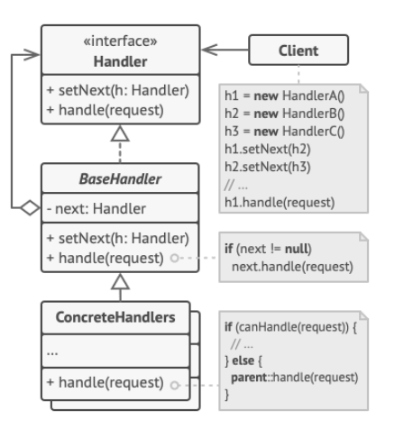
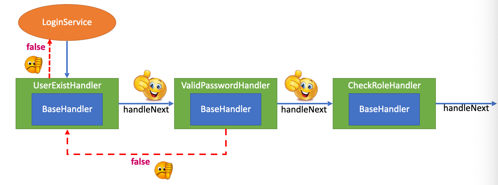
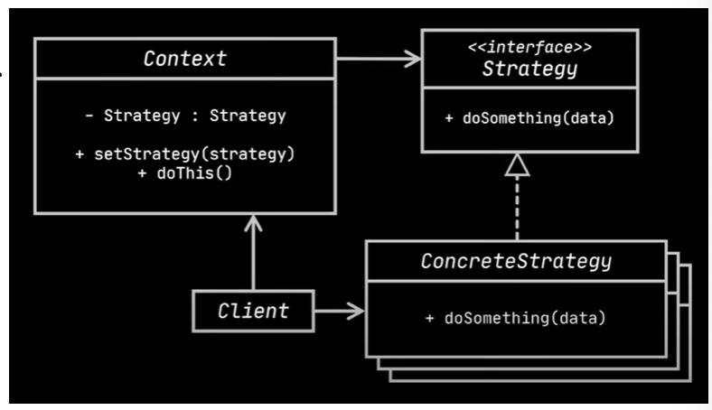
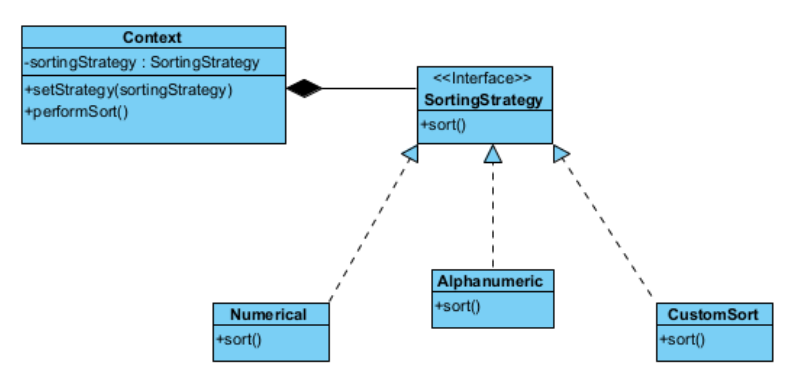
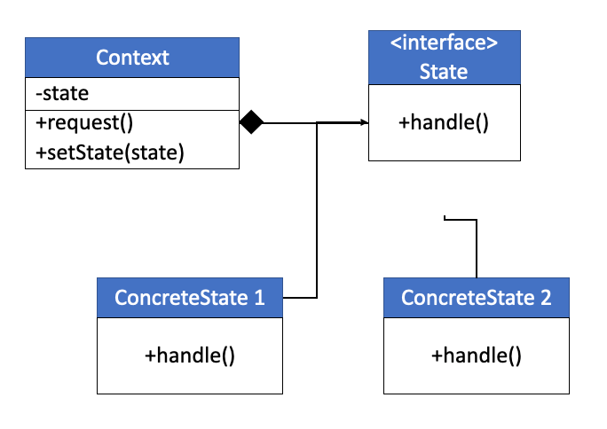

# 4 Design Pattern 2

## 知识图谱

```plaintext
Week 04 – Design Patterns 2
│
├── 1. Behavioral Pattern 行为型模式总览
│   ├── 核心关注点
│   │   ├── 对象之间的职责分配
│   │   ├── 将行为封装到对象中
│   │   ├── 将请求委托给合适对象处理
│   │   └── 保持客户端与实现之间的松耦合
│   │
│   ├── 行为型模式列表
│   │   ├── Chain of Responsibility 责任链模式
│   │   ├── Command 命令模式
│   │   ├── Interpreter 解释器模式
│   │   ├── Iterator 迭代器模式
│   │   ├── State 状态模式
│   │   ├── Strategy 策略模式
│   │   ├── Visitor 访问者模式
│   │   ├── Mediator 中介者模式
│   │   └── Observer 观察者模式
│
├── 2. Chain of Responsibility 责任链模式
│   ├── 核心思想
│   │   ├── 请求从一个处理者传递到下一个处理者
│   │   ├── 每个处理者只负责一个功能
│   │   ├── 由链上的对象自行决定是否处理或继续传递
│   │   └── 解耦请求发送者与请求接收者
│   │
│   ├── 关键组件
│   │   ├── Handler：定义处理请求与设置 next handler 的接口
│   │   ├── BaseHandler：可选抽象类，封装公共转发逻辑
│   │   ├── ConcreteHandler：具体处理者，负责实际处理逻辑
│   │   └── Client：创建并组装处理链，向链首发送请求
│   │
│   ├── 典型例子
│   │   ├── 用户登录验证
│   │   │   ├── 检查用户名是否存在
│   │   │   ├── 检查密码是否正确
│   │   │   └── 检查用户角色/权限
│   │   ├── ATM 出钞系统
│   │   │   ├── $50 Dispenser
│   │   │   ├── $20 Dispenser
│   │   │   └── $10 Dispenser
│   │   └── Web Server HTTP Request Pipeline
│   │       ├── Authentication
│   │       ├── Logging
│   │       ├── Data Validation
│   │       └── Actual Request Handling
│   │
│   ├── 优点
│   │   ├── Reduced Coupling 降低耦合
│   │   ├── Flexibility 动态调整处理顺序
│   │   ├── Clear Sequential Process 流程顺序清晰
│   │   ├── Simplicity 减少复杂 if-else
│   │   └── Separation of Concerns 关注点分离
│   │
│   ├── 缺点 / Trade-off
│   │   ├── 可能产生很多实现类
│   │   ├── 如果公共代码很多，会增加维护成本
│   │   └── 如果链条构建错误，某些请求可能无法被处理
│   │
│   └── 适用场景
│       ├── 请求类型和处理顺序事先不完全确定
│       ├── 必须按特定顺序执行多个处理步骤
│       └── 处理者集合和顺序需要在运行时改变
│
├── 3. Strategy Design Pattern 策略模式
│   ├── 核心思想
│   │   ├── 将一系列算法封装成独立策略类
│   │   ├── 通过统一接口让算法可以互相替换
│   │   ├── Context 在运行时使用不同策略
│   │   └── 算法变化不影响使用算法的客户端
│   │
│   ├── 关键组件
│   │   ├── Context：持有 Strategy 接口引用
│   │   ├── Strategy Interface：定义所有算法的公共接口
│   │   ├── Concrete Strategy：实现具体算法
│   │   └── Client：创建具体策略并传递给 Context
│   │
│   ├── 典型例子
│   │   ├── 多消息服务发送
│   │   │   ├── WeChat
│   │   │   └── WhatsApp
│   │   ├── 电商支付系统
│   │   │   ├── Credit Card
│   │   │   ├── PayPal
│   │   │   ├── Bank Transfer
│   │   │   └── Cryptocurrency
│   │   ├── 快递费用计算
│   │   │   ├── ParcelStrategy
│   │   │   └── DocumentStrategy
│   │   └── 排序系统
│   │       ├── NumericalSortStrategy
│   │       ├── AlphabeticalSortStrategy
│   │       └── CustomSortStrategy
│   │
│   ├── 与 OCP 的关系
│   │   ├── Open for Extension：新增策略类即可扩展功能
│   │   └── Closed for Modification：不需要修改 Context 原有代码
│   │
│   ├── Industry Practice
│   │   └── Object Injection：通过构造函数或 Setter 注入策略对象
│   │
│   ├── 优点
│   │   ├── Flexibility：运行时可替换策略
│   │   ├── Encapsulation：算法独立封装
│   │   ├── Reusability：策略类可复用
│   │   ├── Maintainability：修改一个策略不影响其他策略
│   │   └── Testing：每个策略可单独测试
│   │
│   └── 适用场景
│       ├── 一个对象的行为/算法需要运行时改变
│       ├── 存在多个算法变体
│       ├── 需要避免大量 if-else / switch
│       └── 需要遵守 Open/Closed Principle
│
└── 4. State Design Pattern 状态模式
    ├── 核心思想
    │   ├── 对象行为随着内部状态改变而改变
    │   ├── 对象看起来像改变了自己的类
    │   ├── 将状态相关行为封装到不同状态类中
    │   └── 避免状态判断代码堆积在一个类中
    │
    ├── 关键组件
    │   ├── Context：持有当前 State 引用
    │   ├── State Interface：定义所有状态共有操作
    │   └── Concrete State：实现不同状态下的具体行为
    │
    ├── 状态转换
    │   ├── Context 可以设置下一个状态
    │   ├── Concrete State 也可以触发状态转换
    │   └── 通过替换 Context 中的 State 对象完成转换
    │
    ├── 典型例子
    │   ├── MP3 Player
    │   │   ├── StandbyState
    │   │   └── PlayingState
    │   ├── Document Approval Workflow
    │   │   ├── Draft
    │   │   ├── Review
    │   │   ├── Approved
    │   │   └── Disapproved
    │   ├── Vending Machine
    │   │   ├── NoSelection
    │   │   ├── HasSelection
    │   │   ├── InsertedMoney
    │   │   └── Dispensed
    │   └── Traffic Light
    │       ├── Red
    │       ├── Green
    │       └── Yellow
    │
    ├── 优点
    │   ├── Organized Control Flow
    │   ├── Localize State-Specific Behavior
    │   ├── State Transitions Explicit
    │   ├── Extensibility
    │   └── Simplify Code
    │
    └── 适用场景
        ├── 对象行为强烈依赖当前状态
        ├── 状态数量较多
        ├── 状态相关代码经常变化
        ├── 类中存在大量基于状态的条件判断
        └── 状态机存在重复状态转换代码
```

## Behavioral Pattern

- Concerned with the assignment of responsibilities between objects, or, encapsulating behavior in an object and delegating requests to it

  **责任分配**：研究如何将行为封装在对象中，并将请求委托给它们 。

- Concerned with the way objects are interconnected. The interaction between the objects should be in such a way that they can easily talk to each other and still should be loosely coupled

  **松耦合交互**：确保对象之间能够轻松通信，同时保持松散耦合，以避免硬编码和复杂的依赖关系 

- The implementation and the client should be loosely coupled in order to avoid hard coding and dependencies

  实现与客户端之间应采用松耦合设计，以避免硬编码和依赖性问题。

- **Chain of Responsibilities.** A chain of objects is created to deal with the request so that no request goes back unfulfilled

  责任链模式。 创建一系列对象来处理请求，确保每个请求都能得到响应，不会无果而终。

- **Command.** Command pattern deals with requests by hiding it inside an object as a command and send to the invoker object which then passes it to an appropriate object that can fulfill the request.

  命令模式将请求封装成一个对象作为命令，并发送给调用者对象，再由调用者传递给能够处理该请求的合适对象，从而实现对请求的处理。

- **Interpreter.** Interpreter pattern is used for language or expression evaluation by creating an interface that tells the context for interpretation. 

  解释器模式。解释器模式通过创建一个定义解释上下文的接口，用于语言或表达式的求值。

- **Iterator.** Iterator pattern is used to provide sequential access to a number elements present inside a collection object without any relevant information exchange.

  迭代器。 迭代器模式用于在不涉及相关信息交换的情况下，对集合对象内部的多个元素提供顺序访问。

- **State.** In State pattern, the behavior of a class varies with its state and is thus represented by the context object.

  状态模式。在状态模式中，类的行为会随其状态改变而改变，并由上下文对象来表现这种行为。

- **Strategy.** Strategy pattern deals with the change in class behavior at runtime. The objects consist of strategies and the context object judges the behavior at runtime of each strategy.

  策略模式。 策略模式处理类行为在运行时的变化。对象由策略组成，上下文对象在运行时判断每种策略的行为。

- **Visitor.** A Visitor performs a set of operations on an element class and changes its behavior of execution. Thus, the variance in the behavior of element class is dependent on the change in visitor class.

  访问者。访问者在一组元素类上执行一系列操作，并改变其执行行为。因此，元素类行为的变化取决于访问者类的变化。

- **Mediator.** Mediator pattern provides easy communication through its mediator class that allows communication for several classes.

  中介者。 中介者模式通过其中介类提供便捷的通信方式，允许多个类之间进行交互。

-  **Observer.** A One-to-Many relationship calls for the need of Observer pattern to check the relative dependencies of objects.

  观察者模式。一对多关系需要观察者模式来检查对象之间的相对依赖关系。

## Chief of Responsibilities 职责链模式详解

- Request route from one service to the other.
- Each service is responsible for one job function.

职责链模式通过将请求沿着一个**处理者链**传递，直到其中一个处理者决定处理它，从而实现发送者和接收者的解耦 。每个服务只负责一项具体的职能

### Chief Responsibility Pattern

- used to achieve loose coupling in software design where a request from client is passed to a chain of objects to process them.

  在软件设计中用于实现松耦合，将来自客户端的请求传递给一系列对象进行处理。

- Then the object in the chain will decide themselves who will be processing the request and whether the request is required to be sent to the next object in the chain or not.

  随后，链中的对象将自行决定由谁来处理请求，以及是否需要将请求传递给链中的下一个对象。

### Key components

- **Handler:** Define the interface for the method for handling request. Sometimes also define the interface for the method to set the next handler.

  **Handler（处理者接口）**：定义处理请求的方法，通常也包含设置下一个处理者的方法 。

- **BaseHandler** : This is an optional abstract class. Base class of the concrete handlers. Usually define the boilerplate code common to all concrete handlers.

  **BaseHandler（基础处理者）**：可选的抽象类，用于定义所有具体处理者通用的模板代码 。

- **Concrete handlers** : These are actual handlers of the request chained in some sequential order. It contain the actual processing of the requests.

  **Concrete Handlers（具体处理者）**：实际处理请求的类。它们按顺序排列，决定是处理当前请求还是将其传给链中的下一个对象 。

- **Client** : Originator of request and this will access the handler to handle it. It composes the chain of handlers statically or dynamically.

  **Client（客户端）**：请求的发起者。它负责组合（静态或动态地）处理者链，并将请求发送给链中的第一个处理者 。



### User Authentication and Authorization Example 用户身份验证 

- The process to authenticate and authorize a user is as follow

  资料中通过一个**登录验证系统**展示了该模式的实际运作方式。一个完整的登录请求需要经过以下链条：

  1. Check that the user enter an existing username

     **UserExistHandler**：检查用户名是否存在 

  2. Check that the user enter a corresponding password

     **ValidPasswordHandler**：检查密码是否匹配 。

  3. Check the attached roles of the user

     **CheckRoleHandler**：检查用户是否拥有相应的权限/角色

- Use the Chain of Responsibility pattern to design the software.

  客户端可以自由设置处理顺序（例如：先查用户，再验密码） 。

  每个处理者只关心自己的逻辑，剩余任务直接转发给 `next` 处理者 。

  如果链条构建不当（例如逻辑中断），请求可能永远无法被处理 。

User login -> check username -> check password -> check roles

### Implementation



### Exercise 1

- Observe the code in the following slides
  - How the implementation in the code different from the design?
  - How do you amend the code to align with the design?

```java
public interface Handler {
  void setNext(Handler handler);
  void process(User user);
}

public class UsernameExistsHandler implements Handler {
  @override
  public void setNext(Hanlder hanlder) {
    this.next = handler;
  }
  
  @override
  public void process(User user) {
    if (usernameExists(user)) {
      if (next != null) {
        next.process(user);
      }
    } else {
      throw new RuntimeException("")
    }
  }
  
  private voolean usernameExists(User user) {
    // Code to check username exists
    return true;
  }
}
public class PasswordCorrectHandler implements Handler {
  @Override
  public void setNext(Handler handler) {
    this.next - handler;
  }
  
  @Override
  public void process(User user) {
    if (passwordCorrect(user)) {
      if (next != null) {
        next.process(user);
      }
    } else {
      throw new RuntimeException("incorreect password");
    }
  }
  
  private Boolean passwordCorrect(User user) {
    return true;
  }
}

public class RoleExistsHandler implements Handler {
  private Handler next;
  
  @Override
  public void setNext(Handler handler) {
    this.next = ahndler;
  }
  
  @Override
  public void process(User user) {
    if (hasRile(user)) {
      if (next != null) {
        next.process(user);
      }
    } else {
      throw new RuntimeException("User does not have requested roles");
    }
  }
  
  private boolean hasRole(User user) {
    return true;
  }
}
public class Authentication {
  public static void main(String[] args) {
    Handler usernameHandler = new UsernameExistsHandler();
    Handler passwordHandler = new PasswordCorrectHandler();
    Handler roleHandler = new RoleExistsHandler();
    
    usernameHandler.setNext(passwordHandler);
    passwordhandler.setNext(roleHandler);
    
    User user = new User("username", ?password), "role");
    usernamehandler.process(user);
  }
}
```

### Important Note

- Client can set the processing order and it will send the request to the first handler in the chain.

  **处理顺序**：客户端可以设定处理顺序，并将请求发送给链中的第一个处理者 。

- Each handler in the chain will have its own implementation to process the request. It will then send the remaining tasks to the next handler in the chain for further processing.

  **任务转发**：每个处理者执行自己的逻辑后，需将剩余任务发送给下一个处理者 。

- Every handlers in the chain should have reference to the next handler in chain to forward the request to.

  链中的每个处理器都应持有对下一个处理器的引用，以便将请求传递下去。

- Creating the chain carefully is very important otherwise there might be a case that the request will never be forwarded to a particular handler or there are no handler in the chain who are able to handle the request.

  精心构建处理链至关重要，否则可能出现请求无法传递给特定处理程序，或链中不存在能够处理该请求的处理程序的情况。

- Chain of Responsibility design pattern is good to achieve loose coupling, but it comes with the trade-off of having a lot of implementation classes and maintenance problems if most of the code is common in all the implementations.

  责任链设计模式有利于实现松耦合，但其代价是会产生大量实现类，且若多数代码在所有实现中通用，则可能引发维护问题。

### Benefits 优点

- Reduced Coupling: The pattern frees an object from knowing which other object handles a request.

  降低耦合度：该模式使对象无需知道由哪个其他对象处理请求。

- Added Flexibility: You can add, remove, or change the order of responsibility dynamically or at runtime.

  灵活性增强：您可以在运行时动态地添加、移除或调整责任链的顺序。

- Clear Sequential Process: Chain of Responsibility pattern provides a very clear and explicit control over the sequence.

  清晰有序的流程：责任链模式对流程顺序提供了非常明确且直观的控制。

- Simplicity: Avoid using complicated code with multiple conditionals to handle different types of requests, the pattern chains the receiving objects and passes the request along the chain until an object handles it.

  简洁性：避免使用复杂的代码和多重条件语句来处理不同类型的请求，该模式将接收对象串联起来，并沿着链条传递请求，直到某个对象处理它为止。

- Separation of Concerns: Each handler is independent of others and doesn't need to know about the inner workings of other handlers.

  关注点分离：每个处理器相互独立，无需了解其他处理器的内部运作机制。

### Application of Chian Of Responsibility

- Use the Chain of Responsibility pattern when your program is expected to process different kinds of requests in various ways, but the exact types of requests and their sequences are unknown beforehand. 

  当程序需要以多种方式处理不同类型的请求，且请求的具体类型及其顺序事先未知时，请使用责任链模式。

- Use the pattern when it’s essential to execute several handlers in a particular order. 

  当必须按照特定顺序执行多个处理程序时，采用此模式。

- Use the CoR pattern when the set of handlers and their order are supposed to change at runtime. 

  当需要在运行时动态调整处理程序及其执行顺序时，应采用责任链模式。

### ATM Problem

ATM Dispenser -> $50 Dispenser -> \$20 Dispenser -> \$20 Dispenser

- In ATM dispense machine, the user enters the amount to be dispensed and the machine dispense amount in terms of defined currency bills such as 、\$50, \$20, $10 etc.

  在自动取款机中，用户输入需要提取的金额，机器则会按照预设的纸币面额（如50美元、20美元、10美元等）进行出钞。

- If the user enters an amount that is not multiples of 10, it throws error. 

  如果用户输入的金额不是10的倍数，系统会抛出错误。

- We will use Chain of Responsibility pattern to implement this solution. The chain will process the request in the same order as below image.

  我们将采用责任链模式来实现此解决方案。该链将按照下图所示的顺序处理请求。

- Note that we can implement this solution easily in a single program itself but then the complexity will increase, and the solution will be tightly coupled.

  请注意，我们可以在单个程序中轻松实现此解决方案，但这样会增加复杂性，并且解决方案会变得紧密耦合。

### Implementation 实现

- Given the below interface, implement the ATM program using Chain of Responsibility design pattern

  基于以下接口，采用责任链设计模式实现ATM程序

- Implementation tips

  实施建议

  - For each handler, in the *dispense* method, if the amount to dispense is greater than the amount the handler need to dispense, then

    对于每个处理程序，在分配方法中，如果待分配的金额大于处理程序需要分配的金额，则

    - Calculate the number of notes to dispense

      计算需要分发的纸币数量

    - Calculate the remaining amount and call the next handler to dispense the remaining amount

      计算剩余金额并调用下一个处理器来分配剩余金额

    - Remember to check if there is any *next handler*

      记得检查是否有 下一个处理程序

```java
public interface Handler {
  public Handler setNexthandler(handler handler);
  
  public void dispense(double amount);
}
```

### Exercise 2

- Consider an example of handling HTTP requests on a web server. In a web server, multiple types of operations need to be performed on a HTTP request. These can include authentication checks, logging, data validation, and finally handling the actual request. Using the Chain of Responsibility pattern, you can decouple these operations and create a chain where each operation is handled by a separate object. Show your proposed implementation.

```java
public interface Handler {
    // 设置链中的下一个处理者
    Handler setNextHandler(Handler handler);
    
    // 执行面额分配逻辑
    void dispense(double amount);
}

// $50 面额处理器
public class Dollar50Handler implements Handler {
    private Handler next;

    @Override
    public Handler setNextHandler(Handler handler) {
        this.next = handler;
        return handler;
    }

    @Override
    public void dispense(double amount) {
        if (amount >= 50) {
            int num = (int) (amount / 50); // 计算 $50 钞票数量
            double remainder = amount % 50; // 计算余数
            System.out.println("Dispensing " + num + " * $50 note(s)");
            
            if (remainder != 0 && next != null) {
                next.dispense(remainder); // 传给下一个处理器
            }
        } else if (next != null) {
            next.dispense(amount);
        }
    }
}

// $20 面额处理器
public class Dollar20Handler implements Handler {
    private Handler next;

    @Override
    public Handler setNextHandler(Handler handler) {
        this.next = handler;
        return handler;
    }

    @Override
    public void dispense(double amount) {
        if (amount >= 20) {
            int num = (int) (amount / 20);
            double remainder = amount % 20;
            System.out.println("Dispensing " + num + " * $20 note(s)");
            
            if (remainder != 0 && next != null) {
                next.dispense(remainder);
            }
        } else if (next != null) {
            next.dispense(amount);
        }
    }
}

// $10 面额处理器
public class Dollar10Handler implements Handler {
    private Handler next;

    @Override
    public Handler setNextHandler(Handler handler) {
        this.next = handler;
        return handler;
    }

    @Override
    public void dispense(double amount) {
        if (amount >= 10) {
            int num = (int) (amount / 10);
            double remainder = amount % 10;
            System.out.println("Dispensing " + num + " * $10 note(s)");
            
            if (remainder != 0 && next != null) {
                next.dispense(remainder);
            }
        } else if (amount > 0) {
            // 如果到最后一级仍有余数且无法被10整除，则报错 
            System.out.println("Error: Amount must be multiples of 10.");
        }
    }
}

public class ATMSystem {
    public static void main(String[] args) {
        // 初始化各面额处理器 [cite: 86-89]
        Handler h50 = new Dollar50Handler();
        Handler h20 = new Dollar20Handler();
        Handler h10 = new Dollar10Handler();

        // 组装职责链: $50 -> $20 -> $10
        h50.setNextHandler(h20);
        h20.setNextHandler(h10);

        double amountToWithdraw = 130; // 示例金额
        System.out.println("Requesting $" + amountToWithdraw + ":");
        
        // 校验输入是否为10的倍数 
        if (amountToWithdraw % 10 != 0) {
            System.out.println("Error: Input must be multiples of 10.");
        } else {
            h50.dispense(amountToWithdraw); // 从链首开始处理
        }
    }
}
```

## Strategy Design Pattern 策略设计模式

- A program to send messages using multiple messaging services

  ```java
  // find out the problems in this code
  public class MessageService {
    public void send(String type, String msg) {
      if (!type.equals(anObject: "WeChat")) {
        System.out.println(x:"Sending message using WeChat");
      } else if (!type.equals(anObject: "WhatsApp")) {
        System.out.println(X:"Sending message using WhatsApp")
      }
    }
  }
  ```

- Strategy pattern deals with the change in class behavior at runtime. The objects consist of strategies and the context object judges the behavior at runtime of each strategy

  策略模式处理类行为在运行时的变化。对象由策略组成，上下文对象在运行时判断每种策略的行为。

- Place each messaging type into its own class to achieve single responsibility principle.

  将不同的行为（算法）放置在独立的类中，使它们遵循相同的接口，从而实现相互替换 。

- These classes can easily interchangeable without modification.

  它是实现**开闭原则（Open/Closed Principle）**的典型方式——对扩展开放（可以添加新策略），对修改关闭（无需修改现有上下文逻辑） 

### Key Components



- Context: Maintains a reference to a concrete strategy and communicate with it via interface.

  **Context（上下文）**：维护一个对策略对象的引用，通过策略接口与对象通信 。

- Strategy interface: This is an interface common to different algorithms.

  **Strategy Interface（策略接口）**：所有具体算法通用的公共接口 。

- Concrete strategy: Provide its own implementations for the interface.

  **Concrete Strategies（具体策略）**：实现接口的具体算法类 。

- Client: Creates a specific strategy object and passes it to the context

  **Client（客户端）**：创建具体的策略对象并将其传递给上下文（通常通过构造函数或 Setter 方法，即对象注入） 

### Srategy Design pattern - Ecommonerce Example 典型案例：电子商务支付系统

- Let's take an example of a payment system in an e-commerce application:

  用户可以选择信用卡、PayPal、银行转账等多种支付方式 。

- In such an application, customers may have different preferred methods of payment; some may like to pay with credit cards, others with debit cards, PayPal, bank transfer, or even cryptocurrencies. Trying to manage all these payment methods within a single class would make your code complex and harder to maintain.

- With the Strategy pattern, you can define a common interface for all payment methods, with each payment method implemented as a separate class (Concrete Strategy). The Context class (in this case, the shopping cart or payment processing class) can then use this interface to delegate the payment processing task to the payment method selected by the user.

- 定义 `PaymentStrategy` 接口，包含 `pay(amount)` 方法 。

- 创建 `CreditCardPaymentStrategy` 和 `PayPalPaymentStrategy` 类 。

- `ShoppingCart` 类（Context）持有接口引用，在 `checkout` 时调用策略的 `pay` 方法 

#### ECommerce Example

```java
interface PaymentStrategy {
  void pay(double amount);
}

class CreditCardPaymentStrategy implements PaymentStrategy {
  @Override
  public void pay(double amount) {
    
  }
}

class PayPalPaymentStrategy implements PaymentSrategy {
  @Override
  public void pay(double amount) {
    
  }
}

class ShoppingCart {
  private PaymentStrategy paymentStrategy;
  
  public void setPaymentStrategy(PaymentStrategy paymentStrategy) {
    this.paymentStrategy = paymentStrategy;
  }
  
  public void checkout(double amount) {
    paymentStrategy.pay(amount);
  }
}

public class ECommerce {
  public static void main(String[] args) {
    ShoppingCart cart = new ShoppingCart();
    cart.setPaymentStrategy(new PaypalPaymentStrategy());
    cart.checkout(100.0);
  }
}
```

### Observation

- Open/Closed Principle 开闭原则

- Open for extension: We can add more payment strategy by implementing PaymentStrategy interface.  

  开放扩展性：通过实现PaymentStrategy接口，我们可以添加更多支付策略。

- Close for modification: We do not modify add existing code except passing in new strategy object.

  关闭修改：我们不会修改现有代码，除非传入新的策略对象。

- In the software industry, Open/Closed principle is mostly implemented through Strategy Pattern.

  在软件行业中，开闭原则主要通过策略模式实现。

### Industry Practice - Object Injection

```java
public interface DataExporter{
  void export(Data data);
}

public class PdfExporter implements DataExporter {
  public void export(Data data)
}

public class CsvExporter implements DataExporter {
  public void export(Data data)
}

public class ExportService {
  private final DataExporter exporter;
  
  public ExportService(DataExporter exporter) {
    this.exporter = exporter;
  }
  
  public void executeExport(Data data) {
    exporter.export(data);
  }
}
```

### Benefits

- Flexibility: You can alter the application's behavior at runtime by replacing the strategy object within the context object.

  灵活性：您可以在运行时通过替换上下文对象中的策略对象来改变应用程序的行为。

- Encapsulation: Related algorithms are grouped into strategy classes, which encapsulate complex behavior that could otherwise clutter other classes.

  封装：相关算法被分组到策略类中，从而封装了原本可能使其他类变得杂乱无章的复杂行为。

- Reusability: Since the strategy classes are decoupled from the context, they can be reused across different contexts.

  可复用性：由于策略类与上下文解耦，它们可以在不同的上下文中重复使用。

- Maintainability: The Strategy Design Pattern makes the code more maintainable. Changes to one strategy do not affect others. Adding a new strategy or updating an existing one involves changes only to the strategy class itself, not the context class.

  可维护性：策略设计模式使代码更易于维护。对某一策略的修改不会影响其他策略。新增或更新策略时，仅需改动策略类本身，无需修改上下文类。

- Testing: Each strategy can be tested independently of the context and other strategies, which makes unit testing easier and more robust

  测试：每种策略都可以独立于上下文和其他策略进行测试，这使得单元测试更加简单且健壮。

### Application of Strategy Design Pattern

- The Strategy design pattern shines in scenarios where an object's behavior or algorithm can change dynamically at runtime. It's especially useful when you have several variants of an algorithm or operation and the exact variant to be used isn't known until runtime.
- 当一个对象需要动态地在几种算法变体中切换时 。
- 当你拥有许多仅在行为上有所不同的相似类时 。
- 为了隐藏复杂的、与算法相关的数据结构时。

### Exercise 3

Courier Service Problem

- The cost calculation for courier service is base on the type of item to be sent. Currently there are 2 type of items can be sent using the courier service, namely Parcel and Document.
- The algorithm to calculate the cost of sending Parcel is first calculate using algorithm A which is base on the weight, and then calculate using algorithm B which is base on the dimension. The final cost is the cost from either algorithm A or B depending on whichever is higher.
- The algorithm to calculate the cost of sending Document is algorithm C.
- In your problem, algorithm A, B, and C is negligible.
- Write a program following Strategy Design Pattern for the problem.

```java
public interface ShippingStrategy {
    double calculateCost(double weight, double width, double height, double length);
}

// 包裹计算策略
public class ParcelStrategy implements ShippingStrategy {
    @Override
    public double calculateCost(double weight, double width, double height, double length) {
        double costA = weight * 2.5; // 模拟算法 A
        double costB = (width * height * length) / 5000; // 模拟算法 B
        return Math.max(costA, costB); [cite: 145]
    }
}

// 文件计算策略
public class DocumentStrategy implements ShippingStrategy {
    @Override
    public double calculateCost(double weight, double width, double height, double length) {
        return 10.0; // 模拟算法 C 
    }
}

public class CourierService {
    private ShippingStrategy strategy;

    public void setStrategy(ShippingStrategy strategy) {
        this.strategy = strategy;
    }

    public double calculate(double weight, double w, double h, double l) {
        return strategy.calculateCost(weight, w, h, l);
    }
}
```

### Exercise 4

- You are tasked with designing a flexible sorting system for a data analysis application. The application needs to sort lists of data in various ways, such as by numerical value, alphabetical order, or custom-defined criteria. The sorting method should be easily interchangeable during the run-time without modifying the existing code structure.
- **Task:**
  - Describe the Strategy design pattern and explain how it can be applied to solve the problem of interchangeable sorting methods.
  - Draw a class diagram to represent your design for the system. Include at least three different sorting strategies: numerical, alphabetical, and a custom strategy of your choice.
  - Briefly explain the advantages of using the Strategy pattern in this context.

### Answer



- **Description of Strategy Pattern:**

  - The Strategy pattern defines a family of algorithms, encapsulates each one, and makes them interchangeable. This pattern allows the algorithm to vary independently from the clients that use it.

    策略模式定义了一系列算法，将每个算法封装起来，并使它们可以相互替换。这种模式使得算法可以独立于使用它的客户端而变化。

- **Advantages of Using the Strategy Pattern:**

  - **Flexibility:** It allows the client to choose and change the sorting algorithm at runtime without altering the client code.

    灵活性： 允许客户端在运行时选择和更改排序算法，而无需修改客户端代码。

  - **Maintainability:** New sorting strategies can be added easily without modifying existing classes, adhering to the Open/Closed Principle.

    可维护性： 可以轻松添加新的排序策略，而无需修改现有类，符合开闭原则。

  - **Reusability:** Different sorting strategies are encapsulated in their own classes, making them reusable across different context.

    可复用性： 不同的排序策略被封装在各自的类中，使得它们能够在不同的上下文中重复使用。

## State Pattern

- The State pattern is a **behavioral** pattern - it's used to manage algorithms, relationships and responsibilities between objects.

  状态模式是一种行为型模式，用于管理对象之间的算法、关系和职责。

- The definition of State provided in the original Gang of Four book on Design Patterns states: *Allows an object to alter its behavior when its internal state changes. The object will appear to change its class.*

  在《设计模式》原版书籍中，对状态模式的定义如下：允许一个对象在其内部状态改变时改变它的行为。对象看起来似乎修改了它的类。

### State Pattern - The structure



**Context（环境类）**：维护一个指向当前状态对象的引用，并将与状态相关的工作委托给它 。

**State Interface（状态接口）**：定义所有具体状态共同的接口，封装与特定状态相关的行为 。

**Concrete States（具体状态类）**：实现与该状态对应的具体行为 

### Key Components

- **Context** stores a reference to one of the concrete state objects and delegates to it all the state-specific work. The context communicates with the state object via the state interface. The context exposes a setter for passing it a new state object. 

  上下文存储对一个具体状态对象的引用，并将所有状态特定的工作委托给该对象。上下文通过状态接口与状态对象进行通信。上下文公开了一个设置器，用于向其传递新的状态对象。

- The **State** interface defines a common interface for all concrete states, encapsulating all behavior associated with a particular state. 

  State 接口为所有具体状态定义了一个通用接口，封装了与特定状态相关的所有行为。

- **Concrete States** provide their own implementations for the state-specific methods. To avoid duplication of similar code across multiple states, you may provide intermediate abstract classes that encapsulate some common behavior. 

  具体状态为特定于状态的方法提供自己的实现。为了避免在多个状态之间重复类似的代码，可以提供封装了一些共同行为的中间抽象类。

- Both context and concrete states can set the next state of the context and perform the actual state transition by replacing the state object linked to the context. 

  上下文与具体状态均可设定上下文的下一个状态，并通过替换与上下文关联的状态对象来执行实际的状态转换。

### MP3 Example

```java
public class MP3PlayerContext {
  private State state;
  
  public MP3PlayerContext(State state) {
    this.state = state;
  }
  
  public void play() {
    state.pressPlay(this);
  }
  
  public void setState(State state) {
    this.state = state;
  }
  
  public State getState() {
    return state;
  }
}

interface State {
  public void pressPlay(MP3PlayerContext context);
}

public class StandbyState implements State {
  public void pressPlay(MP3PlayerContext context) {
    System.out.println("Playing...");
    context.setState(new PlayingState());
  }
}

public class PlayingState implements State {
  public void pressPlay(MP3PlayerContext context) {
    System.out.println("I am already in Plyaing state");
  }
}

public class PlayMusic {
  public static void main(String[] args) {
    MP3PlayerContext player = new MP3PlayerContext(new StandbyState());
    player.play();
  }
}
```

### Workflow System

- One complex scenario where State Design Pattern can be beneficial is a workflow system. A workflow includes a number of processes that usually occurs in a sequence, where each process has its own set of rules, responsibilities, and the transition to the next process.

  状态设计模式可发挥优势的一个复杂场景是工作流系统。工作流包含一系列通常按顺序执行的流程，每个流程都有其自身的规则、职责以及向下一个流程的过渡条件。

- For instance, let's consider a Document Approval System where a document goes through several states:

  例如，假设有一个文档审批系统，其中文档需经历多个状态：

  - Draft, Review, Approve, Disapprove

### Exercise 5

- Draw a class diagram for the following workflow program.

- **Context**: `Document` 类（持有 `State` 引用，初始为 `Draft`）。

  **Interface**: `State` 接口（定义 `review()`, `approve()`, `disapprove()`）。

  **Concrete States**:

  - **Draft**: 只能转换到 `Review`。
  - **Review**: 可以转换到 `Approved` 或 `Disapproved`。
  - **Approved**: 已经审批，只能再次 `Disapproved`。
  - **Disapproved**: 可以重新转换回 `Approved`。

### Benefits

- Organized Control Flow: The State pattern can improve control flow if a system often switches between a number of states in a complex manner. 

  有序控制流：如果系统经常以复杂的方式在多个状态之间切换，状态模式可以改善控制流。

- Localize State-Specific Behavior: All state-related operation is coded into separate classes. This approach allows you to group the states' behaviors within corresponding state class itself.

  本地化特定状态行为：所有与状态相关的操作都编码到独立的类中。这种方法允许您将状态行为分组到对应的状态类本身。

- State Transitions Explicit: State transitions can be made more explicit and predictable. The code is easier to read and understand.

  状态转换显式化：状态转换可以变得更加明确和可预测，代码更易于阅读和理解。

- Extensibility: New states can be added easily by just creating new state classes.

  可扩展性：只需创建新的状态类，即可轻松添加新状态。

- Simplify Code: The State Pattern helps to clean up the code by eliminating large monolithic conditional blocks.

  简化代码：状态模式通过消除大型单一条件块，有助于清理代码。

### Application of State Pattern

- Use the State pattern when you have an object that behaves differently depending on its current state, the number of states is enormous, and the state-specific code changes frequently. 

  当对象的行为因其当前状态而异，状态数量庞大且特定状态的代码频繁变更时，请使用状态模式。

- Use the pattern when you have a class polluted with massive conditionals that alter how the class behaves according to the current values of the class’s fields. 

  当某个类充斥着大量条件判断语句，且这些语句会根据类的字段当前值来改变类的行为方式时，请采用此模式。

- Use State when you have a lot of duplicate code across similar states and transitions of a condition-based state machine. 

  当你基于条件的状态机中存在大量相似状态和转换的重复代码时，请使用状态模式。

### Exercise 6

A traffic light commonly has three states:

1. Red: Vehicles must stop. 
2. Green: Vehicles can go. 
3. Yellow: Vehicles should prepare to stop, as it will turn red soon. 

 Here are the behaviors and transitions for these states:

- In the Red state, after a certain period, the state transitions to Green, allowing vehicles to go.
- In the Green state, after a certain period or if emergency conditions are noticed, the state transitions to Yellow as a signal to prepare for a stop.
- In the Yellow state, after a brief period, the state transitions to Red, indicating the vehicles must stop.

The Traffic Light object (Context) can contain a state reference to manage its current Traffic Light State (State). The State interface or abstract class declares the method changeLight(), which changes the state of the traffic light object. The concrete state classes (Red, Green, Yellow) implement the changeLight() function to dictate how state changes.

Solve the problem using State design pattern.

```java
public interface TrafficLightState {
    void changeLight(TrafficLightContext context);
}

// 红灯状态
public class RedState implements TrafficLightState {
    @Override
    public void changeLight(TrafficLightContext context) {
        System.out.println("Red Light: Stop! Transitioning to Green...");
        context.setState(new GreenState());
    }
}

// 绿灯状态
public class GreenState implements TrafficLightState {
    @Override
    public void changeLight(TrafficLightContext context) {
        System.out.println("Green Light: Go! Transitioning to Yellow...");
        context.setState(new YellowState());
    }
}

// 黄灯状态
public class YellowState implements TrafficLightState {
    @Override
    public void changeLight(TrafficLightContext context) {
        System.out.println("Yellow Light: Caution! Transitioning to Red...");
        context.setState(new RedState());
    }
}

public class TrafficLightContext {
    private TrafficLightState currentState;

    public TrafficLightContext() {
        // 初始状态设为红灯
        this.currentState = new RedState();
    }

    public void setState(TrafficLightState state) {
        this.currentState = state;
    }

    public void requestChange() {
        currentState.changeLight(this);
    }
}

public class Main {
    public static void main(String[] args) {
        TrafficLightContext light = new TrafficLightContext();

        // 模拟红绿灯循环
        light.requestChange(); // 红 -> 绿
        light.requestChange(); // 绿 -> 黄
        light.requestChange(); // 黄 -> 红
    }
}
```

