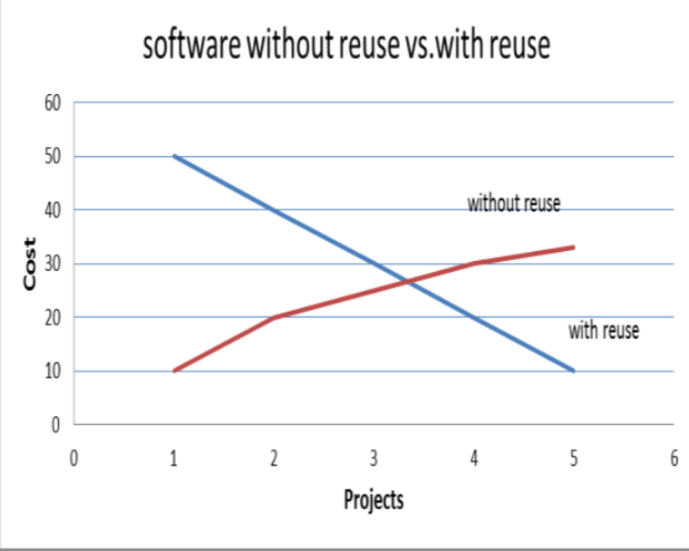
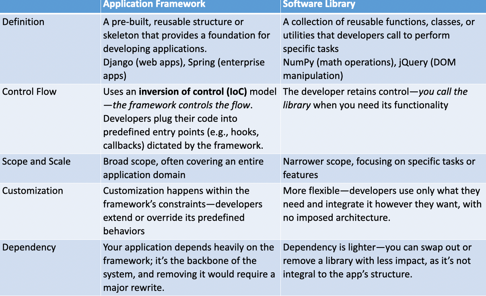
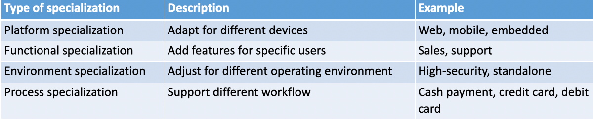
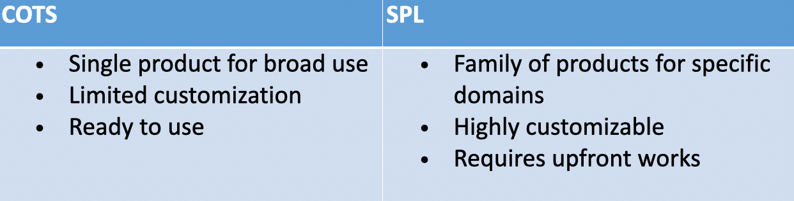

# 5 Software Reuse

## 知识图谱

```plaintext
Software Reuse 软件复用
├── 1. Introduction to Software Reuse
│   ├── 定义
│   │   └── 使用已有的软件组件，如代码、设计、框架、库等，构建新的系统
│   ├── 重要性
│   │   ├── 节省开发成本
│   │   ├── 加快开发速度
│   │   ├── 减少重复造轮子
│   │   └── 是现代软件工程的重要能力
│   └── 现实例子
│       ├── TensorFlow 被 Google 多个 AI 工具复用
│       ├── React reusable components 被 Meta 多个平台复用
│       └── Spotify 在 web 和 mobile app 中复用 UI components
│
├── 2. Benefits of Software Reuse
│   ├── Cost savings
│   │   └── 减少开发与维护成本
│   ├── Faster delivery
│   │   └── 更快交付产品，缩短 time-to-market
│   ├── Higher quality
│   │   └── 已测试组件通常比新写代码更可靠
│   └── Specialist knowledge
│       └── 直接利用专家已有成果，避免在不熟悉领域犯错
│
├── 3. Challenges of Software Reuse
│   ├── Maintenance costs
│   │   └── 被复用代码可能过时、不兼容
│   ├── Tool support
│   │   └── 工具可能无法很好集成复用组件
│   ├── Not-invented-here syndrome
│   │   └── 开发者可能不愿意使用别人写的代码
│   ├── Finding and adapting components
│   │   └── 难以找到合适组件，也可能难以修改适配
│   └── 失败案例
│       ├── Ariane 5：复用 Ariane 4 组件但没有正确适配
│       ├── Knight Capital：旧代码未正确关闭，造成错误交易
│       └── Log4j：广泛复用的开源库存在严重漏洞
│
├── 4. Core Reuse Techniques
│   ├── Application Framework
│   ├── Software Product Lines
│   ├── COTS
│   └── Other reuse techniques
│       ├── Component-based reuse
│       ├── Open-source libraries
│       └── Design patterns
│
├── 5. Application Framework
│   ├── 定义
│   │   └── 可扩展的通用软件结构或一组类，用来构建特定应用
│   ├── 例子
│   │   ├── Django
│   │   ├── Spring
│   │   └── Flutter
│   ├── 工作方式
│   │   ├── 提供通用功能，如 security、database support
│   │   └── 开发者在框架基础上添加业务逻辑
│   ├── 扩展方式
│   │   ├── Inheritance
│   │   ├── Callbacks
│   │   └── Hooks
│   ├── Framework vs Library
│   │   ├── Framework 控制程序流程，开发者扩展它
│   │   └── Library 由开发者主动调用
│   └── Challenges
│       ├── Learning curve
│       └── Overhead
│
├── 6. Software Product Lines (SPL)
│   ├── 定义
│   │   └── 一组共享共同核心、但针对不同需求进行特化的软件产品
│   ├── 核心思想
│   │   ├── Common core
│   │   ├── Variants
│   │   └── Specialization / variation points
│   ├── Benefits
│   │   ├── 跨产品复用
│   │   └── 新变体开发更快
│   ├── Specializations
│   │   ├── Platform specialization
│   │   ├── Functional specialization
│   │   ├── Environment specialization
│   │   └── Process specialization
│   └── Challenges
│       ├── Upfront investment
│       └── Variant management complexity
│
├── 7. COTS - Commercial Off-The-Shelf
│   ├── 定义
│   │   └── 可以购买并适配的预构建商业软件，不修改源代码
│   ├── 例子
│   │   ├── WordPress
│   │   ├── HubSpot
│   │   └── SAP
│   ├── 适配方式
│   │   ├── Configuration settings
│   │   ├── Plugins
│   │   └── API calls
│   ├── Benefits
│   │   ├── Fast deployment
│   │   ├── Lower development risk
│   │   └── Vendor support
│   ├── Challenges
│   │   ├── Limited customization
│   │   └── Vendor dependency
│   └── Testing focus
│       └── 重点测试 COTS 与业务流程、系统配置之间的集成
│
└── 8. Strategy Comparison
    ├── Application Framework
    │   └── 技术层面的复用，适合构建自定义应用
    ├── SPL
    │   └── 战略层面的领域复用，适合一组相似产品
    └── COTS
        └── 采购式复用，适合快速部署成熟现成系统
```


### Topics

- Introduction to Software Reuse
- Benefits and Challenges of Software Reuse
- Key Software Reuse Strategies:
  - Application Framework
  - Software Product Lines
  - Commercial Off-The-Shelf

## Introduction to Software Reuse

- Why software reuse matter?

- Companies like Google and Netflix save millions by reusing code. Today, we will learn how to do the same

  谷歌和Netflix等公司通过代码复用节省了数百万成本。今天，我们将学习如何实现同样的效果。

- Definition: **Software reuse is the practice of using existing software components (code, designs, etc.) to build new system**

  定义：软件复用是指利用现有软件组件（代码、设计等）构建新系统的实践。

- Real-world impact:

  现实世界的影响

  - Faster development

    更快的开发

    - TensorFlow powers multiple AI tools at Google

      TensorFlow为谷歌的多种人工智能工具提供支持。

    - Google Launches TensorFlow Enterprise at No Extra Cost for Cloud Customers

      谷歌为企业云客户推出TensorFlow Enterprise服务且不额外收费

  - Fewer bugs

    更少的bug

    - React’s reusable components reduce errors across Meta’s platforms

      React的可复用组件降低了Meta各平台中的错误率。

    - Facebook, Instagram, and WhatsApp

- Why it’s exciting: Reuse isn’t just efficient – It’s key skill in modern software engineering

  为何令人振奋：代码复用不仅是效率的提升——它更是现代软件工程中的核心技能。

##  Benefit of Software Reuse 软件复用的好处

saves time and money?

- **Key benefit:**

  - **Cost savings: Reuse reduces development and maintenance cost**

    **成本节约：重复利用可降低开发和维护成本**

  - **Faster delivery: Get products to market quicker**

    **更快的交付：缩短产品推向市场的时间（Time-to-market）**

  - **Higher quality: Tested components mean fewer bugs**

    **提高质量： 经过前人多次测试的组件比新写的代码更可靠** 

  - **Specialist knowledge: Leverage experts’ work without reinventing the wheel**

    **利用专家知识： 直接利用该领域专家的成果，避免在不熟悉的领域犯错 。**

- Example: Spotify reuses UI compnents across its web and mobile apps for consistency and speed.

  例如，Spotify在其网页和移动应用中复用UI组件，以保持一致性并提升速度。



### Challenges of Software Reuse 代码复用的劣势

reuse isn’t always easy?

- **Key challenges:**

  - **Maintenance costs: Reuse code may become outdated or incompatible**

    **维护成本：复用代码可能过时或不兼容**

  - **Tool support: Some tools don’t integrate well with reuse components**

    **工具支持：部分工具与可复用组件集成效果不佳**

  - **Not-invented-here syndrome: Developers may resist using others’ code**

    **非我发明症候群：开发者可能倾向于拒绝使用他人编写的代码。**

  - **Finding and Adapting components: It can be hard to locate and modify the right components**

    **寻找与适配组件：定位并修改合适的组件可能颇具挑战**

- Can you think of a time when reusing something didn’t work out?

### Challenges of Software Reuse

- Example:

  - **Ariane 5 Flight 501 (1996)**: The Ariane 5 rocket exploded 40 seconds after launch due to a software error. The softwa

  - **Knight Capital Group (2012)**: Knight Capital Group deployed new trading software that reused old code from a previous system. The old code was not properly deactivated, leading to a series of erroneous trades.
    - **Outcome**: The company lost $440 million in just 45 minutes and nearly went bankrupt. This incident highlighted the risks of reusing legacy code without proper integration and testing.

  - **Log4j Vulnerability (2021):** The Log4j library, a widely reused open-source logging tool, had a critical vulnerability (CVE-2021-44228) that allowed remote code execution. Many organizations had reused Log4j in their systems without fully understanding its dependencies

### Core Reuse Techniques 核心的复用技巧

- Key approaches:

  - **Application framework**: Pre-built structures (e.g. Django, Spring) that you extend.

    应用框架：可扩展的预构建结构（如 Django、Spring）

  - **Software produce lines (SPL)**: Families of similar products with shared components (e.g. Salesforce CRM variants)

    软件产品线（SPL）：具有共享组件的相似产品系列（例如Salesforce CRM变体）

  - **COTS (Commercial Off-The-Shelf)**: Ready-made software adapted for specific needs (e.g. WordPress for websites)

    COTS（商用现成品或技术）：为特定需求而调整的现成软件（例如用于网站的WordPress）

  - Other: Component-based, open-source libraries, design patterns, and more

    其他：基于组件的开源库、设计模式等

## Key Software Reuse Strategies 关键软件复用策略

### Application Framework 应用框架

- **Application framework: Build on a solid foundation**

  应用框架：构建于坚实基石之上

- Definition: A generic structure (e.g. a set of classes) that you extend to create specific applications

  定义：一种通用结构（例如一组类），通过扩展该结构来创建特定应用程序。

- Examples:

  - Web framework: Django (Python), Spring (Java)

    Web框架：Django（Python），Spring（Java）

  - Mobile framework: Flutter (cross-platform apps)

    移动框架：Flutter（跨平台应用）

- Frameworks are like **pre-built foundations**. You save time from starting from the scratch by adding your customize features to the foundations.

  框架如同预先搭建好的地基。你无需从零开始，只需在地基上添加定制化功能，从而节省大量时间。

- How they work: Provide common features (e.g., security, database support) that you customize.

  工作原理：提供可自定义的通用功能（例如安全性、数据库支持）。

- Analogy: Think of a framework as a house’s basic infrastructure such as plumbing, electricity, roofing and wall. You can design the details and add your own fitting.

  类比：把框架想象成房子的基础结构，比如管道、电路、屋顶和墙壁。你可以设计细节并添加自己的装饰。

#### Extending Framework 扩展框架

- Extension methods:

  拓展方法

  - **Inheritance**: Create subclasses from framework classes.

    继承：从框架类创建子类。

  - **Callbacks**: Register functions to be called at specific times or events.

    回调函数：在特定时间或事件发生时注册要调用的函数。

  - **Hooks**: Insert custom code at predefined points.

    钩子：在预定义节点插入自定义代码。

#### Mini Research

- Imagine you’re building a dynamic web app—say, a live music playlist editor—using a framework like React or Django. Your app needs to respond to user actions and lifecycle events. Dive into the roles of **callbacks** and **hooks**: how do they work in a web framework, and what sets them apart in bringing your app to life?

  假设你正在使用React或Django这类框架构建一个动态Web应用——比如一个实时音乐播放列表编辑器。你的应用需要对用户操作和生命周期事件作出响应。深入了解回调函数与钩子的作用：它们在Web框架中如何运作？在赋予应用生命力的过程中，它们各自展现出怎样独特的价值？

#### Chanllenges of Application Framework

- **Learning Curve**: Steep initial effort to understand and adapt the framework (e.g., mastering Django’s structure).

  **学习曲线**：初期需要付出较大努力来理解和适应框架（例如掌握Django的结构）。

- **Overhead**: May include unused features, bloating the app (e.g., extra libraries in React).

  **开销**：可能包含未使用的功能，导致应用臃肿（例如React中的额外库）。

#### Application Framework vs. Libraries

- **Application Frameworks**: 
  - Structure for entire apps (e.g., Django).
  - Controls flow—you extend it.

- **Software Libraries**: 
  - Tools for specific tasks (e.g., Requests).
  - You control flow—call as needed. 



| 对比维度                       | Application Framework                                        | Software Library                                             |
| ------------------------------ | ------------------------------------------------------------ | ------------------------------------------------------------ |
| **Definition 定义**            | A pre-built, reusable structure or skeleton that provides a foundation for developing applications. 例如：Django、Spring | A collection of reusable functions, classes, or utilities that developers call to perform specific tasks. 例如：NumPy、jQuery |
| **Control Flow 控制流程**      | 使用 **Inversion of Control (IoC)**。Framework 控制程序流程，开发者把自己的代码插入到 predefined entry points，例如 hooks、callbacks | 开发者保留控制权。开发者在需要某个功能时主动调用 library     |
| **Scope and Scale 范围和规模** | 范围更广，通常覆盖整个 application domain                    | 范围较窄，通常只关注某个具体任务或功能                       |
| **Customization 自定义方式**   | 自定义发生在 framework 的约束内。开发者 extend 或 override framework 预定义的行为 | 更灵活。开发者只使用自己需要的部分，并且可以按照自己的方式集成，没有强制架构 |
| **Dependency 依赖程度**        | 应用高度依赖 framework。Framework 是系统骨架，如果移除，通常需要大规模重写 | 依赖较轻。Library 通常可以被替换或移除，对整体系统影响较小   |

### Software Product Line (SPL)

- Building a family of products

  构建产品家族

- Definition: A set of related software products sharing a common core but specialized for different needs.

  定义：一套共享共同核心但针对不同需求专门设计的相关软件产品。

- Example: Salesforce offer CRM variant for sales, support, and marketing all built from one SPL

  Salesforce为销售、支持与市场营销提供统一平台构建的CRM解决方案。

- Benefits:

  - **Reuse across multiple products**

    **跨产品复用**

  - **Faster development for new variants**

    **新变体的开发速度更快**

- Analogy: Car models with different features, but using the same engine under the hood

  类比：不同配置的汽车型号，但引擎盖下使用的是相同的发动机。

- **SPLs are ideal when you need to create similar products with slight variations. The reuse in SPL is at the domain level.**

  当您需要创建具有细微差异的相似产品时，软件产品线（SPL）是理想选择。SPL中的复用是在领域层面进行的。

#### SPL Specializations



#### Challenges for SPL

- **Upfront Investment**: High cost and time to design a reusable core (e.g., defining shared CRM features).

  前期投入：设计可复用核心功能（例如定义共享CRM特性）需要高昂的成本和时间。

- **Complexity**: Managing variants can get messy as the family grows (e.g., updating all apps consistently).

  复杂性：随着字体家族不断扩充，管理变体可能变得棘手（例如，需要同步更新所有应用程序）。

#### Exercise

- A software development team is tasked with creating a fitness tracking application that supports multiple user roles (athletes, coaches, health professionals), includes workout planning features, and integrates with external wearable devices (e.g., Fitbit). The client demands delivery within five months and prioritizes maintainability.
- Complete the following structured short-answer questions based on the scenario:

1. Name **one** software reuse technique suitable for this project.

   application framework

2. State **two reasons** why the technique you chose in part 1) is suitable for this project.

   First, an application framework is suitable because it provides a reusable foundation for building the app. For example, a mobile or web framework can provide pre-built support for user management, database access, security, API integration, and external device connection. This helps the team deliver the fitness tracking application within five months instead of building everything from scratch. 课件中也说明 framework 是一种可扩展的 generic structure，并提供 security、database support 等 common features。

   Second, application frameworks improve maintainability because developers can extend the framework through inheritance, callbacks, and hooks. For this fitness app, different modules such as athlete features, coach features, health professional features, workout planning, and Fitbit integration can be organized more clearly. This makes future changes easier to manage. Tutorial answer 里也直接指出，frameworks make the project more maintainable because developers extend them mainly by inheritance, callbacks, and hooks. 

### Commercial Off-The-Shelf (COTS)

- Ready-made software for quick deployment

  即用型软件，快速部署

- Definition: Pre-built software that you can buy and adapt without changing the source code

  定义：预构建的软件，您可以在不修改源代码的情况下购买并进行调整。

- Example: WordPress for websites, HubSpot for CRM, SAP for ERP

  示例：WordPress用于网站，HubSpot用于CRM，SAP用于ERP

#### COTS vs. SPL



#### Salesforce Case Study

- Internally, Salesforce develop its range of products using SPL strategy

  在内部，Salesforce采用SPL策略来开发其产品系列。

- Market its products as individual COTS product to external customers

  将产品作为独立的商用现成品向外部客户进行营销

- An SPL could be packaged and sold as COTS products

  SPL可打包并作为商用现货产品出售。

- However, SPL is not always sold as COTS products

  然而，SPL并不总是作为现成的商业产品出售。

#### Testing COTS Systems

- Testing of COTS focus on integration

  对商业现成产品（COTS）的测试重点在于集成验证。

- Key focus: To test how the COTS software interacts with your operational processes

  关键关注点：测试COTS软件如何与您的运营流程相互作用

- COTS is pre-tested, but integration with you operation may not smooth

  COTS 已预先测试，但与你运营系统的整合可能不够流畅。

- Example: 
  - Ensure the COTS CRM integrates well with your existing email system
  
    确保COTS CRM系统与您现有的电子邮件系统良好整合。
  
  - Ensure the COTS CRM works coherently with your process to manage customers
  
    确保COTS CRM与您的客户管理流程协调一致。

#### Challenges for COTS

- **Limited Customization**: Configuration-only approach restricts flexibility (e.g., WordPress can’t be fully rewritten).

  有限定制化: 仅通过配置的方式限制了灵活性（例如，无法对WordPress进行全面重写）。

- **Vendor Dependency**: Reliant on vendor updates or support (e.g., delays in fixing SAP bugs).

  供应商依赖：依赖供应商的更新或支持（例如，修复SAP漏洞时可能出现的延迟）。

#### Exercise

You are a software engineering consultant hired by a company that develops mobile applications for different industries, such as healthcare, finance, and education. The company is considering adopting software reuse techniques to reduce development time and costs while maintaining high quality. They are particularly interested in understanding the differences between **Application Frameworks** and **Software Product Lines (SPL)**.

你是一名受聘于一家公司的软件工程顾问，该公司为医疗、金融和教育等不同行业开发移动应用。公司正考虑采用软件复用技术，以在保持高质量的同时减少开发时间和成本。他们特别希望了解应用框架和软件产品线之间的区别。

**Scenario**:
 The company plans to develop a new set of mobile apps for small businesses, including:

公司计划为小型企业开发一套新的移动应用程序，包括

- A point-of-sale (POS) app for retail stores.

  面向零售商店的销售点（POS）应用程序

- An appointment scheduling app for service-based businesses.

  面向服务型企业的预约安排应用

- An inventory management app for warehouses.

  一款适用于仓库的库存管理应用。

-  All apps need to run on both iOS and Android, and they must share common features like user authentication, payment processing, and data analytics.

  所有应用程序都必须在iOS和Android系统上运行，并且必须共享用户身份验证、支付处理和数据分析等共同功能。

- Tasks:

  - Define **Application Frameworks** and **Software Product Lines (SPL)**, highlighting their key differences.

    定义应用框架和软件产品线（SPL），并强调它们的关键区别。

  - Recommend which technique (Application Frameworks or SPL) is more suitable for the company’s needs. Justify your choice with at least three specific reasons based on the scenario.

    推荐哪种技术（应用框架或SPL）更符合公司需求。基于情景至少提出三个具体理由来论证您的选择。

  - Identify two potential challenges the company might face when implementing your recommended technique.

    识别公司在实施推荐技术时可能面临的两个潜在挑战。

#### Discussion

- For each strategy (Application Framework, SPL, and COTS), explain how it tackles *at least two* of the essential difficulties discussed in the essay written by Fred Brooks “No Silver Bullet”, using examples to show your strategy in action.

  针对每种策略（应用框架、SPL和COTS），请结合弗雷德·布鲁克斯在《没有银弹》一文中讨论的至少两个本质性难题，说明该策略如何应对这些挑战，并通过实例展示策略的实际应用。

- Your task is to challenges the below given answer.

  你的任务是对以下给出的答案提出质疑。

Answer：

- **Application Frameworks**:

  - **Complexity**: Frameworks like Django reduce complexity by providing a structured blueprint—pre-built modules for carts, payments, and user accounts simplify the app’s design. Instead of juggling chaotic code, you follow a clear MVC pattern.

    复杂度：诸如Django这类框架通过提供结构化蓝图来降低复杂度——预构建的购物车、支付和用户账户模块简化了应用设计。您无需再处理混乱的代码，只需遵循清晰的MVC模式即可。

  - **Changeability**: They handle evolving needs well; adding a new payment gateway (e.g., Stripe) is just a matter of plugging into Django’s extensible architecture via middleware or apps.

    可变更性：它们能很好地应对不断变化的需求；添加新的支付网关（例如Stripe）只需通过中间件或应用接入Django的可扩展架构即可。

- **Software Product Lines (SPL)**:

  - **Complexity**: SPLs tame complexity by creating a reusable core (e.g., shared checkout and inventory logic) for variants like mobile and desktop e-commerce apps, reducing redundant design work.

    复杂性：软件产品线通过为移动端和桌面端电商应用等变体创建可复用的核心（例如共享的结算和库存逻辑），来驯服复杂性，减少冗余的设计工作。

  - **Conformity**: They align with real-world constraints by specializing the core—e.g., a mobile version conforms to touch inputs, while desktop supports keyboard navigation, all from one base.

    一致性：它们通过核心专业化来适应现实世界的约束——例如，移动版本适配触控输入，而桌面端支持键盘导航，这一切都基于同一基础架构。

- **COTS**:

  - **Complexity**: COTS like Shopify slashes complexity—you get a pre-built e-commerce solution with carts and analytics out of the box, no need to design from scratch.

    复杂性：像Shopify这样的商业现成解决方案大幅降低了复杂度——您获得的是开箱即用的预构建电商平台，包含购物车和分析功能，无需从零开始设计。

  - **Changeability**: It adapts to changes via configuration (e.g., adding a discount feature through plugins), though major shifts might hit customization limits.

    可变更性：系统通过配置适应变化（例如通过插件添加折扣功能），但重大变更可能触及定制化限制。

### Reuse in the Real World

- Overview: Netflix reuses micro-services across its platform

  概述：Netflix在其平台范围内复用微服务架构

- Benefit:

  - Scalability: Reuse services enable Netflix to

    可扩展性：服务复用机制使Netflix能够

    - Handle million of users by adding more micro-service instances to a specific Netflix service

      通过为特定Netflix服务增加更多微服务实例来应对数百万用户。

    - Easily add new Netflix service using existing micro-services

      轻松使用现有微服务添加新的Netflix服务

  - Reliability: Tested micro-services can be reused without testing again

    可靠性：经过测试的微服务无需再次测试即可重复使用

### Reuse in the Real World

- Scalability means growing without breaking

  可扩展性意味着在不崩溃的前提下持续发展

- Reuse micro-services enable Netflix to add more service instances and servers without disrupting users

  复用微服务使得Netflix能够在不影响用户的情况下增加更多服务实例和服务器。

- Flexibility: Deploy and scale individual services (e.g., adding more streaming instances during peak times) without affecting others.

  灵活性：部署和扩展单个服务（例如，在高峰时段增加更多流媒体实例）而不会影响其他服务。

### Why Reuse Matters

- Summary

  - Reuse saves time, money, and effort.

    节省时间、经济、努力

  - Techniques like frameworks, SPL, and COTS offer different ways to reuse.

    框架、SPL和COTS等技术提供了不同的复用途径。

  - Real-world companies rely on reuse to stay competitive.

    现实世界中的公司依赖重复利用来保持竞争力。

- As software engineers, mastering reuse will make you more efficient and valuable.

  作为软件工程师，掌握复用技术将使您的工作效率更高、价值更大。

- How can you apply reuse in their own projects?

  如何在自己的项目中应用复用策略？

# 潜在考试问题与参考答案

## Question 1

**Define software reuse and explain why it is important in software engineering.**

**Answer:**
 Software reuse is the practice of using existing software components, such as code, designs, libraries, frameworks, or complete systems, to build new software. It is important because it reduces development and maintenance cost, speeds up delivery, improves quality by using already tested components, and allows developers to benefit from specialist knowledge. For example, reusable UI components can help a company maintain consistency across web and mobile applications.

------

## Question 2

**What are the main benefits of software reuse?**

**Answer:**
 The main benefits are cost savings, faster delivery, higher quality, and access to specialist knowledge. Reuse reduces the need to build everything from scratch, so development and maintenance cost can be lower. It also shortens time-to-market because developers can use existing components. Since reused components are often already tested, the final software may contain fewer bugs. Developers can also reuse expert-built components instead of solving every technical problem themselves.

------

## Question 3

**Explain three challenges of software reuse.**

**Answer:**
 First, reused code may become outdated or incompatible with the new system, causing maintenance problems. Second, some tools may not integrate well with reusable components, increasing technical difficulty. Third, developers may suffer from not-invented-here syndrome, meaning they resist using code written by others. Another challenge is finding and adapting the right component, because a reusable component may not perfectly match the new system’s needs.

------

## Question 4

**Use one real-world example to explain the risk of software reuse.**

**Answer:**
 Ariane 5 Flight 501 is a good example. The rocket reused a software component from Ariane 4, but the component was not properly adapted to the new rocket environment. As a result, the software failed and the rocket exploded shortly after launch. This shows that reuse is not automatically safe. Reused components must be carefully checked, adapted, integrated, and tested in the new context.

------

## Question 5

**What is an application framework? Give two examples.**

**Answer:**
 An application framework is a generic and reusable software structure that developers extend to create specific applications. It provides common features such as security, database support, routing, or lifecycle management. Developers add their own custom business logic on top of the framework. Examples include Django for Python web applications, Spring for Java enterprise applications, and Flutter for cross-platform mobile applications.

------

## Question 6

**Differentiate between an application framework and a software library.**

**Answer:**
 An application framework provides the structure for an entire application and controls the main program flow. Developers extend it by adding code at predefined points, such as callbacks or hooks. This is called Inversion of Control. A software library is narrower in scope and provides reusable functions or classes for specific tasks. The developer controls the program flow and calls the library only when needed. For example, Django is a framework, while NumPy or Requests are libraries.

------

## Question 7

**Explain callbacks and hooks in the context of application frameworks.**

**Answer:**
 Callbacks are functions written by developers and passed to the framework. The framework calls them when specific events happen, such as a button click or an asynchronous operation finishing. Hooks are special extension points provided by the framework that allow developers to insert custom behavior into predefined lifecycle or state-change moments. In simple terms, **callbacks are developer-provided instructions, while hooks are framework-provided extension mechanisms.**

------

## Question 8

**What is a Software Product Line (SPL)?**

**Answer:**
 A Software Product Line is a family of related software products that share a common core but are specialized for different needs. Instead of developing each product separately, the organization builds reusable core assets and creates variants through specialization. For example, a CRM company may provide sales, support, and marketing versions of its product while sharing the same core platform. SPL reuse happens at the domain level.

------

## Question 9

**Explain the four types of SPL specialization.**

**Answer:**
 Platform specialization adapts the software to different devices or platforms, such as web, mobile, or embedded systems. Functional specialization adds different features for different users or roles, such as sales and support. Environment specialization adjusts the system for different operating environments, such as high-security or standalone deployment. Process specialization supports different workflows, such as cash payment, credit card payment, and debit card payment.

------

## Question 10

**What are the benefits and challenges of SPL?**

**Answer:**
 The benefits of SPL include reuse across multiple products and faster development of new variants. Because related products share a common core, developers do not need to rebuild the same functionality repeatedly. However, SPL also has challenges. It requires high upfront investment to design the reusable core and define variation points. As the product family grows, managing variants can become complex, especially when updates must be applied consistently across all products.

------

## Question 11

**What is COTS? Give examples.**

**Answer:**
 COTS stands for Commercial Off-The-Shelf software. It refers to ready-made software that can be bought and adapted without changing its source code. COTS products are usually configured or integrated into an organization’s system. Examples include WordPress for websites, HubSpot for CRM, and SAP for ERP. COTS is useful when fast deployment and lower development risk are more important than full customization.

------

## Question 12

**Compare COTS and SPL.**

**Answer:**
 COTS is usually a single ready-made product designed for broad use. It has limited customization but can be deployed quickly. SPL is a family of related products designed for a specific domain. It has a shared core and supports more customization, but it requires significant upfront work. In COTS, customers buy an existing product. In SPL, customers usually buy a specific product generated from the product line, not the SPL itself.

------

## Question 13

**Why should COTS testing focus on integration rather than unit testing?**

**Answer:**
 COTS software is usually already developed and tested by the vendor before it is sold. Therefore, users normally do not test its internal unit-level implementation. Instead, testing should focus on integration: whether the COTS software works properly with the organization’s operational processes, existing systems, configuration, and data flow. For example, if a company adopts a COTS CRM, it should test whether the CRM integrates with its email system and customer management workflow.

------

## Question 14

**A company wants to build POS, appointment scheduling, and inventory management apps. All apps share authentication, payment, and analytics. Should it use Application Framework or SPL? Justify your answer.**

**Answer:**
 SPL is more suitable because the company is building a family of related applications that share common features but also need different specialized functions. A shared core can include authentication, payment processing, and analytics. Each app can then specialize the core for POS, appointment scheduling, or inventory management. SPL also supports platform specialization for iOS and Android. However, the company must handle the high upfront cost of designing the common core and the complexity of managing variants.

------

## Question 15

**How can software reuse reduce accidental difficulty but not fully remove essential difficulty?**

**Answer:**
 Software reuse can reduce accidental difficulty because developers can reuse frameworks, libraries, components, or COTS products instead of repeatedly building infrastructure from scratch. For example, a framework can provide routing, security, and database support. However, reuse cannot fully remove essential difficulty because developers still need to understand the actual business rules, user needs, domain constraints, and product variations. These difficulties belong to the problem itself, not just the implementation tools.