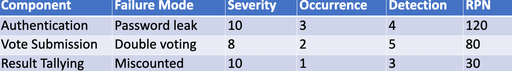
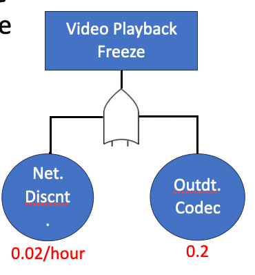
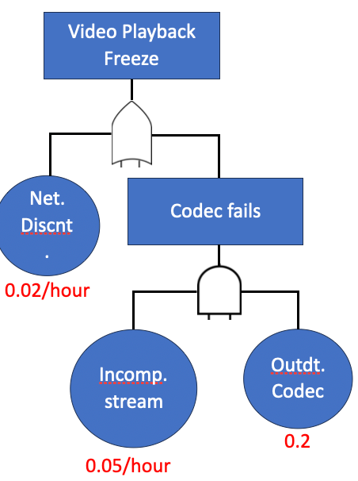

# 6 Critical Analysis Techniques in Software Engineering

## 知识图谱

```plaintext
Week 06 Critical Analysis Techniques in Software Engineering
├── 1. Critical Analysis 基础概念
│   ├── Definition
│   │   └── 系统性评估软件 artifacts 的 strengths, weaknesses, validity
│   ├── Purpose
│   │   ├── Identify defects early
│   │   ├── Improve system reliability
│   │   └── Optimize development processes
│   ├── Why Critical Analysis Matters
│   │   ├── 很多 defects 来自 requirements phase
│   │   ├── Production bug 修复成本远高于 design 阶段
│   │   └── Therac-25 事故说明软件缺陷可能造成生命安全问题
│   └── Critical Thinking vs Critical Analysis
│       ├── Critical Thinking：通用的问题分析与推理能力
│       └── Critical Analysis：面向具体软件 artifacts 的结构化评估
│
├── 2. Critical Analysis Techniques
│   ├── FMEA
│   │   └── Failure Modes and Effects Analysis
│   ├── RCA
│   │   └── Root Cause Analysis
│   ├── SWOT Analysis
│   │   └── Strengths / Weaknesses / Opportunities / Threats
│   ├── Code Review
│   │   └── Systematic examination of source code
│   └── Requirements Validation
│       └── Ensure requirements are clear, complete, and testable
│
├── 3. Regulatory Context
│   ├── Critical analysis 不只是 best practice
│   ├── Medical software
│   │   └── ISO 14971
│   └── Automotive software
│       └── ISO 26262
│
├── 4. FMEA: Failure Modes and Effects Analysis
│   ├── Nature
│   │   ├── Proactive
│   │   └── Planning tool before failure happens
│   ├── Main Purpose
│   │   ├── Identify possible failure modes
│   │   ├── Evaluate impact
│   │   └── Prioritize fixes
│   ├── Steps
│   │   ├── List system components / functions
│   │   ├── Identify potential failure modes
│   │   ├── Assess Severity, Occurrence, Detection
│   │   └── Sort by RPN
│   ├── Function Selection Criteria
│   │   ├── High severity
│   │   ├── High occurrence
│   │   └── Hard to detect
│   ├── S / O / D
│   │   ├── Severity: impact level
│   │   ├── Occurrence: likelihood / frequency
│   │   └── Detection: chance of detecting before user impact
│   ├── RPN
│   │   ├── RPN = S × O × D
│   │   ├── Higher RPN = higher priority
│   │   └── Severity 9 or 10 must be handled even if RPN is not highest
│   ├── Data Collection
│   │   ├── Severity data
│   │   │   ├── User impact analysis
│   │   │   ├── Stakeholder input
│   │   │   ├── Industry standards
│   │   │   └── Historical incident data
│   │   ├── Occurrence data
│   │   │   ├── Logs
│   │   │   ├── Testing data
│   │   │   ├── Developer estimates
│   │   │   ├── Usage patterns
│   │   │   └── Benchmarks / SLAs
│   │   └── Detection data
│   │       ├── Test coverage
│   │       ├── Monitoring systems
│   │       ├── QA processes
│   │       ├── User reports
│   │       └── Design reviews
│   └── Examples
│       ├── Game App: old phones lag
│       ├── Banking App: transfer fails if server down
│       └── Online Voting System FMEA
│
├── 5. Beyond Basic FMEA
│   ├── Quantitative FMEA
│   │   ├── Traditional RPN uses subjective 1-10 scores
│   │   ├── Advanced severity maps to downtime / revenue loss
│   │   ├── Occurrence can use MTTF / failure rate
│   │   └── Detection can use test coverage probability
│   ├── Quantitative Formula
│   │   └── RPN = S × O × (1 - D%)
│   ├── Mitigation Prioritization
│   │   ├── Cost = development effort + tooling cost
│   │   ├── Benefit = ΔRPN × impact
│   │   └── Use cost-benefit model to decide which fix first
│   └── Example
│       └── Cloud storage API upload fails under load
│
├── 6. RCA: Root Cause Analysis
│   ├── Nature
│   │   ├── Reactive
│   │   └── Detective tool after problem happens
│   ├── 5 Whys
│   │   ├── Ask why repeatedly
│   │   └── Trace surface issue to root cause
│   ├── Examples
│   │   ├── Game crash → enemies spawn too fast → loop has no limit
│   │   └── Duplicate transfer → retry button resends → no unique transaction ID
│   └── Relationship with FMEA
│       ├── FMEA: before failure, prevent risk
│       └── RCA: after failure, find root cause
│
├── 7. Advanced RCA
│   ├── Fault Tree Analysis
│   │   ├── Top-down deductive analysis
│   │   ├── Top event
│   │   ├── Intermediate event
│   │   ├── Basic event
│   │   ├── Undeveloped event
│   │   └── Logic gates
│   │       ├── OR gate
│   │       └── AND gate
│   ├── Purpose of FTA
│   │   ├── Identify weak points
│   │   ├── Calculate top event probability
│   │   ├── Prioritize redundancy and safety resources
│   │   └── Support diagnostic troubleshooting
│   ├── FTA Process
│   │   ├── Define top event
│   │   ├── Identify causes
│   │   ├── Use logic gates
│   │   ├── Break down causes further
│   │   ├── Quantify basic events
│   │   └── Analyze result
│   ├── Probability Calculation
│   │   ├── AND gate: P(A and B) = P(A) × P(B)
│   │   └── OR gate: P(A or B) = 1 - (1 - P(A)) × (1 - P(B))
│   └── Bayesian Inference
│       └── Use statistical evidence to refine guesses about root causes
│
└── 8. Tutorial / Exam Calculation Focus
    ├── Login System FMEA
    ├── File Upload Feature FMEA
    ├── Real-Time Video Streaming Quantitative FMEA
    ├── E-Commerce Order Processing FTA
    └── Cloud Backup System FTA
```

## What is Critical Analysis

- Definition: A systematic evaluation process to assess the strengths, weaknesses, and validity of software artifacts
- Purpose in Software Engineering:
  - Identify defects early
  - Improve system reliability
  - Optimize development processes
- 定义：一种系统性的评估过程，用于评估软件工件（artifacts）的优劣势与有效性
  软件工程中的目的：  
  - 早期识别缺陷  
  - 提升系统可靠性  
  - 优化开发流程

## Why Critical Analysis Matters

- Statistics:
  - 60% of software defects originate in the requirements phase (Source: General industry consensus).
  - Fixing a bug in production is 100x more expensive than in design.
- Real-world impact:
  - Therac-25 incident (1985-1987): Software flaws led to fatal radiation overdoses.
- 统计资料：
  - 60%的软件缺陷源于需求分析阶段（来源：行业普遍共识）。  
  - 修复产品环境中的缺陷成本比设计阶段高出100倍。  

- 现实影响：
  - Therac-25事件（1985-1987年）：软件缺陷导致致命性辐射剂量过量。

## Critical Thinking vs. Critical Analysis

- Critical Thinking: General problem-solving and reasoning.
- **Critical Analysis: Focused, structured evaluation of specific artifacts.**
- Overlap: 
  - Logical reasoning, skepticism.
- Difference: 
  - Critical analysis uses domain-specific tools and methods.
- **批判性思维：通用的问题解决与推理。**
- **批判性分析：对特定产物进行聚焦、结构化的评估。**
- 重叠：
  - 逻辑推理、怀疑态度。  

- 差异：
  - 批判性分析运用专门领域的工具与方法。


## Learning Objective

- Understand the role of critical analysis in software engineering.
- Learn key techniques (e.g., FMEA, Root Cause Analysis).
- Apply these techniques to real-world scenarios.
- Develop a critical mindset for software development

## Techniques and Tools for Critical Analysis

List of Techniques:

1. **Failure Modes and Effects Analysis (FMEA)**: Identifies potential failures and their impact.
2. **Root Cause Analysis (RCA)**: Traces problems back to their origin.
3. **SWOT Analysis**: Evaluates strengths, weaknesses, opportunities, threats.
4. **Code Review**: Systematic examination of source code.
5. **Requirements Validation**: Ensures requirements are clear, complete, and testable.

Regulatory Context:

- Not just "best practices" but are often **legal requirements**
  - medical software (ISO 14971)
  - automotive software (ISO 26262)

### Failure Modes and Effects Analysis (FMEA)

FMEA 是这周最重要的知识点之一。它的核心思想是：在系统真正出问题之前，先问“系统可能在哪里失败？失败后果是什么？有多严重？多常发生？能不能提前发现？”课件明确说明 FMEA 是 **proactive**，也就是预防型工具。它会列出 possible failure modes，然后用 **Severity、Occurrence、Detection** 打分，并通过 **RPN = S × O × D** 决定优先处理哪些风险。

**RPN 高的优先处理，但 Severity = 9 或 10 的风险即使 RPN 不最高也必须处理**，因为这类问题通常涉及人身安全、金钱损失或系统完整性。课件中 banking app 的 money transfer failure 就是 Severity = 10 的例子。

**FMEA** is **proactive**—it’s a planning tool to stop trouble before it starts.

FMEA lists all possible failures (failure modes) across a system, rates them **(S, O, D)**, and prioritizes fixes.

You’re building an online store. You predict that the payment system might fail (e.g., “Credit card doesn’t process”). You rate how bad that’d be and plan to add extra security.

你正在构建一个在线商店。你预见到支付系统可能会出现问题（例如“信用卡无法处理”）。你评估其严重程度并计划增加额外安全措施。

**Steps:**

1. **List components/functions of the system.**
2. **Identify potential failure modes.**
3. **Assess severity, occurrence, detection (Risk Priority Number: RPN)**
4. **After the engineers completed the list of FMEA, they sort the list by RPN to see which failures have the highest priority.**

#### Components/Function of the System

- Which functions of the system should I include?
  - Failures have **high impact** (Severity, S).
  - Failures are **likely** (Occurrence, O).
  - Failures are **hard to catch** (Detection, D).

**Steps to Identify Functions for FMEA**

- 1. Understand the System’s Purpose and Scope
- 2. Assess Criticality and Impact
- 3. Evaluate Usage and Exposure
- 4. Check Complexity and Change Frequency
- 5. Assess Detection Challenges
- 6. Leverage Historical Failures
- 7. Consider External Interfaces

#### Access Severity, Occurrence, Detection

**Overview of S, O, D**

- **Severity (S)**: How bad is the impact of the failure on the system, user, or business? (1 = minor, 10 = catastrophic)
- **Occurrence (O)**: How often does the failure happen? (1 = rare, 10 = frequent)
- **Detection (D)**: How likely are we to catch the failure before it reaches the user? (1 = always detected, 10 = undetectable)

#### Risk Priority Number

- **RPN = Severity × Occurrence × Detection**
- High RPN items require immediate attention. 
- However, critical analysis dictates that any item with a **Severity of 9 or 10** must be addressed regardless of the total RPN, as the risk to human life or total system integrity is too high to ignore.

#### Gathering Data for Severity (S)

- **User Impact Analysis**: 
  - **Source**: User stories, requirements docs, or customer support tickets.
  - **Method**: Review how the failure affects users.
- **Stakeholder Input**:
  - **Source**: Product managers, developers, or business analysts.
  - **Method**: Conduct a workshop or survey. Rate impact on a 1-10 scale based on business goals (e.g., revenue, reputation)

- **Industry Standards**:
  - **Source**: FMEA guidelines (e.g., AIAG, IEC 60812) or software risk frameworks (e.g., ISO 27001 for security).
  - **Method**: Use predefined severity tables (e.g., 10 = legal/safety violation, 5 = moderate disruption)
- **Historical Data**:
  - **Source**: Incident reports, post-mortems, or bug trackers (e.g., Jira).
  - **Method**: Analyze past failures’ impact.

#### Gathering Data for Occurrence (O)

- **Log Analysis**:
  - **Source**: System logs, error tracking (e.g., Sentry, New Relic).
  - **Method**: Count failure instances over time (e.g., failures/hour)
- **Testing Data**:
  - **Source**: Unit, integration, or load test results.
  - **Method**: Run tests to simulate conditions
- **Developer Estimates**:
  - **Source**: Software engineers or architects.
  - **Method**: Brainstorm likelihood based on code complexity or past bugs

- **Usage Patterns**:
  - **Source**: Analytics (e.g., Google Analytics, server metrics).
  - **Method**: Correlate failures with user activity (e.g., peak load spikes)
- **Benchmarks**:
  - **Source**: Industry data or vendor SLAs (e.g., AWS uptime stats).
  - **Method**: Use typical failure rates (e.g., network drops = 0.01/hour)

#### Gathering Data for Detection (D)

- **Test Coverage**:
  - **Source**: Test reports (e.g., unit test coverage from tools like JaCoCo, pytest).
  - **Method**: Measure % of code tested.
- **Monitoring Systems**:
  - **Source**: Logs, alerts (e.g., Prometheus, Datadog).
  - **Method**: Check if failures trigger alerts
- **QA Processes**:
  - **Source**: Development lifecycle (e.g., code reviews, static analysis).
  - **Method**: Assess controls’ strength

- **User Reports**:
  - **Source**: Support tickets, bug reports.
  - **Method**: If users catch it first, D is high.
- **Design Reviews**:
  - **Source**: Architecture docs, peer reviews.
  - **Method**: Evaluate built-in checks

### Example 1: Game App

- **Requirements FMEA**:
  - Function: Run the game on all phones.
  - Failure Mode: “Game lags on old phones.” 
  - RPN
    - Severity: 8 (players quit)
    - Occurrence: 4 (many old phones)
    - Detection: 3 (easy to test)
    - RPN = 96. 
  - Fix: Optimize graphics.

### Example 2: Banking App

- **Design FMEA**:
  - Function: Transferring money to another account
  - Failure Mode: “Transfer fails if server’s down.” 
  - RPN
    - Severity: 10 (money lost)
    - Occurrence: 2 (rare)
    - Detection: 5 (hard to catch)
    - RPN = 100. 
  - Fix: Add offline queue.

### Exercise

- **Task**: Perform an FMEA on an Online Voting System
- Components: User authentication, vote submission, result tallying.
- Steps:
  - Identify 3 failure modes.
  - Assign Severity (1-10), Occurrence (1-10), Detection (1-10).
  - Calculate RPN (Severity × Occurrence × Detection).



### Beyong Basic FMEA

- Recap: 
  - FMEA identifies failure modes, assesses risks via RPN (Severity × Occurrence × Detection).
- Advanced Focus:
  - **Quantitative RPN**: Use probabilistic models (e.g., failure rates, MTTF).
  - **Mitigation Prioritization**: Optimize resource allocation using cost-benefit analysis.

## Quantitive FMEA

基础 FMEA 使用 1-10 的主观评分，但 advanced FMEA 更强调用数据支持判断。课件中提到，Severity 可以映射为 downtime 或 revenue loss，Occurrence 可以来自 historical data 或 MTTF，Detection 可以来自 test coverage probability。Quantitative FMEA 的一个公式是：**RPN = S × O × (1 - D%)**

其中 D% 表示 detection probability。例如 test coverage = 90%，说明 failure 被检测到的概率很高，那么未被发现的风险就是 10%。课件中的 cloud storage API 例子中，MTTF = 1000 hours，failure rate = 1/1000 = 0.001/hour，test coverage = 90%，最后 RPN = 8 × 2 × 1 = 16，并建议加入 autoscaling。

这个部分比普通 FMEA 更容易出计算题，因此你需要熟悉：

- **Failure rate = 1 / MTTF**
- **Detection risk = 1 - detection probability**
- **RPN = S × O × D**

------

- Traditional RPN: 
  - Subjective (1-10 scales).
- Advanced:
  - Severity: Map to metrics (e.g., % downtime, revenue loss).
  - Occurrence: Use historical data or MTTF (Mean Time To Failure).
  - Detection: Probability of test coverage (e.g., 80% coverage = Detection 2).
- Formula: **RPN = S × O × (1 - D%), where D% is detection probability**.

### Mitigation prioritization

- Cost-Benefit Model:
  - Cost = Development effort (hours) + Tooling cost.
  - Benefit = Risk reduction (ΔRPN × Impact).
- Example: 
  - Fix “DB crash” (RPN 200, $10K loss) with 50-hour effort ($5K).
  - ΔRPN = 150, Benefit = 150 × $10K = $1.5M, ROI = High.

### Exercise

- FMEA with **Quantitative RPN**
- **Task**: Analyze a cloud storage API
  - Failure Mode: “Upload fails under load.”
  - Data: 
    - MTTF = 1000 hours
    - Downtime = $5K/hour
    - Test Coverage = 90%.
  - Calculate RPN, suggest mitigation.

#### Answer

- **Failure Mode**: Upload fails under load.
- **Metrics**:
  - Severity: $5K/hour × 1-hour outage = $5K impact → 8 (high but not catastrophic).
  - Occurrence: MTTF = 1000 hours → Failure rate = 1/1000 = 0.001/hour → 2 (rare).
  - Detection: 90% coverage → D% = 0.9 → (1 - 0.9) = 0.1 → 1 (very detectable).
  - **RPN**: S x O x D = 8 × 2 × 1 = 16.
- **Mitigation**: Add autoscaling to handle load spikes.

## Root Cause Analysis (RCA)

RCA 和 FMEA 的最大区别是时间点不同。**FMEA 是 before failure，RCA 是 after failure**。课件中说 RCA 是 reactive，是 failure 发生后的 detective tool。典型方法是 **5 Whys**：不断追问 “Why?”，直到找到真正 root cause。

考试中如果问 “Use RCA to analyze a system failure”，你不能只写表面问题，比如 “server overload”。你要继续追问，找到更深层原因，比如 “no load testing / no auto-scaling / poor capacity planning”。

- **RCA** is reactive—it’s a detective tool to fix trouble after it happens.
- The online store launches, and payments crash. You ask “Why?”—turns out the server couldn’t handle 1,000 users because no one tested it under load.

- Method: 
  - 5 Whys 
    - Problem: System crashes during peak load.
  - Why? → Server overload. Why? → Insufficient scaling. Why? → No load testing. (etc.)

### Example 1: game App (Space Shooter)

- **Coding RCA**:
  - Problem: Game crashes. Why? Enemies spawn too fast. Why? Loop has no limit. 
  - Root cause: Missing cap on spawn rate. 
  - Fix: Add a limit.

### Example 2: Banking App

- **Testing RCA**:
  - Problem: Transfers duplicate. Why? Retry button resends. Why? No unique ID check. 
  - Root cause: Missing transaction ID. 
  - Fix: Add IDs.

### Advanced RCA

- Basic RCA digs to root causes with 5 Whys
- In this section: 
  - **Fault Tree Analysis (FTA)**: Logic trees with probabilities.
  - **Bayesian Inference**: Stats to refine guesses.

## Fault Tree Analysis

它是 **top-down deductive approach**，从一个 top event 开始，例如 “checkout fails”，然后向下拆分导致它发生的 causes、sub-causes 和 conditions。课件中说明 FTA 的 purpose 包括 **identifying weak points、quantitative reliability assessment、prioritizing safety/resources 和 diagnostic troubleshooting**。

- **FTA is top-down, deductive** approach to identify and analyze the causes of a specific system failure, called the “top event.”
- The top event (e.g., “checkout fail”) is the root at the top, and the branches below are all the possible causes, sub-causes, and conditions that could lead to it. 
- It’s **visual, logical, and systematic**

- **Purpose**
  - **Identifying Weak Points:** By visualizing how individual component failures propagate through a system, FTA helps engineers pinpoint "Single Point Failures".
  - **Quantitative Reliability Assessment:** FTA allows for the calculation of the probability of the Top Event occurring.
  - **Prioritizing Safety and Resources:** It provides a clear roadmap for where to invest in redundancy.
  - **Diagnostic Troubleshooting:** Once a failure has actually occurred, the Fault Tree serves as a diagnostic tool by checking the states of components identified in the tree.
  - 识别弱点：通过可视化单个组件故障如何在系统中传播，故障树分析（FTA）帮助工程师精准定位"单点故障"。  
  - 定量可靠性评估：FTA能够计算顶事件的发生概率。  
  - 安全与资源配置优先：它为需投入冗余设计的关键环节提供了清晰的路线图。  
  - 诊断性故障排查：当实际故障发生时，可通过检查故障树中标识的组件状态，将其用作诊断工具。

### How does FTA Works?

- Define the Top Event
- Identify Causes
- Use Logic Gates
- Break Down Further
- Quantify
- Analyze

### Elements of FTA diagram

- Events
  - Top event
  - Intermediate event
  - Basic event
  - Undeveloped event
- Logic Gates
  - AND
    - 只有所有子事件都发生，父事件才发生。
    - P(A AND B) = P(A) × P(B)
  - OR
    - 任意一个子事件发生，父事件就发生。
    - P(A OR B) = 1 - (1 - P(A)) × (1 - P(B))

## Identifying and Quantifying the Causes 识别并量化成因

- **Identifying the causes**
  - **Design/Systems Engineers:** Identify how hardware or software components interact. Determine which component failures could lead to the Top Event.
  - **Operations & Maintenance Teams:** The first responders. They provide "ground truth" on how the equipment was actually behaving versus how it was designed to behave.

- **Quantifying the causes**
  - **Reliability Engineers:** They use historical data, manufacturer specifications, and "Mean Time Between Failures" (MTBF) to assign hard numbers to the basic events.
  - **Safety/Risk Management (HSE):** In high-risk industries (like oil and gas or aviation), these departments are responsible for ensuring the quantified risk meets regulatory standards.
  - **Data Scientists:** In modern software environments, data analysts might quantify causes by looking at error rates in logs or telemetry data across millions of user sessions.

### Calculate Failure Probabilities

注意 OR gate 不能直接简单相加，因为如果 A 和 B 同时发生，直接相加会 double-count overlap。课件专门解释了为什么 0.01 + 0.02 不等于更准确的 0.0298。

- p(Server offline) = 0.01/hour
- p(Auth failed) = 0.02/hour
- p(Too many transactions) = 0.05/hour
- p(No lock timeout) = 0.1
- p(No validation) = 0.03


- p(Payment Gateway failed) = p(Server offline) OR p(Auth failed)

  - = 1 – (1 – 0.01 * 1 – 0.02)

    = 1 – (0.99 * 0.98)

    = 0.0298/hour

- p(DB locks) = p(Too many transactions) AND p(No lock timeout)

  - = 0.05 * 0.01

    = 0.005/hour

- p(Input crash) = p(No input validation) OR (undeveloped event)

  - = 0.03

- p(Checkout fails) = 1 – (1 – 0.0298) * (1 – 0.005) * (1 – 0.03)

  - = 1 – (0.9702 * 0.995 * 0.97)

    = 1 – 0.9364 = 0.0636/hour (We explore further in the later section)

### Calculation Details

- p(Payment Gateway failed) = p(Server offline) OR p(Auth failed)

  - = 1 – (1 – 0.01 * 1 – 0.02)

    = 1 – (0.99 * 0.98)

    = 0.0298

- Why not 0.01 + 0.02 = 0.03, instead 0.0298?

- p(Payment Gateway failed) = p(Server offline) OR p(Auth failed)


- OR gate represent **at least one** of its causes occurs
  - ”server offline” or 
  - “auth failed” or 
  - Both
- The formula 0.01 + 0.02 adding directly overestimates because it double-counts the tiny overlap when *both* fail.


- To calculate the probability that **at least one** event occurs. A handy way to calculate this is:
  - First, find the probability that **neither event occurs** (both don’t fail).
  - Then, subtract that from 1 to get the probability that **at least one fails**.
- Step 1: 
  - Server offline NEVER occur = 1 – 0.01
  - Auth failed NEVER occur = 1 – 0.02
  - Neither event occurs = 1 – 0.01 * 1 – 0.02
- Step 2: 
  - 1 – (1 – 0.01 * 1 – 0.02)


### Exercise: login Failure

- **Scenario**: Users can’t log into a banking app.
- Task:
  - Build a fault tree:
    - Top Event: “Login fails.”
    - Causes: 
      - “Login fails” if either “DB down” or “Auth error”
      - “DB down” if either “Power outage” [0.01/hour] or “DB crash” [0.02/hour] 
      - “Auth error” if both “Bad credentials” [0.04/hour] and “No retry” [0.5]
  - Calculate the probability.

Answer:

```plaintext
Top Event: Login fails
├── OR: DB down
│   ├── Power outage [0.01/hour]
│   └── DB crash [0.02/hour]
│
└── OR: Auth error
    └── AND
        ├── Bad credentials [0.04/hour]
        └── No retry [0.5]
```

Fault Tree:

- Login fails = DB down OR Auth error

- DB down = Power outage OR DB crash

- Auth error = Bad credentials AND No retry

- P(DB down) = 1 - (1 - 0.01) * (1 - 0.02) = 0.0298/hour

- P(Auth error) = 0.04 × 0.5 = 0.02/hour

- P(Login fails) = 1 - (1 - 0.0298) * (1 - 0.02) = 1 - 0.9702 × 0.98 = 0.049204/hour ≈ 0.049/hour

Therefore, the **probability** of login failure is approximately 4.92% per hour.

记住，probability 和 MTTF 的结果是不一样的。Probability 最后就是上面的结果，如果要计算 MMTF 的话需要用 1 除以 probability。

**MTTP** = 1/0.0492 = 20.32 hours 这意味着平均每 20.32 个小时出一次故障。

## Dynamic and Static Nature

- p(Server offline) = 0.01/hour
- p(Auth failed) = 0.02/hour
- p(Too many transactions) = 0.05/hour
- p(No lock timeout) = 0.1
- p(No validation) = 0.03

- **Per Hour**: “Gateway server offline” (0.01/hour), “API authentication error” (0.02/hour), “Too many transactions” (0.05/hour).
- **No Time Unit**: “No lock timeout set” (0.1), “No input validation” (0.03).

### Dynamic nature of Probability

- Probabilities specified as **per hour** (e.g., 0.01/hour) are **failure rates**—they describe how often an event happens over time. These are typically used for:
  
  以每小时为单位指定的概率（如0.01/小时）是故障率——它们描述了事件随时间发生的频率。这类指标通常用于：

  - **Dynamic Events**: Things that occur randomly or intermittently, like hardware failures, network drops, or load spikes.
  
    **动态事件**：随机或间歇性发生的事件，如硬件故障、网络中断或负载突增。
  
  - **Time-Based Systems**: When we’re analyzing a system’s behavior over a period (e.g., an hour of checkout activity).
  
    **基于时间的系统**：当我们分析系统在一段时间内的行为时（例如一小时的结账活动）。
  
- In FTA, failure rates are tied to **Mean Time To Failure (MTTF)**

- Example: “Gateway server offline” = 0.01/hour → MTTF = 1 / 0.01 = 100 hours. It fails once every 100 hours on average.

  示例：“网关服务器离线” 的费用为 0.01 美元/小时 → 平均故障间隔时间（MTTF）= 1 / 0.01 = 100 小时。这意味着平均每 100 小时发生一次故障。

- In software, “per hour” often comes from:
  - **Logs**: Historical data (e.g., “Server crashed 5 times in 500 hours” → 0.01/hour).
  - **Metrics**: Monitoring (e.g., “Traffic spikes 50 times in 1,000 hours” → 0.05/hour).
  - **Vendor Specs**: Hardware or service uptime stats (e.g., 99.9% uptime → 0.001/hour downtime).

### Static Nature of Probability

- Probabilities without a time unit are **static probabilities**—they’re not rates but single, dimensionless chances. These apply to:
  
  无时间单位的概率是静态概率——它们并非比率，而是无量纲的单一可能性。这类概率适用于：

  - **Constant Conditions**: Design flaws, configuration errors, or missing features that don’t “happen” over time—they just *exist*.
  
    恒定条件：设计缺陷、配置错误或功能缺失——它们并非随时间推移而“发生”，而是直接存在。
  
  - **State-Based Events**: The likelihood something is true at any given moment, not how often it occurs.
  
    基于状态的事件：事物在任意给定时刻的真实性概率，而非其发生频率。
  
- “No Lock Timeout” - 10% chance the system lacks a timeout mechanism (e.g., a design oversight present in 10% of deployments)

  “无锁定超时” 有10%的概率表明系统缺少超时机制（例如，10%的部署中存在设计疏忽）。

- “No validation” - 3% chance the code lacks validation—maybe from a rushed feature or untested module.

  “无验证”有3%的概率代码缺乏验证——或许源于仓促上线的功能或未经测试的模块。

- In software, these come from:
  - **Code Reviews**: “3% of commits skip validation”
  - **Design Audits**: “10% of configs miss timeouts”
  - **Assumptions**: Rough estimates when data is scarce.

### Mixed Nature of Probability

- Does it impact the previous calculation?
  - p(Checkout fails) = 1 - (1 - 0.0298) * (1-0.005) * (1-0.03)
  
- The standard OR gate formula—**P = 1 - (1 - P1) × (1 - P2)**—assumes all probabilities are comparable

- 0.0298 and 0.005 are time-based, while 0.03 is non time-based

  0.0298和0.005是基于时间的，而0.03则是不基于时间的。

### Example: Video Streaming App Freezes

- **Network disconnect**: A time-based failure rate of 0.02/hour (2% chance per hour the network drops, based on ISP stats).

  网络断连：基于互联网服务提供商的统计数据，时基故障率为0.02次/小时（每小时网络中断的概率为2%）。

- **Outdated codec**: A non-time-based probability of 0.1 (10% chance the app uses an outdated codec, from version audits).

  过时的编解码器：非时间基概率为0.1（基于版本审计，应用有10%的概率使用过时的编解码器）。



### Approach 1: Convert Static to Time-Based

- If 10% of instances have an outdated codec, suppose it triggers a freeze 10% of the time under load.

- **Assumption**: Let’s set it as 0.1/hour—10% chance per hour the codec fails to decode, freezing playback.

- p(Video playback freeze) = p(Network disconnected) OR p(Outdated codec)

  - = 1 – [(1 – 0.02) * (1 – 0.1)]

    = 1 – (0.98 * 0.9)

    = 1 – 0.882

    = 0.118/hour (MTTF 1/0.118 = 8.47 hours)

### Approach 2: Treat Static as Conditional

- Approach 1 forced “Outdated codec” (0.1) into a rate (0.1/hour), assuming it independently causes freezes 10% of hours. 
- But 0.1 originally meant “10% chance the codec is outdated”—a design flaw, not a failure frequency. 
- In software, static conditions like this often need a trigger to cause failure.
  - **Static Probability**: 0.1 is the chance the system has an outdated codec.
  - **Trigger Needed**: It only freezes playback when paired with an event (e.g., playing an incompatible stream).

- “Outdated codec” as a condition suggests it’s not an independent hourly failure.
- Approach 2: 
  - **Network Disconnect**: 0.02/hour
  - **Codec Failure**:
    - **Incompatible Stream**: 0.05/hour (hypothetical rate).
    - **Outdated Codec**: 0.1 (10% chance the app has an old codec).
  - p(Video playback freeze) = 0.025/hour
    - MTTF = 1 / 0.025 = 40 hours



### Refine "Checkout Failure" Example

- Since “malicious attack” is an undeveloped event, we ignore it for simplicity.

- Treat static probability for ”No validation” event as conditional.

- What will you get?

### Exercise: Real-Time Chat App Disconnect

- **Scenario:** You’re analyzing a real-time chat app where the top event is **“User disconnects unexpectedly”**—a critical failure that disrupts conversations. The system has multiple failure points, and the fault tree includes a top-level OR gate with both time-based and static probabilities
- The causes identify:
  - **Network Drop**: 0.03/hour
  - **Server Crash**: “Server overload”: 0.04/hour and “No retry logic”: 0.2
  - **Client Bug**: “Bug in client code”: 0.02/hour or “No client update”: 0.1
- **Task**
  - Build the fault tree
  - Calculate the probability per hour of “User disconnects unexpectedly”

Answer：

```plaintext
Top Event: User disconnects unexpectedly
├── OR: Network Drop [0.03/hour]
│
├── OR: Server Crash
│   └── AND
│       ├── Server overload [0.04/hour]
│       └── No retry logic [0.2]
│
└── OR: Client Bug
    └── OR
        ├── Bug in client code [0.02/hour]
        └── No client update [0.1]
```

- 计算 Server Crash

  - Server overload AND No retry logic
  - P(Server Crash) = P(Server overload) × P(No retry logic) = 0.04 × 0.2 = 0.008/hour
  - P(Server Crash) = 0.008/hour

- 计算 Client Bug

  - Bug in client code OR No client update
  - P(Client Bug)
    = 1 - (1 - P(Bug in client code)) × (1 - P(No client update))
    = 1 - (1 - 0.02) × (1 - 0.1)
    = 1 - 0.98 × 0.9
    = 1 - 0.882
    = 0.118/hour
  - P(Client Bug) = 0.118/hour

- 计算 Top Event

  - User disconnects unexpectedly = Network Drop OR Server Crash OR Client Bug

  - P(User disconnects unexpectedly)
    = 1 - (1 - P(Network Drop))
          × (1 - P(Server Crash))
          × (1 - P(Client Bug))

  - = 1 - (1 - 0.03) × (1 - 0.008) × (1 - 0.118)

    = 1 - 0.97 × 0.992 × 0.882

    = 1 - 0.84869568

    = 0.15130432/hour

  - P(User disconnects unexpectedly)
    = 0.15130432/hour
    ≈ 0.151/hour
    ≈ 15.13% per hour
  - MTTF = 1 / 0.15130432 ≈ 6.61 hours

## Bridging RCA with FMEA

- Bridging **Root Cause Analysis (RCA)** and **Failure Modes and Effects Analysis (FMEA)** is the process of turning a **reactive** lesson into a **proactive** defense
- RCA identifies the "Unknown”
  - When a system fails in production (e.g., a database deadlock that wasn't predicted), you perform an **RCA**.
  - **RCA Output:** You discover a specific, real-world cause (e.g., "The microservice timeout was set shorter than the database retry limit").
- Updating the FMEA Document
  - To "bridge" them, you take the findings from the RCA and manually insert them into your **FMEA** table. 
- 连接根因分析（RCA）与失效模式与影响分析（FMEA），是将被动教训转化为主动防御的过程。

- 根因分析识别的“未知”
  - 当系统在生产环境中出现故障（例如，发生无法预料的数据库死锁），执行根因分析。
    根因分析结果： 发现具体真实的根源（例如：微服务超时设置短于数据库重试限制）。
- 更新 FMEA 文档
  - 若需实现两者的“连接”，可提取根因分析结论中的发现，手动将其录入至FMEA 表格中。

## FMEA 与 RCA

**FMEA 主要是计算 RPN，用来做“事前预防”。**

FMEA 的重点是：

```
Failure Mode → Effect → Cause → S/O/D → RPN → Mitigation
```

也就是先找出系统可能怎么失败，然后给每个 failure mode 打分：

```
RPN = Severity × Occurrence × Detection
```

所以 FMEA 的考试重点通常是：

```
1. 找 failure modes
2. 写 effect 和 cause
3. 给 S/O/D 打分
4. 算 RPN
5. 根据 RPN 决定优先修复项
```

------

**RCA 不一定主要是计算 probability 和 MTTF。RCA 的核心是“事后找 root cause”。**

RCA 的基础形式是 **5 Whys**，主要是追问问题为什么发生，例如：

```
Problem: Login fails
Why? Auth service unavailable
Why? Server overloaded
Why? No autoscaling
Why? Load testing was not performed
Root cause: Missing load testing and autoscaling design
```

所以 RCA 本身的重点是：

```
Problem → Why → Why → Why → Root Cause → Fix
```

------

更准确地说：

**FTA 是 Advanced RCA 的一种方法，FTA 才经常计算 probability 和 MTTF。**

在 Week 06 里，RCA 后面扩展到了 **Fault Tree Analysis, FTA**。FTA 会用 AND / OR gate 分析 top event 的发生概率。

例如：

```
Top Event = Cause A OR Cause B
P = 1 - (1 - P(A))(1 - P(B))
```

如果算出每小时 failure probability，还可以进一步算：

```
MTTF = 1 / failure rate
```

------

所以你可以这样总结：

```
FMEA:
事前预防型分析
主要计算 RPN
用于决定哪些潜在 failure mode 要优先修复

RCA:
事后根因分析
主要找 root cause
常用方法是 5 Whys

FTA:
RCA 的高级方法
主要构建 fault tree
可以计算 top event probability 和 MTTF
```

考试时最好不要直接写 “RCA 主要是计算 probability 和 MTTF”。更准确的表达是：

**RCA 主要用于找 root cause；如果使用 FTA 这种 advanced RCA technique，就会进一步计算 probability 和 MTTF。**