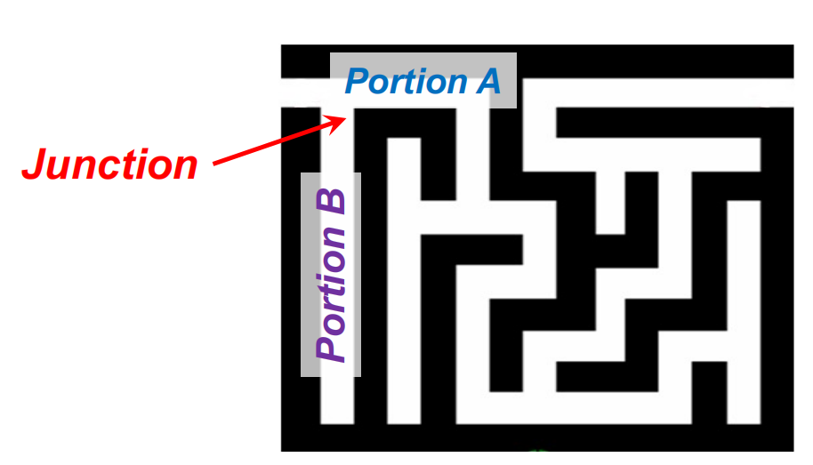
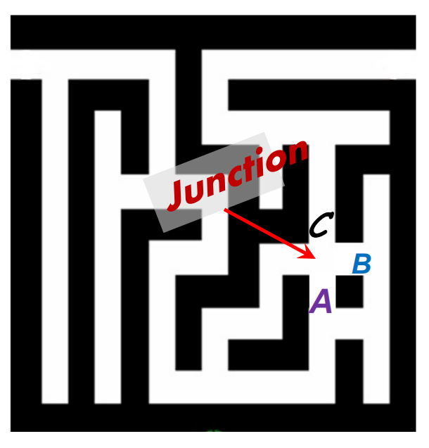
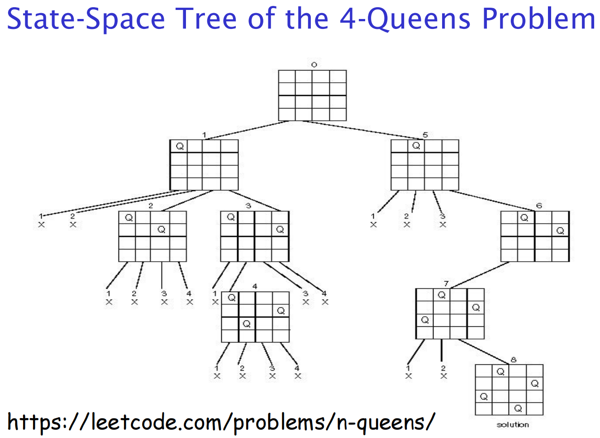
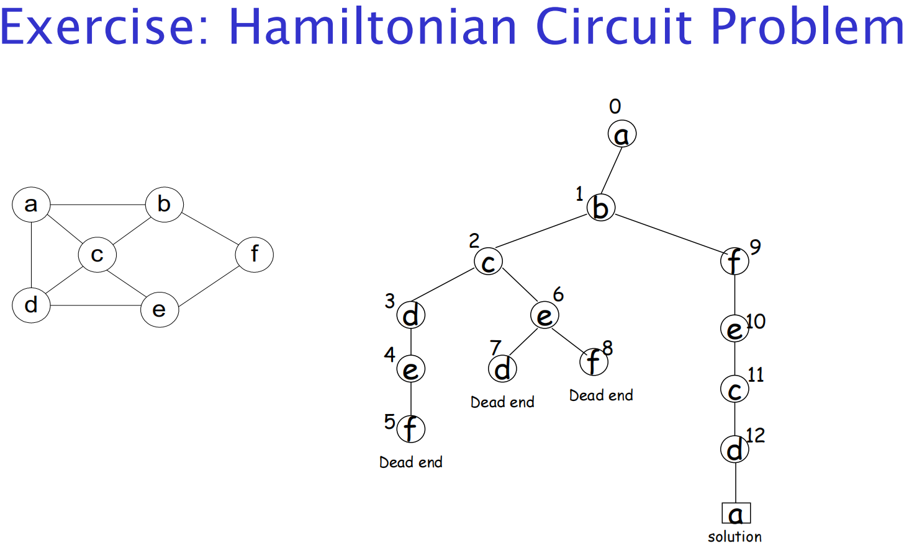
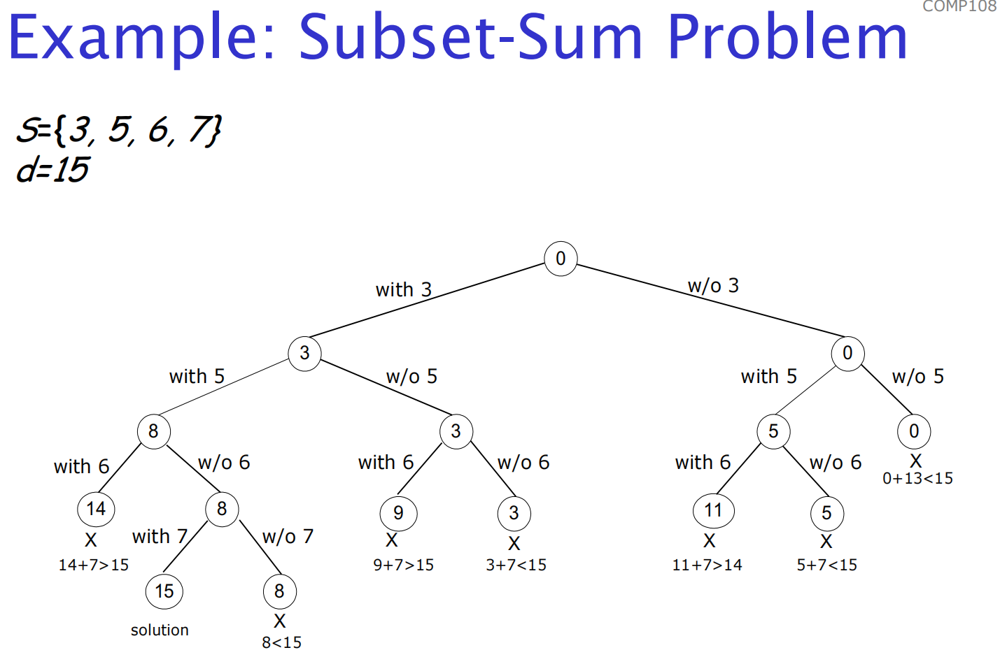
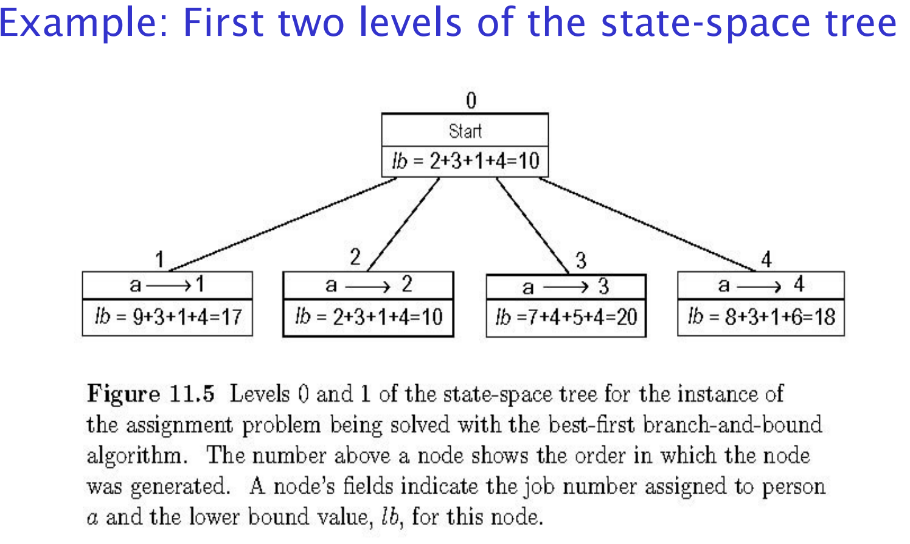
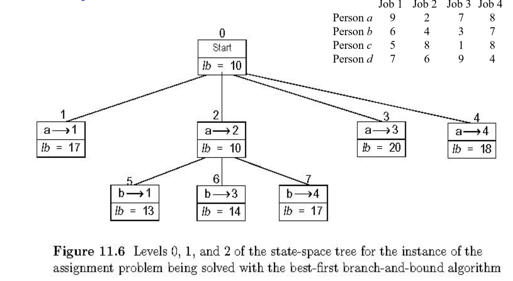
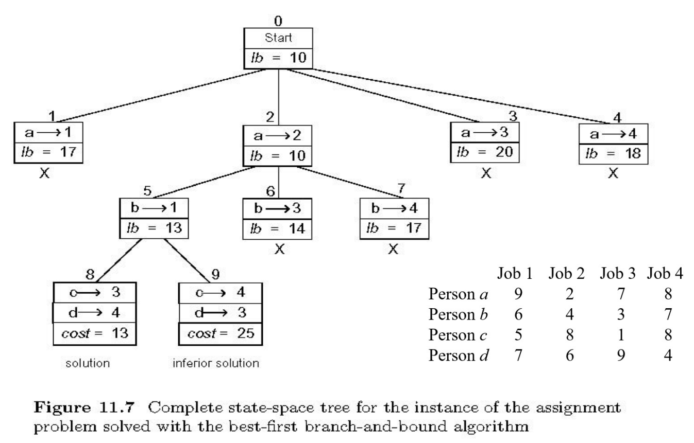

# 11 回溯

解决NP-hard问题有两种主要解决方案

1. 求解精确解，但不一定能在多项式时间内得解（“提交结果：超出时间限制”）
2. 在多项式时间内，求近似解(sub-optimal)

## Exact Solution Strategy 精确解决策略

- *exhaustive search* (brute force) 暴力求解

  - useful only for small instances

- *backtracking* 回溯

  - eliminates some unnecessary cases from consideration

    从考虑中消除一些不必要的情况

  - yields solutions in reasonable time for many instances but worst case is still exponential

    在许多情况下，在合理的时间内产生解决方案，但最坏的情况仍然是指数级的

- *branch-and-bound* 剪枝

  - further refines the backtracking idea for optimization problems

    进一步细化了优化问题的回溯思想

- *dynamic programming* 动态规划

  - applicable to some problems (e.g., the knapsack problem)

    适用于某些问题(如背包问题)

## Algorithm Design Techniques 算法设计

- Greedy 贪心

  - Shortest path, minimum spanning tree, …

    最短路径，最小生成树，…

- Divide and Conquer 分治策略

  - Divide the problem into smaller subproblems, solve them, and combine into the overall solution

    将问题划分为更小的子问题，解决它们，并组合成整体解决方案

  - Often done recursively

    通常是递归完成的

  - Quick sort, merge sort are great examples

    快速排序，归并排序都是很好的例子

- Dynamic Programming 动态规划

  - Brute force through all possible solutions, storing solutions to subproblems to avoid repeat computation

    蛮力通过所有可能的解决方案，存储解决方案的子问题，以避免重复计算

- **Backtracking 回溯**

  - A clever form of exhaustive search

    穷举搜索的一种聪明形式

  - Construct the *state-space tree* 创建状态空间树

    - 二叉树的节点记录的是值，状态空间树的节点记录的是当前待定解，一般来说精确解就在叶子节点中，算法整体就是对这颗树的DFS。回溯就是找到一个叶子节点后继续DFS，寻找其他叶子，直到找到一个精确解或者全部叶子都找完。
    - nodes: partial solutions. 节点：部分解决方案
    - edges: choices in extending partial solutions. 边缘：扩展部分解决方案的选择

  - Explore the state space tree using depth-first search 使用深度优先搜索探索状态空间树

  - “Prune” *nonpromising nodes* 剪枝（非错误节点）

    - DFS stops exploring subtrees rooted at nodes that cannot lead to a solution and backtracks to such a node’s parent to continue the search

      执行DFS，如果发现当前节点的子树不可能到达最优解，直接舍弃当前树枝，返回当前节点上一个节点继续DFS。

创建状态空间树（state space tree），二叉树的节点记录的是值，状态空间树的节点记录的是当前待定解，一般来说精确解就在叶子节点中，算法整体就是对这颗树的DFS。

### Backtracking: Idea

Backtracking is a technique used to solve problems with a  large search space, by systematically trying and eliminating  possibilities.

回溯是一种用于解决大搜索空间问题的技术，通过系统地尝试和消除可能性。

一个比较标准的回溯的例子就是走迷宫，在一些时候可能会遇到需要选择迷宫中的哪一条岔路口前进

One strategy would be to try going  through Portion A of the maze.  If you get stuck before you find  your way out, then you *"backtrack"* to the junction.

一种策略是尝试通过迷宫的A部分。如果你在找到出路之前被困住了，那么你就“backtrack(回溯)”回到路口。

At this point in time you know that  Portion A will *NOT* lead you out of the maze,  so you then start searching in Portion B

此时你知道A部分不会带你走出迷宫，所以你开始搜索B部分

Clearly, at a single junction you could have even more than 2  choices. 

显然，在一个路口，你可能有两个以上的选择。

The backtracking strategy says to try each choice, one after the other, 

回溯策略是，一个接一个地尝试每个选择，

- if you ever get stuck,  *"backtrack"* to the junction and try the next choice. 

  如果你被困住了，“回溯”到十字路口，尝试下一个选择。

If you try all choices and never found a way out, then there IS no solution to the maze

如果你尝试了所有的选择，却从未找到出路，那么这个迷宫就无解了

### n-Queens Problem n个皇后问题

国际象棋中，将n个皇后放到一个n x n方格中，使每行每列每对角线上只有一个皇后。通过剪枝（不满足条件）回溯可以DFS所有排列方式，找到符合条件的。

### Hamiltonian Circuit 哈密顿电路

对于给定的连接图像，要求一笔画形成一个回路

通过剪枝（重复走过某一结点）回溯可以DFS所有笔画的方式，直到符合一笔画的条件

### Subset-Sum Problem N数之和问题

给定一非负数组和数字t，从数组中选择若干个数字，使其总和为该特定数字t
剪枝（当前选择的数字之和大于t）回溯DFS所有选择，直到总和等于该特定数字。

### Comments on Backtracking 关于回溯的评论

Typically, backtrack is applied to difficult combinatorial problems for which no efficient algorithms for finding exact solutions possibly exist.

通常，回溯法应用于难以找到精确解的有效算法的组合问题。

Unlike exhaustive search approach, which is doomed to be extremely slow for all instances of a problem, backtrack at least holds a hope for solving some instances of nontrivial size in an acceptable amount of time. 

与穷举搜索方法不同的是，穷举搜索方法对于一个问题的所有实例来说都注定是极其缓慢的，回溯至少有希望在可接受的时间内解决一些非平凡大小的实例。

## Branch-and-Bound分支定界

An enhancement of backtracking 增强了回溯功能

Applicable to optimization problems 适用于优化问题

For each node (partial solution) of a state-space tree, computes a bound on the value of the objective function for all descendants of the node (extensions of the partial solution)

对于状态空间树的每个节点(部分解)，计算该节点的所有后代(部分解的扩展)的目标函数值的界。

Uses the bound for:

- ruling out certain nodes as “nonpromising” to prune the tree – if a node’s bound is not better than the best solution seen so far

  排除某些节点，因为它们“没有希望”修剪树——如果一个节点的边界不优于迄今为止看到的最佳解决方案

- guiding the search through state-space

  引导通过状态空间的搜索

### Assignment Problem 指派问题

在代价矩阵(**cost matrix**)C的每一行中选择一个元素，使:

- 没有两个被选中的元素在同一列中
- 总和被最小化

**Lower bound: Any solution to this problem will have total cost at least: 2 + 3 + 1 + 4 (taking smallest value from row) (or 5 + 2 + 1 + 4, taking smallest value from column)**

**下限：此问题的任何解决方案的总成本至少为：2 + 3 + 1 + 4（取行中最小值）（或 5 + 2 + 1 + 4，取列中最小值）**。

该算法有个剪枝策略，需要记录各个节点的下限，如果有节点下限高于现存最优解，则舍弃那个节点。

各个节点的下限计算方式为：

1. 忽略已被分配的job那列，忽略已被分配的人那行
2. 在剩下的工资表中，把每个人最低工资累加到下限值中
3. 下限值再加上已被分配确定的那几个人的工资。

算法：
DPS状态空间树，剪枝：删除下限值高于现存最优解的节点及其子节点找到叶子节点后，如果叶子节点的下限值低于现存最优解，则更新最优解。

1. 可以看出来寻找第一个叶子节点的过程中，优先走下限值低的枝干，这样可以减去尽可能多的枝
2. 在下面的旅行商问题中，旅行商走过的路径看上去是个圆环，也就是说顺时针走和逆时针走的距离一样，只是方向不同。通过规定某两个点间的先后顺序可以减少一半的讨论

### Traveling Salesman Problem

给定一无向图，要求算出旅行商从一点出发尽可能短地走过所有节点然后回到起点的走法。依旧是剪枝，下限计算：

1. 把已走过的边标记为必选的。
2. 在邻接表中，每行选取两个值的平均数累加到下限值中，如果有被标记为必选的，则必选那个值，再选出尽可能小的数。下限值再加上已走过的边的值。
3. 每次在状态空间树中选择下限值最低的节点或多个下限值最低相等的节点，进入它的子树进行DFS选择如何走剩下几座城市，剪掉其他下限值较高的节点。

By requiring *b* before *C, we can reduce space* *by half*

通过在*C之前要求*b，我们可以将空间减少一半
