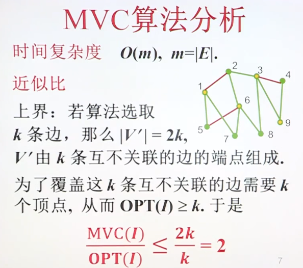
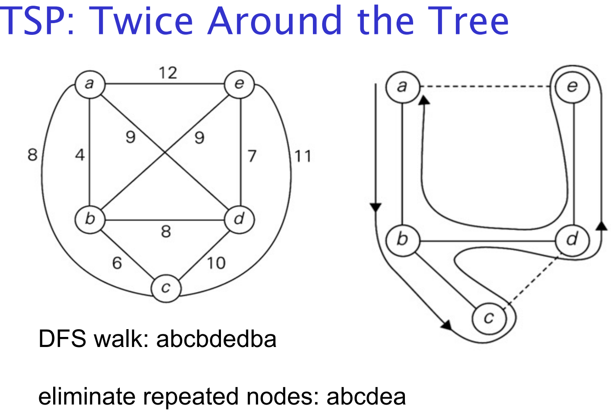

# Travelling Sales Person Problem 旅行商问题

## Coping With NP-Hardness 应对NP-hardness

**Brute-force algorithms.**

- Develop clever enumeration strategies.

- Guaranteed to find optimal solution.

- No guarantees on running time.

**暴力算法**

- 开发巧妙的枚举策略

- 保证找到最优解。

- 不保证运行时间。

**Heuristics 探索法**

- Develop intuitive algorithms.

  开发直观的算法。

- Guaranteed to run in polynomial time.

  保证在多项式时间内运行。

- No guarantees on quality of solution

  不保证解决方案的质量

**Approximation algorithms.**

- Guaranteed to run in polynomial time.

  保证在多项式时间内运行。

- Guaranteed to find "high quality" solution, say within 1% of optimum.

  保证找到“高质量”的解决方案，比如在最优的1%以内。

Obstacle: need to prove a solution’s value is close to optimum, without even knowing what optimum value is!

障碍:需要证明解决方案的值接近最优，甚至不知道最优值是什么!

## Heuristics 探索法

A heuristic is a common-sense **rule** drawn from experience

启发式是从经验中得出的常识性规则

- not a mathematically proven assertion

  不是一个数学证明的断言

- a “rule-of-thumb”

  “经验法则”

Examples: 

- TSP: go to next nearest city

  TSP:去最近的城市

- Knapsack: start with highest value/weight ratio

  背包:从最高价值/重量比开始

## Nearest-Neighbor Algorithm for TSP

Starting at some city, always go to the nearest unvisited city, and, after visiting all the cities, return to the starting one

从某个城市出发，总是去最近的没人去过的城市，在参观完所有城市后，回到开始的城市

Note: Nearest-neighbor tour may depend on the starting city

注意: 最近的城市选择可能取决于出发城市

Accuracy: RA = ∞ (unbounded above) – make the length of AD arbitrarily large in the above example

精度:RA =∞(以上无界) 在上面的例子中，使AD的长度任意大

## Approximation Algorithm 近似算法

Find a “good” solution fast

- sufficient for many applications

  对于绝大部分的情况都够用了

- we often have inaccurate data to start with, so approximation may be as good as optimal solution

  我们经常从不准确的数据开始，所以近似可能和最优解一样好

### Accuracy Ratio 准确度

- 如果 𝑟(𝑆𝐴) 接近于1，说明近似解 Sa 的目标函数值非常接近最优解的目标函数值，表示近似解的质量很高。

- 如果 𝑟(𝑆𝐴)大于1，说明近似解的目标函数值低于最优解，且比值越大，表示近似解的质量越差。

- f(sa) = value of objective function for solution given by approximation algorithm

  F (sa) =近似算法给出的解的目标函数值

- f(s*) = value of objective function for optimal solution

  F (s*) =最优解的目标函数值

**minimization problems: r(sa) = f(sa)/f(s*)** 

**最小化问题： r(sa) = f(sa)/f(s*)** 

- **比值小于1**：当 f(Sa) < f(S*) 时，说明近似解的目标函数值小于最优解的目标函数值。比值越小，表示近似解的质量越差。
- **比值等于1**：当 f(Sa) = f(S*) 时，表示近似解达到了最优解的质量。
- **比值大于1**：这种情况在最大化问题中一般不期望，因为它意味着近似解优于最优解，但在定义中不常见。
- 用途：
  - 主要用于衡量近似解相对于最优解的接近程度。比值越接近1，表示近似解质量越高。

**maximization problems: r(sa) = f(s*)/f(sa)** 

**最大化问题：r（sa）=f（s*）/f（sa）**

in either case r(sa) >= 1

- **比值大于1**：当 f(S*) > f(Sa) 时，说明最优解的目标函数值大于近似解的目标函数值。比值越大，表示近似解的质量越差。
- **比值等于1**：当 f(S*) = f(Sa) 时，表示近似解达到了最优解的质量。
- **比值小于1**：这种情况在最大化问题中一般不期望，因为它意味着近似解优于最优解，但在定义中不常见。
- 用途：
  - 主要用于衡量近似解相对于最优解的劣化程度。比值越接近1，表示近似解质量越高。

案例:

假设最优解 f(S*)=100，近似解f(Sa)=90。

- 使用minimization problem定义： 100 / 90 = 1.11

  表示近似解的目标函数值比最优解差了约11%。

- 使用maximization problem定义： 90 / 100 = 0.9

  表示近似解达到了最优解的90%。

### Performance Ratio 性能比

If there exists c ≥ 1, such that r(sa) ≤ c for all instances of a problem, the given algorithm is called a **c-approximation algorithm**.

如果存在 c ≥ 1，使得对于问题的所有实例，r(sa) ≤ c，则所给算法称为**c 近似算法**

The smallest value of c that holds for all instances is called the **performance ratio**, RA, of the algorithm,

对所有实例都成立的 c 的最小值称为算法的**性能比**，即 RA

不幸的是：

C-近似算法的目的是在给定的问题上找到一个接近最优解的解，其最优性在一个特定的常数 *C* 范围内。C-近似算法很难找到准确的边界（即找到精确的最优解），主要有以下原因:

1. **问题的复杂性**: 许多优化问题本质上是NP-C的，这意味着在多项式时间内很难找到最优解。近似算法试图在合理时间内找到一个接近最优的解，但由于问题的复杂性，找到准确的最优边界可能需要指数时间。
2. **局部最优解**：在一些优化问题中，可能会有多个局部最优解。近似算法可能会陷入局部最优解，而不是全局最优解。
3. **问题的结构性限制**：某些问题具有复杂的结构，使得在约束条件下找到准确边界变得非常困难。例如，某些问题的解空间非常大且不规则，增加了搜索难度。
4. **算法设计的局限性**：近似算法通常设计为在一定范围内提供可接受的解，但不是为了找到精确的最优解。设计上的权衡使得算法更注重速度和可行性，而非精确性。

如果使用的C-近似算法的近似因子 𝐶=1.1，那么你所得到的近似解的质量最多只会比最优解差10%。

更具体的说，假设问题的最优解是OPT，那么近似解的值Sa满足以下条件式:

OPT ≤ SA ≤ (1.1 × OPT); (这个式子的意思就是近似值Sa至少是最优解OPT的值，并且不会是超过最优解的1.1倍)

举个例子:

Theorem: if P != NP, no c-approximation algorithm for TSP exists

it’s unlikely that we can find a poly-time approx. algorithm for TSP such that f(sa) ≤ cf(s*) for all instances

我们不太可能在所有实例中找到多项式时间内有关TSP算法的近似值使f(sa) ≤ cf(s*)

## Vertex-Cover 顶点覆盖

顶点覆盖的一个重要问题是寻找最小顶点覆盖，即找到一个尽可能小的顶点集合，这个集合能够覆盖图中的所有边.

也就是在一个无向图G=(V, E)中，其中V是顶点集合，E是边集合。顶点覆盖就是从所有顶点的集合V中找到一个子集S，子集S中包含V中最少数量的顶点数，但是却可以涵盖无向图中所有的边。

对于上图，我们来运行下近似算法。比如我们任意选择一条边，比如说1和2关联的边。

 选了之后，覆盖集含有1和2两个顶点，然后删除与1和2顶点关联的边

 再次选择3，4顶点，然后3，4顶点进入覆盖集。

 删除与3，4顶点关联的边

 重复上述步骤，此时选择5，6顶点。

 近似算法输出1，2，3，4，5，6.但最优解是1，3，6，9.故近似算法有误差。

**可以保证计算出的近似最优顶点覆盖大小不会超过最小顶点覆盖大小的2倍。**

因此：

OPT <= Our solution <= 2 * VC

Worst-case is 2*OPT, so it called **2-Approximation algorithm**

最坏情况是2*OPT，所以叫做**2-近似算法**

## TSP: Limited Cases

这个实例的问题是，在最后一条边是a->d的时候，形成回路的最大路程距离

### TSP: Euclidean Instance TSP:欧几里德实例

triangle inequality: d[i,j] ≤ d[i,k] + d[k,j]

对于欧几里德实例，最近邻算法满足:

r(sa) ≤ ½ (log2n + 1), where n = # cities

(still not a c-approximation algorithm) (仍然不是c逼近算法)

### TSP: Multifragment-heuristic 多元启发式

1. sort edges in increasing order

   按递增顺序对边排序

2. Repeat until tour of length n:

   重复，直到循环长度为n:

   Add next smallest edge, if it doesn’t create a vertex of degree 3 and doesn’t create a cycle of length < n

   添加下一条最小的边，如果它没有创建阶数为 3 的顶点，也没有创建长度 < n 的循环的话

More expensive than nearest-neighbor, same accuracy ratio 成本高于近邻，但准确率相同

1. edge list: **(a,b),** (c,d), (b,c), (a,c), (b,d), (a,d)

   tour:

2. edge list: **(c,d)**, (b,c), (a,c), (b,d), (a,d)

   tour: (a,b)

3. edge list: **(b,c)**, (a,c), (b,d), (a,d)

   tour: (a,b), (c,d)

4. <del>edge list: (a,c), (b,d)</del>, **(a,d)**

   tour: (a,b), (c,d), (b,c)

5. tour: (a,b), (c,d), (b,c), (a,d) length 10

## Twice-Around-the-Tree Algorithm 两次绕树算法

“两次绕树算法”（Two-Pass Tree Algorithm），也称为“二次树遍历算法”或“动态规划在树上的应用”，是一种用于解决树形结构中某些优化问题的算法。该算法的主要思想是通过两次遍历树来计算每个节点的某些属性或优化值。可以被用来解决TSP问题

1. **第一次遍历（自下而上）**：
   - 从叶子节点开始，通过动态规划的方式向上递归计算每个节点的子问题解。
   - 在此过程中，每个节点会根据其子节点的信息计算出一个中间结果（如子树的某些属性或值）。
2. **第二次遍历（自上而下）**：
   - 从根节点开始，通过动态规划的方式向下递归计算每个节点的最终解。
   - 在此过程中，每个节点会根据其父节点和兄弟节点的信息，结合第一次遍历中的中间结果，计算出最终解。

针对TSP问题的解法：

1. **构建最小生成树**：
   - 从所有城市和它们之间的边构造一个最小生成树。最小生成树保证了在包含所有节点的情况下，边的总权重最小。
2. **第一次遍历（构建最小生成树）**：
   - 使用Prim或Kruskal算法从任意一个节点开始构建最小生成树。
3. **第二次遍历（两次遍历MST）**：
   - 从最小生成树的根节点开始，进行深度优先搜索（DFS）遍历，这样就能确保每个节点都被访问到两次，构造出一个路径。
4. **生成近似TSP解**：
   - 在第二次遍历中，记录每个节点的访问顺序，形成一个回路（路径的最后一个节点连接回第一个节点）。

这种方法生成的路径是一个有效的TSP解，但它可能不是最优的。不过，它的时间复杂度是**O*(*n*log*n*)**，其中 𝑛*n* 是节点数目

OPT <= MST Tour <= 2 * MST

Worst-case is 2 * OPT

1. **OPT**：
   - 这是TSP问题的最优解，即最短的旅行商路径长度。
2. **MST**：
   - 这是最小生成树的权重总和，代表连接所有节点的最短树的边长总和。
3. **MST Tour**：
   - 这是基于最小生成树构造的近似TSP路径的长度。

关系式的解释

1. **OPT ≤ MST Tour**：
   - 这个不等式说明最优解的长度不会超过基于MST构造的近似TSP路径长度。这是显而易见的，因为最优解是所有可能路径中最短的一条。
2. **MST Tour ≤ 2× MST**：
   - 这个不等式说明基于MST构造的近似TSP路径的长度不会超过最小生成树权重总和的两倍。这个关系可以通过以下步骤理解：
     - 构建最小生成树（MST）。
     - 从MST的一个根节点进行深度优先搜索（DFS），形成一个包含每个节点两次的路径，这个路径的总长度为 2×MST2×MST。
     - 简化这个路径，去掉重复访问的节点，形成一个有效的TSP路径。

"Worst-case is 2 * OPT" 是对某些近似算法（approximation algorithms）的性能描述。这句话意味着在最坏的情况下，该近似算法的解的成本（cost）最多是最优解（optimal solution，简称 OPT）的两倍。这是一个关于算法性能的保证，它告诉我们，即使在最坏情况下，算法的输出不会比最优解差太多。

### 详细解释

1. **近似算法（Approximation Algorithm）**：
   - 近似算法是一类用于解决 NP-hard 问题的算法。这些问题通常没有已知的多项式时间复杂度的精确算法。因此，近似算法提供了一种可行的替代方法，它可以在合理的时间内找到一个接近最优的解。

2. **最优解（OPT）**：
   - 最优解是指在问题的所有可能解中，具有最小（或最大）成本的解。对于 NP-hard 问题，找到最优解通常是计算上不可行的（即在多项式时间内难以完成）。

3. **Worst-case 是 2 * OPT 的含义**：
   - 这意味着对于任意输入，近似算法的解（称为近似解）的成本不会超过最优解成本的两倍。换句话说，如果最优解的成本是 OPT，那么近似解的成本最多是 2 * OPT。
   - 这个比率称为近似比或近似因子。在这里，近似比是 2。

### 示例

假设我们在解决一个旅行商问题（TSP），其中我们需要找到访问一组城市的最短路径。TSP 是一个著名的 NP-hard 问题。

1. **最优解（OPT）**：
   - 设最优路径的总距离是 OPT。

2. **近似算法**：
   - 假设我们有一个简单的贪心算法，它首先选择起始城市，然后每次选择距离最近的未访问城市，直到访问完所有城市并返回起始城市。

3. **Worst-case 分析**：
   - 在最坏情况下，该贪心算法找到的路径长度可能是最优解的两倍。即如果最优路径的长度是 OPT，那么贪心算法找到的路径长度可能是 2 * OPT。
   - 这意味着，即使在最糟糕的情况下，贪心算法的解的质量也是有保证的：它的解不会比最优解差两倍以上。

### 数学表达

如果我们用 \(Capprox) 表示近似算法找到的解的成本，用 \(Copt) 表示最优解的成本，那么：

$$
C_{approx} \leq 2 \cdot C_{opt}
$$
这就是 "Worst-case is 2 * OPT" 的数学表达。它表明，在最坏情况下，近似算法的解的成本最多是最优解的两倍。

### 总结

"Worst-case is 2 * OPT" 是对某些近似算法性能的保证，表示这些算法在最坏情况下的解不会比最优解差两倍。这种保证使得近似算法在处理 NP-hard 问题时变得非常有价值，因为它们提供了一种在合理时间内找到高质量解的方法。