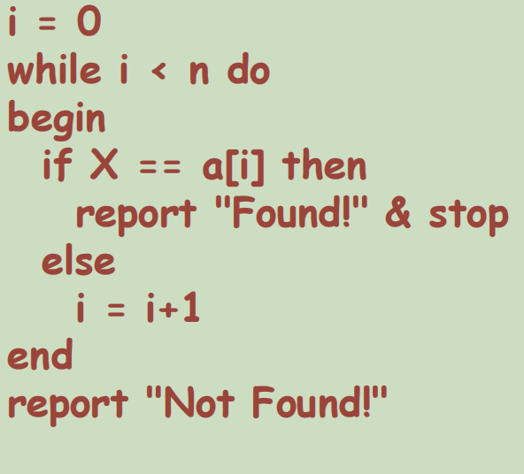
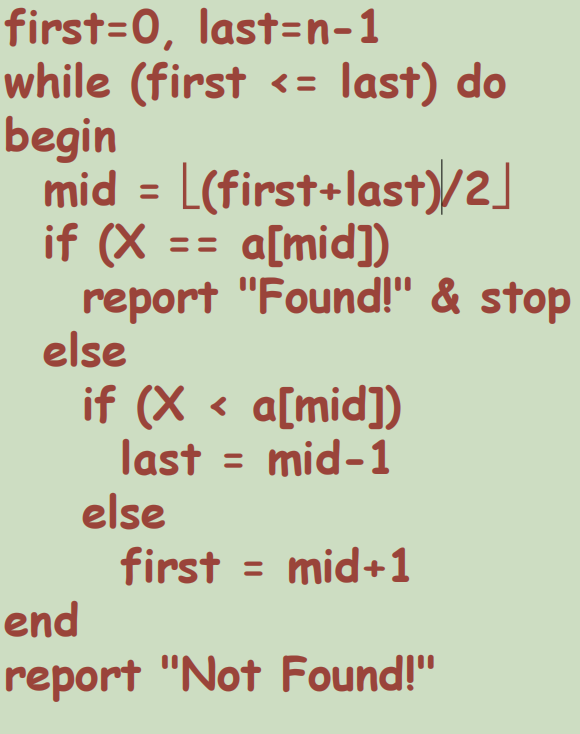
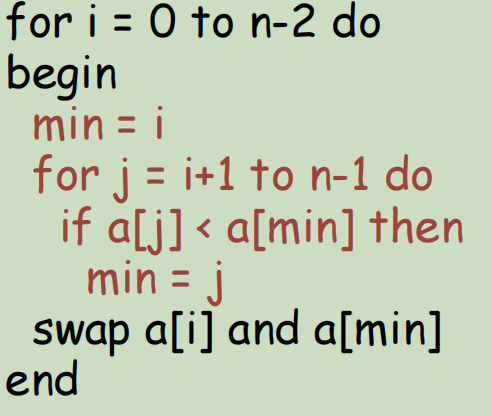
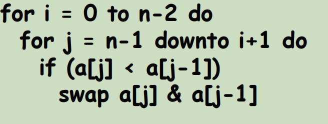
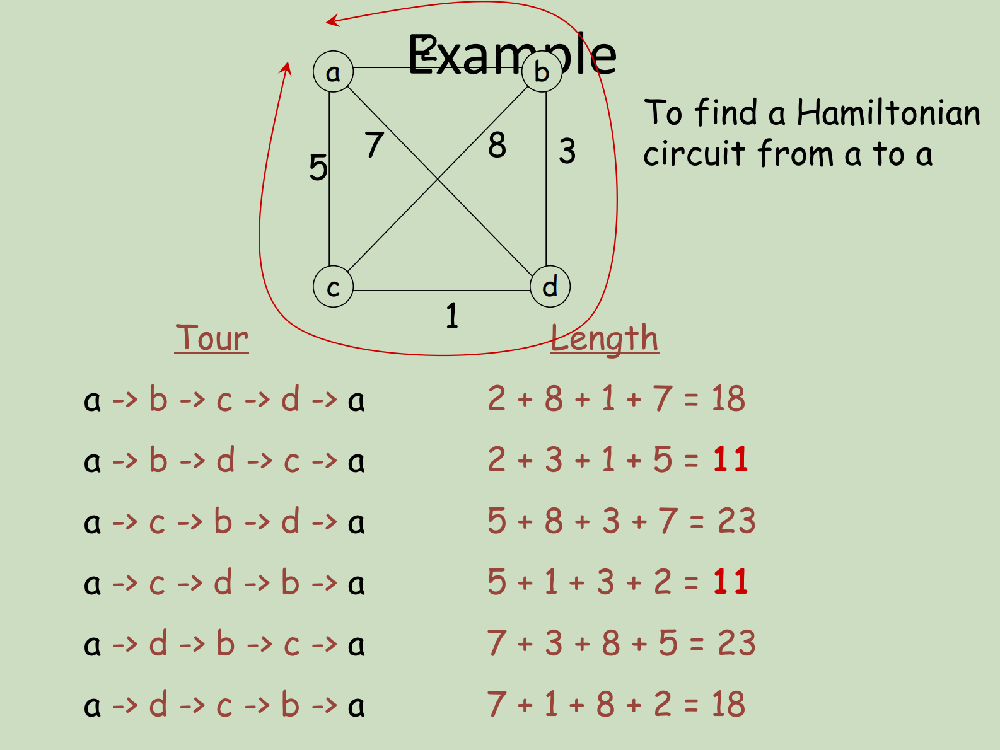

# Week 2 Searching and Sorting

## Searching 搜索

### Linear search 线性搜索

**Input**: a sequence of n numbers a0 , a1 , …, an-1 ; and a number X.

n 个数字的序列 A0 ， A1 ， ...， An-1 ;和一个数字 X。

**Output**: determine whether X is in the sequence or not.

确定 X 是否在序列中。

**Idea of Algorithm**:

1. Starting from i=0, compare X with ai one by one as long as i < n.

2. Stop and report "Found!" when X = ai.
3. Repeat and report "Not Found!" when i >= n.

从头搜索到尾，如果中途遇到了对应的值就报found，没有就在最后报not found 

时间复杂度：

Best Case: O(1)

Worst case: O(n)

### Binary Search 二分查找

*more efficient way* of searching when the sequence of numbers is **pre-sorted**

相较于线性搜索*更加有效率*，但是前提要求是传入的内容必须要**提前排序好**

**Input**: a sequence of n **sorted** numbers a0 , a1 , …, an-1 in ascending order and a number X.

n 个按**升序排序**的数字 A0 ， A1 ， ...， an-1 和一个数字 X 的序列。

**Idea of algorithm:**

1. compare X with number in the middle.

   将 X 与中间的数字进行比较

2. then focus on only the first half or the second half (depend on whether X is smaller or greater than the middle number).

   然后只关注前半部分或后半部分（取决于 X 是小于还是大于中间数）

   如果想找的数比中间的数大，把中间＋1更新为左界；反之，如果想找的数比中间的数小，把中间-1更新为右界

3. reduce the amount of numbers to be searched by half.

   将要搜索的号码数量减少一半
   
   mid向下取整

**时间复杂度：**

Best case: O(log n) 底数是2

Worst case: O((log2 n) + 1)  底数是2

Every comparison reduces the amount of numbers by at least half

### Search for a Pattern 寻找连续子串出现位置

Given a string of **n** characters called the text and a string of **m** characters (m<n) called the pattern

给定一串包含n个字符的字符串，从中找出连续的包含m个字符的子串

To determine if the text contains a substring matching the pattern.

Example:

text: **N O B O D Y _ N O T I C E _ H I M**

pattern: **N O T**

substring: **N O B O D Y _** <u>**N O T**</u> **I C E _ H I M**

**Idea of Algorithm:**

1. The algorithm scans over the text position by position.

2. For each position **i**, it checks whether the pattern P[0..m-1] appears in T[i..i+m-1]

   If the pattern exists, then report found

   Else continue with the next position **i+1**

   **for i = 0 to n-m do**

   **begin**

   **j = 0**

   **while (j < m && P[j]==T[i+j]) do**

   ​	**j = j + 1**

   **if (j == m) then**

   ​	**report "found!" & stop**

3. If repeating until the end without success, report not found

**时间复杂度:**

Best case: O(m)

Worst case: O(nm) 

pattern appears at the end of the text OR pattern does not exist

## Sorting 排序

**Input**: a sequence of n numbers a0 , a1 , …, an-1

n 个数字的序列 A0 ， A1 ， ...， An-1

**Output**: arrange the n numbers into ascending order, i.e., from smallest to largest

将 n 个数字按升序排列，即从小到大

**Example**: If the input contains 5 numbers 132, 56, 43, 200, 10, then the output should be 10, 43, 56, 132, 200

### Selection Sort 选择排序

每次从原始数组中选择最小数，append到新数组中

1. find minimum key from the input sequence 从输入序列中查找最小键

2. delete it from input sequence 将这段序列从输入的内容中删除

3. append it to resulting sequence 将这串序列添加到结果序列当中

4. repeat until nothing left in input sequence 重复以上操作直到只剩下输入序列

**时间复杂度: O(n^2)  准确来说是n(n-1)/2**

### Bubble Sort 冒泡排序

从前到后，将原数组的相邻两数进行比较换位，直到数组末尾，此时末尾的数字已确定，下次（第2次）循环只需比较0到n-1个数字，以此类推，在第i次循环只需比较至n-i＋1个数，直到i等于n结束循环

1. starting from the last element, swap adjacent items if they are not in ascending order

   从最后一个元素开始，如果相邻项目不按升序排列，则交换它们

2. when first item is reached, the first item is the smallest

   当到达第一个项目时，第一个项目是最小的

3. repeat the above steps for the remaining items to find the second smallest item, and so on

   对其余项目重复上述步骤，以查找第二个最小的项目，依此类推

**时间复杂度: O(n^2) 准确来说是n(n-1)/2**

## Traveling Salesman Problem

Input: 城市数量

Output: 每个城市之间的距离都不相同，找到路程最短的一条路线

总路线数量：(n - 1)!

## Knapsack Problem

**Input:** Given n items with weights w1 , w2 , …, wn and values v1 , v2 , …, vn , and a knapsack with capacity W.

给定权重为 w1 ， w2 ， ...， wn 和值为 v1 ， v2 ， ...， vn 的 n 个项目，以及一个容量为 W 的背包。

**Output:** Find the most valuable subset of items that can fit into the knapsack.

找到可以放入背包的最有价值的物品子集。

时间复杂度: O(2^n)

## 课后练习

1. Suppose you have forgotten a password with 5 characters. You only remember:

   ​	– the 5 characters are **all distinct**

   ​	– the 5 characters are **B, D, M, P, Y**

   If you want to try **all possible combinations**, how many of them in total?

   What if the 5 characters can be any of the 26 upper case alphabet?

   5!

2. Suppose the password also contains 2 digits, i.e., 7 characters in total

   ​	– all characters are **all distinct**

   ​	– the 5 alphabets are **B, D, M, P, Y**

   ​	– the digit is either **0 or 1**

   How many combinations are there?

   7!

3. What if the password is in the form **adaaada?**

   ​	– **a** means alphabet, **d** means digit

   ​	– all characters are **all distinct**

   ​	– the 5 alphabets are **B, D, M, P, Y**

   ​	– the digit is either **0 or 1**

   How many combinations are there?

   5! * 2!

