# Divide and Conquer

One of the **best-known** algorithm design techniques.

Idea:
– A problem instance is divided into several smaller instances of the **same problem**, ideally of about same size

一个问题实例被划分为同一问题的几个较小的实例，理想情况下大小大致相同

– The smaller instances are solved, typically **recursively**

较小的实例通常以**递归方式**求解

– The solutions for the smaller instances are combined to get  a solution to the original problem

将较小实例的解决方案组合在一起，以获得原始问题的解决方案

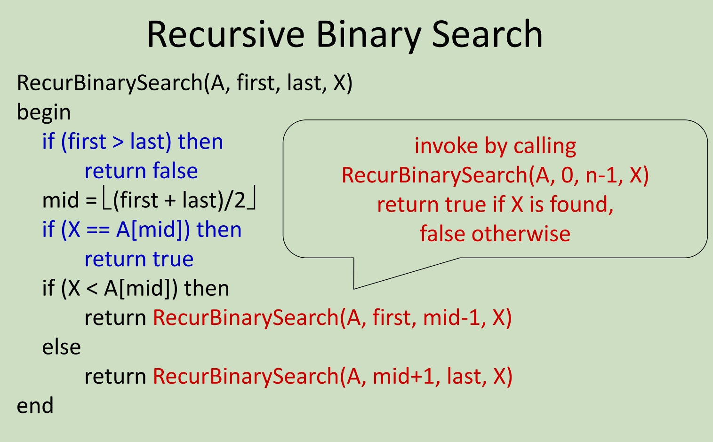

Principles:

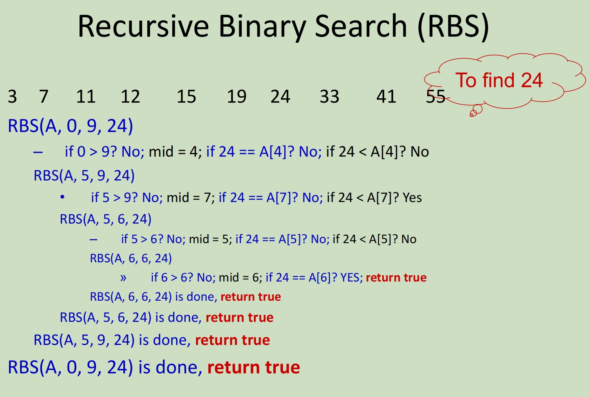

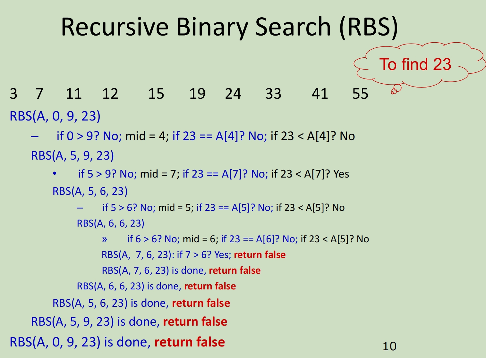

## Recurrence

A recurrence is an equation or inequality that describes a function in terms of **its value on smaller inputs**.

递归是一个方程或不等式，它根据函数在较小输入上的值来描述函数。

To solve a recurrence is to derive ***asymptotic bounds*** on the solution

求解递归就是在解上推导***渐近边界***

### Time Complexity of Binary Sorting 二分排序的复杂度

Let T(n) denote the time complexity of binary search algorithm on n numbers.

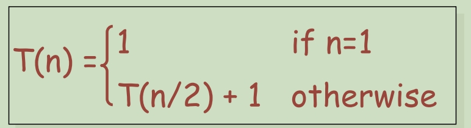

```
 Make guess: T(n) <= 2log n

Assume true for all n' < n [assume T(n/2) <= 2 log (n/2)]

T(n) = T(n/2) + 1 

<= 2 log (n/2) + 1 <--- *by hypothesis*

= 2(log n – 1) + 1  <--- log(n/2) = log n – log 2

< 2log n
```

**Examples:**

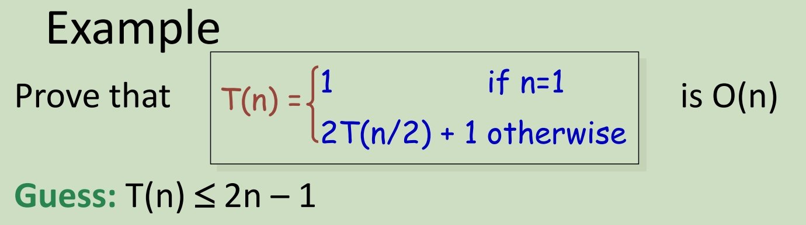

Prove 1: Base case n = 1

LHS T(1) = 1

RHS 2 -1 = 1

LHS = RHS

Prove 2: Assume T(n/2) <= 2(n/2) - 1

2T(n/2) + 1 <= 2(2(n/2) - 1) + 1

= 2n - 1 == O(n)

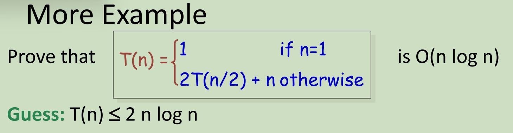

```
Assume T(n/2) <= 2(n/2)log(n/2)

2T(n/2) + n <=  2(2(n/2)log (n/2)) + n

= 2nlog (n/2) + n = 2n(logn - log2) + n --> 因为base是2，所以log2 = 1

= 2n(logn - 1) + n

= 2nlogn - 2n + n

== O(nlogn)
```

**Summary:**

T(n) = T(n/2)+1 T(n) is O(log n)

T(n) = 2T(n/2)+1 T(n) is O(n)

T(n) = 2T(n/2)+n T(n) is O(n log n)

## Merge Sort 融合排序

1. using divide and conquer technique

2. divide the sequence of n numbers into two halves

​	将 n 个数字的串行分成两半

3. **recursively** sort the two halves

   **递归** 对两半进行排序

4. **merge** the two sort halves into a single sorted sequence

   **合并** 将两个排序部分合并为一个排序串行

**time complexity: O(n log(n))**

### Example 案例

Sort following 8 numbers

**<u>51, 13, 10, 64, 34, 5, 32, 21</u>**

Continue to divided them into two halves, until each part only contain 1 number

- 从中间分开，分成两部分：
  1. 第一部分（前半部分）：<u>51, 13, 10, 64</u> 
  2. 第二部分（后半部分）：<u>34, 5, 32, 21</u>

- 将新分开的两段再进行划分:
  1. 1. <u>51, 13</u>
     2. <u>10, 64</u>
  2. 1. <u>34, 5</u>
     2. <u>32, 21</u>
- 再对新的到的组合进行分割，直到每组只剩下最后一个
  1. 1. <u>51</u>
     2. <u>13</u>
     3. <u>10</u>
     4. <u>64</u>
  2. 1. <u>34</u>
     2. <u>5</u>
     3. <u>32</u>
     4. <u>21</u>

- 针对每组内容进行排序，并向上重新组成和一个完整的整体
  1. 1. <u>13, 51</u>
     2. <u>10, 64</u>
  2. 1. <u>5, 34</u>
     2. <u>21, 32</u>
- 继续向上组合
  1. <u>10, 13, 51, 64</u>
  2.  <u>5, 21, 32, 34</u>

- 从这两组排列好的数列中取值，重新组合成升序的整体

  <u>**10**, 13, 51, 64</u>    <u>**5**, 21, 32, 34</u>

  此时假设有两个指针，分别指向两个数组开头数字的位置

  比较两个指针上的数并将数值更小的数字取出，然后被取出数字的数列指针向下移

  <u>**10**, 13, 51, 64</u>    <u>5, **21**, 32, 34</u>

  此时在比较移动过后两个指针上的数字，并按照上面的逻辑一直到一组数列的数字被取完为止，此时再把另一组的内容直接填在后面

  .......

  <u>5, 10, 13, 21, 32, 34, 51, 64</u>

## Pseudo Code 

1. Algorithm Mergesort(A[0..n-1]). (Divide分割)

   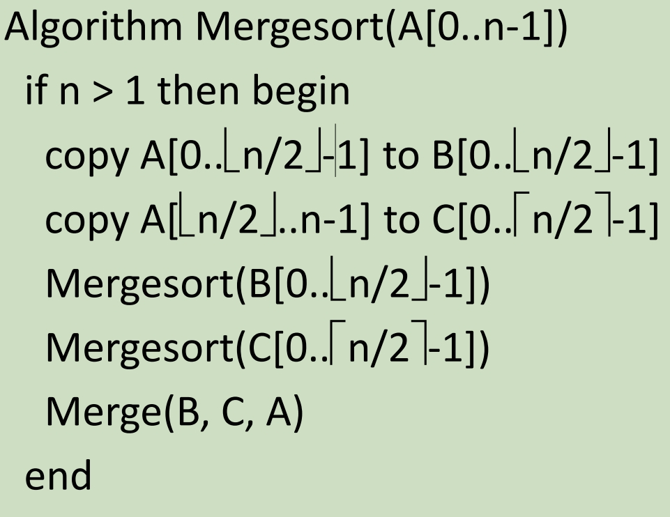

2. **Algorithm** Merge(B[0..p-1], C[0..q-1], A[0..p+q-1]) (Compare对比)

   (i是B的计数器，j是C的计数器，K是A的计数器。B和C是分割出来排列的两组，A是最终整合的)

   <hr>

   Set i=0, j=0, k=0

   while i<p and j<q do (循环i和j)

   begin

   ​	if B[i]<=C[j] then set A[k]=B[i] and increase i 

   ​	(如果B[i] < C[j]则代表当前指针指向C列表的数字更大，此时应把B的数字填入A，然后让i加一)

   ​	else set A[k] = C[j] and increase j

   ​	(反之代表C中的数字更小，因此要把指针指向的C中的数字填入A，然后让j加一)
   
   ​	k = k+1
   
   ​	(让A的索引加一)
   
   end
   
   if i==p then copy C[j..q-1] to A[k..p+q-1] 
   
   (判断如果此时i已经超过了B的长度，则代表B中的数字已经循环完了，因此可以直接把C中剩余的数字直接填入A中剩余的位置)
   
   else copy B[i..p-1] to A[k..p+q-1]
   
   (反之，代表C中的数字已经提取完了，可以直接把B中的数字填入A的后面)
   
   

## Graph

## Undirected graphs 无向图

An *undirected* graph **G=(V,E)** consists of a set of **vertices V** and a set of **edges E**. Each edge is an *unordered* pair of vertices. (E.g., {b,c} & {c,b} refer to the same edge.)

*无向*图 **G=（V，E）** 由一组顶点 **V** 和一组边 **E** 组成。每条边都是一对*无序*顶点。（例如，{b，c} 和 {c，b} 指的是同一条边。

- **simple graph:** at most one edge between two vertices, no self loop (i.e., an edge from a vertex to itself).

  **简单图：** 两个顶点之间最多一条边，没有自循环（即从一个顶点到自身的一条边）。

- **multigraph:** allows more than one edge between two vertices.

  **多图：** 允许在两个顶点之间有多个边。

- **pseudograph:** allows a self loop

  **pseudograph：** 允许自循环


Thre degree of vertex V is 3; The degree of verse U is 1.

➢**节点的度（degree of a vertex v**）：等于这个节点相连的边的量

➢**u** and **v** are said to be **adjacent** and called **neighbors** of each other.

据说 U 和 V 是相邻的，彼此称为邻居。

➢**u** and bare called **endpoints** of e.

➢**e** is said to be **incident** with **u** and **v**.

➢**e** is said to **connect** **u** and  **v**.

### Adjacency matrix / list 邻接矩阵/列表

**Adjacency matrix** M for a simple **undirected** graph with n vertices:

必须是n x n的矩阵，必须是对称矩阵(Symmetric Matrix)

**邻接矩阵** M 表示具有 n 个顶点的简单 **无向**图：

​	– M is an n * n matrix

​	– M(i, j) = 1 if vertex i and vertex j are adjacent

**Adjacency list:** each vertex has a list of vertices to which it is adjacent

**邻接列表**：每个顶点都有一个与其相邻的顶点列表


### Incidence matrix / list 发生率矩阵/列表

**Incidence matrix** M for a simple **undirected** graph with n vertices and m edges:

**入射矩阵** M 表示具有 n 个顶点和 m 条边的简单 **无向**图：

​	– M is an m*n matrix

​	– M(i, j) = 1 if edge i and vertex j are incidence

**Incidence list:** each edge has a list of vertices to which it is incident with

**发生率列表：** 每条边都有一个折点列表，其入射点是

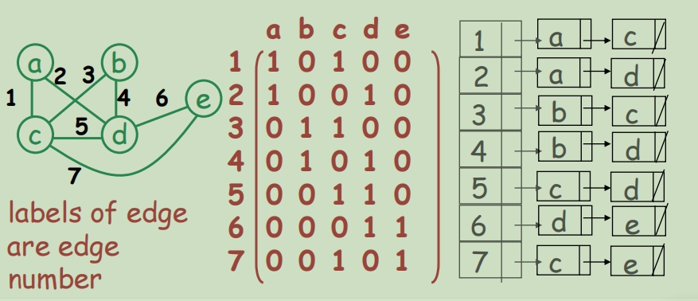

## Euler circuit / path 欧拉回路/路径

- In an undirected graph, a **path** from a vertex **u** to a vertex **v** is a sequence of edges **e**1= {u, x1 }, **e**2= {x1 , x2 }, …**e**n= {xn-1 , v}, where **n≥1**.

  在无向图中，从顶点 **u** 到顶点 **v** 的 **路径** 是边 e1= {u， x1 }， e2= {x1 ， x2 }， ...en= {xn-1 ， v}，其中 **n≥1**。

- The **length** of this path is **n**.

  此路径的 **length** 为 **n**。

- Note that a path from **u** to **v** implies a path from **v** to **u**.

  请注意，从 **u** 到 **v** 的路径意味着从 **v** 到 **u** 的路径

- If u = v, this path is called a **circuit** (cycle).

  如果 = v，则此路径称为 **回路**（周期）。

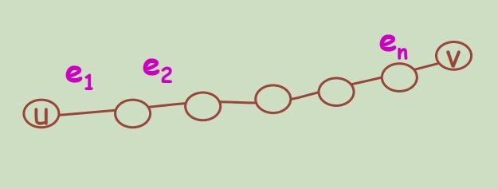

### Euler Circuit 欧拉回路

经过所有顶点，并且每条边都只经过一遍。(注意，顶点是可以经过多次的，但是边只能经过一次)

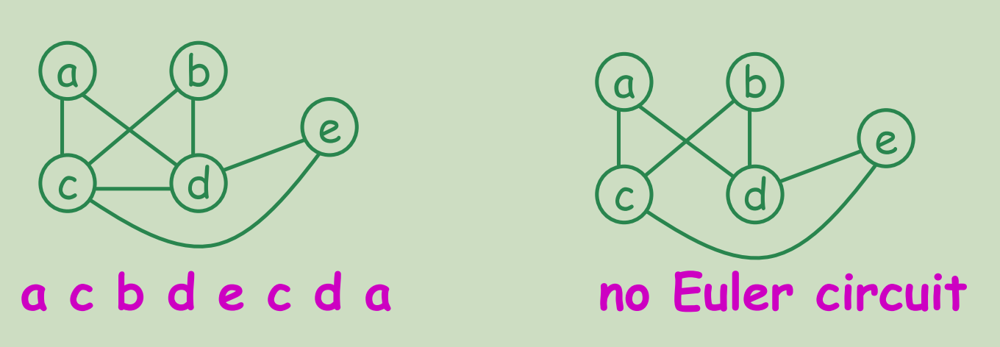

An undirected graph G is said to be **connected** if there is a path between **every pair** of vertices.

如果想表达无向图G是连通的：如果每一对顶点之间都有至少一条边连接 (要注意，形成回路不代表一定是欧拉回路)

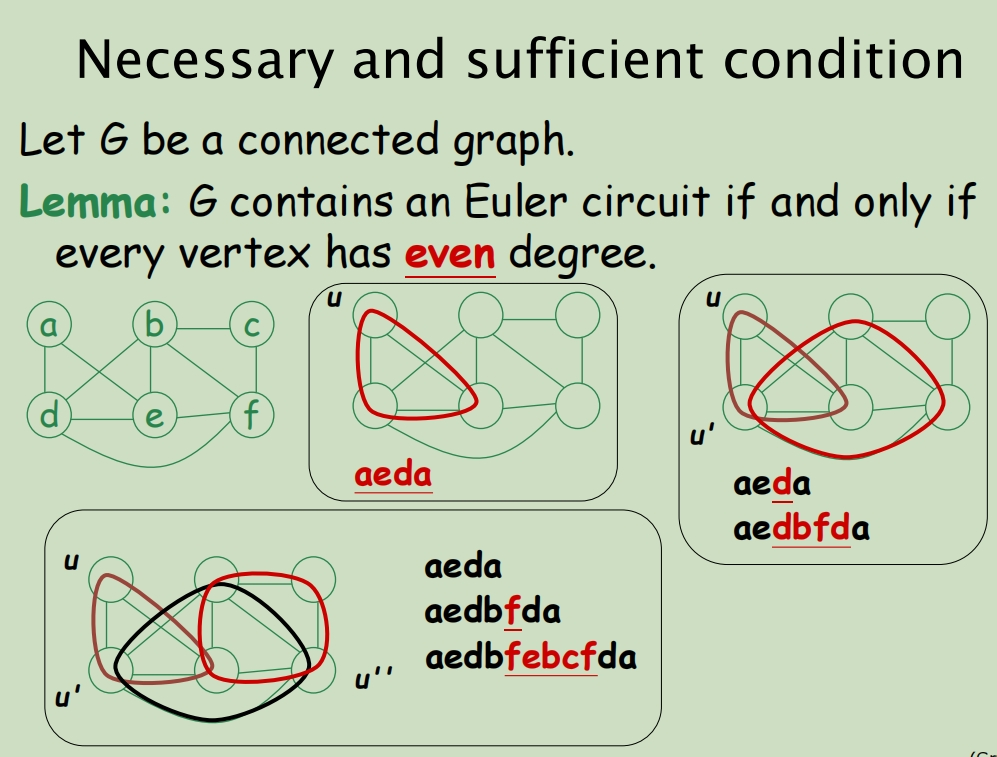

**Lemma: 快速判断是不是欧拉回路的方法，检查每一个顶点的degree是不是偶数，如果是都是偶数就代表这是一个欧拉回路.**

### Euler Path 欧拉路径 （和欧拉回路不同)

An **Euler path** is a path visiting every edge of G exactly once.

欧拉路径是恰好访问一次 G 的每个边的路径。

An undirected graph contains an Euler path if it is connected and contains exactly **two vertices of odd degree**.

如果无向图是连通的，则包含一条欧拉路径，并且恰好包含两个奇数度( two odd degree vertices)的顶点。

### 判断欧拉路径和欧拉回路

1. all vertices have even degree 所有的结点都是偶度 (Both Euler circuit and Euler path)
2. exactly two vertices have odd degree 正好只有两个结点是奇度 (Not Euler circuit; Exist Euler path)
3. more than 2 vertices have odd degree 有两个以上的结点是奇度 (Neither Euler circuit nor Euler path)

## Hamiltonian circuit / path 哈密顿图

给定一个图，存在有一种一笔画能够走完这个图的所有节点（走过的边不可再走，不必经过所有边），也就是这个图的节点可以一笔画走完，则称这个图为哈密顿图

与欧拉回路不同，这里每个点都需要经过并且只能经过一次，但是边是没有强制要求的可以经过很多次也可以一次都不经过

## Breadth First Search (BFS) 广度优先搜索

All vertices at distance k from s are explored before any vertices at distance k+1.

探索所有距离顶点s并且距离为k的点，探寻的范围为所有距离为k的点以及距离为k+1的点之前

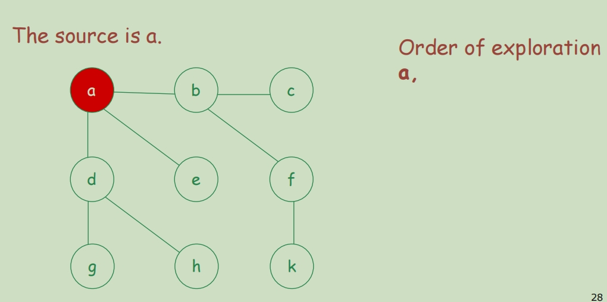

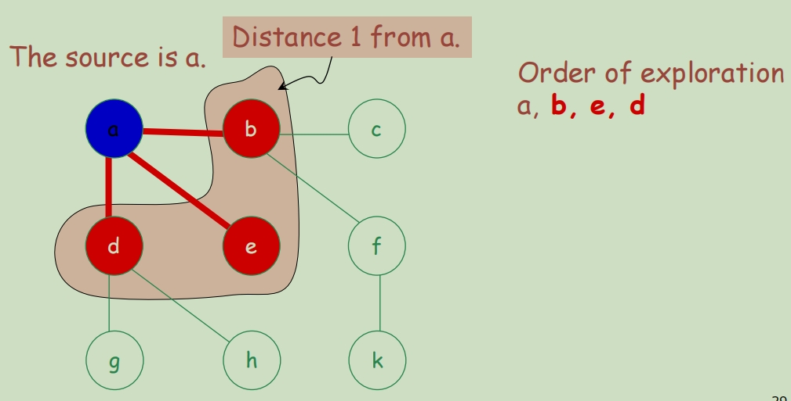

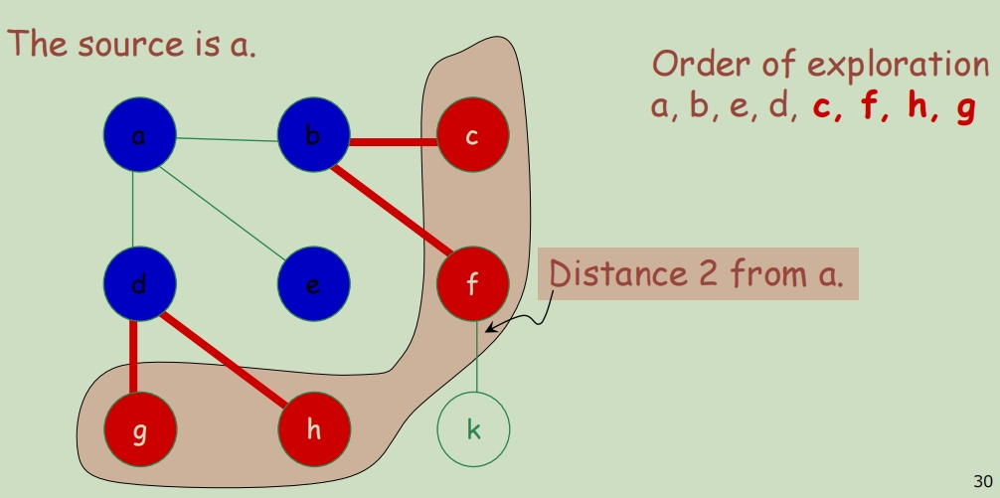


给定一张G=(V, E)的图之后，BFS算法可以系统地探索G的层级


### BFS- Pseudo Code

unmark all vertices  取消标记所有顶点

choose some starting vertex s  选择起始点s

**mark s and insert s into tail of list L** 标记s点并且将s点插入到队列L的队尾

while L is nonempty do  循环列表L直到为空

​	begin

​		remove a vertex v from **front of L**.  将列表L前的结点去除

​		visit v 

​		for each **unmarked neighbor w** of v do

​				**mark w and insert w into tail of list L**

​	end

## Depth First Search (DFS) 深度优先搜索

一般用`栈stack`数据结构来辅助实现DFS算法。其过程简要来说是对每一个可能的分支路径深入到不能再深入为止，而且每个节点只能访问一次。
若将bfs策略应用于树结构，其效果等同与`前中后序遍历`。


### 基本步骤

1. 对于下面的树而言，DFS方法首先从根节点1开始，其搜索节点顺序是1,2,3,4,5,6,7,8（假定左分枝和右分枝中优先选择左分枝）。

   

2. 从stack中访问栈顶的点

   

3. 找出与此点邻接的且尚未遍历的点，进行标记，然后放入stack中，依次进行

   

4. 如果此点没有尚未遍历的邻接点，则将此点从stack中弹出，再按照（3）依次进行

   

5. 直到遍历完整个树，stack里的元素都将弹出，最后栈为空，DFS遍历完成


