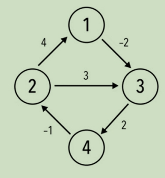

# Bellman-ford Algorithm,  Floyd’s Algorithm 

## Shortest Paths

- **Single-source shortest paths:** Find **shortest paths** from the source to all other vertices (shortest path means the total weight of the path is the smallest)

  – Only nonnegative edge weights: Dijkstra’s algorithm

  – Allow negative edge weights: Bellman-Ford algorithm 

  (Dynamic Programming)

- **All-pairs shortest paths:** Find **shortest path** between each pair of vertices.

  – Floyd’s algorithm (Dynamic Programming)

## Bellman-Ford Algorithm

在有向图（无向图中可以自己定义方向）中，计算从一个起点到别的点的最短路径

**Dijlstra’s Algorithm** does not work with graphs with **negative weighted** edges.

Dijlstra 的算法不适用于具有**负边权值**的图形。

Recall: If a graph *G =* (*V*, *E*) contains a negative weight cycle, then some shortest paths may not exist

如果图形 G = （V， E） 包含**负权重循环**，则可能不存在一些最短路径

**Bellman-Ford Algorithm**适用于有负边权值的有向或无向图，但是不适用于有负权回路的图像。因此该算法还可以用来识别图像中是否有负权回路，或查找指定source到其他所有vertex的最短路径，路径中可以包含负权值。

**Time Complexity: O(VE)**

```C
Algorithm Bellman-Ford(G=(V, E), s)
//input: a graph G=(V,E) with a source vertex s 确定图G中的一个节点为源点
//output: an array d[0..|V|-1], indexed with V, d[v] is the
//length of shortest path from s to v 找到每个点到源点的最短距离
d[s] ← 0 // 让原点的距离设置为0
for each v belongs V – {s} // 遍历循环除了源点之外的每一个节点
	do d[v] ← infinity // 将除了源点之外的所有点的初始距离都设置为无穷
    
// 从第一个源点开始，遍历当前节点到所有指向外的有向边所连接的点的距离
for i ← 1 to |V| – 1
	do for each edge (u, v) belongs E  // 遍历这个点引出的指向另一个节点的边
        // u代表当前循环到的节点，v代表当前遍历到的从u出发的边所指向的节点。
        // d[u]代表源点到当前循环到的节点的最短路径，d[v]代表被指向的节点距离源点的最路径，如果d[v]< d[u] + w[u. v]代表，如果v距离源点的最短路径大于u距离源点的最大路径加u和v之间的距离的和，那么就替换成d[u] + w[u, v]的值。
		do if d[v] > d[u] + w(u, v)  
			then d[v] ← d[u] + w(u, v)
            
// 有几个点就最多进行几次循环，如果最后一次循环还能改变某个节点的距离，那么就证明这个路线存在负回路
for each edge (u, v) belongs E
  // //进行完|V|-1次循环操作后，如果还能某条边还能进行松弛，说明到某个点的最短路径还未找到，那么必定是存在负权回路
	do if d[v] > d[u] + w(u, v)
		then report that a negative-weight cycle exists
```

算法定义一个操作 松弛(a,b)：

1. 对于边(a,b),遍历所有点集，检查是否有点f可使 a的距离值+(a,f)+(f,b)<a的距离值+(a,b)，如果存在则更新b的距离值= a的距离值+(a,f)+(f,b),记录是从f这走到b更短

算法：

1. 对所有在边集里的边(j,k)，进行一次松弛(j,k)，如果出现更小的k的距离值，更新k的距离值，否则代表没有从j之外的地方到k可以使k距离值变少。
2. 由于松弛过后出现了新的距离值，需要重复以上操作直到某次对边集的松弛没有使点的距离值减少。如果上述操作进行了超过V-1次，怎么循环都能更新距离值，则图中存在负权回路。

思路讲解：

1. 初始化源点s到各个点v的路径dis[v] = ∞，dis[s] = 0。

2. 进行n - 1次遍历，每次遍历对所有边进行松弛操作，满足则将权值更新。

   松弛操作：以a为起点，b为终点，ab边长度为w为例。dis[a]代表源点s到a点的路径长度，dis[b]代表源点s到b点的路径长度。如果满足下面的式子则将dis[b]更新为dis[a] + w。

   - dis[b] > dis[a] + w

3. 遍历都结束后，若再进行一次遍历，还能得到s到某些节点更短的路径的话，则说明存在负环路。

Example:


1. 得出边权信息

   A B -1
   A C 4
   B C 3
   B D 2
   B E 2
   D B 1
   D C 5
   E D -3

2. 首先初始化源点A到各个节点耗费的时间

   | 父节点 | 节点 | 初始化   |
   | ------ | ---- | -------- |
   | A      | A    | 0        |
   |        | B    | infinity |
   |        | C    | infinity |
   |        | D    | infinity |
   |        | E    | infinity |

3. 进行第一次节点遍历，此时u节点为A，计算从A出发的有向边到周边的节点的最短距离

   从A出发的有向边，且该有向边连接的两个点:

   A (A, 0) -(-1)-> B(0, infinity)  ==> A (0, 0) -(-1)-> B(0, -1) (因为-1 < infinity)
   A (A, 0) -(4) -> C(0, infinity) ==> A (A, 0) -(4)-> C(A, 4) (因为4< infinity)

   | 父节点 | 节点 | 路径长度 |
   | ------ | ---- | -------- |
   | A      | A    | 0        |
   | A      | B    | -1       |
   | A      | C    | 4        |
   |        | D    | infinity |
   |        | E    | infinity |

4. 进行第二次节点遍历，此时u节点为B， 计算从B出发的有向边到周边的节点的最短距离

   从B出发的有向边，且该有向边连接的两个点:

   B(B, -1) -(2)-> D(0, infinity) ==> B(B, -1) -(2)-> D(B, 1) (因为1小于infinity)

   B(B, -1) -(2)-> E(0, infinity) ==> B(B, -1) -(2)-> E(B, 1) (因为1小于infinity)

   B(B, -1) -(3)-> C(A, 4) ==> B(B, -1) -(3)-> C(B, 2) (因为2小于4)

   | 父节点 | 节点 | 路径长度 |
   | ------ | ---- | -------- |
   | A      | A    | 0        |
   | A      | B    | -1       |
   | B      | C    | 2        |
   | B      | D    | 1        |
   | B      | E    | 1        |

5. 进行第三次节点遍历，此时u节点为E，计算从B出发的有向边到周边的节点的最短距离

   从E点出发的有向边，且该有向边连接的两个点：

   E(B, 1) -(-3)-> D(B, 1) ==> E(B, 1) -(-3)-> D(E, -2) (因为-2 < 1)

   | 父节点 | 节点 | 路径长度 |
   | ------ | ---- | -------- |
   | A      | A    | 0        |
   | A      | B    | -1       |
   | B      | C    | 2        |
   | E      | D    | -2       |
   | B      | E    | 1        |

6. 进行第四次节点遍历，此时u节点为E，计算从B出发的有向边到周边的节点的最短距离

​	从D点出发的有向边，且该有向边连接的两个点:

​	D(E, -2) -(1)-> B(A, -1) ==> 无变化 (因为-1 == -1)

7. 节点C没有变化，因为节点C没有向外延申的有向边
8. 因此一轮循环下来，最后节点到原点的最短路径已经固定了，因此图G不存在负回路。

如果存在负回路，则一轮训话之后再进行循环，有些店的最短路径还会发生改变。

## Floyd’s Algorithm

**时间复杂度: O(n<sup>3</sup>)**

A weighted (di) graph *G* = (*V*, *E*), find a |V| × |V| matrix, it’s entry d<sub>ij</sub> is the shortest path length between vertices *i, j,* where *i*, *j* belongs V

在有向图G中，找到一个 |节点的数量| *|节点的数量|的矩阵，其中d<sub>ij</sub>代表的就是最短路径。i，j分别是两个节点. (i是竖着的，j是横着的)

伪代码:

```C
let V = number of vertices in graph
let dist = V x V array of minimum distance initialized to infinity 
// 循环遍历所有的节点，将所有节点到自己的距离设置成0，也就是矩阵的对角线为0
for each vertex v
    dist [v][v] ← 0

// 循环每一个边，将每一个边值注入到矩阵中对应的位置
for each edge(u, v)
    dist[u][v] ← weight(u, v)

// 进行循环排查每个点是否可以通过其他绕行其他的点从而使原本两点之间的距离变小距离变小
for k from 1 t V
    for i from 1 to V
        for j from i to V
            if dist[i][j] > dist[i][k] + dist[k][j]
                dist[i][j] ← dist[i][k] + dist[k][j]
            end if
```


例如能不能通过经过其他的例如k节点，从而使dist[i, k] + dist[k, j] < dist[i, j]

解题思路:

如图，有4个V（节点）



1. 确定所有的边的权值，并根据节点的数量，创建一个V * V的矩阵。将每个点到自己的距离设置为0，其他的位置假设都是infinity
   $$
   \begin{matrix}
      0 & ∞ & ∞ & ∞ \\
      ∞ & 0 & ∞ & ∞ \\
      ∞ & ∞ & 0 & ∞ \\
      ∞ & ∞ & ∞ & 0
   \end{matrix} \tag{1}
   $$

2. 先将所有边的自己的权重直接放入矩阵中
   $$
   \begin{matrix}
      0 & ∞ & -2 & ∞ \\
      4 & 0 & 3 & ∞ \\
      ∞ & ∞ & 0 & 2 \\
      ∞ & -1 & ∞ & 0
   \end{matrix} \tag{2}
   $$

3. 然后进行最后的3层for循环，判断如果两点之间是否还存在更短的路径
   $$
   \begin{matrix}
      0 & ∞ & -2 & ∞ \\
      4 & 0 & 3 & ∞ \\
      ∞ & ∞ & 0 & 2 \\
      ∞ & -1 & ∞ & 0
   \end{matrix} \tag{3}
   $$
   k = 1 2 3 4

   i = 1 2 3 4

   j = 1 2 3 4

   判断dist[i] [j] > dist[i] [k] + dist[k] [j]

   - k = **1** 2 3 4

     i = **1** 2 3 4

     j = **1** 2 3 4

     dist[1] [1] > dist[1] [1] + dist[1] [1] ==> 0 > 0 + 0 is wrong

   - k = **1** 2 3 4

     i = **1** 2 3 4

     j = 1 **2** 3 4

     dist[1] [2] > dist[1] [1] + dist[1] [2] ==> ∞ > 0 + ∞ is wrong

   - k = **1** 2 3 4

     i = **1** 2 3 4

     j = 1 2 **3** 4

     dist[1] [3] > dist[1] [1] + dist[1] [3] ==> -2 > 0 + -2 is wrong

   - k = **1** 2 3 4

     i = **1** 2 3 4

     j = 1 2 3 **4**

     dist[1] [4] > dist[1] [1] + dist[1] [4] ==> ∞ > 0 + ∞ is wrong

     ...........

   - k = **1** 2 3 4

     i = 1 **2** 3 4

     j = 1 2 **3** 4

     dist[2] [3] > dist[2] [1] + dist[1] [3] ==> 3 > 4 + -2 = 2 is correct, 因此向矩阵对应位置修改为这个值
     $$
     \begin{matrix}
        0 & ∞ & -2 & ∞ \\
        4 & 0 & 2 & ∞ \\
        ∞ & ∞ & 0 & 2 \\
        ∞ & -1 & ∞ & 0
     \end{matrix} \tag{4}
     $$
     ...........

   - k = 1 **2** 3 4

     i = 1 2 3 **4**

     j = **1** 2 3 4

     dist[4] [1] > dist[4] [2] + dist[2] [1] ==> ∞ > -1 + 4 = 3 is correct
     $$
     \begin{matrix}
        0 & ∞ & -2 & ∞ \\
        4 & 0 & 2 & ∞ \\
        ∞ & ∞ & 0 & 2 \\
        3 & -1 & ∞ & 0
     \end{matrix} \tag{5}
     $$
     ...........

   - k = 1 **2** 3 4

     i = 1 2 3 **4**

     j = 1 2 **3** 4

     dist[4] [3] > dist[4] [2] + dist[2] [2] ==> ∞ > -1 +2 = 1 is correct
     $$
     \begin{matrix}
        0 & ∞ & -2 & ∞ \\
        4 & 0 & 2 & ∞ \\
        ∞ & ∞ & 0 & 2 \\
        3 & -1 & 1 & 0
     \end{matrix} \tag{6}
     $$
     ...........

     最后

   - k = 1 2 3 **4**

     i = 1 2 **3** 4

     j = 1 **2** 3 4

     dist[3] [2] > dist[3] [4] + dist[4] [2] ==> ∞ > 2 +-1 = 1 is correct
     $$
     \begin{matrix}
        0 & -1 & -2 & 0 \\
        4 & 0 & 2 & 4 \\
        5 & 1 & 0 & 2 \\
        3 & -1 & 1 & 0
     \end{matrix} \tag{7}
     $$
