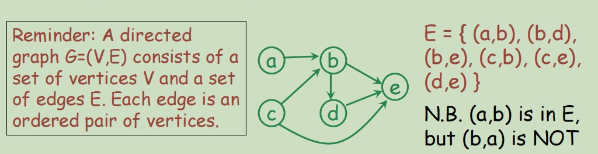
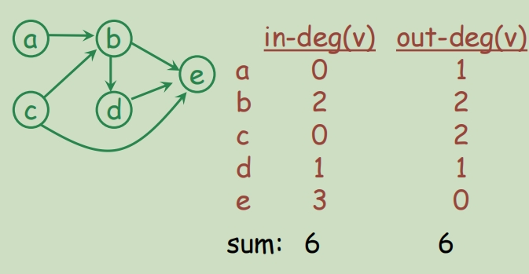
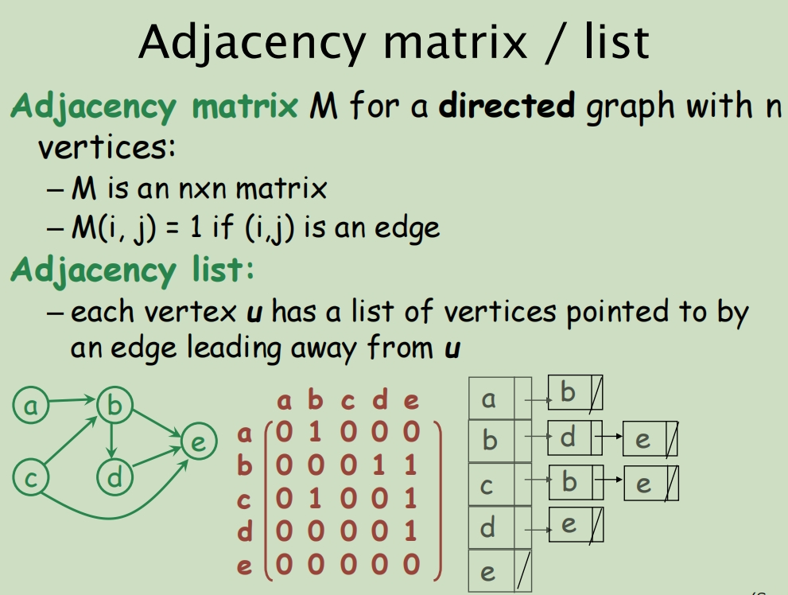
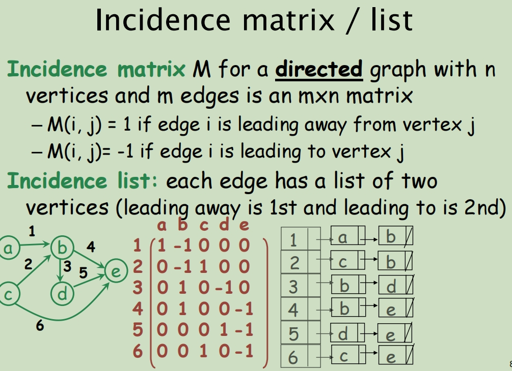
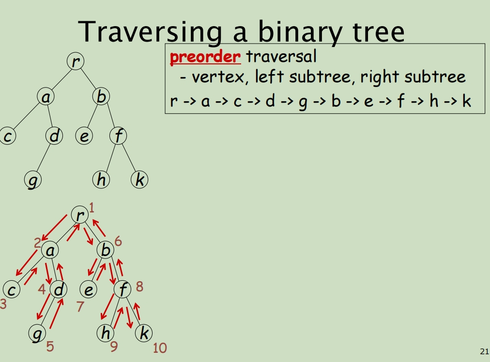
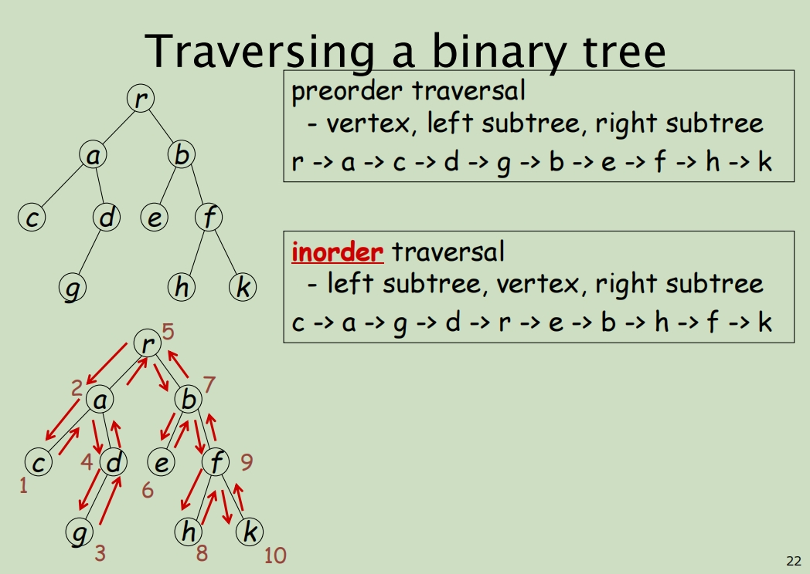
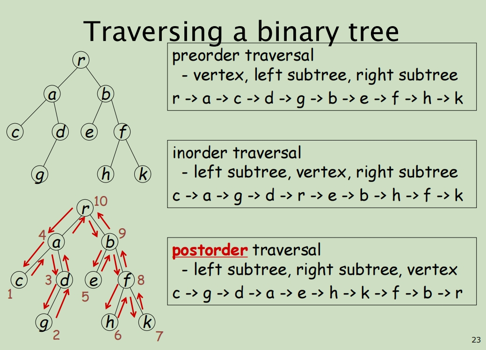

# Lecture 4 Directed Graph and Tree

## Directed graph 有向图

给定一个有向图 G，顶点 a 被称为如果存在从 a 到 b 的路径，则连接到顶点 b



The **in-degree** of a vertex **v** is the number of edges **leading to** the vertex **v**.

顶点的 **in-degree**  是通向顶点 **v** 的边数 **v**。

The **out-degree** of a vertex **v** is the number of edges **leading away** from the vertex **v**

顶点的**out-degree 是从顶点**引出的**leading away**的边数。





有向表的临近矩阵：

- index和column是每个vertex，然后直记录当前的out-degree的边数 



有向表的入射矩阵：

- index是edge的编号，column是每个vertex。记录每个edge的in-degree和out-degree分别对应哪个结点，如果是in-degree就是-1，如果是out-degree就是1

## Tree 树

An undirected graph G=(V,E) is a tree if G is connected and acyclic (i.e., contains no cycles)

无向图 G=(V,E)是树,如果 G 是连通且无环的(即不包含循环) V是结点，E是edge

Other equivalent statements: 其他的一些相等的命题

1. There is exactly one path between any two vertices in G. G 中的任意两个顶点之间正好有一条路径

2. G is connected and removal of one edge disconnects G. G 已连接，移除一个边缘会断开 G

   removal of an edge {u,v} disconnects at least u and v because of [1]

3. G is acyclic and adding one edge creates a cycle. G 是非循环的，添加一条边会产生一个循环

   adding an edge {u,v} creates one more path between u and v, a cycle is formed

   添加一条边 {u，v} 会在 U 和 V 之间再创建一条路径，形成一个循环）

4. G is connected and m=n-1 (where |V|=n, |E|=m). G 连接且 m=n-1（其中 |V|=n， |E|=m）


| 根节点 | 孩子节点 | 父母节点 | 度     | 叶子节点 | 内部节点          | 左子树       |
| ------ | -------- | -------- | ------ | -------- | ----------------- | ------------ |
| root   | children | parent   | degree | leaf     | internal vertices | left subtree |


L代表遍历左子树，R代表遍历右子树，v代表当前节点值

前序遍历 v,L,R----[0,1,3,7,8,4,9,10,2,5,11,12,6,13,14]

中序遍历 L,v,R----[7,3,8,1,9,4,10,0,11,5,12,2,13,6,14]

后序遍历 L,R,v----[7,8,3,9,10,4,1,11,12,5,13,14,6,2,0]


- 考虑结点K。根A到结点K的唯一路径上的任意结点,称为结点K的**祖先**。如结点B是结点K的祖先,而结点K是结点B的**子孙**。路径上最接近结点K的结点E称为K的**双亲**,而K为结点E的**孩子**。根A是树中唯一没有双亲的结点。有相同父节点的结点称为**兄弟**,如结点K和结点L有相同的双亲E,即K和L为兄弟。
- 树中一个结点的孩子个数称为该**结点的度**,树中结点的最大度数称为树的度。如结点B的度为2,结点D的度为3,树的度为3。
- 度大于0的结点称为**分支结点**(又称非终端结点);度为0(没有子女结点)的结点称为**叶子结点**(又称终端结点)。在分支结点中,每个结点的分支数就是该结点的度。
- 结点的深度、高度和层次。
  **结点的层次**从树根开始定义,根结点为第1层,它的子结点为第2层,以此类推。双亲在同一层的结点互为堂兄弟,图中结点G与E,F,H,I,J互为堂兄弟。
  - **结点的深度**是从根结点开始自顶向下逐层累加的。
  - **结点的高度**是从叶结点开始自底向上逐层累加的。
  - **树的高度**(或深度)是树中结点的最大层数。图中树的高度为4。







```java
// 见CPT102 Tutorial3
// 前序遍历
public void preorderPrint( )
{
   System.out.print(data + " ");
   if (left != null)
      left.preorderPrint( );
   if (right != null)
      right.preorderPrint( );
} 

// 中序遍历
public void inorderPrint( )
{
   if (left != null) 
       left.inorderPrint( );
   System.out.print(data + " ");
   if (right != null) 
       right.inorderPrint( );
}  

// 后序遍历
public void postorderPrint( )
{
   if (left != null)
      left.postorderPrint( );
   if (right != null)
      right.postorderPrint( );
   System.out.print(data + " ");
}   
```

