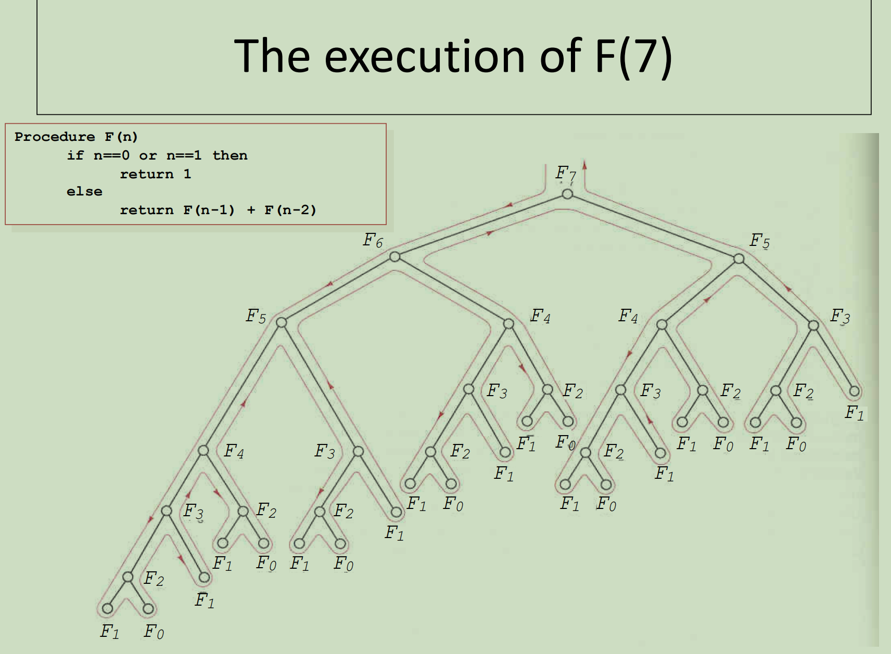
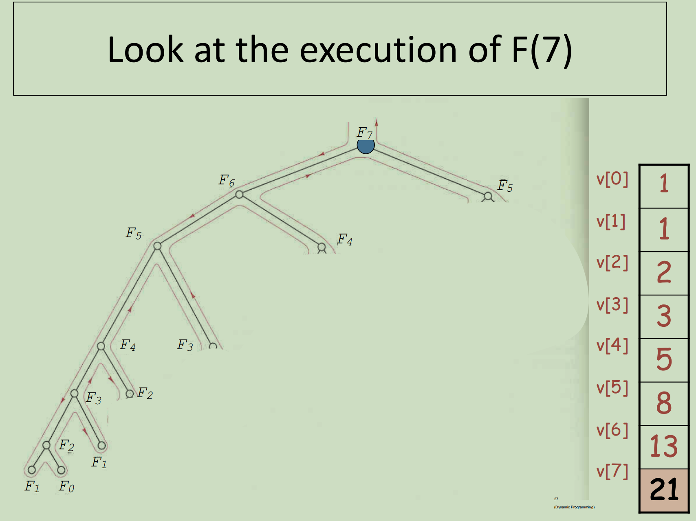
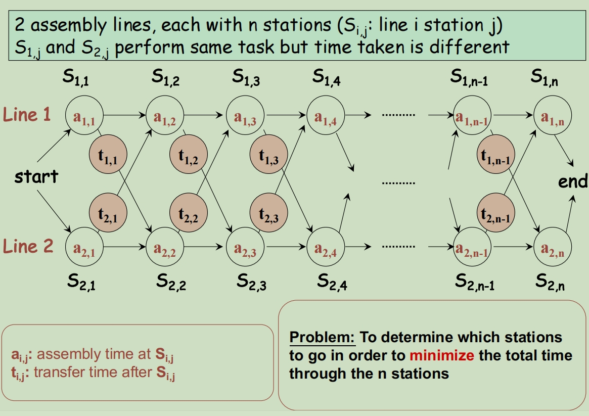
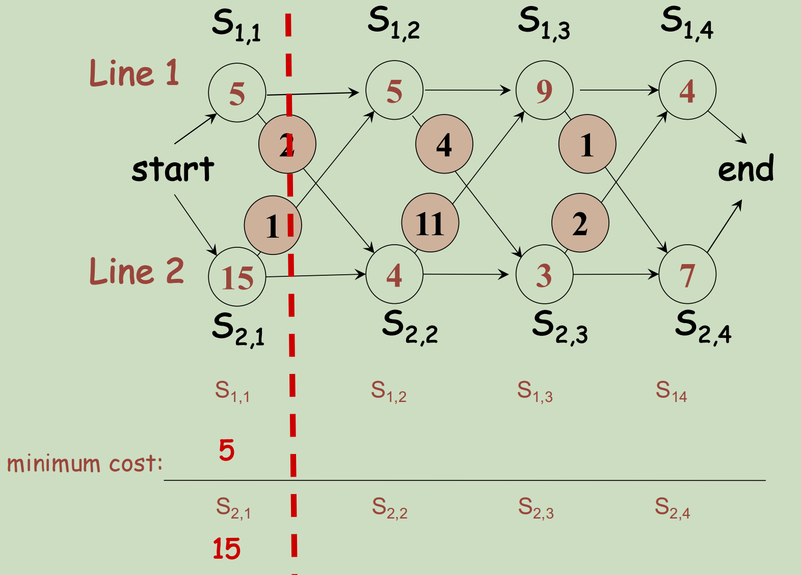
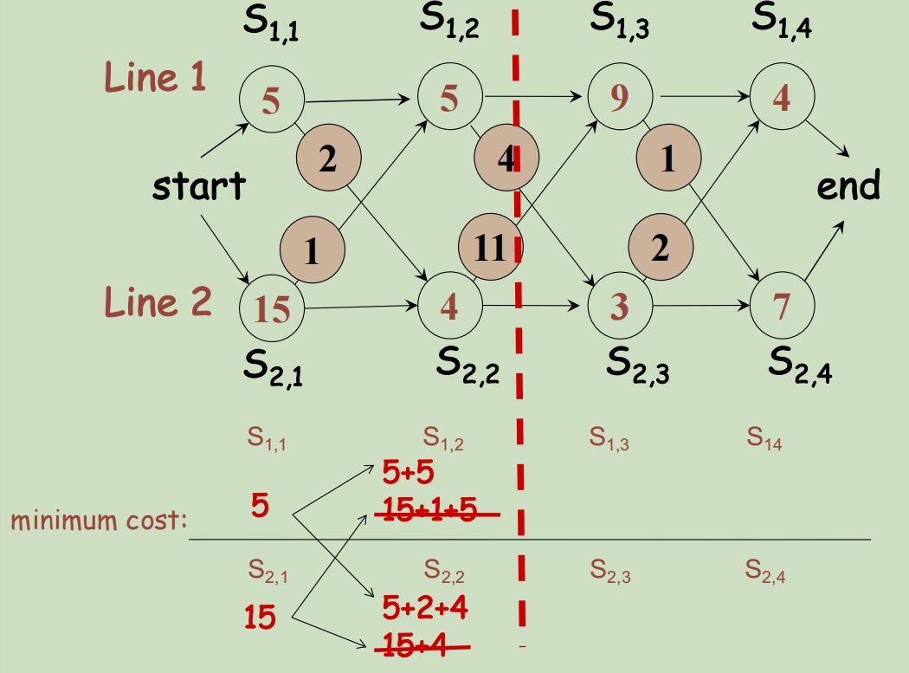
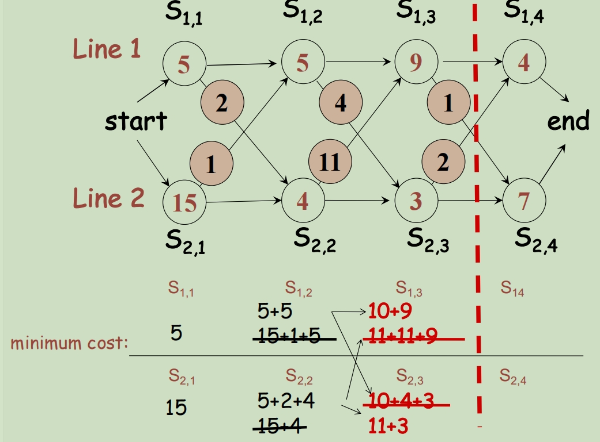
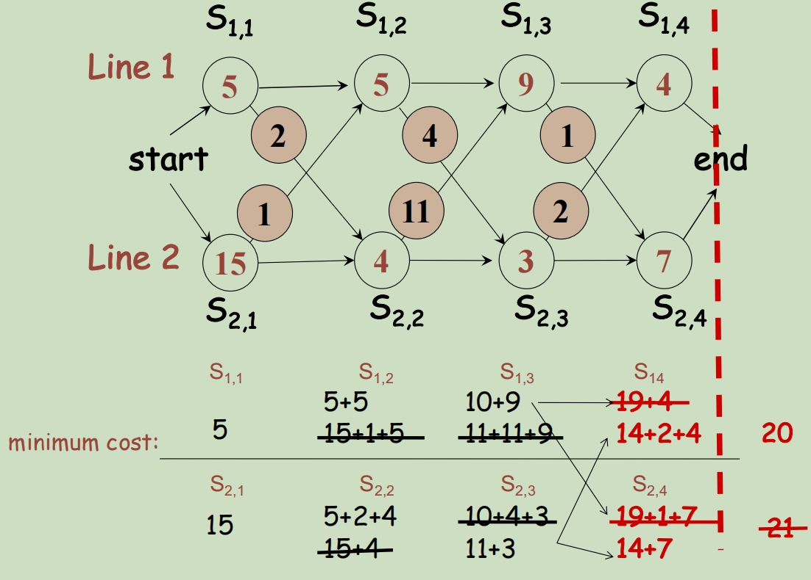
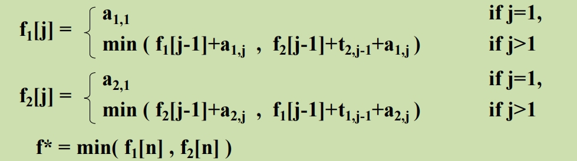
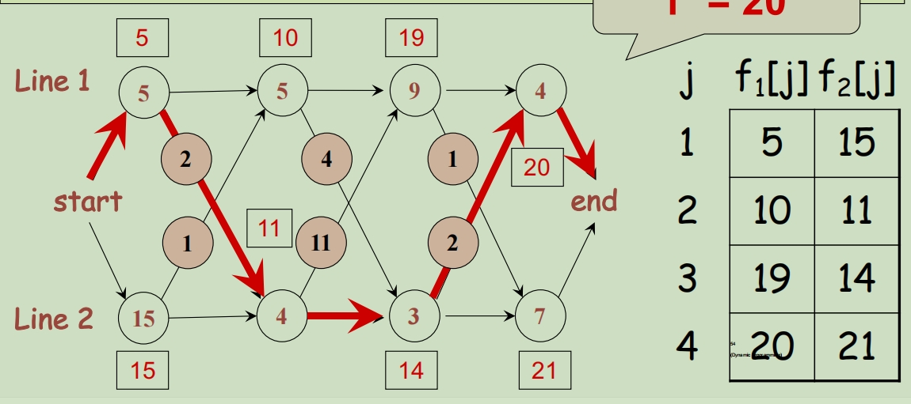

# Dynamic Programming 动态编程

## Fibonacci number F(n) 斐波那契数列

1, 1, 2, 3, 5, 8, 13, 21, 34, 55, 89.....

```c++
递归写法
很慢，要经过很多论的重复计算
Procedure F(n)
	if n==0 or n==1 then
		return 1
	else
		return F(n-1) + F(n-2)
```

```c++
Dynamic Programming version 动态规划
效率更高，时间复杂度为O(n)
Procedure F(n)
	Set A[0] = A[1] = 1
	for i = 2 to n do
		A[i] = A[i-1] + A[i-2]
    return A[n]
```

如果使用递归，那么将会进行许多轮重复的计算



如果可以省略掉大部分的内容，直接从最底部开始计算，然后将计算的结果存储到已经创建的列表当中，就能省下大量额时间



- Write down a formula that relates a solution of a problem with those of sub-problems.

  写下将问题的解决方案与子问题的解决方案联系起来的公式。

  E.g. F(n) = F(n-1) + F(n-2).

- Index the sub-problems so that they can be **stored** and **retrieved**easily in a table (i.e., array)

  对子问题进行索引，以便它们可以很容易地在表（即数组）中存储和检索

- Fill the table in some **bottom-up** manner; start filling the solution of the smallest problem.

  以某种**自下而上**的方式填写表格;开始填充最小问题的解决方案。

这确保了当我们解决一个特定的子问题时，所有的解决方案它所依赖的较小的子问题是可用的。

例题:

G(n) = 1, if 0 <= n <= 2

G(n) = G(n-1) + G(n-2) + G(n-3), if n > 2

```c++
Procedure G(n):
	set G[0], G[1], G[2] = 1;
  for i = 3 to n do:
		G[i] = G[i-1] + G[i-2] + G[i-3];
    return G[n];
```

## Assembly line scheduling 装配线调度

两条装配线，每一个都有n个节点，(S<sub>i,j</sub>: line i station j), S<sub>1, j</sub>和S<sub>2, j</sub>可以做相同的事情但是所需要的时间是不同的

总共有2n种选择，因此如果全都遍历一遍的话会非常花时间

a<sub>i, j</sub> 在S<sub>i,j</sub>装配点的时间

t<sub>i, j</sub> 从一条装配线转换到另一条装配线的时间



使用动态规划的方式来解决最短路径寻路问题(假设每条装配线都有n个节点)

1. 如果我们能分别计算穿过S<sub>1,n</sub>, S<sub>2,n</sub>的最快时间，其中最快的一条就是穿过整个流水线最快的解决方法
2. 为了能够知道穿过S<sub>1, j</sub>, S<sub>2, j</sub>的最快时间，我们需要计算穿过两条装配线每一个节点j的最快时间









潜在的问题有两个：

1. given j, what is the fastest way to get thro' S<sub>1,j</sub> 闯过第一条装配线的j节点需要的最快时间
2. given j, what is the fastest way to get thro' S<sub>2,j</sub> 闯过第二条装配线的j节点需要的最快时间

min {f<sub>1</sub>[n], f<sub>2</sub>[n]}

从源头开始，计算到达f<sub>1</sub>[n], f<sub>2</sub>[n]各自需要的最快时间

Q1：

1. 到达S<sub>1,j-1</sub>的最快时间，然后直接加上从S<sub>1,j-1</sub>到S<sub>1,j</sub> 的时间。需要消耗的时间：**f<sub>1</sub>[j-1] + a<sub>1, j</sub>**
2. 到达S<sub>2,j-1</sub>的最快时间，然后加上从line2转换到line1的t<sub>2,j</sub>的时间然后再加上S<sub>2,j</sub>的时间。需要消耗的时间：**f<sub>2</sub>[j-1] + t<sub>2,j-1</sub> + a<sub>1,j</sub>**

​	f<sub>1</sub>[j] = min(f<sub>1</sub>[j-1]+a<sub>1,j</sub>, f<sub>2</sub>[j-1]+t<sub>2,j-1</sub>+a<sub>1,j</sub>)

Q2:

1. 到达S<sub>2,j-1</sub>的最快时间，然后直接加上从S<sub>2,j-1</sub>到S<sub>2,j</sub> 的时间。需要消耗的时间：**f<sub>2</sub>[j-1] + a<sub>2, j</sub>**

2. 到达S<sub>1,j-1</sub>的最快时间，然后加上从line2转换到line1的t<sub>1,j</sub>的时间然后再加上S<sub>2,j</sub>的时间。需要消耗的时间：**f<sub>1</sub>[j-1] + t<sub>1,j-1</sub> + a<sub>2,j</sub>**

​	f<sub>1</sub>[j] = min(f<sub>2</sub>[j-1]+a<sub>2,j</sub>, f<sub>1</sub>[j-1]+t<sub>1,j-1</sub>+a<sub>2,j</sub>)





f<sup>*</sup> = 20

```c++
set f1[1] = a1,1
set f2[1] = a2,1
for j = 2 to n do
	begin
		set f1[j] = min ( f1[j-1]+a1,j , f2[j-1]+t2,j-1+a1,j )
		set f2[j] = min ( f2[j-1]+a2,j , f1[j-1]+t1,j-1+a2,j )
	end
set f* = min (f1[n] , f2[n] )
```

