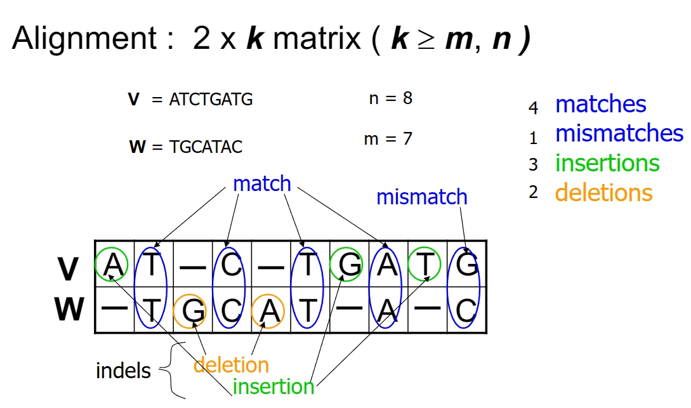
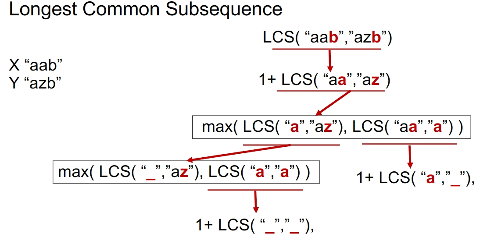
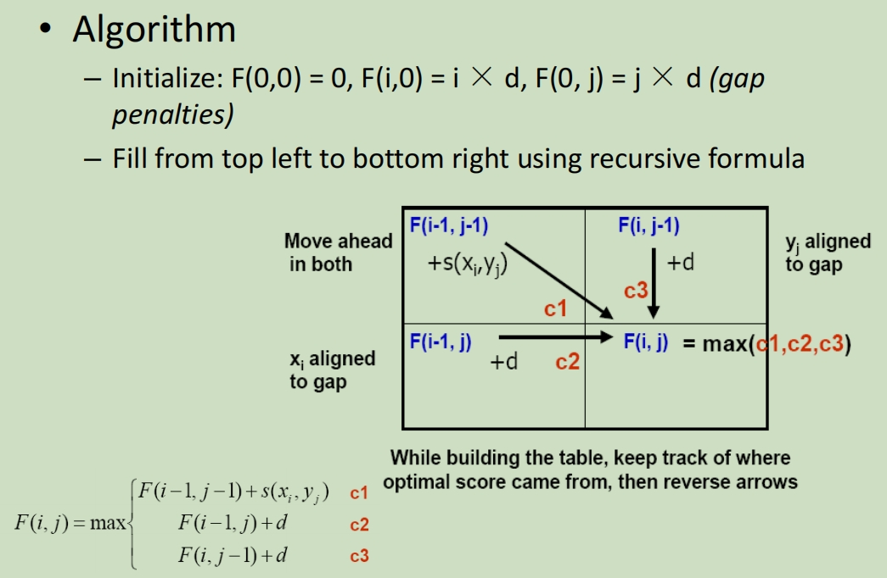
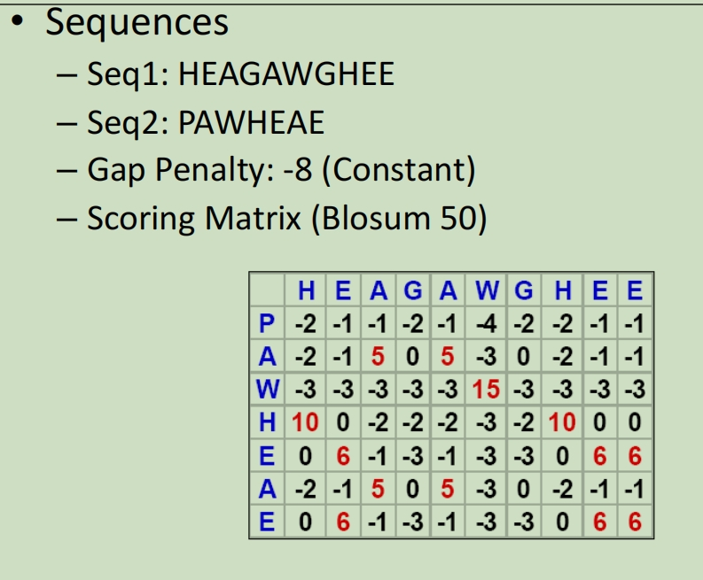
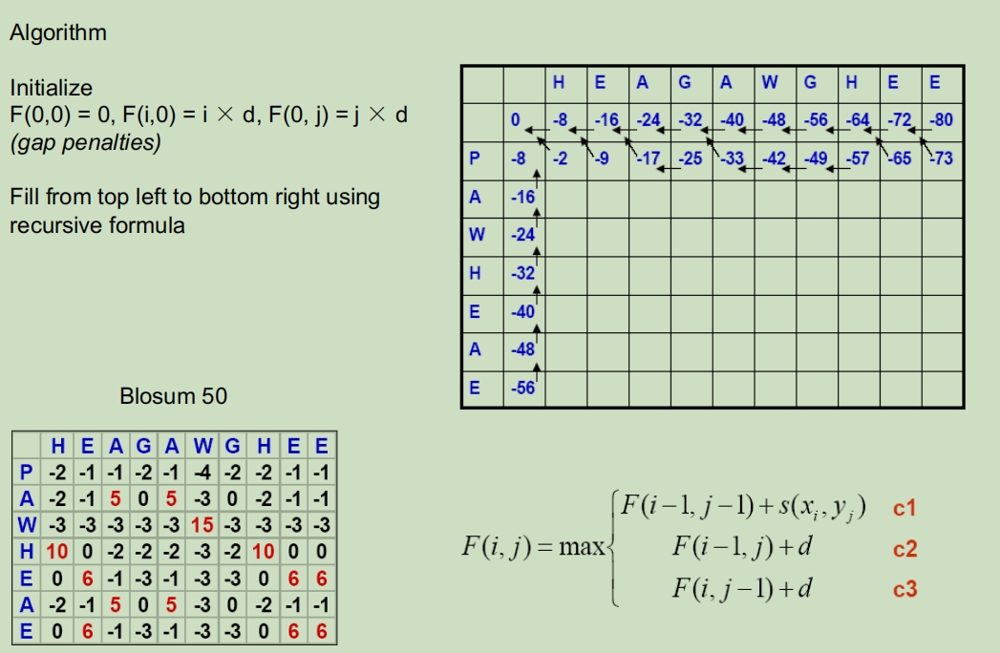
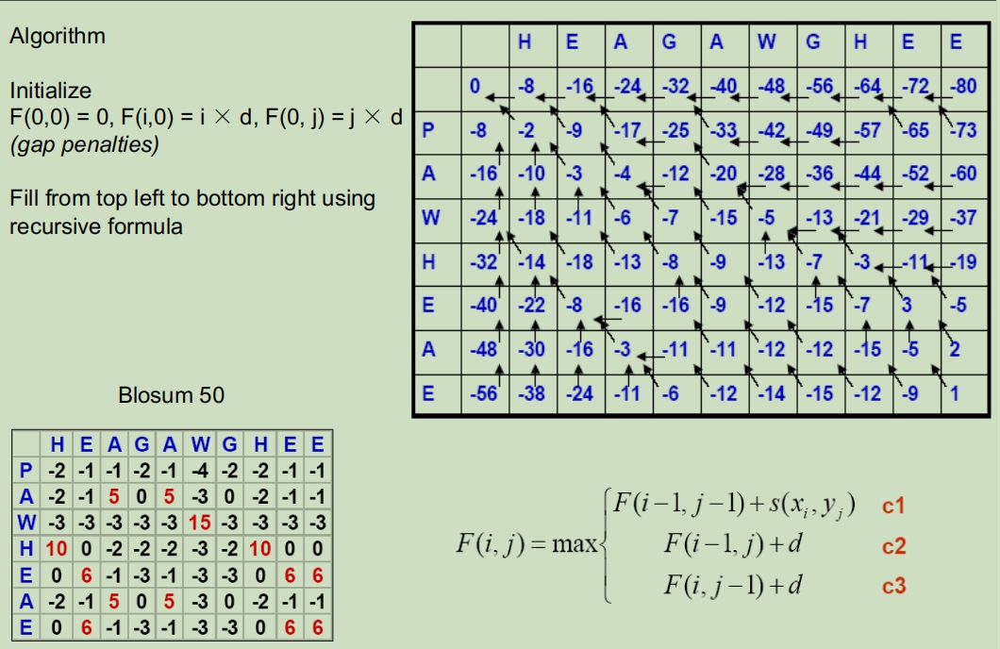
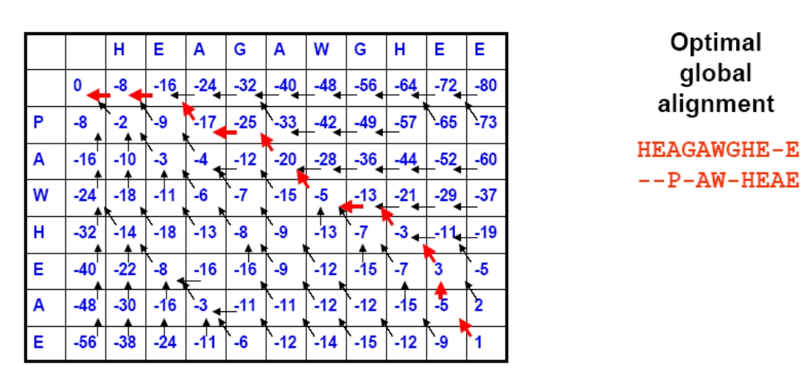
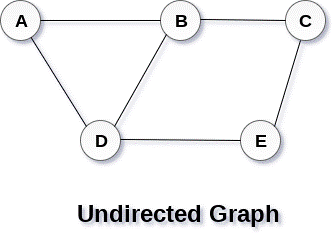

# Sequence Alignment By Dynamic Programming 通过动态规划进行序列比对

## DNA Sequence Comparison DNA序列比较

**Aligning DNA Sequences** **对齐DNA序列**

## Longest Common Subsequence (LCS) 最长公共子序列

最长公共子序列不是完全连续的子串，而是将给定序列中零个或者多个元素去掉后得到的结果（但是不改变元素间相对次序）。例如序列<A,B,C,B,D,A,B><A,B,C,B,D,A,B>的子序列有：<A,B><A,B>、<B,C,A><B,C,A>、<A,B,C,D,A><A,B,C,D,A>等。

- Common subsequence Z (of X and Y): a subsequence of X and also a subsequence of Y.

  X和Y的共同子序列Z：X的子序列，也是Y的子序列。

  - Z=CGA is a common subsequence of both X=ACGCTAC and Y=CTGACA.

    Z=CGA 是 X=ACGCTAC 和 Y=CTGACA 的共同子序列。

- Longest Common Subsequence (LCS): the longest one of common subsequences.

  最长公共子序列（LCS）：最长的公共子序列。

  - Z' =CGCA is the LCS of the above X and Y.

    Z' =CGCA 是上述 X 和 Y 的 LCS。

LCS problem: given X=<x1, x2,…, xm> and Y=<y1, y2,…, yn>, find their LCS. 

LCS 问题模式：给定 X=<x1, x2,..., xm> 和 Y=<y1,y2,..., yn>，求它们的 LCS。

注意：最长公共子序列（longest common sequence）和最长公共子串（longest common substring）不是一回事儿。什么是子序列呢？即一个给定的序列的子序列，就是将给定序列中零个或多个元素去掉之后得到的结果。什么是子串呢？给定串中任意个连续的字符组成的子序列称为该串的子串。

如上图，给定的字符序列： {a,b,c,d,e,f,g,h}，它的子序列示例： {a,c,e,f} 即元素b,d,g,h被去掉后，保持原有的元素序列所得到的结果就是子序列。同理，{a,h},{c,d,e}等都是它的子序列。它的字串示例：{c,d,e,f} 即连续元素c,d,e,f组成的串是给定序列的字串。同理，{a,b,c,d},{g,h}等都是它的字串。

### LCS Intuitive Solution (Brute Force)  LCS 直观解决方案（蛮力）

List all possible subsequences of X, check whether they are also subsequences of Y, keep the longer one each time.

列出 X 的所有可能的子序列，检查它们是否也是 Y 的子序列，每次保留较长的子序列。

给定序列1构造2n个子序列，看是否也是另一个给定序列2的子序列，直到找到最大且符合条件的子序列,O(2n)

### LCS Dynamic Programming (DP) LCS 动态规划 （DP）

- Initialization 初始化
- Recursive Solution 递归解决方案
- Trace Back 追溯

**Step 1: **确定最佳子结构

- 假如序列X的最后一个元素 与 序列Y的最后一个元素相等，那么X和Y的LCS就等于 {X减去最后一个元素} 与 {Y减去最后一个元素} 的 LCS 再加上 X和Y相等的最后一个元素。

- 假如X的最后一个元素 与 Y的最后一个元素不等（本例子就是属于这种情况），那么X和Y的LCS就等于 ： {X减去最后一个元素} 与 Y 的LCS， {Y减去最后一个元素} 与 X的LCS 中的最大的那个序列。

c[i, j]是Xi和Yj两个序列的LCS的长度

c[i, j] = 0	if i = 0,or j = 0

c[i, j] = c[i-1, j-1] + 1	if i, j > 0 and xi = yj

c[i, j] = max(c[i-1, j], c[i, j-1])	if i, j >0 and xi != yj

这里以s1={1,3,4,5,6,7,7,8},s2={3,5,7,4,8,6,7,8,2}为例。

图中的空白格子需要填上相应的数字（这个数字就是c[i,j]的定义，记录的LCS的长度值）。填的规则依据递归公式，简单来说：如果横竖（i,j）对应的两个元素相等，该格子的值 = c[i-1,j-1] + 1。如果不等，取c[i-1,j] 和 c[i,j-1]的最大值。首先初始化该表：

S1的元素3 与 S2的元素3 相等，所以 c[2,1] = c[1,0] + 1。继续填充：

S1的元素3 与 S2的元素5 不等，c[2,2] =max(c[1,2],c[2,1])，图中c[1,2] 和 c[2,1] 背景色为浅黄色。

至此，该表填完。根据性质，c[8,9] = S1 和 S2 的 LCS的长度，即为5。

构造LCS

本文S1和S2的最长LCS并不是只有1个，本文并不是着重讲输出两个序列的所有LCS，只是介绍如何通过上表，输出其中一个LCS。

我们根据递归公式构建了上表，我们将从最后一个元素c[8] [9]倒推出S1和S2的LCS。

c[8] [9] = 5，且S1[8] != S2[9]，所以倒推回去，c[8] [9]的值来源于c[8][8]的值(因为c[8] [8] > c[7] [9])。

c[8] [8] = 5, 且S1[8] = S2[8], 所以倒推回去，c[8] [8]的值来源于 c[7] [7]。

以此类推，如果遇到S1[i] != S2[j] ，且c[i-1] [j] = c[i] [j-1] 这种存在分支的情况，这里请都选择一个方向（之后遇到这样的情况，也选择相同的方向）。

这就是倒推回去的路径，棕色方格为相等元素，即LCS = {3,4,6,7,8}，这是其中一个结果。

如果如果遇到S1[i] != S2[j] ，且c[i - 1] [j] = c[i] [j-1] 这种存在分支的情况，选择另一个方向，会得到另一个结果。

### Pairwise Sequence Alignment Problem 双序列比对问题

给定两个序列，遍历并比对序列元素，根据元素比对结果按照**打分表**上对应的score值累加score。求解比对到末尾为止，最大的总的score（两串序列的相似度）

维护一个当前最大score的二维矩阵，依次从1，1迭代到各自的总长度（或者从各自的总长度递归至1，1）。
举个例子，现在比对字符串abc和abh，求现在最大的score，在以下三种中选最大

1. 取ab和ab的socre加上c，h的打分表值	c1
2. 取ab和abh的score加上一个gap的值（因为ab短于abh），暂时忽略c    c2
3. 取abc和ab的score加上一个gap的值（因为ab短于abc），暂时忽略h     c3

恒顶间隙惩罚:

非恒定间隙惩罚：

– xi  -> i th letter of string x
– yj  -> j th letter of string y
– x1..i ->  prefix of x from letters 1 through i
– F ->  matrix of optimal scores (DP Matrix), F(i, j) represents optimal score lining up x1..i with y1..j F(i, j)代表将x1..i与y1..j对其的最佳分数

– d -> gap penalty	gap惩罚
– s -> scoring matrix	得分矩阵(会提供)

**Global:**

F(i, j)的值是计算由对比从三个方向计算得到的最大值

Example:

有以下已知条件

接下来先将最左边的列和最上边的行的值填入。因为都是两个字符序列的每个字符跟空值比都是mismatch的，因此要一直减去gap penalty -8。

然后就是对每个F(i, j)进行比对，选择max(c1, c2, c3)的值填入

最后从右下角回溯到左上角

– Diagonal – both match 对角线 –> 两者都匹配
– Up – left sequence match a gap 向上 –> 左序列匹配间隙
	– Or insert a gap to top sequence 或在顶部序列中插入一个间隙
– Left – top sequence match a gap 左 –> 顶部序列匹配间隙
	– Or insert a gap to left sequence 或者在左边的序列中插入一个间隙

对于横轴而言，竖着的箭头代表一个-(gap)
对于纵轴而言，横着的箭头代表一个-(gap)

**Local:**

与global相似，不过是从最大值开始取

要使用非恒定间隙惩罚公式

Question:

Suppose there are 10 people in a room. Each person shakes hands with  some other people in the room. Prove that:

The number of people having an odd number of handshakes is even.

graph G ( V, E )

a vertex = one person

edge (vi, vj) = shake hands

The question can be transform to "In the graph G=(V, E), the number of vertices with odd degree is even."

degree代表每个vertex的的边的数量，在本题中代表握一次手。然后10个人每个人相互之间都要握一次手的话，那么最后的握手的总数就是偶数，然后对于那些vertex的边是偶数个的，最后相加之后等于偶数，那么结果是偶数，偶数边相加是偶数，那么握手次数是技术的人也一定是偶数个，因为最终所有握手奇数次的人的握手总数相加应该也是偶数。