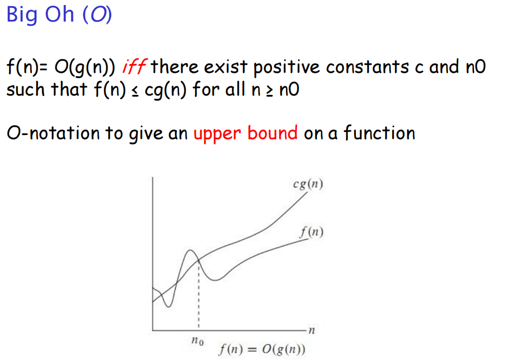
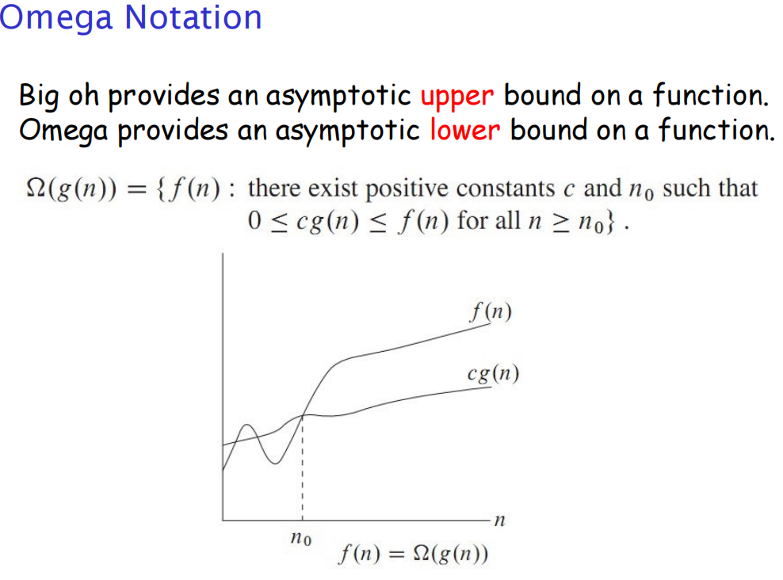
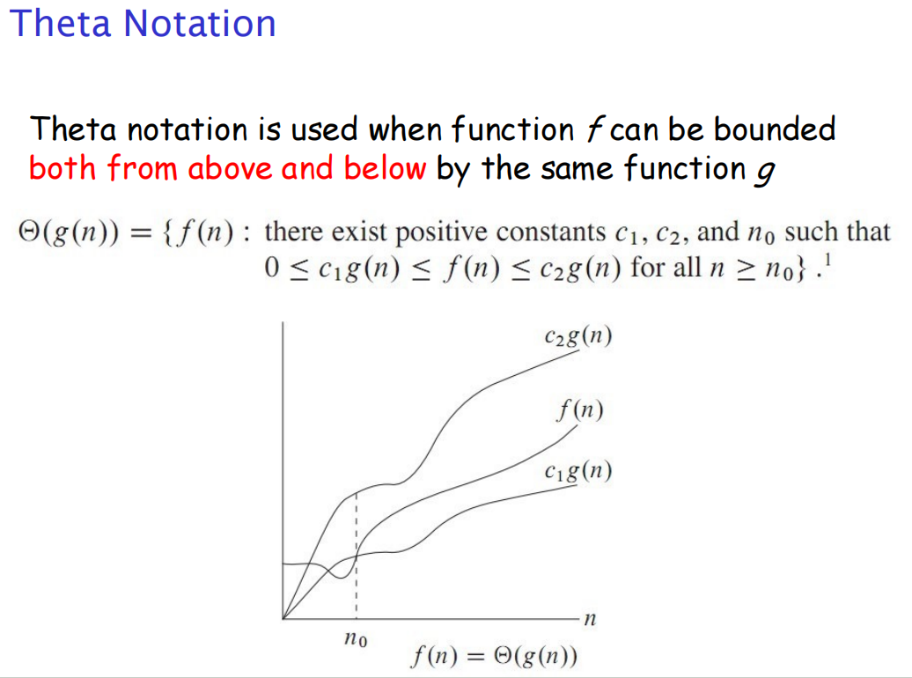
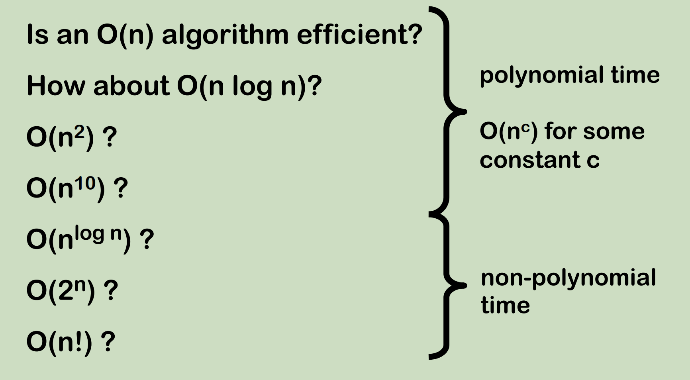
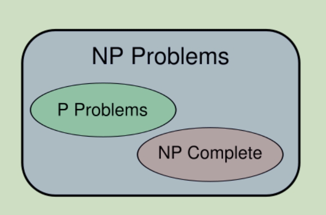
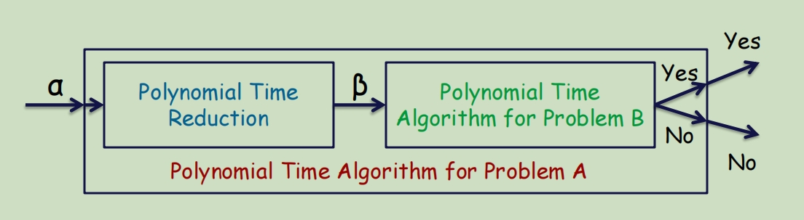
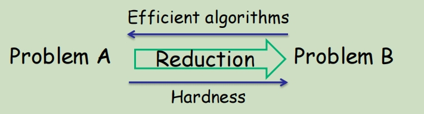
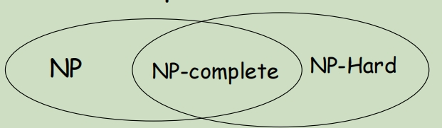
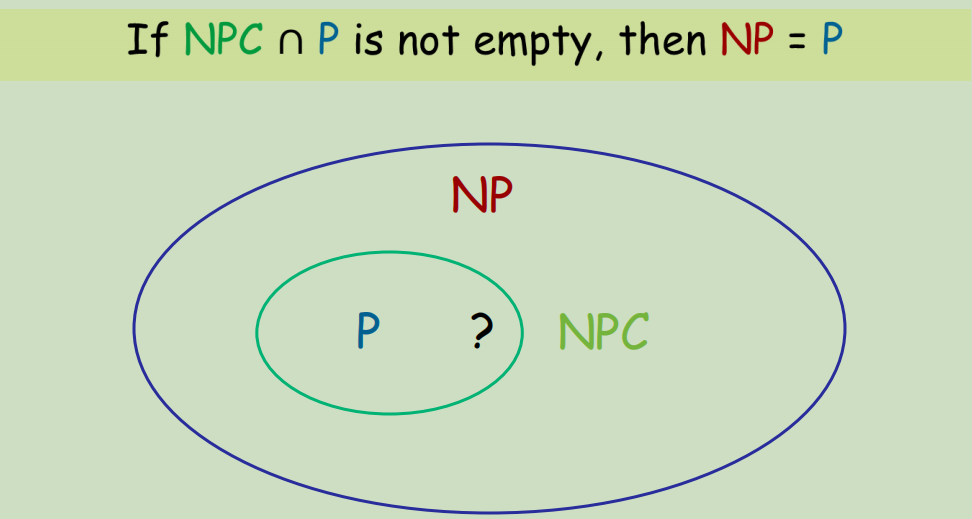

# The Limitations of Algorithm Power 算法能力的限制

Introduction to Computational Complexity Theory

## Complexity Definition:

至今学习过的算法的时间复杂度:

- Linear Search: O(n)
- Binary Search: O(log n)
- Merge Sort: O(nlogn)
- Matrix Multiplication: O(n3)
- o/1 Knapkack: O(2n)
- Traveling Sales Person: O(2n)
- Hamilton Circle: O(2n)

## Hard Computattion Problem

尽管算法能简化很多问题的求解，但是算法对效率的优化依然是存在极限的，可以被证明难以计算的问题被称为NP 问题

**P问题**：

**The complexity class P** is the set of all decision problems that can be **solved** in worst-case **polynomial time**.

**复杂度类 P** 是所有能在最坏情况下，仍然可以在多项式时间**解决**的决策问题的集合。

**NP问题**：

**The complexity class NP** is the set of all problems that can be **verified** in **polynomial time**.

复杂度类NP**是在**多项式时间内**验证**的所有问题的集合。但不保证同样可以在多项式时间内被解决。

当一个算法能在**多项式时间复杂度内**解决某一类问题时，我们就认为其是一个高效的算法。但是也存在以一类非常难以计算求解的问题，我们没法设计出一个在多项式时间复杂度内解决这些的问题的算法，这一类问题就被称作 NP 问题（NP Problems）。

What is the effective Algorithm? 什么是高效算法

**注意：不是Non-polynomial（非确定性多项式问题）。**

**P与NP的关系**：

显然P问题一定能够在多项式时间下验证其结果所以**P问题是NP问题**。同时P问题是能够在多项式时间内解决的问题。所以**P问题是NP问题中较为简单的一类**。

**P = NP** or **NP != P** ?
那么现在我们知道我们所有讨论的问题都是NP的问题，同时我们知道在解决一个问题的同时算法的好坏不同，他们的时间复杂度也会不同。**那么是否存在一种算法可以将非P问题转化成P问题呢？如果可以那么P问题与NP问题就等价了（P = NP）**。比如分解质因数的问题后来被证明是一个P问题。但是现在数学界任然没有明确的答案，**P/NP问题是一个在理论信息学中计算复杂度理论领域里至今未被解决的问题，我们至今无法证明 NP = P or NP ≠ P**

However, there is a common belief that P is different from NP ,which means there is some problem in NP that is not in P.

然而，人们普遍认为P不同于NP，这意味着NP中存在一些不属于P的问题。(详情见上图)

证明P = NP这个问题的本身也是一个NPC问题

一些NP的例子：

1. Hamiltonian Circuit哈密顿图
2. Knapsack problem背包问题
3. Circuit-SAT

对于上述的三种问题，我们只能通过穷举所有可能的解来找到最合适的答案。

**The Class P**:

**MST problem is in P**

- Given a weighted graph G and a value k, does there exists an MST with weight at most k?

- run Kruskal’s algorithm (polynomial time) and if the MST found has weight at most k, then the answer is "Yes"

**Single-source-shortest-paths problem is in P**

- Given a weighted graph G, a source vertex s, and a value k, does there exist shortest paths from s to every other vertex whose path length is at most k?

- run Dijkstra’s algorithm (polynomial time) and if the paths found have lengths at most k, then answer is "Yes"

**The Class NP**:

**Hamiltonian circuit problem is in NP**

- we can check in polynomial time if a proposed circuit is a Hamiltonian circuit

  我们可以在多项式时间内检查所提出的电路是否是哈密顿电路

**0/1 Knapsack problem is in NP**

- we can check in polynomial time if a proposed subset of items whose weight is at most W and whose value is at least k

  我们可以在多项式时间内检查所提出的项目子集是否权重最大为 W，且值至少为 k

**Circuit-SAT is in NP**

- we can check in polynomial time if proposed values lead to a final output value of 1

  我们可以在多项式时间内检查所提出的值是否会导致最终输出值为 1

**Why Study NP/P?**

1. **Understanding Computational Limits**: Knowing whether a problem is in P or NP helps understand the inherent difficulty of solving certain problems and whether they can be feasibly solved as the size of the input grows.

   **了解计算极限**：了解一个问题属于 P 或 NP 范畴，有助于理解解决某些问题的内在难度，以及随着输入量的增加，这些问题是否可以被解决。

2. **Algorithm Development**: If a problem is in P, it can usually be solved efficiently, which encourages the development of effective algorithms. If it's NP-complete or NP hard, while a polynomial-time solution may not be currently available, it motivates the  search for approximate algorithms or heuristics that can solve the problem reasonably well in practice.

   **算法开发**：如果问题属于 P，通常可以高效地解决，这就鼓励了有效算法的开发。如果问题是 NP-完全或 NP-困难，虽然目前可能还没有多项式时间的解决方案，但它会促使人们寻找近似算法或启发式算法，以便在实践中合理地解决该问题。

3. **P vs NP Question**: This is one of the seven Millennium Prize Problems for which the Clay Mathematics Institute offers a $1 million prize for a correct solution. Determining whether P equals NP is fundamental to understanding the limits of what can be computed.

   **P 与 NP 问题**：这是七个千禧年奖问题之一，克雷数学研究所为正确答案提供一百万美元奖金。确定 P 是否等于 NP 是了解计算极限的基础。

## Decision/Optimisation Probelms 决策/优化问题

- A decision problem is a computational problem for which the output is either **yes** or **no**.

  决策问题是一个计算问题，其输出是 **"是 "**或 **"否"**。

- In an optimisation problem, we try to **maximise** or **minimise** some value.

  在优化问题中，我们尝试**最大化**或**最小化**某些值。

- An **optimisation** problem can be turned into a **decision** problem if we add a parameter k; and then ask whether the optimal value in the optimisation problem is **at most** or **at least** k.

  如果我们添加一个参数 k，然后问优化(optimisation)问题中的最优值是**最多是多少**还是**最少是多少**，那么优化(optimisation)问题就可以转化为决策(decision)问题。

- Note that if a decision problem is **hard**, then its related optimisation version must also be hard.

  请注意，如果一个决策问题是**hard**，那么它的相关优化版本也一定是hard。

Example:

- MST

  - **Optimisation problem:** Given a graph G with integer weights on its edges. What is the weight of a **minimum** spanning tree (MST) in G?

    给定一个边上有整数权重的图 G。G 中**最小**生成树（MST）的权重是多少？

  - **Decision problem:** Given a graph G with integer weights on its edges, and **an integer k**. Does G have a MST of weight **at most k** ?

    给定一个边上有整数权重的图 G 和一个**整数 k**。G 是否有一个权重**至多为 k** 的 MST？

- Knapsack problem

  - **Input:** Given n items with integer weights w1, w2, …, wn and integer values v1, v2, …, vn, a knapsack with capacity W and a value k.

    给定具有整数权重w1、w2、…、wn和整数值v1、v2、…、vn的n个项目，具有容量W和值k的背包。

  - **Optimisation problem:** Find a subset of items whose total weight does not exceed W and  that **maximises** the total value.

    找出总重量不超过 W 的物品子集，使总价值**最大**。

  - **Decision problem:** For **any integer k**, is there a subset of items whose total weight does not exceed W and whose total value is **at least k** ?

    对于 **任意个整数 k**，是否存在总重量不超过 W 且总价值 **至少为 k** 的物品子集？

- practice: State the decision version of the following problems
  - Optimisation version: Given a **weighted** graph G and a source vertex a, find the **shortest** paths from a to every other vertex
  - Solution: Given a weighted graph G, a source vertex a and **a value k**, are there shortest paths from a to every other vertex such that each path is of weight **at most k** ?

## Undecidable problems

not all Decision Problems Be Solved By Algorithms. 并不是所有的决策问题都可以用算法来解决。

The problems can not solved by algorithms is called undecidable problems. 算法无法解决的问题被称为不可判定问题。

One such a problem is **Halting Problem**:

- Given a computer program and an input to it, determine whether the program will halt on that input or continue working indefinitely on it

  给定一个计算机程序和一个输入，确定该程序是在输入时停止运行还是继续无限期运行

## Solving/Verifying a problem

解决问题和验证问题是两个不同的概念。当一个问题的可能的解甚至无法被验证时，就更不用谈解决了, 但是我们想要验证一个问题的解是否正确不一定要知道问题如何解决。

Solving a problem is different from verifying a problem： 解决问题不同于验证问题：

- **solving:** we are given an input, and then we have to FIND the solution

  **求解：**我们得到一个输入，然后我们必须找到解决方案

- **verifying:** in addition to the input, we are given a **"certificate"** and we verify whether the certificate is indeed a solution

  **验证：** 除了输入之外，我们还得到一个**"证明"**，我们要验证该证明是否确实是一个解决方案

We may not know how to solve a problem efficiently, but we may know how to verify whether a candidate is actually a solution

我们可能不知道如何高效地解决问题，但我们可能知道如何验证候选方案是否真的是解决方案

## Polynomial-time reduction 多项式时间缩减

Given any two decision problems A and B, we say that: 给定任意两个决策问题A和B，我们说

1. A is polynomial time reducible to B, or 

   A是多项式时间可约为B，或者

2. there is a polynomial time reduction from A to B

   存在从A到B的多项式时间缩减

if given any input α of A, we can **construct** in **polynomial time** an input β of B such that α is yes if and only if β is yes.

如果给定A的任意输入α，我们可以在多项式时间内构造一个B的输入β，使得当且仅当β为yes时，α为yes。

We use the notation A<= PB

Intuitively, this means that problem **B** is at least as difficult as problem **A**

直观地说，这意味着问题**B**至少和问题**A一样难**

**Reduction**: a transformation between instance α of Problem A and instance β of Problem B such that: 

问题a的实例α与问题B的实例β之间的变换，使得:

- The transformation takes **polynomial time** 这个变换需要多项式时间
  - Polynomial in size of the input instance 输入实例大小的多项式

- The answer for α is “YES” **if and only if** the answer for β is also “YES” α的答案是“是”当且仅当β的答案也是“是”

If problem A is **reducible** to problem B in polynomial time, which means Problem B is at least **as hard as** Problem A.

如果问题A在多项式时间内可简化为问题B，这意味着问题B至少和问题A一样hard。

### Two Ways to Use Reductions 

Suppose Problem A is reducible to Problem B

**Solve problem**

If there exists **efficient algorithm** for Problem B, then we can solve Problem A efficiently

**Prove Hardness**

If Problem A is hard, then Problem B is also hard

**NP-hardness**

- A problem M is said to be **NP-hard** if every other problem in NP is polynomial time reducible to M

  如果 NP 中的每个其他问题都可以用多项式时间还原为 M，则称问题 M 为 **NP  hard**。

  - intuitively, this means that M is at least as difficult as all problems in NP

    直观地说，这意味着 M 的难度至少与 NP 中所有问题的难度相当。

- M is further said to be NP-complete if  进一步说M是np完全的，如果
  - M is in NP, and
  - M is NP-hard

**NP-Completeness**

Problem A is NP-complete if:

1. Problem A is **in NP**
2. For **any** Problem A’ in NP, A’ is **reducible** to A in polynomial time

Class NPC: The class of all NP-complete problems, which is a subclass of NP

- The **hardest** problems in NP

- Solve **a** problem in NPC, you can solve **ALL** problems in NP

**NP-Complete Problem**

- The **Cook-Levin Theorem** states that Circuit-SAT is NP-complete (a “first” NP-complete problem)
- Using polynomial time reducibility we can show existence of other NP-complete problems

A useful result to prove NP-completeness:

Lemma: **If L1 <= pL2 and L2 <= pL3, then L1 <= pL3**

**Proof of NP-Completeness**

Given a Problem A, prove that A is NP-complete:

**Proof Scheme 1:**

- Show Problem A is in **NP** (easier part)

- For all Problems in **NP**, reduce them to A in **polynomial time**
  - This has been done for 3SAT, the first NP-complete problem

**Proof Scheme 2:**

- Show Problem A is in **NP** (easier part)

- For arbitrary problem A’ in **NPC**, reduce A’ to A in **polynomial time**
  - This would be much easier

**NP-Complete Problems example:**

- Hamiltonian Circuit Problem

- 0/1 Knapsack Problem

- Circuit-SAT

- CNF-SAT and 3-SAT (conjunctive normal form satisfiability problem)

- Vertex Cover

