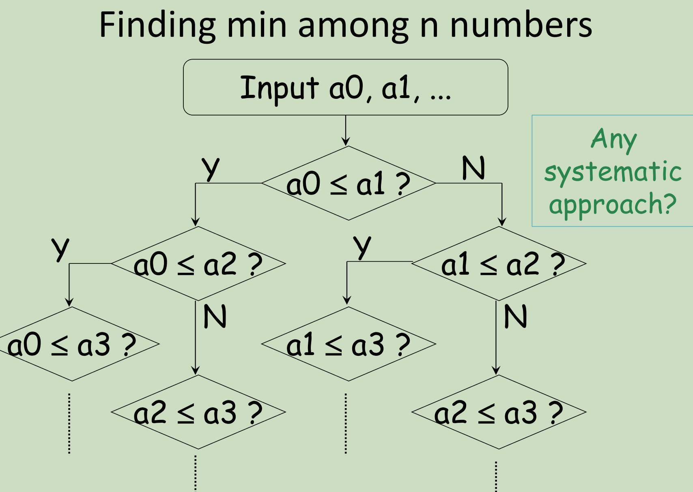
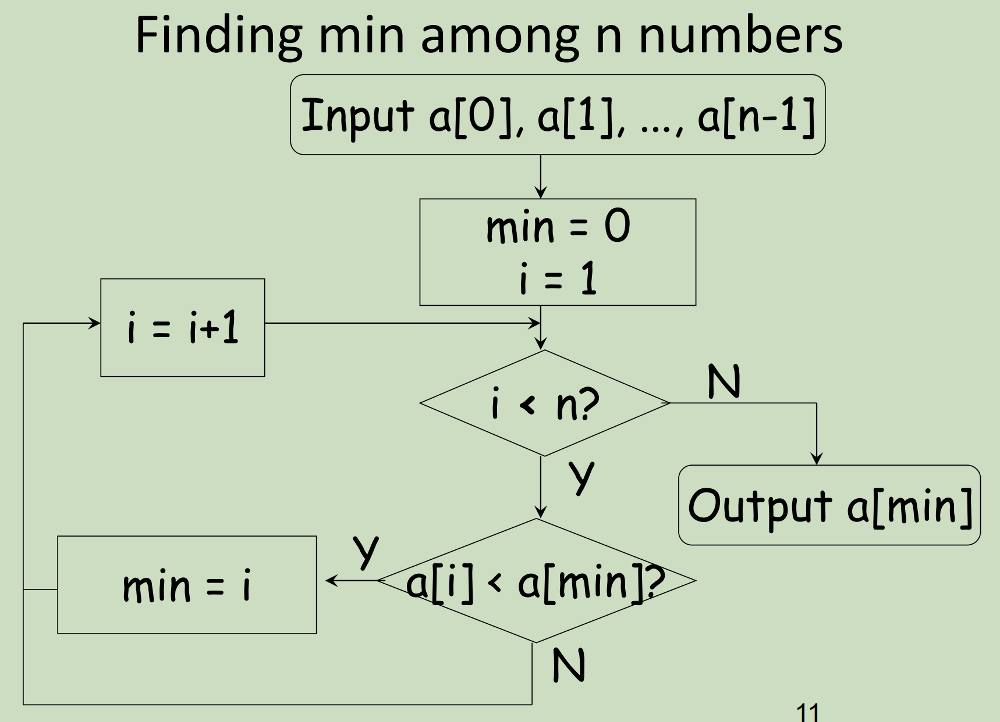
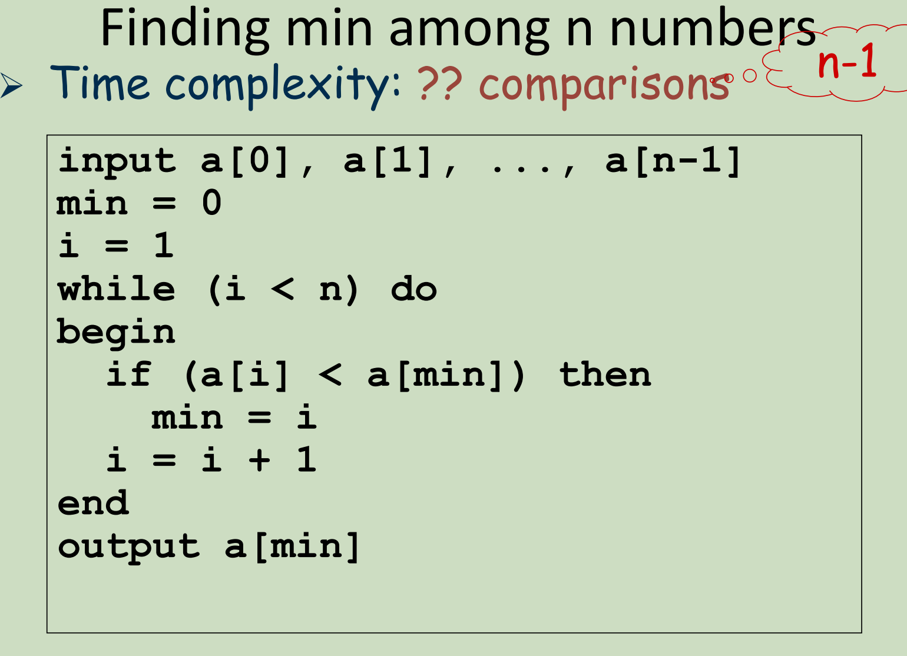
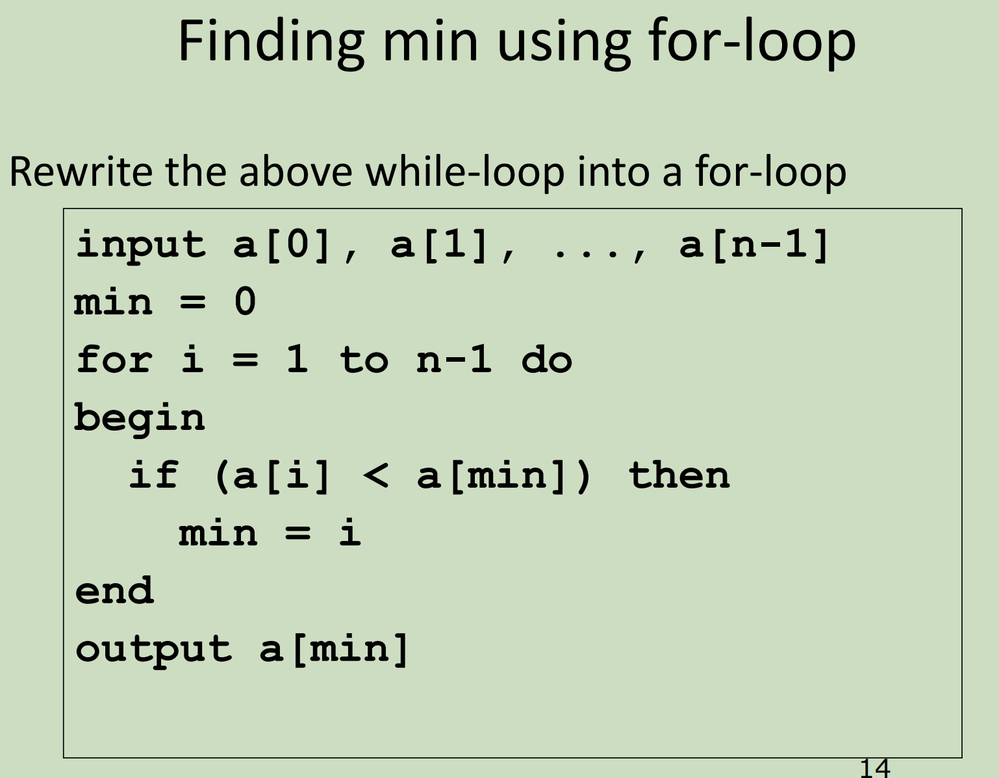
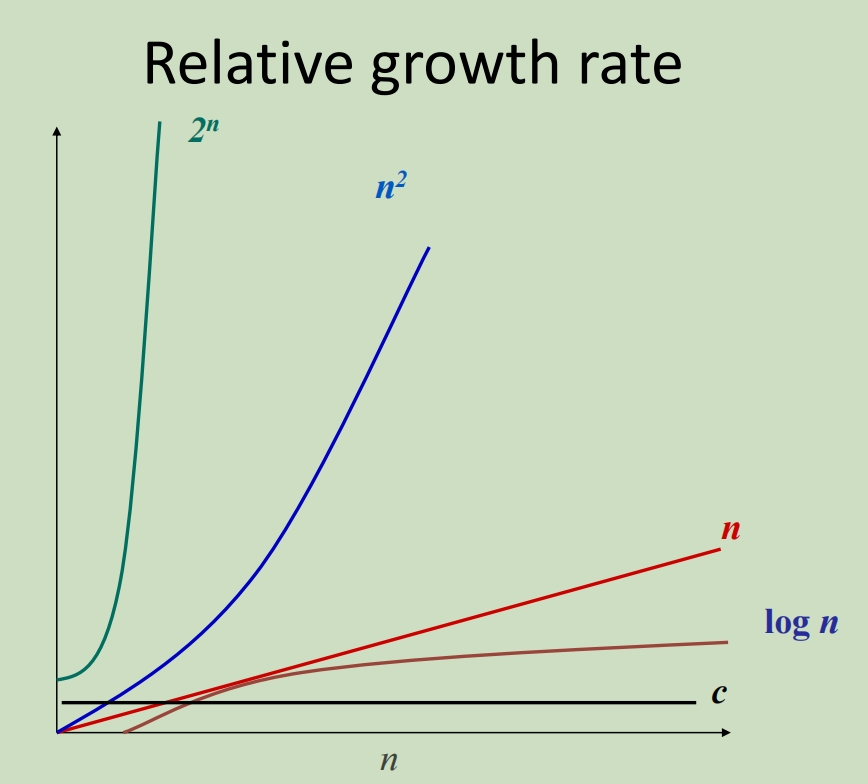
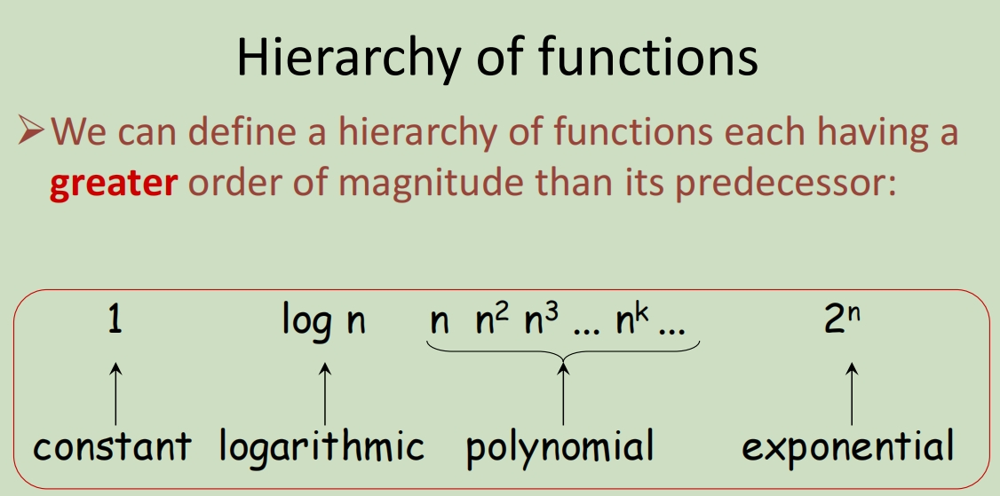
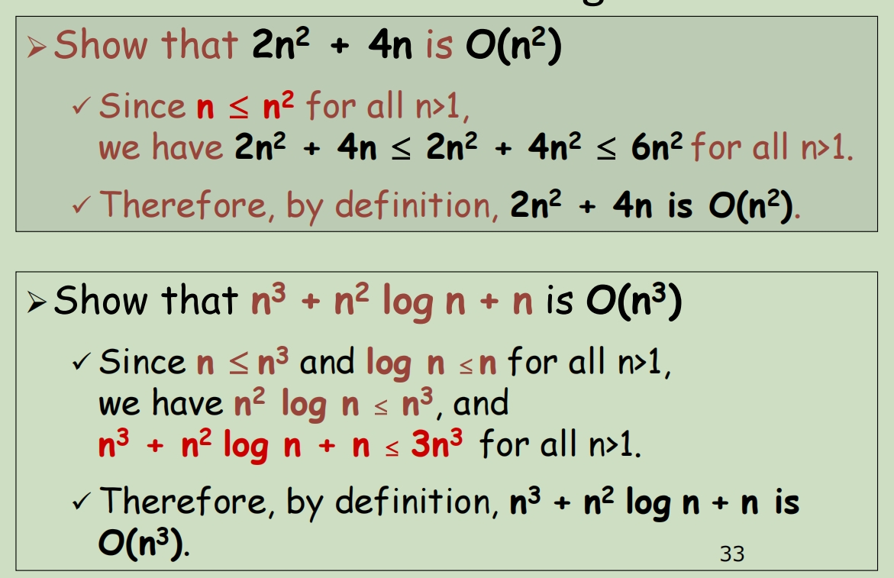
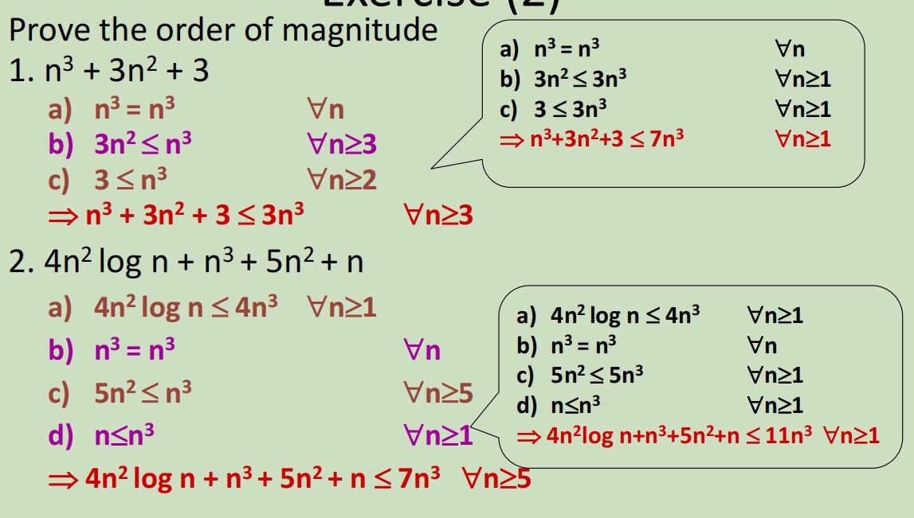
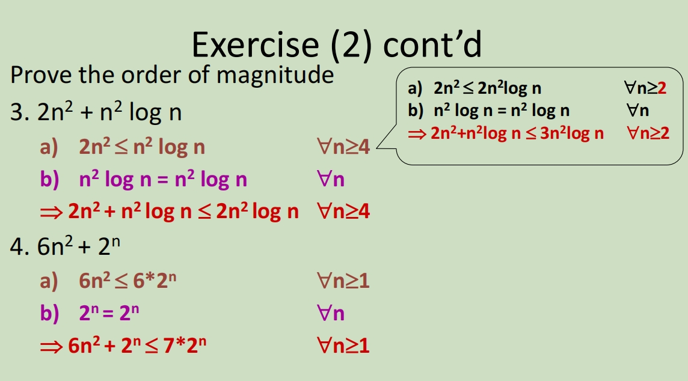

# Algorithm Introduction

## Introduction

Algorithm design is a foundation for efficient and effective programs

**Algorithms + Data Structures = Programs**

### Aims of Learning Algorithm 期望

- To give an overview of the study of algorithms in terms of their **efficiency**

- To introduce the standard algorithmic **design patterns** employed in the development of efficient algorithmic solutions.

- To describe the **analysis** of algorithms in terms of the use of formal models of Time and Space.

- To give a brief introduction to the subject of **computational complexity theory** and its use in classifying computational problems

### What is Algorithm?

A sequence of **precise and concise** instructions that guide you (or a computer) to solve a class of **specific** problem

一系列**精确而简洁**的指令，指导您（或计算机）解决一类**特定**问题

input  ---> Algorithm ---> output

### Algorithm VS Program

Algorithms are free from grammatical rules

​	– Content is more important than form

​	– Acceptable as long as it tells people how to perform a task

算法不受语法规则的约束

​	– 内容比形式更重要

​	– 只要它告诉人们如何执行任务，就可以接受

Programs must follow some syntax rules

​	– Form is important

​	– Even if the idea is correct, it is still not acceptable if there is syntax error

More Generally: Program = Data Structure + Algorithm

程序必须遵循一些语法规则

​	– 形式很重要

​	– 即使这个想法是正确的，如果存在语法错误，它仍然是不可接受的

更一般地说 程序 = 数据结构 + 算法

## Pseudo Code

### Statement

1. Assign Statement

   **variable = expression**

2. Compound Statement

​		**begin**

​			**statement1**

​			**statement2**

​		**end**

### Conditional

- Conditional Statement

  - **if condition then**

    ​	**statement**

    if a < 0 then

    ​	a = -a

    ​    abs = a

    output abs

  - **if condition then**

    ​	**statement**

    **else**

    ​	**statement** 

    if a > 0 then

    ​    abs = a

    else

    ​    abs = -a 

    output abs

### Iterative (Loop)

- Iterative Statement

  - **for var = start_value to end_value do **

    **statement**

  - ​	**while condition do** (Condition to continue the loop)

    **statement**

  - **repeat**

    ​    **statement**

    **until condition **(Condition to stop the loop)

## Algorithm Efficiency (Asymptotic Analysis 渐进分析)

How fast is the program?

Identify some important operations/steps and count how many times these operations/steps needed to executed

确定一些重要操作/步骤，并计算这些操作/步骤需要执行多少次

How to measure efficiency?

Number of operations usually expressed in terms of input size

通常用输入大小表示的操作数

Using a example to explain above theory

### Why Efficiency Matter?

- speed of computation by hardware has been improved 硬件计算速度得到提高

- efficiency still matters 效率仍然很重要

- ambition for computer applications grow with computer power 计算机应用的野心随着计算机能力的增长而增长

- demand a great increase in speed of computation  要求大幅提高计算速度

## Time Complexity 时间复杂度

时间复杂度是指算法执行所需时间与输入规模之间的关系。它衡量的是随着输入规模增加，算法的执行时间增长速度。通常用大O符号（O）表示，记作O(f(n))，其中f(n)是问题规模n的某个函数。

1. 算法频度f(n)：该算法基本操作需要执行的次数
2. 辅助函数g(n): n取无穷时可近似f(n) （n趋近无穷时，lim f(n)/g(n) 等于一个常数）

3. 时间渐进复杂度O(g(n)): 时间复杂度，通常用O(n)表示运行算法的规模，在代码分析中主要取决于循环语句执行次数。

下图展示了时间复杂度之间的大小比较关系

1. O(1)：常数时间复杂度，表示算法的执行时间不随输入规模增加而增加，如简单的赋值操作。

2. O(log n)：对数时间复杂度，常见于二分查找等算法。

3. O(n)：线性时间复杂度，执行时间与输入规模成正比，如遍历数组。

4. O(n log n)：线性对数时间复杂度，常见于快速排序、归并排序等基于比较的排序算法。

5. O(n^2)：平方时间复杂度，通常出现在简单的嵌套循环中，如冒泡排序。

6. O(2^n)、O(n!)等：指数和阶乘时间复杂度，通常表示算法效率很低。

   从上到下，relative growth rates increase相对增长率增加

functions involving powers of n (e.g. n, n^2...) is called **polynomial functions** 多项式函数

function involving powering by n (e.g. 2^n ...) is called **exponential functions **指数函数

### Hierarchy of function 功能层次结构

We can further refine the hierarchy by inserting **n log n** between **n** and **n** **2** ,**n** **2** **log n** between **n** **2** and **n** **3**, and so on.

我们可以通过在 **n** 和 **n** **2** 之间插入 **n log n** 、**n** **2** **log n** 和 **n** **3** 之间来进一步细化层次结构，依此类推。

### Big-O notation 大O表示法

因此再应用到方程中时，可以根据查找其中最大的层级

例如：f(n) = 2n^3 + 5n^2 + 4n + 7

The term with the highest power is 2n^3 .

The growth rate of f(n) is dominated by n^3 .

**f(n) = O(g(n)) *[read as f(n) is of order g(n)]***

**f(n) = O(g(n))**: There exists a constant **c** and **no such that f(n) <= c g(n)** for all n > no

存在一个常数 **c** 和 **no**，使得 **f（n）<= c g（n）** 对于所有 n > no

Roughly speaking, this means f(n) is at most **a** **constant times g(n)** for all large n 

粗略地说，这意味着 f（n） 对于所有大 n 最多是 **a** **常数乘以 g（n）**

Examples

– 2n3 = O(n3 )

– 3n2 = O(n2 )

– 2n log n = O(n log n)

– n 3 + n2 = O(n3 )

function on L.H.S and function on R.H.S are said to have the **same order of magnitude**

据说 L.H.S 上的函数和 R.H.S 上的函数具有**相同的数量级**

### Proof Order of Magnitude 数量级证明

