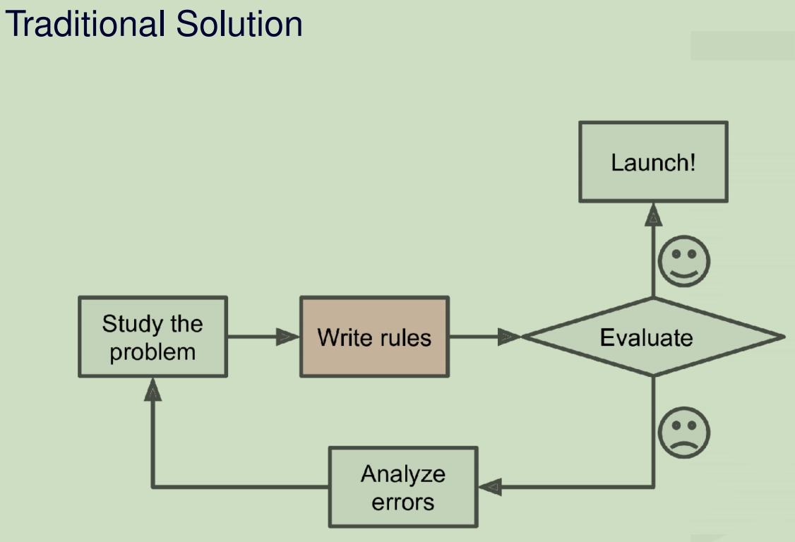
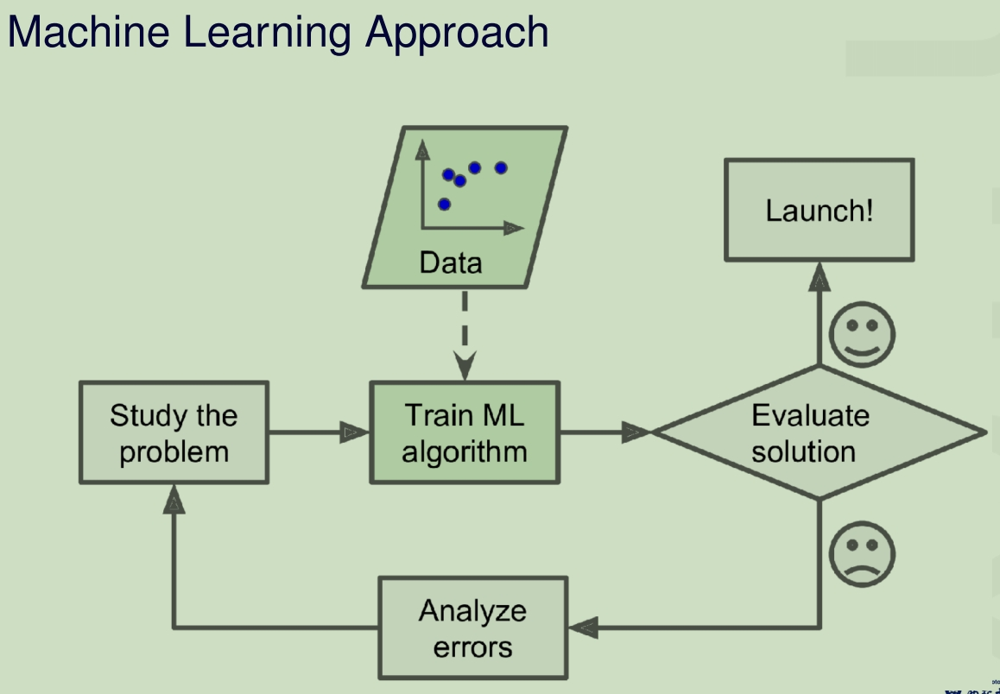
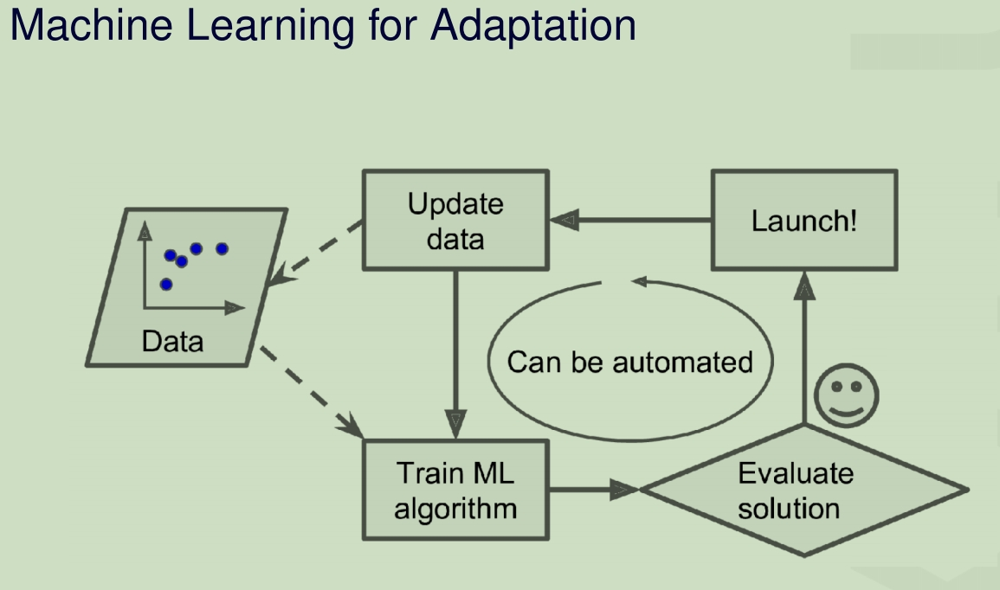
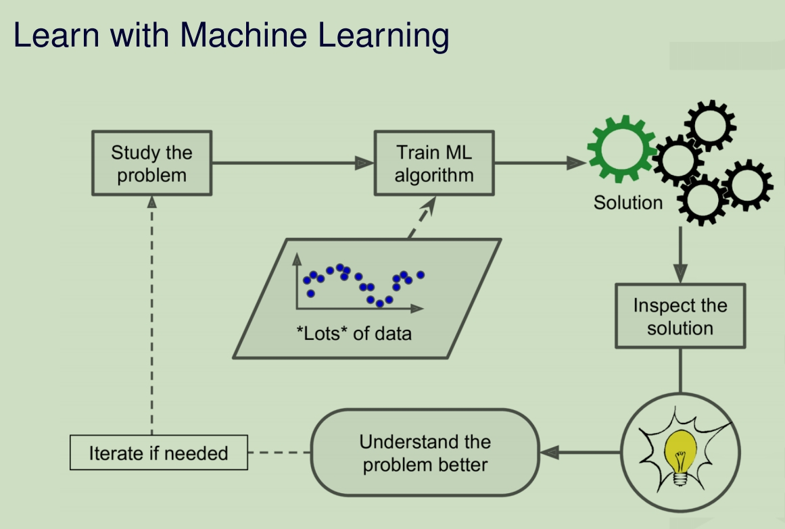
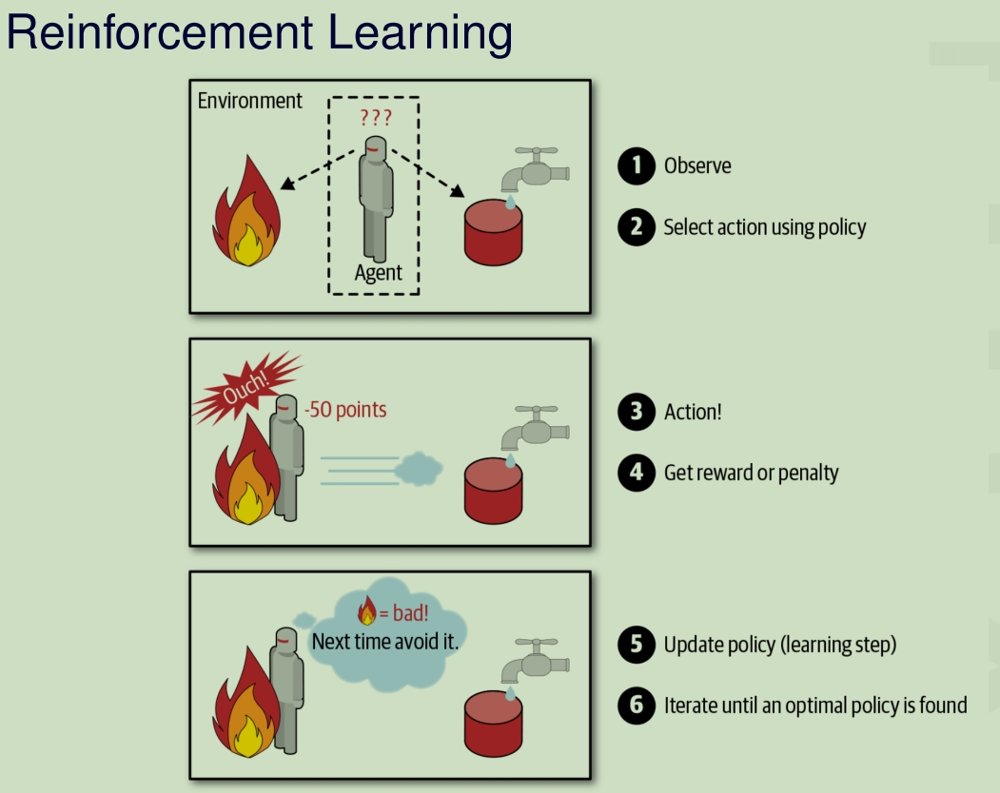

# Overview

Machine Learning is about making **decisions** and **predictions**. Based on the **semantic features** and label the different information.

**机器学习的三要素：**模型+策略+算法

**机器学习的基本流程:** 1.选择数据 2.数据建模 3.验证模型 4.检测模型 5.使用模型 6.调优模型

## Definition of Computer Learning

1. [Machine Learning is the] field of study that gives computers the ability to learn without being explicitly programmed.

​	机器学习是使计算机能够在不明确编程的情况下学习的研究领域。

2. A computer program is said to learn from experience E with respect to some task T and some performance measure P, if its performance on T, as measured by P, improves with experience E.

​	如果计算机进程在 T 上的性能（由 P 衡量）随着经验 E 的提高而提高，则称其从经验 E 中学习某些任务 T 和某些性能测量 P。

3. Modern Statistics

​	现代统计

## Machine Learning Task

Classification 分类

Regression 回归

Clustering 聚类

Anomaly Detection 异常检测

Generation 生成

Modelling 模型

##  Characteristic space&Variable 特征空间与特征变量

**特征变量：**

**特征**是输入变量，即简单线性回归中的 `x` 变量

一组描述客体性质的变量，变量的个数d称为特征维度，特征变量组成的向量称为特征向量，变量张成的空间称为特征空间（样本空间），变量的取值称为属性值。特征向量和特征向量之间可以度量距离。

**标签:**

标签是我们要预测的事务，即简单的线性回归中的`y`值。可以理解为通过特征值分析之后得到的结果

**数据集合:**
样本： 特征空间（样本空间）中的一组示例，记为：X。
标记空间： 标签变量或预测变量的取值集合，记为：Y。
样例集合： 特征向量与标签变量对集合，记为：D {(x1,y1),(x2,y2)…(xm, ym)} 样本个数为m个，样本维度d维。
训练集： 在训练过程中使用的数据称为训练数据，每一个样例称为训练样本，全体训练样本的集合称为训练集。
测试集： 用于检测学习得到模型的数据成为检测数据，每一个样例称为检测样本，全体检测样本集合称为测试集。

## 机器学习的分类

### 1. Supervised Learning 监督学习

- kNN
- Decision Tree & Random Forest
- Support Vector Machine

Labelling Information:

Labelling Information is available though the training process

标签信息可通过训练过程获得

**定义：**根据已有的数据集，知道输入和输出结果之间的关系。根据这种已知的关系，训练得到一个最优的模型。

在监督学习中训练数据既有**特征(feature)**又有**标签(label)**，通过训练，让机器可以自己找到特征和标签之间的联系，在面对只有特征没有标签的数据时，可以判断出标签

**简单理解：**可以把监督学习理解为我们教机器如何做事情

#### 监督学习的类别

监督学习任务主要包括分类和回归两种类型，在监督学习中，数据集中的样本被称为“训练样本”，并且每个样本都有一个输入特征和相应的标签（分类任务）或目标值（回归任务）

- 分类（Classification）： 在分类任务中，目标是将输入数据分到预定义的类别中。每个类别都有一个唯一的标签。算法在训练阶段通过学习数据的特征和标签之间的关系来构建一个模型。然后，在测试阶段，模型用于预测未见过的数据的类别标签。例如，将电子邮件标记为“垃圾邮件”或“非垃圾邮件”，将图像识别为“猫”或“狗”。

- 回归（Regression）： 在回归任务中，目标是预测连续数值的输出。与分类不同，输出标签在回归任务中是连续的。算法在训练阶段通过学习输入特征和相应的连续输出之间的关系来构建模型。在测试阶段，模型用于预测未见过的数据的输出值。例如，预测房屋的售价、预测销售量等

#### 常见监督学习的算法

- 支持向量机（Support Vector Machine，SVM）：SVM是一种用于二分类和多分类任务的强大算法。它通过找到一个最优的超平面来将不同类别的数据分隔开。SVM在高维空间中表现良好，并且可以应用于线性和非线性分类问题。

- 决策树（Decision Trees）：决策树是一种基于树结构的分类和回归算法。它通过在特征上进行递归的二分决策来进行分类或预测。决策树易于理解和解释，并且对于数据的处理具有良好的适应性。

- 逻辑回归（Logistic Regression）：逻辑回归是一种广泛应用于二分类问题的线性模型。尽管名字中带有"回归"，但它主要用于分类任务。逻辑回归输出预测的概率，并使用逻辑函数将连续输出映射到[0, 1]的范围内。

- K近邻算法（K-Nearest Neighbors，KNN）：KNN是一种基于实例的学习方法。它根据距离度量来对新样本进行分类或回归预测。KNN使用最接近的K个训练样本的标签来决定新样本的类别。

### 2. Unsupervised Learning 无监督学习

- k-means
- DBSCAN
- Hierarchical Cluster Analysis (HCA)

Labelling Information: 标签信息

Labelling Information is available though the training process

标签信息可通过培训过程获得

**定义**：我们不知道数据集中数据、特征之间的关系，而是要根据聚类或一定的模型得到数据之间的关系。

在无监督学习中数据只有特征(feature)无标签(label)，是一种机器学习的训练方式，它本质上是一个统计手段，在没有标签的数据里可以发现潜在的一些结构的一种训练方式。

**简单理解**：比起监督学习，无监督学习更像是自学，让机器学会自己做事情。

#### 无监督学习的类别

无监督学习的特点是在训练数据中没有标签或目标值。无监督学习的目标是从数据中发现隐藏的结构和模式，而不是预测特定的标签或目标。无监督学习的主要类别包括以下几种：

- 聚类（Clustering）：聚类是将数据样本分成相似的组别或簇的过程。它通过计算样本之间的相似性度量来将相似的样本聚集在一起。聚类是无监督学习中最常见的任务之一，常用于数据分析、市场细分、图像分割等。

- 降维（Dimensionality Reduction）：降维是将高维数据转换为低维表示的过程，同时尽可能地保留数据的特征。降维技术可以减少数据的复杂性、去除冗余信息，并可用于可视化数据、特征提取等。常见的降维方法有主成分分析（PCA）和t-SNE等。

- 关联规则挖掘（Association Rule Mining）：关联规则挖掘用于发现数据集中项之间的关联和频繁项集。这些规则描述了数据集中不同项之间的关联性，通常在市场篮子分析、购物推荐等方面应用广泛。

- 异常检测（Anomaly Detection）：异常检测用于识别与大多数样本不同的罕见或异常数据点。它在检测异常事件、欺诈检测、故障检测等领域有着重要的应用。

#### 常见无监督学习的算法

- K均值聚类（K-Means Clustering）：K均值聚类是一种常用的聚类算法，它将数据样本分成K个簇，使得每个样本与所属簇中心的距离最小化。

- 主成分分析（Principal Component Analysis，PCA）：PCA是一种常用的降维算法，它通过线性变换将高维数据投影到低维空间，以保留最重要的特征。

- 关联规则挖掘（Association Rule Mining）：关联规则挖掘是一种发现数据集中项之间关联性的方法，它常用于市场篮子分析、购物推荐等领域。

- 异常检测（Anomaly Detection）：异常检测算法用于识别与大多数样本不同的罕见或异常数据点。常见的方法包括基于统计的方法、基于聚类的方法和基于生成模型的方法等。

### 3. Semi-Supervised Learning 半监督学习

Labelling Information: Labelling Information is partially available 标签信息部分可用

**定义**：半监督学习的目标是利用同时包含有标签和无标签的数据来构建一个模型，使得模型能够在测试阶段更好地泛化到新的、未见过的数据。

半监督学习介于监督学习和无监督学习之间。在半监督学习中，训练数据同时包含有标签的数据和无标签的数据。

与监督学习不同的是，半监督学习的训练数据中只有一小部分样本是带有标签的，而大部分样本是没有标签的。通常情况下，获取带有标签的数据可能会比较昂贵或耗费大量的时间，而采集无标签的数据则相对容易和便宜。

在半监督学习中，无标签的数据可以起到两个重要作用：

利用未标记数据的信息：未标记数据可能包含对数据分布、结构和隐含特征的有用信息，这些信息可以帮助模型更好地进行泛化。

利用标记数据的传播效应：通过利用标记数据与无标签数据之间的数据分布相似性，可以通过传播标签信息到无标签样本，进而增强模型的性能。

半监督学习是一个非常有意义且有挑战性的问题，它在现实世界的许多场景中都具有实际应用价值。通过充分利用未标记数据，半监督学习可以在某些情况下显著提高模型的性能，并且有助于在数据有限的情况下构建更加健壮和泛化能力强的机器学习模型。

#### 半监督学习的类别

半监督学习是介于监督学习和无监督学习之间的一种学习方式，它利用同时包含有标签和无标签数据的训练集来构建模型。半监督学习的类别主要分为以下几种：

- 半监督分类（Semi-supervised Classification）：在半监督分类中，训练数据中同时包含带有标签的样本和无标签的样本。模型的目标是利用这些标签信息和无标签数据的分布信息来提高分类性能。半监督分类算法可以在分类任务中利用未标记数据来扩展有标签数据集，从而提高模型的准确性。

- 半监督回归（Semi-supervised Regression）：半监督回归任务与半监督分类类似，但应用于回归问题。模型通过有标签的数据和无标签数据进行训练，以提高对未标记数据的回归预测准确性。

- 半监督聚类（Semi-supervised Clustering）：半监督聚类算法将有标签数据和无标签数据同时用于聚类任务。它们可以通过结合数据的相似性信息和标签信息，来更好地识别潜在的簇结构。

- 半监督异常检测（Semi-supervised Anomaly Detection）：半监督异常检测任务旨在从同时包含正常样本和异常样本的数据中，利用有限的标签信息来检测异常。这在异常样本较少的情况下特别有用。

- 生成对抗网络（GANs）中的半监督学习：GANs可以被用于实现半监督学习。在这种情况下，生成器和判别器网络可以使用有标签和无标签的样本，以提高生成模型的性能

#### 半监督学习的算法

半监督学习算法可以在不同的问题和数据集上发挥作用。选择合适的半监督学习算法取决于问题的特性、可用的有标签和无标签数据量，以及算法的性能和复杂度要求。半监督学习在处理数据有限或数据标记成本高昂的场景下具有重要的应用价值。以下是一些常见的半监督学习算法：

- 自训练（Self-Training）：自训练是一种简单的半监督学习方法。它通过使用有标签数据训练一个初始模型，然后使用该模型对未标记数据进行预测，并将置信度较高的预测结果作为伪标签，将未标记数据添加到有标签数据中，然后重新训练模型。

- 协作训练（Co-Training）：协作训练是一种使用多个视图或特征的半监督学习方法。它通过将数据划分为两个或多个视图，并在每个视图上独立训练模型。然后，模型之间相互交互并使用对方的预测结果来增强训练。

- 半监督支持向量机（Semi-Supervised Support Vector Machines）：半监督支持向量机是基于支持向量机的半监督学习方法。它利用有标签数据和未标记数据之间的关系来学习一个更好的分类器。

- 生成式半监督学习（Generative Semi-Supervised Learning）：这类方法尝试使用生成模型来建模数据的分布，并利用有标签和无标签数据共同训练生成模型，以提高对未标记数据的预测。

- 半监督深度学习：近年来，许多深度学习方法已经扩展到半监督学习。这些方法通过在深度神经网络中引入半监督性质，如半监督自编码器（Semi-Supervised Autoencoders）等，来利用未标记数据的信息。

- 图半监督学习（Graph-based Semi-Supervised Learning）：图半监督学习方法利用数据样本之间的关系来辅助半监督学习。这些方法通常利用图模型或图卷积神经网络（GCN）来利用数据的拓扑结构。

### 4. Instance Learning 实例学习

Instance learning is a type of learning where the model learns the training data by heart and makes predictions based on the similarity of new examples to instances seen during training. It is a form of lazy learning, as the generalization of the training data is delayed until a query is made, which is different from eager learning methods where the model tries to generalize the training data before receiving new data queries. K-Nearest Neighbors (KNN) is a classic example of instance learning, where the algorithm classifies new examples based on the majority label of the 'k' most similar instances from the training dataset. In instance learning, the model does not construct an internal general model, but rather uses the specific instances to make predictions.

实例学习是一种学习类型，其中模型通过内部学习训练数据，并根据新示例与训练期间看到的实例的相似性进行预测。它是惰性学习的一种形式，因为训练数据的泛化会延迟到进行查询，这与模型在接收新数据查询之前尝试泛化训练数据的急切学习方法不同。K 最近邻 （KNN） 是实例学习的一个经典示例，其中算法根据训练数据集中“k”个最相似实例的多数标签对新示例进行分类。在实例学习中，模型不构建内部通用模型，而是使用特定实例进行预测。

### 5. Reinforcement Learning 强化学习

Reinforcement Learning (RL) is a type of machine learning where an agent learns to make decisions by performing certain actions and receiving feedback from those actions in the form of rewards or penalties. The goal is to learn a policy that maximizes the cumulative reward over time. This learning process is inspired by behavioral psychology and involves learning to map situations to actions so as to maximize a numerical reward signal. The learner is not told which actions to take but instead must discover which actions yield the most reward by trying them out. This trial-and-error search and delayed reward are the most important characteristics of reinforcement learning. Applications of RL include robotics, game playing, and autonomous vehicle navigation, where the environment provides feedback to the agent based on the actions it takes.

强化学习 （RL） 是一种机器学习，代理通过执行某些操作并以奖励或惩罚的形式从这些操作中接收反馈来学习做出决策。目标是学习一种策略，随着时间的推移最大化累积奖励。这个学习过程受到行为心理学的启发，涉及学习将情况映射到行动，以最大化数字奖励信号。学习者不会被告知要采取哪些行动，而是必须通过尝试来发现哪些行动会产生最大的回报。这种试错搜索和延迟奖励是强化学习最重要的特征。RL 的应用包括机器人、游戏和自动驾驶车辆导航，其中环境根据代理采取的行动向智能体提供反馈。

### 6. Model Selection 模型选择

**Model Validation:** Training dataset should not overlap with validation dataset

模型验证：训练数据集不应与验证数据集重叠

Model selection is the process of selecting one model from a set of models to be used for future predictions. It involves comparing the performance of different statistical models in order to choose the best one for a given dataset and task. Model selection criteria can be based on various factors, including predictive accuracy, complexity, interpretability, and computational efficiency. Techniques for model selection include cross-validation, where the data is split into multiple parts and the model is trained and tested on different sets, and information criteria such as Akaike Information Criterion (AIC) and Bayesian Information Criterion (BIC), which balance model fit with model complexity. Model selection is a critical step in the machine learning pipeline as it can significantly impact the performance and generalizability of the model to new data.

模型选择是从一组模型中选择一个模型以用于未来预测的过程。它涉及比较不同统计模型的性能，以便为给定的数据集和任务选择最佳模型。模型选择标准可以基于各种因素，包括预测准确性、复杂性、可解释性和计算效率。模型选择技术包括交叉验证，其中数据被拆分为多个部分，并在不同的集合上训练和测试模型，以及信息标准，如赤池信息准则 （AIC） 和贝叶斯信息准则 （BIC），它们平衡了模型拟合度与模型复杂性。模型选择是机器学习管道中的关键步骤，因为它会显着影响模型的性能和对新数据的泛化性。

## Challenges for Machine Learning

- Insufficient Data
- Nonrepresentative Training Data
- Poor-Quality Data
- Irrelevant Features
- Overfitting the Training Data
- Underfitting
- Data Mismatch (Data Domain)
