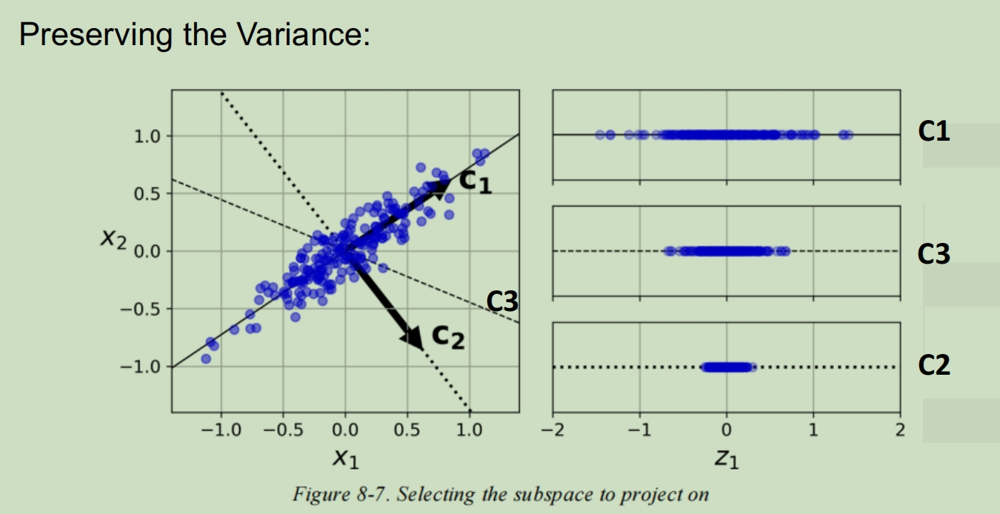

# Lecture3 Dimensionality Reduction 降维

Data with high dimensions:

• High computational complexity 

• May contain many irrelevant or redundant features

• Difficulty in visualization

• With high risk of getting an overfitting model

高维度数据：

• 计算复杂度高

• 可能包含许多不相关或多余的功能

• 可视化困难

• 过拟合模型的风险很高

**Projection 分布:** 

• Data is not spread out uniformly across all dimensions. (All the data lies within (or close to) a much lower-dimensional subspace of the high-dimensional space.

• 数据并非均匀地分布在所有维度上。（所有数据都位于（或接近）高维空间的低维子空间内。

## Principal Component Analysis (PCA) 主成分分析

 

PCA identifies the axis that accounts for the largest amount of variance in the training set.

PCA 标识在训练集中占最大方差的轴。

## SVD

