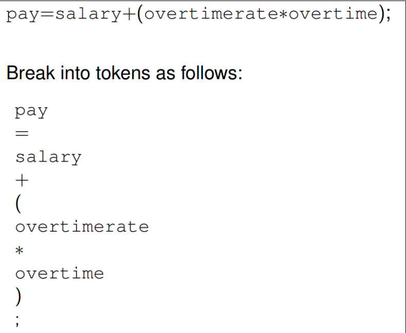
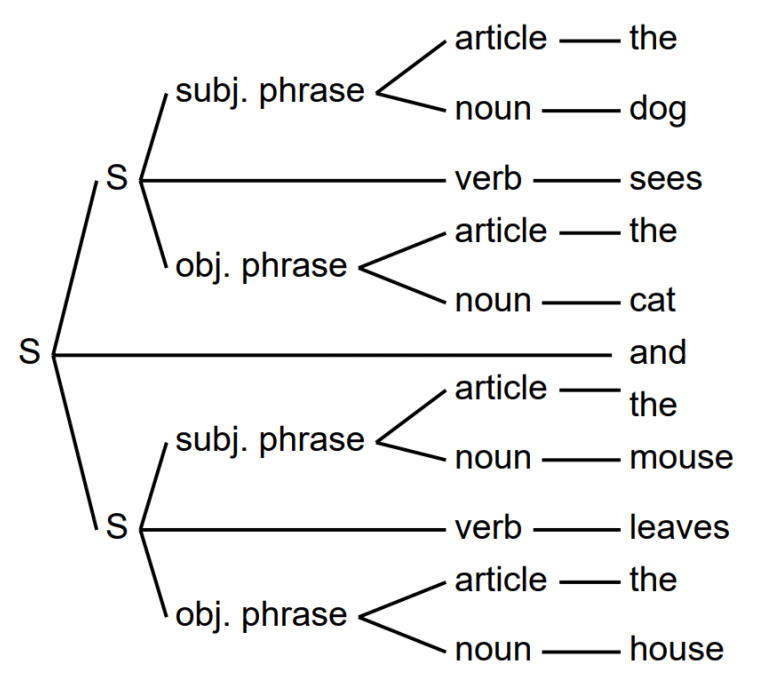
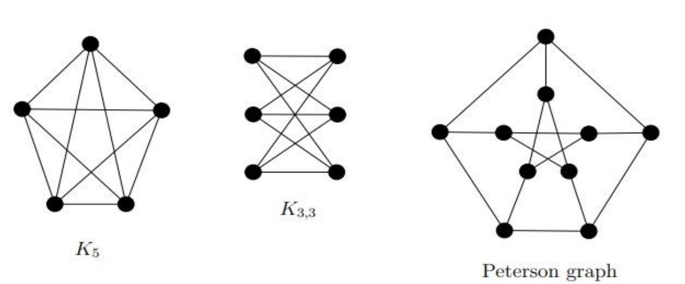

# Introduction

**<u>非常重要的词汇</u>**

- **Finite state automation**

  有限状态自动机

- **Regular expression**

  正则表达式

- **Context-free grammar**

  上下文无关语法

- **Pushdown Automaton**

  后进先出自动机

- **Turing machine**

  图灵机

## Language (also denoted as "L") 语言

- **Alphabets** - a finite, nonempty **set** Σ(sigma) of symbols

- **String (word)** - a finite sequence of symbols from the alphabets

  - Example：

    Σ = {a, b}, then *abab, aaaabbba* are strings on Σ

    w = abaaa indicates the string named *w* has the specific value *abaaa*

- **Empty String (word)** - the string with no symbols, denoted as **ε**(epsilon)

  - |ε| = 0
  - εw = wε = w

- **Length of a string** - the number of symbols in the string, denoted as |w|

  - |w1w2| = |w1| + |w2|

- **Reverse of a string** - obtained by writing he symbols in reverse order, denoted as wR

  - w = a1 a2 ... an 
  - wR = an ... a1 a2

- A **palindrome回文** is a string w satisfying w = wR

- The **concatenation相关联** of two strings is obtained by appending the symbols to the right end (concatenation is associative).

  - w = a1 a2 ... an 
  - v = b1 b2 ... bn 

  - wv = a1 a2 ... an b1 b2 ... bn 
  - if u, v, w are strings and w=uv then u is **prefix** of w and v is a suffix of w. A proper prefix of w is a prefix that is not equal to ε of w (similarly for proper suffix)

- **wn** denotes the concatenation of n copies of w

- **Σ*** (**star closure of Σ(sigma)**) is infinite, denotes the set of all strings (words) over Σ

- **Σ+** (**positive closure of Σ**) denotes the set of all non-empty strings (words) over Σ. Both of **Σ*** and **Σ+**

- A **formal language** is a set of strings constructed from a finite alphabet according to specific syntactical rules. It is used in various fields, such as computer science, linguistic, and mathematics, to define and analyze the structure of languages systematically.

  **Formal language**是根据特定的语法规则由有限字母构成的一组字符串。它用于计算机科学、语言学和数学等各个领域，以系统地定义和分析语言的结构。

- A Language L (or formal language) over alphabet Σ is a subset of Σ*

- We can express new languages in terms of other languages using **concatenation** and **closure**.
  - **L1L2** = {w1w2: w1 ∈ L1 and w2 ∈ L2}
  - **L*** = {w1w2 ... wn : n ≥ 0 and w1w2 ... wn ∈ L}

**Σ*（Σ的闭包）**：

- Σ* 表示由字母表 Σ中的符号组成的所有**可能字符串的集合**，包括**空字符串**（通常表示为 ε）。
- 具体来说，Σ\* 包含所有长度为零（空字符串）、长度为1、长度为2，以至无限长度的字符串。例如，如果 Σ={a,b}，那么 Σ\* 包含 ε, "a", "b", "aa", "ab", "ba", "bb", "aaa"，等等。

**Σ+（Σ的正闭包）**：

- Σ+ 表示由字母表 Σ 中的符号组成的所有**非空字符串的集合**，也就是说，它包含Σ*中的所有字符串，但不包括空字符串 ε。
- 继续上述例子，如果 Σ={a,b}，那么Σ*包含 "a", "b", "aa", "ab", "ba", "bb", "aaa"，等等，但不包括空字符串 ε。

总结来说，Σ* 包含所有可能的字符串（包括空字符串），而Σ+只包含非空字符串

## Grammar 语法

- **Lexical analysis 词汇分析** - divide sequence of characters into tokens, such as variable names, operators, labels. In a natural language tokens are strings of consecutive letters (easy to recognize!) 

  将字符串行划分为标记，例如变量名称、运算符、标签。在自然语言中，标记是连续字母的字符串（易于识别！)

  

- **Parse Tree解析树** - identify relationships between tokens 识别令牌之间的关系 **<u>（重难点）</u>**

  parse tree or parsing tree or derivation tree派生树 or concrete syntax tree is an ordered, rooted tree that represents the syntactic structure of a string according to some **context-free grammar**

  parse tree或parsing tree或derivation tree或具体语法树是一个有序的、有根的树，它根据一些与上下文无关的语法表示字符串的语法结构

  

- **Code generation 代码生成** - is part of the process chain of a compiler and converts intermediate representation of source code into a form (e.g., machine code) that can be readily executed by the target system.

  是编译器过程链的一部分，将源代码的中间表示转换为目标系统可以轻松执行的形式（例如机器代码）。

- **Code optimization: 代码优化** -  is the process of modifying a software system to make some aspect of it work more efficiently or use fewer resources. In general, a computer program may be optimized so that it executes more rapidly, or to make it capable of operating with less memory storage or other resources, or draw less power.

  是修改软件系统以使其某些方面更高效地工作或使用更少资源的过程。通常，可以优化计算机进程，使其执行速度更快，或者使其能够在更少的内存存储或其他资源下运行，或者消耗更少的功率。
  
- **Automata自动机** - An automaton is an abstract model of a digital computer

  自动机是数字计算机的**抽象模型**：
  
  **Input file → （Control unit ↔️ Storage）→ Output**

## Theories

- **Complexity theory 复杂性理论** 

  - The main question asked in this area is “What makes some problems computationally hard and other problems easy?” Informally, a problem is called “easy”, if it is efficiently solvable.

    这个领域提出的主要问题是“是什幺让一些问题在计算上困难而另一些问题更容易？非正式地，如果一个问题是可以有效解决的，那幺它被称为 “简单”。

  - On the other hand, a problem is called “hard”, if it cannot be solved efficiently, or if we don’t know whether it can be solved efficiently.

    另一方面，如果一个问题不能有效地解决，或者我们不知道它是否可以有效地解决，那幺它就被称为“困难”。

- **Computation theory 计算理论** 

  - Central question in Computability Theory: classify problems as being solvable or unsolvable.

    可计算性理论的中心问题：将问题分类为可解决或不可解决。

    - An example of such a problem is “Is an arbitrary mathematical statement true or false?”

      此类问题的一个例子是“任意数学陈述是真还是假？

  - To attack such a problem, we need formal definitions of the notions of:

    为了解决这个问题，我们需要对以下概念进行正式定义：

    - Computer
    - Algorithm
    - Computation

  - The theoretical models that were proposed in order to understand solvable and unsolvable problems led to the development of real computers.

    为了理解可解决和不可解决的问题而提出的理论模型导致了真实计算机的发展。

- **Automata theory 自动机理论** 

  - Central question in Automata Theory: Do these models have the same power, or can one model solve more problems than the other?

    自动机理论的核心问题：这些模型是否具有相同的能力，或者一个模型可以比另一个模型解决更多的问题？

  - Automata Theory deals with definitions and properties of different types of “computation models”. Examples of such models are: 自动机理论涉及不同类型“计算模型”的定义和属性。此类模型的示例包括：

    - **Finite Automata**. These are used in text processing, compilers, and hardware design.

      有限自动机: 这些用于文本处理、编译器和硬件设计。

    - **Context-Free Grammars**. These are used to define programming languages and in Artificial Intelligence.

      上下文无关语法: 这些用于定义编程语言和人工智能。

    - **Turing Machines**. These form a simple abstract model of a “real” computer, such as your PC at home.

      图灵机: 这些构成了“真实”计算机的简单抽象模型，例如您家中的 PC

## Mathematical preliminaries

### Set 集合

A **set** is a collection of well-defined objects  **set**是定义完善的对象的集合

- If A and B are sets, then A is a **subset** of B, written as A ⊆ B, if every element of A is also an element of B.

  如果 A 和 B 是集合，那幺 A 是 B 的 **子集**，写成 A ⊆ B，如果 A 的每个元素也是 B 的一个元素。

- For example, the set of even natural numbers is a subset of the set of all natural numbers. Every set A is a subset of itself, i.e., A ⊆ A. The empty set is a subset of every set A, i.e., ∅ ⊆ A.

  例如，偶数自然数集是所有自然数集的子集。每个集合 A 都是其自身的子集，即 A ⊆ A。空集是每个集合 A 的子集，即 ∅ ⊆ A。

- If B is a set, then the **power set** P(B) of B is defined to be the set of all subsets of B: P(B) = {A : A ⊆ B}. Observe that ∅ ∈ P(B) and B ∈ P(B).

  如果 B 是一个集合，那幺 B 的 **幂集** P（B） 被定义为 B 的所有子集的集合： P（B） = {A ： A ⊆ B}。请注意，∅ ∈ P（B） 和 B ∈ P（B）。

- If A and B are two sets, then:
  - their **union** is defined as A ∪ B = {x : x ∈ A or x ∈ B}, 
  - their **intersection** is defined as A ∩ B = {x : x ∈ A and x ∈ B}, 
  - their **difference** is defined as A \ B = {x : x ∈ A and x ∉ B}, 
  - the **Cartesian product** of A and B is defined as A × B = {(x, y) : x ∈ A and y ∈ B}, 
  - the **complement** of A is defined as A = {x : x ∉ A}.

### Relation and Function  关系和功能

- A **binary relation** on two sets A and B is a subset of A × B (Cartesian product of A and B).

  两个集合 A 和 B 上的 **二元关系** 是 A × B 的子集（A 和 B 的笛卡尔积）。

- A **function** f from A to B, denoted by f : A → B, is a binary relation R, having the property that for each element a ∈ A, there is exactly one ordered pair in R, whose first component is a. We will also say that f(a) = b, or f maps a to b, or the image of a under f is b. The set A is called the domain of f, and the set

  从 A 到 B 的 **函数** f，用 f 表示 ： A → B，是一个二元关系 R，其特性是对于每个元素 a ∈ A，R 中只有一个有序对，其第一个分量是 a。我们还将说 f（a） = b，或者 f 将 a 映射到 b，或者 f 下的 a 图像是 b。集合 A 称为 f 的domain，

  - 集合: {b ∈ B : there is an a ∈ A with f(a) = b}  是f的range. （f的值域集合属于集合B的子集，f值域≤集合B）

- A function f : A → B is **one-to-one** (or **injective**), if for any two distinct elements a and a′ in A, we have f(a) ≠ f(a′). The function f is **onto** (or **surjective**), if for each element b ∈ B, there exists an element a ∈ A, such that f(a) = b; in other words, the range of f is equal to the set B. A function f is a **bijection**, if f is both injective and surjective.

  函数 f ： A → B 是 **一对一的**（或 **单射的**），如果对于 A 中任意两个不同的元素 a 和 a′，我们有 f（a） ≠ f（a′）。函数 f 是 **onto**（或 **surjective**），如果对于每个元素 b ∈ B，存在一个元素 a ∈ A，使得 f（a） = b;换句话说，f 的范围等于集合 B。如果 f 既是单射又是满射，则函数 f 是 **双射**。

- A binary relation R ⊆ A × A is an **equivalence relation**, if it satisfies the following three conditions:

  如果二元关系 R ⊆ A × A 满足以下三个条件，则它是 **等价关系**：

  - R is **reflexive**: For every element in a ∈ A, we have (a, a) ∈ R.

    R 是 **反身的**：对于∈ A 中的每个元素，我们有 （a， a） ∈ R。

  - R is **symmetric**: For all a and b in A, if (a, b) ∈ R, then also (b, a) ∈ R.

    R 是 **对称的**：对于 A 中的所有 a 和 b，如果 （a， b） ∈ R，那幺 （b， a） 也∈ R。

  - R is **transitive**: For all a, b, and c in A, if (a, b) ∈ R and (b, c) ∈ R, then also (a, c) ∈ R.

    R 是 **及物**：对于 A 中的所有 a、b 和 c，如果 （a， b） ∈ R 且 （b， c） ∈ R，则 （a， c） 也∈ R。

### Graph  图像

- A **graph** G = (V, E) is a pair consisting of a set V , whose elements are called **vertices**, and a set E, where each element of E is a pair of distinct vertices. The elements of E are called **edges**.

  **graph** G = （V， E） 是一对由一组 V 组成的，其元素称为 **顶点** 和一个集合 E，其中 E 的每个元素都是一对不同的顶点。E 的元素称为 **边**。

- The **degree** of a vertex v, denoted by deg(v), is defined to be the number of edges that are incident on v. A **path** in a graph is a sequence of vertices that are connected by edges. 

  顶点 v 的 **度数** （用 deg（v） 表示）定义为入射到 v 上的边数。图形中的 **path** 是由边连接的顶点串行。

- A path is a **cycle**, if it starts and ends at the same vertex. A **simple path** is a path without any repeated vertices. A graph is **connected**, if there is a path between every pair of vertices.

  如果路径在同一个顶点开始和结束，则它是一个 **循环**。**简单路径** 是没有任何重复顶点的路径。如果每对顶点之间有路径，则图形是 **连接的**。

### Proof Techniques 校对技术

- **Axiom**: an unprovable rule or first principle accepted as true because it is self-evident or particularly useful.

  **公理**：一个无法证明的规则或第一原则被接受为真，因为它是不言而喻的或特别有用的。

- **Statement** (proposition): a declarative sentence that is either true or false but not both. In proof, it often includes axioms, hypotheses of the theorem to be proved, and previously proved theorems.

  **声明**（命题）：一个陈述句，要幺是 true 要幺是 false，但不能同时是两者。在证明中，它通常包括公理、待证明定理的假设和先前证明的定理。

- **Theorem**: a statement that is true.

  **定理**：一个真实的陈述。

- **Proof**: a sequence of mathematical statements that form an argument to show that a theorem is true

  **证明**：一系列数学语句，形成一个论点以证明定理为真

- There is no specified way of coming up with a proof, but there are some generic strategies that could be of help:

  实现证明没有特定的方法，但是有一些基础的策略可以提供帮助

  - Direct proof 直接证明

    - Approach the theorem directly.

  - Constructive proof 构造性证明

    - A method of proof that demonstrates the existence of a mathematical object (anything that has been formally defined) by creating or providing a method for creating the object.

      一种证明方法，通过创建或提供创建对象的方法来证明数学对象 （任何已正式定义） 的存在。

  - Non-constructive proof 非构造性证明

    - In a nonconstructive proof, we show that a certain object exists, without actually creating it.

      在非构造证明中，我们证明某个对象存在，但实际上没有创建它。

  - Contradiction proof 反证法

    - A form of proof that establishes the truth or the validity of a proposition, by showing that assuming the proposition to be false leads to a contradiction

      一种证明形式，通过证明假设命题为假会导致矛盾，从而确定命题的真值或有效性

  - Induction proof 数学归纳法

    - A mathematical proof technique. It is essentially used to prove that a statement P(n) holds for every natural number n = 0, 1, 2, 3, ... ;

      一种数学证明技术。它本质上用于证明语句 P（n） 对于每个自然数 n = 0， 1， 2， 3， ... ;
