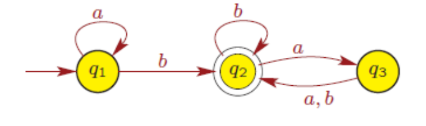
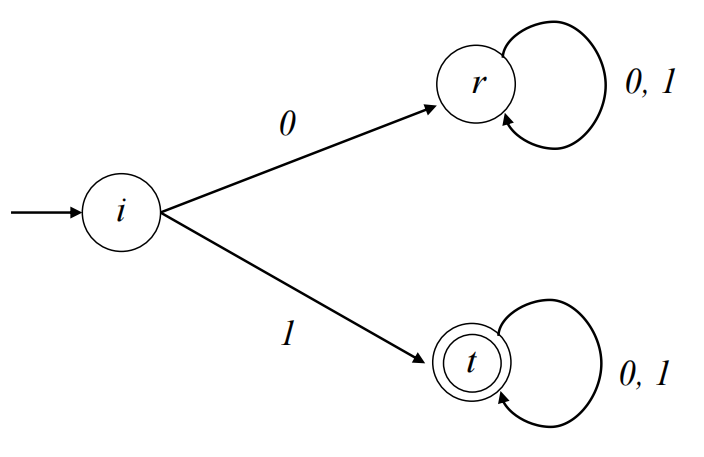
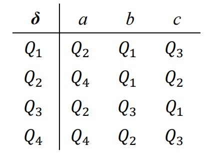

# Deterministic Finite Automata  确定性有限自动机

## Controlling a toll gate  控制收费站案例

When a car arrives at the toll gate, the gate is closed. The gate opens as soon as the driver has payed 25 cents. We assume that we have only three coin denominations:5, 10, and 25 cents. Notably, no excess change is returned.

当汽车到达收费站时，收费站关闭。司机支付 25 美分后，大门立即打开。我们假设我们只有三种硬币面额：5、10 和 25 美分。值得注意的是，不会返回多余的更改。

After having arrived at the toll gate, the driver inserts a sequence of coins into them a chine. At any moment, the computer has to decide whether or not to open the gate, i.e., whether or not the driver has paid 25 cents (or more).

到达收费站后，司机将一系列硬币插入其中。在任何时候，计算机都必须决定是否打开大门，即司机是否支付了 25 美分（或更多）。

- The machine is in state *q0* , if it has not collected any money yet.

- The machine is in state *q1* , if it has collected exactly 5 cents.

- The machine is in state *q2* , if it has collected exactly 10 cents.

- The machine is in state *q3* , if it has collected exactly 15 cents.

- The machine is in state *q4* , if it has collected exactly 20 cents.

- The machine is in state *q5* , if it has collected 25 cents or more.

**Question:**

Can we draw a figure to represent the behavior of the computer for all possible sequences of coins?

我们能画一个数字来表示计算机对所有可能的硬币串行的行为吗？

## Definition

在上图中q1是初态（start state），q2是终态（accept state），给定任意的字符串，依次按照给定字符串的字母顺序按照箭头的方向走，如果最终最后一步不是停留在终态，那么就不是有限自动机。

**DFA** is a finite-state machine that accepts or rejects a given string of symbols, by running through a state sequence uniquely determined by the string.

**DFA** 是一个有限状态机，它通过运行由字符串唯一确定的状态串行来接受或拒绝给定的符号字符串。

It is invented to **recognize a special class of formal language** and have many practical applications:

它的发明是为了 **识别一类特殊的形式语言**，并有许多实际应用：

- **Lexical analysis** – scans the input program from beginning to end and divides it into tokens like identifiers, constants, and keywords and to remove comments and whitespace (specify tokens of programming languages).

  词法分析 – 从头到尾扫描输入进程，并将其划分为标识符、常量和关键字等标记，并删除注释和空格（指定编程语言的标记）

- **Model checking**, reasoning about systems with objective of proving they satisfy useful properties.

  模型检查，对系统进行推理，目的是证明它们满足有用的属性。

- Statistical models for analyzing biological and textual sequences.

  用于分析生物和文本串行的统计模型。

We shall see that DFA can be used to describe  我们将看到 DFA 可以用来描述

- Any finite set of strings  任何有限的字符串集

- Various infinite sets of strings, e.g.  各种无限的字符串集，例如

  - strings having exactly 2 occurrences of the letter a

    字母 a 恰好出现 2 次的字符串

  - strings having more than 6 letters

    超过 6 个字母的字符串

  - strings in which letter b never comes before letter a

    字母 B 从不出现在字母 A 之前的字符串

DFA cannot be used to describe certain languages such as:  DFA 不能用于描述某些语言，例如：

- the set of strings containing more a’s than b’s 

  包含 A 多于 B 的字符串集

- all words that remain the same if you read them back to front 

  如果您从头到前阅读它们，则所有单词保持不变

- well-formed arithmetic expressions, if there is no limit on nesting of parentheses.

  格式正确的算术表达式，如果括号的嵌套没有限制。

A DFA is defined as a **5-tuple**. DFA 被定义为 5 元组:  ***M =* (*Q, Σ, δ, q, F*)**

1.  *Q* is a finite set of **states**,   *Q* 是一组有限的 **状态**，
2.  *Σ* is a finite set of symbols, called the **alphabet** of the automaton,   *Σ* 是一组有限的符号，称为自动机的 **字母**，

3.  *δ* : *Q* × *Σ* → *Q* is a function, called the **transition function**,  δ ：*Q* × *Σ* → *Q* 是一个函数，称为 **transition function**， 
4.  *q* ∈ *Q* is called the **initial state**,    *q* ∈ *Q* 称为 **初始状态**，
5.  *F* ⊆ *Q* is a set of **accepting/terminal states**.   *F* ⊆ *Q*是一组**接受/终止状态**。

**State** of a machine tells you something about the prefix that has been read so far. If the string is a member of the language of interest, the state reached when the whole string has been scanned will be an accepting state (a member of F). **Transition function** *δ* tells you how state should change when an additional letter is read by the DFA.

计算机的 **State** 告诉您有关到目前为止已读取的前缀的信息。如果字符串是相关语言的成员，则扫描整个字符串时到达的状态将是接受状态（F 的成员）。**过渡函数** *δ* 告诉您当 DFA 读取其他字母时状态应该如何变化。

## **Example of transition function  过渡函数示例**

Initially the state is *i* and if the input word is w = a1 a2…. an then, as each letter is read, the state changes and we get  q1 q2…. qn defined by:

最初状态是 *i* 如果输入字是 *w* = *a1* *a2....* *an* 然后，随着每个字母的读取，状态发生变化，我们得到 *q1* *q2....* *qn* 由如下的内容定义：

𝑞1 = 𝛿 (𝑖, 𝑎1)

𝑞2 = 𝛿 (𝑞1, 𝑎2)

𝑞3 = 𝛿 (𝑞2, 𝑎3)

⋮

𝑞𝑛 = 𝛿 (𝑞𝑛−1, 𝑎n)

We can extend the definition of the transition function *δ* so that it tells us which state we reach after a word (not just a single letter) has been scanned:

我们可以扩展转换函数 *δ* 的定义，以便它告诉我们在扫描一个单词（不仅仅是一个字母）后我们到达了哪种状态

- In the above notation, extend the map *δ* : *Q* × *Σ → Q* to δ : *Q* × *Σ\* → Q* by defining:
  - δ* (q, *ϵ*) = *q*   for all *q* ∈ *Q*
  - δ* (q, wa) = *δ* (δ*(q, w) , 𝑎)   for all *q* ∈ *Q*; *w* ∈ Σ* ; a ∈ *Σ*

**Example**:

*δ* (q0, a) = *q1* *and δ* (q1 , *b*) = *q2*

Then:

*δ* (q0 , ab) = *q2*

Proof steps:

both following equations belongs to **δ* (q0 , 𝑎b) = δ (q1 , b) = q2**

- δ* (q0, 𝑎b) = δ (δ * (q0 , 𝑎) , 𝑏)
- δ* (q0 , 𝑎) = δ (q0 , 𝑎) = *q1*

A DFA *M =* (*Q, Σ, δ, q, F*) is often depicted as a directed graph **GM** (called **transition graph**) has exactly |Q| vertices, each one labeled with a different qi ∈ *Q.* For each transition function *δ*(qi, a) = qj *,* the graph has edges (qi , qj ) labeled (a), (b), and (a, b), . The vertex associated with q1 is called the initial vertex, while those labeled with qf are the final vertices.

DFA *M =* （*Q， Σ， δ， q， F*） 通常被描述为有向图 **GM**（称为**过渡图**）恰好具有 |Q|顶点，每个顶点都标有不同的 qi ∈ *Q.* 对于每个转换函数 *δ*（qi， a） = qj *，* 图表有边 （qi ， qj ） 标记为 （a）， （b） 和 （a， b）， .与 q1 关联的点称为初始点，而标记为 qf 的点是最终点。

Let *M =* (*Q, Σ, δ, q, F*) be a finite automaton and let w = w0 w1 . . . wn be a string over. Define the sequence q0 , q1 , . . . , qn of states, in the following way:

- q0 = q,

- qi+1 = δ(qi , wi+1), for i = 0, 1, . . . , n − 1.
  1. If **qn ∈ F**, then we say that *M* accepts *w*.
  2. If **qn ∉ F**, then we say that *M* rejects *w*.

## Symbolic description of the example DFA  示例 DFA 的符号描述

Automaton *M =* (*Q, Σ, δ, q, F*)

Set of states Q = {i, t, r}, Σ = {0, 1}, F = {t} and the transition function δ is given by

δ(i, 0) = r 		δ(i, 1) = t

δ(t, 0) = t 		δ(i, 1) = t

δ(r, 0) = r 		δ(r, 1) = r

It is simpler to describe a transition function by a table of values. In this example we have:

|      | 0    | 1    |
| ---- | ---- | ---- |
| i    | r    | t    |
| t    | t    | t    |
| r    | r    | r    |

If *δ* is a partial function (not defined for some state/letter pairs), then the DFA rejects an input if it ever encounters such a pair.

如果 *δ* 是部分函数（未为某些状态/字母对定义），则 DFA 在遇到此类对时将拒绝输入。

This convention often simplifies the definition of a DFA. In the previous example we could use transition table

此约定通常简化了 DFA 的定义。在前面的示例中，我们可以使用 transition table

|      | 0    | 1    |
| ---- | ---- | ---- |
| i    |      | t    |
| t    | t    | t    |

## Language defined by DFA   DFA 定义的语言

Suppose we have a DFA M. A word w ∈ Σ* is said to be accepted or recognized by M if δ (q0 , w) ∈ F, otherwise it is said to be rejected. The set of all words accepted by M is called the language accepted by M and will be denoted by **L**(M). Thus

假设我们有一个 DFA M。如果 δ (q0 , w) ∈ F，则表示词 w∈Σ* 被 M 接受或识别，否则表示被拒绝。M 接受的所有词的集合称为 M 接受的语言，用 **L**(M) 表示。因此

**L**(*M*) = {*w* ∈ Σ* : δ* (q0 , *w*) ∈ *F*}

Any finite language is accepted by some DFA

任何有限语言都被某些 DFA 接受

A language **A** is called **regular**, if there exists a finite automaton M such that **A** = **L**(M)

语言 **A** 称为 **正则**，如果存在一个有限自动机 M，使得 **A** = **L**（M）

Example:

## Regular operations on languages  语言的常规操作

Let **A** and **B** be two languages over the same alphabet.

The **union** of **A** and **B** is defined as:

<u>**A ∪ B** = {w : w ∈ **A** or w ∈ **B**}</u>

The concatenation of **A** and **B** is defined as:

<u>**AB** = {ww′ : w ∈ **A** and w′ ∈ **B**}</u>

The star of **A** is defined as:

<u>**A***= {u1 u2 . . . uk: k ≥ 0 and ui ∈ **A** for all i = 1, 2, . . . , k}</u>

**Example of  A***

Given two languages **A** = {0, 01} and **B** = {1, 10}. Then

**A ∪ B** = {0, 01, 1, 10}

**AB** = {01, 010, 011, 0110}

**A*** = {*ϵ*, 0, 01, 00, 001, 010, 0101, 000, 0001, 00101, . . .}

**Theorem:**

The set of regular languages is closed under the union operation, i.e., if **A** and **B** are regular languages over the same alphabet **Σ**, then **A** ∪ **B** is also a regular language.

常规语言的集合在 union 操作下是闭合的，即如果 **A** 和 **B** 是同一字母 **Σ** 上的常规语言，那幺 **A** ∪ **B** 也是一种常规语言。

## Exercise

1. DFA M =( {q0, q1, q2 }, {0, 1}, δ, q0 , {q1 } ), where δ is given as:

   δ(q0 , 0) = q0	δ(q0 , 1) = q1

   δ(q1 , 0) = q0	δ(q1 , 1) = q2

   δ(q2 , 0) = q2	δ(q2 , 1) = q1

   Can the input word **110100** be accepted/recognized by this M ?

2. How about the following infinite language. Can you give a DFA that accepts the words:

   bad, baad, baaad, baaaad, ...?

3. Given the symbolic description of a DFA, can you draw its corresponding diagram?

   

4. Show that the language **L** is regular:

   **L** = {*awa*: *w* ∈ {*a,b*}* }

   Can you design a DFA that accepts this language?

