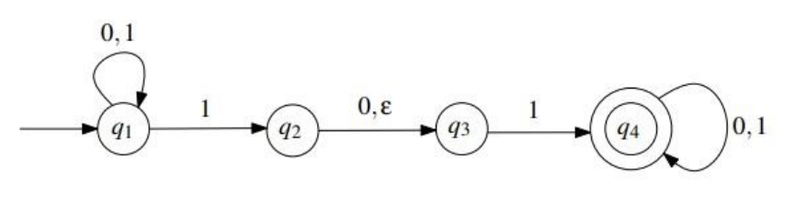
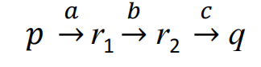
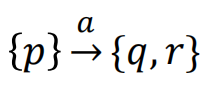
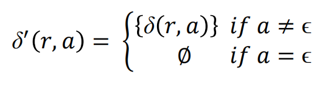
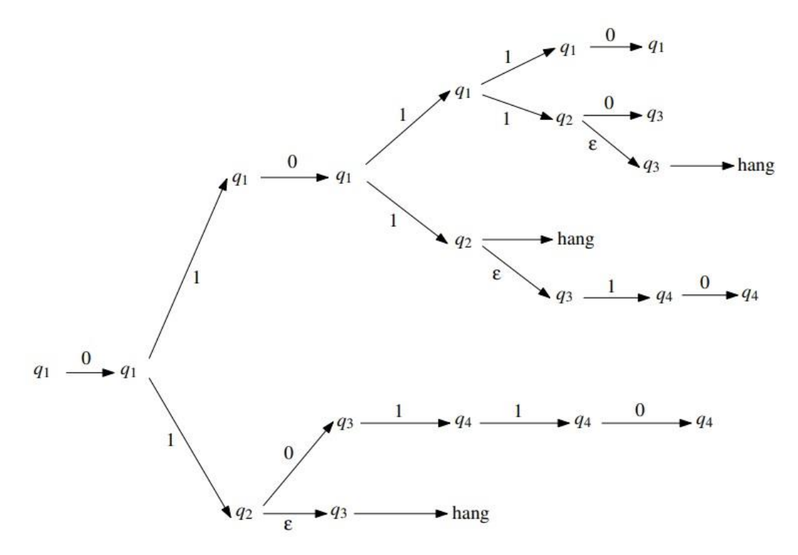
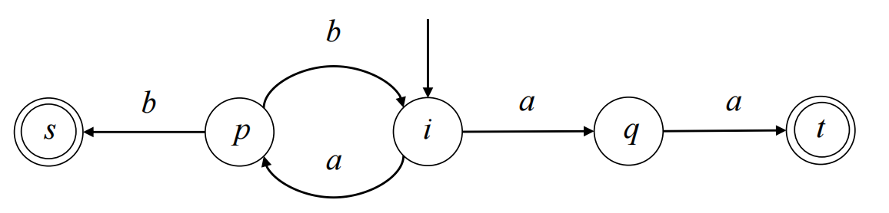
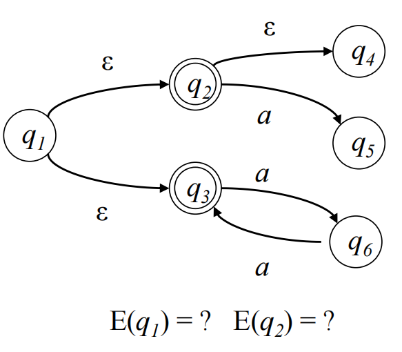
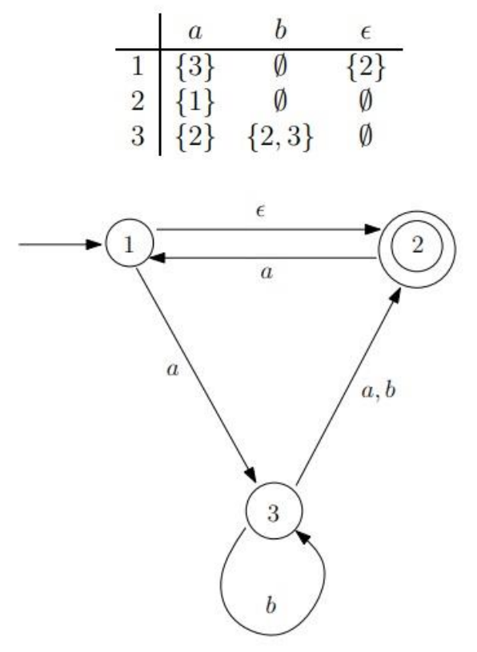

# Nondeterministic Finite Automata

A finite automata is **deterministic**, if the next state the machine goes to on any given symbol is uniquely determined.

有限自动机是 **确定性的**，如果机器在任何给定符号上进入的下一个状态是唯一确定的。

DFA has exactly one transition leaving each state for each symbol

DFA 只有一个过渡，每个组件都处于每个状态

However,

A finite automata is **nondeterministic**, if the machine allows for several or no choices to exist for the next state on a given symbol.

有限自动机是 **非确定性的**，如果机器允许给定符号的下一个状态存在多个选择或没有选择。

For a state *q* and symbol *s* ∈ Σ, NFA can have:

对于状态 *q* 和符号 *s* ∈ Σ，NFA 可以有：

- Multiple edges leaving *q* labelled with the same symbol *s*;

  留下 *q* 的多条边，用相同的符号 *s* 标记;

- No edge leaving *q* labelled with symbol *s*;

  没有边留下标有符号 *s* 的 *q*;

- Edge leaving *q* labelled with *ϵ* (without reading any symbol).

  边离开标有 *ε* 的 *q*（不读取任何符号）如果是ε的话可以直接不用接收任何字符直接跳转到下一个状态（DFA也可以有ε但是不是必要的）

This NFA is in a state with multiple ways to proceed, e.g. state *q*1 has two transition paths with 1.

此 NFA 处于具有多种继续方式的状态，例如状态 *q*1 有两条转换路径，其中 1。

The machine splits into multiple copies of itself (threads):

机器拆分为自身的多个副本（线程）：

- Each copy proceeds with computation independently of others.

  每个副本都独立于其他副本进行计算。

- NFA may be in a set of states, instead of a single state.

  NFA 可能处于一组状态，而不是单个状态。

- NFA follows all possible computation paths in parallel.

  NFA 并行遵循所有可能的计算路径。

- If a copy is in a state and next input symbol doesn’t appear on any outgoing edge from the state, then the copy dies or crashes.

  如果副本处于某种状态，并且下一个输入组件没有出现在该状态的任何传出边缘上，则副本会死机或崩溃。

The NFA accepts the input string, if any copy ends in an accept state after reading the entire string.

如果任何副本在读取整个字符串后以终态结束，则 NFA 接受输入字符串。

The NFA rejects the input string, if no copy ends in an accept state after reading the entire string.

如果在读取整个字符串后没有副本以终态结束，则 NFA 将拒绝输入字符串。

**Example:**

使用上面的例图，如果输入的是010，那么满足NFA的条件吗 --- 不满足

## Formal Definition of NFA  NFA 的正式定义

For any alphabet Σ*,* we define Σϵ to be the set:

Σϵ = Σ ∪ {ϵ}

Recall the notion of a power set: For any set Q, the power set of Q, denoted by  P(Q), is the set of all subsets of Q:

P(Q) = {R : R ⊆ Q}

A **nondeterministic finite automaton** (NFA) is a **5-tuple** M = (Q, Σ, δ, q, F),  where

**非确定性有限自动机** （NFA） 是一个 **5 元组** M = （Q， Σ， δ， q， F），其中

1.  *Q* is a finite set of **states**,   *Q* 是一组有限的 **状态**，
2.  *Σ* is a finite set of symbols, called the **alphabet** of the automaton,   *Σ* 是一组有限的符号，称为自动机的 **字母**，

3.  δ : Q × Σϵ → P(Q) is a function, called the **transition function**, 
4.  *q* ∈ *Q* is called the **initial state**,    *q* ∈ *Q* 称为 **初始状态**，
5.  *F* ⊆ *Q* is a set of **accepting/terminal states**.   *F* ⊆ *Q*是一组**初/终止状态**。

**Example:**

Formal description of above NFA M = (Q, Σ, δ, q, F)  对上面的例图进行解释

1. Q = {q1, q2, q3, q4 } 

2. Σ = {0, 1}

3. δ : Q × Σϵ → P(Q)

4. q1 is the start state

5. F = {q4 } is a set of accepting states.

Let M = (Q, Σ, δ, q, F) be an NFA, and let w ∈ Σ∗. We say that M accepts w, if w can be written as w = y1 y2… ym where yi ∈ Σϵ for all i with 1 ≤ i ≤ m, and there exists a sequence of states r1 , r2 ,… , rm in Q, such that:

- r0 = q

- ri+1 ∈ δ(ri , yi+1 ), for i = 0, 1, . . . , m − 1

- rm ∈ F

Otherwise, we say that M rejects the string w.  否则，我们说 M 拒绝字符串 w。

Extend the map δ to a map Q × Σ* → P(Q) by defining:

- *δ(q, ϵ) = {q} for all q ∈ Q*

- δ(q, 𝑤𝑎) = ∪p∈δ(q, w) δ(p, 𝑎) for all q ∈ Q; w ∈ Σ*; a ∈ Σ

Thus δ(q, w) is the set of all possible states that can arise when the input w is received in the state q. w is accepted provided that δ(q, w)  contains an accepting state.

因此，δ（q， w） 是在状态 q 中接收输入 w 时可能出现的所有可能状态的集合。如果 δ（q， w） 包含接受状态，则接受 w 。

### Notation: accepting/rejecting paths  表示法：接受/拒绝路径

Suppose, in a DFA, we can get from state p to state q via transitions labelled by letters of a word w. Then we say that the states p and q are connected by a path with label w.

假设在 DFA 中，我们可以通过单词字母 w 标记的过渡从状态 p 到状态 q。然后我们说状态 p 和 q 由带有标签 w 的路径连接。

If w = abc and the 2 intermediate states are r1 and r2 we could write this as:

如果 w = abc 并且 2 个中间状态是 r1 和 r2，我们可以将其写成：

- 

In a NFA, if *δ*(*p*, 𝑎) = {*q*, *r* } we could write:

- 

and this would be an **accepting path** if any state on the RHS is an accepting state, otherwise it would be **rejecting path**.

如果 RHS 上的任何状态是接受状态，则这将是一个 **接受路径**，否则它将是 **拒绝路径**。

### Language accepted by NFA  NFA 接受的语言

Let M = (Q, Σ, δ, q, F) be an NFA. The language L(M) accepted by M is defined as

- **L(M) = {w ∈ Σ∗: M accepts w }.**

## Difference between DFA and NFA

- DFA has transition function δ : Q × Σ → Q

  DFA 具有转换函数 δ ： Q × Σ → Q

- NFA has transition function δ : Q × Σϵ → P(Q)

  NFA 具有δ的过渡函数：Q × Σε → P（Q）

- Returns a set of states rather than a single state.

  返回一组状态，而不是单个状态。

- Allows for ϵ-transition because Σϵ = Σ ∪ {ϵ}.

  允许ε过渡，因为 Σε = Σ ∪ {ε}。

- **Note that every DFA is also an NFA.**

  请注意，每个 DFA 也是一个 NFA。

## Equivalence of DFAs and NFAs

Two machines (of any type) are **equivalent** if they recognize the same language. DFA is a restricted form of NFA:

如果两台机器（任何类型的）识别相同的语言，则它们是 **等效的**。DFA 是 NFA 的一种受限形式：

- **Every NFA has an equivalent DFA.**

  **每个 NFA 都有一个等效的 DFA。**

- **We can convert an arbitrary NFA to a DFA that accepts the same language.**

  **我们可以将任意 NFA 转换为接受相同语言的 DFA。**

- **DFA has the same power as NFA**

  **DFA 具有与 NFA 相同的功能**

## DFA to NFA

The formal conversion of a DFA to an NFA is done as follows: Let M = (Q, Σ, δ, q, F) be a DFA. Recall that δ is a function δ : Q × Σ → Q. We define the function δ′ : Q × Σϵ → P(Q) as follows. For any r ∈ Q and for any a ∈ Σϵ ,

DFA 到 NFA 的正式转换如下：设 M = （Q， Σ， δ， q， F） 为 DFA。回想一下，δ 是一个函数δ ： Q × Σ → Q。我们定义函数 δ′ ： Q × Σε → P（Q） 如下。对于任何 r ∈ Q 和任何 a ∈ Σε ，

Then N = (Q, Σ, δ ′ , q, F) is an NFA, whose behavior is exactly the same as that of the DFA M; the easiest way to see this is by observing that the state diagrams of M and N are equal. Therefore, we have L(M) = L(N).

那幺 N = （Q， Σ， δ ′ ， q， F） 是一个 NFA，其行为与 DFA的M 的行为完全相同;看到这一点的最简单方法是观察 M 和 N 的状态图相等。因此，我们有 L（M） = L（N）。

The ε-closure of a set of states R ⊆ *Q* : 

E(R) = { q | q can be reached from R by travelling over zero or more ε transitions }.

Example: E({q1, q2 }) = {q1, q2, q3 }.

## Examples 

1. What can this automaton do when it gets the string 010110 as input?

2. 
3. 
   - Can input string ''*abaa*'' be accepted by this NFA?
   - Possible paths of this string?
   - The accepting path of this string?

2. 

3. Consider the NFA M = (Q, Σ, δ, q, F), where Q = {1, 2, 3}, Σ = {a, b}, q = 1, F = {2}, and δ is given by the following table:

   
