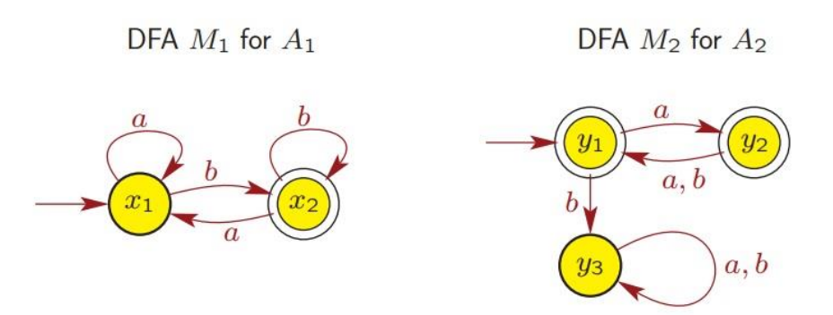
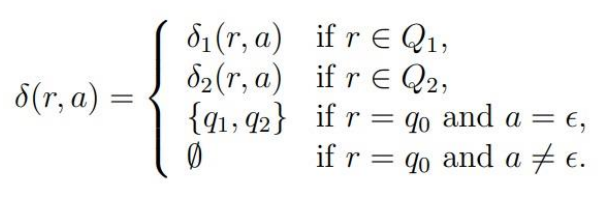
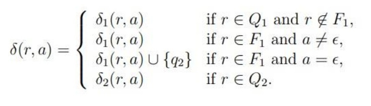
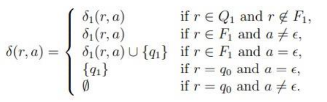
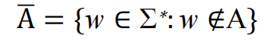
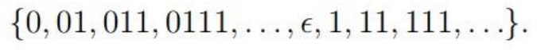

# Regular language 正则语言

## Definition 定义

Previous: A language is regular if it is recognized by some **DFA**

上一篇： 如果一种语言被某些 **DFA 识别** ，则该语言是常规的

Now: A language is regular if and only if some **NFA** recognizes it.

现在：当且仅当某些 **NFA** 识别出一种语言时，它才是常规的

Some operations on languages: Union, Concatenation and Kleene star

对语言的一些操作：Union、Concatenation 和 Kleene star

## Closed under operation

A collection S of objects is **closed** under operation *f* if applying *f* to members of S always returns an object still in S.

如果对 S 的成员应用 *f* 总是返回仍在 S 中的对象，则对象的集合 S 在操作 *f* 下是 **关闭的**。

Regular languages are indeed closed under the regular operations (e.g. union, concatenation, star …)

常规语言在常规操作下确实是封闭的（例如 union、concatenation、star ...）

## Regular Languages Closed Under Union

**The set of regular languages is closed under the union operation.**

常规语言集在 union 操作下关闭。

- i.e. A and B are regular languages over the same alphabet Σ, then A∪B is also a regular language.

  即 A 和 B 是同一字母 Σ 上的常规语言，那幺 A∪B 也是一种常规语言。

Proof:

- Since A and B are regular languages, there are finite automata M1 = (*Q1* *,* Σ*, δ1* *,q1* *, F1* ) and M2 = (*Q2* *,* Σ*, δ2* *, q2* *, F2* ) that accept A and B, respectively.

  由于 A 和 B 是常规语言，因此存在有限自动机 M1 = （*Q1* *，* Σ*， δ1* *，q1* *， F1* ） 和 M2 = （*Q2* *，* Σ*， δ2* *、q2* *、F2* ），分别接受 A 和 B。

- In order to prove that A ∪ B is regular, we have to construct a finite automaton M that accepts A ∪ B. In other words, M must have the property that for every string w ∈ Σ* :

  为了证明 A ∪ B 是正则的，我们必须构造一个接受 A ∪ B 的有限自动机 M。换句话说， M 必须具有对于每个字符串 w ∈ Σ* 的属性：

Continue to proof

Given M1 and M2 that A = L(M1 ) and B = L(M2 ), we can define M = (*Q,* Σ*, δ, q, F*):

给定 M1 和 M2 ，其中 A = L（M1 ） 和 B = L（M2 ），我们可以定义 M = （*Q，* Σ*， δ， q， F*）：

- *Q = Q1* × *Q2* *=* {(*q1,* *q2* ): *q1*∈ *Q1* and *q2* ∈ *Q2* }
- Σ is same as the alphabet of A and B
- *q =* (*q1,* *q2* )
- *F =* {(*q1,* *q2* ): *q1*∈ *Q1* or *q2* ∈ *Q2* }

- *δ* : *Q* × Σ → *Q*

  *δ*((*q1,* *q2* ), *a*) = (*δ*(*q1* , *a*) , *δ*(*q2* , *a*)), *a* ∈ Σ

Continue to proof

- *δ* * ((*q1,* *q2* ), *w*) = (*δ* * (*q1* , *w*) , *δ* * (*q2* , *w*))

- *δ* * ((q1, q2 ), *w*) ∈ *F* ⇔ *δ* * (*q1* , *w*) ∈ *F1* or *δ* * (*q2* , *w*) ∈ *F2*

- M accepts *w* ⇔ *δ* * (*q1* , *w*) ∈ *F1* or *δ* * (*q2* , *w*) ∈ F2

- M accepts *w* ⇔ M1 accepts *w* or M2 accepts *w*

Proved

**Example:**

Consider the following DFAs and languages over Σ = {*a*, *b*}:

DFA M1 recognizes A1 = L(M1)

DFA M2 recognizes A2 = L(M2)

**DFA M for A1∪ A2 ?**

Example2:

**How to prove this from the perspective of NFA?**

**如何从 NFA 的角度证明这一点？**

Proof

Consider the following NFAs:

NFA M1 = (*Q1* *,* Σ*, δ1* *, q1* *, F1* ) recognizes A1 = L(M1)

NFA M2 = (*Q2* *,* Σ*, δ2* *, q2* *, F2* ) recognizes A2 = L(M2)

We will construct an NFA M = (*Q,* Σ*, δ, q, F*)

- *Q =* {*q0* }∪ *Q1* ∪ *Q2*
- *q0* is the start state of M
- *F* = *F1* ∪ *F2*
- *δ* : *Q* × Σϵ → *P*(*Q*) is defined as: For any *r* ∈ *Q* and for any *a* ∈ Σϵ

Proof:

## Regular Languages Closed Under Concatenation

The concatenation of A1 and A2 is defined as:

A1 和 A2 中的串联定义为：

- A1 A2 = {*ww′* : *w* ∈ A1 and *w′* ∈ A2 }

Proof

Consider the following NFAs:

NFA M1 = (*Q1* *,* Σ*, δ1* *, q1* *, F1* ) recognizes A1 = L(M1)

NFA M2 = (*Q2* *,* Σ*, δ2* *, q2* *, F2* ) recognizes A2 = L(M2)

We will construct an NFA M = (*Q,* Σ*, δ, q, F*) for A1 A2

- *Q = Q1* ∪ *Q2*
- M has the same start state as M1 : *q1*
- Set of accept states of M is same as M2 : *F2*
- *δ* : *Q* × Σϵ → *P*(*Q*) is defined as: For any *r* ∈ *Q* and for any *a* ∈ Σε

Proof:

## Regular Languages Closed Under Kleene star

The star of A is defined as:

- A * = {*u1* *u2* . . . *uk* : *k* ≥ *0* and *ui* ∈ **A** for all *i = 1, 2, . . . , k*}

Proof:

Consider the following NFA:

NFA M1 = (*Q1* *,* Σ*, δ1* *, q1*, F1* ) recognizes A = L(M1)

We will construct an NFA M = (*Q,* Σ*, δ, q, F*) for A*

- *Q =* {*q0* }∪ *Q1*

- *q0* is the start state of M

- *F =* {*q0* }∪ *F1*

- *δ* : *Q* × Σϵ → *P*(*Q*) is defined as: For any *r* ∈ *Q* and for any *a* ∈ Σϵ

Proof

## Regular Languages Closed Under Complement and Interaction

The set of regular languages is closed under the complement and interaction operations:

常规语言集在 complement 和 interaction 操作下是封闭的：

- If A is a regular language over the alphabet Σ, then the complement:
  -   is also a regular language.

- If A1 and A2 are regular languages over the same alphabet Σ, then the interaction:

  如果 A1 和 A2 是同一字母 Σ 上的常规语言，则交互作用：

  - A1 ∩ A2 = {*w* ∈ Σ∗: *w* ∈ A1 and *w* ∈ A2 }  is also a regular language.

## Regular expression

Regular expressions are means to describe certain languages.

正则表达式是描述某些语言的手段。

**Example:**

Consider the expression:

- (0∪1)01*

The language described by this expression is the set of all binary strings satisfy:

此表达式描述的语言是满足以下条件的所有二进制字符串的集合：

- that start with either 0 or 1 (this is indicated by (0 ∪ 1) ),

  以 0 或 1 开头（由 （0 ∪ 1） 表示），

- for which the second symbol is 0 (this is indicated by 0),

  第二个符号为 0（用 0 表示），

- that end with zero or more 1s (this is indicated by 1∗).

  以零个或多个 1 结尾（用 1∗ 表示）。

Further examples:

- The language {*w* : *w* contains exactly two 0s} is described by the expression:

  语言 {*w* ： *w* 正好包含两个 0} 由表达式描述：

- The language {*w* : *w* contains at least two 0s} is described by the expression:

  语言 {*w* ： *w* 包含至少两个 0} 由表达式描述：

- The language {*w* : 1011 is a substring of *w*} is described by the expression:

  语言 {*w* ： 1011 是 *w*} 的子字符串，由表达式描述：

### Formal Definition of regular expression

Let Σ be a non-empty alphabet.

设 Σ 为非空字母表。

1. *ϵ* is a regular expression.
2. ∅ is a regular expression.
3. For each *a* ∈ Σ, *a* is a regular expression.
4. If *R1* and *R2* are regular expressions, then *R1* *R2* is a regular expression.
5. If *R1* and *R2* are regular expressions, then *R1* *R2* is a regular expression.
6. If *R* is a regular expression, then R∗ is a regular expression.

### Exercise:

Given (0∪1)\*101(0∪1)\*, prove it is a regular expression (note: Σ={0, 1}).

Further Definition:

If *R* is a regular expression, then L(*R*) is the **language** generated (or described or defined) by *R*.

如果 *R* 是一个正则表达式，那幺 L（*R*） 是由 *R* 生成（或描述或定义）的 **语言**。

**Formal Definition of regular expressions **正则表达式的正式定义

Let Σ be a non-empty alphabet. 

设 Σ 为非空字母表。

1. The regular expression *ϵ* describes the language {*ϵ*}. 
2. The regular expression ∅ describes the language ∅. 
3. For each *a* ∈ Σ, the regular expression a describes the language {*a*}. 
4. Let *R1* and *R2* be regular expressions and let L1 and L2 be the languages described by them, respectively. The regular expression *R1* ∪ *R2* describes the language L1 ∪ L2 . 

5. Let *R1* and *R2* be regular expressions and let L1 and L2 be the languages described by them, respectively. The regular expression R1R2 describes the language L1L2 . 

6. Let R be a regular expression and let L be the language described by it. The regular expression R∗ describes the language L∗.

Example；

Given a regular expression (0∪ *ϵ*) 1*, it describes the language:

- Observe that this language is also described by the regular expression 01\* ∪ 1\*