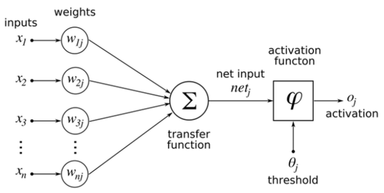
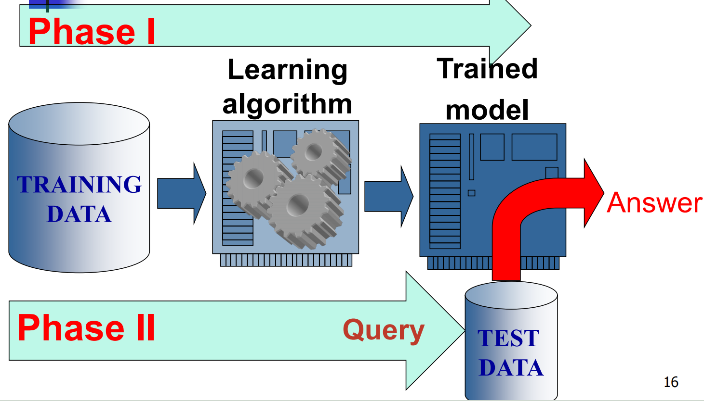

# Introduction

Bio-computation: a field devoted to tackling complex problems using computational methods modeled after principles encountered in **Nature**.

生物计算：一个致力于运用基于自然界原理建模的计算方法来解决复杂问题的领域。

**Goal:** to produce informatics tools with enhanced robustness, scalability, flexibility and reliability.

**目标**： 开发具备增强稳健性、可扩展性、灵活性和可靠性的信息学工具。

A multi-disciplinary field strongly based on Biology, Computer Science, Informatics, Cognitive Science, and Robotics. 

一个高度基于生物学、计算机科学、信息学、认知科学和机器人技术的多学科领域。

The main content is **Artificial Neural Networks**.

主要内容是**人工神经网络**。

## Artificial intelligence (AI), deep learning, and neural network 人工智能（AI）、深度学习与神经网络

**AI**- any technique which enables computer to mimic human behavior

**人工智能（AI）**指使计算机能够模拟人类行为的任何技术

**ML**- subset of AI techniques which use statistical methods to enable machines to improve with experience

**机器学习（ML）**是人工智能的一个子领域，其通过统计方法使机器能够借助经验实现自我优化。

**Neural network** -- also known as "artificial" neural network -- is one type of machine learning that's loosely based on how neurons work in the brain

**神经网络**，亦称为“人工”神经网络，是一种机器学习方法，其原理大致基于大脑中神经元的工作方式。

**DL**- subset of ML which makes the computation of multi-layer neural network feasible

**深度学习（DL）**是机器学习（ML）的一个子集，它使得多层神经网络的计算变得可行。

## ANN: a brief history

- Some early researchers explored the idea of neuron models for AI. When the limits of *Classic AI* became clear, ANN with new models and algorithms started proving useful. 

  一些早期研究者探讨了将神经元模型应用于人工智能的构想。当经典人工智能的局限性逐渐显现时，采用新型模型与算法的神经网络开始展现出实用价值。

- Artificial neural networks (ANNs) was created over 50 years ago when very little was known about how real neurons worked. 

  人工神经网络（ANNs）诞生于五十多年前，当时人们对真实神经元的工作原理知之甚少。

- Since then, neuroscientists have learned a great deal about neural anatomy and physiology, **but the basic design of ANNs has changed very little**. Therefore, **despite the name neural networks, the design of ANNs has little in common with real neurons**.

  自那时起，神经科学家对神经解剖学与生理学已有了深入认识，**然而人工神经网络的基本架构却鲜有变革**。因此，**尽管冠以"神经网络"之名，其设计原理与真实神经元实则相去甚远**。

- Instead, the emphasis of ANNs moved from biological realism to the desire to learn from data. Consequently, the big advantage of *Simple* *Neural Networks* over *Classic AI* is that they learn from data and **don’t require an expert to provide rules**.

  相反，人工神经网络的重点从生物仿真转向了从数据中学习的追求。因此，*简单神经网络*相较于*经典人工智能*的一大优势在于它们能够从数据中学习，**无需专家提供规则**。

- Today ANNs are part of a broader category of machine learning which includes other mathematical and statistical techniques. 

  如今，人工神经网络（ANNs）已成为机器学习这一更广泛范畴的一部分，该范畴还囊括了其他数学与统计方法。

- Machine learning techniques, including ANNs, look at large bodies of data, extract statistics, and classify the results

  机器学习技术，包括人工神经网络（ANNs），通过分析海量数据、提取统计信息并对结果进行分类来实现其功能。

## Biological Neural Network Approach 生物神经网络方法

- Human brain is an intelligent system. By studying how the brain works we can learn what intelligence is and what properties of the brain are essential for any intelligent system. 

  人脑是一个智能系统。通过研究大脑的工作机制，我们可以理解智能的本质，并揭示大脑中哪些特性对所有智能系统至关重要。

- Other essential attributes include that **memory** is primarily a sequences of patterns, that behavior is an essential part of all learning, and that learning must be continuous. 

  其他重要特性包括：**记忆**主要由一系列模式构成，行为是所有学习过程中的关键组成部分，并且学习必须持续不断。

- In addition, biological neurons are far more sophisticated than the simple neurons used in the simple neural network approach.

  此外，生物神经元远比简单神经网络方法中使用的简单神经元更为复杂。

## Biological Neural Networks Overview 生物神经网络概述

- The inner-workings of the human brain are often modeled around the concept of **neurons** and the networks of neurons known as **biological neural networks**.

  人脑的内部运作机制常以神经元以及由神经元构成的网络——即**生物神经网络**——为核心概念进行建模。

  - It’s estimated that the human brain contains roughly 100 billion neurons, which are connected along pathways throughout these networks.

    据估计，人类大脑大约包含1000亿个神经元，这些神经元沿着遍布网络的通路相互连接。

  - At a very high level, neurons communicate with one another through an interface consisting of **axon terminals** that are connected to **dendrites** across a gap (**synapse**)

    在较高层次上，神经元通过一种接口进行通信，该接口由轴突末梢构成，这些末梢通过间隙（突触）连接到树突。

## Abstract neuron 抽象神经元

- In plain English, a single neuron will pass a message to another neuron across this interface if the sum of weighted input signals from one or more neurons (summation) into it is great enough (exceeds a threshold) to cause the message transmission. 

  通俗地说，当一个或多个神经元输入的加权信号总和（即求和）足够大（超过某个阈值），足以触发信息传递时，单个神经元就会通过这个接口将信息传递给另一个神经元。

- This is called activation when the threshold is exceeded and the message is passed along to the next neuron.

  当超过阈值且信息传递至下一个神经元时，此过程被称为激活。

## Further on Simple Neural Network 进一步探讨简单神经网络

- Neural networks are mathematical models *inspired* by the human brain. 

  神经网络是受到人脑启发的数学模型。

- Neural networks, and machine learning in general, engage in two different phases.

  神经网络，以及更广泛的机器学习，包含两个不同的阶段。

  - **First** is the **learning phase**, where the model trains to perform a specific task. It could be learning how to describe photos to the blind or how to do language translations. 

    首先是学习阶段，此阶段中模型通过训练掌握执行特定任务的能力。该阶段可能涉及学习如何为视障人士描述图像内容，或是掌握语言翻译的技能。

  - The **second** phase is the **application phase**, where the finished model is used.

    第二阶段是应用阶段，即使用已完成的模型。

## Neural Network 神经网络

- In a biological system, learning involves adjustments to the synaptic connections between neurons

  在生物系统中，学习涉及对神经元之间突触连接的调整。

  - same for artificial neural network (ANN)

    同样适用于人工神经网络（ANN）

- Neural networks are configured for specific applications, such as **prediction** or forecasting, **pattern recognition** or data classification, through a **learning process**

  神经网络通过学习过程被配置用于特定应用，例如预测或预报、模式识别或数据分类。

## Machine Learning

- **Machine learning:** programming computers to *optimize a performance criterion using example data* or past experience.

  **机器学习**： 通过编程使计算机能够利用示例数据或过往经验来优化性能标准。

  - There is no need to “learn” to calculate payroll

    无需“学习”如何计算薪资。

- **Learning is used when:**

  - Human expertise does not exist (e.g.,navigating on Mars),

    人类专业知识并不存在（例如，在火星上导航）。

  - Humans are unable to explain their expertise (e.g., speech recognition)

    人类无法解释其专业知识（例如，语音识别）。

  - Solution changes in time (e.g., forecasting stock market)

    解决方案随时间变化（例如，股市预测）

  - Solution needs to be adapted to particular cases (e.g., user biometrics)

    解决方案需根据特定情况（例如，用户的生物特征）进行调整。

