# M-P_Neuron & HEBB_Learning & Perceptron M-P神经元 & 赫布学习 & 感知机

## Abstract model of a neuron 神经元抽象模型

An abstract neuron *j* with *n* inputs:

一个具有 n 个输入的抽象神经元 j：

- Each input *i* transmits a real value ai

  每个输入 i 传输一个实数值 ai。

- Each connection is assigned with the weight wij

  每个连接被赋予权重 wij。

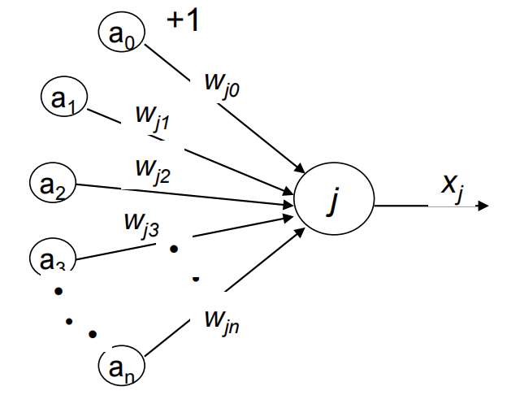

The total input S, *i.e.,* the sum of the products of the inputs with the corresponding weights, is compared with the threshold (equal to 0 in this case), and the outcome Xi is produced consequently.

总输入S，即输入与对应权重乘积之和，会与阈值（此例中为0）进行比较，并据此产生输出Xi。

## The McCulloch-Pitts Neuron 麦卡洛克-皮茨神经元

M-P神经元是一个极其简化的计算单元。你可以把它想象成一个微小的决策机器，它接收多个输入，然后根据一个简单的规则决定是否要“激活”并产生一个输出。

The authors modelled the neuron as 

作者将神经元建模为

- A binary discrete-time element;

  一个二进制离散时间元件；

- With **excitatory** and **inhibitory** inputs and an excitation threshold;

  具有**兴奋性**和**抑制性**输入，并伴有兴奋阈值；

- The network of such elements was the first model to tie the study of neural networks to the idea of computation in its modern sense.

  这种元素的网络是首个将神经网络研究与现代意义上的计算概念联系起来的研究模型。

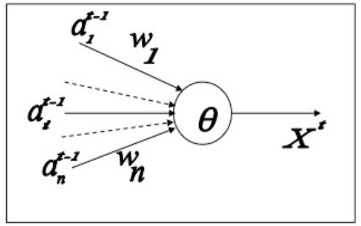

- The input values $$a^{t}_{i}$$ from the *i-th* presynaptic neuron at any instant *t* may be equal either to 0 or 1 only

  在任何时刻 t，来自第 i 个突触前神经元的输入值 $$a^{t}_{i}$$ 只能等于 0 或 1。（神经元可以接收一个或多个输入，表示为 x1,x2,...,xn。在最经典的M-P模型中，这些输入是 **二进制 (binary)** 的，即它们的值只能是 0 (未激活) 或 1 (激活)。）

  - The weights of connections ***wi*** are

    连接权重 **wi** 的值为

    - +1 for excitatory type connection

      对于兴奋型连接，权重为1

    - -1 for inhibitory type connection

      -1 表示抑制型连接

  - There is an excitation threshold θ associated with the neuron.

    神经元存在一个相关的兴奋阈值θ。

- Output $$x^{t+1}$$ of the neuron at the following instant t+1 is defined according to the rule

  神经元在下一时刻 t+1 的输出 $$x^{t+1}$$ 根据以下规则定义：（神经元首先会将所有接收到的输入与其对应的权重相乘，然后将它们全部加起来。这个过程被称为“加权求和”(weighted sum)。）

  - $$x^{t+1} = 1$$ if and only if $$S^t=\sum_iw_{i}a^{t}_{i} \ge \theta$$ (或者也会写成 $sum = \sum^{n}_{i=1}w_ix_i$)

- In the MP neuron, we shall call the instant total input $$S^{t}$$ - **instant state of the neuron**

  在MP神经元中，我们将瞬时总输入 $$S^{t}$$ 称为神经元的**瞬时状态**。

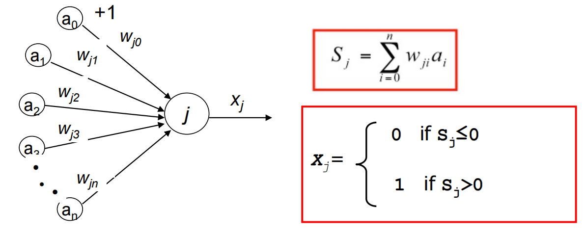

- The **state** $$S^{t}$$ of the MP neuron does not depend on the previous state of the neuron itself, but is simply

  MP神经元的 state $S^{t}$ 并不依赖于神经元本身的先前状态，而是简单地

  - $S^{t}=\sum_i w_{ij}a^t_i=f(t)$

    - **x(t):** 代表神经元在某个时刻 t 的 **最终输出 (output)**。根据我们之前的讨论，这个值是二进制的，即 0 或 1。它代表了神经元的最终决定：“激活” (1) 还是“不激活” (0)。

      **S'** (在公式中也写作**S^t**): 代表神经元接收到的 **内部总信号** 或 **内部状态 (internal state)**。**这一点至关重要：你可以直接将 S' 理解为我们之前讨论的所有输入的“加权和”**，即 $S^{t}=\sum{w_ix_i}$。它是神经元在做出决定之前，所整合的全部“证据”的总和。

      **g(...)**: 这就是 **激活函数 (activation function)**。它的作用就像一个转换器，接收一个可能是任意数值的内部总信号 **S'**，然后根据一个规则，将其转换成一个标准化的输出信号 **x(t)**。根据 $S_t$ 和 $\theta$ 的关系，决定最后的输出 $x_j^t$。**公式的含义是**：感知机的输出 $X_j$ 的值，取决于其内部的加权和 $S_j$ 是否达到了阈值 $\theta_j$。如果达到了（大于或等于），感知机就“激活”并输出1；否则，它就保持“沉默”，输出0。

- The neuron output $X^{t+1}$ is function of its state $S^t$, therefore the output also can be written as function of discrete time

  神经元输出$X^{t+1}$是其状态$S^t$的函数，因此该输出亦可表示为离散时间的函数。

  - $x(t) = g(S^t)=g(f(t))$

### Activation function 激活函数

- The neuron output $X^t$ can be written as:

  神经元输出 $X^t$ 可表述为：

  - $x(t) = g(S^t) = g(f(t))$, where *g* is the **threshold activation function**

    其中 g 为**阈值激活函数**。

  - $$ g(S^t) = H(S^t - \theta) = \begin{cases} 1, & \text{if } S^t \geq \theta; \\ 0, & \text{if } S^t < \theta. \end{cases} $$

  - Here **H** is the Heaviside (unit step) function: $H(X) = \begin{cases} 1, & x \ge 0; \\ 0, & x < 0. \end{cases}$

    此处 H 表示赫维赛德（单位阶跃）函数

这是决策的关键步骤。神经元内部有一个固定的 **阈值 (Threshold)**，我们用希腊字母 θ (theta) 来表示。

1. 计算出的 “加权和 $S^t$” 会与这个阈值进行比较。
2. **如果加权和大于或等于 (≥) 阈值 θ**，那么神经元就会被 **激活 (fire)**，输出为 **1**。
3. **如果加权和小于 (<) 阈值 θ**，那么神经元 **保持不激活**，输出为 **0**。

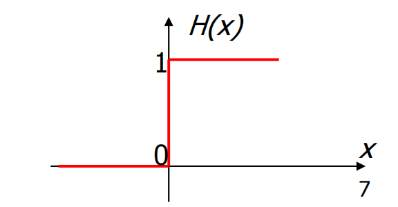

### Simple Example

**一个简单的例子：实现逻辑与 (AND)** 假设一个M-P神经元有两个输入 x1 和 x2。我们想让它只在 $x_1$ 和 $x_2$ **同时** 为1时才输出1。 我们可以这样设置：

- 权重: w1=1, w2=1
- 阈值: θ=2

现在我们来验证：

- **输入 (0, 0):** 加权和 = (10) + (10) = 0。因为 0<2，所以输出 **0**。
- **输入 (0, 1):** 加权和 = (10) + (11) = 1。因为 1<2，所以输出 **0**。
- **输入 (1, 0):** 加权和 = (11) + (10) = 1。因为 1<2，所以输出 **0**。
- **输入 (1, 1):** 加权和 = (11) + (11) = 2。因为 2≥2，所以输出 **1**。 

## MP-neuron vs brain function MP神经元与大脑功能对比

- M-P neuron made a base for a machine (network of units) capable of

  M-P神经元为能够实现机器（单元网络）奠定了基础。

  - storing information and

    存储信息和 

  - producing logical and arithmetical operations

    产生逻辑和算术运算

- These correspond to the main functions of the brain

  这些对应于大脑的主要功能

  - to store knowledge, and 

    存储知识，

  - to apply the knowledge stored to solve problems

    运用储存的知识解决问题

## ANN Learning Rules 人工神经网络学习规则

M-P neuron 

M-P神经元

- storing information and

  M-P神经元

- producing logical and arithmetical operations

  进行逻辑与算术运算

The next step is to realize another important function of the brain, which is

下一步是实现大脑的另一重要功能，即

- to acquire new knowledge through experience, *i.e.*, **learning**

  通过经验获取新知识，即学习。

**Learning** means to change in response to experience. 

**学习**是指因经验而引发的改变。

In a network of MP-neurons, binary weights of connections and thresholds are fixed. The only change can be the change of pattern of connections, which is technically expensive.

在MP神经元网络中，**连接权重**与**阈值**均为**固定的二进制数值**。唯一可能的变化在于连接模式的调整，而这种调整在技术实现上成本较高。

**Some easily changeable free parameters are needed.**

**需要一些易于调整的自由参数。**

**The ideal free parameters to adjust**, and so to resolve learning without changing patterns of connections, are the **weights of connections $w_{ij}$**

调整连接权重 $w_{ij}$ 是理想的**自由参数**选择，这样可以在不改变连接模式的情况下实现学习。

Definition:

- **ANN learning rule**: how to adjust the weights of connections to get desirable output.

  **人工神经网络学习规则**：如何调整连接权重以获得期望的输出。

- Much work in artificial neural networks focuses on the learning rules that define

  在人工神经网络的研究中，大量工作集中于定义学习规则的探索。

  - how to change the weights of connections between neurons to better adapt a network to serve some overall function.

    如何调整神经元之间的连接权重，以使网络更好地适应并服务于某种整体功能。

When experimental neuroscience was limited, the classic definitions of these learning rules came not from biology, but from *psychological studies* of **Donald Hebb** and **Frank Rosenblatt**

在实验神经科学尚不完善的时期，这些学习规则的定义并非源于生物学，而是来自唐纳德·赫布与弗兰克·罗森布拉特的心理学研究。

Hebb proposed that a particular type of **use-dependent modification** of the connection strength of synapses *might*  *underlie learning in the nervous system*

赫布提出，一种特定类型的**依赖使用**的**突触连接强度改变**可能是神经系统学习的基础。

## Hebb's Rule 赫布法则

Hebb proposed a **neurophysiological postulate**:

赫布提出了一个神经生理学假说：

- 赫布法则描述了一种 **突触可塑性 (synaptic plasticity)** 的基本形式，即神经元之间连接的强度是可变的，并且这种变化是基于神经元活动的相关性。

  1. **前提：** 假设我们有两个神经元，神经元A（突触前神经元, presynaptic neuron）和神经元B（突触后神经元, postsynaptic neuron），它们之间有一个突触连接。
  2. **法则：** 如果神经元A **重复地、持续地** 参与了对神经元B的激发（即A激发，紧接着B也激发），那么A到B的突触连接就会被 **增强**。
  3. **结果：** 这种增强意味着，未来神经元A的激发将更容易导致神经元B的激发。它们之间的“沟通效率”变高了。

  反之，如果一个神经元A的激发与神经元B的激发无关（例如A激发时B总是不激发），那么它们之间的连接可能会被减弱或消除。这个推论常被称为“**Neurons that fire out of sync, lose their link.**”（异步激发的神经元，会失去它们的连接）。

The simplest formalization of Hebb’s rule is *to increase weight of connection at every next instant in the way:*

赫布定律的最简化形式化表述为：在每一后续时刻以如下方式增强连接权重：

- $$ w_{ji}^{k+1} = w_{ji}^k + \Delta w_{ji}^k $$
  - 你明天的知识储备 = 你今天的知识储备 + 今天新学到的知识

- where  $$ \Delta w_{ji}^k = C a_i^k x_j^k $$

In above equations:

- $w_{ij}^{k}$ is the weight of connection at instant *k*

  $w_{ij}^{k}$ 为时刻 k 的连接权重。

- $w_{ij}^{k+1}$ is the weight of connection at the following instant *k+1*

  $w_{ij}^{k+1}$ 表示在下一个时刻 k+1 的连接权重。

- ∆$w_{ij}^{k}$ is increment by which the weight of connection is enlarged 

  权重连接增大的增量∆$w_{ij}^{k}$。或者说是从神经元 i 到神经元 j 的权重变化量

- $C$ is positive coefficient which determines **learning rate**

  C是一个正系数，用于确定学习速率，也就是控制每次权重更新的幅度。

- $a^{k}_{i}$is input value from the presynaptic neuron at instant *k*

  在时刻k，来自突触前神经元的输入值为$a^{k}_{i}$。

- $x^{k}_{j}$ is output of the postsynaptic neuron at the same instant *k*

  $x^{k}_{j}$ 是突触后神经元在同一时刻 k 的输出。

根据上面的公式：

- 如果神经元 i 和 j **同时** 被激活 ($x_i$=1, $y_j$=1)，那么权重变化 ∆$w_{ij}^{k}$  为正，权重 $w_{ij}$ 会增加。

- 如果任意一个神经元没有被激活 ($x_i$=0 或 $y_j$=0)，那么权重变化为0，权重不发生改变。

Equations emphasize the **correlation** nature of a Hebbian synapse

方程式强调了赫布突触的**相关性**本质。

Hebb’s original learning rule:

赫布最初的学习法则：

- referred exclusively to excitatory synapses, and 

  特指兴奋性突触，且

- has the unfortunate property that it can only increase synaptic weights, thus washing out the distinctive performance of different neurons in a network, as the connections drive into saturation …

  这一机制存在一个不利特性，即它仅能增强突触权重，从而导致网络中不同神经元的独特表现被削弱，因为连接会逐渐趋于饱和状态

- However, when the Hebbian rule is augmented by a formalization rule, e.g., keep constant the total strength of synapses upon a given neuron, it tends to “sharpen” a neuron’s predisposition “without a teacher”, causing its firing to become better correlated with a cluster of stimulus patterns.

  然而，当赫布法则通过形式化规则（例如，保持特定神经元上突触总强度恒定）进行增强时，它倾向于"无导师"状态下锐化神经元的反应倾向，使其放电行为与特定刺激模式簇的关联性显著提高。

- For this reason, Hebb's rule plays an important role in studies of many ANN algorithms, such as unsupervised learning or self-organization, which we will study later.

  正因如此，赫布法则在众多人工神经网络算法的研究中扮演着重要角色，例如我们后续将探讨的无监督学习与自组织学习等领域。

### Hebb's 赫布法则案例

巴甫洛夫的经典条件反射实验是解释赫布法则最直观、最经典的案例。

**实验设置的神经元模拟：**

- **神经元 F (Food):** 当狗看到或闻到食物时，这个神经元会强烈激发。
- **神经元 B (Bell):** 当狗听到铃声时，这个神经元会激发。
- **神经元 S (Salivate):** 这个神经元被激发时，会触发狗的唾液分泌。

**第一阶段：条件反射建立前 (Initial State)**

1. **食物 → 唾液：** 食物（非条件刺激）和唾液分泌（非条件反射）之间存在一个天生的、**强大的突触连接**。所以，神经元F到神经元S的权重 $w_{FS}$ 是 **非常高** 的。当F激发时，足以让S也激发。
2. **铃声 → 无唾液：** 铃声（中性刺激）和唾液分泌之间没有天生联系。因此，神经元B到神经元S的权重 $w_{BS}$ 是 **非常低或者为零** 的。当B单独激发时，完全不足以让S激发。

**第二阶段：训练/学习过程 (Conditioning Phase)**

现在，实验者 **同时** 摇铃并给狗喂食，并 **重复** 这个过程很多次。

- **发生了什么？**

  1. 铃声响起，**神经元B (Bell) 激发**。
  2. 食物出现，**神经元F (Food) 激发**。
  3. 由于 wFS 非常强，F的激发导致了 **神经元S (Salivate) 激发**。

- **应用赫布法则：** 在这个过程中，我们观察到突触前神经元 **B (Bell) 正在激发**，而与此同时，突触后神经元 **S (Salivate) 也在激发**（尽管S的激发是由F引起的）。 根据赫布法则 "neurons that fire together, wire together"，神经元B和神经元S同时被激活了。因此，它们之间的突触权重 $w_{BS}$ 将会增加！

  **Δ$w_{BS}$ = η⋅(activation of B)⋅(activation of S)>0**

  每一次“铃声+食物”的重复也就是 $w_{FS}$ 的激发，都会让 $w_{BS}$ 这个权重增加一点点。经过多次重复，这个原本很弱的连接会变得越来越强。

**第三阶段：条件反射建立后 (Final State)**

经过充分的训练，权重 $w_{BS}$ 已经从接近零变成了一个很高的值。

- **现在只摇铃，不给食物：**
  1. 铃声响起，**神经元B (Bell) 激发**。
  2. 由于权重 wBS 现在已经足够强大，来自神经元B的信号 **单独** 就足以使神经元S超过其激活阈值并激发。
  3. 结果：**狗开始分泌唾液**。

**结论：** 狗已经学会了将“铃声”和“食物”关联起来。在神经层面，赫布法则解释了这个学习过程：一个原本无关的刺激（铃声），通过与一个能引起反应的刺激（食物）的反复同步出现，建立起了一条新的、有效的神经通路。

### Hebb's rule in practice 赫布法则练习

**Input unit**

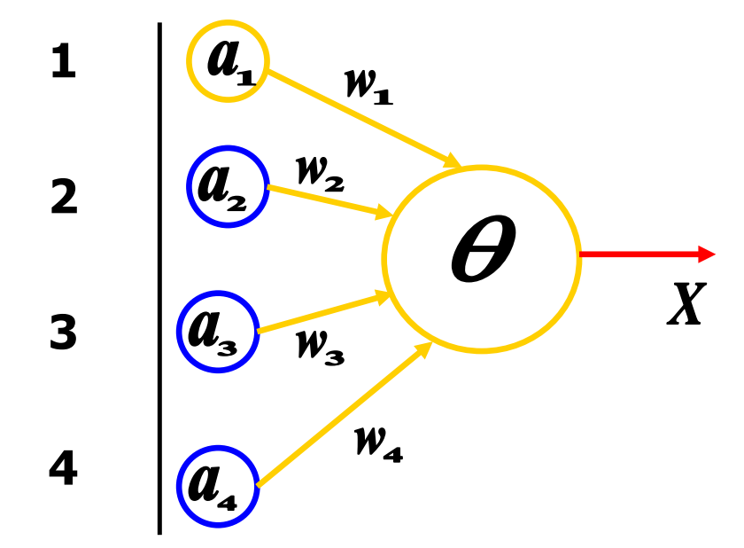

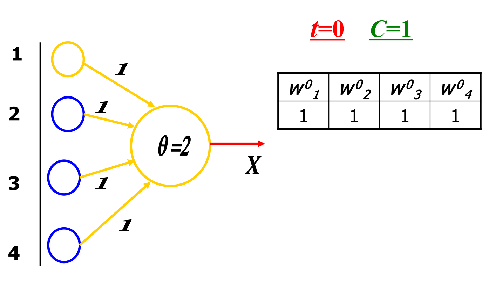

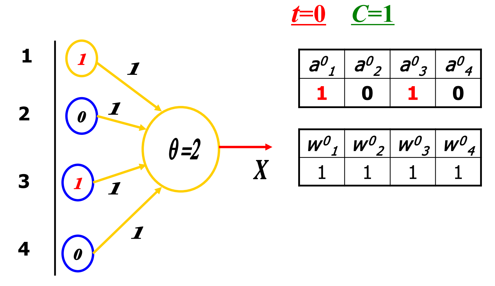

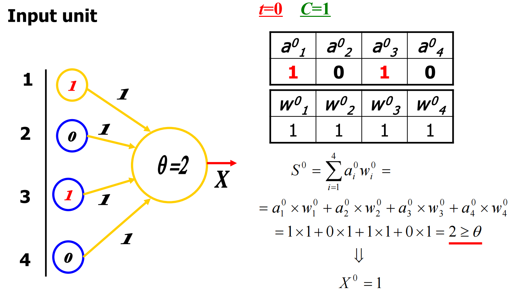

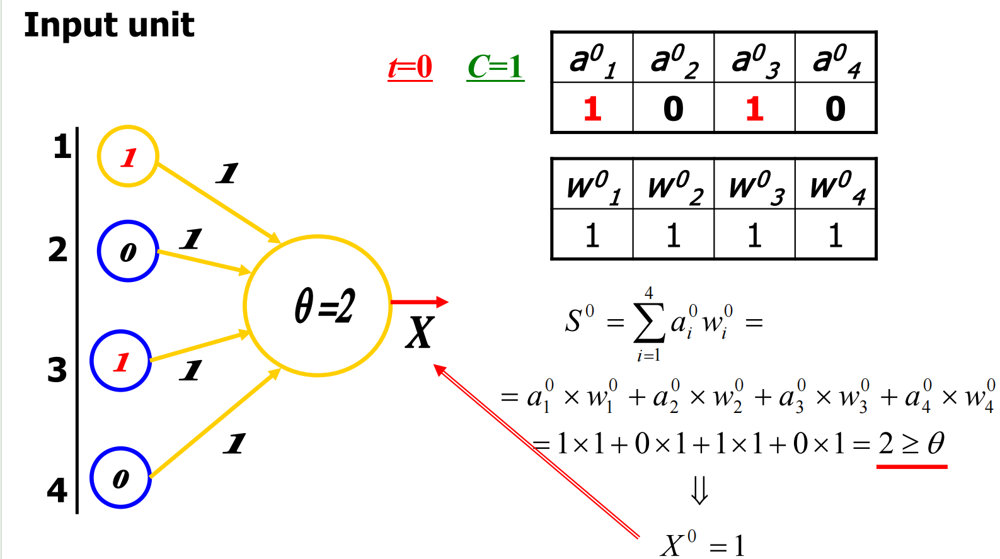

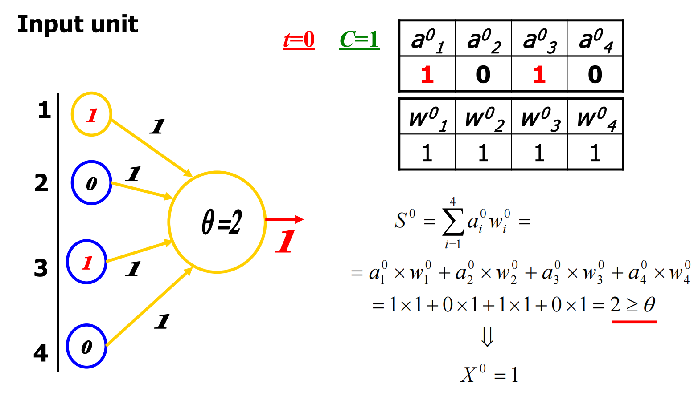

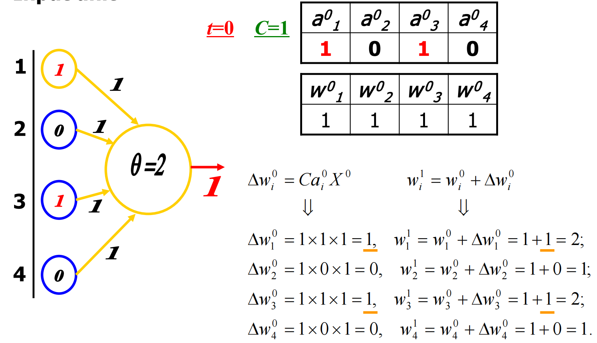

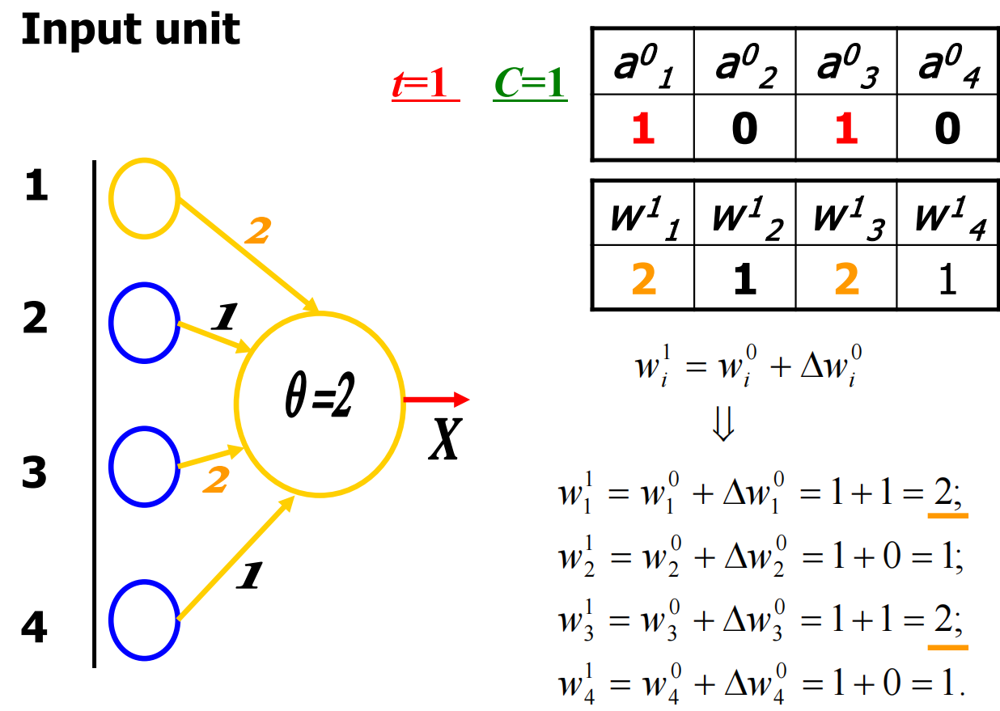

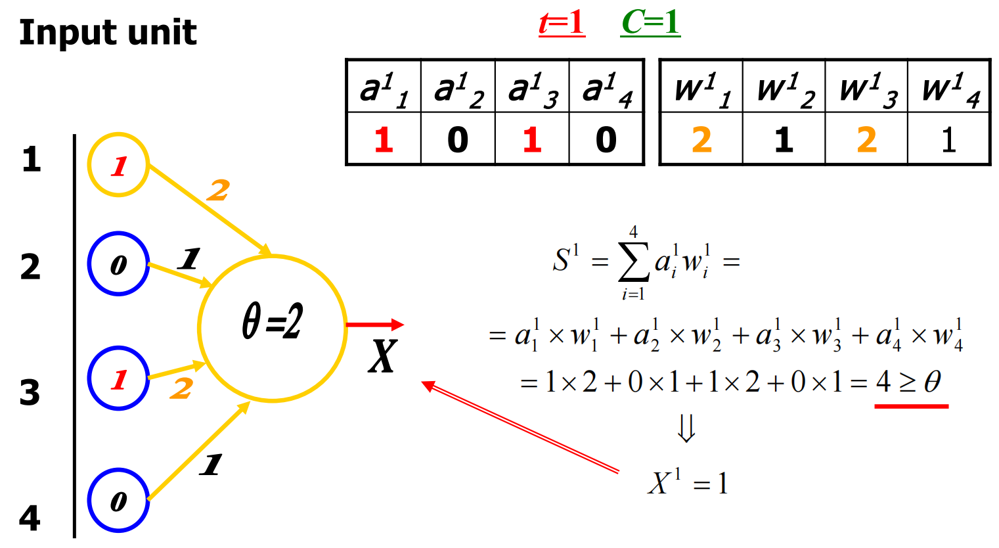

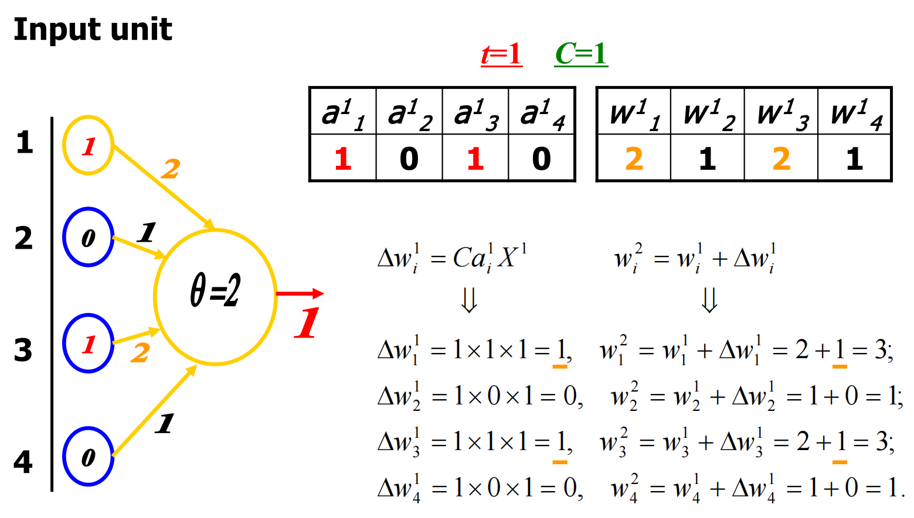

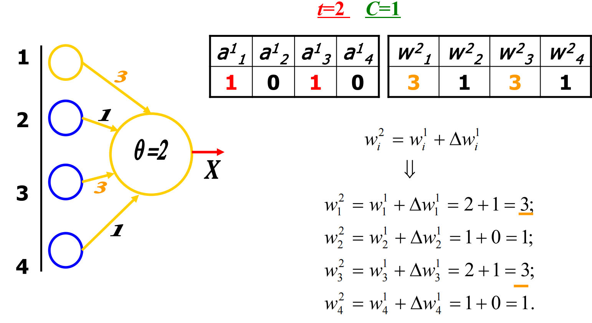

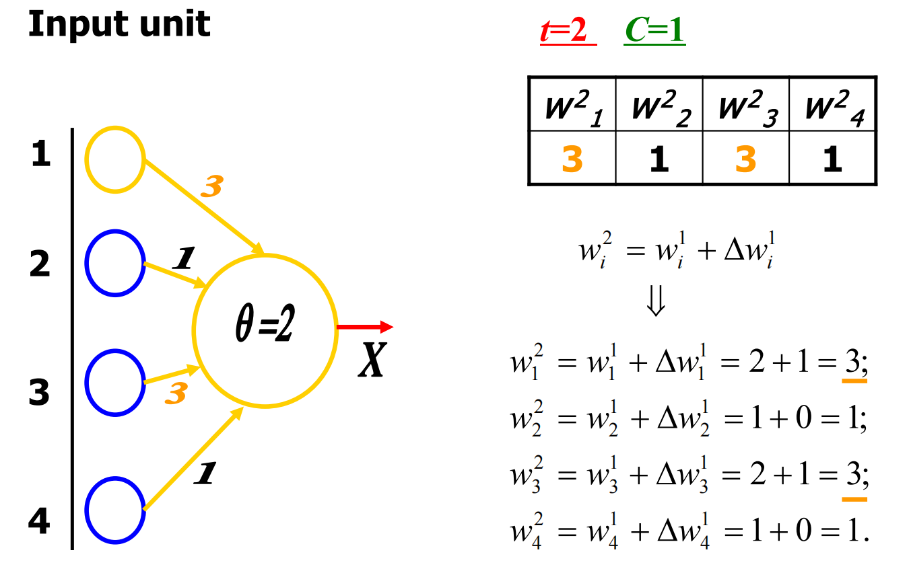

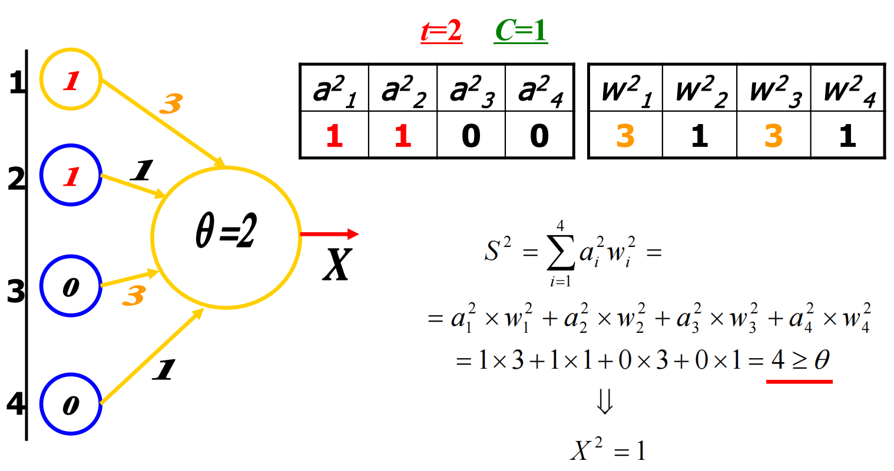

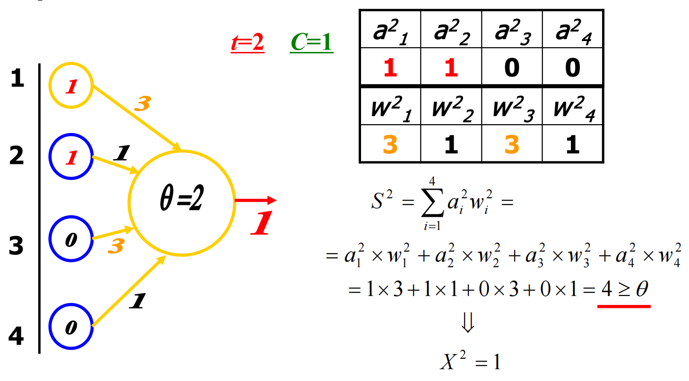

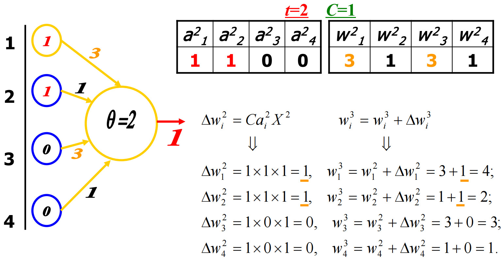

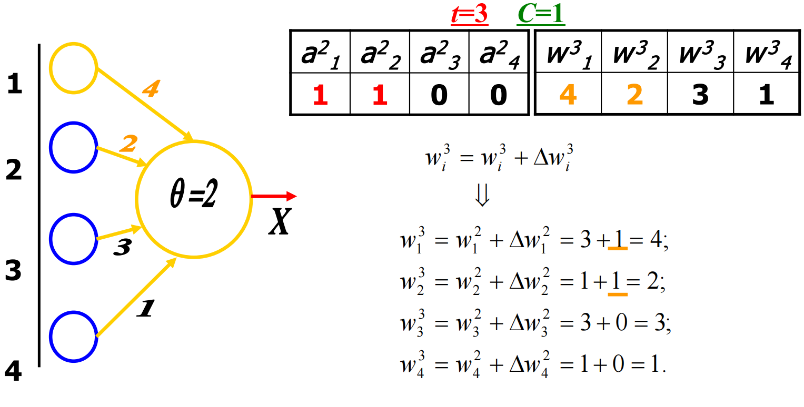

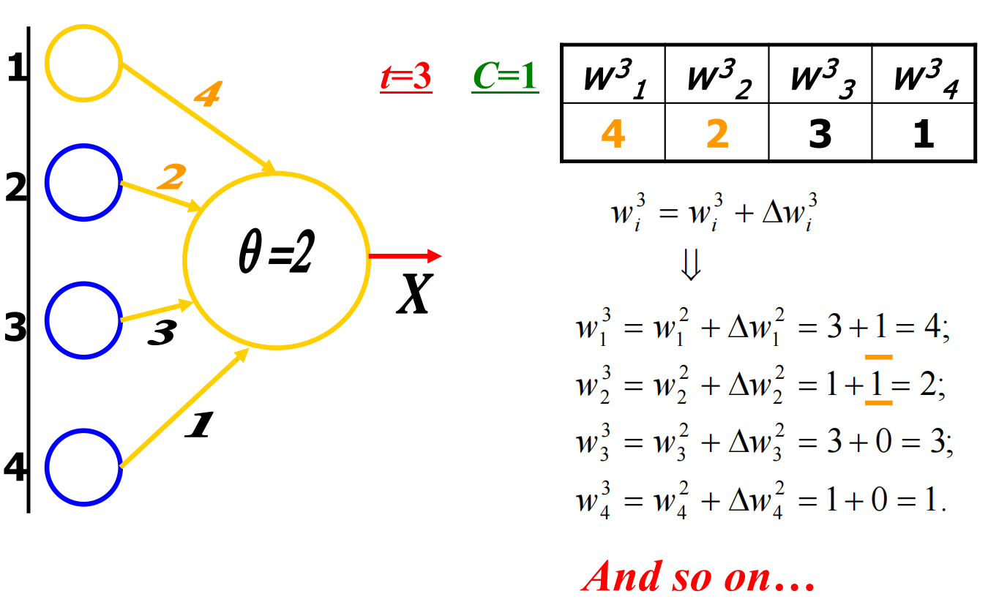

### ANN Learning 和 Hebb Rule 之间的关系

抽象说明：

**阶段一：信号处理与激活 (Performance Phase)**

**此阶段使用的公式：** $S^t = \sum^{n}_{i=1}w_ia^k_i$ 

- **做什么？** 这个公式描述的是 **突触后神经元 i 如何计算它接收到的总信号**。

**如何做？** 在 k 时刻，神经元 j 会“环顾”所有连接到它的突触前神经元 j。它接收来自每个神经元 i 的输入信号 $x_i^k$，并根据当前的连接强度 $w_{ij}^k$ 对这个信号进行加权。最后，它将所有这些“加权后”的信号全部加起来，得到一个内部总信号 $S_j^k$。

- **然后呢？** 得到 $S_{j}^{k}$ 之后，神经元 i 会用我们之前讨论的激活函数（例如阶跃函数）来处理这个总信号，从而决定自己是否要被激活，并产生最终的输出 $x_j^k$。
- **一句话总结：** 这个公式是关于神经元 **如何工作和输出** 的。

**阶段二：连接更新与学习 (Learning Phase)**

**此阶段使用的公式：** $w_{ij}^{k} + 1 = w_{ij}^{k} + C \cdot a_i^k \cdot x_j^k$ 

- **做什么？** 这个公式描述的是 **在阶段一的工作完成后，如何更新连接的权重**。
- **如何做？** 学习机制（赫布法则）现在开始起作用。它会回顾刚刚发生的事情：
  1. 它查看 **突触前神经元 i** 的信号 $a_i^k$ (因)。
  2. 它查看 **突触后神经元 j** 的最终输出 $x_j^k$ (果)。
  3. 如果两者同时被激活（"fire together"），公式计算出的调整量 Δw 就是正的，使得连接权重 $w_{ij}$ 在下一个时刻 k+1 变得更强。
- **一句话总结：** 这个公式是关于连接 **如何根据经验进行调整和学习** 的。

可以把一个突触后神经元想象成一个正在学习的学生，把突触前神经元想象成老师。

1. **阶段一 (信号处理 - 学生考试):**
   - 老师（突触前神经元 i）提出一个知识点（信号 $a_i^k$）。
   - 学生（突触后神经元 j）根据自己对这个知识点的掌握程度（权重 $w^k_{ij}$），来理解并处理这个知识点，最终给出一个答案（输出 $x^k_j$）。
   - 这个过程就是 $ S_j = \sum w_{ij}a_i $ 的体现。
2. **阶段二 (学习 - 考后复盘):**
   - 现在来复盘：老师提出的知识点 ($a_i^k$=1) 和学生给出的正确答案 ($x_j^k$=1) 同时出现了。
   - 大脑（赫布法则）认为：“这个知识点和正确答案之间的联系是有效的！”
   - 于是，大脑加强了学生对这个知识点的神经连接（权重 $w^k_{ij}$ 增加）。
   - 这个过程就是 $w_{ij}^{k+1} = w_{ij}^k + \Delta w$ 的体现。

## Recall: Machine learning and ANN 回忆：机器学习与人工神经网络

- Like human learning from past experiences.

  如同人类从过往经历中汲取经验。

- A computer does not have “experiences”.

  计算机不具备“经验”。

- **A computer system learns from data**, which represent some “past experiences” of an application domain.

  计算机系统通过学习数据来获取知识，这些数据代表了应用领域的某些“过往经验”。

- **Our focus**: learn **a target function** that can be used to predict the values of a discrete class attribute, e.g., **yes or no**, and **high or low**. 

  我们的核心任务：学习一个目标函数，该函数可用于预测离散类别属性的值，例如是与否、高或低。

- The task is commonly called: **supervised learning**

  该任务通常被称为：**监督学习**。

## The data and the goal 数据与目标

- **Data:** A set of data records (also called examples, instances or cases) described by

  **数据**： 一组由描述的数据记录（也称为样本、实例或个案）

  - *k* attributes: A1, A2, … Ak. 

    k个属性：A1、A2、…、Ak。

  - a class: Each example is labelled with a predefined class. 

    一个类别：每个样本都被标记有一个预定义的类别。

- **Goal:** To learn a classification model from the data that can be used to predict the classes of new (future, or test) cases/instances.

  **目标**： 从数据中学习一个分类模型，该模型可用于预测新（未来或测试）案例/实例的类别。

## Supervised vs. unsupervised Learning 监督学习与无监督学习

- **Supervised learning**: classification is seen as supervised learning from examples.

  监督学习：分类被视为基于示例的监督学习。

  - Supervision: The data (observations, measurements, etc.) are labeled with pre defined classes. It is like that a “teacher” gives the classes (supervision). 

    监督学习：数据（观测值、测量结果等）已通过预先定义的类别进行标注。这类似于一位“教师”提供分类指导（即监督过程）。

- Test data are classified into these classes too. 

  测试数据同样被划分至这些类别中。

- **Unsupervised learning** (e.g. clustering)

  无监督学习（例如：聚类）

  - Class labels of the data are unknown

    数据的类别标签未知

  - Given a set of data, the task is to establish the existence of classes or clusters in the data

    给定一组数据，任务是确定数据中类别或簇的存在性。

### Supervised learning process: two steps 监督学习过程：两个步骤

- **Learning (training)**: Learn a model using the **training data**

  学习（训练）：使用训练数据学习一个模型

- **Testing**: Test the model using **unseen** **test data** to assess the model accuracy

  测试：使用未见过的测试数据来检验模型，以评估模型的准确性。

 $Accuracy = \frac{\text{Number of correct classification}}{\text{Total number of test cases}}$

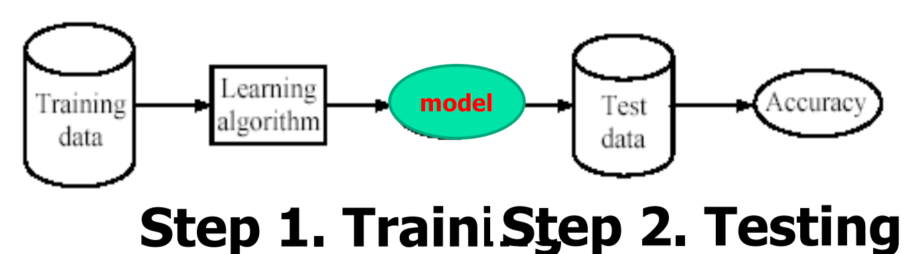

## What do we mean by learning? 学习的意义是什么

Given

- a data set *D*

  数据集 D

- a task *T*

  任务 T

- a performance measure *M* a computer system is said to **learn** from *D* to perform the task *T* if after learning the system’s performance on *T* improves as measured by *M*. 

  当计算机系统通过从数据集D中学习，在执行任务T时，其性能指标M得到提升，即可称该系统已从D中习得执行T的能力。

In other words, the learned model helps the system to perform *T* better as **compared to no learning**.

换言之，相较于无学习状态，经过学习的模型有助于系统更优地执行T任务。

## Fundamental assumption of learning 学习的基本假设

**Assumption:** The distribution of training examples is **identical** to the distribution of test examples (including future unseen examples)

**假设**： 训练样本的分布与测试样本（包括未来未见过的样本）的分布完全**相同**。

- In practice, this assumption is often violated to certain degree. 

  实际上，这一假设在某种程度上经常被违背。

- Strong violations will clearly result in poor classification accuracy. 

  严重违规将明显导致分类准确率下降。

- To achieve good accuracy on the test data, training examples must be sufficiently representative of the test data.

  为了在测试数据上获得良好的准确性，训练样本必须充分代表测试数据。

## Perceptron 感知机 （监督学习）

- Rosenblatt (1958) explicitly considered the problem of **pattern recognition**, where a “teacher” is essential.

  罗森布拉特（1958）明确探讨了模式识别问题，其中“教师”的存在至关重要。

- Perceptrons are neural networks that change with “experience” using **error-correcting rule**.

  感知器是一种通过**误差修正规则**随“经验”调整的神经网络。

- According to the rule, **weight of a response unit changes when it makes erroneous response to stimuli presented to the network**.

  根据规则，当响应单元对网络呈现的刺激做出错误响应时，其权重会发生变化。

与M-P神经元不同，它引入了第一个真正意义上的**学习算法**。它不再是一个静态的模型，而是一个能够从数据中**学习**并调整自身的模型。

### ANN for Pattern Recognition 用于模式识别的人工神经网络

- **Training data**: set of sample pairs (x, y).

  训练数据：一组样本对（x, y）的集合。

- Network (model, classifier) **adjusts its connection** **weights** **according to the errors** between target and network output

  网络（模型，分类器）根据目标值与网络输出之间的误差调整其连接权重。

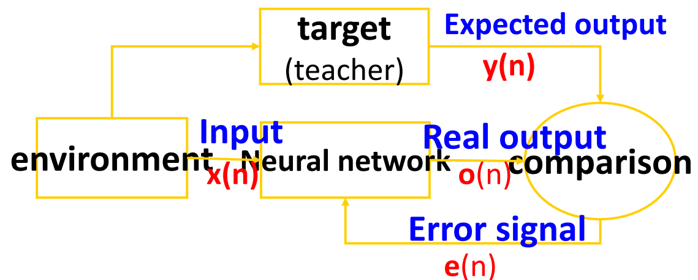

**Supervised learning** is mainly applied in **classification**

**监督学习主要应用于分类任务**。

- The simplest architecture of perceptron comprises two layers of idealised “neurons”, which we shall call *“units” of the network*.

  最简单的感知器架构包含两层理想化的“神经元”，我们将其称为网络的“单元”。

- There are

  - one layer of input units, and

    输入单元的一层，以及

  - one layer of output units.in the perceptron

    感知器中的一层输出单元。

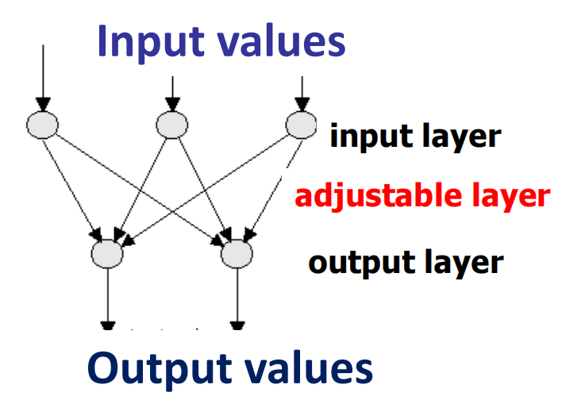

- The two layers are **fully interconnected**, *i.e.,* every input unit is connected to every output unit

  这两层是**全连接的**，即每个输入单元都与每个输出单元相连。

- Thus, **processing elements** of the perceptron are the **abstract neurons**

  因此，**感知器的处理单元**即**抽象神经元**。

- Each processing element has the same input comprising total input layer, but individual outputs with individual connections and therefore different weights of connections.

  每个处理单元具有相同的输入，包括完整输入层，但各自拥有独立的输出连接，因此连接的权重各不相同。

The total input to the output unit **j** is

输出单元 **j** 的总输入为

$S_j = \sum_{i=0}^{n}w_{ij}a_i$

- $a_i$: input value from the ith input unit

  $a_i$:  从第i个输入单元输入值。

- $w_(ij)$: the weight of connection btw i-th input and j

  $w_{ij}$：第i个输入与第j个输出之间的连接权重

- The sum is taken **over all n + 1** inputs units connected to the output unit **j**

  求和遍及所有连接到输出单元 j 的 n + 1 个输入单元。

- There is special **bias input** unit **number 0** in the input layer.

  输入层中存在值为0的特殊偏置输入单元。

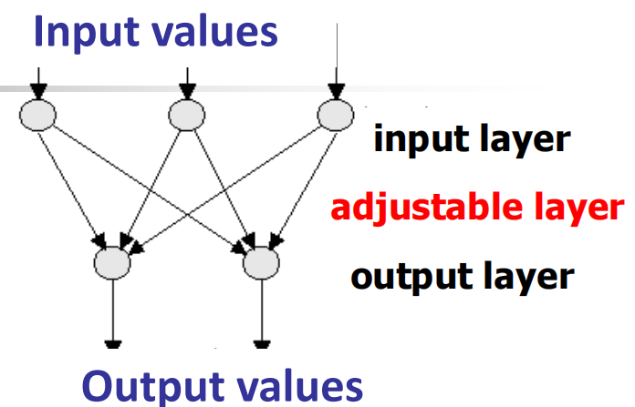

- There is a special **bias input** unit **number 0** in the input layer.

  在输入层中存在一个特殊的偏置输入单元，其编号为0。

- The bias unit always produces inputs of the fixed values of +1.

  偏置单元始终产生固定值+1的输入。

- The input of **bias unit** functions as a constant value in the sum.

  偏置单元的输入在求和过程中充当常数值。

- The **bias unit connection** to output unit **j** has a weight adjusted in the same way as all the other weights

  输出单元**j**的偏置单元连接权重调整方式与所有其他权重相同。

- The output value of the output unit **j** depends on whether the weighted sum is above or below the unit's threshold value.

  输出单元 **j** 的输出值取决于加权和是否高于或低于该单元的阈值。

- $X_j$ is defined by the unit's threshold activation function.

  $X_j$ 由该单元的阈值激活函数定义。

  - $$ X_j = f(S_j) = \begin{cases} 1, \, S_j \geq \theta_j \\ 0, \, S_j < \theta_j \end{cases} $$

**Definition:** 感知机定义

the ordered set of instant outputs of all units in the output layer $$ X = \{X_0, X_1, \ldots, X_n\} $$ constitutes an **output vector** of the network

输出层中所有单元的即时输出所构成的有序集合 $$ X = \{X0, X1, \ldots, X_n\} $$ 构成了网络的**输出向量**。

- The instant output of the j-th unit in the output layer constitutes the j-th component of the output vector.

  输出层中第 **j** 个单元的即时输出构成了输出向量的第 j 个分量。

- Weight $w_ji$ of connections between the two layers are changed according to **perceptron learning rule**, so the network is more likely to produce the desired output in response to certain inputs.

  两层之间连接的权重 $w_{ji}$ 按照感知器学习规则进行调整，从而使网络更有可能对特定输入产生期望的输出。

- The process of weights adjustment is called **perceptron learning** **(or training).**

  权重调整的过程被称为感知器学习（或训练）。

## Perceptron Training 感知器训练

Every processing element computes an output according its state and threshold:

每个处理单元根据其状态和阈值计算输出：

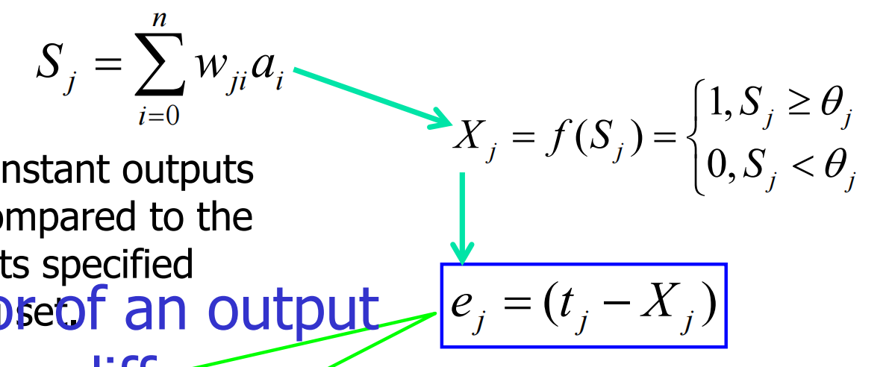

The network instant outputs Xj are then compared to the desired outputs specified in the training set

网络即时输出Xj随后与训练集中指定的期望输出进行比较。

The error of an output unit is the **difference** between the target output and the instant

输出单元的**误差**是目标输出与实际输出之间的差值。

**The error are computed and used to re-adjust the values of the weights of connections.**

计算误差并用于重新调整连接权重的值。

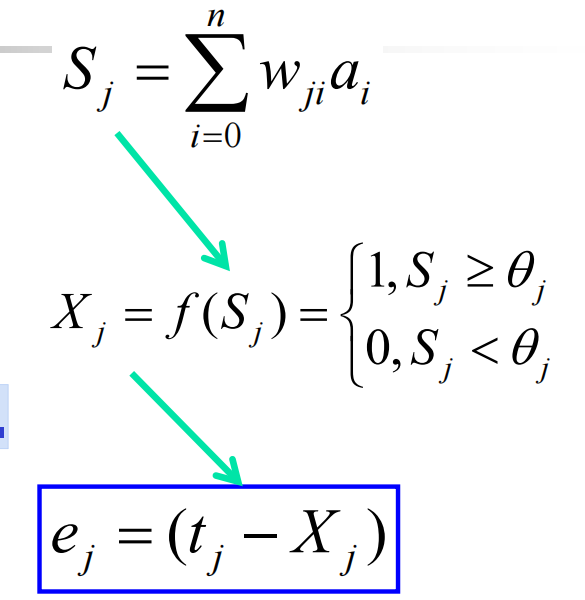

The weights re-adjustment is done in such a way that the network is – on the whole – more likely to give the desired response next time.

权重的重新调整以这样一种方式进行，即整体上网络更有可能在下一次给出期望的响应。

## Perceptron Updating of the Weights 权重更新：感知器算法

The goal of the training session is to arrive at a single set of weights that allow each of the mappings in the training set to be done successfully by the network.

本次训练的目标是获得一组唯一权重，使得网络能够成功完成训练集中的每一项映射任务。

1. **Compute error of every output unit** 计算每个输出单元的错误
   - $$ e_j = (t_j - X_j) $$
   
   - 这一步为计算误差，将感知机的预测 $X_j$ 与真实的正确标签 t 进行比较，也就是 $Error = t - X_j$
     - Example: t = 1, $X_j$ = 0 ⟹ Error = 1 - 0 = 1

- where

  - $t_j$ is the target value for output unit j

    $t_j$ 是输出单元 j 的目标值。

  - $X_j$ is the instant output produced by output unit j

    $X_j$ 是由输出单元 j 产生的即时输出

Having the errors computed

计算所得的误差

2. **Update the weights** 更新权重
   - 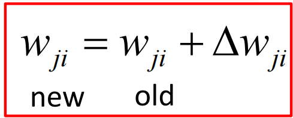
3. 下面的公式是学习的关键。只有在发生错误 **(Error ≠ 0) 时**，才需要更新权重。
   - $$ \Delta w_{ji} = C e_j a_i = C(t_j - X_j)a_i $$ **(Perceptron learning rule 感知器学习规则)**

## Perceptron training 感知器训练

- A sequential learning procedure for updating the weights.

  一种用于更新权重的序列学习程序。

- Perceptron training algorithm (delta rule)

  感知器训练算法（德尔塔规则）

**∆w = learning rate x (teacher - output) x input** (其中 (teacher - output) 属于 error)