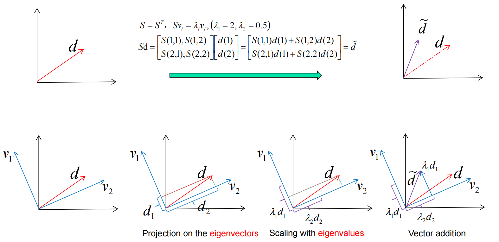
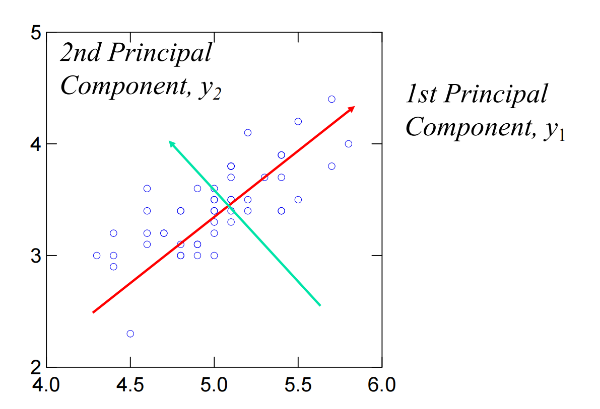
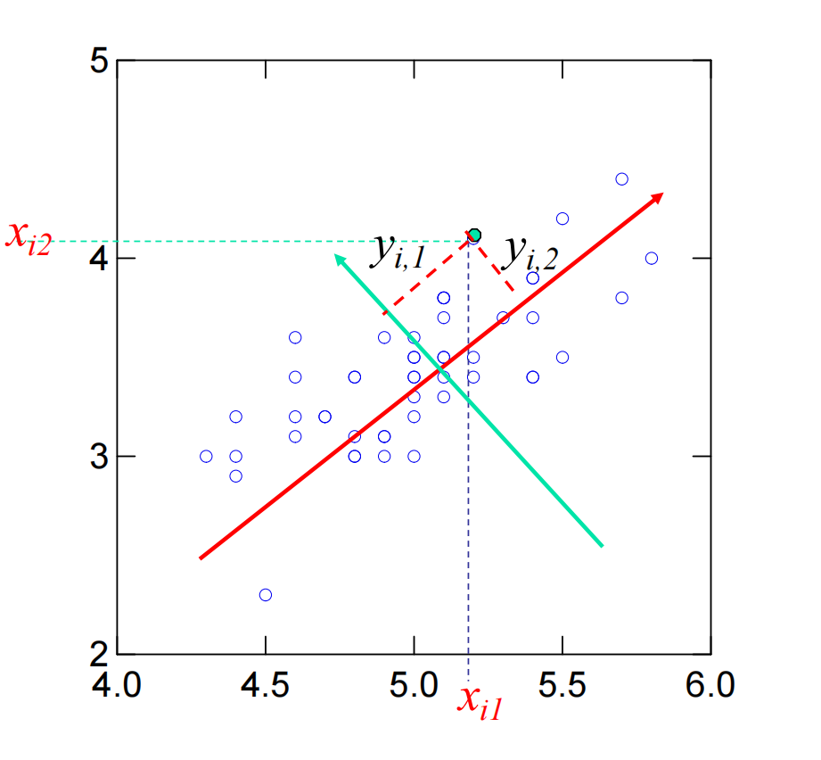

# 11 PCA

## PCA基本定义与概念

**特征值**和**特征向量**是线性代数中的核心概念，对于理解 PCA 至关重要。

- 定义（Definition）

  如果 $v$ 是一个非零向量，且 $\lambda$ 是一个数，它们满足以下关系式：

  $$Av=\lambda v$$

  那么，$v$ 就被称为矩阵 $A$ 的一个**特征向量 (eigenvector)**，而 $\lambda$ 则被称为对应的**特征值 (eigenvalue)**。

  - **直观理解：** 当矩阵 $A$ 乘以特征向量 $v$ 时，结果向量 $Av$ 只是 $v$ 的一个缩放（伸长或缩短），方向保持不变（除非 $\lambda \le 0$），缩放的因子就是特征值 $\lambda$。

- 特征值的数量

  对于一个 $m \times m$ 的方阵 $S$，特征值 $\lambda$ 的求解基于以下方程：

  $$Sv=\lambda v \iff (S-\lambda I)v=0$$

  要使这个方程有非零解 $v$，矩阵 $(S-\lambda I)$ 必须是奇异的，即它的行列式必须为零：

  $$|S-\lambda I|=0$$

  对于一个 $m \times m$ 矩阵，通过求解这个 $m$ 阶多项式，最多可以得到 $m$ 个不同的特征值。

#### 案例一

- **矩阵 $A$：** $A=[\begin{smallmatrix}2&1\\ 1&2\end{smallmatrix}]$
- **向量 $v$：** $v=\begin{smallmatrix}[1\\ 1]\end{smallmatrix}$
- **乘积 $Av$：** $[\begin{smallmatrix}2&1\\ 1&2\end{smallmatrix}]\times[\begin{smallmatrix}1\\ 1\end{smallmatrix}] = [\begin{smallmatrix}2\times 1+1\times 1\\ 1\times 1+2\times 1\end{smallmatrix}] = [\begin{smallmatrix}3\\ 3\end{smallmatrix}]$

我们发现结果 $\begin{smallmatrix}[3\\ 3]\end{smallmatrix}$ 可以写成原始向量 $\begin{smallmatrix}[1\\ 1]\end{smallmatrix}$ 的 3 倍：

$$\begin{pmatrix}3\\ 3\end{pmatrix} = 3 \times \begin{pmatrix}1\\ 1\end{pmatrix}$$

**结论：**

- **特征向量 $v$：** $\begin{smallmatrix}[1\\ 1]\end{smallmatrix}$
- **特征值 $\lambda$：** $3$

#### 求解特征值

**求解特征值 $\lambda$**

1. 计算特征方程 $|S-\lambda I|=0$。

   $$|S-\lambda I|=|\begin{matrix}2-\lambda&1\\ 1&2-\lambda\end{matrix}|=(2-\lambda)^{2}-1=0$$

2. 解方程得到两个特征值：

   - $\lambda_1 = 1$
   - $\lambda_2 = 3$

#### 求解特征向量

将每个特征值代回 $(S-\lambda I)v=0$ 中，求解对应的特征向量：

1. 对于 $\lambda_1 = 1$：

   $$(S-1I)v_1 = [\begin{matrix}2-1&1\\ 1&2-1\end{matrix}]v_1 = [\begin{matrix}1&1\\ 1&1\end{matrix}]\begin{pmatrix}x\\ y\end{pmatrix} = \begin{pmatrix}0\\ 0\end{pmatrix}$$

   解得 $x+y=0$，即 $y=-x$。选择一个简单的非零解 $x=1, y=-1$。

   - **特征向量 $v_1$：** $\begin{smallmatrix}[1\\ -1]\end{smallmatrix}$

2. 对于 $\lambda_2 = 3$：

   $$(S-3I)v_2 = [\begin{matrix}2-3&1\\ 1&2-3\end{matrix}]v_2 = [\begin{matrix}-1&1\\ 1&-1\end{matrix}]\begin{pmatrix}x\\ y\end{pmatrix} = \begin{pmatrix}0\\ 0\end{pmatrix}$$

   解得 $-x+y=0$，即 $y=x$。选择一个简单的非零解 $x=1, y=1$。

   - **特征向量 $v_2$：** $\begin{smallmatrix}[1\\ 1]\end{smallmatrix}$ 

### 对称矩阵的特性

在 PCA 中，我们通常处理**协方差矩阵**，它是一个对称矩阵，因此其特征值和特征向量具有一些特殊且重要的性质。

- **正交性 (Orthogonality)**：对于对称矩阵 $S$ 8，对应于不同特征值 ($\lambda_1 \ne \lambda_2$) 的特征向量是正交的。
  - 数学表达：若 $Sv_{1}=\lambda_{1}v_{1}$ 和 $Sv_{2}=\lambda_{2}v_{2}$ 且 $\lambda_{1}\ne\lambda_{2}$，则 $v_{1}\bullet v_{2}=0$。
- **实数特征值 (Real Eigenvalues)**：一个实数对称矩阵的所有特征值都是实数。
- **非负特征值 (Non-negative Eigenvalues)**：一个半正定矩阵 (positive semidefinite matrix) 的所有特征值都是非负的。
  - 半正定矩阵的定义是：对于任何向量 $w \in \mathbb{R}^n$，都有 $w^T S w \ge 0$。若 $S$ 是半正定的，则其特征值 $\lambda \ge 0$。

### 特征分解的几何意义

这两页通过图示展示了矩阵 $S$ 乘以向量 $d$ 的几何过程，特别是当 $S$ 是对称矩阵时 ($S=S^T$)。

1. **投影 (Projection)**：向量 $d$ 可以分解为沿着特征向量 $v_1$ 和 $v_2$ 方向的分量 $d_1$ 和 $d_2$。
2. **缩放 (Scaling)**：当 $S$ 作用于 $d$ 时，其效果相当于将 $d$ 投影到每个特征向量上，然后用对应的特征值 $\lambda_i$ 来缩放这些分量。
   - 在图中，分量 $d_1$ 被 $\lambda_1$ 缩放成 $\lambda_1 d_1$，分量 $d_2$ 被 $\lambda_2$ 缩放成 $\lambda_2 d_2$。
3. **向量加法 (Vector Addition)**：缩放后的分量相加（向量加法）就得到了变换后的向量 $\tilde{d}$。
   - $Sd = \tilde{d}$
   - 如果 $v_1, v_2$ 是标准化的特征向量，那么 $d = d_1 v_1 + d_2 v_2$，且 $\tilde{d} = Sd = S(d_1 v_1 + d_2 v_2) = d_1 (S v_1) + d_2 (S v_2) = d_1 (\lambda_1 v_1) + d_2 (\lambda_2 v_2)$。

#### 求解特征值与特征向量的示例

这一页通过一个具体的 $2 \times 2$ 对称矩阵的例子，展示了求解特征值和特征向量的过程。

- 矩阵 $S$：

  $$S=[\begin{matrix}2&1\\ 1&2\end{matrix}]$$

  这是一个实数对称矩阵。

- 求解特征值 $\lambda$：

  计算 $|S-\lambda I|=0$：

  $$S-\lambda I=[\begin{matrix}2-\lambda&1\\ 1&2-\lambda\end{matrix}]$$

  $$(2-\lambda)^{2}-1=0$$

  解得特征值 $\lambda$ 为 **1** 和 **3**。

- 求解特征向量 $v$：

  将特征值 $\lambda = 1$ 和 $\lambda = 3$ 分别代入 $(S-\lambda I)v=0$ 中求解对应的特征向量。

  - 最终得到的特征向量是：$\begin{pmatrix}1\\ -1\end{pmatrix}$ 和 $\begin{pmatrix}1\\ 1\end{pmatrix}$。
  - 这两个特征向量是正交的，符合对称矩阵的性质。

## 对角分解 Diagonal Decomposition

对角分解，也称为**特征分解（Eigen-decomposition）或矩阵对角化定理（Matrix Diagonalization Theorem）**，是一种将方阵分解为特征向量矩阵、特征值对角矩阵和特征向量矩阵的逆矩阵相乘形式的方法。

### 对角分解定理 

- 定理内容

  如果一个 $m \times m$ 的方阵 $S$ 拥有 $m$ 个线性无关的特征向量，那么它存在一个特征分解，形式如下：

  $$S = U \Lambda U^{-1}$$

  其中：

  - **$U$：** 是由矩阵 $S$ 的所有特征向量作为列向量组成的矩阵。
  - **$\Lambda$（Lambda）：** 是一个**对角矩阵**。其对角线上的元素是矩阵 $S$ 对应的特征值 $\lambda_1, \lambda_2, ..., \lambda_m$。通常按降序排列，即 $\lambda_i \ge \lambda_{i+1}$
  - **$U^{-1}$：** 是矩阵 $U$ 的逆矩阵。

- 唯一性

  如果 $S$ 的所有特征值都是不同的，那么这个特征分解是唯一的。

### 定理推导

推导过程证明了 $S = U \Lambda U^{-1}$ 这一分解形式是正确的：

1. 将 $U$ 写成特征向量的组合：

   $$U = [v_1, v_2, ..., v_m]$$

2. 计算 $S$ 乘以 $U$：

   $$SU = S[v_1, v_2, ..., v_m] = [S v_1, S v_2, ..., S v_m]$$

3. 利用特征向量的定义 $S v_i = \lambda_i v_i$ 进行替换：

   $$SU = [\lambda_1 v_1, \lambda_2 v_2, ..., \lambda_m v_m]$$

4. 将右侧的矩阵用 $U$ 和对角矩阵 $\Lambda$ 相乘表示：

   $$[\lambda_1 v_1, \lambda_2 v_2, ..., \lambda_m v_m] = U \Lambda$$

   因此，我们得到 $SU = U \Lambda$。

5. 在等式 $SU = U \Lambda$ 的左侧乘以 $U^{-1}$，即可得到最终的分解形式：

   $$U^{-1} (SU) = U^{-1} (U \Lambda) \implies S = U \Lambda U^{-1}$$

### 实例演算与对称分解

第 10 页使用了矩阵 $S=[\begin{smallmatrix}2&1\\ 1&2\end{smallmatrix}]$ 进行实际计算：

- **特征值：** $\lambda_1 = 1$, $\lambda_2 = 3$。

- **特征向量：** $v_1=\begin{pmatrix}1\\ -1\end{pmatrix}$, $v_2=\begin{pmatrix}1\\ 1\end{pmatrix}$。

- 构成 $U$ 和 $U^{-1}$：

  $$U=[\begin{matrix}1&1\\ -1&1\end{matrix}]$$

  $$U^{-1}=[\begin{matrix}1/2&-1/2\\ 1/2&1/2\end{matrix}]$$

- 分解结果：

  $$S=U\Lambda U^{-1}=[\begin{matrix}1&1\\ -1&1\end{matrix}][\begin{matrix}1&0\\ 0&3\end{matrix}][\begin{matrix}1/2&-1/2\\ 1/2&1/2\end{matrix}]$$

### 对称对角分解 

由于原始矩阵 $S$ 是对称矩阵，其特征向量是相互正交的。通过对特征向量进行归一化（将 $U$ 中的每个向量除以其长度 $\sqrt{2}$），我们得到了一个特殊的特征向量矩阵 $Q$。

- $Q$ 矩阵：

  $$Q=[\begin{matrix}1/\sqrt{2}&1/\sqrt{2}\\ -1/\sqrt{2}&1/\sqrt{2}\end{matrix}]$$

- $Q$ 的性质： $Q$ 是一个正交矩阵。正交矩阵有一个非常重要的特性：它的逆矩阵等于它的转置矩阵。

  $$Q^{-1} = Q^T$$

- 最终分解形式：对于对称矩阵 $S$，分解可以简化为：

  $$S=Q\Lambda Q^{T}$$

  这种形式被称为对称对角分解（或正交对角化），是 PCA 中分解协方差矩阵的基础。

这个过程说明，**特征分解的本质就是将矩阵 $S$ 映射到一个由其特征向量构成的坐标系中，在这个新坐标系下，$S$ 的作用仅相当于一个对角矩阵 $\Lambda$ 的缩放作用。**

### 对称对角分解 Symmetric Diagonal Decomposition

专门针对**对称矩阵**的特征分解，这是 PCA 应用中的核心数学工具。定理内容：

- **前提条件：** 矩阵 $S$ 是一个 $m \times m$ 的**对称矩阵**（$S \in \mathbb{R}^{m \times m}$）。

- **结论：** 存在一个特征分解，其中特征向量矩阵 $Q$ 是**正交矩阵**。

- 分解公式：

  $$S = Q \Lambda Q^{T}$$

关键组成部分及特性：

1. **$Q$ 矩阵（特征向量矩阵）**

   - $Q$ 的列是矩阵 $S$ 的**归一化特征向量**（Normalized Eigenvectors）。这意味着每个特征向量的长度都为 1。

   - $Q$ 的列向量是**相互正交**的（Orthogonal）。这得益于对称矩阵的特性，即对应于不同特征值的特征向量相互正交。

   - **正交矩阵的特性：** 由于 $Q$ 是一个正交矩阵，它的逆矩阵等于它的转置矩阵。

     $$Q^{-1} = Q^{T}$$

     正是这一特性，使得对称矩阵的分解公式从 $S = U \Lambda U^{-1}$ 简化为 $S = Q \Lambda Q^{T}$。

2. **$\Lambda$ 矩阵（特征值矩阵）**

   - $\Lambda$ 仍然是对角矩阵，对角线元素是特征值 $\lambda_i$。
   - 由于 $S$ 是一个**实数对称矩阵**，所有的特征值和特征向量都是**实数**。

对称对角分解的重要性在于：

- **简化计算：** $Q^{-1} = Q^T$ 极大地简化了矩阵求逆的计算，这在处理大规模数据时非常重要。
- **PCA 基础：** 在 PCA 中，我们通常对数据的**协方差矩阵**（Covariance Matrix）进行操作，而协方差矩阵是一个标准的实数对称矩阵。因此，可以使用 $S = Q \Lambda Q^{T}$ 对其进行分解。这个分解的结果 $Q$（主成分方向）和 $\Lambda$（方差大小）正是 PCA 所需的。

#### 对称对角分解案例讲解

将以一个 $2 \times 2$ 的实数对称矩阵 $S$ 为例，进行分解。

##### 原始对称矩阵 $S$

我们使用演示文稿中提供的对称矩阵 1：

$$S=[\begin{matrix}2&1\\ 1&2\end{matrix}]$$

##### 求解特征值 $\Lambda$ (Eigenvalues)

我们首先求解矩阵 $S$ 的特征值 $\lambda$，通过计算特征方程 $|S-\lambda I|=0$：

$$(2-\lambda)^{2}-1=0$$

解得两个特征值：

$$\lambda_1 = 1$$

$$\lambda_2 = 3$$

构造特征值对角矩阵 $\Lambda$（通常按降序排列，但在这里我们使用文档中的顺序 $\lambda_1=1, \lambda_2=3$）：

$$\Lambda=[\begin{matrix}1&0\\ 0&3\end{matrix}]$$

##### 求解特征向量 $v$ 并归一化 $Q$ (Normalized Eigenvectors)

接下来，我们为每个特征值求解对应的特征向量 $v$，并对其进行归一化，以得到正交矩阵 $Q$ 的列向量。

- 对于 $\lambda_1 = 1$：

  求解 $(S - 1I)v_1 = 0$，得到的特征向量是 $\begin{pmatrix}1\\ -1\end{pmatrix}$。

  其长度为 $\sqrt{1^2 + (-1)^2} = \sqrt{2}$。

  归一化后的特征向量 $q_1 = \frac{1}{\sqrt{2}}\begin{pmatrix}1\\ -1\end{pmatrix} = \begin{pmatrix}1/\sqrt{2}\\ -1/\sqrt{2}\end{pmatrix}$。

- 对于 $\lambda_2 = 3$：

  求解 $(S - 3I)v_2 = 0$，得到的特征向量是 $\begin{pmatrix}1\\ 1\end{pmatrix}$。

  其长度为 $\sqrt{1^2 + 1^2} = \sqrt{2}$。

  归一化后的特征向量 $q_2 = \frac{1}{\sqrt{2}}\begin{pmatrix}1\\ 1\end{pmatrix} = \begin{pmatrix}1/\sqrt{2}\\ 1/\sqrt{2}\end{pmatrix}$。

- 构造正交矩阵 $Q$：

  将归一化后的特征向量作为列向量构成 $Q$ 矩阵：

  $$Q=[\begin{matrix}q_1&q_2\end{matrix}]=[\begin{matrix}1/\sqrt{2}&1/\sqrt{2}\\ -1/\sqrt{2}&1/\sqrt{2}\end{matrix}]$$

#### 对称分解结果

矩阵 $Q$ 是一个正交矩阵，因此它的逆矩阵 $Q^{-1}$ 等于它的转置 $Q^T$。

$$Q^{T}=[\begin{matrix}1/\sqrt{2}&-1/\sqrt{2}\\ 1/\sqrt{2}&1/\sqrt{2}\end{matrix}]$$

最终，对称对角分解的结果为 $S = Q \Lambda Q^{T}$：

$$S=Q\Lambda Q^{T}=[\begin{matrix}1/\sqrt{2}&1/\sqrt{2}\\ -1/\sqrt{2}&1/\sqrt{2}\end{matrix}][\begin{matrix}1&0\\ 0&3\end{matrix}][\begin{matrix}1/\sqrt{2}&-1/\sqrt{2}\\ 1/\sqrt{2}&1/\sqrt{2}\end{matrix}]$$

意义：

这个分解告诉我们，矩阵 $S$ 的作用（拉伸、旋转等线性变换）可以用三个连续的变换来表示：

1. **$Q^T$：** 将原始向量投影到由特征向量 $q_1, q_2$ 定义的新坐标系上（旋转）。
2. **$\Lambda$：** 在新坐标系下，沿着每个特征向量方向进行缩放（缩放因子为特征值 1 和 3）。
3. **$Q$：** 将缩放后的向量从新坐标系旋转回原始坐标系。

这个过程，特别是对协方差矩阵的分解，是 **PCA** 的核心。

## 奇异值分解Singular Value Decomposition, SVD

奇异值分解是一种强大的矩阵分解技术，它不像特征分解那样仅限于方阵，而是可以应用于任何 $m \times n$ 的矩阵 $A$。

### SVD 的分解形式

对于一个 $m \times n$ 的矩阵 $A$（秩为 $r$），SVD 的分解形式如下：

$$A = U \Sigma V^{T}$$

其中：

- **$U$ 矩阵：** 是一个 $m \times m$ 的正交矩阵。它的列（称为左奇异向量）是 $AA^T$ 的正交特征向量。
- **$\Sigma$ (Sigma) 矩阵：** 是一个 $m \times n$ 的矩阵。它是一个**对角矩阵**，对角线元素是**奇异值**（Singular values） $\sigma_i$。
  - $\Sigma = \text{diag}(\sigma_1, \sigma_2, ..., \sigma_r)$。
  - 奇异值 $\sigma_i$ 是非负实数。
- **$V^{T}$ 矩阵：** 是一个 $n \times n$ 的矩阵。$V$ 的列（称为右奇异向量）是 $A^T A$ 的正交特征向量。

### 奇异值与特征值的关系=

奇异值 $\sigma_i$ 与 $AA^T$ 和 $A^T A$ 的特征值 $\lambda_i$ 之间存在直接关系：

- 矩阵 $AA^T$ 的特征值与 $A^T A$ 的特征值是相同的。

- 奇异值 $\sigma_i$ 是这些特征值 $\lambda_i$ 的平方根：

  $$\sigma_{i}=\sqrt{\lambda_{i}}$$

#### SVD 维度图示

通过图示展示了 SVD 中三个矩阵的维度关系：

| **矩阵**     | **维度**     | **描述**             |
| ------------ | ------------ | -------------------- |
| **$A$**      | $m \times n$ | 原始矩阵             |
| **$U$**      | $m \times m$ | 左奇异向量矩阵       |
| **$\Sigma$** | $m \times n$ | 奇异值矩阵           |
| **$V^T$**    | $n \times n$ | 右奇异向量矩阵的转置 |

$A$ 的分解是：$A = U \Sigma V^T$。

### SVD 案例

第一个具体的 $3 \times 2$ 矩阵 $A$ 的 SVD 示例：

- 原始矩阵 $A$：

  $$A=[\begin{matrix}1&-1\\ 0&1\\ 1&0\end{matrix}]$$

  这里 $m=3$, $n=2$ 。

- SVD 结果：

  $$A = U \Sigma V^{T}$$

  $$[\begin{matrix}0&2/\sqrt{6}&1/\sqrt{3}\\ 1/\sqrt{2}&-1/\sqrt{6}&1/\sqrt{3}\\ 1/\sqrt{2}&1/\sqrt{6}&-1/\sqrt{3}\end{matrix}][\begin{matrix}1&0\\ 0&\sqrt{3}\\ 0&0\end{matrix}][\begin{matrix}1/\sqrt{2}&1/\sqrt{2}\\ 1/\sqrt{2}&-1/\sqrt{2}\end{matrix}]$$

  注意： 这里的 $\Sigma$ 矩阵是 $3 \times 2$ 的，其对角线上的奇异值是 $1$ 和 $\sqrt{3}$。

#### 具体过程

给定矩阵 $A=[\begin{smallmatrix}1&-1\\ 0&1\\ 1&0\end{smallmatrix}]$。

**步骤 1: 计算 $A^T A$ 并求其特征分解 (得到 $V$ 和 $\Sigma$)**

$V$ 矩阵（右奇异向量）是由 $A^T A$ 的特征向量构成的。

1. 计算 $A^T A$：

   $$A^T A = \begin{pmatrix} 1 & 0 & 1 \\ -1 & 1 & 0 \end{pmatrix} \begin{pmatrix} 1 & -1 \\ 0 & 1 \\ 1 & 0 \end{pmatrix} = \begin{pmatrix} 2 & -1 \\ -1 & 2 \end{pmatrix}$$

2. 求 $A^T A$ 的特征值 $\lambda$：计算 $|A^T A - \lambda I| = 0$。

   $$(2-\lambda)^2 - (-1)^2 = 0 \implies (2-\lambda)^2 = 1$$

   $$\lambda_1 = 3, \quad \lambda_2 = 1$$

3. 计算奇异值 $\sigma$ (得到 $\Sigma$)：奇异值是特征值的平方根。

   $$\sigma_1 = \sqrt{\lambda_1} = \sqrt{3}$$

   $$\sigma_2 = \sqrt{\lambda_2} = \sqrt{1} = 1$$

   由于 $A$ 是 $3 \times 2$ 矩阵，$\Sigma$ 是 $3 \times 2$ 矩阵，其奇异值位于对角线上：

   $$\Sigma = \begin{pmatrix} \sigma_1 & 0 \\ 0 & \sigma_2 \\ 0 & 0 \end{pmatrix} = \begin{pmatrix} \sqrt{3} & 0 \\ 0 & 1 \\ 0 & 0 \end{pmatrix}$$

   这与案例结果中的 $\Sigma$ 矩阵相符 2（注意：案例中 $\sqrt{3}$ 和 $1$ 的位置可能交换，取决于特征值排序，但结构相同）。

4. **求 $A^T A$ 的特征向量 (得到 $V$)：**

   - 对于 $\lambda_1 = 3$： 求 $(A^T A - 3I)v_1 = 0$。

     $$ \begin{pmatrix} -1 & -1 \ -1 & -1 \end{pmatrix} v_1 = 0 \implies v_1 = \begin{pmatrix} 1/\sqrt{2} \ -1/\sqrt{2} \end{pmatrix} \text{ (归一化后)}$$

   - 对于 $\lambda_2 = 1$： 求 $(A^T A - 1I)v_2 = 0$。

     $$ \begin{pmatrix} 1 & -1 \ -1 & 1 \end{pmatrix} v_2 = 0 \implies v_2 = \begin{pmatrix} 1/\sqrt{2} \ 1/\sqrt{2} \end{pmatrix} \text{ (归一化后)}$$

     $V$ 矩阵由 $v_1$ 和 $v_2$ 组成，因此：

     $$V = \begin{pmatrix} 1/\sqrt{2} & 1/\sqrt{2} \\ -1/\sqrt{2} & 1/\sqrt{2} \end{pmatrix}$$

     转置后得到 $V^T$：

     $$V^T = \begin{pmatrix} 1/\sqrt{2} & -1/\sqrt{2} \\ 1/\sqrt{2} & 1/\sqrt{2} \end{pmatrix}$$

     这与案例结果中的 $V^T$ 矩阵相符。

**步骤 2: 计算 $AA^T$ 并求其特征分解 (得到 $U$)**

$U$ 矩阵（左奇异向量）是由 $AA^T$ 的特征向量构成的。

1. 计算 $AA^T$：

   $$A A^T = \begin{pmatrix} 1 & -1 \\ 0 & 1 \\ 1 & 0 \end{pmatrix} \begin{pmatrix} 1 & 0 & 1 \\ -1 & 1 & 0 \end{pmatrix} = \begin{pmatrix} 2 & -1 & 1 \\ -1 & 1 & 0 \\ 1 & 0 & 1 \end{pmatrix}$$

2. 求 $AA^T$ 的特征值 $\lambda$：由于 $AA^T$ 和 $A^T A$ 具有相同的非零特征值 5，所以特征值是 $3$, $1$，以及额外的零特征值（因为 $3 \times 3$ 矩阵的秩为 2）。

   $$\lambda_1 = 3, \quad \lambda_2 = 1, \quad \lambda_3 = 0$$

3. 求 $AA^T$ 的特征向量 (得到 $U$)：求解 $(AA^T - \lambda I)u_i = 0$ 并归一化，将得到 $u_1, u_2, u_3$。

   - $u_1$ 对应 $\lambda_1 = 3$。
   - $u_2$ 对应 $\lambda_2 = 1$。
   - $u_3$ 对应 $\lambda_3 = 0$。

   将 $u_1, u_2, u_3$ 作为列向量组合起来，即可得到 $U$ 矩阵，即案例结果中 $3 \times 3$ 的 $U$ 矩阵

SVD 在降维（尤其在 PCA 中，如果数据没有中心化或协方差矩阵太大）和数据压缩等领域有广泛应用。

## 降维 (Dimensionality Reduction)

这一部分内容介绍了降维的目的、方法以及它与基（Basis）变换之间的关系。

### 降维的目的和方法

- **问题：** 处理高维数据时，可能面临计算复杂、存储需求高以及数据稀疏等问题。

- **目的：** 通过降低数据的维度来解决这些问题。

- **方法：** 将高维数据投影到一个较低维度的子空间上 1。这可以使用**线性**或**非线性变换**来实现。

  - **线性变换**（如 PCA）计算简单。

  - 表示形式： 原始高维向量 $x$ (维度为 $N$) 被转换成较低维度的向量 $y$ (维度为 $K$，且 $K \ll N$)。

    $$x=[\begin{matrix}x_{1}\\ x_{2}\\ ...\\ x_{N}\end{matrix}] \quad \longrightarrow \quad y=[\begin{matrix}y_{1}\\ y_{2}\\ ...\\ y_{K}\end{matrix}] \quad (K \ll N)$$

  - **线性变换公式：** $Y = U X$。其中 $X$ 是原始数据向量（$d \times 1$），$U$ 是一个投影矩阵（$k \times d$），$Y$ 是降维后的向量（$k \times 1$）。（k << d）

### 降维与基变换

降维本质是**找到一个低维子空间中的基**，并将原始向量近似地表示在这个新基上。

- 原始空间表示 (Original space representation)：

  原始向量 $\underline{x}$ 可以通过一组 $N$ 维基向量 $v_1, v_2, ..., v_N$ 的线性组合来表示。

  $$\underline{x}=a_{1}v_{1}+a_{2}v_{2}+...+a_{N}v_{N}$$

  其系数表示为：$[\begin{smallmatrix}a_{1}\\ a_{2}\\ \vdots\\ a_{N}\end{smallmatrix}]$。

- 低维子空间表示 (Lower-dimensional sub-space representation)：

  降维后的近似向量 $\hat{x}$ 只使用一组 $K$ 维基向量 $u_1, u_2, ..., u_K$（其中 $K < N$）的线性组合来表示。

  $$\hat{x}=b_{1}u_{1}+b_{2}u_{2}+...+b_{K}u_{K}$$

  其系数表示为：$[\begin{smallmatrix}b_{1}\\ b_{2}\\ \vdots\\ b_{K}\end{smallmatrix}]$。

  **目标：** 在降维中，我们的目标是找到一组最佳的 $K$ 维基 $u_i$，使得 $\hat{x}$ 尽可能地接近原始向量 $\underline{x}$。

### 示例：基变换

这一页通过一个 $K=N$（即没有降维）的例子来展示**基变换**的概念，强调向量表示是相对基而言的。

- **情况 $K=N$：** 如果降维后的维度 $K$ 等于原始维度 $N$，那么近似向量 $\hat{x}$ 就等于原始向量 $x$ ($\hat{x}=x$)。

- **示例：** 向量 $x$ 在两个不同的 $3$ 维基下的表示是不同的，但它们代表同一个向量。

  - 标准基 $v$： $v_{1}=[\begin{smallmatrix}1\\ 0\\ 0\end{smallmatrix}], v_{2}=[\begin{smallmatrix}0\\ 1\\ 0\end{smallmatrix}], v_{3}=[\begin{smallmatrix}0\\ 0\\ 1\end{smallmatrix}]$ 12。

    $$x_{v}=[\begin{matrix}3\\ 3\\ 3\end{matrix}] = 3v_{1}+3v_{2}+3v_{3} \text{ [cite: 193]}$$

  - 另一组基 $u$： $u_{1}=[\begin{smallmatrix}1\\ 0\\ 0\end{smallmatrix}], u_{2}=[\begin{smallmatrix}1\\ 1\\ 0\end{smallmatrix}], u_{3}=[\begin{smallmatrix}1\\ 1\\ 1\end{smallmatrix}]$。

    $$x_{u}=[\begin{matrix}3\\ 3\\ 3\end{matrix}] = 0u_{1}+0u_{2}+3u_{3}$$

  - 虽然表示系数（$3, 3, 3$ 和 $0, 0, 3$）不同，但向量本身是相同的（$x_{v}=x_{u}$）。

这个例子为下一部分要讲解的 PCA 奠定了基础，即 PCA 的目标就是找到一个最“高效”的基（主成分），使得在低维空间中保留最多的信息。

## PCA

### 主成分分析的目标与动机 

#### 目标

- 每个降维技术都会根据特定标准（例如信息损失、数据区分度等）来找到一个合适的变换。

- **PCA 的目标**是减少数据的维度，同时尽可能多地保留数据集中存在的**变异（Variation）**，即方差。

#### 动机和几何解释

PCA 的核心思想是找到一个能最大限度描述数据分散程度（方差）的方向。

- **高方差原则：** 找到数据中具有**高方差**的基（方向）。

- **第一个主成分 (First PC)：** 是数据中**最大方差的方向**。

- **后续主成分 (Subsequent PCs)：** 与第一个主成分**正交**，并描述**最大残余方差**的方向。

- **编码：** 使用少量基向量（主成分）来编码数据，以达到**低均方误差（low MSE）**的效果。

在第 20 页的图示中：

- $x_1$ 和 $x_2$ 是原始坐标轴。
- $z_1$ 是第一个主成分方向（方差最大）。
- $z_2$ 是第二个主成分方向，它与 $z_1$ 正交（方差次大）。

### PCA 的数学原理

PCA 的数学目标是找到一个方向向量 $q$，使得数据投影到该方向上的方差最大化。

#### 方差最大化

假设数据的均值 $E[x] = 0$。将数据向量 $x$ 投影到单位向量 $q$ 上的值记为 $a$：

$$a = x^T q = q^T x$$

投影值 $a$ 的方差 $(\sigma)^2$ 为：

$$(\sigma)^{2}=E[a^{2}]-E[a]^{2} \text{}$$

由于 $E[a] = E[q^T x] = q^T E[x] = 0$，方差简化为：

$$(\sigma)^{2}=E[a^{2}]$$

将其展开，并利用协方差矩阵 $R = E[xx^T]$：

$$(\sigma)^{2}=E[(q^{T}x)(x^{T}q)]=q^{T}E[xx^{T}]q=q^{T}Rq$$

其中 $R$ 是数据的**协方差矩阵**。我们需要找到使 $q^T R q$ 最大化的单位向量 $q$ 13，且 $q$ 必须是单位向量（$\|q\|=(q^{T}q)^{1/2}=1$）。

#### 通过特征分解求解

可以证明，最大化方差的 $q$ 正是协方差矩阵 $R$ 的**主成分**（即特征向量）。

主成分 $q_j$ 可以通过对协方差矩阵 $R$ 进行特征向量分解（Eigenvector Decomposition）来获得：

$$R=Q\Lambda Q^{T}$$

其中：

- $Q$ 是由特征向量 $q_1, q_2, ..., q_m$ 组成的矩阵。

- $\Lambda$ 是由特征值 $\lambda_1, \lambda_2, ..., \lambda_m$ 组成的对角矩阵。

- **主成分 $q_j$ 是矩阵 $R$ 的特征向量**，满足 $Rq_{j}=\lambda_{j}q_{j}$。

- **方差与特征值：** 矩阵 $R$ 的特征值 $\lambda_j$ 对应于沿其特征向量 $q_j$ 方向的数据方差。因此，按特征值大小排序，前 $K$ 个特征向量就是方差最大的 $K$ 个方向，即**主成分**。

### PCA 的几何表示

第 22 页和第 23 页以散点图为例，展示了主成分与原始数据点的关系。

-  红色箭头代表**第一主成分 $y_1$**（方差最大的方向）；青色箭头代表**第二主成分 $y_2$**（与 $y_1$ 正交，方差次大的方向)。

  

-  展示了原始数据点 $(x_{i1}, x_{i2})$ 如何投影到主成分轴上，得到降维后的坐标 $(y_{i1}, y_{i2})$。

  

  - $x_{i1}, x_{i2}$：原始坐标轴上的分量 。
  - $y_{i,1}, y_{i,2}$：数据点在主成分轴上的投影值。
  - **降维的意义：** 如果我们只保留 $y_1$ 轴（即第一个主成分），就实现了从 2 维到 1 维的降维，同时保留了大部分的方差信息。

### PCA 的优缺点

#### 优点 (Advantage)

- **维度降低：** 减少原始数据的维度。
  - 提高效率：减少训练过程中的时间消耗，提高效率。
- **去噪：** 舍弃原始数据的部分信息。
  - 如果舍弃的信息是**噪声（noise）**，则有助于数据清洗。

#### 局限性/缺点 (Limitation5)

- **信息损失：** 舍弃原始数据的部分信息。
  - 如果舍弃的信息是**重要**的，则不适合应用 PCA。
- **难解释性：** 主成分（PC 或基）可能**难以解释**（缺乏物理或语义意义）。
- **线性模型：** PCA 是一个**线性模型**。
  - 不适用于**非线性问题**（例如，数据分布在一个弯曲的流形上）。
- **重要性假设：** 假设第一个主成分具有更高的重要性（方差最大就是信息最重要的）。

### 案例研究：特征脸 (Eigenface) 

- **应用领域：** 人脸识别。
- **原理：** 将每个脸部图像视为一个**高维向量**。
- **分解：** 通过对人脸图像数据集的协方差矩阵进行 PCA 分析，得到的**特征向量**可以被视为图像。这些特征向量被称为**特征脸（Eigenfaces）**。
- **表示：** 任意一张人脸图像可以近似表示为**特征脸**（特征向量 $b_i$）的**线性组合**。
  - 在图示中，原始人脸图像由平均脸加上四个特征脸 $b_1, b_2, b_3, b_4$ 的线性组合（带有不同的权重系数）构成