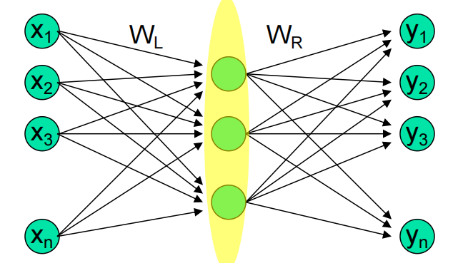

# Unsupervised Learning 无监督学习

## Hebbian Learning

### 简介 (Introduction)

Hebbian 学习是无监督学习中的一个核心概念，它基于生物神经元的工作原理。

- 到目前为止，我们主要学习了以**有监督方式**从环境中学习的神经网络。
- 然而，神经网络也可以以**无监督方式**进行学习。
- **无监督学习**通过在局部运行的一般规则，来发现输入数据中的**显著特征或模式**。
- 无监督学习网络通常由**前馈连接**和促进**“局部”学习**的元素组成。
- 1949 年，Hebb 在生物神经元的背景下提出了一个简单的原则。

### Hebbian 原理 (Hebbian Principle)

Hebbian 原理描述了神经元之间如何加强连接：当一个神经元重复地兴奋另一个神经元时：

- 后一个神经元的阈值会降低；
- 或神经元间的突触权重会增加。
- 这样做的效果是**增加了第二个神经元被兴奋的可能性**。

### Hebbian 学习规则 (Hebbian Learning Rule)

Hebbian 学习的数学规则表达为权重的变化量 $\Delta w_{ji}$：

$$\Delta w_{ji}=\eta y_{j}x_{i} \quad$$

其中：

- $w_{ji}$ 是从神经元 $i$ 到神经元 $j$ 的权重。
- $\eta$ 是学习率。
- $y_j$ 是后突触活动（输出）。
- $x_i$ 是前突触活动（输入)。
- 由于 Hebb 规则中**不需要期望的或目标信号**，因此它是一种**无监督学习**。

### 不稳定性 (Instability)

- 考虑单个权重 $w$ 的更新，其中 $x$ 和 $y$ 分别是前突触和后突触活动：

  $$w(n+1)=w(n)+\eta x(n)y(n) \quad$$

- 对于线性激活函数，更新规则可以进一步写成：

  $$w(n+1)=w(n)[1+\eta x(n)x^{T}(n)] \quad$$

- 这个规则会导致**权重无限制地增加**。

  - 如果初始权重为负，则它将在负范围内增加。
  - 如果初始权重为正，则它将在正范围内增加。

- 因此，**Hebbian 学习本质上是不稳定的**，这与使用 BP 算法的纠错学习不同。

### 相似性度量 (Similarity Measure)

- 考虑一个具有 $p$ 个输入的单个线性神经元：

  $$y=w^{T}x=x^{T}w \quad$$

- 输出 $y$ 可以视为输入向量 $x$ 和权重向量 $w$ 的**点积** (dot product)。

- 点积也可以用向量的幅度和夹角 $\alpha$ 来表示：

  $$y=|w||x|\cos(\alpha) \quad$$

  其中 $\alpha$ 是向量 $x$ 和 $w$ 之间的夹角。

- 这意味着 Hebbian 学习训练的网络在其输入空间中创建了一个**相似性度量（内积）**。

  - 如果 $\alpha$ 接近 $0$（$x$ 和 $w$ **“接近”**），则 $y$ 很大。
  - 如果 $\alpha$ 接近 $90^\circ$（$x$ 和 $w$ **“相距较远”**），则 $y$ 为零。

- **权重**在训练过程中**捕获（记忆）了数据中的信息**。

- 在操作过程中，当权重固定时，较大的输出 $y$ 表明当前输入与训练期间创建权重的输入 $x$ **“相似”**。

## Oja's  Rule

### 引入 Oja 规则的原因

- **回顾 Hebbian 学习的不稳定性：** 简单的 Hebbian 学习规则 $\Delta w_{ji}=\eta y_{j}x_{i}$ 会导致权重 $w$ **无限制地增长**（或减少）。这使得网络不稳定，无法收敛到一个有意义的状态。
- **Oja 的目标：** 为了解决权重无限制增长的问题，Oja 提出了一个**归一化的 Hebbian 规则**。

### Oja 规则的表达式

Oja 规则，也称为**归一化 Hebbian 规则 (Normalized Hebbian Rule)**，其近似表达式为：

$$w_{ji}(n+1)=w_{ji}(n)+\eta y_{j}(n)[x_{i}(n)-y_{j}(n)w_{ji}(n)] \quad \text{}$$

这个规则可以分解为以下两部分：

1. **Hebb 项：** $\eta y_{j}(n)x_{i}(n)$
   - 作用：这部分与标准 Hebbian 规则一致，促使权重增长。
2. **遗忘项/归一项：** $-\eta y_{j}(n)[y_{j}(n)w_{ji}(n)]$
   - 作用：这是一个**负反馈项**或**“遗忘项”**，它与权重 $w_{ji}(n)$ 和输出 $y_{j}(n)$ 的平方成正比。它的引入**阻止了权重的无限制增长**，从而稳定了学习过程。

### 规则的特性和作用

- **稳定性与收敛性：** 与不稳定的 Hebbian 规则不同，Oja 规则经过 Lyapunov 函数分析证明，可以**渐进收敛**。这意味着权重向量 $w$ 最终会趋向并停留在某个稳定的值。
- **主成分分析 (Principal Component Analysis, PCA)：** Oja 规则最强大的特性在于它与 PCA 的关系。当 Oja 规则应用于**单个线性神经元**时：
  - 它可以将神经元的权重向量 $\mathbf{w}$ 收敛到输入空间 $\mathbf{x}$ 的**第一主成分（最大特征向量）**。
  - 第一主成分是数据变化最大的方向，它捕获了输入数据中**最大量的方差**信息。
  - 因此，Oja 规则是一种**高效的特征提取**方法，它无监督地学习到数据中最具代表性的特征。

### 什么是降维

想象一下您有一大堆数据，每个数据点都有**非常多的特征**（维度，比如 $N$ 个特征）。处理这么多信息既困难又费时。

- **目标**：**降维**就像是给数据做一个**“瘦身”**手术。
- **方法**：我们想把这些高维数据（$N$ 个特征）**投影**到一个维度更低的小空间（$K$ 个特征，且 $K \ll N$）。
- **好处**：这样做能帮我们抓住数据中**最重要的信息**，而把次要的、噪音般的信息过滤掉。在神经网络中，我们的目标就是把原始的输入向量 $X = [\begin{matrix}X_{1} & X_{2} & ... & X_{N}\end{matrix}]^T$ 压缩成一个短小的输出向量 $y=[\begin{matrix}y_{1} & y_{2} & ... & y_{k}\end{matrix}]^T$。

### 如何找到更多重要信息

我们之前学过，一个**单个神经元**使用 Oja 规则，可以找到数据中变化最大的方向——**第一主成分**。但数据中往往还有其他重要的、**正交**（垂直）的方向需要被提取。

- **问题**：找到了最重要的方向（第一主成分）后，**如何找到与它垂直的下一个重要方向**?
- **解决方案：通缩法 (Deflation Method)**。这是一种扩展 Oja 规则来提取多个主成分的方法。

### 通缩法的工作原理

“通缩”这个词听起来很专业，但原理很简单，就像**“减法”游戏**：

1. **找到第一个“重点”**：假设我们已经用 Oja 规则找到了数据中的**第一主成分**（第一个最重要的特征向量）$\mathbf{w}_1$。

2. **计算投影（第一“重点”有多强）**：对于任何一个新的输入 $\mathbf{x}$，我们首先计算它在 $\mathbf{w}_1$ 方向上的**投影** $y=w_{1}^{T}x$。这告诉我们，这个输入包含了多少“第一重点”的信息。

3. 从原图中“擦除”它：我们用原始输入 $\mathbf{x}$ 减去已经被找到的那个“重点” $\mathbf{w}_1 y$，得到一个修改后的输入 $\hat{x}$。

   $$\hat{x}=x-w_{1}y=x-w_{1}w_{1}^{T}x$$

   - **通俗理解**：新的输入 $\hat{x}$ 里面已经**不含**第一个最重要的信息了。

4. **重复学习（找第二个“重点”）**：现在，我们让**下一个神经元**在**修改后的新数据 $\hat{x}$** 上重复应用 Oja 规则。由于第一个方向的信息已被“擦除”，这个神经元自然会找到数据中**次重要的、与第一个方向垂直**的第二个主成分。

通过这个“找到-擦除-再找”的迭代过程，我们就可以用多个神经元依次找到数据的多个主成分，从而实现高效的降维。

## 神经网络中的 PCA

### 瓶颈层与降维

降维是处理高维数据的核心方法，PCA 是最常用的降维技术。

- **多层网络与“瓶颈”**：我们可以使用一个特殊结构的多层神经网络来实现 PCA 的效果。这个网络有一个**中央的“瓶颈层”**（或称隐藏层），它的神经元数量远少于输入层和输出层。

- **训练目标：自关联输出（Self-associative Output）**

  - 我们训练这个网络，让它的**输出层**和**输入层**完全一样（即**恒等映射**）。简单来说就是：输入什么，网络就应该输出什么。
  - **损失函数**：我们用**输出**减去**输入**的误差来训练它（例如，均方误差 $\text{MSE}$）。

- **瓶颈层的魔力**：

  - 当网络学会了“原样输出”时，隐藏的**瓶颈层**就产生了神奇的作用。
  - 因为瓶颈层的神经元很少，空间很有限，它**没有多余的空间去容纳冗余的特征**。它必须**只提取和保留那些最关键、最能代表输入数据的特征**。
  - 这样，瓶颈层中的活动就形成了一个**高效的、压缩的代码**。

- **PCA 联系**：研究证明，经过这种方式训练的网络，其权重矩阵 $W_L$ 所张成的子空间，恰好就是输入数据的前 $m$ 个**主特征向量**（即前 $m$ 个主成分）所张成的子空间。

  

### 自编码器 (Auto-encoders)

**自编码器**就是这种使用瓶颈层来学习特征的神经网络。

- **定义**：它是一种前馈神经网络，通过反向传播算法（BP）进行无监督学习，其唯一目标是**预测输入本身**。
  - 目标输出 $y$ **就是**输入 $x$。
- **核心结构**：自编码器可以分为两部分，就像一个压缩-解压缩的过程：
  1. **编码器 (Encoder)**：从**输入层**到**隐藏层（瓶颈层）的部分。它的作用是把高维数据压缩成一个简短、高效的“编码”**。
  2. **解码器 (Decoder)**：从**隐藏层（瓶颈层）到输出层**的部分。它的作用是把这个“编码”解压缩，并尝试**重构**回原始的输入数据。

### 自编码器的用途 

自编码器具有两个主要用途：

1. **降维 (Dimensionality Reduction)**：这是它的主要应用。它在隐藏层生成了一个**简短的编码**，这个编码在低维度空间中，保留了**最大量**关于输入的信息，以便输入可以被重构。
2. **压缩 (Compression)**：可以将原始数据压缩成瓶颈层的**“编码”**，这在数据存储和传输中非常有用。

**总结**：自编码器通过**强制**网络将大量输入信息通过一个很小的“瓶颈”传过去，从而迫使这个“瓶颈”去学习和提取数据中最本质、最重要的**主成分特征**。一旦训练完成，我们就可以抛弃解码器部分，只使用**编码器**来获得数据的**高效低维表示**。

## 自编码器 (Auto-encoders)

### 基础概念与结构

- **定义**：自编码器（Autoencoder，由 Rumelhart 在 1986 年提出）是一个**前馈神经网络**，其学习目标是让**输出** $\hat{x}$ 尽可能地**预测输入** $x$ 本身。即，目标输出 $y^{(i)}$ 等于输入 $x^{(i)}$。
- **结构**：自编码器是一个典型的“沙漏”形网络结构，它包含三个主要部分：
  1. **输入层** ($\text{Layer } L_1$): 接收原始输入向量 $x$
  2. **隐藏层/瓶颈层** ($\text{Layer } L_2$): 这一层神经元数量通常较少，负责生成**压缩代码**。
  3. **输出层** ($\text{Layer } L_3$): 尝试重构输入，生成 $\hat{x}$。
- **功能划分**：
  - **编码器 (Encoder)**：对应于**输入到隐藏层**的部分，负责将输入 $x$ 转换为隐藏表示 $\mathbf{h}_{W,b}(x)$。
  - **解码器 (Decoder)**：对应于**隐藏层到输出层**的部分，负责将隐藏代码重构成输出 $\hat{x}$。

### 功能与类比

- **目标**：自编码器的目标是让输出层能够**重现输入模式** 8。网络中隐藏层的数量和大小可以变化。
- **与 PCA 的关联**：自编码器倾向于找到一种类似于 **PCA** 的数据描述方式。
- **信息压缩**：瓶颈层中的少数神经元起到了**信息压缩器（代码）**的作用。

### 深度自编码器 (Deep Auto-encoder)

- **概念**：深度自编码器（由 Hinton 在 2006 年提出）是通过在编码器和解码器部分使用**多个隐藏层**来构建的。
- **对称结构**：图片展示了一个典型的对称结构：
  - **编码器**：将输入图像 $X$ 逐层压缩，例如：$2000 \to 1000 \to 500 \to 30$（**代码层**）。
    - 编码过程：$h_{1}=\sigma(W_{1}x+b_{1})$， $h_{2}=\sigma(W_{2}h_{1}+b_{2})$。
  - **解码器**：将代码层（$30$ 个神经元）逐层解压，例如：$30 \to 500 \to 1000 \to 2000 \to$ 输出 $\tilde{X}$。解码器通常使用与编码器**转置**的权重矩阵（$W_1^T, W_2^T, \dots$）。
    - 解码过程：$\tilde{h}_{1}=\sigma(W'_{2}h_{2}+b_{3})$， $\tilde{X}=\sigma(W'_{1}h_{1}\pm b_{4})$。

### 去噪自编码器 (Denoising Auto-encoder)

- **概念**：去噪自编码器（由 Vincent 在 2008 年提出）通过向输入**添加随机噪声**来进一步优化自编码器。

- **训练过程**：

  1. 从原始输入 $x_i$ 中生成一个**受损的输入** $\tilde{x}_{i}$ （即加入了噪声)。
  2. 编码器接收受损输入 $\tilde{x}^{(l)}$，计算隐藏表示 $h^{(l)}$ 。
  3. 解码器根据 $h^{(l)}$ 计算输出重构 $\hat{x}^{(l)}$ 。

- **目标**：训练目标是使输出 $\hat{x}_{i}$ 能够**重构原始的、未受损的输入 $x_{i}$** 。

- **好处**：这迫使自编码器去学习**更健壮 (robust) 的特征**，因为网络必须学会从噪声中恢复出数据的本质结构。

- 损失函数：最小化原始输入 $x^{(l)}$ 与重构输出 $\hat{x}^{(l)}$ 之间的平方距离之和，同时可能加上一个正则化项（例如 $L_2$ 正则化）以惩罚大权重。

  $$\min_{W_{1},W_{2},b_{1},b_{2}}\sum_{l}||x^{(l)}-\hat{x}^{(l)}||_{2}^{2}+\lambda(||W_{1}||_{F}^{2}+||W_{2}||_{F}^{2}) \quad \text{}$$

### 自编码器总结

- **核心功能**：网络试图在输出中重现输入，从而在隐藏层中诱导出**简短的编码**。
- **信息保留**：这种编码在一个**更小的维度空间**中保留了**最大量**的关于输入的信息，以便输入可以被重构。
- **应用**：自编码器网络可以用于**降维**、**压缩**等任务

## 聚类重温 (Clustering Revisit)

### 什么是聚类分析？

- **定义**：聚类分析是**将一组数据分组到簇（clusters）中**的过程 。
- **簇的特性**：一个簇是数据点的集合，其中每个观测值必须满足以下两个条件 ：
  - 与**同一簇中的其他观测值相似** 。
  - 与**其他簇中的观测值不相似** 。
- **组织结构**：聚类分析通过抽象底层结构来组织数据，可以是**个体分组**的形式，也可以是**群组的层级结构**的形式 。

### 聚类的性质与应用 

- **相似性基础**：这些分组是基于模式之间**测量到或感知到的相似性** 。
- **无监督性**：聚类是**无监督的** 。这意味着**没有类别标签**和关于数据来源的其他信息可供学习 。
- **典型应用**：
  - 作为**独立工具**，用于深入了解数据分布 。
  - 作为其他算法的**预处理步骤** 

## K-means 算法重温 (K-means Algorithm Revisit)

### 算法目标

- **基本功能**：K-means 算法将数据划分成 $K$ 个**互斥的簇（clusters）**。

- **优化目标**：算法的目标是**最小化**每个簇中所有数据点到其“代表对象”（即**质心** $\mu_i$）的**平方距离之和**。

  - 这个目标函数的数学表达式是：

    $$\sum_{i=1}^{K}\sum_{X_{j}\in S_{i}}d^{2}(x_{j},\mu_{i}) \quad$$

    其中：

    - $S_{i}$ 是第 $i$ 个簇 ($i=1, 2, \dots, K$) 。
    - $\mu_{i}$ 是簇 $S_{i}$ 中数据点的第 $i$ 个**质心**。
    - $d$ 是距离函数。

### 优化原理

K-means 算法的核心思想是找到数据的最佳划分：

- **目标本质**：找到数据集中最**紧凑**的 $k$ 个划分。
  - **最小化**：**簇内方差** (intra-cluster variance)。
  - **最大化**：**簇间方差** (inter-cluster variance)。
- **K-means 的困境**：
  - 如果我们知道每个点的簇分配，就能很容易计算出质心的位置。
  - 如果我们知道质心的位置，就能很容易将每个点分配给最近的簇。
  - 但问题是**两者都是未知的**。

### 算法步骤

K-means 算法使用迭代方法来解决这个困境：

1. **确定 $K$**：选择要划分的簇的数量 $K$。
2. **初始化**：随机选择 $K$ 个**质心**的初始位置。
3. **分配点**：将每个数据点分配给**“最近的质心”**（这取决于所使用的距离度量）。
4. **更新质心**：根据新分配的点，**重新计算**质心的位置。
5. **检查收敛**：如果解决方案收敛（即簇分配不再变化或变化很小），则停止。

**重要说明**：K-means 算法是**敏感的**，初始选择的质心位置会影响最终结果，可能收敛到**次优解**（见第 26 页图示，但内容不在本范围）。

## 无监督竞争学习 (Unsupervised Competitive Learning)

### 竞争学习与 Hebbian 学习的区别

- 在 Hebbian 网络中，**所有神经元可以同时“激活”（fire）**。
- **竞争学习**则意味着**只有来自每个组的一个神经元在每个时间步激活**。
- **输出单元相互竞争**。这些单元是**赢者通吃 (Winner-Takes-All, WTA) 单元**。
- 竞争对于神经网络非常重要，并且在生物神经系统中也观察到了神经元之间的竞争现象。竞争有助于解决许多问题。

### 竞争的分类应用

- **目标**：将一个输入模式**分类**到 $m$ 个类别中的一个。
- **理想情况**：理想情况下，**只有一个节点输出 1**，所有其他节点输出 0。
- **现实情况**：通常会有**不止一个节点有非零输出**。
- **竞争机制**：如果这些类别节点相互竞争，最终**可能只有一个会获胜**，而所有其他节点会失败（即“赢者通吃”）。
- **分类结果**：这个**获胜者**就代表了对输入模式的计算分类结果。

### 竞争学习机制的架构

图片展示了竞争学习机制的架构：

- **层间连接**：层与层之间的连接是**兴奋性的** 。
- **层内连接**：**层内的连接是抑制性的**。
- **抑制性簇**：每个层（Layer 2, Layer 3）都由一组**相互抑制的单元簇**组成。
- **竞争规则**：一个簇内的单元相互抑制，其方式是**每个簇中只能有一个单元是激活的**（赢者通吃）。
  - **激活单元**用实心点表示。
  - **非激活单元**用空心点表示。
- **信号流动**：一个给定层的单元：
  - 可以从**下一个较低层的所有单元**接收输入。
  - 可以向**下一个较高层的所有单元**投射输出。

## 赢者通吃 (Winner-takes-all, WTA)

### 机制概述

- 在所有相互竞争的节点中，**只有一个会获胜**，而**所有其他节点都会失败** 。
- **获胜者**是具有**最大激活水平**的神经元。
- 这个获胜的神经元是**唯一产生输出信号**的神经元 。
- 所有其他神经元的活动在竞争中被抑制 。

### WTA 的实现方式

实现 WTA 机制可以有两种方式：

1. **外部仲裁者 (External Arbitrator)**：
   - 最简单的方法是设置一个**外部的、中央仲裁者**（通常是一个程序）。
   - 这个仲裁者通过**比较竞争者当前的输出**来决定获胜者（如果打平则任意决定）。
   - **问题**：这种方式在**生物学上是不合理的**，因为生物神经系统中**不存在这样的外部仲裁者** 。
2. **侧抑制 (Lateral Inhibition)**：
   - 这是生物学上更合理的实现方式，通常通过**神经元之间的相互抑制连接**（如 Maxnet 或墨西哥帽网络）来实现，它允许网络自身通过迭代过程决定赢家 。这部分内容在后续幻灯片中会介绍。

## 简单竞争学习 (Simple Competitive Learning)

### 算法直觉与流程 

简单竞争学习是一种直观且合理的过程，旨在通过迭代将原型（即权重）放置在数据密度高的区域：

- **初始化**：首先**初始化 $K$ 个原型向量**（这些原型向量就是神经元的权重向量)
- **输入样本**：呈现一个**单独的输入示例** 2。
- **识别获胜者**：**识别最接近的原型**，即所谓的**获胜者**（winner)。
- **更新获胜者**：将**获胜者向该输入示例移动**，使其更靠近该示例。
- **结果**：这种方法直观、合理，它会将原型放置在**数据密度高**的区域，并识别出特征的**最相关组合**。

### 获胜者的确定 (第 33 页)

在竞争学习中，获胜者（即被激活的输出节点）的确定基于输入和权重的关系：

- 激活水平：输出节点 $j$ 的激活水平 $h_j$ 通常由输入 $\mathbf{x}$ 和其传入权重 $\mathbf{w}_j$ 的内积决定：

  $$h_{j}=\sum_{i}w_{ji}x_{i} \quad \text{}$$

- **获胜条件**：获胜节点 $j^*$ 是激活水平**最大**的节点，即 $w_{j^{*}}\cdot x\ge w_{j}\cdot x$ 对所有 $j$ 成立。

  - **距离视角**：获胜者也可以定义为**传入权重向量**与**输入向量**之间**欧氏距离最短**的输出节点。
  - **内积与距离的关系**：请注意，两个**归一化**向量的内积与它们之间夹角的余弦值相关，这进一步关联了“相似性”和“距离”。

- **机制**：**侧抑制**机制确保了只有一个节点获胜。

### 权重更新规则

简单竞争学习使用特定的更新规则来调整权重：

- 更新规则：只更新获胜节点 $j^*$ 的传入权重，而其他节点的权重不变（即侧抑制机制)。一个可能的更新规则是：

  $$\Delta w_{j^{*_{i}}}=\eta y_{j}(x_{i}-w_{j^{*i}}) \quad \text{}$$

  其中：

  - $\eta$ 是学习率。
  - $y_{j^{*}}=1$（获胜者输出为 1） 。
  - $y_{j}=0$（其他失败者输出为 0，当 $j \ne j^*$ 时）。

- **效果**：这个规则将**具有最大激活的神经元**进行调整，使其**更像**导致其兴奋的那个输入 。

- **死单元问题**：由于**只有获胜节点的传入权重被修改** ，一些单元可能**永远或很少成为获胜者**，它们的权重向量得不到更新。这些未被激活的单元被称为**“死单元” (DEAD UNIT)** 。

### 聚类结果

- 简单竞争学习的结果是，**每个输出单元都会移动到输入向量集群的质心**（中心）。
- 通过迭代学习，最初随机分散的权重向量（红星）会逐渐聚集到输入数据点（黑点）密集的区域，从而形成清晰的聚类结果

## 优化竞争：解决死单元问题

### 解决死单元问题的必要性

在简单竞争学习（SCL）中，我们遇到了 **“死单元”** 问题：

- **死单元产生的原因**：一个输出单元的权重向量初始位置可能落在**模式（数据点）非常稀疏**的区域。
- **结果**：这些单元可能**永远或很少成为获胜者**，因此它们的权重向量无法得到更新。这阻止了它们找到模式空间中更丰富（更密集）的部分。
- **目标**：为了提高效率，我们需要确保**更公平的竞争**，让每个单元都有平等的机会去代表训练数据的一部分。

### 渗漏学习 (Leaky Learning)

**渗漏学习 (Leaky Learning)** 是一种实现更公平竞争的机制：

- **方法**：修改**获胜单元**和**失败单元**的权重，但使用**不同的学习率**。

- 更新规则：

  $$w(t+1)=w(t)+\begin{cases}\eta_{w}(x-w(t)) & \text{for the winner} \\ \eta_{L}(x-w(t)) & \text{for the losers}\end{cases} \quad \text{}$$

  其中，获胜单元的学习率 $\eta_{w}$ **远大于**失败单元的学习率 $\eta_{L}$ ($\eta_{w} \gg \eta_{L}$)。

- **效果**：这个机制的核心在于，它具有**缓慢移动失败单元**（Losing Units）向**模式空间中更密集的区域**的作用。

### 渗漏学习的图示解释

渗漏学习的图示解释了这一过程：

- **初始状态)**：图示可能展示了数据的分布，其中一些初始权重可能位于**离群点 (Outlier)** 附近或数据稀疏区域。
- **渗漏过程**：
  - **获胜单元**：由于 $\eta_{w}$ 较大，它们会**快速**向其所代表的密集数据中心移动。
  - **失败单元**：由于 $\eta_{L}$ 很小，但**不为零**，它们会**缓慢地**向整个数据空间的整体中心移动。
  - 最终，所有单元都会被“渗漏”到数据更集中的地方，即**移向更密集的区域**。这有效地解决了死单元问题，因为即使是很少获胜的单元，其权重也会被这个“渗漏”机制缓慢地调整到更有机会获胜的区域。

## 简单竞争学习 (SCL) 示例分析

这两组示例演示了 SCL 算法对**初始权重**的敏感性，并强调了 **“死单元”** 问题以及**平衡初始化**的重要性。

### 示例一：死单元的出现

这个示例使用了 6 个输入向量和 3 个初始随机生成的权重向量（代表 3 个类）。学习率为 $\eta = 0.5$。

#### 训练与更新

幻灯片详细展示了第一轮训练（Epoch 1）中 6 个输入向量的训练过程：

- **输入向量 #1**：$\begin{matrix}[0.00 & 1.00 & 1.00]\end{matrix}$ 获胜者是权重向量 #123。该向量被更新
- **输入向量 #2**：$\begin{matrix}[1.00 & 1.00 & 0.50]\end{matrix}$ 获胜者是权重向量 #33。该向量被更新
- **输入向量 #3, #4, #5, #6**：这四个输入向量连续获胜的都是权重向量 #223。该向量被连续更新四次。

#### 聚类结果

- **Epoch 1 结束后的簇**：
  - 权重向量 #123 赢了 1 次，收敛到 [0.07, 0.87, 0.85]，代表输入 #1。
  - 权重向量 #223 赢了 4 次，收敛到 [0.24, 0.26, 0.22]，代表输入 #3, #4, #5, #6。
  - 权重向量 #33 赢了 1 次，收敛到 [0.87, 0.90, 0.69]，代表输入 #2。
- **Epoch 2 结束后的结果**：权重向量被再次更新（如 [0.03, 0.94, 0.93] 等），但**聚类结果保持不变**。
- **结论**：在此示例中，每个权重向量都代表了一部分输入，**没有出现明显的“死单元”**。

### 示例二：对初始权重的敏感性

这个示例使用了另一组 6 个输入向量，测试了**不同初始权重**对聚类结果的影响。学习率为 $\eta = 0.5$，进行 10 轮 (Epochs) 训练。

#### 案例 2a：不平衡的初始权重

- **初始权重**：$\begin{matrix}[1.20 & 1.00 & 1.00]\end{matrix}$、$\begin{matrix}[1.20 & 1.00 & 1.20]\end{matrix}$、$\begin{matrix}[1.00 & 1.00 & 1.00]\end{matrix}$ 8。这些初始权重向量的值偏高且相互接近。
- **10 轮后的结果**：
  - 权重向量 #233 是“大赢家”（The big winner），捕获了 4 个输入向量（#1, #2, #4, #5）。
  - 权重向量 #123 捕获了 2 个输入向量（#3, #6）。
  - **权重向量 #232 完全失败（loses completely!!）**，没有捕获任何输入。
- **结论**：**出现了死单元**。权重向量 #232 没有机会获胜，因此没有更新，导致聚类不平衡。这表明 SCL 形成的簇**对初始权重向量高度敏感**。

#### 案例 2b：更好的平衡初始化

- **初始权重**：$\begin{matrix}[1.00 & 0.80 & 1.00]\end{matrix}$、$\begin{matrix}[0.80 & 1.00 & 1.20]\end{matrix}$、$\begin{matrix}[1.00 & 1.00 & 0.80]\end{matrix}$。这次初始权重分布更均衡，相互之间距离更合理。
- **10 轮后的结果**：
  - 权重向量 #13 捕获了 2 个输入向量（#1, #2）。
  - 权重向量 #23 捕获了 2 个输入向量（#4, #5）。
  - 权重向量 #33 捕获了 2 个输入向量（#3, #6）。
- **结论**：形成了**3 个大小相等的簇（3 clusters of equal size!!）**。这证明了**初始权重向量的良好平衡**对于 SCL 算法成功地形成均衡聚类至关重要。

这些示例有力地展示了简单竞争学习的**不稳定性和敏感性**，这也为引入**渗漏学习**（Leaky Learning）等优化机制提供了动机。

## Maxnet

Maxnet 是一种特定的竞争网络，用于实现 **赢者通吃 (WTA) 竞争** 。

### 结构与连接 (第 47 页)

Maxnet 是一个具有**侧抑制**的网络结构。

- **输入层**：底部的神经元 ($\xi_1$ 到 $\xi_5$) 接收输入。
- **竞争层**：顶部的神经元 (1, 2, 3) 相互竞争。
- **侧抑制 (Lateral Inhibition)**：竞争层中，**每个节点的输出通过抑制性连接（带有负权重）反馈给其他节点**。这意味着如果节点 $i$ 和 $j$ 之间有连接，则权重 $w_{ij}$ 和 $w_{ji}$ 都是负值。

### 权重和节点函数

Maxnet 通过特定的权重设置和激活函数来实现 WTA：

- **权重设置 ($w_{ji}$) **：

  - **自连接**：如果 $i = j$ (即神经元到自身)，权重 $w_{ji}$ 是一个**正值** $\theta$ ($+\theta$) 。这是**兴奋性**的自反馈。

  - 互连接：否则，权重 $w_{ji}$ 是一个负值 $-\epsilon$ 。这是抑制性的侧连接。

    $$w_{ji}=\begin{cases}\theta & \text{if } i=j \\ -\epsilon & \text{otherwise}\end{cases} \quad \text{[cite: 550, 552, 553]}$$

- **节点激活函数 ($f(x)$)**：

  - Maxnet 使用一个简单的函数：如果输入 $x$ 大于 0，输出就是 $x$ 本身；否则，输出为 0。

    $$f(x)=\begin{cases}x & \text{if } x>0 \\ 0 & \text{otherwise}\end{cases} \quad \text{[cite: 560, 561, 573]}$$

  - **作用**：这确保了只有**激活值为正**的神经元才能继续传递信号。

### 竞争与收敛

- **竞争过程**：Maxnet 的竞争是一个**迭代过程**，直到网络稳定下来。

- **稳定状态**：在稳定状态下，**至多只有一个节点具有正的激活值**（即赢者通吃）。

- 参数 $\epsilon$ 的约束：为了保证网络能正确收敛到单个获胜者，侧抑制参数 $\epsilon$ 必须满足一个约束条件：

  $$0<\epsilon<1/m \quad$$

  其中 $m$ 是竞争者的数量。

- **参数敏感性**：

  - 如果 $\epsilon$ **太小**，网络需要**太长时间才能收敛** 。
  - 如果 $\epsilon$ **太大**，它可能会**抑制整个网络**，导致**没有赢家** 。

Maxnet 通过兴奋性的自连接和抑制性的互连接，实现了**无需外部仲裁者**的纯粹的赢者通吃机制。

## 墨西哥帽网络 (Mexican Hat Network)

### 核心机制

墨西哥帽网络也是一种竞争网络，用于实现 **赢者通吃 (WTA)** 机制，但它引入了**局部合作**和**远距离竞争**的概念。

- **获胜机制**：在所有竞争节点中，具有**最大激活水平**的神经元成为获胜者。
- **输出**：只有这个获胜神经元会产生输出信号 2。其他所有神经元的活动都会被抑制。
- **侧连接特性**：该网络的关键在于**侧连接**产生的兴奋性或抑制性效应，它们**取决于与获胜神经元的距离**。
- **实现方式**：这种距离依赖的连接特性是通过使用**墨西哥帽函数**来描述输出层神经元之间的突触权重的。

### 架构与连接强度

“墨西哥帽”这个名称来源于其连接强度曲线的形状，该曲线形似一顶墨西哥宽边帽：中间高（兴奋），两侧低（抑制）。

- **连接强度与距离的关系**：
  - **中心**（距离为 0）：连接强度最高，产生**兴奋效应** (Excitatory effect)。
  - **近邻**：与给定节点**距离近**的邻居是**合作性**的（相互兴奋，权重 $w>0$) 。
  - **远邻**：与给定节点**距离远**的邻居是**竞争性**的（相互抑制，权重 $w<0$) 。
  - **太远**：**距离太远**的邻居是**不相关**的（权重 $w=0$) 。
- **距离的定义**：为了应用这个模型，我们需要定义距离，例如：
  - **一维**：按索引（1, 2, ... n）排序 。
  - **二维**：使用晶格结构 。
- **平衡状态 (Equilibrium)**：当网络达到平衡时 ：
  - 获胜节点具有最高的激活值 。
  - 获胜节点的**合作性邻居**都具有**正激活值** 。
  - 获胜节点的**竞争性邻居**都具有**负（或零）激活值**。

### 示例参数解释

第 53 页提供了一个具体的墨西哥帽网络的参数示例：

#### 1. 权重参数 ($w_{ij}$)

权重 $w_{ij}$（从节点 $j$ 到 $i$ 的连接）取决于它们之间的距离 $d(i, j)$：

| **条件**                    | **权重 (wij)**          | **效应**  | **通俗理解**           |
| --------------------------- | ----------------------- | --------- | ---------------------- |
| $\text{distance}(i, j) < k$ | $c_1$ ($c_1 > 0$)       | 强兴奋性  | **近邻：强烈合作**     |
| $\text{distance}(i, j) = k$ | $c_2$ ($0 < c_2 < c_1$) | 弱兴奋性  | **稍远：温和合作**     |
| $\text{distance}(i, j) > k$ | $c_3$ ($c_3 \le 0$)     | 抑制性/零 | **远邻：竞争或不相关** |

#### 2. 激活函数 (Ramp Function)

该网络使用一个**斜坡函数** (Ramp Function) 作为激活函数 $f(x)$ ：

$$f(x)=\begin{cases}0 & \text{if } x<0 \\ x & \text{if } 0\le x\le max \\ max & \text{if } x>max\end{cases} \quad \text{}$$

- **负值输入**：如果输入 $x < 0$，输出为 0（神经元被抑制，不激活）。
- **中间值输入**：如果输入 $x$ 在 $0$ 到最大值 $\text{max}$ 之间，输出等于输入 $x$。
- **超限输入**：如果输入 $x$ 超过最大值 $\text{max}$，输出被限制在 $\text{max}$（即**饱和**）

## 向量量化 (Vector Quantization)

### 概念与思想

- **定义**：向量量化是**竞争学习**的一种重要应用。
- **核心思想**：
  - **分类**：使用竞争学习算法将一组给定的输入向量**归类到 $M$ 个类别中** 。
  - **表示**：然后，只用这个向量所属的**类别**来表示它。
- **应用**：这是竞争学习的一个重要应用，尤其在**数据压缩**领域。
- **空间划分**：VQ 将整个模式空间划分成**许多单独的子空间**。
- **码本 (Codebook)**：**$M$ 个单元**代表了一组**原型向量**（或称**码字/代码向量**。这个集合被称为**码本**。
- **分类标准**：新的输入模式 $\mathbf{x}$ 根据其与码本中**原型向量的接近程度**（通常使用**欧氏距离**）被分配给一个类别。

### 码本与量化函数

- **码本**：是原型向量（或称**质心/码字/代码向量**）的集合 $\{m_1, m_2, \dots, m_K\}$。
- **量化函数**：量化函数 $q(x_i)$ 将输入向量 $x_i$ 映射到码本中的一个原型 $m_k$。
  - 通常，这个函数是**最近邻函数** (nearest-neighbor function)。
- **码本构建**：**K-means 算法**是构建码本的常用方法之一 。

### 几何解释：Voronoi 图

向量量化在几何上表现为对输入空间的划分，即 **Voronoi 图 (Voronoi Diagram)**。

- **Voronoi 图**：是对一个平面进行分区（partitioning）的一种方法，分区是基于平面上的点到特定子集（即**种子点**，在这里是**码向量**）的距离 。
- **Voronoi 单元/区域**：
  - 对于每个种子点（码向量），都有一个对应的区域 。
  - 这个区域由**所有更接近该种子点而非任何其他种子点**的点组成 。
  - 这些区域被称为 **Voronoi 单元 (Voronoi cells)** 。
- **VQ 的映射**：在 VQ 中，每个 Voronoi 单元就是数据的**编码区域**，该区域内的所有输入都被映射到该单元对应的**码向量**（即质心）。

### 进一步学习

- 幻灯片提到了 **LBG 设计算法** 是用于 VQ 的另一种设计算法，但明确指出它**不属于本模块的范围**