# Organizing Feature Map 自组织特征映射

## Self-Organizing Map –Biological Motivation 自组织映射——生物学动机

### SOM 的生物学动机与大脑构造

**大脑作为自组织系统：** 大脑是一个“自组织系统”（self-organizing system）。它能够通过改变神经元之间的连接来进自主学习 。这种改变的具体方式包括：

- 增加连接（adding）
- 移除连接（removing）
- 增强连接（strengthening）

**核心原则：** 这一页最底部的文字总结了一个关键原则：“功能相似的神经元会聚集在一起” (Neurons with similar functions are grouped together) 。这就是 SOM 算法试图模拟的“拓扑有序性”。

### 从多维信号到二维映射

- **功能聚集原则重申：** 强调了**“功能相似的神经元聚集在一起”**这一概念 。
- **降维处理（Dimensionality Reduction）：** 这是 SOM 最重要的理论基础之一。幻灯片指出，大脑处理的是来自外部世界的 **多维信号** (multidimensional signals)，但它会在内部将其处理并映射为一个 **"2"维的内部地图** (2-dimensional internal map) 。这意味着大脑皮层实际上是在做一个将高维信息投影到二维平面的工作。

## Feature Maps 特征映射

### 特征映射（Feature Maps）与其具体实例

特征映射是大脑自组织的结果，并列举了三种关键的生物学映射例子。

- **定义与形态：**
  - 特征映射是大脑**自组织（self-organization）的结果** 。
  - 这些映射在大脑中形成了**线性（一维）或平面（二维）的拓扑结构** 。也就是说，尽管大脑本身是立体的，但皮层上的功能分布往往呈现为层状或线状。
- **具体实例（Examples）：**
  1. **听觉频率图（Tonotopic map）：** 声音的频率被空间化地映射到大脑皮层区域，并且是按顺序排列的，即从低频到高频呈有序递进分布 。
  2. **视网膜拓扑图（Retinotopic map）：** 视野被映射到视觉皮层中。这里有一个关键细节：视野中心的区域在皮层中拥有**更高的分辨率（higher resolution）**，这意味着大脑分配了更多的资源给视觉中心 。
  3. **体感图（Somatosensory map）：** 触觉的映射 。这对应了后面会提到的“皮层小人”概念，即身体不同部位的触觉在大脑皮层上有对应的特定区域。

### 多维感知与拓扑保持（Topology Preservation）

大脑处理信息的逻辑：如何将外部的复杂信息转化为内部的简单表示。

- **感知的多维性：**
  - 我们的感官体验本质上是**多维的（multidimensional）** 。
  - **例子：** 声音不仅仅是一个单一的数值，它由**音高（pitch）、强度（intensity）、噪声（noise）**等多个特征维度组成 。
- **降维与映射：**
  - 大脑将外部世界的多维表示映射为类似的**一维或二维的内部表示** 。
  - 这是一个关键的**降维过程**。
- **拓扑保持（Topology-preserving）：**
  - 这是本页最核心的概念。大脑处理外部信号的方式是**“拓扑保持”**的 。
  - **解释：** 这意味着在外部世界中相似或相邻的信号，映射到大脑内部后，负责处理它们的神经元在物理位置上也是相邻的。
- **对人工神经网络的启示：**
  - 如果我们希望模仿大脑的学习方式，我们的系统（即 SOM 算法）也必须具备这种**拓扑保持**的能力 。

## Topographic Maps

### 拓扑映射的核心概念

在人工神经网络中想要实现的目标，是将“竞争学习”扩展到包含“邻域”的概念。

- **扩展竞争学习：** 我们需要将竞争学习的思想加以扩展，把输入和神经元周围的**邻域（neighborhood）**也包含进来 。
- **非线性变换：** 目标是实现从“输入模式空间”到“输出特征空间”的非线性变换，关键在于这种变换要**保留输入之间的邻域关系** 。
- **空间有序性：**
  - 这种特征映射能够让位置相近的神经元对**相似的输入**产生响应 。
  - 神经元会有选择地根据特定的输入模式进行调整，从而形成有序排列，为不同的输入特征建立一个有意义的坐标系统 。

### 生物学实例——皮层小人（Cortical Homunculus）

生物学拓扑映射实例，即大脑体感皮层的映射图。

- **皮层小人：** 图中展示了**皮层小人（cortical homunculus）**，这是大脑体感区域的映射图 。
- **有序映射：** 身体的不同部位在大脑皮层上有着对应的、有序的分布区域。图中详细标注了从身体下部到上部及面部的对应关系：
  - **下肢与躯干：** 生殖器、脚趾、脚、腿、臀部、躯干、颈部 。
  - **上肢：** 头、肩、臂、肘、前臂、手腕、手 。
  - **手指：** 小指、无名指、中指、食指、拇指（手指在大脑中占据了较大区域） 。
  - **面部与五官：** 眼、鼻、脸、嘴唇、牙齿/牙龈/下颚、舌头、咽部 。

### 统计特征的空间化

- **内在统计特征：** 输出层（Output）的空间位置指示了输入模式的**内在统计特征** 。
- **映射规则：** 核心规则非常简单——在输入空间中**相近**（close in the input），映射到输出空间中也必须**相近**（close in the output）。

### 基于活动的自组织（Von der Malsburg模型）

自组织的理论研究。

- **提出者：** Von der Malsburg 提出了基于活动的自组织（Activity-based self-organization） 。
- **机制：** 该理论在无监督学习网络中结合了**竞争（competitive）**和**合作（cooperative）**机制来生成特征映射 。

### Malsburg 模型的具体结构

Von der Malsburg 构建这个生物学驱动的模型的方式：

- **网络结构：** 模型包含**2层网络** 。
- **连接方式：** 皮层单元（cortical units）通过赫布单元（Hebbian units）与视觉空间（visual space）进行**全连接** 。
- **墨西哥帽函数（Mexican-hat function）：** 皮层单元之间的相互连接可以用“墨西哥帽”函数来描述 。其特点是：
  - **短程兴奋（short-range excitation）：** 对邻近的神经元起促进作用 。
  - **长程抑制（long-range inhibition）：** 对较远的神经元起抑制作用 。

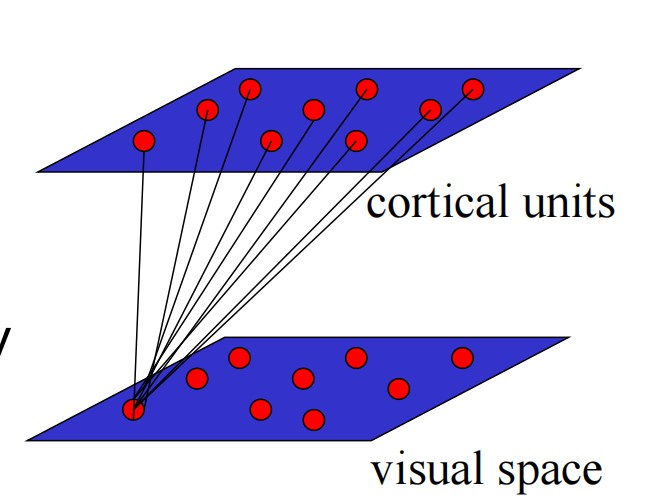

### 从 Malsburg 到 Kohonen (SOM)

从早期的 Malsburg 模型向 Kohonen 模型（即我们现在所说的 SOM）的演变。

- **Malsburg 模型的局限：** 虽然 Malsburg 的模型能够通过学习出现拓扑映射，但其**输入维度与输出维度是相同的**，没有实现降维 。
- **Kohonen 的改进：** Kohonen 简化了这个模型，提出了 **Kohonen 自组织映射（SOM）算法** 。
- **SOM 的优势：**
  - SOM 更通用，因为它能够执行**降维（dimensionality reduction）** 。
  - SOM 可以被视为一种**矢量量化（vector quantization）**类型的算法 。

## SOM

### SOM 的核心思想与数据结构

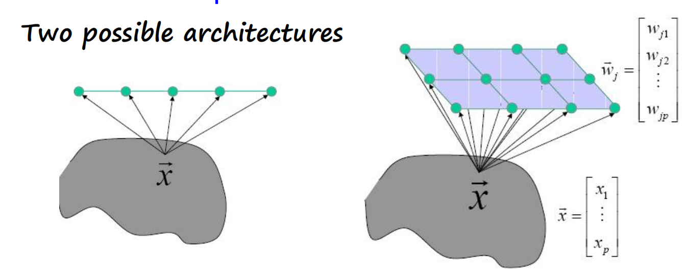

SOM 的基本功能和数学表示。

- **核心目标：** SOM 的核心思想是将**任意维度**的输入转换为一个 **1维或 2维的离散映射（discrete map）**。
- **两种可能的架构：** 幻灯片顶部的图示展示了一个 1维的神经元阵列，表示输入空间被映射到一条线上。
- **向量表示：**
  - **输入向量 ($\vec{x}$)：** 数据样本被表示为 $p$ 维向量 $\vec{x}=[x_{1}, \dots, x_{p}]^T$。
  - **权重向量 ($\vec{w}_j$)：** 每个神经元 $j$ 都有一个对应的权重向量，其维度与输入向量相同。公式展示为 $\vec{w}_{j}=[w_{j1}, \dots, w_{jp}]^T$（注：幻灯片公式中似乎有笔误，但在概念上权重维度需匹配输入维度）。

### 网络架构

 SOM 神经网络的具体连接方式和拓扑结构。

- **层级结构：** SOM 由 **2 层神经元** 组成 。
- **全连接：** **所有的输入**都连接到**每一个输出**神经元（Fully connected）。
- **输出层晶格（Lattice）：**
  - 输出神经元被排列在一个 1维或（通常是）**2维的晶格（lattice）** 中 。
  - **位置即距离：** 神经元在晶格中的**位置（position）定义了它们之间的距离**。这是 SOM 保持拓扑结构的关键——物理上相邻的神经元被视为“邻居” 。

### 算法流程（三个关键过程）

SOM 算法运作的完整周期。在网络权重初始化之后，算法通过以下三个过程循环运行 ：

1. **竞争（Competition）：**
   - 给定一个输入模式，输出层的神经元之间会进行**竞争**，以决定谁是“赢家”（Winner） 。
   - 竞争的依据是**判别函数（discriminant function）**，通常是计算输入向量与权重向量之间的**相似度** 。
2. **合作（Cooperation）：**
   - 获胜的神经元不仅自己被激活，它还确定了一个**拓扑邻域（topological neighborhood）**的空间位置 。
   - 在这个邻域内的其他输出神经元也会被**兴奋（excited）**，从而形成合作机制 。
3. **突触适应（Synaptic Adaptation）：**
   - 被兴奋的神经元（包括赢家和它的邻居）会**调整（adapt）**它们的权重 。
   - 调整的目标是使得判别函数的值增加，这意味着如果未来再次遇到相似的输入，赢家神经元的响应会**增强** 。

#### SOM 训练算法概览与原则

**三个核心步骤：** 再次列出了 SOM 训练循环中的三个关键环节 ：

- **竞争 (Competition)**
- **合作 (Cooperation)**
- **突触适应 (Synaptic Adaptation)**

**学习原则 (Learning Principle)：**

- 幻灯片将 SOM 的学习机制定义为：“**赢家‘溢出’到邻居的竞争学习**” (Competitive learning where winning "spills over" to neighbors) 。
- 这意味着不仅仅是获胜的神经元在学习，它的“胜利”还会波及并影响它周围的神经元，带动它们一起改变。

#### SOM 初始化 (Initialization)

在训练开始前必须完成的准备工作:

- **网格设定 (Grid)：**
  - 网格的**大小和结构**必须是先验确定的（fixed a priori），即在算法运行前就定好 。
  - 虽然 SOM 可以是一维或更高维，但**绝大多数情况下使用的是二维网格** 。
- **权重向量初始化：**
  - 每个神经元 $j$ 都有一个对应的权重向量 $\vec{w}_{j}$ 。
  - 虽然幻灯片上的公式 OCR 识别有些模糊，但其数学含义是初始化这些权重向量（通常赋予随机的小数值），以便网络准备好接收输入数据。

### 竞争过程 (Competitive Process)

这一步的目标是从所有输出神经元中找到与当前输入最匹配的那个“赢家”。

- **连续到离散的映射：** 竞争过程将连续的输入空间映射到离散的神经元输出空间 1。

- 赢家神经元 (Winner Neuron) 的选择：

  算法通过数学计算找到与输入向量 $\vec{x}$ 最相似的神经元 $j^*$。有两种常用的计算方法 2：

  1. **最大化内积：** $j^{*}=argmax_{j}(w_{j}^{T}x)$
  2. **最小化欧几里得距离：** $j^{*}=argmin_{j}(||x-w_{j}||)$ （这是最常用的方式，即找距离最近的节点）

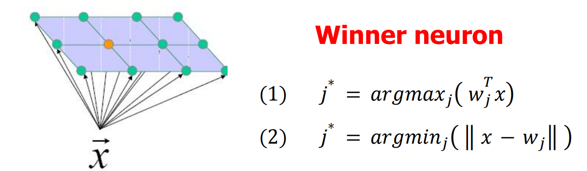

### 合作过程 (Cooperative Process) 

#### 概念

找到赢家后，SOM 不仅更新赢家，还引入了生物学中的“侧向相互作用”机制。合作定义了一个围绕赢家的“势力范围”（邻域）。

- **拓扑邻域 (Topological Neighborhood)：** 获胜神经元确定了一个拓扑邻域的中心 。
- **生物学原理：** 这一机制模仿了生物神经元的一个特性：一个正在放电（firing）的神经元倾向于**兴奋（excite）其直接邻域内的神经元**，且这种兴奋程度高于对远处神经元的影响 。
- **图示：** 幻灯片图显示了一个椭圆形的区域覆盖在赢家神经元（橙色点）周围，表示受影响的邻居范围 。

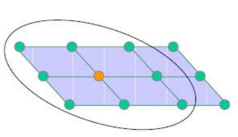

#### 邻域函数

量化邻域的形状和影响范围，通常使用高斯函数（Gaussian function）。

- **邻域函数特性 ($h_{j,i}$)：**

  - 以获胜神经元为中心是对称的。
  - 在获胜神经元处达到最大值。
  - 随着侧向距离（lateral distance）的增加，幅度单调递减。

- 数学公式：

  通常采用“墨西哥帽”形状或高斯函数形式：

  $$h_{j,i}=exp(-\frac{d_{j,i}^{2}}{2\sigma^{2}})$$

  其中 $d_{j,i}$ 是神经元 $j$ 和 $i$ 之间的距离，$\sigma$ 控制邻域的宽度。

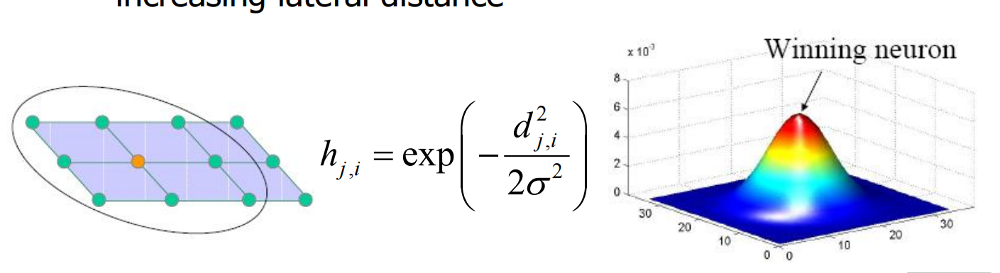

#### 时间依赖性

邻域随时间变化的方式，这是 SOM 收敛的关键。

- **随时间收缩 (Shrinks with time)：** 拓扑邻域 $h_{j,i}$ 的范围并不是固定的，而是随着时间 $t$ 推移逐渐收缩。

- **宽度衰减公式：**

  $$\sigma(t)=\sigma_{0}exp(-\frac{t}{\tau_{1}})$$

  这里 $\sigma(t)$ 随时间呈指数衰减。

- **完整的时变邻域函数：**

  $$h_{j,i}(t)=exp(-\frac{d_{j,i}^{2}}{2\sigma^{2}(t)})$$

- **重要意义：** 即使某些邻居神经元本身的权重与输入 $\vec{x}$ 并不接近，但只要它们在网格上位于赢家的邻域内，它们也会被**允许更新**。这正是 SOM 能够强行将相似特征拉到相邻位置的原因。

### Neighborhood

邻域大小必须随时间变化

#### 邻域大小的策略与权衡

这一页解释了在训练过程中调整邻域大小的重要性，这关乎模型最终的效果。

- **大小的权衡（Trade-off）：**
  - **大邻域（Large neighborhood）：** 能带来**良好的全局有序性（Good global ordering）** ，意味着地图的大致结构是正确的；但会导致**较差的局部拟合（Bad local fit）** ，细节不够精确。
  - **小邻域（Small neighborhood）：** 可能会导致**较差的全局有序性（Bad global ordering）** ，容易陷入混乱的局部布局；但能带来**良好的局部拟合（Good local fit）** 。
- **最佳策略：**
  - 为了兼得两者的优点，SOM 采用的策略是**逐渐收缩邻域（gradually shrinking the neighborhood）** 。
- **两个训练阶段：**
  - **排序阶段（Ordering phase）：** 训练初期使用**大邻域**，确立整体的拓扑结构 。
  - **收敛阶段（Convergence phase）：** 训练后期使用**小邻域**，对细节进行微调 。

#### 邻域的几何结构

通过图示展示了邻域在神经元网格上的具体形态。

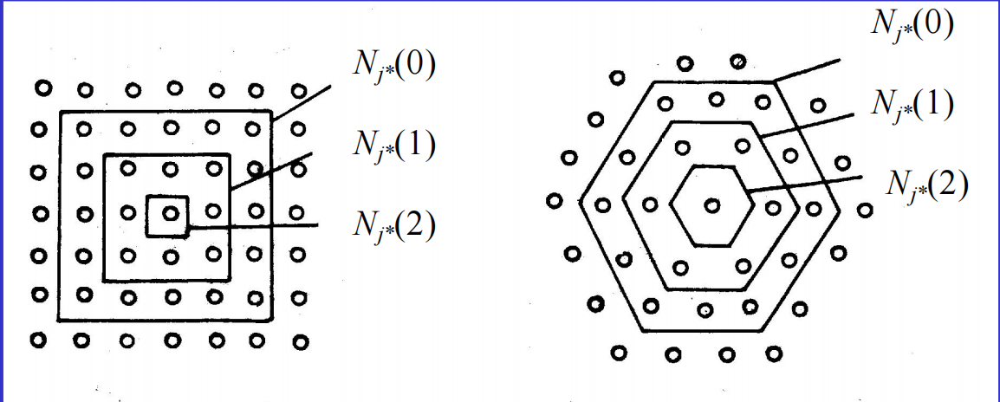

- **网格结构：**
  - 通常使用**平面阵列（planar array）**的神经元。
  - 邻域的形状通常是**矩形（rectangular）或图示中的六边形（hexagonal）**。
- **图示解析：**
  - 图中展示了一个六边形的网格结构。中心点是获胜神经元 $j^*$。
  - **$N_{j^*}(0)$：** 仅包含获胜神经元自己（中心的一个点）。
  - **$N_{j^*}(1)$：** 包含获胜神经元及其最直接的一圈邻居。
  - **$N_{j^*}(2)$：** 范围进一步扩大，包含更外层的一圈神经元。
  - 这直观地展示了当邻域半径扩大或缩小时，受影响的神经元范围是如何变化的。

### 自适应过程 (Adaptive Process)

神经元权重更新的数学公式，这是神经网络真正“学习”发生的时刻。

- 权重更新公式：

  根据输入与当前权重的差异来更新权重。公式如下：

  $$w_{j}(t+1)=w_{j}(t)+\eta(t)h_{j,i}(t)(x-w_{j}(t))$$

  这表示新的权重等于旧权重加上一个修正值。修正值由三部分决定：

  1. **输入差值 $(x-w_{j}(t))$：** 权重要向输入向量的方向移动。
  2. **学习率 $\eta(t)$：** 控制更新的步长。
  3. **邻域函数 $h_{j,i}(t)$：** 根据神经元 $j$ 与赢家神经元 $i$ 的距离来控制更新幅度（离得越近，更新越多）。

- **时间依赖性：**

  - **学习率 $\eta(t)$：** 随时间指数衰减，公式为 $\eta(t)=\eta_{0}exp(-\frac{t}{\tau_{1}})$ 。
  - **邻域函数 $h_{j,i}(t)$：** 同样随时间变化（如前文所述，范围逐渐缩小）。

### 学习率 (Learning Rate)

这一页探讨了学习率 $\eta(t)$ 随时间变化的不同策略。

- 衰减曲线图示：

  图表展示了学习率从初始值（例如 1）随时间 $t$ 逐渐下降到 0 的过程。不同的曲线代表不同的衰减速度。

  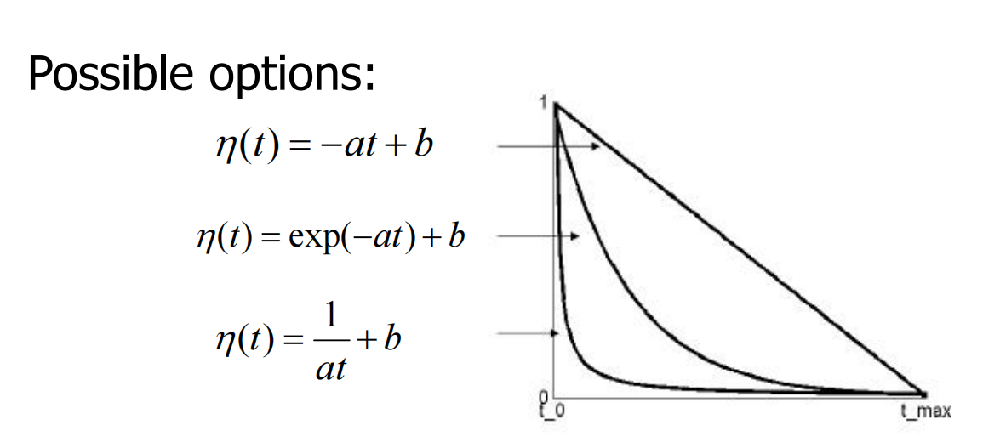

- 可能的函数选项：

  了三种常见的衰减函数形式：

  1. **线性衰减：** $\eta(t)=-at+b$。
  2. **指数衰减：** $\eta(t)=exp(-at)+b$（这是最常用的）。
  3. **反比例衰减：** $\eta(t)=\frac{1}{at}+b$。

  这意味着在训练初期，网络会有较大的改变（高学习率），随着时间推移，网络逐渐稳定，只进行微小的调整（低学习率）。

### 算法总结 (Summary)

这一页通过一个清晰的流程图总结了 SOM 的完整运作循环。

1. **初始化 (Initialization)：** 设置网格和随机权重。

2. **抽取输入样本 (Draw an input sample x)：** 从数据集中随机选取一个向量 $\vec{x}$。

3. 寻找赢家神经元 (Winner neuron $j^*$)：

   通过计算最大内积 $argmax_{j}(w_{j}^{T}x)$ 或最小欧几里得距离 $argmin_{j}(||x-w_{j}||)$ 来找到与输入最匹配的神经元。

4. 更新 (Update)：

   根据前述公式更新赢家及其邻居的权重：

   $w_{j}(t+1)=w_{j}(t)+\eta(t)h_{j,i}(t)(x-w_{j}(t))$。

   同时更新邻域函数和学习率参数。

5. **循环：** 更新完成后，回到第 2 步抽取下一个样本，直到满足停止条件。

### SOM 的特性 (Property of SOM)

这一页列举了自组织映射（SOM）算法训练完成后所具备的四个关键特性 ：

- **近似输入空间 (Approximate the input space)：** SOM 能够对复杂的输入数据分布进行近似表示 。
- **拓扑有序性 (Topological ordering)：** 保持了输入数据的拓扑结构，即在输入空间中相邻的数据点，在映射后的网格上也是相邻的。
- **密度匹配 (Density matching)：** 神经元的分布密度会自然地匹配输入数据的概率密度分布（数据密集的地方，神经元也更密集) 。
- **特征选择 (Feature selection)：** 能够从潜在的分布中提取出关键特征 。

## Recall

**SOM 实际上是一种特殊的矢量量化（VQ）。通过“赢家通吃”的机制，空间被划分为许多个由“码向量”（神经元权重）控制的 Voronoi 区域。**

### 无监督竞争学习 (Unsupervised Competitive Learning)

图示回顾了竞争学习的基本直觉，这也是 SOM 和接下来要讲的 VQ 的基础。

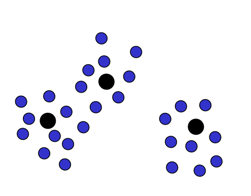

- **图示含义：** 图中蓝色的点代表数据样本，黑色的点代表原型向量（Prototype vectors）。
- **算法步骤回顾：**
  1. 初始化 $K$ 个原型向量。
  2. 呈现一个单独的输入样本。
  3. 识别出最近的原型，即所谓的“赢家” (Identify the closest prototype, i.e., the winner) 。
  4. 将赢家向该样本方向移动，使其更接近样本。
- **直观理解：**
  - 这是一个直观且合理的过程。
  - 这种方法会将原型向量放置在数据**密度较高**的区域。
  - 它能识别出最相关的特征组合。

### 回顾矢量量化 (Vector Quantization)与 Voronoi 图

这一页正式引入了矢量量化的几何解释，即 **Voronoi 图（泰森多边形）**。

- **图示对比：**
  - **左图 (Data)：** 原始的数据点分布 。
  - **右图 (Voronoi diagram)：** 空间被划分成了不同的区域。红点代表**码向量 (Code vectors)**，线条代表区域的边界 。
- **关键定义：**
  - **Voronoi 图 (Voronoi diagram)：** 是平面的一种划分。它是基于平面上特定的点集（种子点/码向量）的距离来进行划分的 。
  - **Voronoi 胞 (Voronoi cells)：** 对于每一个种子点，都有一个对应的区域。该区域内的所有点，到这个种子点的距离比到其他任何种子点的距离都要近 。
  - **编码区域 (Encoding region)：** 这些划分出的区域被称为编码区域或空间的划分 (Partition of the space) 。

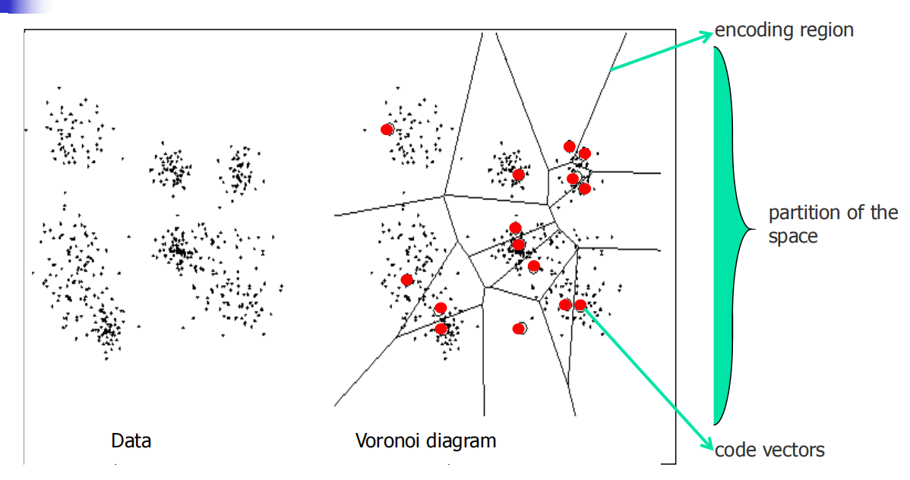

## LVQ

### 更多关于矢量量化 (More on Vector Quantization)

矢量量化中如何通过“距离”来划分空间。

- **Voronoi 中心：** 在 VQ 技术中，会形成许多局部的 Voronoi 中心来代表输入向量。

- **最佳匹配原则：**

  - 假设有一组 $M$ 个参考向量（Reference Vectors），表示为 $\{W_{1},...,W_{M}\}$。
  - 对于一个输入向量 $x$，如果它与某个参考向量 $w_{k}$ 的**失真度量（distortion measure）**最小，则认为 $x$ 与 $w_{k}$ 最匹配。
  - 最常用的度量标准是**欧几里得距离的平方**：$||x-w_{k}||^{2}$。

- **Voronoi 胞 (Voronoi Cells) 的定义：**

  - 参考向量将输入空间 $R^L$ 划分为多个 Voronoi 胞或多边形。

  - 数学定义： 一个区域 $V_{k}$ 包含所有距离 $w_{k}$ 比距离其他任何 $w_{l}$ 都要近的点 $x$。公式如下：

    $$V_{k}=\{x\in R^{L}\mid ||x-w_{k}||\le||x-w_{l}||,\forall l\}$$

### 矢量量化器与 SOM 的联系

引入“码书”的概念，并解释了 SOM 算法本质上是在做什么。

- **术语定义：**
  - **码书 (Codebook)：** 所有可能的参考向量的集合被称为量化器的“码书” 。
  - **码向量 (Code vectors)：** 码书中的成员（即那些参考向量）被称为“码向量” 。
- **SOM 的角色：**
  - SOM 算法提供了一种以**无监督（unsupervised）**方式计算 Voronoi 向量的近似方法 。
  - 它将输入空间划分为若干个不同的区域，并为每个区域定义一个重构向量（reconstruction vector）。
- **图示：** 图中展示了二维平面被虚线划分为不同的区域，蓝点代表数据，而在每个区域中心的点即为“码向量” 。

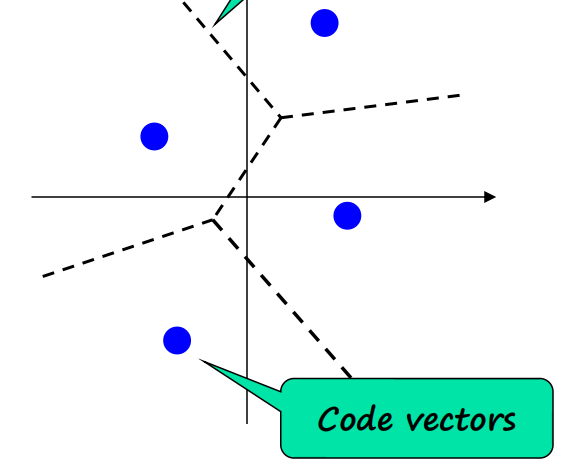

### 学习矢量量化 (Learning Vector Quantizer, LVQ)

从无监督学习向监督学习的转变。

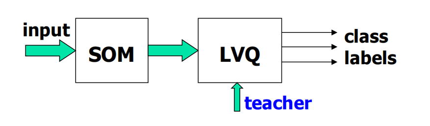

- **流程图：**
  - 输入数据首先经过 **SOM** 处理，然后进入 **LVQ** 模块，最后输出**类别标签（Class labels）** 。
  - 注意图中 LVQ 模块有一个额外的输入箭头来自 **"Teacher"（教师信号）**，这意味着需要提供正确的分类信息 。
- **LVQ 的定义：**
  - LVQ 是一种**监督学习（supervised learning）**技术 。
- **核心机制：**
  - 它利用类别信息（class information）来微调 Voronoi 向量的位置 。
  - **目的：** 改进分类器的决策区域质量，使得分类边界更加准确 。

### LVQ1 算法

最基础的监督学习更新规则的核心逻辑是“奖赏分对的，惩罚分错的”。

- **输入选择：** 从输入空间中随机选取一个输入向量 $x$。
- **更新规则：** 比较输入向量 $x$ 的真实类别标签与当前获胜的 Voronoi 向量 $w$ 的类别标签：
  - **情况 1（分类正确）：** 如果类别标签**一致（agree）**，则将 $w$ 向输入向量 $x$ 的方向**移动**（拉近距离）。
    - **公式：** $w^{new} = w^{old} + \eta(x - w)$ 。
  - **情况 2（分类错误）：** 如果类别标签**不一致（disagree）**，则将 $w$ 向**远离**输入向量 $x$ 的方向移动（推远距离）。
    - **公式：** $w^{new} = w^{old} - \eta(x - w)$ 。

### LVQ2 算法

LVQ2 是对 LVQ1 的改进，旨在更精细地调整类别的边界。

- **初始化：** 为不同的类别初始化原型向量 。
- **样本呈现：** 呈现一个单独的样本 。
- **双赢家机制：** 与 LVQ1 只看一个赢家不同，LVQ2 会同时识别两个关键的原型向量：
  - 最近的**正确（correct）**原型 。
  - 最近的**错误（wrong）**原型 。
- **移动规则：** 同时移动这两个获胜者，将对应的正确原型移向样本，将错误原型移离样本 。这种机制能够更有效地推挤决策边界，使其位于两类数据的最佳分界线上

### LVQ 讨论 (Discussion)

这一页总结了算法的工程落地细节及其评价。

- **停止条件 (Stopping criteria)：**
  - 码书向量已经**稳定（stabilized）**，不再发生显著变化 。
  - 或者达到了预设的**最大迭代次数（maximum number of epochs）** 。
- **优点 (Advantages)：**
  - 直观、看似合理且灵活（Appear plausible, intuitive, flexible）。
  - **快速**且**易于实现**（Fast and easy to implement）。
  - 被广泛应用于各种涉及结构化数据分类的问题中 。
- **缺点 (Disadvantages)：**
  - 对于**重叠的类别（overlapping classes）**，算法表现**不稳定（Not stable）** 。
  - 对**初始化非常敏感（Very sensitive to initialization）** 。如果初始位置选得不好，可能会导致最终效果很差。

LVQ 通过利用标签信息，不断拉近同类数据的中心，推远异类数据的中心，从而获得更好的分类边界。虽然它简单高效，但在处理复杂边界（如类别重叠）时需要小心初始化的选择。