# Associate Memories & Hopfield Network

## Introduction 初步介绍

1. **现状**：传统电脑内存依赖死板的“地址”。
2. **革新**：联想记忆依赖灵活的“内容”。
3. **优势**：这种机制允许我们在信息模糊、残缺或有噪声的情况下，依然能通过关联性准确地提取记忆。

### 传统计算机内存 (Memory in Computer System)

首先解释了当前我们要“超越”的传统技术是什么。

- **核心概念：基于地址访问** 标准的计算机内存（通常被称为 RAM，即随机存取存储器）是通过**分配的地址**（Assigned addresses）来进行访问的 。
- **工作原理** 当用户搜索一个文件时，CPU 必须执行一个转换过程：它将用户的请求转换为数值指令，然后在内存中搜索对应的**物理地址**来获取数据 。
- **局限性暗示** 这种方式非常机械化。如果你不知道数据的“位置”（地址），或者数据稍微有点损坏导致地址对不上，你就很难找到它。这为下一页引入更灵活的记忆方式做了铺垫。

------

### 联想记忆与模式关联 (Associative Memory & Pattern Association)

本课程的主题则展示了一种完全不同的记忆访问方式。

- **核心定义**：**联想记忆**是一种**基于内容寻址**（Content-addressable）的结构 。
- **映射机制**：它不是存储单一的数据点，而是将一组**输入模式**映射到一组**输出模式** 。
- **关键区别**：这是与上一页 RAM 最大的不同：内存可以直接通过**内容**本身来访问，而不再依赖于内存中的**物理地址** 。
  - *解读：* 就像人类记忆一样，你是通过看到一张脸（内容）想起一个人的名字，而不是通过去大脑的“第 3402 号神经元”去查找名字。

------

### 联想记忆的功能特性 (Associative Recall)

接下来进一步解释联想记忆是如何像人类大脑一样工作，特别是它处理“模式”（Pattern）的能力。

- **关联的方式**：联想记忆通常与**模式关联**（Pattern Association）联系在一起 。它可以通过以下几种逻辑建立连接：
  - **相似性 (Similar)**：看起来像的东西 。
  - **相反性 (Contrary)**：对立的东西 。
  - **空间邻近 (Spatial)**：在位置上靠得很近的东西 。
  - **时间连续 (Temporal)**：在时间上先后发生的东西 。
- **联想回忆的能力 (Associative Recall)**：这是联想记忆网络（如 Hopfield 网络）最强大的功能，它能够实现：
  - **唤起关联模式**：由一个概念联想到另一个概念 。
  - **部分回忆整体**：通过模式的一部分，回忆起完整的模式 。
  - **抗噪能力**：即使输入的信息是**不完整的**（Incomplete）或者包含**噪声**（Noisy），它依然能够唤起或回忆起正确的模式 。

## Associate Memory 联想记忆

### 联想记忆的分类 (Associative Memories - Types)

正式将联想记忆分为**两大类**，这是理解后续神经网络（如 Hopfield 网络）功能的基础：

- **自联想 (Auto-association)**
  - **定义**：提取出的模式与输入模式是**相同**的。
  - **功能**：它的主要作用是**纠错**或**补全**。当你输入一个残缺或有噪点的图案时，它能检索出存储在记忆中那个“最相似”的、完美的原始图案。
- **异联想 (Hetero-association)**
  - **定义**：提取出的模式与输入模式在内容、类型甚至格式上都**不同**。
  - **功能**：这是更广泛的“关联”。比如看到“苹果”这个词（文本），联想到“红色圆形水果”（图像）。输入和输出是两样东西，但它们之间建立了映射关系。

------

### 视觉示例 (Visual Example)

下图通过一个具体的视觉案例来展示联想记忆的工作流程：

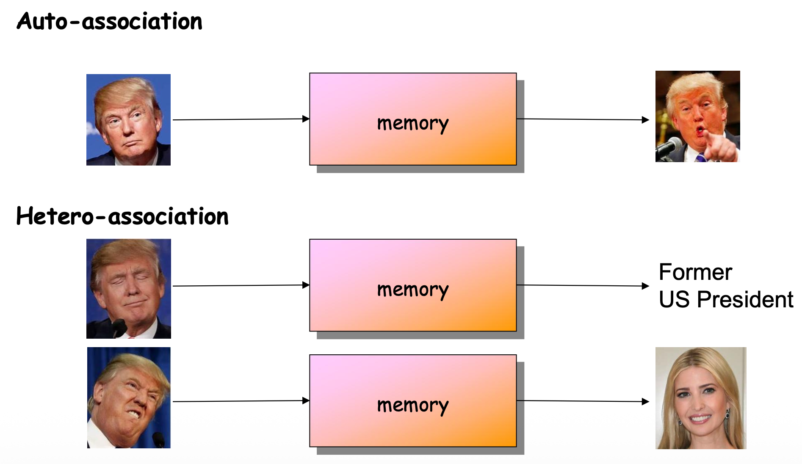

- Auto-association:

  - 左侧是输入（一张特朗普的照片），中间经过“Memory”（记忆系统），右侧是输出（另一张特朗普的照片，表情不同）。
  - 概念演示：

  虽然图片中的输入和输出都是特朗普（同一个人），但具体的图像像素并不相同。

  - 这可以用来解释**异联想**：输入一张平静的脸，联想到他演讲时的标志性表情。
  - 这里的文字标签 "Former US President" 暗示了记忆系统能够将图像与概念或相关联的其他状态联系起来。

- Hetero-association:

  - 仍然是在左侧输入一张特朗普的照片，但是此时右侧的输出不再是查找其他与特朗普相似的图片，而是变成了查找具有类似图片特征的图片或者信息。
    - 例如带有“美国总统”的信息
    - 或者金色头发，白色皮肤的人

------

### 数学形式化 (Mathematical Formulation)

将前面的文字概念转化为数学语言，这对于理解神经网络的算法至关重要：

- **存储模式 (Stored Patterns)**

  记忆被定义为一系列的输入输出对：$(x^1, y^1), (x^2, y^2), ... (x^p, y^p)$。

- **向量空间**

  - 输入向量 $x$ 属于 $n$ 维空间 ($R^n$)。
  - 输出向量 $y$ 属于 $m$ 维空间 ($R^m$)。

- **严格区分**

  - **自联想 (Autoassociative)**：当 $x^i \equiv y^i$ 时（即输入向量等于输出向量）。这意味着输入和输出的维度必须相同 ($n=m$)。
  - **异联想 (Heteroassociative)**：当 $x^i \neq y^i$ 时。此时输入和输出可以是完全不同维度的向量（例如，$x$ 是 100 维的图像，$y$ 是 5 维的分类标签）。

## 简单联想记忆 Simple AM

### 简单联想记忆的网络结构 (Simple AM - Network Structure)

介绍用于联想记忆的最基础神经网络架构。

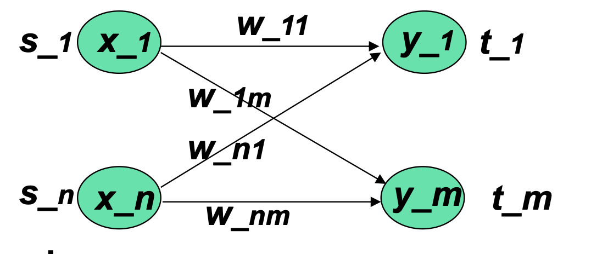

- **网络架构**：
  - 上图中是一个**单层 (single layer)** 网络。
  - 它包含一个输入层和一个由非线性单元组成的输出层。
  - 这与用于分类的简单网络结构非常相似。
- **连接方式**：
  - 输入节点（$S_1$ 到 $S_n$）通过权重矩阵（$W_{11}$ 到 $W_{nm}$）连接到输出节点（$y_1$ 到 $y_m$）。
- **学习目标**：
  - 目的是从一组训练模式对（Training pattern pairs）$\{s:t\}$ 中获得一组权重 $w_{ij}$。
  - 最终效果是：当向量 $s$ 被应用到输入层时，向量 $t$ 会在输出层被计算出来。

------

### 学习算法 (Learning Algorithm)

解释了如何计算权重，采用的是类似 Hebbian 的学习规则。

- **类比**：这种方法类似于用于分类的 Hebbian 学习。

- **适用模式**：适用于双极（Bipolar）或二进制（Binary）模式。

- **更新规则 (Delta Rule)**：

  - 对于每一个训练样本 $s:t$，权重的变化量 $\Delta w_{ij} = s_i \cdot t_j$。
  - 逻辑：如果输入和输出同时为 "ON"（二进制情况下）或者符号相同（双极情况下），权重 $\Delta w_{ij}$ 就会增加。

- **总权重计算**：

  - 如果初始权重 $\Delta w_{ij}=0$，那么在更新完所有 $P$ 个训练模式后，最终权重为：$w_{ij} = \sum_{p=1}^{P} s_i(p)t_j(p)$。

- **外积法**：

  - 除了迭代更新，权重矩阵 $W$ 也可以直接通过计算 $s$ 和 $t$ 的**外积 (Outer product)** 从训练集中一次性算出。

  - 外积 $W = s^T \otimes t$，其实就是个乘法表。不要被矩阵符号吓到。假设输入向量 $s$ 是 [1, -1]，输出向量 $t$ 是 [1, 1]。我们要算出所有连线的权重，只需要画个表格：

    | **⊗**          | **t1 (1)**                | **t2 (1)**                |
    | -------------- | ------------------------- | ------------------------- |
    | **$s_1$ (1)**  | $1\times1 = \mathbf{1}$   | $1\times1 = \mathbf{1}$   |
    | **$s_2$ (-1)** | $-1\times1 = \mathbf{-1}$ | $-1\times1 = \mathbf{-1}$ |

    表格里的这四个数字，就是这一对记忆留下的权重矩阵。如果有多个记忆，就把每次算出的表格数字**加**在一起 。

------

### 外积计算与算法实现 (Outer Product Calculation)

详细展示如何通过矩阵运算和编程循环来实现权重的计算。

- **外积定义**：
  - 假设 $s$ 和 $t$ 是行向量。
  - 对于特定的训练对，权重增量矩阵 $\Delta W(p)$ 等于 $s(p)$ 的转置乘以 $t(p)$，即 $s^T(p) \otimes t(p)$。
  - 这会产生一个矩阵，其中每个元素是输入分量与输出分量的乘积。
- **总权重矩阵公式**：
  - $W(P) = \sum_{p=1}^{P} s^T(p) \otimes t(p)$。
- **算法实现 (3层嵌套循环)**：
  - 这个计算涉及三个嵌套循环，其中 $P$（模式顺序）是无关紧要的：
    1. **第一层循环**：$p=1$ 到 $P$（遍历每一对训练样本）。
    2. **第二层循环**：$i=1$ 到 $n$（遍历权重矩阵 $W$ 的每一行）。
    3. **第三层循环**：$j=1$ 到 $m$（遍历行 $i$ 中的每一个元素 $j$）。
  - **更新操作**：$w_{ij} := w_{ij} + s_i(p) \cdot t_j(p)$ 21。

------

### 回忆与干扰分析 (Recall & Cross-talk)

这一页探讨了训练好的网络在回忆（Recall）阶段的表现，以及为什么它不总是成功的。

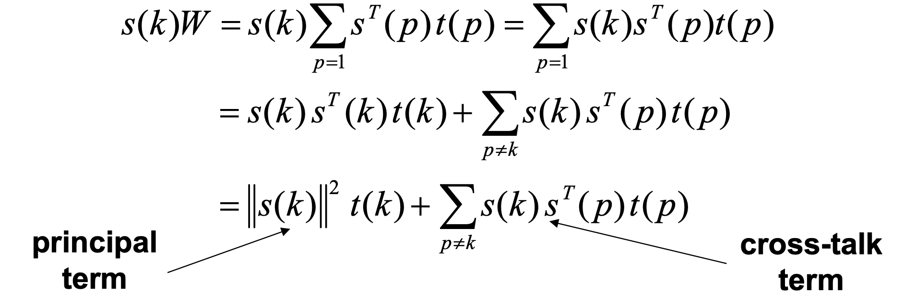

- **问题提出**：这种方法能提供良好的联想吗？

- **回忆过程**：

  - 在学习完权重后，将 $s(k)$ 应用到输入层，希望在另一层得到 $t(k)$。即期望 $f(s(k)W) = t(k)$。

- **潜在失败原因**：

  - 并不总是能成功，因为每一个权重都包含了来自**所有**样本的信息。

- **数学推导**：

  - 输入向量乘以权重矩阵的展开式为：
    $$
    s(k)W = s(k)\sum_{p=1}^{P}s^T(p)t(p) = \sum_{p=1}^{P}s(k)s^T(p)t(p)
    $$

  - 这个式子可以拆分为两部分：

    1. **主项 (Principal term)**：$s(k)s^T(k)t(k)$ 或 $||s(k)||^2 t(k)$。
    2. **串扰项 (Cross-talk term)**：$\sum_{p \neq k} s(k)s^T(p)t(p)$。

  - principal term 可以看作是主要信号

    - $s(k)$ 遇到了它自己在权重矩阵里留下的痕迹 ($s^T(k)$)。它们完美契合，就像钥匙插进了正确的锁孔，于是成功激活了对应的记忆 $t(k)$。

  - cross-talk term 可以看作是噪声。

    - $s(k)$ 不仅会激活它自己的记忆，还会不小心触碰到以前存储的其他记忆痕迹 ($s^T(p)$)。如果 $s(k)$ 和其他的记忆 $s(p)$ 长得很像（相关性高），这个噪音就会特别大。
    - **后果：** 如果噪音太大，盖过了朋友的声音，你就会“听错”，也就是提取出了错误的记忆

------

### 第 12 页：主项与串扰项的意义 (Principal Term vs. Cross-talk)

这一页深入分析了上一页推导出的两个数学项的物理意义，并指出了该方法的局限性。

- **项的含义**：
  - **主项**：给出了 $s(k)$ 和 $t(k)$ 之间的正确联想。
  - **串扰项**：代表了当前输入 $s(k)$ 与**其他**所有训练对 $t(k)$ 之间的相关性。
- **干扰的影响**：
  - 当串扰项很大时，$s(k)$ 会回忆起除了 $t(k)$ 以外的东西，导致联想失败。
- **正交性条件 (Orthogonality)**：
  - 如果所有的样本向量 $s(p)$ 彼此**正交 (orthogonal)**，那么对于 $p \neq k$，点积 $s(k)s^T(p) = 0$。
  - 在这种情况下，除了 $s(k):t(k)$ 以外，没有其他样本会干扰结果，串扰项为 0。也就是说，如果你存的每个记忆都**截然不同**（比如一个是全黑，一个是全白），它们就是“正交”的。
- **局限性**：
  - 在 $n$ 维空间中，最多只能有 $n$ 个相互正交的向量。
  - 随着存储的模式数量 $P$ 的增加，串扰 (Cross-talk) 也会增加。

### Example 1 hetero-associative

**任务目标**：我们要训练一个网络，输入一个 4 位的信号（$s$），它能告诉我们这属于哪一类（$t$，2位输出）。

- **输入 $s$**：$|s|=4$ (4维向量)
- **输出 $t$**：$|t|=2$ (2维向量)

#### 第一步：训练数据与“外积”构建 (Building the Brain)

幻灯片 13 页给出了 4 个训练样本：

1. **样本 1 & 2**：输入 `(1 0 0 0)` 和 `(1 1 0 0)`。它们对应类别 **A `(1, 0)`**。
   - *特征*：只要**前两位**有 1，就倾向于类别 A。
2. **样本 3 & 4**：输入 `(0 0 0 1)` 和 `(0 0 1 1)`。它们对应类别 **B `(0, 1)`**。
   - *特征*：只要**后两位**有 1，就倾向于类别 B。

权重的计算公式是所有训练样本的外积之和：

$$W = \sum_{p=1}^{P} s^T(p) \cdot t(p)$$

让我们手动算一下**样本 1** 的外积（$4 \times 1$ 向量 乘以 $1 \times 2$ 向量）：

$$\begin{pmatrix} 1 \\ 0 \\ 0 \\ 0 \end{pmatrix} \otimes (1, 0) = \begin{pmatrix} 1\times1 & 1\times0 \\ 0\times1 & 0\times0 \\ 0\times1 & 0\times0 \\ 0\times1 & 0\times0 \end{pmatrix} = \begin{pmatrix} 1 & 0 \\ 0 & 0 \\ 0 & 0 \\ 0 & 0 \end{pmatrix}$$

这说明：输入的第一位和输出的第一位建立了**强连接**。

我们将 4 个样本算出的矩阵全部加在一起，得到了幻灯片 14 页的**最终权重矩阵 $W$**：

$$W = \begin{pmatrix} 2 & 0 \\ 1 & 0 \\ 0 & 1 \\ 0 & 2 \end{pmatrix}$$

**这个矩阵的物理含义（生动版）：**

- **第 1 行 `(2, 0)`**：如果输入第 1 位是 1，它会给输出的第 1 位投 2 票（强力支持），给第 2 位投 0 票（无关）。
- **第 4 行 `(0, 2)`**：如果输入第 4 位是 1，它会给输出的第 2 位投 2 票（强力支持）。

#### 第二步：实际测试 (The Test)

我们用公式 $y = x \cdot W$ 来测试，并且有一个激活规则：**结果 > 0 才是 1，否则是 0**。

1. **原题重现**：输入 $x = (1, 0, 0, 0)$

   $$(1, 0, 0, 0) \cdot \begin{pmatrix} 2 & 0 \\ 1 & 0 \\ 0 & 1 \\ 0 & 2 \end{pmatrix} = (1\times2 + 0 + 0 + 0, \quad 1\times0 + 0 + 0 + 0) = (2, 0)$$

   **激活后**：$(1, 0)$。**回答正确**。

2. 举一反三 (泛化)：输入 $x = (0, 1, 0, 0)$

   这个样本没见过。但它和样本 2 很像（第 2 位是 1）。

   $$(0, 1, 0, 0) \cdot W = (1, 0) \quad (\text{因为矩阵第2行是 } 1, 0)$$

   激活后：$(1, 0)$。

   含义：网络学会了——“虽然没见过你，但你第 2 位有东西，这通常是类别 A 的特征。”

3. **混淆 (Ambiguity)**：输入 $x = (0, 1, 1, 0)$

   - 第 2 位是 1 $\rightarrow$ 矩阵第 2 行贡献 `(1, 0)`。
   - 第 3 位是 1 $\rightarrow$ 矩阵第 3 行贡献 `(0, 1)`。

   $$\text{加起来} = (1, 1)$$

   激活后：$(1, 1)$。

   **含义**：网络困惑了，“你既像 A 又像 B”。因为这个输入本身就不够清晰。

### Example 2：自联想 (Auto-associative)

**任务目标**：网络只存了一个完美的记忆 $s = (1, 1, 1, -1)$。我们要看它能不能把损坏的数据修好。

- 注意：这里使用的是**双极模式 (Bipolar)**，即 1 和 -1，而不是 0。

#### 第一步：构建矩阵

因为输入=输出，外积公式变成了 $W = s^T \cdot s$。

$$\begin{pmatrix} 1 \\ 1 \\ 1 \\ -1 \end{pmatrix} \cdot (1, 1, 1, -1) = \begin{pmatrix} 1 & 1 & 1 & -1 \\ 1 & 1 & 1 & -1 \\ 1 & 1 & 1 & -1 \\ -1 & -1 & -1 & 1 \end{pmatrix}$$

这就是幻灯片 16 页那个满屏的矩阵 7。它的意思是：这 4 个位置的数值是**高度同步**的。

#### 第二步：修复测试 (The Repair)

假设输入一个有噪点的向量 $x' = (-1, 1, 1, -1)$。

注意：第 1 位应该是 1，但这里错成了 -1。

我们看看网络怎么用**“少数服从多数”**的原理把它修好：

$$x' \cdot W = (-1, 1, 1, -1) \cdot \text{矩阵}$$

我们只算结果向量的**第一个分量**（看看能不能把那个错误的 -1 纠正过来）：

- 输入第 1 位 (-1) $\times$ 权重第 1 列第 1 行 (1) = -1
- 输入第 2 位 (1) $\times$ 权重第 1 列第 2 行 (1) = +1
- 输入第 3 位 (1) $\times$ 权重第 1 列第 3 行 (1) = +1
- 输入第 4 位 (-1) $\times$ 权重第 1 列第 4 行 (-1) = +1
- **总和**：$-1 + 1 + 1 + 1 = 2$。

结果：$(2, 2, 2, -2)$。

激活后：$(1, 1, 1, -1)$。

奇迹发生了：虽然第 1 位输入是错的 (-1)，但因为其他 3 位是对的，它们通过权重的力量把第 1 位的得分拉回了正数 (2)。这就是去噪。

------

#### 关键反转：为什么第 17 页说这样不行？(The Diagonal Problem)

幻灯片 17 页抛出了一个非常深刻的问题。

上面的例子之所以成功，是因为我们只存了 1 个记忆。

如果我们存了 **$P$ 个记忆**（$P$ 很大），权重矩阵 $W$ 会变成所有记忆外积的总和。

$$w_{ii} = \sum_{p=1}^{P} s_i(p) \cdot s_i(p) = \sum_{p=1}^{P} 1 = P$$

注意：因为 $s_i$ 要么是 1 要么是 -1，它的平方永远是 1。

所以，对角线上的元素 $w_{ii}$ 会变得非常大，数值等于记忆的数量 $P$。

这有什么坏处？

如果对角线元素太大，矩阵 $W$ 就会变得像一个单位矩阵 $I$（对角线是 $P$，其他地方相对较小）。

回忆公式就变成了：

$$\text{输出} \approx \text{输入} \times P$$

这叫**“回声室效应”。

如果你输入一个错误的向量，网络因为对角线权重太大（自己听自己的），会直接输出那个错误的向量。

“修复功能”失效了**。

#### 解决方法：$w_{ii} = 0$

为了恢复修复功能，我们强制把对角线设为 0（如幻灯片 17 页那个中间有 0 的矩阵 $W''$)。

让我们验证一下这是否有效（用刚才那个错误的输入）：

输入 $x' = (-1, 1, 1, -1)$，乘以去掉了对角线的矩阵 $W''$。

还是算第一个分量：

- 输入第 1 位 (-1) $\times$ **0** (对角线被删了) = 0  <-- **关键！错误的输入不再自我强化了！**
- 输入第 2 位 (1) $\times$ 1 = 1
- 输入第 3 位 (1) $\times$ 1 = 1
- 输入第 4 位 (-1) $\times$ -1 = 1
- **总和**：3。

结果向量是 $(3, 1, 1, -1)$。

激活后：$(1, 1, 1, -1)$。

结论：即使去掉了对角线，它依然能修复错误。而且因为去掉了“错误的自我强化”，它在记忆很多时表现更好。这就是为什么 Hopfield 网络规定 $w_{ii}=0$ 的原因。

## The Hopfield Network

### 什么是 Hopfield 网络？

**物理学家的视角**

1982年，加州理工的物理学家 John Hopfield 提出了这个模型。

他最大的贡献不是发明了神经网络，而是引入了物理学的概念：

- **动力系统 (Dynamic System)**：网络不是静止的，它是随着时间不断变化的。
- **能量函数 (Energy Function)**：网络的运行就像物体寻找最低能量点一样，最终会停在某个**“吸引子” (Attractor)** 上。

**离散模型 (Discrete Model)**

为了简化计算，我们关注的是**离散版本**：

- **非黑即白**：神经元的状态只有两个，**1 或 -1**。
- **硬门槛**：使用符号函数 ($sgn$)，超过 0 就是 1，否则就是 -1。

### Discrete Hopfield Network

#### 网络架构

- **单层全连接**：这里没有“输入层”和“输出层”的区别。**每个节点既是输入，也是输出**。
- **所有人都连着所有人**：每个神经元都接收来自其他所有神经元的信号。

**公式的物理意义**

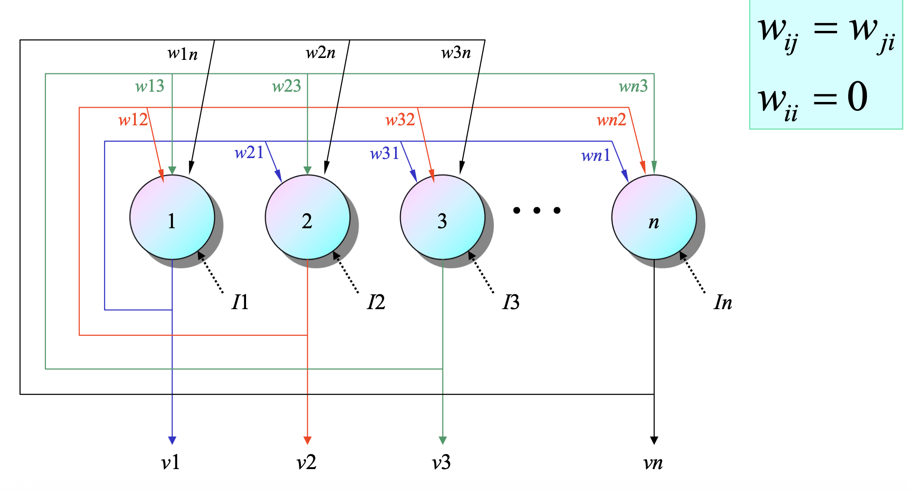

Hopfield 网络能工作的关键在于权重的设置规则：

1. 对称权重 (Symmetric Weights)：

   $$w_{ij} = w_{ji}$$

   含义：我对你的影响力，必须等于你对我的影响力。

   **作用**：在数学上，这是保证网络**能量不断下降**、最终能够停下来（收敛）的关键条件。如果不对称，网络可能会陷入无限循环的混乱。

2. 零对角线 (Zero Diagonal)：

   $$w_{ii} = 0$$

   含义：我不听我自己的意见。

   作用：这保证了系统的状态变化是由群体决定的，防止个体陷入自我强化的死循环（正如我们在 Simple AM 中看到的“回声室效应”）。

#### 阶段一：存储 (Storage) —— 建立规则（第 22 页）

展示了网络如何“记住”东西。

公式：

$$w_{ij} = \frac{1}{N} \sum_{p=1}^{P} x_i^p x_j^p$$

- **$N$**：神经元的总数（归一化因子）。
- **$x_i^p x_j^p$**：这依然是 **Hebbian Learning**（赫布规则）。如果两个神经元在某个模式下状态相同（都是 1 或都是 -1），乘积为正，权重增加；否则权重减少。

生动理解：

这就好比我们在建立这个社交圈的“默契”。如果两个人总是同时赞同或同时反对某件事，他们之间的连接（权重）就变强。这个权重矩阵 $W$ 包含了所有的记忆。

#### 阶段二：回忆 (Recall) —— 动态演化（第 23-25 页）

这是 Hopfield 网络最迷人的地方。当你给网络一个**残缺的输入**（比如半张脸的图片），它是如何把剩下的补全的？

**1. 递归更新 (The Loop)**

幻灯片 23 页指出，这是一个递归 (Recursion) 过程。

每个神经元 $i$ 在时间 $t$ 的状态 $v_i(t)$ 由它在上一时刻 $t-1$ 收到的邻居信号决定：

$$v_i(t) = sgn\left( \sum_{j=1}^{N} w_{ij} v_j(t-1) \right)$$

生动解释：

想象你在一个派对上。你不知道该不该举手（1 或 -1）。

于是你看看周围的朋友（$v_j$）：

- 如果你的铁哥们（$w_{ij}$ 为正）举手了，你也倾向于举手。
- 如果你的死对头（$w_{ij}$ 为负）举手了，你就倾向于放下手。
- 你会综合**所有**朋友的意见（求和 $\sum$），最后决定自己的状态。

**2. 异步更新 (Asynchronous Mode)**

接下来又提到了一个重要的细节：**随机选择单元进行更新**。

- **同步更新**：所有人同时改变状态。这可能导致震荡（大家同时变卦，乱套了）。

- **异步更新**：每次随机挑**一个**人，让他根据当前大家的状态更新自己。然后挑下一个人。

- 公式包含偏置：幻灯片 25 页的公式加入了一个外部偏置 $I_i$（比如初始的图像输入）：

  $$H_i(t+1) = \sum_{j=1}^{n} w_{ij} v_j(t) + I_i$$

  这意味着你的决定不仅取决于朋友的意见（$\sum$），还取决于你最初看到的线索（$I_i$）。

#### 五、 最终结局：稳定状态 (Stable State)

这个互相影响的过程会一直持续下去吗？

- **稳定状态**：幻灯片 24 页指出，经过多次迭代，网络会达到一个状态，所有的神经元都不再改变了。这就叫**收敛 (Converging)** 
- **吸引子 (Attractor)**：这个稳定的状态，通常就是我们要它记住的**原始模式**。
  - 即使你一开始给的是“很多噪点”的输入，网络也会像一颗滚落山谷的球，被权重的引力“吸”回这个完美的记忆状态。
  - 这就是为什么 Hopfield 网络常用于**图像修复**或**去噪**。

#### Example

一、 游戏设置 (Setup) 

1. **记忆模式**：这个小组只记住了两种极端情况：
   - **全员赞成**：`(1, 1, 1, 1)`
   - **全员反对**：`(-1, -1, -1, -1)`
2. **规则 (权重)**：
   - $w_{ij} = 1$：这表示所有人都是“铁哥们”，只要别人赞成，我也倾向于赞成；别人反对，我也倾向于反对。
3. **初始状态**：我们会给小组一个**混乱的**初始意见（Input），看他们怎么通过互相“商量”（更新），最后达成一致。

------

二、 案例 1：纠正小错误 (Corrupted Input) 

**初始意见**：`(1, 1, 1, -1)`

- 前 3 个人赞成 (1)，第 4 个人反对 (-1)。
- 这显然是一个“全员赞成”的局面，只是第 4 个人搞错了。我们看网络怎么修正他。

**第 1 步：更新节点 2**

- **节点 2** 看看周围的朋友（节点 1, 3, 4）：
  - 朋友 1 说：1
  - 朋友 3 说：1
  - 朋友 4 说：-1
  - **外部偏置 ($I_2$)**：自己一开始也是 1。
- **计算**：$1 + 1 - 1 + 1 = 2$。
- **结果**：$2 > 0$，所以节点 2 决定**保持赞成 (1)**。状态不变。

**第 2 步：更新节点 4**

- **节点 4** (那个唱反调的) 看看周围的朋友（节点 1, 2, 3）：
  - 朋友 1 说：1
  - 朋友 2 说：1
  - 朋友 3 说：1
- **计算**：$1 + 1 + 1$ (朋友的压力) $+ (-1)$ (自己的顽固偏置) $= 2$。
- **结果**：$2 > 0$，节点 4 扛不住“群众的压力”，决定**改为赞成 (1)**。
- **新状态**：`(1, 1, 1, 1)`。

**结论**：错误被修复了，小组达成“全员赞成”。

------

三、 案例 2：左右为难 (Equal Distance)

**初始意见**：`(1, 1, -1, -1)`

- 一半人赞成，一半人反对。这就尴尬了，网络该往哪边倒？这就好比站在山脊上，往左往右都有可能。

**第 1 步：更新节点 2**

- 朋友们 (1, 3, 4) 的意见是：$1, -1, -1$。
- 计算：$1 + (-1) + (-1) + 1(\text{自己}) = 0$。
- **规则**：Hopfield 网络规定，如果是 0，取正值 1。
- **结果**：节点 2 保持 **1**。

**第 2 步：更新节点 3**

- 朋友们 (1, 2, 4) 的意见是：$1, 1, -1$。
- 计算：$1 + 1 + (-1) + (-1)(\text{自己}) = 0$。
- **结果**：还是 0。根据规则，**变身为 1**。
- **关键转折**：现在的状态变成了 `(1, 1, 1, -1)`。平衡被打破了！赞成派占了上风。

**第 3 步：更新节点**

- 面对 3 个赞成的大趋势，节点 4 最终也只能变成 **1**。
- **最终状态**：`(1, 1, 1, 1)`。

注意：幻灯片特别提到，“如果更新顺序不同，可能就会回忆起全员反对 (-1 -1 -1 -1)”。

这说明在边界模糊时，谁先发言（先更新哪个节点）可能决定了最终的结局。

------

四、 案例 3：信息缺失 (Missing Input)

**初始意见**：`(1, 0, -1, -1)`

- 这里有个 **0**，代表“弃权”或“不知道”。

**第 1 步：更新节点 2 (那个弃权的)**

- 看看周围：$1, -1, -1$。反对派比较多。
- 计算：$1 - 1 - 1 + 0 = -1$。
- **结果**：小于 0，节点 2 决定加入**反对派 (-1)**。
- **当前状态**：`(1, -1, -1, -1)`。反对派现在是绝对多数。

**第 2 步：更新节点 1 (唯一的赞成派)**

- 看看周围：全是 -1。
- 计算：$-1 - 1 - 1 + 1 = -2$。
- **结果**：节点 1 也叛变了，变成 **-1**。
- **最终状态**：`(-1, -1, -1, -1)`。

------

五、记忆的陷阱 —— “伪吸引子”

在上面的 4 节点例子中，我们看到了网络能够修复错误。接下来给出的是一个极端的例子：

- **输入**：`(0 0 0 -1)`。前三个都不知道，只知道最后一个人投了反对票 (-1) 。
- **结果**：网络迅速收敛到了 `(-1 -1 -1 -1)` 。
- **为什么？** 因为这个网络只有两个**吸引子 (Attractors)**：全 1 和 全 -1 。只要有一点点线索指向 -1，它就会滑向那个坑。

六、 总结

这几个例子展示了 Hopfield 网络的核心能力：

1. **容错性**：有一两个错不要紧，会被邻居带回来。
2. **补全能力**：不知道的地方（0），会根据大趋势补上。
3. **吸引子 (Attractor)**：网络最终会掉进一个“坑”里（稳定的记忆状态）。在这个简单的例子里，只有两个坑：全 1 或全 -1。
4. **伪吸引子**：如果记忆存得太多，可能会出现**伪吸引子 (Spurious Attractors)**，也就是网络“脑补”出了一个根本不存在的记忆，导致回忆错误。

#### More Example

##### 20x20 的图像世界

从这里开始，我们不再玩 4 个节点的玩具了，我们升级到一个 **20 x 20** 的网格系统。

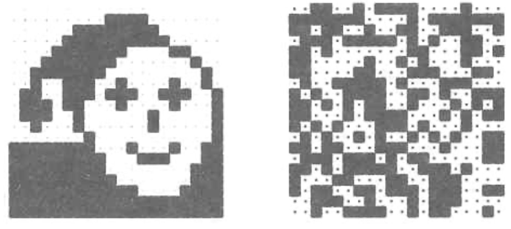

**1. 实验设置**

- **神经元数量**：$20 \times 20 = 400$ 个节点。每个像素点就是一个神经元（黑=1，白=-1，或者反过来）。
- **记忆容量**：我们在网络里存了 **20 张图片**。
  1. **目标图片**：一张像素化的**笑脸**（左图）。
  2. **干扰图片**：19 张完全随机的噪点图（右图）。

**我们的目标**：看看在混杂了 19 个无意义干扰项的情况下，网络还能不能精准地把那是唯一的“笑脸”给找出来。

##### 考古修复 —— 从碎片到整体

这一页展示了 Hopfield 网络最强悍的功能：**根据局部信息还原整体 (Pattern Completion)**。

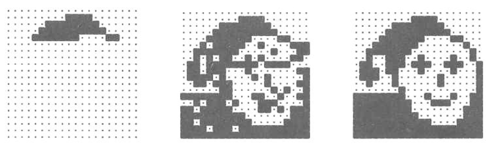

**1. 测试输入**

看最上面的那张图，我们只给网络看了**大约 1/4 的图像**（只有笑脸的额头和一点点眼睛，下面全是空白)。

- **生动比喻**：这就像考古学家只挖出了半个瓷碗的碎片。

**2. 修复过程**

- **迭代 0 (Initial)**：输入碎片。
- **迭代 1**：神经元开始根据权重互相“商量”。额头部分的神经元会告诉下面的神经元：“嘿，根据记忆，如果我是额头，那你应该是眼睛！”于是下面的像素开始显现。
- **迭代 2 (Final)**：仅仅经过两步迭代，**完整的笑脸**被完美重建了。

**结论**：只要关键特征（Key Features）存在，Hopfield 网络就能顺藤摸瓜，把丢失的信息全部找回来。

##### 去噪测试 —— 从混乱中寻找秩序

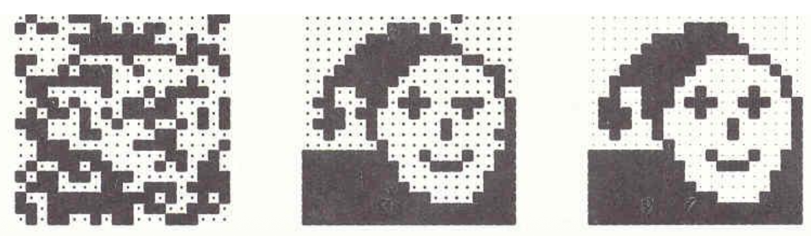

这一页展示了另一种能力：**抗噪性 (Noise Tolerance)**。

**1. 测试输入**

这次我们给的是一张完整的笑脸，但是我们故意搞破坏：

- **噪声强度 $p=0.3$**：意味着我们随机翻转了 **30%** 的像素点（把黑变白，白变黑)。
- 看最上面的图，笑脸已经变得像电视雪花一样模糊，甚至有点难辨认了。

**2. 修复过程**

- 网络开始运转。虽然有 30% 的像素在“撒谎”（噪声），但剩下的 70% 的像素是诚实的。
- 由于 Hopfield 网络的机制是“少数服从多数”（加权求和），那 70% 的诚实像素产生的**合力**（Signal），压倒了 30% 的噪声（Noise）。
- **结果**：仅仅经过两步，噪声被完全滤除，**完美的笑脸**再次出现

##### Hopfield失败案例

**1. 实验设置：量变引起质变**

我们在上一页看到，当噪声是 30% ($p=0.3$) 时，网络还能轻松搞定。

但在这一页，我们仅仅把噪声稍微提高了一点点，变成了 40% ($p=0.4$) 。

- **直观感受**：看最上面的输入图，现在的画面已经几乎全是杂讯，原来“笑脸”的特征已经被淹没得只剩一点点影子了。

**2. 实验结果：指鹿为马**

网络开始运转，试图修复这张图。

- **期待**：我们要它变回笑脸。
- **现实**：经过迭代后，它输出了一张**毫无意义的杂乱图案**（看下面那张结果图）。
- **发生了什么？** 幻灯片解释说，它并没有停在半路，而是**收敛到了那 19 个随机模式中的某一个**。

**3. 生动解读：为什么会失败？**

为了理解这个失败，我们要引入**“吸引力盆地” (Basin of Attraction)** 的概念，把这想象成**“高尔夫球坑”**。

- 地形设置：

  在这个 20x20 的网络世界里，我们在地上挖了 20 个坑（记忆）。

  - 其中 1 个坑是**“笑脸”**。
  - 另外 19 个坑是**“随机噪声图”**（我们在第 28 页存进去的干扰项）。

- 30% 噪声时 (上一页)：

  球虽然被打偏了，但它还停留在“笑脸坑”的边缘斜坡上。只要一松手（迭代），重力就会把它拉回“笑脸坑”底。

- 40% 噪声时 (这一页)：

  球被打得太偏了！它翻过了山脊，滚进了隔壁的坑里（那 19 个随机图案之一）。

  一旦球滚进了别人的地盘，Hopfield 网络的引力机制就会加速把它拉向错误的终点。

### Continue of Discrete Hopfield Network

首先，我们要在这个只有 3 个神经元的世界里画地图。

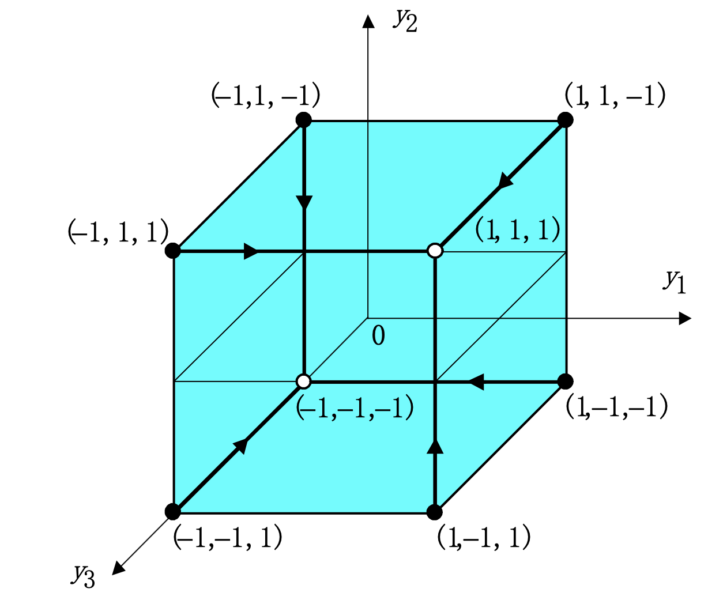

- 因为有 3 个神经元，每个神经元只有两种状态（1 或 -1），所以总共有 $2^3 = 8$ 种可能的状态。
- 幻灯片用一个**立方体 (Cube)** 来展示这 8 种状态 。立方体的每一个**顶点 (Corner)** 代表一种状态，比如 $(1, 1, 1)$ 或 $(-1, 1, -1)$。

**我们的目标**：在这个地图上挖两个“坑”（吸引子），让任何掉在附近的球都能滚进坑里

在开始之前，我们要在这个网络里存储**两个截然相反的记忆** 2：

1. **记忆 A（全员赞成）**：$Y_1 = (1, 1, 1)^T$
2. **记忆 B（全员反对）**：$Y_2 = (-1, -1, -1)^T$

只要我们把这两个模式存进去，无论初始状态是什么，网络最终应该停在这两个顶点上。

#### 建造引力场 (Building the Weights)

**我们该如何设置权重，才能制造出这两个“坑”？**

幻灯片使用了一个标准的权重计算公式：

$$W = \sum_{k=1}^{P} x^k (x^k)^T - P \cdot I$$

**让我们一步步拆解这个公式的物理含义：**

1. $\sum x^k (x^k)^T$（外积求和）：

   这是我们在前面学过的“叠加记忆”。

   - 对于记忆 A $(1, 1, 1)$：大家都是 1，两两相乘全是 1。矩阵全是 1。
   - 对于记忆 B $(-1, -1, -1)$：大家都是 -1，负负得正，两两相乘也全是 1。矩阵也全是 1。
   - **叠加**：两个矩阵相加，现在每个位置的数值都是 **2**。

2. $- P \cdot I$（切断自恋）：

   这里 $P=2$（存了两个模式），$I$ 是单位矩阵。

   这一步就是强制把对角线减掉。

   - 原来对角线是 2，减去 2，变成了 **0**。
   - 这就满足了 Hopfield 网络的铁律：$w_{ii}=0$。

最终的权重矩阵 $W$：

$$W = \begin{pmatrix} 0 & 2 & 2 \\ 2 & 0 & 2 \\ 2 & 2 & 0 \end{pmatrix}$$

**生动解读这个矩阵**：

- **0**：自己不听自己的。
- **2**：每个人都极度听从别人的意见（正相关）。因为我们要存的两个记忆无论是全 1 还是全 -1，大家的意见都是**高度一致**的。所以权重全是正的 2，意味着“你要么跟我一起举手，要么跟我一起放下”。

#### 稳定性测试 (The Stability Check)

现在坑挖好了，我们把球（记忆 A）放进去，看它会不会动。

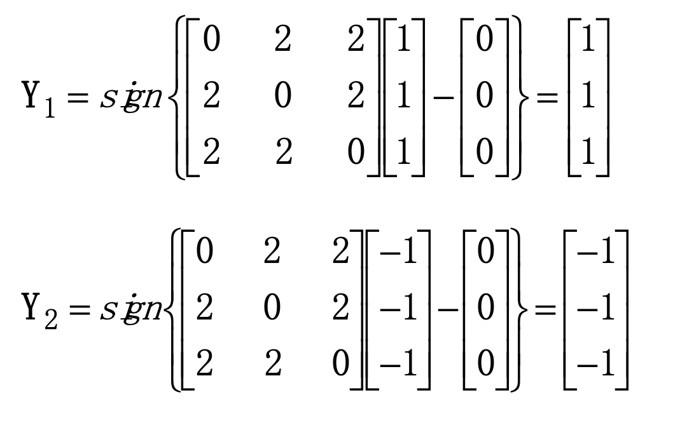

公式：$Y = sgn(W \cdot X - \text{阈值})$ (这里阈值设为 0)

- **输入**：$X = (1, 1, 1)^T$

- 计算第一个神经元：

  它收到神经元 2 的信号 ($1 \times 2$) + 神经元 3 的信号 ($1 \times 2$) = 4。

  $4 > 0$，所以输出 1。

- 同理，神经元 2 和 3 的输入也都为 4，输出也都为 1。

结果：$Y = (1, 1, 1)^T$。

结论：输入是 $(1, 1, 1)$，输出也是 $(1, 1, 1)$。球稳稳地停在了坑底，这是一个稳定状态 (Stable State)。

同样地，如果你输入 $(-1, -1, -1)$，计算结果全是 -4，激活后全是 -1。它也是稳定的。

#### 引力陷阱 (The Error Correction)

这一页展示了 Hopfield 网络真正的魔力：**它不仅能记住，还能把跑偏的人拉回来。**

立方体上除了那 2 个稳定顶点，还有 6 个不稳定顶点。

幻灯片指出：稳定状态（基忆）会吸引那些靠近它的不稳定状态。

让我们看一个“纠错”的例子：假设输入是 $(-1, 1, 1)$。这是一个“错误的记忆 A”。第一个人搞错了（变成了 -1），其他人是对的 (1, 1)。这被称为 1-bit error。

网络如何运作？

让我们看看第 1 个神经元（那个犯错的家伙）会发生什么：

- 它看看邻居 2（状态 1，权重 2） $\rightarrow$ 收到信号 +2。
- 它看看邻居 3（状态 1，权重 2） $\rightarrow$ 收到信号 +2。
- **总输入**：$2 + 2 = 4$。
- **激活**：$4 > 0$，所以输出变为 **1**。

奇迹发生了！

虽然它自己一开始是 -1，但因为两个邻居都在喊“是 1！”，在这股强大的社会压力（权重）下，它被迫改正了错误，变成了 1。

状态从 $(-1, 1, 1)$ 瞬间变成了 $(1, 1, 1)$。

#### 阶段总结

以上的流程通过一个极简的 3D 模型告诉我们：

1. **构造**：通过权重矩阵，我们在 8 个可能的顶点中指定了 2 个作为“家”（稳定点）。
2. **吸引**：只要你离家只有一步之遥（1 位错误），强大的权重就会把你强行拉回家。
3. **本质**：这就是为什么幻灯片最后一句说——**Hopfield 网络可以充当一个纠错网络 (Error Correction Network)**。

### Summary Example

#### 第一部分：硬核计算 —— 亲手造大脑（第 37 页）

这一页没有新的理论，而是一个**纯数学演示**。它手把手教你如何用公式算出那个神奇的权重矩阵 $W$。

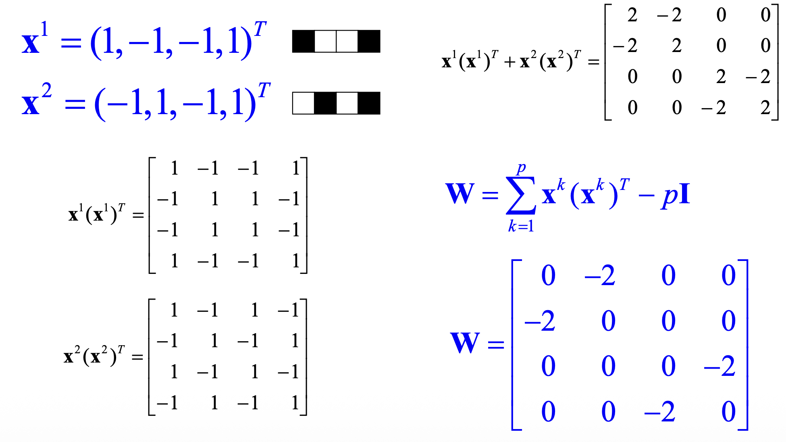

1. 准备材料 (记忆模式): 我们要存两个 4 维向量：

   - $x^1 = (1, -1, -1, 1)^T$

   - $x^2 = (-1, 1, -1, 1)^T$

2. 第一步：自我增殖 (外积)我们要算出每个记忆的“特征矩阵” ($x \cdot x^T$)。

   - 你看幻灯片中间那两个矩阵。

   - 比如对于 $x^1$：第 1 个元素是 1，第 2 个是 -1。所以矩阵第 1 行第 2 列就是 $1 \times (-1) = -1$。

   - 以此类推，算出了两个 $4 \times 4$ 的矩阵。

3. 第二步：记忆叠加: 把这两个矩阵加起来。

   - 得到中间那个矩阵：对角线全是 2（因为两个模式的自己乘自己都是 1，1+1=2）。

4. 第三步：切断自恋 (关键！): 

   - 公式：$W = \text{Sum} - P \cdot I$。

   - 这里的 $P=2$（因为存了 2 个模式）。

   - 意思就是：**把对角线上的 2 全部减去 2，变成 0**。

   - 其他位置保持不变。

最终结果：右下角的那个矩阵 $W$。

$$W = \begin{pmatrix} 0 & -2 & 0 & 0 \\ -2 & 0 & 0 & 0 \\ 0 & 0 & 0 & -2 \\ 0 & 0 & -2 & 0 \end{pmatrix}$$

这就是我们要用的“大脑”。

#### 幻觉问题 —— “伪吸引子”

这两页非常有趣，它揭示了 Hopfield 网络的一个大 Bug：**它有时候会“脑补”出不存在的记忆**。

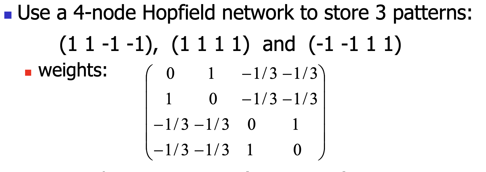

1. 实验设置: 我们存了 3 个模式：A, B, C。

- 注意：这里面**没有**全 -1 的模式 $(-1, -1, -1, -1)$。

案例一：我们输入一个被破坏的向量：$(-1, -1, -1, -1)$。

- 理论上，网络应该把它修复成 A、B 或 C 中的一个。
- 实际计算：我们选节点 4 进行更新。计算结果显示，输入加权求和后，它还是倾向于保持 -1。其他节点算下来也都不动。
- **结局**：网络稳定在了 $(-1, -1, -1, -1)$。
- **问题**：这个状态**根本不在**我们的记忆库里！网络把一个完全陌生的东西当成了真理。这就叫**伪吸引子 (Spurious State)**。

案例二：（蝴蝶效应） 下面的输入案例展示了 Hopfield 网络作为一个异步系统的微妙之处：先后顺序决定命运。

- **输入**：$(-1, -1, -1, 0)$（只有最后一个不知道）。
- **剧本 A**：如果我们**先问节点 4**。
  - 计算结果是 -1。状态变成 $(-1, -1, -1, -1)$。
  - 完蛋，掉进刚才那个“伪吸引子”的大坑里出不来了。
- **剧本 B**：如果我们按 **1 -> 2 -> 3 -> 4** 的顺序问。
  - 经过一轮调整，网络最终稳定在 $(-1, -1, 1, 1)$。
  - **惊喜**：这正是我们存储的第 3 个正确模式！

**结论**：在 Hopfield 网络里，当你站在两个坑的边缘时，**谁先说话**（更新顺序）可能决定了你是找回正确的记忆，还是产生幻觉。

#### 残酷的现实 —— 局限性

最后一页总结了 Hopfield 网络的缺点，给过于乐观的我们泼了一盆冷水。

1. 容量太小 (Capacity Limited) : 你不能想存多少就存多少。如果强行存太多模式，所有的记忆都会混在一起，变成一团浆糊。
   - *注：经验公式是存储量大约是神经元数量的 15% 左右。*
2. 幻觉风险 (Spurious Pattern)：如刚才所见，网络可能会收敛到一个它自己创造的、毫无意义的模式上。
3. 互相干扰 (Interference)：如果两个记忆长得太像（share many bits），网络就会分不清它们。
   - 比如你存了“1111”和“1110”，网络可能最后谁也记不住，或者变得不稳定。因为它们在空间里的“引力坑”重叠了。