# 2 Supervised Learning and Perceptron 监督学习与感知机

## Overview

- McCulloch-Pitts neuron

  麦卡洛克-皮茨神经元

- Hebb’s learning rule

  赫布学习法则

- **Supervised learning model: Perceptron**

  **监督学习模型：感知机**

**Our focus**: learn a **target function** that can be used to predict the values of a discrete class attribute, e.g., yes or no, and high or low. This task is commonly called "**Supervised Learning**"

我们的关注点：学习一个**目标函数**，该函数可用于预测离散类别属性的值，例如是与否，或高与低。该任务通常被称为**“监督学习”**。

## The data and the goal 数据与目标

- **Data:** A set of data records (also called examples, instances or cases) described by

  **数据**： 一组由记录（也称为样本、实例或案例）组成的数据集，其描述方式为

  - *k* attributes: *A*1, *A*2, … *Ak*. 

    k个属性（特征）：A1、A2、……、Ak。

  - a class: Each example is labelled with a pre-defined class. 

    一个类别：每个示例都被预先定义的类别所标记。

- **Goal:** To learn a classification model from the data that can be used to predict the classes of new (future, or test) cases/instances.

  **目标**： 从数据中学习一个分类模型，该模型可用于预测新（未来或测试）案例/实例的类别。

## Supervised vs. unsupervised Learning 监督学习与无监督学习

- **Supervised learning**: classification is seen as supervised learning from examples.

  监督学习：分类被视为通过示例进行的监督学习。

  - Supervision: The data (observations, measurements, etc.) are labeled with pre-defined classes. It is like that a “teacher” gives the classes (supervision). 

    监督学习：数据（观测值、测量结果等）已被预先定义的类别标注。这好比一位“教师”提供类别指导（监督）。

  - Test data are classified into these classes too.

    测试数据同样被划分至这些类别中。 

- **Unsupervised learning** (e.g. clustering)

  无监督学习（例如：聚类）

  - Class labels of the data are unknown

    数据的类别标签是未知的。

  - Given a set of data, the task is to establish the existence of classes or clusters in the data

    给定一组数据，任务是确定数据中是否存在类别或聚类。

### Supervised learning process: two steps 监督学习过程：两个步骤

- **Learning (training)**: Learn a model using the training data

  **学习（训练）**：使用训练数据学习一个模型。

- **Testing**: Test the model using **unseen** test data to assess the model accuracy

  **测试**：使用**未见过**的测试数据对模型进行测试，以评估模型的准确性。

$Accuracy = \frac{\text{Number of correct classification}}{\text{Total number of test cases}}$

To achieve good accuracy on the test data, training examples must be sufficiently representative of the test data.

为了在测试数据上获得良好的准确性，训练样本必须充分代表测试数据。

## Perceptron 感知机

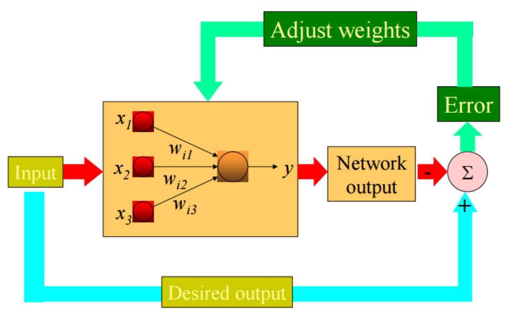

Example:

Define our “features”:

定义我们的“特征”：

| Taste | Sweet = 1, Not_Sweet = 0   |
| ----- | -------------------------- |
| Seeds | Edible = 1, Not_edible = 0 |
| Skin  | Edible = 1, Not_edible = 0 |

```
Good_Fruit = 1
Not_Good_Fruit = 0
```

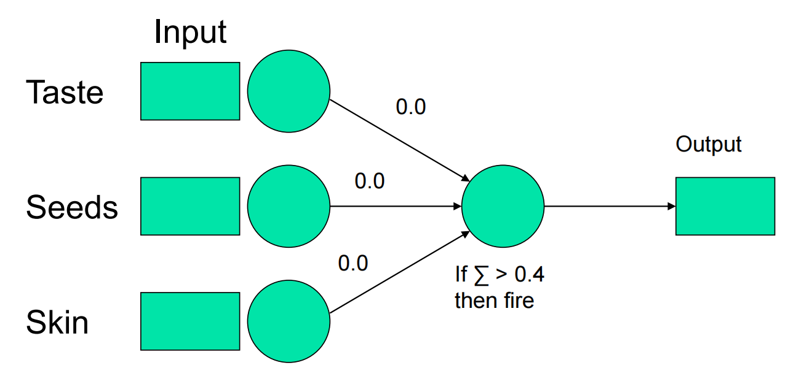

To train the perceptron, we will show it each example and have it categorize each one.

为了训练感知器，我们将向它展示每个例子，并让它对每个例子进行分类。

Since it’s starting with no knowledge, it is going to make mistakes. When it makes a mistake, we are going to adjust the weights to make that mistake less likely in the future.

由于系统初始阶段缺乏知识储备，因此难免会出现错误。一旦发生错误，我们将调整权重参数，以降低未来同类错误发生的概率。

When we adjust the weights, we’re going to take relatively small steps to be sure we don’t over-correct and create new problems.

在我们调整权重时，会采取相对较小的步骤，以确保不会过度修正并引发新的问题。

We’re going to learn the category “good fruit” defined as anything that is sweet.

我们将学习“优质水果”这一类别，其定义为所有甜味的水果。

**Good fruit = 1**

**Not good fruit = 0**

### 用香蕉做案例

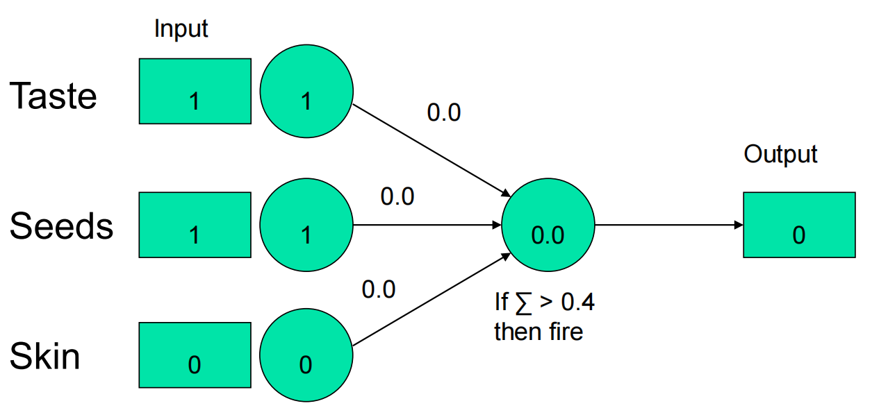

- In this case we have:

  - (1 X 0) = 0 + (1 X 0) = 0 + (0 X 0) = 0

  - It adds up to 0.0.

  - Since that is less than the threshold (0.40), we responded “no.”

- It is not correct.

Since we got it wrong, we need to change the weights. We’ll do that using the **delta rule** (delta for change).

既然我们之前理解有误，现在需要调整权重参数。我们将运用**德尔塔法则**（德尔塔代表变动）来实现这一调整。

- ∆w = learning rate x (teacher - output) x input

- The three parts of that are:

  - **Learning rate**: We set that ourselves. Set large enough that learning happens in a reasonable amount of time; and also small enough to avoid too fast. Here pick 0.25.

    学习率：由我们自行设定。应确保其足够大，以便在合理时间内完成学习；同时也要足够小，以避免学习速度过快。此处选择0.25。

  - **(teacher - output)**: The teacher knows the correct answer (e.g., that a banana should be a good fruit). In this case, the teacher says 1, the output is 0, so (1 - 0) = 1.

    （教师输出）：教师知道正确答案（例如，香蕉应当是一种优质水果）。此时，教师给出的答案为1，而实际输出为0，因此（1 0）= 1。

  - **Input**: That’s what came out of the node whose weight we’re adjusting. For the first node, 1.

    输出：这是从我们正在调整权重的节点得出的结果。对于第一个节点，1。

- To pull it together:

  - Learning rate: 0.25.

  - (teacher - output): 1.

  - input: 1.

  - ∆w = 0.25 X 1 X 1 = 0.25.

- Since it’s a **∆w**, it’s telling us how much to change the first weight. In this case, we’re adding 0.25 to it.

  由于这是一个权重增量（∆w），它指示我们需要对第一个权重进行多大程度的调整。在此情况下，我们将其增加0.25。

- Let’s think about the delta rule: (teacher - output)

  让我们思考一下德尔塔规则：（teacher - output）

  - If we get the categorization right, (teacher - output) will be zero (the right answer minus itself).

    若分类无误，（教师输出）将为零（正确答案减去其自身）。

  - In other words, if we get it right, we won’t change any of the weights. As far as we know we have a good solution, why would we change it?

    换言之，如果我们做对了，就不需要改变任何权重。就我们所知，既然已经有了一个良好的解决方案，为何还要改变它呢？

- If we get the categorization wrong, (teacher - output) will either be -1 or +1. 

  如果我们对分类判断错误，（教师输出）将得到-1或+1的结果。

  - If we said “yes” when the answer was “no”,we’re too high on the weights and we will get a (teacher - output) of -1 which will result in reducing the weights.

    如果我们给出肯定回答而实际答案为否定，则表明权重过高，此时将得到（教师输出）-1，这一结果将导致权重的降低。

  - If we said “no” when the answer was “yes”,we’re too low on the weights and this will cause them to be increased.

    若我们本应回答“是”却说了“不”，则表明权重偏低，这将导致权重的提升。

- Input:

  - If the node whose weight we’re adjusting sent in a 0, then it didn’t participate in making the decision. In that case, it shouldn’t be adjusted. Multiplying by zero will make that happen.

    若进行权重调整的节点发送的是0，则表明该节点未参与决策过程。在此情况下，不应调整其权重。乘以零的操作将确保实现这一效果。

  - If the node whose weight we’re adjusting sent in a 1, then it did participate and we should change the weight (up or down as needed) if the corresponding output wrong.

    若待调整权重的节点发送了信号1，则表明其确实参与了运算过程，此时若对应输出结果有误，我们便需相应地调整该节点的权重（视情况增减）。

在将权重修改为0.25之后

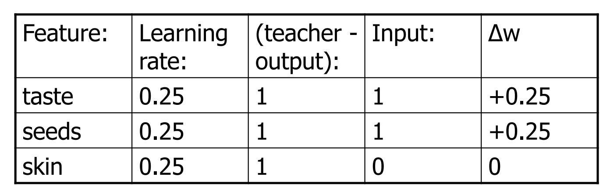

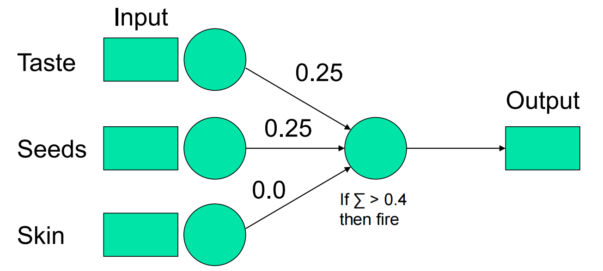

We will keep cycling through the examples until we go all the way through one time without making any changes to the weights. At that point, the concept is learned.

我们将持续循环遍历示例，直至完整执行一轮且无需对权重进行任何调整。至此，概念即被习得。


### Perceptron Rule 感知器规则

- A weight of connection changes **only if** both the input value and the error of the output unit are not equal to 0.

  连接权重的改变仅当输入值和输出单元误差均不为零时发生。

  - If the output is correct (ye = oe) the weights wi are not changed

    如果输出正确（即误差为零），则权重wi保持不变。

  -  the output is incorrect (ye ≠ oe) the weights wi are changed such that the output of the perceptron for the new weights is *closer* to ye.

    输出结果不正确（ye≠oe），因此调整权重wi，使得感知器在新权重下的输出更接近于预期输出ye。

- The algorithm **converges** to the correct classification, if

  该算法**收敛**至正确分类，当

  - the training data is **linearly separable**;

    训练数据是**线性可分**的；

  - and the learning rate is sufficiently small, usually set below 1, which **determines the amount of correction made in a single iteration.**

    并且学习率足够小，通常设定在1以下，这决定了单次迭代中修正量的大小。

### Perceptron convergence Theorem 感知器收敛定理

For any data set *that’s* **linearly separable**, the learning rule is guaranteed to find a solution in a finite number of steps.

对于任何线性可分的数据集，该学习规则保证能在有限步骤内找到一个解。

**Assumptions:**

- At least one such set of weights, w*, exists

  至少存在这样一组权重，记为w*。

- There are a finite number of training patterns. 

  训练样本的数量是有限的。

- The threshold function is uni-polar (output is 0 or 1).

  阈值函数是单极性的（输出为0或1）。

### Network Performance for Perceptron 感知器网络性能

The network performance during training session can be measured by a **root-mean-square (RMS) error value**.

训练期间网络性能可通过**均方根（RMS）误差值**进行衡量。

- $\sqrt{\frac{\sum_{i=1}^{N} \left( x_i - \hat{x}_i \right)^2}{N}}$

$N$ is the number of data points

$N$ 表示数据点的数量。

$x_i$ is the target output

$x_i$是目标输出

 $\hat{x_i}$ is the real/instant output

$\hat{x_i}$是真实的/即时输出

The RMS error is a function of the instant output values only

均方根误差仅取决于瞬时输出值。

### The Network Performance 网络性能

In turn, the instant outputs $\hat{x_i}$are functions of the input values, which are also constants, and of the weights of connections *$w_{ij}$*

相应地，即时输出$\hat{xi}$是输入值（亦为常量）与连接权重*$w{ij}$*的函数。

So the performance of the network measured by the RMS error also is function of the weights of connections **only**

因此，网络性能通过均方根误差衡量，也仅与连接权重有关。

The *best performance of the network* corresponds to the minimum of the RMS error, and we adjust the weights of connections in order to get that minimum.

网络的最佳性能对应于均方根误差的最小值，我们通过调整连接权重以达到该最小值。

### RMS on Training Set 训练集的均方根误差

The figure shows a **learning curve**, i.e., dependence of the RMS error on the number of iterations for the training set.

该图展示了学习曲线，即训练集上均方根误差随迭代次数的变化关系。

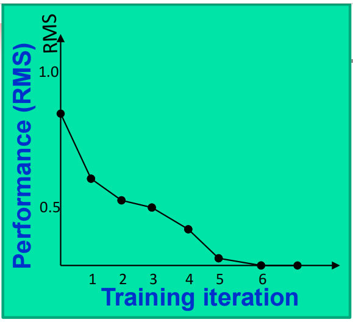

- Initially, the adaptable weights are all set to small random values, and the network does not perform very well.

  初始时，所有可调权重均被设置为较小的随机值，此时网络性能表现欠佳。

- As weights are adjusted during training, performance improves; when the error rate is low enough, training stops and the network is said to have **converged**.

  在训练过程中，随着权重的调整，性能逐渐提升；当误差率足够低时，训练停止，此时网络被认为已经**收敛**。

### About Perceptron Convergence 关于感知器收敛

理想情况下的感知器收敛：若存在一组权重使得感知器能对所有训练模式做出正确响应，则感知器的学习方法将在有限次迭代内找到该组权重。

There might be another possibility during a training session:

训练期间或许存在另一种可能性：

- eventually performance stops improving, and the RMS error does not get smaller regardless of number of iterations.

  最终性能停止提升，无论迭代次数如何增加，均方根误差都无法进一步减小。

That means the network has failed to learn all of the answers correctly.

这意味着网络未能正确学习所有答案。

If the training is successful, the perceptron is said 

如果训练成功，该感知器即被称为

- to have *gone through* the supervised learning, and

  经历了监督学习的过程，并且

- is able to classify patterns similar to those of the training set.

  能够对与训练集相似的样本进行分类。

### Perceptron As a Classifier 感知器作为分类器

For *d*-dimensional data, perceptron consists of d-weights, a bias, and a thresholding activation function. For 2D data example，we have:

对于d维数据，感知机包含d个权重、一个偏置项以及一个阈值激活函数。以二维数据为例，我们有以下结构：

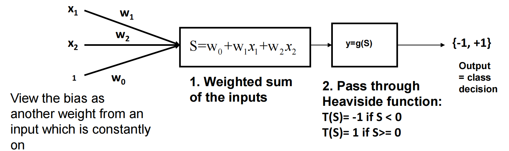

If we group the weights as a vector w , the net output y can be expressed as:

若将权重组合为向量w，则净输出y可表示为：

- $y = g(w \cdot x + w_0)$

A perceptron training is to compute weight vector:

感知器训练旨在计算权重向量：

- $W = [w_0,w_1,w_2,...,w_p]$

to correctly classify all the training examples. 正确分类所有训练样本。

E.g. considering when p = 2

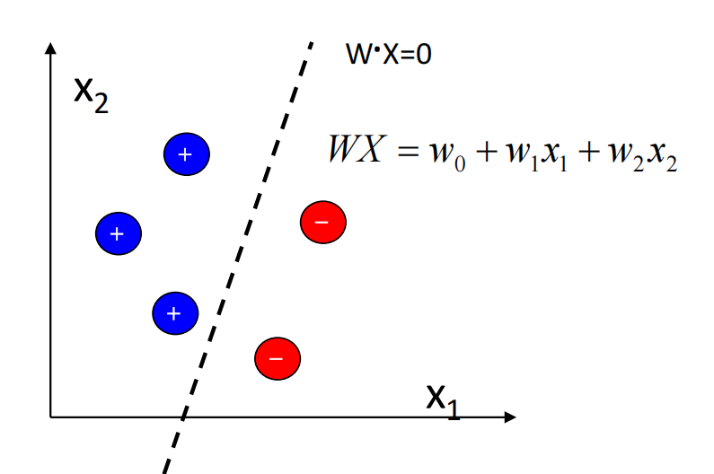

$W \cdot X$ is a **hyperplane**, which in 2d is a straight line.

$W \cdot X$ 是一个超平面，在二维空间中表现为一条直线。

## Neural Network as Classifier 神经网络作为分类器

For 2 classes, view net output as a **discriminant function y(x, w),** where:

对于两个类别，将网络输出视为判别函数y(x, w)，其中：

- y(x, w) = 1 , if x in class 1 (C1) 

- y(x, w) = - 1, if x in class 2 (C2)

For m classes, a classifier should partition the feature space into m **decision regions**

对于一个包含m个类别的分类器，需要将特征空间划分为m个决策区域。

- The **line or curve** separating the classes is the **decision boundary.**

  类别间的分界线或曲线即为决策边界。

- In more than 2 dimensions, this is a hyperplane.

  在超过二维的空间中，这是一个超平面。

### Further on Perceptron Decision Boundary 关于感知器决策边界的进一步探讨

A perceptron represents a **hyperplane decision surface** in d-dimensional space, for example, a line in 2D, a plane in 3D, etc.

感知器在d维空间中代表一个超平面决策面，例如二维空间中的一条直线，三维空间中的一个平面等。

The equation of the hyperplane is $W \cdot X_T = 0$

This is the equation for points in x-space that are **on** the boundary

这是x空间中位于边界上的点的方程。

### Decision boundary of Perceptron 感知器的决策边界

- Perceptron is able to represent some useful functions

  感知机能够表示一些有用的函数。

- But functions that are not linearly separable (e.g. XOR) are not representable

  但是，非线性可分的函数（例如异或操作）则无法被表示。

### Example of Perceptron Decision Boundary 感知器决策边界示例

Decision surface is the surface at which the output of the unit is precisely equal to the threshold, i.e. $\sum w_ix_i = \theta$

决策面是指单元输出恰好等于阈值的曲面。

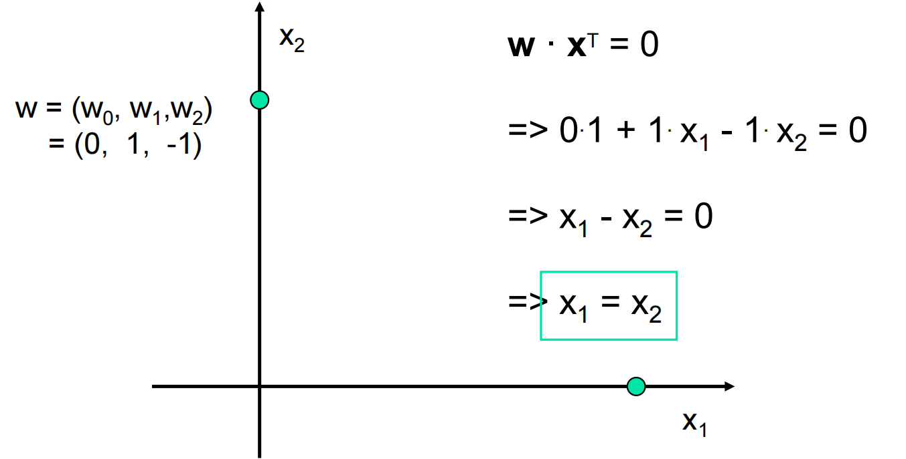

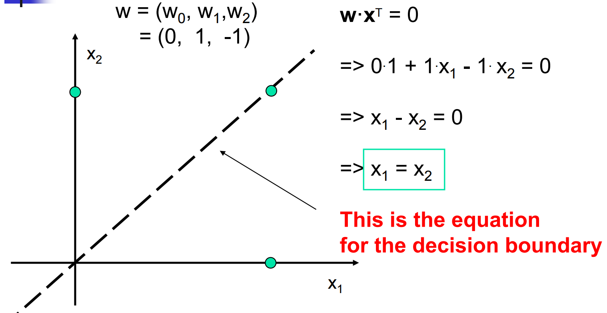

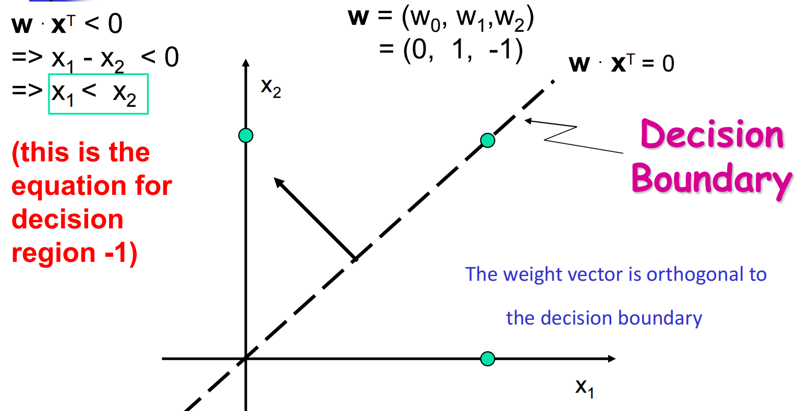

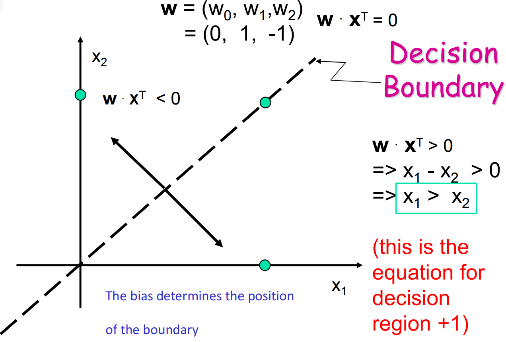

If two classes of patterns can be separated by a decision boundary, represented by the linear equation

如果两类模式能够通过一个决策边界来区分，该边界由线性方程表示。

- $b + \sum_{i=1}^{n} x_i w_i = 0$

then they are said to be **linearly separable** and the perceptron can correctly classify any patterns

那么它们被称为线性可分的，且感知器能够正确分类所有模式。

NOTE: without the bias term, the hyperplane will be forced to intersect origin.

注意: 若无偏置项，超平面将被迫穿过原点。

## Linear Separability Problem 线性可分性问题

Decision boundary (i.e., **W, b** ) of linearly separable classes can be determined either by some learning procedures, or by solving linear equation systems based on representative patterns of each classes.

线性可分类别的决策边界（即权重W与偏置b）既可通过某些学习程序确定，也可基于各类别的代表性模式通过求解线性方程组来获得。

If such a decision boundary does not exist, then the two classes are said to be linearly inseparable.

若此类决策边界不存在，则称这两类为线性不可分。

Linearly inseparable problems cannot be solved by the simple perceptron network, more sophisticated architecture is needed.

线性不可分问题无法通过简单的感知器网络解决，需要采用更复杂的架构。

### Examples of linearly inseparable classes:

**Logical XOR (exclusive OR) function** patterns (bipolar) decision boundary

逻辑异或（XOR）函数模式（双极性）决策边界

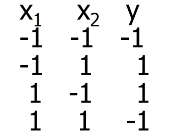

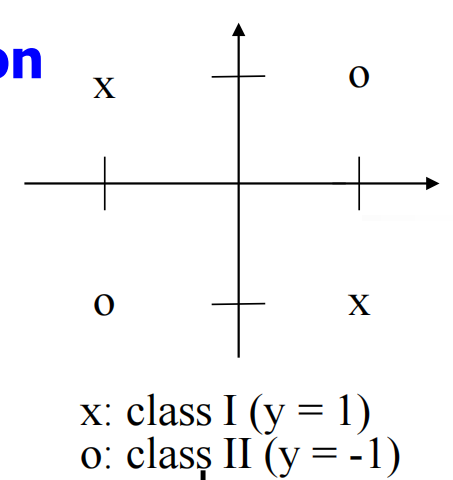

No line can separate these two classes, as can be seen from the fact that the following linear inequality system has no solution

无法通过一条直线将这两个类别分开，这可以从以下线性不等式组无解的事实中看出。

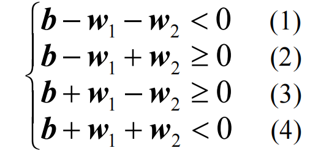

because we have b < 0 from (1) + (4),  and b >= 0 from (2) + (3), which is a contradiction

鉴于由(1)和(4)得出b < 0，而由(2)和(3)得出b ≥ 0，两者相互矛盾。

### Examples of linearly separable classes 线性可分类的示例。

- Logical **AND** function
  - patterns (bipolar) decision boundary

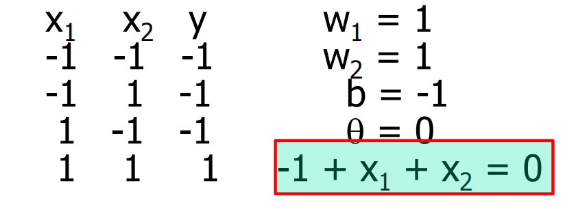

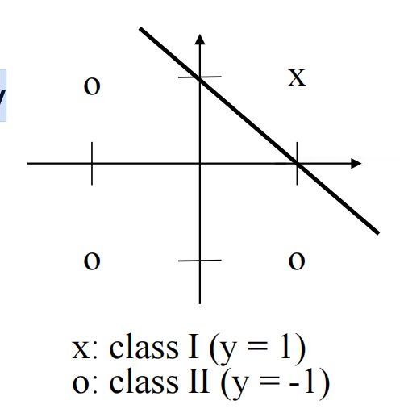

- Logical **OR** function

  逻辑或函数

  - patterns (bipolar) decision boundary

    模式（双极性）决策边界

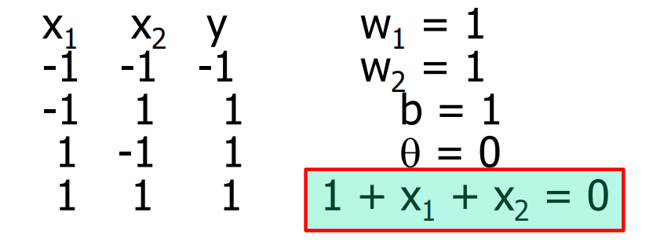

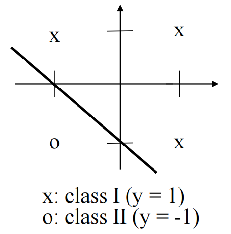