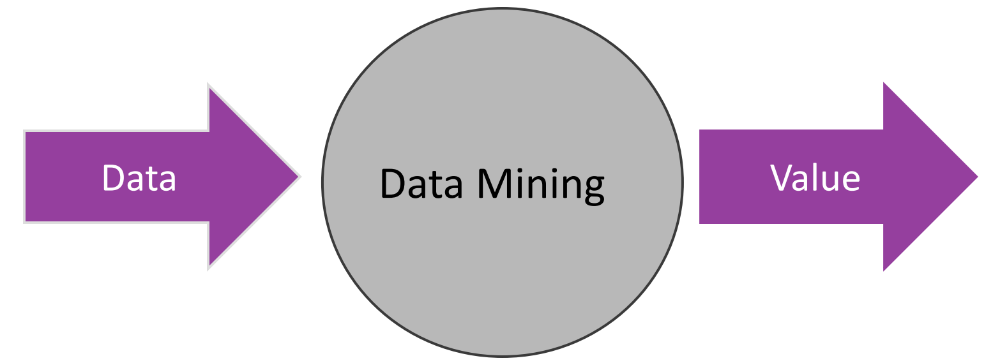
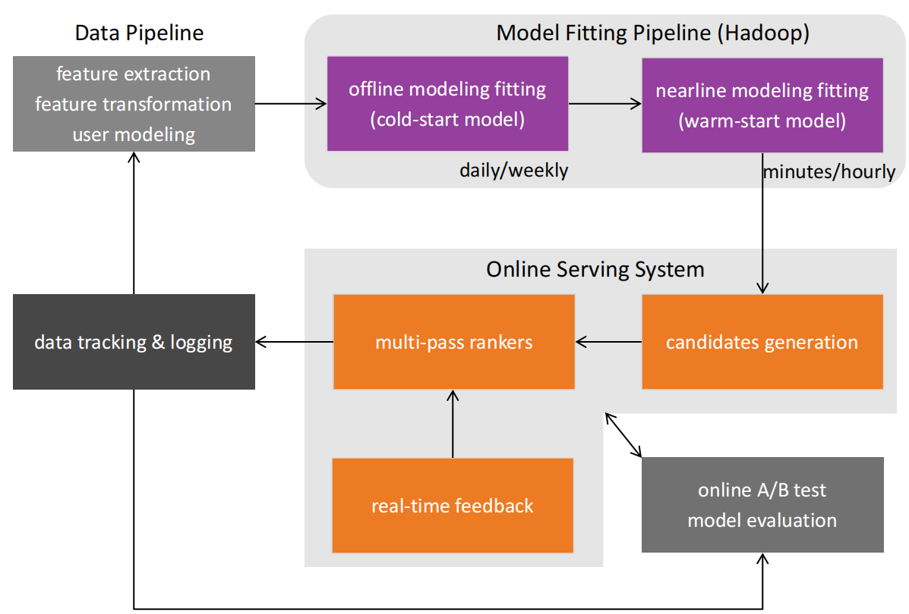
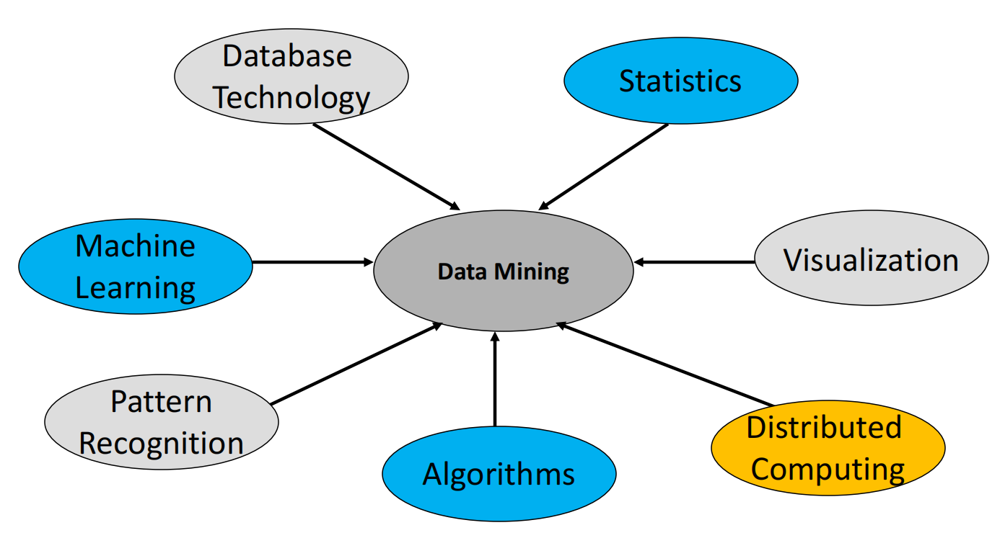
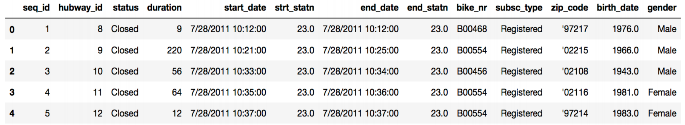
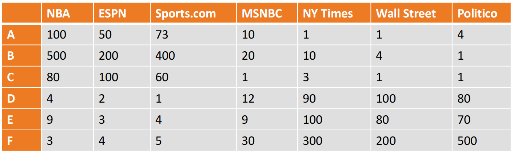
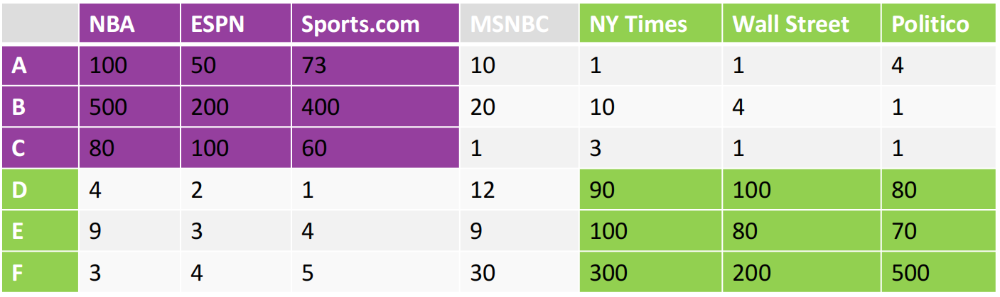

# 1 Introduction to Data Science

## What is Data Science

Analyzing these was the job of: Statisticians + Computer Engineering = **DATA ANALYST**

分析这些数据的职责由：**统计学家 + 计算机工程 = 数据分析师** 承担。

THE DATA IS **COMPLEX** AND **INTERCONNECTED**

该数据复杂且相互关联。

- **Multiple types of data**: database tables, text, time series, images, videos, graphs, etc

  多种数据类型：数据库表格、文本、时间序列、图像、视频、图表等。

- Spatial and temporal aspect

  空间与时间方面

- Interconnected data of different types:

  不同类型数据的互联互通

  - From the mobile phone we can collect, location of the user, friendship information, check-ins to venues, opinions through twitter, status updates in FB, images though cameras, queries to search engines.

    通过手机，我们可以收集用户的位置信息、社交关系数据、场所签到记录、推特上的观点表达、脸书的状态更新、相机拍摄的图像以及搜索引擎的查询内容。

**DATA MINING 数据挖掘**

- In simple terms

  

The data mining pipeline

“Data Mining is the study of collecting, processing, analyzing, and gaining useful insights from data” 

数据挖掘是一门研究如何从数据中收集、处理、分析并获取有价值洞见的学科。

## 课程介绍

The material of the course will integrate the five key facets of an investigation using data:

课程内容将融合数据调查的五个关键方面：

1. data collection; data wrangling, cleaning, and sampling to get a suitable data set

   数据收集；数据整理、清洗及抽样，以获得适用的数据集。

2. data management; accessing data quickly and reliably

   数据管理；快速可靠地访问数据

3. exploratory data analysis; generating hypotheses and building intuition

   探索性数据分析；生成假设与建立直觉。

4. prediction or statistical learning

   预测或统计学习

5. communication; summarizing results through visualization, stories, and interpretable summaries.

   沟通；通过可视化、故事讲述与可解读性总结来概括结果。

## The Data Science Process

### Activity 1: Analyzing Hubway data 分析一个共享乘车项目的数据

- **Introduction:** By 2016, Hubway operated 185 stations and 1750 bicycles, with 5 million ride  since launching in 2011.

  **引言**： 截至2016年，Hubway已运营185个站点和1750辆自行车，自2011年启动以来累计骑行次数达500万次。

- **The Data:** In April 2017, Hubway held a Data Visualization Challenge, releasing 5 years of trip data.

  **数据情况**： 2017年4月，Hubway举办了一场数据可视化挑战赛，并公布了五年的行程数据。

- **The Question:** What does the data tell us about the ride share program?

  **问题**： 数据向我们揭示了关于拼车项目的哪些信息？

### THE DATA EXPLORATION/QUESTION REFINEMENT CYCLE 数据探索/问题精炼循环

Our original question: **‘What does the data tell us about the ride share program?’** is a reasonable slogan to promote a hackathon.

我们的原始问题：**“数据告诉我们关于拼车项目的哪些信息？”** 是一个适合推广 hackathon 活动的合理口号。

Before we can refine the question, we have to look at the data!

#### Who - Who’s using the bikes?  谁在使用这些自行车？

Refine into specific hypotheses:

提炼为具体假设：

- More men or more women?

  男性多还是女性多？

- Older or younger people?

  年长者还是年轻人？

- Subscribers or one time users?

  订阅者还是一次性用户?

#### Where - Where are bikes being checked out?  自行车在何处被检查？

Refine into specific hypotheses:

提炼为具体假设：

- More in Boston than Cambridge?

  波士顿比剑桥更多？

- More in commercial or residential?

  更多是商业还是居民用途？

- More around tourist attractions?

  更多关于旅游景点的信息？

Sometimes the data is given to you in pieces and must be merged!

有时数据是以碎片的形式提供给您的，必须进行合并！

#### When - When are the bikes being checked out? 自行车何时被检查？

Refine into specific hypotheses:

提炼为具体假设：

- More during the weekend than on the weekdays?

  周末比工作日更多？

- More during rush hour?

  高峰期车次更多吗？

- More during the summer than the fall?

  夏天比秋天更频繁吗？

Sometimes the feature you want to explore doesn’t exist in the data, and must be engineered!

有时候你想要探索的特征在数据中并不存在，必须通过工程方法构建！

#### Why - For what reasons/activities are people checking out bikes? 人们租借自行车的原因或活动有哪些？

Refine into specific hypotheses:

提炼为具体假设：

- More bikes are used for recreation than commute?

  用于娱乐的自行车比通勤用的更多吗？

- More bikes are used for touristic purposes?

  更多自行车被用于旅游目的？

- Bikes are use to bypass traffic?

  自行车是用来避开交通拥堵的吗？

Do we have the data to answer these questions with reasonable certainty? What data do we need to collect in order to answer these questions?

我们是否有足够的数据以合理确定性回答这些问题？需要收集哪些数据才能解答这些问题？

#### How - Questions that combine variables. 结合变量的问题

- How does user demographics impact the duration the bikes are being used? Or where they are being checked out?

  用户人口统计特征如何影响自行车的使用时长？或者它们被租借的地点？

- How does weather or traffic conditions impact bike usage?

  天气或交通状况如何影响自行车使用？

- How do the characteristics of the station location affect the number of bikes being checked out?

  站点位置的特征如何影响自行车的租借数量？

How questions are about modeling relationships between different variables.

关于如何建立不同变量间关系模型的问题。

### Activity 2: Data Mining Example

Suppose that you were creating the Chinese Facebook.

假设你正在创建一个中文版的Facebook。

那么在社交平台中的各种类型的信息都会被收集，并被当做潜在的有价值的数据来进行分析

#### Exploratory Analysis 探索性分析

- Make **measurements** to understand what the data looks like

  进行**测量**以了解数据的外观特征。

- Example: Posts

  示例：帖子

  - How often do users posts, how many posts per user, when do they post, is there a correlation between number of posts and number of friends, etc

    用户发帖频率如何，每位用户平均发帖数量多少，他们通常在何时发布内容，发帖数量与好友数量之间是否存在相关性等。

- This is one of the first steps when collecting data.

  这是在收集数据时的初始步骤之一。

  - **Metrics**: Deciding **what to measure** is important

    **衡量指标**：**确定测量对象**至关重要

#### Exploiting Similarities 利用相似性

Consider the following data for six users:

考虑以下六位用户的数据：

- Number of times they have clicked on posts from these pages

  他们点击这些页面帖子的次数

The conclusion could be "Two types of users and two types of pages"

结论可以得到：两种类型的用户与两种类型的页面

- Sports and politics

Questions:

- How do we compute similarity?

  我们如何计算相似度？

- How do we group similar users? **Clustering**

  如何将相似用户分组？**通过聚类**

加入我们其中某一格中的数据遗失了，那么我们可以根据 **recommendation system** 来进行 similarity 的预测，例如现在社交软件的好友推荐功能。

**Triadic closure principle**: Links are created in a way that usually closes a triangle

**三元闭包原理**: 链接的建立通常以闭合三角形的方式进行。

- If both Bob and Charlie know Alice, then they are likely to meet at some point.

  如果鲍勃和查理都认识爱丽丝，那么他们很可能在某个时刻相遇。

#### Making Predictions 做预测

- Filling the missing value can also be viewed as a prediction task

  填补缺失值亦可视为一项预测任务。

- Types of prediction tasks:

  预测任务类型：

  - Predicting a real value (e.g. number of clicks): Regression

    预测一个实际数值（例如点击次数）：回归分析

  - Predicting a YES/NO value (e.g., will the user click?): Binary classification

    预测一个“是/否”值（例如，用户是否会点击？）：二分类问题

  - Predicting over multiple classes (e.g., what is the topic of a post): Classification

    预测多个类别（例如，帖子的主题是什么）：分类

Examples: （考试的时候可能会出这么判断题）

- ad click prediction (Prediction)
- Predict if a post is offensive (Classification)
- Like prediction (Classification)
- Predict if a photo contains nudity (Classification)
- Predict if a user will like a post over another (Classification)

#### Social Graph 社交图

- Who is important and influential in the graph?

  谁在图表中是重要的和有影响力的？

- How does information spread in the network?

  信息如何在网络中传播？

- What is the shortest path between two nodes?

  两个节点之间的最短路径是什么？

- What becomes vital?

  什么会变得重要？

- Will two users become friends in the future?

  两个用户将来会成为朋友吗？

- What is the most important node in this graph?

  图中最重要的节点是什么？

  - **The PageRank algorithm**: A node is important is it is pointed to by other important nodes

    **PageRank算法**：一个节点的重要性取决于它是否被其他重要节点所指向。

## Conclusion

Boundaries are becoming less clear

边界变得越来越模糊

- Today data mining, machine learning, and AI are synonymous. It is assumed that the algorithms should scale. It is clear that statistical inference is used for building the models.

  如今，数据挖掘、机器学习与人工智能已互为同义词。人们普遍认为算法应具备可扩展性。显而易见，统计推断被广泛应用于模型构建过程中。

- Data is the engine for AI

  数据是人工智能的引擎。

- Data Mining touches everything related to data.

  数据挖掘触及与数据相关的所有领域。

But data mining also has a dark side

- Are the algorithms making fair and correct decisions?

  算法是否做出了公平和正确的决定？

- Do algorithms create filter bubbles, echo chambers, and promote misinformation? 

  算法是否制造过滤气泡、回音室效应，并助长错误信息的传播？

- Are they a threat to democracy?

  他们是对人的自主性存在威胁吗？

- Surveillance capitalism

  监控资本主义

- Is AI a threat?

  AI是威胁吗？

