# 2 What is Data? 什么是数据

“Data Mining is the study of collecting, processing, analyzing, and gaining useful insights from data” – Charu Aggarwal

数据挖掘的含义：“数据挖掘是一门关于数据收集、处理、分析并从中获取有用洞见的学科”——查鲁·阿加瓦尔

> Data → Data Mining → Value

## Data

- Collection of data objects and their attributes

  数据对象及其属性的集合。

- An **attribute** is a property or characteristic of an object **(columns)**

  属性是对象的一个性质或特征。

  - Examples: name, date of birth, height, occupation.

    示例：姓名、出生日期、身高、职业。

  - Attribute is also known as variable, field, characteristic, or feature

    属性也被称为变量、字段、特性或特征。

- For each object the attributes take some values.

  每个对象的属性都拥有特定数值。

- The collection of attribute-value pairs describes a specific object

  属性-值对的集合用于描述特定对象。

  - Object is also known as record, point, case, sample, entity, or instance

    对象也被称为记录、点、案例、样本、实体或实例。

- **Size (n):** Number of objects **(rows)**

  大小（n）：对象（行）的数量

- **Dimensionality (d)**: Number of attributes

  维度（d）：属性数量

- **Density/Sparsity**: Number of populated object-attribute pairs

  密度/稀疏度：已填充对象-属性对的数量

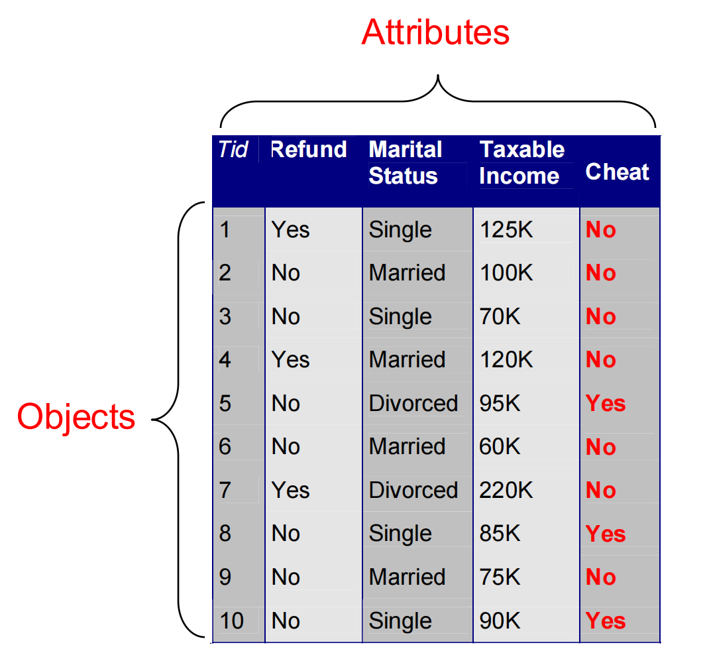

### Relational Data 关系型数据

- The term comes from **DataBases**, where we assume data is stored in a **relational table** with a fixed schema (fixed set of attributes)

  该术语源自数据库领域，在此领域中我们假定数据存储于具有固定模式（即固定属性集）的**关系表**中。

  - In Databases, it is usually assumed that the table is dense (few null values)

    在数据库中，通常假设表是密集的（少有null值）。

- There are a lot of data in this form

  - E.g., census data 普查数据

- There are also a lot of data which do not fit well in this form

  此外，有大量数据并不完全符合此格式。

  - Sparse data: Many missing values

    松散度高的数据

  - Not easy to define a fixed schema

    数据没有固定的模式

### Types of Attributes 属性的类型

There are different types of attributes

存在多种属性类型。

- Numeric 数值型

  - Examples: dates, temperature, time, length, value, count.

    实例：日期、温度、时间、长度、数值、计数。

  - **Discrete** (counts) vs **Continuous** (temperature)

    离散型（计数）与连续型（温度）

  - Special case: **Binary/Boolean** attributes (yes/no, exists/not exists)

    特殊情况：二进制/布尔属性（是/否，存在/不存在）

- Categorical 

  分类的

  - Examples: eye color, zip codes, strings, rankings (e.g, good, fair, bad),  height in {tall, medium, short}

    示例：眼睛颜色、邮政编码、字符串、等级（例如：优秀、良好、差）、身高等级（高、中等、矮）

  - **Nominal** (no order or comparison) vs **Ordinal** (order but not comparable)

    名义尺度（无顺序或不可比较）与顺序尺度（有顺序但不可比较）

### Numeric Relational Data 数值型关系数据

If data objects have the same **fixed set** of **numeric attributes**, then the data objects can be thought of as **points/vectors** in a multi-dimensional space, where each **dimension** represents a distinct attribute

若数据对象拥有相同的**固定**数值属性集，则可将这些数据对象视作多维空间中的**点或向量**，其中每一**维度**代表一个不同的属性。

Such data set can be represented by an **n-by-d data matrix**, where there are **n** rows, one for each object, and **d** columns, one for each attribute

该数据集可由一个n×d的数据矩阵表示，其中包含n行（每行代表一个对象）和d列（每列对应一个属性）。

### Numeric Data 数值数据

- Thinking of numeric data as **points or vectors** is very convenient

  将数值数据视为点或向量极为便利。

- For small dimensions we can plot the data

  对于小维度数据，我们可以进行绘图展示。

- We can use geometric analogues to define concepts like **distance** or **similarity**

  我们可以运用几何类比来定义诸如距离或相似度这样的概念。

- We can use **linear algebra** to process the data matrix

  我们可以利用线性代数来处理数据矩阵。

### Vector Databases 向量数据

- This is a special case of numerical data, where each object is a multidimensional numerical vector.

  这是数值数据中的一个特例，其中每个对象均为多维数值向量。或者说是一个字段里存放多个数值，组成一个向量

- Different from before, the vectors do not store the attribute values for the object, but rather the **embedding** of the object as it is produced by some Machine Learning algorithm. 

  与以往不同，这些向量并非存储对象的属性值，而是保存由某种机器学习算法生成的对象**嵌入**表示。

- Embedding vectors are **fully dense** and have no clear interpretation.

  嵌入向量是完全密集的且不具备明确的可解释性。

- They have been shown to be remarkably successful in capture **semantic relationships** between objects.

  它们已被证明在捕捉物体间的**语义关联**方面成效显著。

### Categorical Relational Data 分类关系数据

Data that consists of a collection of records, each of which consists of a **fixed set** of **categorical** attributes

数据由一系列记录组成，其中每条记录包含一组固定的分类属性。

### Mixed Relational Data 混合关系数据

Data that consists of a collection of records, each of which consists of a fixed set of both **numeric** and **categorical** attributes

数据由一组记录构成，其中每条记录均包含固定数量的**数值型**与**分类型**属性。

需要注意的是，有些时候虽然有些属性中存放的数据是数字，但是这不代表该属性存储的就是数值型数据。

**Boolean attributes** can be thought as both numeric and categorical When appearing together with other attributes they make more sense as categorical They are often represented as numeric though

**布尔属性**既可被视为数值型，也可被视为分类型。当与其他属性同时出现时，它们作为分类属性更具意义，然而在实际应用中通常以数值形式进行表示。

Sometimes it is convenient to represent categorical attributes as boolean.

将分类属性表示为布尔值有时更为便捷。

- Add a Boolean attribute for each possible value of the attribute

  为属性的每个可能值添加一个布尔属性。

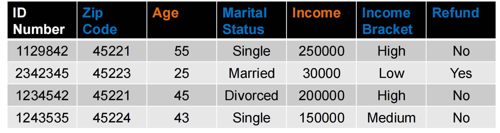

VS.

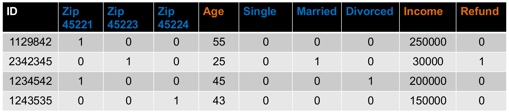

Sometimes it is convenient to represent numerical attributes as **categorica**l.

有时将数值属性表示为分类变量更为便捷。

- Group the values of the numerical attributes into **bins**

  将数值属性的值分组到各个**区间**中。

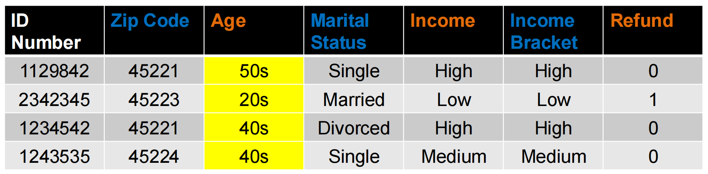

### Binning 分区

- Idea: split the range of the domain of the numerical attribute into bins (intervals).

  概念：将数值属性的定义域范围划分为若干区间（或称分箱）。

- Every bucket defines a categorical value

  每个桶定义一个分类值。

- How do we decide the number of bins?

  我们如何确定分组数量？

  - Depends on the granularity of the data that we want

    取决于我们所需数据的粒度

  - Sometimes domain knowledge is also used

    有时也会用到领域知识。

### Bucketization 分桶化

- How do we decide the size of the bucket?

  我们如何决定桶的大小？

  - Depends on the data and our application

    取决于数据本身和我们的实际应用

- **Equi-width bins**: All bins have the same size

  等宽分箱：所有箱体具有相同的宽度。

  - Example: split time into decades

    例如：以十年为基准分割时间

  - Problem: some bins may be very sparse or empty

    但是有些桶可能数据分布非常松散或者为空

- **Equi-size (depth) bins**: Select the bins so that they all contain the same number of elements

  **等深分箱法**：选择分箱方式，使得每个箱中包含相同数量的元素。

  - This splits data into quantiles: top-10%, second 10% etc

    将数据按分位数划分：前10%、第二个10%等。

  - Some bins may be very small

    某些区域可能非常小

- **Equi-log bins**: log 𝑒𝑛𝑑 − log 𝑠𝑡𝑎𝑟𝑡 is constant

  **等对数区间**：对数结束值减去对数起始值保持恒定。

  - The size of the previous bin is a fraction of the current one

    前一个箱体的大小是当前箱体的一部分。

  - Better for skewed distributions

    更适合偏态分布

- **Optimized bins**: Use a 1-dimensional clustering algorithm to create the bins

  **优化分组**：采用一维聚类算法创建分组

#### Example

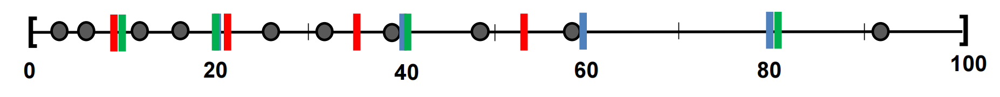

Blue: Equi-width [20,40,60,80]

Red: Equi-depth (2 points per bin)

Green: Equi-log ($\frac{end}{start} = 2$)

### Physical Data Storage 物理数据存储

- Stored in a **Relational Database**

  存储于**关系型数据库**中

  - Assumes a strict **schema** and relatively **dense** data (few missing/Null values)

    假设采用严格的模式且数据相对密集（缺失/空值较少）。

- **Tab or Comma separated files** (TSV/CSV), Excel sheets, relational tables

  制表符或逗号分隔文件（TSV/CSV）、Excel表格、关系表

  - Assumes a strict schema and relatively dense data (few missing/Null values)

    假设采用严格的数据模式且数据相对密集（缺失值或空值较少）

- Flat file with triplets (record id, attribute, attribute value)

  包含三元组（记录标识符、属性、属性值）的平面文件

  - A very flexible data format, allows multiple values for the same attribute (e.g., phone number)

    一种非常灵活的数据格式，允许同一属性（例如电话号码）拥有多个值。

- JSON, XML format

  - Standards for data description that are more flexible than relational tables

    比关系表更灵活的数据描述标准

  - There exist parsers for reading such data.

    存在用于读取此类数据的解析器。

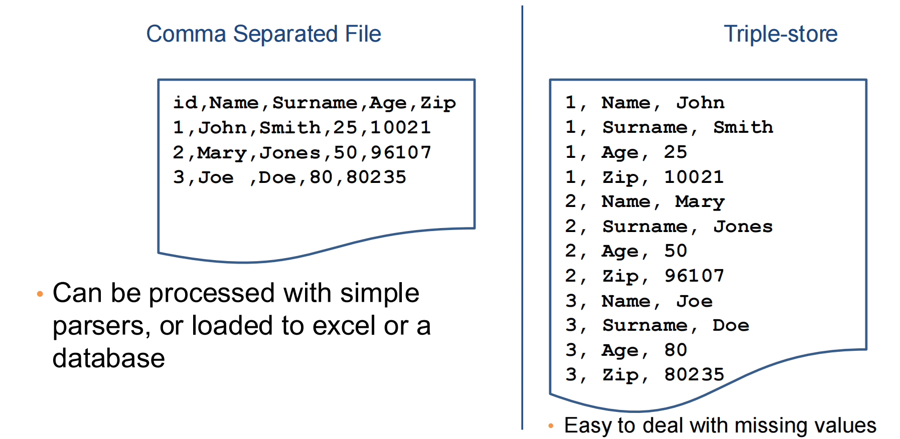

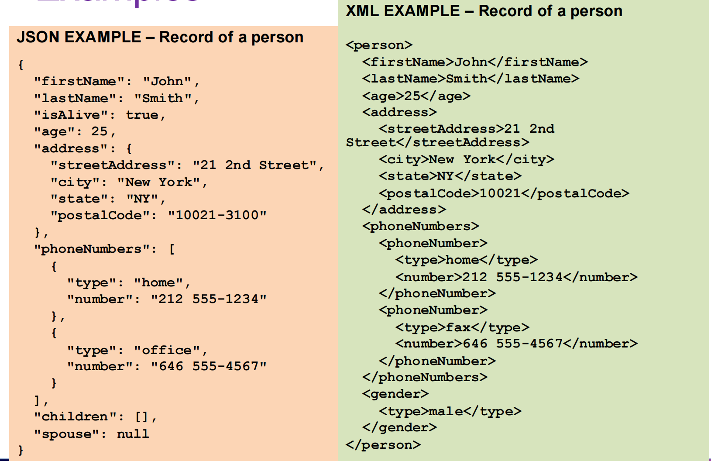

### JSON Databases JSON数据格式

- There are specialized Databases for semi-structured data such as 

  存在专为半结构化数据设计的数据库类型，例如

  JSON data

  - Commonly used DBs:

- MongoDB

  - CouchDB

  - MySQL

- The query language is very similar to SQL used for relational data.

  查询语言与用于关系数据的SQL极为相似。

### Beyond Relational Data: Set Data 超越关系型数据：集合数据

- Each record is a set of items from a space of possible items

  每条记录都是来自可能项空间中的一个项集。

- Example: Transaction data

  例如：交易数据

  - Also called market-basket data

    亦称为市场篮子数据。

- Example: Document data

  示例：文档数据

  - Also called bag-of-words representation

    亦称为词袋表示法。

#### Vector representation of market-basket data 市场篮子数据的矢量表示

- Market-basket data can be represented, or thought of, as numeric vector data

  市场篮子数据可以被表示或视为数值向量数据。

  - The vector is defined over the set of all possible items

    该向量定义在所有可能的项目集合上。

  - The values are binary (the item appears or not in the set)

    这些值是二元的（项目在集合中出现或不出现）。

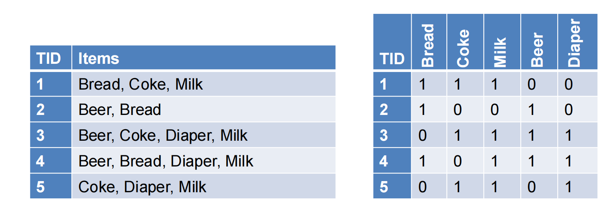

Sparsity: Most entries are zero. Most baskets contain few items

稀疏性：大多数条目为零。大多数购物篮中仅含少量商品。

#### Vector representation of document data 文档数据的向量表示

- Document data can be represented, or thought of, as numeric vector data

  文档数据可以表示为，或被视为数值向量数据。

  - The vector is defined over the set of all possible words

    向量是在所有可能词汇的集合上定义的。

  - The values are the counts (number of times a word appears in the document)

    数值代表词频（即某个词汇在文档中出现的次数）。

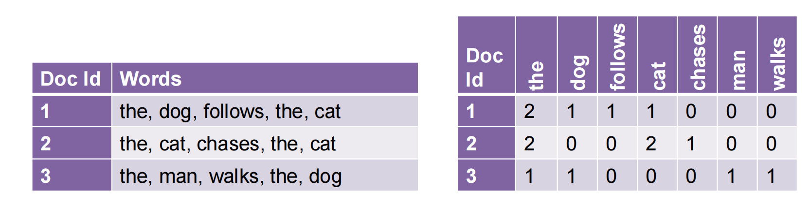

Sparsity: Most entries are zero. Most documents contain few of the words

稀疏性：大多数条目为零。大多数文档仅包含少量词汇。

### Physical Data Storage 物理数据存储

- Usually set data is stored in flat files

  通常，集合数据存储在平面文件中。

  - One line per set

    每行一组

### Dependent Data 依赖数据

- In tables we usually consider each object independent of each other.

  在表格中，我们通常认为各个对象彼此独立。

- In some cases, there are explicit **dependencies** between the data

  在某些情况下，数据之间存在着明确的依赖关系。

  - **Ordered/Temporal data**: We know the time order of the data

    有序/时序数据：我们知道数据的时间顺序。

  - **Spatial data**: Data that is placed on specific locations

    空间数据：位于特定地理位置的数据。

  - **Spatiotemporal data**: data with location and time

    时空数据：包含位置和时间信息的数据

  - **Networked/Graph data**: data with pairwise relationships between entities

    网络/图数据：指实体间存在成对关系的数据。

#### Ordered Data 有序数据

- Genomic sequence data 基因组序列数据

- Data is a long ordered string 数据是一个长的有序字符串

- Time series 时间序列

  - Sequence of ordered (over “time”) numeric values.

    按时间顺序排列的数值序列。

- Sequence data: Similar to the time series but in this case, we have categorical values rather than numerical ones.

  序列数据：与时间序列类似，但此处涉及的是分类值而非数值型数据。

  - Example: Event logs

    例如：事件日志

#### Spatial Data 空间数据

-  Attribute values that can be arranged with geographic co-ordinates

  可依据地理坐标进行排列的属性值

  - Measurements of temperature/pressure in different locations.

    不同位置的温度/压力测量。

  - Sales numbers in different stores

    各门店销售数据

  - The majority party in the country states (categorical)

    该国多数政党（明确地）声明

- Such data can be nicely visualized.

  此类数据可以很好地可视化。

#### Spatiotemporal Data 时空数据

- Data that have both spatial and temporal aspects

  具有时空双重属性的数据

  - Measurements in **different locations over time** 

    随时间推移在不同地点进行的测量

    - Pressure, Temperature, Humidity

      压力，温度，湿度

  - Measurements that **move in space over time**

    随空间位置变化而动态测量的数据

    - Traffic, **Trajectories** of moving objects

      交通：移动物体的轨迹

#### Graph Data 图像数据

- Graph data: a collection of **entities** and their **pairwise relationships**. 

  图数据：一组实体及其两两关系的集合。

- Examples:

  - Web pages and hyperlinks

    网页与超链接

  - Facebook users and friendships

    Facebook用户与好友关系

  - The connections between brain neurons

    大脑神经元之间的连接

  - Genes that regulate each other

    调控彼此的基因

- In this case the data consists of **pairs**:

  在这种情况下，数据由成**对**组成：

  - Who links to whom 

    谁链接到谁

  - We may have **undirected** links

    我们可能拥有无向链接。

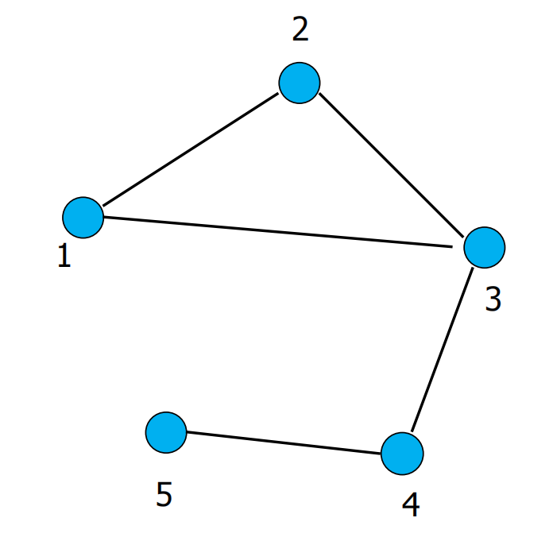

- In this case the data consists of **pairs**:

  在这种情况下，数据由成**对**组成：

  - Who links to whom

    谁链接到谁

  - Or **directed** links

    可能是有向的连接

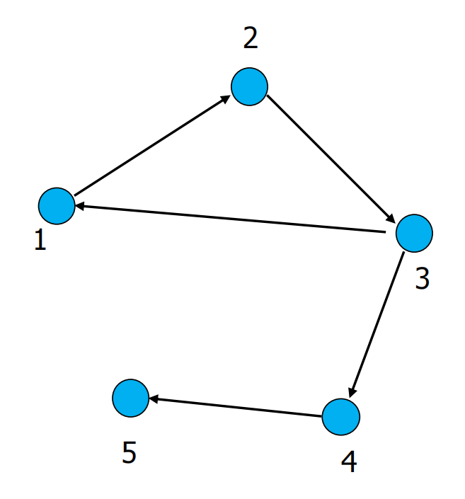

#### Representation

- Adjacency matrix 邻接矩阵

  - Very sparse, very wasteful, but useful conceptually

    极为稀疏，极其浪费，但在概念层面上却颇为实用。

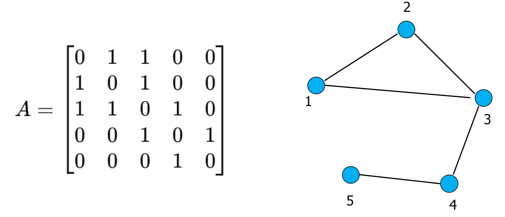

- Adjacency list

  邻接列表

  - Not so easy to maintain

    不容易维护

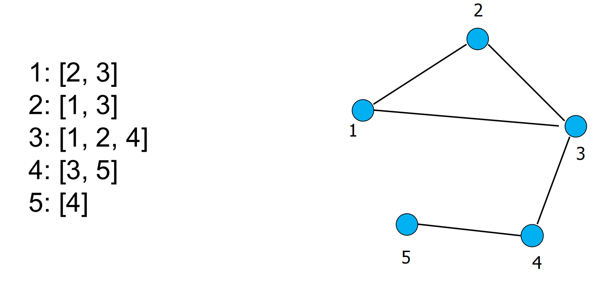

- List of pairs

  配对列表

  - The simplest and most efficient representation

    最简单且高效的表达方式

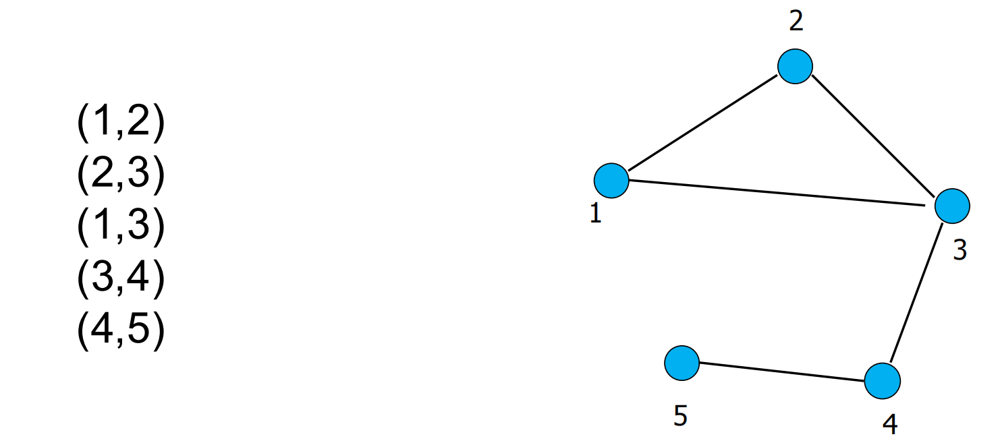

## Types of data: summary

- Numeric data: Each object is a point in a multidimensional space

  数值数据：每个对象均为多维空间中的一个点。

- Categorical data: Each object is a vector of categorical values

  分类数据：每个对象都是一个分类值向量。

- Set data: Each object is a set of values (with or without counts)

  数据集：每个对象为一组值（可含计数或不含）。

  - Sets can also be represented as binary vectors, or vectors of counts

    集合也可以用二进制向量或计数向量来表示。

- Dependent data:

  相关数据：

  - Ordered sequences: Each object is an ordered sequence of values.

    有序序列：每个对象都是一个值的有序序列。

  - Spatial data: objects are fixed on specific geographic locations

    空间数据：对象固定于特定的地理位置。

  - Graph data: A collection of pairwise relationships

    图数据：成对关系的集合

- The data matrix:

  数据矩阵

  - In almost all types of data we can find a way to transform the data into a matrix, where the rows correspond to different records, and the columns to numeric attributes

    几乎在所有类型的数据中，我们都能找到将数据转换为矩阵的方法，其中行对应不同的记录，列对应数值属性。

