# 3 Data Mining Pipeline 数据挖掘管道

The data mining pipeline: collection, preprocessing, mining, and post-processing

数据挖掘流程：收集、预处理、挖掘与后处理

Sampling, feature extraction and normalization

采样、特征提取与归一化

Essentially, anything that has to do with data is data mining

本质上，任何与数据相关的活动都属于数据挖掘范畴。

可以回顾一下第二周中最后提到的"Types of data"中的5种类型

## Introduction of data mining pipeline

**Data collection → Data preprocessing → data analysis → Result post-processing**

本节课重点关注 **Data Analysis** 部分的内容：用于从数据中提取有效信息的方法或者算法

## Data Collection 数据收集

这是个难题，本课程将不作重点讨论。

Collecting the data is the start of the Data Mining pipeline

数据收集是数据挖掘流程的起点。

### The different ways of obtaining data 获取数据的不同方式

- Generate your own data

  生成您自己的数据

  - Data may be generated through logging of a process, or some other activity (e.g., scientific measurements)

    数据可通过流程记录或其他活动（如科学测量）生成。

  - Important to collect the right amount of information. 

    重要的是收集适量的信息。

- Use existing collections

  使用现有集合

  - Today there are a lot of data collections available online

    如今网上有大量可用的数据集合。

  - Open data, corporate data releases, Wikis, scientific data sharing

    开放数据、企业数据发布、维基、科学数据共享

  - Existing data collections are subject to some choices made by the creator of the collection

    现有数据收集内容会受到收集者所做选择的影响。

- Obtaining data online

  在线获取数据

  - Public APIs: A lot of online platforms (e.g., Twitter) provide APIs for accessing their data (under several restrictions). You obtain structured data fast

    公共API：许多在线平台（例如Twitter）提供用于访问其数据的API（附带若干限制）。您可以快速获取结构化数据。

  - Crawling & Scraping: Use a program that traverses web pages and downloads them (crawling), and then extracts the useful content from them (scraping)

    网络爬取与抓取：使用程序遍历网页并下载内容（爬取），然后从中提取有用信息（抓取）。

    - You should follow the politeness etiquette when crawling. 

      进行网络爬取时应遵循礼貌规范。

    - Messy and not so robust, as page layouts change often

      爬虫的方式杂乱且不够稳健，因为页面布局经常变动。

  ### Data Labels 数据标签

- For many supervised learning tasks (classification), you need labeled data, which will be used for training and testing 

  对于许多监督学习任务（如分类），您需要带有标注的数据，这些数据将用于训练和测试阶段。

- Examples: 案例

  - For a collection of tweets, label them as offensive or not

    对一组推文进行标注，判断其是否具有攻击性。

  - For a collection of sentences label them as having a positive, negative, or neutral sentiment towards a specific item

    对于一组句子，根据它们对特定项目的情感倾向标注为积极、消极或中性。

- For a collection of search results, label them as relevant or not relevant to the query

  对于一组搜索结果，根据其与查询的相关性标注为相关或不相关。

- These labels constitute the **“ground truth”** that we are trying to predict.

  这些标签构成了我们试图预测的**"真实基准"**。

- Obtaining such labels is a difficult task that usually requires manual work. 

  获取此类标签是一项艰巨的任务，通常需要人工完成。

  - Companies employ workers for this task

    公司雇佣工人来完成这项任务。

## Preprocessing 预处理

- Preprocessing: Real data is large, noisy, incomplete and inconsistent. We need to preprocess it before we use it

  预处理：真实数据具有规模大、噪声多、不完整且不一致的特点。在使用前我们需要对其进行预处理。

- The preprocessing step determines the input to the data mining algorithm

  预处理步骤决定了数据挖掘算法的输入内容。

- It is often the most important step for the analysis

  这通常是分析中最关键的一步。

- A dirty work, but someone has to do it.

  这活儿不光彩，但总得有人干。

### Preprocessing steps 预处理步骤

- Reducing the data: Sampling, Dimensionality Reduction

  数据约简：采样与降维

- Data cleaning: deal with missing or inconsistent information

  数据清洗：处理缺失或不一致的信息

- Feature extraction and selection: create a useful representation of the data by extracting useful features

  特征提取与选择：通过提取有效特征构建数据的实用表征

## Sampling –Dimensionality Reduction 维度归约

- Sampling is the main technique employed for data selection.

  采样是数据选择所采用的主要技术。

  - It is often used for both the preliminary investigation of the data and the final data analysis.

    它通常用于数据的初步调查以及最终的数据分析。

- Statisticians sample because obtaining the entire set of data of interest is too expensive or time consuming.

  统计学家进行抽样是因为获取全部感兴趣的数据集成本过高或耗时太久。

  - Example: What is the average height of a person in Greece?

    希腊人的平均身高是多少？

    - We cannot measure the height of everybody 我们不可能去测量所有人的身高

- Sampling is used in data mining because processing the entire set of data of interest is too expensive or time consuming.

  在数据挖掘中采用抽样方法，是因为处理全部目标数据集的成本过高或耗时过长。

  - Example: We have 1M documents. What fraction of pairs has at least 100 words in common?

    示例：我们有100万份文档。其中有多少比例的文档对拥有至少100个相同词汇？

    - Computing number of common words for all pairs requires $10^{12}$ comparisons

      计算所有词对共有词汇数量需要进行 $10^{12}$ 次比较

  - Example: What fraction of tweets in a year contain the word “Greece”?

    一年中带有“希腊”一词的推文占多大比例？

    - 500M tweets per day, if 100 characters on average, 86.5TB to store all tweets

      每天5亿条推文，按平均每条100字符计算，存储所有推文需86.5TB空间

- The key principle for effective sampling is the following: 

  有效抽样的关键原则如下：

  - using a sample will work almost as well as using the entire data sets, if the sample is representative

    如果样本具有代表性，使用样本的效果几乎与使用整个数据集相当。

  - A sample is representative if it has approximately the same property (of interest) as the original set of data 

    当样本具有与原始数据集大致相同的（关注）属性时，该样本即具有代表性。

  - Otherwise, we say that the sample introduces some **bias** 

    否则，我们认为该样本存在一定的**偏差**。

  - What happens if we take a sample from the university campus to compute the average height of a person at Ioannina?

    如果我们从大学校园抽取样本来计算约阿尼纳人的平均身高会怎样？

### Types of Sampling 抽样的类型

- **Simple Random Sampling**

  简单随机抽样

  - There is an equal probability of selecting any particular item

    选择任何特定项目的概率均等。

- **Sampling without replacement**

  无放回抽样

  - As each item is selected, it is removed from the population

    每选中一个项目，该选项就会从总体中移除。

- **Sampling with replacement**

  有放回抽样

  - Objects are not removed from the population as they are selected for the sample. 

    样本选取过程中，总体中的对象不会被移除。

    - In sampling with replacement, the same object can be picked up more than once. This makes analytical computation of probabilities easier

      在有放回抽样中，同一对象可被重复选取。这使得概率的解析计算更为简便。

    - E.g., we have 100 people, 51 are women **P(W) = 0.51, 49** men **P(M) = 0.49**. If I pick two persons what is the probability **P(W,W)** that both are women? 

      - Sampling with replacement: **P(W,W) = 0.512**

      - Sampling without replacement: **P(W,W) = 51/100 * 50/99**

- Stratified sampling

  分层抽样

  - Split the data into several groups; then draw random samples from each group.

    将数据划分为若干组；然后从每组中抽取随机样本。

    - Ensures that all groups are represented.

      确保所有群体都得到代表。

  - Example 1. I want to understand the differences between legitimate and fraudulent credit card transactions. 0.1% of transactions are fraudulent. What happens if I select 1000 transactions at random?

    示例1：我想了解合法信用卡交易与欺诈交易之间的差异。已知欺诈交易占比为0.1%。若随机抽取1000笔交易，将出现怎样的情况？

    - I get 1 fraudulent transaction (in expectation). Not enough to draw any conclusions. Solution: sample 1000 legitimate and 1000 fraudulent transactions

      预期出现1次欺诈交易。尚不足以得出任何结论。解决方案：抽取1000笔正常交易和1000笔欺诈交易作为样本。

    - Probability Reminder: If an event has probability p of happening and I do N trials, the expected number of times the event occurs is pN

      概率提示：若某事件发生的概率为p，进行N次试验后，该事件发生的期望次数为pN。

  - Example 2. I want to answer the question: Do web pages that are linked have on average more words in common than those that are not? I have 1M pages, and 1M links, what happens if I select 10K pairs of pages at random?

    示例2：我想要解答这个问题：相互链接的网页是否比未链接的网页平均具有更多共同词汇？我拥有100万个网页和100万个链接，如果随机选取1万对网页进行比对，结果会如何？

    - Most likely I will not get any links. 

      我多半不会得到任何链接。

    - Solution: sample 10K random pairs, and 10K links

      解决方案：随机抽样1万对样本和1万个链接

### Biased sampling 偏性抽样

- Sometimes we want to bias our sample towards some subset of the data

  有时我们希望样本偏向数据的某个子集

  - Stratified sampling is one example

    分层抽样是一个例子。

- Example: When sampling temporal data, we want to increase the probability of sampling recent data

  在时序数据采样过程中，我们需要提高对近期数据的采样概率。

  - Introduce **recency bias**  

    **近期偏好**介绍

- Make the sampling probability to be a function of time, or the age of an item

  使抽样概率成为时间或项目存续时长的函数。

  - Typical: Probability decreases exponentially with time

    典型情况：概率随时间呈指数级下降。

  - For item $x_t$ after time $t$ select with probability $p(x_t) \propto e^{-t}$?

### A data mining challenge 一项数据挖掘挑战

- You have N items and you want to sample one item uniformly at random. How do you do that?

  你拥有N件物品，想要从中均匀随机抽取一件，该如何操作？

- The items are coming in a stream: you do not know the size of the stream in advance, and there is not enough memory to store the stream in memory. You can only keep a constant amount of items in memory

  数据项以流的形式持续到达：你无法预知数据流的总规模，且内存空间不足以容纳整个数据流。你只能在内存中保持恒定数量的数据项。

- How do you sample?

  你如何进行采样？

  - Hint: if the stream ends after reading k items the last item in the stream should have probability 1/k to be selected.

    提示：若数据流在读取k个项目后结束，则流中的最后一个项目被选中的概率应为1/k。

- Reservoir Sampling:

  蓄水池抽样：

  - Standard interview question for many companies

    许多公司的标准面试问题

#### Reservoir Sampling 蓄水池抽样法

- Algorithm (in plain English): 算法（通俗解释）：

  - Obtain the items from the stream one at the time

    从流中逐个获取项目

  - Select the 1st item and store it

    选择第一项并存储

  - When seeing the k-th item select it with probability 1/k and replace the existing selection.

    当看到第k项时，以1/k的概率选择它并替换现有选项。

- The algorithm stores only one item, and one integer number (the number of items seen so far)

  该算法仅存储一个项目及一个整数（即当前已处理的项目总数）。

#### Reservoir sampling proof 水库抽样证明

- **Claim**: Every item has probability 1/N to be selected after N items have been read.

  声明：在读取N个项目后，每个项目被选中的概率均为1/N。

- Proof

  - What is the probability of the **k-th** item to be selected when seen for the first time?

    当第一次看到第k个项目时，它被选中的概率是多少？

    - $P(k \space item \space selected \space when \space first \space seen) = \frac{1}{k}$ $P(k \space selected)$

  - What is the probability of the selected item to survive round **m**:

    - $P(kselected \space item \space survives \space round \space m ) = (1 - \frac{1}{m}) = \frac{m-1}{m}$   $(P(survive m))$

  - The probability that the **k-th** item is selected after **N** items are seen

    在看到 N 个项目后选中第 k 个项目的概率

    - $$
      \begin{align*}
      \color{purple}
      P(k \text{ item selected after N roudns})
      &= P(k \text{ selected})P(k \text{ survives } \textit{until} \text{ round N}) \\
      &= P(k \text{ selected})P(k \text{ survives } k+1)P(k \text{ survives } k+2) \cdots P(k \text{ survives N})
      \\
      &= \frac{1}{k}\frac{k}{k+1}....\frac{N-1}{N}
      \\
      &= \frac{1}{N}
      \end{align*}
      $$

  - The proof holds **for any k, 1 ≤ k ≤ N**
  
    该证明对任意k（1 ≤ k ≤ N）均成立。

#### Proof by Induction 归纳证明

- We want to show that the probability the **k-th** item is selected after **n ≥ k** items have been seen is $\frac{1}{n}$?

- Induction **on the number of rounds** n

  基于轮数n的归纳

  - **Base of the induction**: For **n = k**, the probability that the **k-th** item is selected is the probability that it is selected when first seen: $\frac{1}{k}$

    归纳基础：当 n = k 时，第 k 个元素被选中的概率等于首次遇见时被选中的概率：$\frac{1}{k}$

  - **Inductive Hypothesis**: Assume that the hypothesis is true for **n = m, m ≥ k**:

    归纳假设：假设该假设对n = m（m ≥ k）成立：

    - The probability that the **k-th** item is selected at round m is $\frac{1}{m}$

      在第m轮选中第k个项目的概率为$\frac{1}{m}$

  - **Inductive Step**: The probability that the **k-th** item is still selected at round **n = m + 1** items is

    归纳步骤：第k个项目在第n = m + 1轮仍被选中的概率为

    $$ \color{purple} P(k \text{ selected at round } m)P(k \text{ survives } m) = \frac{1}{m}\left(1 - \frac{1}{m+1}\right) = \frac{1}{m+1} $$

### Dimensionality Reduction 维度规约

- Sampling reduces the number or records. We can also reduce the dimension of the data, the number of attributes

  抽样可减少记录数量。我们还可以降低数据的维度，即属性数量。

- Real data is **high-dimensional**: typically it has several hundreds, thousands, or even million of attributes.

  真实数据通常是高维度的：一般具有数百、数千甚至数百万个属性。

  - Documents represented as vectors of word counts (millions)

    文档表示为词频计数向量（百万级）

  - Facebook users represented as vectors of friends (billions)

    Facebook用户以好友向量形式表示（数十亿量级）

  - Customers represented as vectors of products (hundreds of thousands)

    客户以产品向量形式表示（数十万量级）

- Data is extremely sparse and noisy

  数据极其稀疏且充满噪声。

- Dimensionality reduction aims to:

  降维旨在：

  - Reduce the amount of data

    减少数据量

  - Extract the useful information.

    提取有用信息。

#### Example 降维案例

Consider the following 6-dimensional dataset

考虑如下的6维数据集

$$ D = \begin{bmatrix}
1 & 2 & 3 & 0 & 0 & 0 \\
2 & 4 & 6 & 0 & 0 & 0 \\
0 & 0 & 0 & 1 & 2 & 3 \\
0 & 0 & 0 & 2 & 4 & 6 \\
1 & 2 & 3 & 1 & 2 & 3 \\
2 & 4 & 6 & 2 & 4 & 6
\end{bmatrix} $$

- Each row is a multiple of two vectors

  每一行都是两个向量的倍数。

  - x = [1, 2, 3, 0, 0, 0]

  - y = [0, 0, 0, 1, 2, 3]

- We can rewrite D as

  我们可以将D重写为：

  - $$ D = \begin{bmatrix}
    1 & 0 \\
    2 & 0 \\
    0 & 1 \\
    0 & 2 \\
    1 & 1 \\
    2 & 2
    \end{bmatrix}
    \begin{bmatrix}
    1 & 2 & 3 & 0 & 0 & 0 \\
    0 & 0 & 0 & 1 & 2 & 3
    \end{bmatrix} $$

## Data Cleaning 数据清洗

### Data Quality 数据质量

- Examples of data quality problems: 

  数据质量问题的示例：

  - **Noise** and **outliers**

    噪声与异常值

  - Missing values 

    缺失值

  - Duplicate data

    重复值

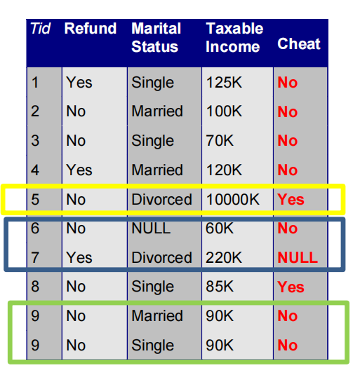

- The benefit of having a lot of data is that we can **throw out data** that we suspect are problematic or that we do not consider to be useful

  拥有大量数据的好处在于，我们可以剔除那些疑似存在问题或认为无用的数据。

- For example:

  - Throw out all records with missing values, or duplicate values.

    删除所有带有缺失值或重复值的记录。

  - Throw out **extreme**, or **atypical** cases

    排除极端或非典型案例

    - In database data, throw out records with outlier values

      在数据库数据中，剔除含有异常值的记录。

    - In social network data, keep only users with enough friends but not too many

      在社交网络数据中，仅保留拥有足够朋友数量但不过多的用户。

    - In tweet text data throw out tweets with less than 3 words

      在推文文本数据中，过滤掉少于3个词的推文。

    - In transaction data, throw out products (attributes) that are bought by everyone and products that are bought by very few

      在交易数据中，剔除那些被所有用户购买的产品（属性）以及仅被极少数用户购买的产品。

- We should always be careful not to throw out useful information.

  我们必须时刻注意避免丢弃有用的信息。

- Deal with compatibility issues

  处理兼容性问题

  - **Units** may be different in different parts of the data (centimeters vs meters, or meters vs feet)

    不同数据段中使用的计量单位可能存在差异（厘米与米，或米与英尺）。

  - **Time** measurements should be brought into the same time zone.

    时间测量应统一至同一时区。

  - Normalize **names**:

    标准化名称：

    - Panayiotis Tsaparas, P. Tsaparas, and P. N. Tsaparas are all the same person

      例如有时候虽然名字写法不同，但实际上代表的是一个人

  - Financial units should be normalized

    财务单位应当进行标准化处理。

    - Different currencies

      不同的货币

    - Prices over time

      随时间变化的价格

- Deal with **missing values**:

  处理**缺失值**

  - Ignore the data

    忽略数据

  - Replace with random value

    替换随机的值

    - Not a good idea, but you can understand how the missing value affects the output

      虽非良策，但能理解缺失值如何影响输出结果。

  - Replace with the mean

    替换为平均值

    - Relatively common practice.

      是比较普遍的做法

    - Should be careful for cases where this does not make sense (e.g., year of birth/death)

      需留意某些不合常理的情形（例如出生/逝世年份）。

  - Replace with nearest neighbor value

    替换为最近邻值

  - Replace with cluster mean

    替换为聚类均值

  - Infer the value

    推断该数值

### Example: Dealing missing data 处理缺失值

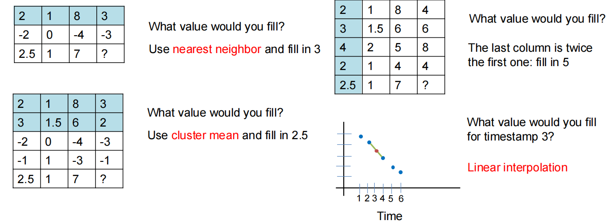

### Example: Deal with outliers 处理异常值

- Deal with outliers:

  处理异常值：

  - Remove them

    直接移除

  - Try to correct them using common sense

    根据常识尝试纠正

  - Transform the data

    转换数据

    - In some data (e.g., wealth, social media followers) extreme values are expected and interesting

      在某些数据（如财富、社交媒体粉丝数）中，极端值是可预期且具有研究意义的。

    - In such skewed distributions we typically use the logarithm of the values, or apply binning

      在此类偏态分布中，我们通常采用数值的对数变换或进行分箱处理。

When using the data, we should be careful of cases where our results are **too good to be true**, or **too bad to be true**

在使用数据时，我们应当警惕那些**好得难以置信**或**差得令人质疑**的结果。

## Feature Extraction 特征提取

### Data preprocessing: feature extraction 数据预处理：特征提取

- The data we obtain are not necessarily as a relational table

  我们获得的数据未必以关系表的形式呈现。

- Data may be in a very raw format

  数据可能处于非常原始的状态。

  - Examples: text, speech, mouse movements, etc

    示例：文本、语音、鼠标移动等

- We need to extract the features/attributes from the data and build the data matrix

  我们需要从数据中提取特征/属性，并构建数据矩阵。

- Feature extraction:

  特征提取：

  - Selecting the characteristics by which we want to represent our data

    选择用于表征数据的特征

  - It requires some domain knowledge about the data

    这需要一些关于数据的领域知识。

  - It depends on the application

    这取决于具体的应用场景。

- Deep learning: helps with this step.

  深度学习：有助于此步骤的实现。

### Text Data

- Data will often not be in a nice relational table

  数据通常不会以规整的关系表形式呈现。

- For example: Text data

  - We need to do additional effort to extract the useful information from the text data

    我们需要付出额外努力从文本数据中提取有用信息。

- We will now see some basic text processing ideas.

  接下来我们将探讨一些基础的文本处理概念。

### Decision 做决策

- When mining real data you often need to make some decisions

  在挖掘真实数据时，通常需要做出一些决策。

  - What data should we collect? How much? For how long?

    我们应收集哪些数据？收集多少？持续多久？

  - Should we throw out some data that does not seem to be useful?

    我们是否应该丢弃一些看似无用的数据？

    - Too frequent data (stop words), too infrequent (errors?), erroneous data, missing data, outliers

      数据过于频繁（停用词），数据过于稀疏（错误？），错误数据，缺失数据，异常值。

  - How should we weight the different pieces of data?

    我们应当如何权衡不同的数据？

- Most decisions are application dependent. Some information may be lost but we can usually live with it (most of the times)

  多数决策需视具体应用而定。某些信息可能会丢失，但通常我们能够接受这种情况（大多数情况下）。

- We should make our decisions clear since they affect our findings.

  鉴于我们的决策会影响研究结果，我们必须确保其明晰性。

- Dealing with real data is hard…

  处理真实数据颇为棘手……

### Text normalization  文本规范化

- Each review is a long string. We need to transform it into words

  每条评论都是一个长字符串，我们需要将其转换为单词。

- Basic preprocessing:

  基本预处理：

  - “normalize” the data (remove punctuation, make into lower case, clear white spaces, other?) 

    对数据进行“标准化”处理（去除标点符号、转换为小写、清除空格，以及其他？）

  - Break into words

    分解单词

- There are existing libraries that do these steps.

  已有现成的库可执行这些步骤。

- Some times we can break into n-grams, or combinations of words.

  有时我们可以将其分解为n元语法，即词语的组合形式。

#### First Cut

- Keep the most popular words

- Do simple processing to “normalize” the data (remove punctuation, make into lower case, clear white spaces, other?) 
- Break into words, keep the most popular words

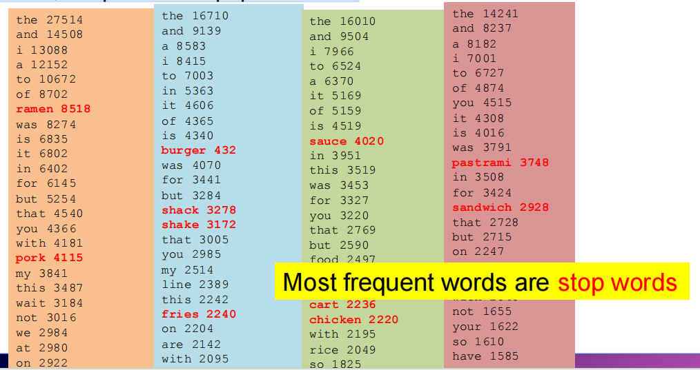

#### Sceond cut

- Remove stop words

  移除上面的 stop word

  - Stop-word lists can be found online.
  - 针对频繁使用在所收集到的评论中的单词，我们实际上也不感兴趣

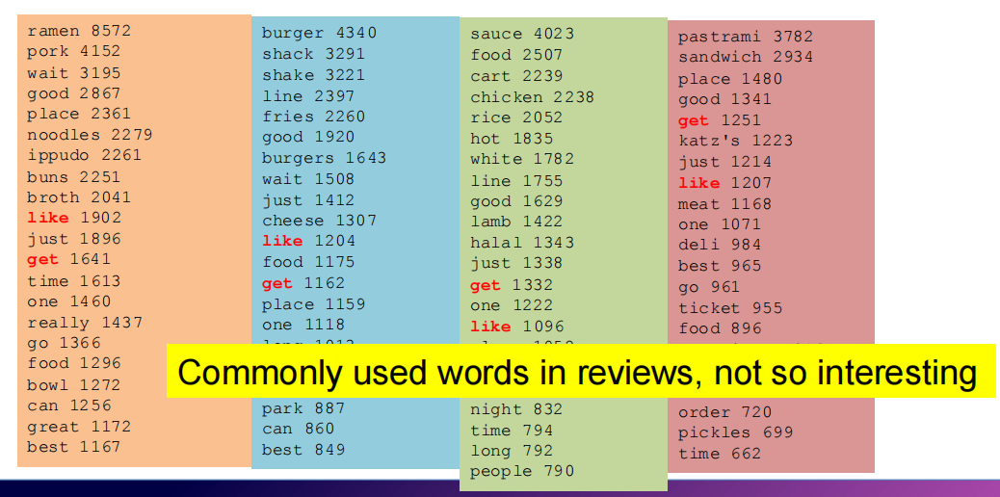

#### IDF Inverse Document Frequency 逆文档频率

- Important words are the frequent words that are unique to the document (differentiating) compared to the rest of the collection

  关键词是在文档中频繁出现，且与语料库中其他文档相比具有独特性（即区分性）的词汇。

  - All reviews use the word “like”. This is not interesting

    所有评论都用了“喜欢”这个词。这并不有趣。

  - We want the words that characterize the specific restaurant

    我们希望得到能体现该餐厅特色的描述词语。

- Document Frequency DF(w): fraction of documents that contain word w

  文档频率DF(w)：包含词w的文档所占的比例

  - $DF(w) = \frac{D(w)}{D}$
  - $D(w)$: num of docs that contain word
  - $D$: total number of documents

- Inverse Document Frequency IDF(w):
  - $IDF(w): log(\frac{1}{DF(w)})$

- Maximum when unique to one document : $𝐼𝐷𝐹(𝑤) = log(𝐷)$

  在一份文档中唯一时的最大值

- Minimum when the word is common to all documents: $𝐼𝐷𝐹(𝑤) = 0$

  当该词在所有文档中均出现时的最小值

#### TF-IDF

- The words that are best for describing a document are the ones that are **important for the document**, but also **unique to the document**.

  最适合描述文档的词语，既要对文档至关重要，也要具有独特性。

- **TF(w, d)**: term **frequency** of word w in document d

  TF(w, d): 词语 w 在文档 d 中的词频

  - Number of times that the word appears in the document

    该词语在文档中出现的次数

  - Natural measure of i**mportance** of the word for the document

    词语对文档重要性的自然度量

- **IDF(w)**: inverse document frequency

  IDF(w)：逆文档频率

  - Natural measure of the uniqueness of the word w

    词汇w独特性的自然度量

- $TF-IDF(w, d) = TF(w, d) \times IDF(w)$

#### Third cut

- Ordered by TF-IDF

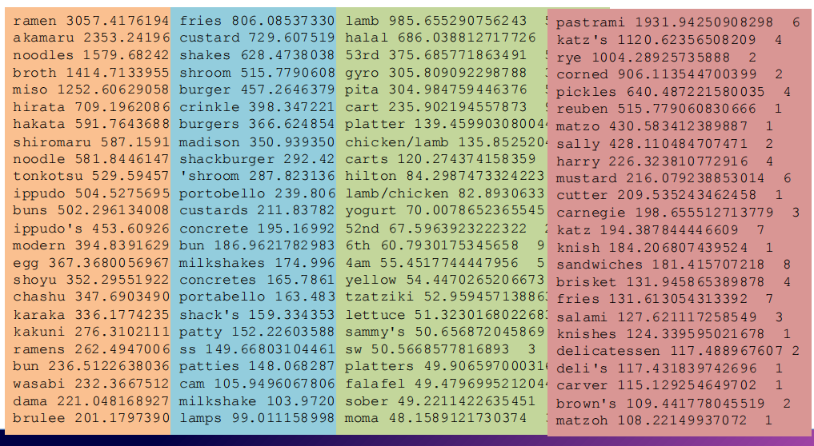

- TF-IDF takes care of stop words as well

  TF-IDF算法同样能够处理停用词问题。

- We do not need to remove the stopwords since they will get $IDF(w) = 0$

  我们无需移除停用词，因为它们对应的逆文档频率$IDF(w) = 0$。

- **Important**: IDF is **collection-dependent**

  具有集合依赖性

  - For some other corpus the words *get, like, eat*, may be important

    对于某些其他语料库而言，诸如get（获得）、like（喜欢）、eat（吃）等词汇可能具有重要性。

#### The preprocessing pipeline for our text mining task 流程

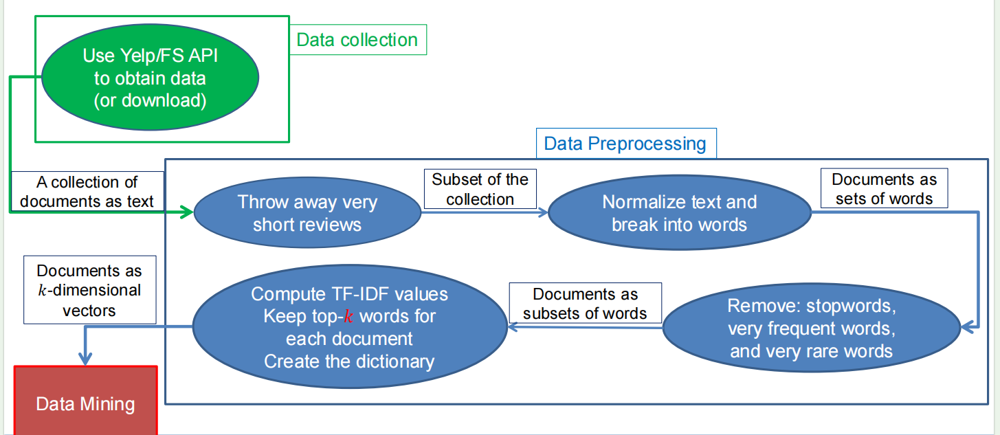

### Word and document representations 词与文档表征

- Using TF-IDF values has a very long history in text mining

  在文本挖掘领域，运用TF-IDF值的方法具有悠久的历史。

  - Assigns a numerical value to each word, and a vector to a document

    为每个词语赋予一个数值，为文档赋予一个向量。

- Recent trend: Use word embeddings

  近期趋势：采用词嵌入技术

  - Map every word into a multidimensional vector

    将每个词语映射为多维向量

- Use the notion of context: the words that surround a word in a phrase

  运用语境概念：即短语中围绕某个词语的周边词汇

  - Similar words appear in similar contexts

    相似词语出现在相似的语境中。

  - Similar words should be mapped to close-by vectors

    相似词汇应被映射至邻近的向量空间。

- Example: words “movie” and “film”

- Both words are likely to appear with similar words

  这两个词很可能伴随相似的词语出现。

  - director, actor, actress, scenario, script, Oscar, cinemas etc

    导演，演员，女演员，剧情，剧本，奥斯卡，影院等。

### word2vec

- Two approaches

  - CBOW: Learn an embedding for words so that given the context you can predict the missing word

    CBOW：学习词的嵌入表示，以便在给定上下文的情况下预测缺失的词。

    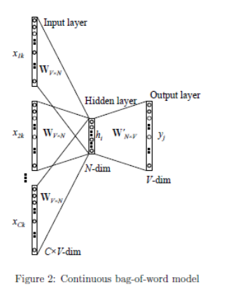

  - Skip-Gram: Learn an embedding for words such that given a word you can predict the context

    Skip-Gram：学习词语的嵌入表示，使得给定一个词语可以预测其上下文。

    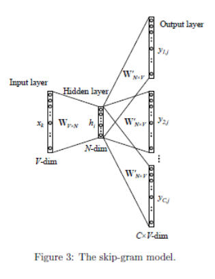

## Data Normalization 数据归一化

- In many cases it is important to normalize the data rather than use the raw values

  在许多情况下，对数据进行归一化处理比直接使用原始数值更为重要。

- The kind of normalization that we use depends on what we want to achieve

  我们所采用的标准化方式取决于我们期望达成的目标。

### Column Normalization 列归一化

- In this data, different attributes take very different range of values. For distance/similarity the small values will disappear

  在这组数据中，不同属性的取值范围差异显著。就距离/相似性而言，较小的数值将会消失不见。

- We need to make them comparable

  我们需要使它们具有可比性

Table 1

| Temperature | Humandity | Pressure |
| ----------- | --------- | -------- |
| 30          | 0.8       | 90       |
| 32          | 0.5       | 80       |
| 24          | 0.3       | 95       |

- Divide (the values of a column) by the maximum value for each attribute

  将（某列的数值）分别除以其各属性的最大值

  - Brings everything in the [0,1] range, maximum is 1

    将数值归一化至[0,1]区间，最大值为1

    Table 2

    | Temperature | Humandity | Pressure |
    | ----------- | --------- | -------- |
    | 0.9375      | 1         | 0.9473   |
    | 1           | 0.625     | 0.8421   |
    | 0.75        | 0.375     | 1        |

  - **new value = old value / max value in the column**

- Subtract the minimum value and divide by the difference of the maximum value and minimum value for each attribute

  对每个属性减去最小值并除以最大值与最小值的差值。

  - Brings everything in the [0,1] range, maximum is one, minimum is zero

    所有值都在[0，1]范围内，最大值为1，最小值为0

- **Subtract** the **mean value** for each column – centering of features

  减去每列的平均值——特征中心化处理

  - All columns have **mean zero**

    所有列的平均值为零。

    Mean value of original data (Table 1): **Temperature: 28.67; Humandity: 0.53; Pressure: 88.33**

    Table 3

    | Temperature | Humandity | Pressure |
    | ----------- | --------- | -------- |
    | 1.33        | 0.27      | 1.67     |
    | 3.33        | -0.03     | -8.33    |
    | -4.67       | -0.23     | 6.67     |

  - **new value = (old value – avg column value)**

- **Subtract** the **mean value** for each column – **centering** of features

  对每列减去均值——特征中心化处理

  - All columns have mean zero

- **Divide** with the length of the **centered** column vector

  除以中心化列向量的长度

  - All columns are **unit vectors**

    所有列均为单位向量。

  - Mean value of original data (Table 1): **Temperature: 28.67; Humandity: 0.53; Pressure: 88.33**
  - Length of original data (Table 3): **Temperature: 5.89; Humandity: 0.36; Pressure: 10.80**

  Table 4

  | Temperature | Humandity | Pressure |
  | ----------- | --------- | -------- |
  | 0.23        | 0.75      | 0.15     |
  | 0.57        | -0.09     | -0.77    |
  | -0.79       | -0.66     | 0.62     |

  - new value = $\frac{\text{old value - mean value}}{\sqrt{\sum{(\text{old value}_i \text{- mean value})^2}}}$

- **Subtract** the mean value for each column – centering of features

  减去每列的平均值——特征中心化

  - All columns have mean zero

- **Divide** with the standard deviation of the column vector

  除以列向量的标准差

  - Computes the z-score

    计算z分数

  - Number of standard deviations away from the mean

    偏离平均值的标准差数

  - Mean value of original data (Table 1): **Temperature: 28.67; Humandity: 0.53; Pressure: 88.33**

  - STD of Table 1: **Temperature: 3.40; Humandity: 0.21; Pressure: 6.24**

  - $$
    \begin{align*}
    \text{mean}(x) &= \frac{1}{N} \sum_{j=1}^{N} x_j \\
    \text{std}(x) &= \sqrt{\frac{\sum_{j=1}^{N} (x_j - \text{mean}(x))^2}{\color{red}{N}}} \\
    \text{Z-score: } z_i &= \frac{x_i - \text{mean}(x)}{\text{std}(x)}
    \end{align*}
    $$

  - **new value** = $\frac{\text{old value - mean value}}{\text{standard deviation}}$

### Row Normalization 行归一化

Are these documents similar?

这几个文档相似吗

Table 5

|       | Wrod 1 | Word 2 | Word 3 |
| ----- | ------ | ------ | ------ |
| Doc 1 | 28     | 50     | 22     |
| Doc 2 | 12     | 25     | 13     |

- Divide by the sum of values for each document (row in the matrix)

  将结果除以每个文档（矩阵中的行）的数值总和。

  - Transform a vector into a distribution*

    将向量转换为分布*

  - *For example, the value of cell (Doc1, Word2) is the probability that a randomly chosen word of Doc1 is Word2

    例如，单元格（Doc1, Word2）的数值表示从Doc1中随机选取一个单词，该单词恰好是Word2的概率。

    Table 5

    |       | Word 1 | Word 2 | Word 3 |
    | ----- | ------ | ------ | ------ |
    | Doc 1 | 0.28   | 0.5    | 0.22   |
    | Doc 2 | 0.24   | 0.5    | 0.26   |

  - **new value = old value / Σ old values in the row**

Do these two users rate movies in a similar way?

这两位用户对电影的评价方式相似吗？

Table 6 (Original table)

|        | Movie 1 | Movie 2 | Movie 3 |
| ------ | ------- | ------- | ------- |
| User 1 | 1       | 2       | 3       |
| User 2 | 2       | 3       | 4       |

- Subtract the mean value for each user (row) – centering of data

  减去每个用户（行）的均值——数据居中处理

  - Captures the deviation from the average behavior

    捕捉偏离平均行为的偏差

  - Mean value of users (Table 6): **User 1: 2; User 2: 3**

    Table 7

    |        | Movie 1 | Movie 2 | Movie 3 |
    | ------ | ------- | ------- | ------- |
    | User 1 | -1      | 0       | +1      |
    | User 2 | -1      | 0       | +1      |

  - **new value = (old value – mean row value) [/ (max row value –min row value)]**

  - **Z-score**: $$$ z_i = \frac{x_i - \text{mean}(x)}{\text{std}(x)} $$$

  - Average “distance” from the mean N may be N-1: population vs sample

    均值N的平均“距离”可能为N-1：总体与样本的差异

  - $$
    \begin{align*}
    \text{mean}(x) &= \frac{1}{N} \sum_{j=1}^{N} x_j \\
    \text{std}(x) &= \sqrt{\frac{\sum_{j=1}^{N} (x_j - \text{mean}(x))^2}{\color{red}{N}}}
    \end{align*}
    $$

Measures the **number of standard deviations away from the mean**

衡量与平均值相差的标准偏差数量

Table 8

|        | Movie 1 | Movie 2 | Movie 3 |
| ------ | ------- | ------- | ------- |
| User 1 | 1.01    | -0.87   | -0.22   |
| User 2 | -1.01   | 0.55    | 0.93    |

- Mean value of users (Table 8): **User 1: 3.33; User 2: 2.66**

- STD value of users (Table 8): **User 1: 1.53; User 2: 1.53**

  Table 9

  |        | Movie 1 | Movie 2 | Movie 3 | Mean | STD  |
  | ------ | ------- | ------- | ------- | ---- | ---- |
  | User 1 | 5       | 2       | 3       | 3.33 | 1.53 |
  | User 2 | 1       | 3       | 4       | 2.66 | 1.53 |

#### Softmax function Softmax函数

- What if we want to transform the scores into a probability distribution, but capture the single selection of the user?

  如果我们希望将分数转换为概率分布，但同时保留用户的单一选择，该如何实现？

  - We want most of the probability mass to a single (or a few) restaurants

    我们希望大部分概率质量集中于一家（或少数几家）餐厅。

- Use the softmax function

  使用softmax函数

  $$ \frac{e^{x_i}}{\sum_i e^{x_i}} $$

Table 10 (Original table)

|        | Resaurant 1 | Restaurant 2 | Restaurant 3 |
| ------ | ----------- | ------------ | ------------ |
| User 1 | 5           | 2            | 3            |
| User 2 | 1           | 3            | 4            |

Table 11

|        | Resaurant 1 | Restaurant 2 | Restaurant 3 |
| ------ | ----------- | ------------ | ------------ |
| User 1 | 0.72        | 0.10         | 0.18         |
| User 2 | 0.07        | 0.31         | 0.62         |

- What if we want to transform the score into a probability that the user will visit the restaurant again

  若要将评分转换为用户再次光临餐厅的概率，该当如何？

  - Different from “probability that the user will select one among the three”. 

    不同于“用户将从三者中择其一的概率”。

  - It is not a distribution over the restaurants, it is a distribution that over the events “will visit again”/ “will not visit again”

    这不是关于餐厅的分布，而是关于“再次光临”与“不再光临”这两种事件的分布。

- One idea: Normalize by the max score: (Baed on Table 10)

  一种思路：按最高分进行归一化处理：

  Table 12

  |        | Resaurant 1 | Restaurant 2 | Restaurant 3 |
  | ------ | ----------- | ------------ | ------------ |
  | User 1 | 1           | 0.4          | 0.6          |
  | User 2 | 0.25        | 0.75         | 1            |

  但是存在概率为1的情况，这太确定了

### Logistic function 逻辑函数

- Another idea: Use the **logistic function**: (Based on Table 10)

  另一个想法：使用逻辑函数：

  - Maps reals to the [0,1] range

    将实数映射到[0,1]区间

  - Mimics the step function

    模拟阶跃函数

  - In the class of **sigmoid** functions

    在S型函数类别中

- $$ \phi(x) = \frac{1}{1 + e^{-x}} $$

  |        | Resaurant 1 | Restaurant 2 | Restaurant 3 |
  | ------ | ----------- | ------------ | ------------ |
  | User 1 | 0.99        | 0.88         | 0.95         |
  | User 2 | 0.73        | 0.95         | 0.98         |

  Too big values for all resturants

  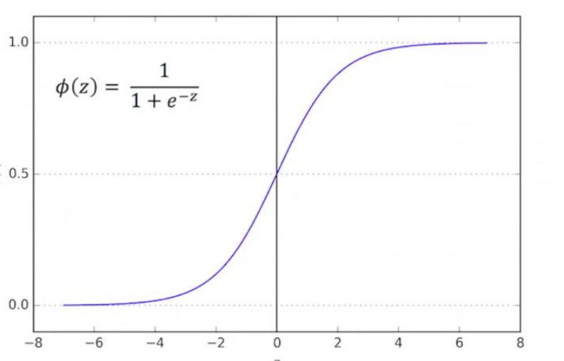

- 或者我们可以考虑**减去平均值**，因为均值对应50%的概率分布。

  Table 13 平均值

  |        | Resaurant 1 | Restaurant 2 | Restaurant 3 |
  | ------ | ----------- | ------------ | ------------ |
  | User 1 | 1.67        | -1.33        | -0.33        |
  | User 2 | -1.67       | 0.33         | 1.33         |

  Table 14

  |        | Resaurant 1 | Restaurant 2 | Restaurant 3 |
  | ------ | ----------- | ------------ | ------------ |
  | User 1 | 0.84        | 0.20         | 0.42         |
  | User 2 | 0.16        | 0.58         | 0.79         |

### Sigmoid function Sigmoid函数

- General sigmoid function:

  - We can control the zero point and the slope

    我们可以控制零点和斜率。

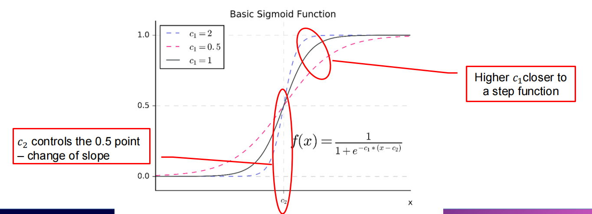

### Logarithm function 对数函数

Sometimes a data row/column may have a very wide range of values. Normalizing in this case will obliviate small values.

当数据行/列的值域范围较大时，采用归一化处理可能导致较小数值被弱化。

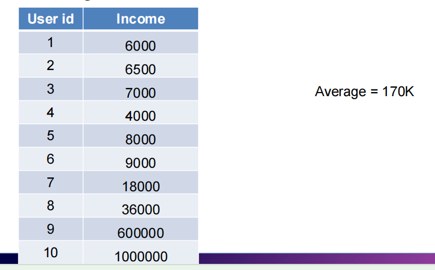

We can bring the values to the same scale by applying a logarithm to the column values.

通过对列数值取对数，我们可以将其统一至同一量纲。

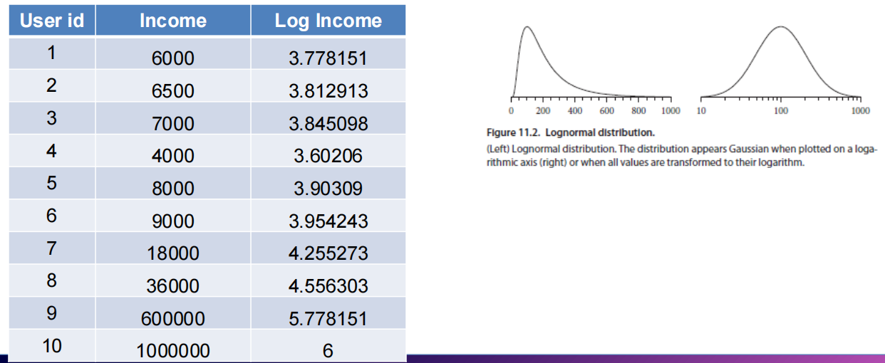

### Practical advices for pre-processing 数据预处理的实用建议

- Never throw out raw data!

  切勿丢弃原始数据！

  - It is usually painful to collect, so raw data is precious. Always keep a copy so you can go back and change the processing

    通常，原始数据的收集过程较为艰辛，因此显得尤为珍贵。务必保留备份，以便日后能够回溯并调整处理流程。

- Keep the output of intermediate steps

  保持中间步骤的输出

  - Useful for making small changes at different points in the pipeline and not run everything from scratch

    适用于在流程的不同节点进行小幅修改，而无需从头开始运行全部流程。

- Carefully document the pre-processing steps

  详细记录预处理步骤

  - The output you will get is for the specific pre-processing you have applied. 

    您将获得的结果取决于您所采用的具体预处理方法。

  - For example, if you remove outliers, you lose any information they may carry

    例如，若剔除异常值，便会丢失它们可能携带的任何信息。

  - If you throw out some parts of the data (e.g., reviews not in English) you now have a biased sample of your data, and this bias should be documented

    若舍弃部分数据（如非英文评论），则所得样本将存在偏差，此种偏差应予以记录说明。

## Post-Processing 后期处理

### The data mining pipeline 数据挖掘流程

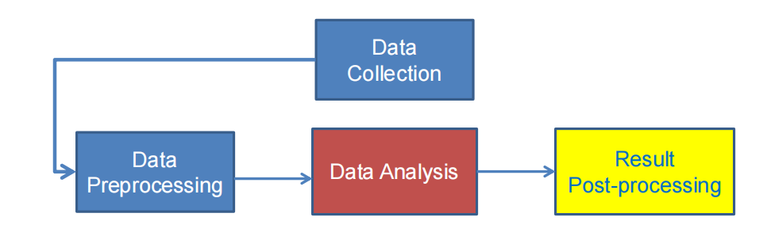

- Post-Processing: Make the data actionable and useful to the user

  后处理：使数据对用户具有可操作性及实用价值。

  - Statistical analysis of importance of results

    结果重要性的统计分析

  - Visualization

    可视化

- Visualization 可视化

  - The **human eye** is a powerful analytical tool

    **人眼**是一种强大的分析工具。

  - If we visualize the data properly, we can discover patterns and demonstrate trends

    若能恰当呈现数据，我们便能发现规律并揭示趋势。

  - Visualization is the way to present the data so that patterns can be seen

    可视化是一种呈现数据以展现规律的方式。

  - E.g., histograms and plots are a form of visualization

    例如，直方图与曲线图属于可视化的一种形式。

  - There are multiple techniques (a field on its own)

    存在多种技术（一个独立的领域）。

### 查尔斯·米纳德地图

Six types of data in one plot: size of army, temperature, direction, location, dates etc

一幅图表呈现六类数据：军队规模、温度、行进方向、地理位置、时间日期等要素

### Word Clouds 词云

A fancy way to visualize a document or collection of documents.

一种以精巧方式呈现单个或集合文档的可视化手法。

### HeatMap 热力图

Plot a point-to-point similarity matrix using a heatmap:

绘制点对点相似性矩阵的热图：

- Deep red = high values (hot)

  深红色

- Dark blue = low values (cold)

  深蓝色

### Dimensionality Reduction 降维

- The human eye is limited to processing visualizations in two (at most three) dimensions

  人类视觉仅限于处理二维（至多三维）的可视化信息。

- One of the great challenges in visualization is to visualize high-dimensional data into a two-dimensional space

  可视化领域的一大挑战在于将高维数据呈现在二维空间之中。

- We can use **dimensionality reduction** for this task

  我们可以运用降维技术来完成这项任务。

- Similar to this are **distance preserving embeddings**

  与此相似的是距离保持嵌入。

### Non-linear dimensionality reduction 非线性降维

- The idea in the previous dimensionality reduction, and visualization was to change the axes through linear transformations

  在先前关于降维与可视化的理念中，核心思路是通过线性变换来调整坐标轴。

- There are also non-linear techniques for dimensionality reduction that lead to better visualization

  此外，非线性降维技术也能实现更优的可视化效果。

- t-SNE is considered the state-of-the-art

  t-SNE被认为是目前最先进的技术。

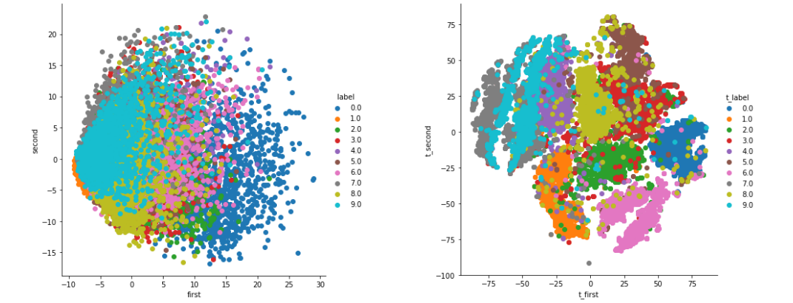

### Statistical Significance 统计显著性

- When we extract knowledge from a large dataset we need to make sure that what we found is not an **artifact of randomness**

  当我们从大型数据集中提取知识时，需要确保所发现的规律并非随机性假象。

  - E.g., we find that many people buy milk and toilet paper together.

    例如，我们发现许多人会同时购买牛奶和厕纸。

  - But many (more) people buy milk and toilet paper **independently**

    但许多（更多）人各自购买牛奶和卫生纸。

- Statistical tests compare the results of an experiment with those generated by a **null hypothesis**

  统计检验将实验结果与零假设所生成的结果进行比较。

  - E.g., a null hypothesis is that people select items independently.

    例如，一个零假设是：人们独立地选择物品。

- A result is interesting if it cannot be produced by randomness.

  如果某个结果无法由随机性产生，那么它就是有趣的。

  - An important problem is to define the null hypothesis correctly: What is random?

    一个重要问题在于准确定义零假设：何为随机性？

### Meaningfulness of Answers 答案的意义性

- A big data-mining risk is that you will “discover” patterns that are meaningless.

  大数据挖掘的一个风险在于，你可能会"发现"毫无意义的模式。

- Statisticians call it **Bonferroni’s principle**: (roughly) if you look in more places for interesting patterns than your amount of data will support, you are bound to find crap. 

  统计学家称之为邦费罗尼原则：（大致而言）若在超出数据支撑范围的过多位置寻找特殊规律，注定会得到无意义的发现。

- The **Rhine Paradox**: a great example of how **not** to conduct scientific research.

  莱茵河悖论：一个绝佳例证，揭示如何错误地开展科学研究。

#### Rhine Paradox – (1)

- Joseph Rhine was a parapsychologist in the 1950’s who hypothesized that some people had Extra-Sensory Perception.

  约瑟夫·莱恩是20世纪50年代的一位超心理学家，他提出假设认为某些人具有超感官知觉能力。

- He devised (something like) an experiment where subjects were asked to guess 10 hidden cards – red or blue.

  他设计了一项实验，让受试者猜测十张被遮挡的卡牌是红色还是蓝色。

- He discovered that almost 1 in 1000 had ESP – they were able to get all 10 right!

  他发现，大约每1000人中就有1人具备超感官知觉——他们能够全部答对10道题！

- He told these people they had ESP and called them in for another test of the same type.

  他告诉这些人他们拥有超感官知觉，并召集他们进行了一次同类型的测试。

- Alas, he discovered that almost all of them had lost their ESP.

  唉，他发现几乎所有的人都失去了超感官知觉。

  - Why?

- He concluded that you shouldn’t tell people they have ESP; it causes them to lose it.

  他总结道，不应告知人们拥有超感知能力，否则会导致这种能力的消失。

