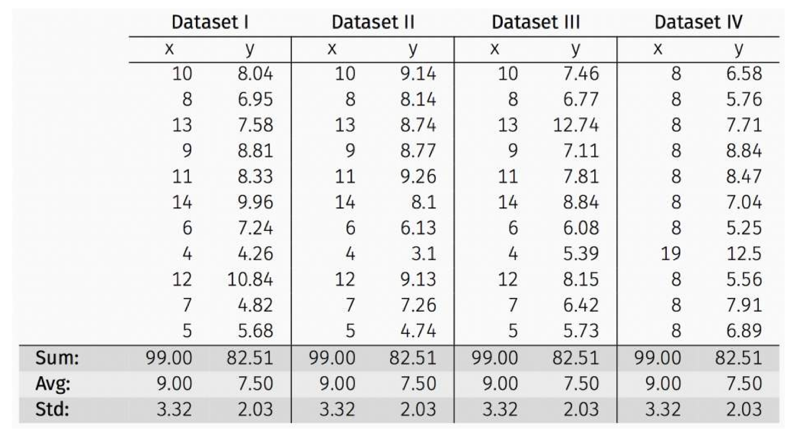
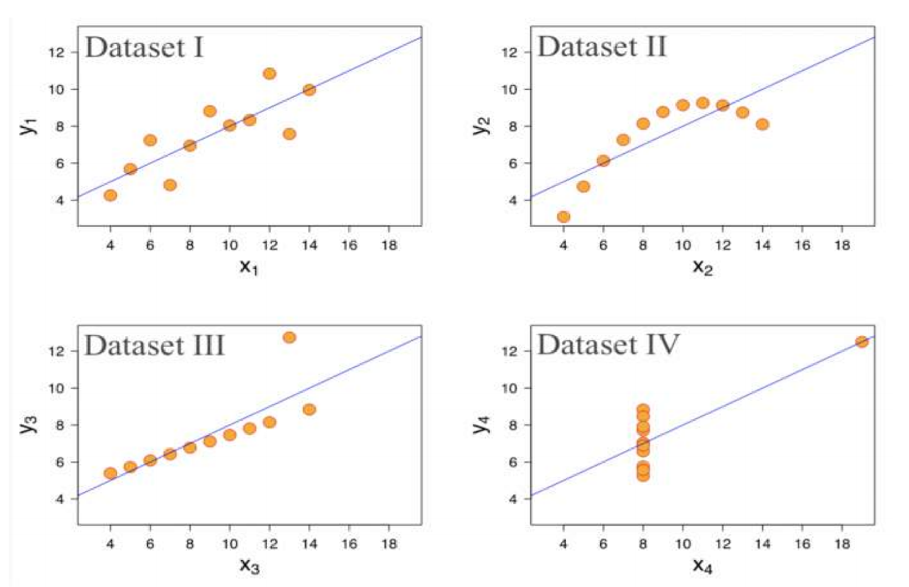
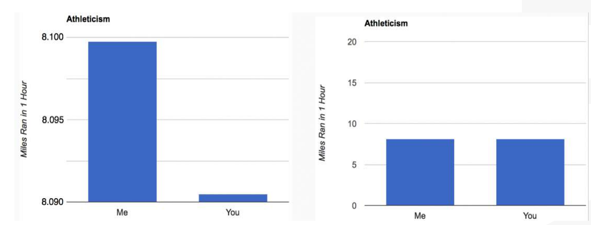
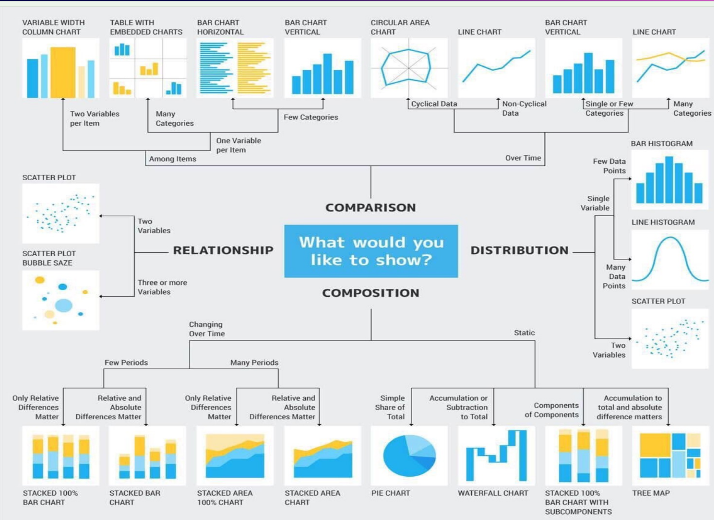
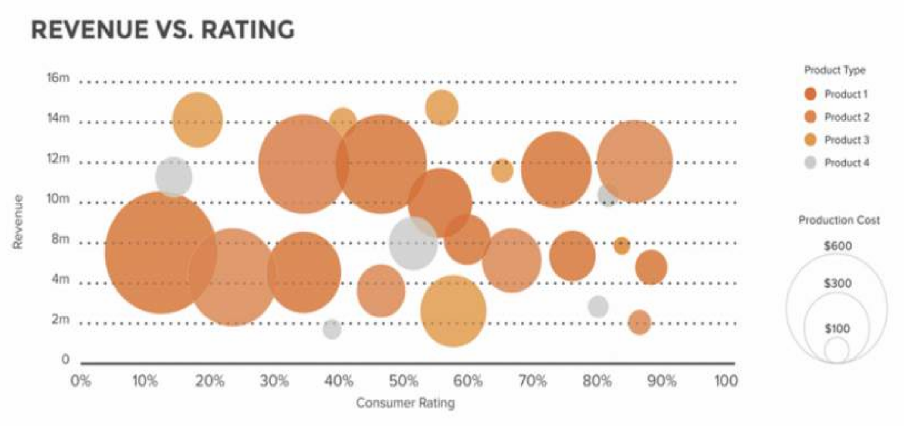
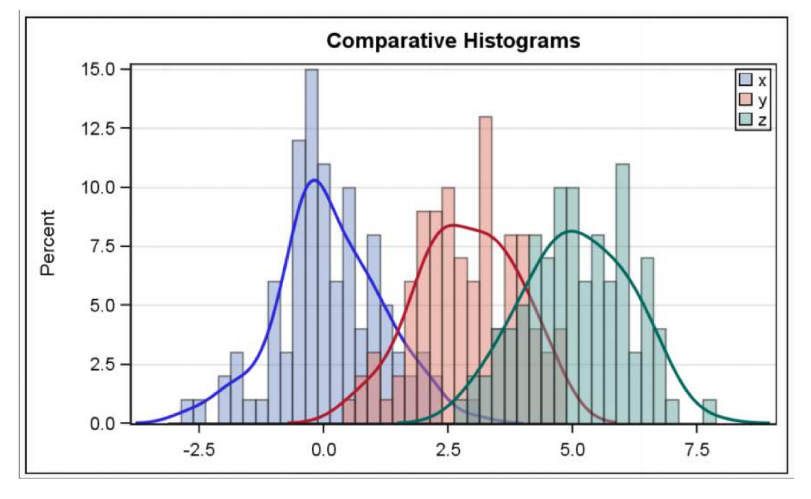
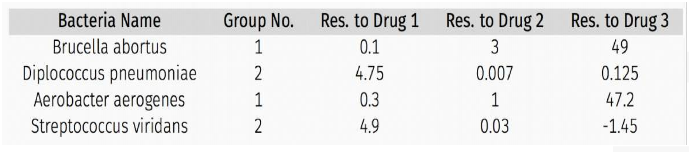
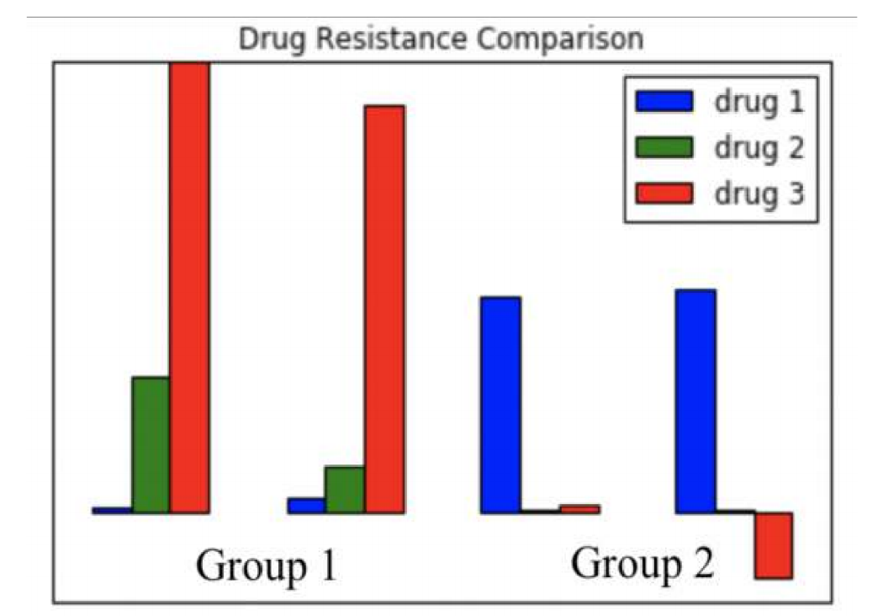

# 4 Data Visualization 数据可视化

## OUTLINE 大纲

- Visualization motivation

  可视化动机

- Principle of Visualization

  可视化原则

- Types of Visualization

  可视化类型

- Example

## Anscombe’s Data 安斯库姆四重奏

The following four data sets comprise the Anscombe’s Quartet; all four sets of data have identical simple summary statistics.

以下四个数据集构成了安斯库姆四重奏；所有四组数据具有完全相同的简单汇总统计量。

Summary statistics clearly don’t tell the story of how they differ. But a picture can be worth a thousand words:

摘要统计显然无法说明它们的差异所在，但一图胜千言。

## Visualization Motivation 可视化动机

Visualizations help us to analyze and explore the data. 

可视化有助于我们分析和探索数据。

They help to:

- Identify hidden patterns and trends

  识别隐藏的模式与趋势

- Formulate/test hypotheses

  制定并检验假设

- Communicate any modeling results

  传达所有建模结果

  - Present information and ideas succinctly

    简明扼要地呈现信息和观点

  - Provide evidence and support

    提供证据与支持

  - Influence and persuade

    影响与说服

- Determine the next step in analysis/modeling

  确定分析/建模的下一步

## Principles of Visualization 可视化原理

Some basic data visualization guidelines from Edward Tufte:

爱德华·塔夫特提出的数据可视化基础准则：

1. Maximize data to ink ratio: show the data

   最大化数据墨水比：聚焦数据呈现

2. Don’t lie with scale (Lie Factor)

   切勿在图表比例上造假（失真系数）

3. Minimize chart-junk: show data variation, not design variation

   最大限度减少图表垃圾：呈现数据差异，而非设计差异。（例如没有必要为了设计将图表设计成3D立体的形式，更多的时候2D会更加直观）

4. Clear, detailed and thorough labeling

   清晰、详尽且全面的标签

## Types of Visualization 可视化的种类

What do you want your visualization to show about your data?

你希望你的数据可视化展示什么？

- **Distribution:** how a variable or variables in the dataset distribute over a range of possible values.

  **分布**： 数据集中一个或多个变量在可能取值范围内的分布情况。

- **Relationship:** how the values of multiple variables in the dataset relate

  **关系**： 数据集中多个变量值之间的关联性

- **Composition:** how a part of your data compares to the whole.

  **构成**： 数据中部分与整体的对比关系。

- **Comparison:** how trends in multiple variable or datasets compare

  **对比**： 多个变量或数据集之间的趋势比较关系

### Distribution 分布 （Important）

- When studying how quantitative values are located along an axis, distribution charts are the way to go. 

  在研究数值沿轴线分布情况时，分布图是最佳呈现方式。

- By looking at the shape of the data, the user can identify features such as value range, central tendency and outliers.

  通过观察数据的分布形态，用户可以识别出数值范围、集中趋势和异常值等特征。

#### Histograms to Visualization Distribution 直方图可视化分布

A **histogram** is a way to visualize how 1-dimensional data is distributed across certain values.

直方图是一种用于可视化一维数据在特定数值区间分布状况的图示方法。

Note: Trends in histograms are sensitive to number of bins.

注意：直方图的分布趋势对分组数量较为敏感。

#### Scatter Plots to Visualize Relationship 散点图可视化关系

A **scatter plot** is a way to visualize how multi-dimensional data are distributed across certain values.

散点图是一种可视化多维数据在特定数值范围内分布情况的方法。

A scatter plot is also a way to visualize the relationship between two different attributes of multi-dimensional data.

散点图也是可视化多维数据中两个不同属性关系的一种方法。

### Relationship 关系 (Important)

- They are used to find correlations, outliers, and clusters in your data.

  它们用于发现数据中的相关性、异常值和聚类。

- While the human eye can only appreciate three dimensions together, you can visualize additional variables by mapping them to the size, color or shape of your data points.

  虽然人眼只能同时感知三维，但您可以通过将其他变量映射到数据点的大小、颜色或形状来呈现更多维度。

- For 3D data, color coding a categorical attribute can be “effective”

  对于三维数据，用颜色编码分类属性可有效呈现特征差异。

- More dimensions not always better.  When the data is high dimensional, a scatter plot of all data  attributes  can be impossible or unhelpful

  高维数据未必更优。当数据处于高维度时，所有数据属性的散点图可能无法绘制或缺乏参考价值。

- For 3D data, a quantitative attribute can be encoded by  size in a bubble chart.

  对于三维数据，气泡图中可通过尺寸大小对定量属性进行编码。

  

- The above visualizes a set of consumer products. The  variables are:  revenue, consumer rating, product type and  product cost.

  以上可视化了一组消费品，涉及的变量包括：收入、消费者评分、产品类型和产品成本。

- Relationships may be easier to spot by producing multiple plots of lower dimensionality.

  通过生成多个低维度图表，可能更容易识别出关系。(也就是将不同的种类分别单独绘制在分开的图表中)

### Comparison 对比

- These are used to compare the magnitude of values to each other and to easily identify the lowest or highest values in the data.

  这些功能用于比较数值之间的相对大小，并能便捷识别数据中的最小或最大值。

- If you want to compare values over time, line or bar charts are often the best option.

  若要比较随时间变化的数值，折线图或柱状图通常是最佳选择。

  - Bar or column charts → Comparisons among items,.

    柱状图 → 用于项目间的对比。

  - Line charts → A sense of continuity.

    折线图 → 呈现连续性趋势

  - Pie charts for comparison as well

    饼图也是用于比较

#### Multiple Histograms 多重直方图

Plotting **multiple histograms (**and **kernel density estimates** of the distribution, here) on the same axes is a way to visualize how different variables compare (or how a variable differs over specific groups).

在同一坐标轴上绘制多个直方图（此处还包括分布的核密度估计）是一种可视化不同变量比较（或变量在特定群体间差异）的方法。

#### BOXPLOTS 箱线图

A **boxplot** is a simplified visualization to compare a quantitative variable across groups. It highlights the range, quartiles, median and any outliers present in a data set.

箱线图是一种简化的可视化工具，用于比较不同组别间定量变量的分布。它能突出显示数据集的极值范围、四分位数、中位数以及存在的异常值。

#### Composition 组成

- Composition charts are used to see how a part of your data compares to the whole.

  成分图用于展示数据中部分与整体的比例关系。

- Show relative and absolute values.

  显示相对值和绝对值。

- They can be used to accurately represent both static and time-series data.

  它们能够精确地呈现静态数据和时序数据。

#### Pie Chart for a Categorical Variable 分类变量饼图

A **pie chart** is a way to visualize the static composition (aka, distribution) of a variable (or single group).

饼图是一种用于可视化变量（或单个组）静态构成（即分布）的方式。

#### Stacked Area Graph to show Trend Over Time 堆叠面积图展示时间趋势

A **stacked area graph** is a way to visualize the composition of a group as it changes over time (or some other quantitative variable). This shows the relationship of a categorical variable (AgeGroup) to a quantitative variable (year).

堆叠面积图是一种可视化群体构成随时间（或其他定量变量）变化的呈现方式。它展示了分类变量（年龄组）与定量变量（年份）之间的对应关系。

### Special Cases 特殊情况

Often your dataset seem too complex to visualize:

通常，您的数据集看起来过于复杂难以可视化：

- Data is too high dimensional (how do you plot 100 variables on the same set of axes?)

  数据维度过高（如何将100个变量绘制在同一坐标系中？）

- Some variables are categorical (how do you plot values like Cat or No?)

  某些变量属于分类变量（如何绘制"是"或"否"这类数值？）

## Example

Use some simple visualizations to explore the following dataset:

使用简单的可视化方法来探索以下数据集：

Bar graph showing resistance of each bacteria to each drug (grouped by Group Number):

条形图显示各细菌对每种药物的耐药性（按组号分组）：

