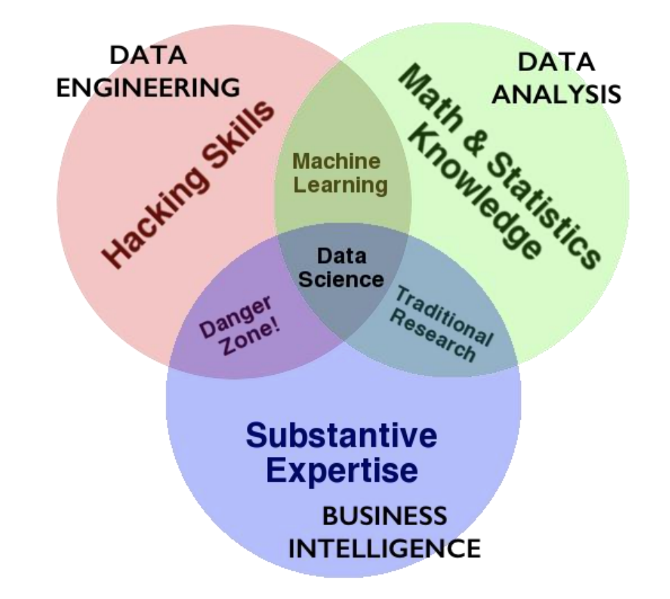

# 5 Get the Data 获取数据

## Outlines

- What is Web Service?

- Data Scraping

- Gathering data from APIs



## Web servers

- A server is a long running process (also called daemon) which listens on a pre-specified port

  服务器是一种持续运行的程序（亦称为守护进程），它会监听预先指定的端口。

- and responds to a request, which is sent using a protocol called HTTP

  并响应通过一种名为HTTP的协议发送的请求。

- A browser parses the url.

  浏览器解析网址。

Our notebooks also talk to a local web server on our machines 我们的笔记本还与本地网络服务器进行通信。: http://localhost:8888/Documents/cs109/BLA.ipynb#something

- protocol is http, hostname is localhost, port is 8888
- url is /Documents/cs109/BLA.ipynb
- url fragment is #something

**Request**

- Request is sent to localhost on port 8888. It says:
  - Request: **GET /request-URI HTTP/version**

**Response**

```
GET / HTTP/1.0
Host: www.google.com
HTTP/1.0 200 OK
Date: Mon, 14 Nov 2016 04:49:02 GMT
Expires: -1
Cache-Control: private, max-age=0
Content-Type: text/html; charset=ISO-8859-1
P3P: CP="This is ..."
Server: gws
X-XSS-Protection: 1; mode=block
X-Frame-Options: SAMEORIGIN
Set-Cookie: NID=90=gb5q7b0...; expires=Tue, 16-May-2017 04:49:02 GMT;
path=/; domain=.google.com; HttpOnly
Accept-Ranges: none
Vary: Accept-Encoding

<!doctype html><html itemscope=""
itemtype="http://schema.org/WebPage" lang="en">
<head><meta content="Search the world's information,...
```


### HTTP Status Codes

- **200 OK:**

  Means that the server did whatever the client wanted it to, and all is well.

  表示服务器已成功执行客户端的请求，一切运行正常。

- **400: Bad request**

  The request sent by the client didn't have the correct syntax.

  客户端发送的请求语法不正确。

- **401: Unauthorized**

  Means  that the client is not allowed to access the resource. This may change if the client retries with an authorization header.

  意味着客户端无权访问该资源。若客户端在重试时附带授权请求头，该限制可能被解除。

- **403: Forbidden**

  The client is not allowed to access the resource and authorization will not help.

  客户端无权访问该资源，且授权操作无法解决此问题。

- **404: Not found**

  Seen this one before? :) It means that the server has not heard of the resource and has no further clues as to what the client should do about it. In other words: dead link.

  以前见过这个吗？:) 这意味着服务器未曾识别该资源，且无法提供客户端应如何处理的进一步线索。简而言之：死链接。

- **500: Internal server error**

  Something went wrong inside the server.

  服务器内部出现错误。

- **501: Not implemented**

  The request method is not supported by the server.

  服务器不支持请求方法。

### Python 实现request

requests 方法

```python
import requests
req = request.get("httpsw://en.wikipedia.org/wiki/Harvard_University")
print(req) # Output: <Response [200]>
page = req.text # Get the raw HTML
print(page[:500]) # Print the first 500 haracters of HTML
```

## Python data scraping python实现爬虫

为什么要在网站中使用爬虫：

- companies have not provided APIs

  公司未提供应用程序编程接口。

- automate tasks

  自动化任务

- keep up with sites

  跟上网站更新

### Challenges in Web Scraping 网站爬虫中的困难

- Which data? 

  需要什么数据

  - It is not always easy to know which site to scrape 

    判断哪个网站适合抓取并非总是易事。

  - Which data is relevant, up to date, reliable？

    哪些数据具有相关性、时效性和可靠性？

- The internet is dynamic

  互联网是动态的 

  - Each web site has a particular structure, which may be changed anytime

    每个网站都有特定的结构，且可能随时变更。

- Data is volatile 

  数据具有易失性

  - Be aware of changing data patterns over time

    注意随时间变化的数据模式

### Legal 法律问题

- Privacy: 

  隐私问题

  - Legislation on protection of personal information 

    个人信息保护相关立法

  - At this moment we only scrape public sources

    目前我们仅采集公开来源信息

- Netiquette (practical): 

  网络礼仪（实用篇）：

  - respect the Robots Exclusion Protocol also known as the robots.txt (example) 

    遵循机器人排除协议（亦称robots.txt范例）

  - identify yourself (user-agent) 

    用户代理标识

  - do not overload servers, use some idle time between requests, run crawlers at night / morning 

    请勿使服务器过载，在请求之间预留空闲时间，建议在夜间或清晨运行爬虫程序。

  - Inform website owners if feasible

    如可行，请通知网站所有者

### 需要注意的地方

**copyrights and permission:**

版权和许可

- be careful and polite

  需要小心并且有礼貌

- give credit

  需要提供验证

- care about media law

  关注媒体法律

- don't be evil (no spam, overloading sites, etc.)

  不要做坏事

### Robots.txt

- specified by web site owner

  由网站所有者指定

- gives instructions to web robots (aka your script)

  向网络爬虫（即您的脚本）发出指令

- is located at the top-level directory of the web server

  位于网络服务器的顶级目录中

- e.g.: http://google.com/robots.txt

### Step 1: Inspect your data source

Explore the Website

- click through the site and interact with it just like any typical job searcher would. For example, you can scroll through the main page of the website

Developer Tools 开发者工具

- look for "inspect element"
- locate details of tags

### Step 3: Scrape HTML content from a page 从网页爬取HTML信息

```python
import requests

URL = "https://realpython.github.io/fake-jobs/"
page = request.get(URL)

print(page.text)
```

- This code issues an HTTP GET request to the given URL. It retrieves the HTML data that the server sends back and stores that data in a Python object. You successfully fetched the static site content from the Internet!

  该代码向指定URL发起HTTP GET请求，获取服务器返回的HTML数据，并将其存储为Python对象。您已成功从互联网获取静态网站内容！

### Step 3: Parse HTML code with beautiful soup 使用 Beautiful Soup 解析 HTML 代码

```python
import requests
from bs4 import BeautifulSoup

URL = "https://realpython.github.io/fake-jobs/"
page = requests.get(URL)

soup = BeautifulSoup(page.content, "html.parser")
```

#### Find element by ID

The element you're looking for is a <div> with an id attribute that has the value "ResultsContainer". It has some other attributes as well, but below is the gist of what you're looking for:

您所查找的元素是一个带有id属性且值为"ResultsContainer"的标签。该元素还包含其他属性，但以下是您需要关注的核心内容：

```html
<div id="ResultContainer">
    <!--all the job lisiting-->
</div>
```

Beautiful Soup allows you to find that specific HTML element by its ID:

Beautiful Soup 可通过ID定位特定HTML元素：

```python
results = soup.find(id="ResultsContainer")
```

#### Findall VS. Find

- will normalize dirty html

  将清理不规范HTML代码

- basic usage

  基本用法

```python
import bs4
## get bs4 object
soup = bs4.BeautifulSoup(source)
# all a tags
soup.findAll('a')
# first a
soup.find('a')
# get all links in the page
link_list = [l.get('href') for l in soup.findall('a')]
```

#### Find elements by HTML class name 通过类名查找

You’ve seen that every job posting is wrapped in a <div> element with the class card-content.

您已注意到每个job posting都包裹在带有 card-content 类的 <div> 元素中。

```python
job_elements = results.find_all("div", class="card-content")
```

Here, you call .find_all() on a Beautiful Soup object, which returns an iterable containing all the HTML for all the job listing displayed on that page.

Take a look at all of them:

```python
for job_element in job_elements:
    	print(job_element, end="\n"*2)
```

```python
for job_element in job_elements:
    title_element = job_element.find("h2", class_="title")
    compant_element = job_element.find("h3", class_="company")
    location_element = job_element.find("p", class_="location")
    print(title_element)
    print(compant_element)
    print(location_element)
    print()
```

```html
<h2 class="title is-5">
    Senior Python Developer</h2>
</h2>
<h3 class="Subtitle is-6 company">
    Payne, Roberts and Davis
</h3>
<p class="location">
    Stewardbury, AA
</p>
```

#### Extract text from HTML elements

```python
for job_element in job_elements:
    title_element = job_element.find("h2", class_="title")
    compant_element = job_element.find("h3", class_="company")
    location_element = job_element.find("p", class_="location")
    print(title_element)
    print(compant_element)
    print(location_element)
    print()
```

- You can add .text to a Beautiful Soup object to return only the **text content** of the HTML elements that the object contains. 

  您可以为Beautiful Soup对象添加.text属性，仅返回该对象包含的HTML元素的文本内容。

- you can .strip() the superfluous whitespace.

  您可以使用 .strip() 方法去除多余的空格。

#### Find elements by class name and text content

```html
<h2 class="title is-5">
    Senior Python Developer</h2>
</h2>
<h3 class="Subtitle is-6 company">
    Payne, Roberts and Davis
</h3>
<p class="location">
    Stewardbury, AA
</p>
```

you know the job title in the page are kept within <h2> elements. To filter for only specific jobs, you can use the string argument:

```python
python_jobs = results.find_all("h2", string="Python")
```

#### Pass a function to a beautiful soup method

```python
python_jobs = results.find_all(
	"h2", string=lambda text: "python" in text.lower()
)
```

Now you're passing an anonymous function to the string=argument. The lambda function looks at the text of each <h2> element, converts it to lowercase, and checks whether the substring "python" is found anywhere. You can check whether you managed to identify all the Python jobs with this approach:

```python
>>> print(len(python_jobs))
10
```

#### The structure of the HTML is a tree HTML的数据结构是树形的

```python
tree = bs4.BeautifulSoup(source)
## get html root node
root_node = tree.html
## get head from root using contents
head = root_node.contents[0]
## get body from root
body = root_node.contents[1]
## could directly access body
tree.body
```

#### Access parent elements 访问父类

With this information in mind, you can now use the elements in python_jobs and fetch their great-grandparent elements instead to get access to all the information you want:

掌握了这些信息后，您现在可以使用 python_jobs 中的元素，转而获取它们的曾祖父级元素，从而获得所需的所有信息：

```python
python_jobs = results.find_all(
	"h2", string=lambda text: "python" in text.lower()
)

python_job_elements = [
    h2_element.parent.parent.parent.parent for h2_element in python_jobs
]
```

#### Extract attributes form HTML elements

```html
HTML
	<!-- snip -->
	<footer class="card-footer">
        <a href="https://www.realpython.com" target="_blank"
            class="card-footer-item">Learn</a>
        <a href="https://realpython.github.io/fake-jobs/jobs/senior-python-dev
            target="_blank"
            class="card-footer-item">Apply</a>
		</footer>
	</div>
</div>
```

Start by fetching all the <a> elements in a job card. Then, extract the value of their href attributes using square-bracket notation: 

首先获取职位卡片中的所有元素，然后使用方括号表示法提取其href属性值：

```python
for job_element in python_job_elements:
	# -- snip -
	links=job_element.find_all("a")
	for link in links:
		link_url =link["href"]
		print(f"Apply here:{link_url}n")
```

### Gathering data from APIs 从应用程序接口采集数据

### API

- API = **A**pplication **P**rogram **I**nterface

  API = 应用程序接口

- Many data sources have API's - largely for talking to other web interfaces

  多数数据源都设有API，主要用于与其他网络接口进行通信。

- Consists of a set of methods to search, retrieve, or submit data to, a data source

  包含一组用于搜索、检索数据或向数据源提交数据的方法。

- Many packages already connect to well-known API's (we'll look at a couple today)

  许多软件包已经与知名API建立了连接（今天我们将探讨其中几例）


