# 6 Infrasturcture for Supporting Big Data Processing 支持大数据处理的基础设施

## OUTLINE

- Large-scale computing

  大规模计算

- Distributed file system

  分布式文件系统

- MapReduce: Distributed computing programming model

  MapReduce：分布式计算编程模型

- Spark: Extends MapReduce

  Spark：对MapReduce的扩展

## Single Node Architecture 单节点架构

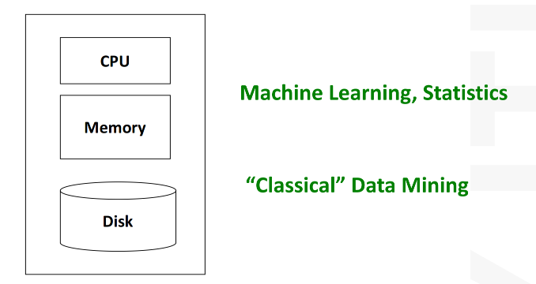

## Cluster Architecture 集群架构

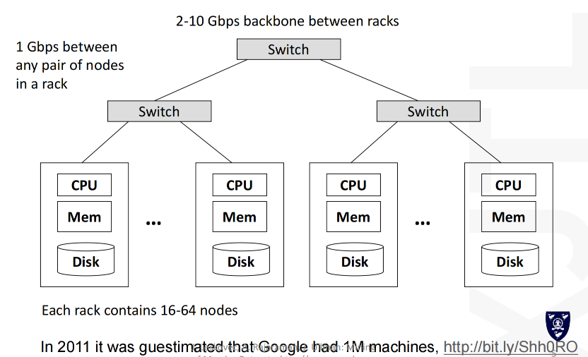

## Large Scale Computing

**Challenges:** 挑战

- **How do you distribute computation?**

  如何分配计算任务？

- **How can we make it easy to write distributed programs?**

  如何让编写分布式程序变得简单？

- **Machines fail:** 

  机器会发生故障：

  - One server may stay up 3 years (1,000 days) 
  - If you have 1,000 servers, expect to lose 1/day 

  - With 1M machines 1,000 machines fail every day!

### A idea and a solution

- **Issue:**

  问题

  - **Copying data over a network takes time**

    通过网络复制数据需要时间

- **Idea:**

  - Bring computation to data 

    将计算引入数据

  - Store files multiple times for reliability

    多次存储文件以确保可靠性

- **Programming model** 

  编程模型

  - MapReduce

- **Spark/Hadoop address these problems** 

  Spark/Hadoop解决了这些问题

  - **Storage Infrastructure –File system**

    存储基础设施——文件系统

  - Google: GFS. Hadoop: HDFS

### Storage Infrastructure 存储设备

**Problem:**

- If nodes fail, how to store data persistently?

  若节点发生故障，如何实现数据持久化存储？

**Typical usage pattern:** 

典型的使用模式

- Huge files (100s of GB to TB) 

- Data is rarely updated in place 

- Reads and appends are common

**Answer:** 解决方案

- **Distributed File System**

  **可以考虑使用分布式文件系统**

  - Provides global file namespace

    提供全局文件命名方式

## Distributed file system 分布式文件系统

**Chunk servers** 

块服务器

- File is split into contiguous chunks 

  文件被分割为连续的数据块

- Typically each chunk is 16-64MB 

  通常每个数据块的大小为16-64MB

- Each chunk replicated (usually 2x or 3x) 

  每个数据块进行复制（通常为2次或3次）

- Try to keep replicas in different racks

  尽量将副本部署在不同机架中

**Master node** 

主节点

- a.k.a. Name Node in Hadoop’s HDFS 

  即 Hadoop HDFS 中的名称节点

- Stores metadata about where files are stored 

  存储有关文件存储位置的元数据

- Might be replicated

**Client library for file access** 

文件访问客户端库

- Talks to master to find chunk servers 

  与主服务器通信以查找数据块服务器

- Connects directly to chunk servers to access data

  直接连接数据块服务器以访问数据

**Reliable distributed file system**

可靠的分布式文件系统

- Data kept in “chunks” spread across machines 

  数据以“区块”形式分散存储在多台机器中。

- Each chunk **replicated** on different machines 

  每个数据块在不同机器上进行复制

- Seamless recovery from disk or machine failure

  从磁盘或机器故障中无缝恢复

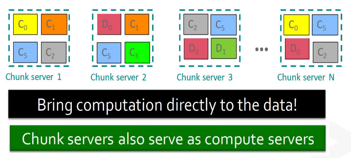

## Mapreduce: Distributed Computing Programming Model 分布式计算编程模型

### Programming Model: MAPREDUCE

**MapReduce is a style of programming designed for:** 

MapReduce 是一种专为以下场景设计的编程范式：

- Easy parallel programming 

  简单的并行编程

- Invisible management of hardware and software failures 

  硬件与软件故障的无感管理

- Easy management of very-large-scale data

  超大规模数据的便捷管理

It has several implementations, including Hadoop, Spark, Flink, and the original Google implementation just called “MapReduce”

它拥有多种实现方式，包括Hadoop、Spark、Flink以及最初由谷歌开发并直接命名为“MapReduce”的原始实现。

### Diagram Example

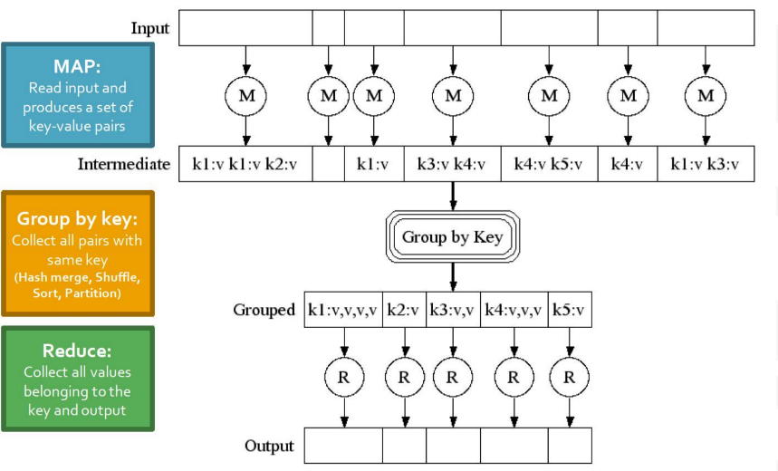

### Overview

**3 steps of MapReduce**

三个步骤

**Map:**

- Apply a user-written *Map function* to each input element

  对每个输入元素应用用户自行编写的映射函数

  - *Mapper* applies the Map function to a single element

    映射器对单个元素应用映射函数

  - Many mappers grouped in a *Map task*(the unit of parallelism) 

    多个映射器被分组在一个映射任务（并行处理单元）中

- The output of the Map function is a set of 0, 1, or more *key-value pairs*. 

  Map函数的输出是一个包含0个、1个或多个键值对的集合。

**Group by key:** Sort and shuffle 

按键分组： 排序与混洗

- System sorts all the key-value pairs by key, and outputs key-(list of values) pair

  系统将所有键值对按键排序，并输出键-（值列表）对

**Reduce:**  归约

- User-written Reduce functions applied to each key-(list of values)

  应用于每个键值（列表值）的用户自定义归约函数

### In parallel 

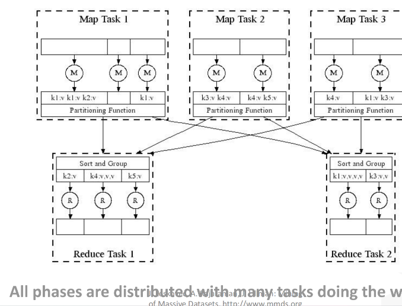

### The map step

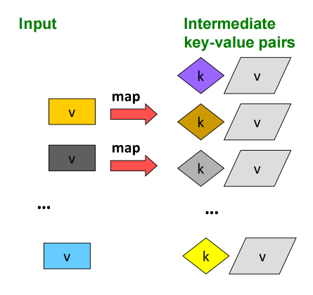

#### The reduce step

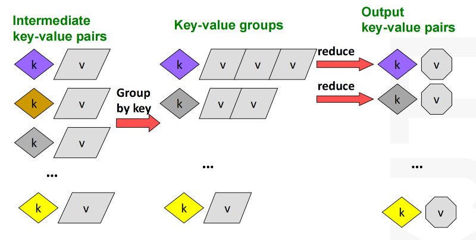

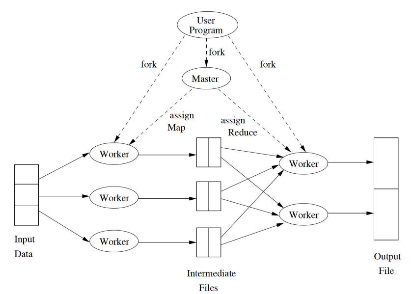

- Each mapper/reducer must generate the same number of output key/value pairs as it receives on the input. (Wrong)

  每个映射器/归约器必须生成与其输入接收数量相同的输出键/值对。（错误）

- The output type of keys/values of mappers/reducers must be of the same type as their input. (Wrong)

  映射器/归约器的键值输出类型必须与其输入类型相同。（错误）

- The inputs to reducers are grouped by key. (True)

  Reducer 的输入按键分组。（正确）

- It is possible to start reducers while some mappers are still running . (Wrong)

  在部分映射器仍在运行时启动归约器是可行的。（错误）

### Problems suited for mapreduce 适用于映射归约的问题

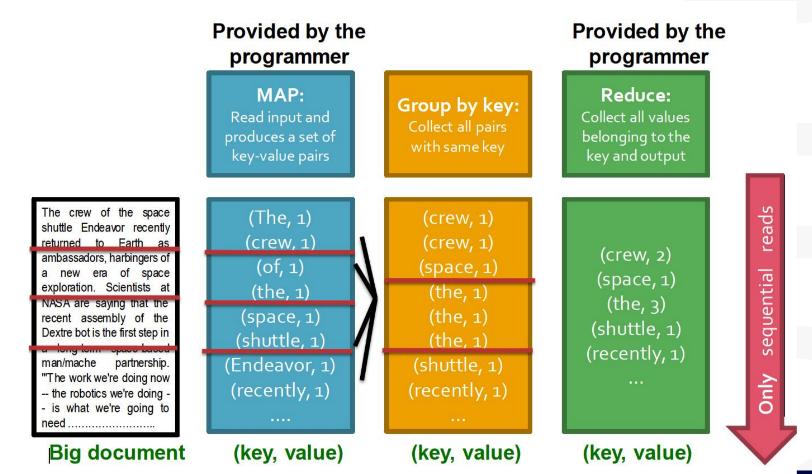

### Word count using mapreduce 使用MapReduce进行词频统计

```python
map(key, value):
  # key: document namel value: text of the document
  for each word w in value:
    emit(w, 1)

reduce(key, values):
  # key: a word; value: an iterator over counts
  result = 0
  for each count v in values:
    result += v
  emit(key, result)

```

### Example: Join by map-reduce

- Consider as input files that look as follows

  - | List  |           |
    | ----- | --------- |
    | Mike  | Ice Cream |
    | Mike  | Ice Cream |
    | Alice | tofu      |

- Design a MapReduce job that outputs grocery item (e.g. "icre cream") as key and the count of the number of people,e as value who have that item on their list.

### Mapreduce process MapReduce处理过程

- A map prceess turns:
  - Each input: A line from the input list file
  - Output: The grocery itemn as the key and a count of 1 as the value
- A reduce process turns:
  - Each input: Key-value pairs from the mappers, where the key is a grocery item and the value is a list.
  - Output: Key-value pairs: The grocery item as the key and the sum of the values (count of people) as the value.

## SPARK: Extension Mapreduce

### SPARK: Overview

Open source software (Apache Foundation)

Supports **Java, Scala and Python**

**Key construct/idea:** Resilient Distributed Dataset (RDD) 

**Higher-level APIs:** 

- Different APIs for aggregate data, which allowed to introduce SQL support

  聚合数据专用多接口设计，支持SQL功能拓展

### Hadoop Mapreduce

Hadoop

- Disk-based computation where the results of each step are written to disk.

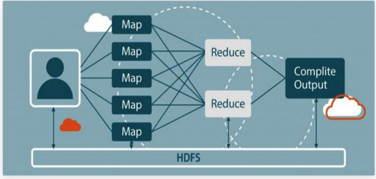

Apache's RDD

- Distributed computing in memory

  内存分布式计算

- Greatly improving the speed of data processing

  显著提升数据处理速度

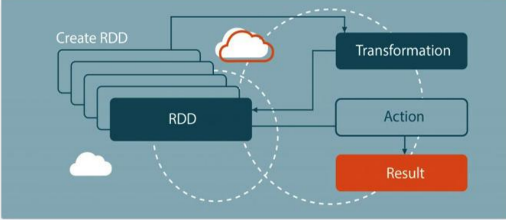
