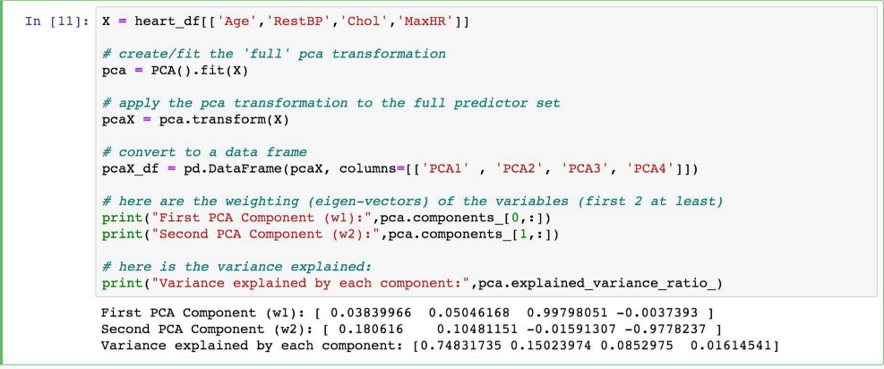
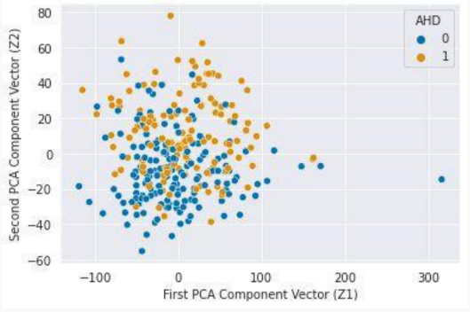

# 7 Dimensionality Reduction 降维

## Outline: High Dimensionality and PCA 大纲：高维数据与主成分分析

- Interaction Terms and Unique Parameterizations 

  交互项与唯一参数化设定

- Big Data and High Dimensionality

  大数据与高维特征

- Principal Components Analysis (**PCA**) 

  主成分分析（PCA）

- PCA for Regression (PCR)

  回归主成分分析（PCR）

- PCA for Imputation

  主成分分析法用于数据插补

## Interaction Terms and Unique Parameterizations 交互项与唯一参数化

### 纽约出租车和Uber

We’d like to compare Taxi and Uber rides in NYC(for example, how much the fare costs based on length of trip, time of day, location, etc.).

我们希望在纽约市比较出租车和优步出行的差异（例如，根据行程长度、时段、地理位置等因素对比车费价格）。

A public dataset has 1.9 million Taxi and Uber trips. Each trip is described by *p* =23 useable predictors (and 1response variable).

一个公共数据集包含190万次出租车和优步行程记录。每次行程由23个可用预测变量（及1个响应变量）进行描述。

#### Interaction Terms: A Review 互动项研究综述

Recall that an interaction term between predictors X1 and X2 can be incorporated into a regression model by including the multiplicative (i.e. cross) term in the model, for example:

需要说明的是，在回归模型中纳入预测变量X1和X2的交互项时，可通过引入乘法项（即交叉项）来实现，例如：
$$
Y = \beta_{0} + \beta_{1}X_{1} + \beta_{2}X_{2} + \beta_{3}(X_{1} * X_{2}) + \varepsilon
$$
Suppose X1 is a binary predictor indicating whether a NYC ride pickup is a taxi or an Uber, X2 the length of the trip, and Y is the fare for the ride. What is the interpretation of β3

假设X1为二元预测变量，表示纽约市乘车服务是出租车还是优步，X2为行程长度，Y为车费金额。请问β3应如何解释？

### Including Interaction Terms in Models 模型中包含交互项

Recall that to avoid overfitting, we sometimes elect to exclude a number of terms in a linear model.

为避免过拟合，我们有时会选择在线性模型中剔除若干项。

It is standard practice to always include the **main effects** in the model. That is, we always include the terms involving only one predictor, β1X1, β2X2, etc

标准做法是始终在模型中包含主效应。也就是说，我们始终保留仅涉及单一预测变量的项，例如β₁X₁、β₂X₂等。

### How many interaction Terms? 交互项数量是多少

This NYC taxi and Uber dataset has 1.9 million Taxi and Uber trips. 

该纽约市出租车和优步数据集包含190万次出租车及网约车行程。

Each trip is described by *p* =23 useable predictors (and 1response variable). How many interaction terms are there?

每次行程使用23个可用预测变量（及1个响应变量）进行描述。存在多少交互项？

- Two-way interactions: 
  - $$
    \begin{pmatrix} p \\ 2 \end{pmatrix} = \frac{p(p-1)}{2} = 253
    $$
  
- Three-way interactions: 
  - $$
    \begin{pmatrix} p \\ 3 \end{pmatrix} = \frac{p(p-1)(p-2)}{6} = 1771
    $$

The total number of all possible interaction terms (including main effects) is:

所有可能的交互项（包括主效应）总数:

- $$
  \sum_{k=0}^{p} \begin{pmatrix} p \\ k \end{pmatrix} = 2^{p} \approx 8.3 \, \text{million}
  $$

In order to wrangle a data set with roughly 2 million observations, we could use random samples of 100k observations from the dataset to build our models. If we include all possible interaction terms, our model will have 8.3 mil parameters. **We will not be able to uniquely determine 8.3 mil parameters with only 100k observations**. In this case, we call the model **unidentifiable**.

为处理包含约200万条观测值的数据集，我们可采用10万条观测值的随机抽样来构建模型。若纳入所有可能的交互项，模型将包含830万个参数。仅凭10万条观测值无法唯一确定830万个参数，此种情况我们称之为**模型不可识别**。

To handle this in practice, we can:

在实践中，我们可以采取以下措施：

- Increase the number of observation

  增加观测次数

- Consider only scientifically important interaction terms

  仅考虑具有科学重要性的交互项

- Use an appropriate method that account for this issue

  采用能够妥善解决此问题的适当方法

- Perform another **dimensionality reduction** technique like PCA

  执行另一种降维技术，例如主成分分析

## Big Data and High Dimensionality 大数据与高维度

In the world of Data Science, the term *Big Data* gets thrown around a lot. What does *Big Data* mean?

在数据科学领域，"大数据"这一术语被频繁提及。何为大数据？

A rectangular data set has two dimensions: number of observations (*n*) and the number of predictors (*p*). Both can play a part in defining a problem as a *Big Data* problem.

矩形数据集具有两个维度：观测值数量（n）与预测变量数量（p）。这两个维度在界定大数据问题时均可能起到关键作用。

What are some issues when:

在以下情况下会出现哪些问题：

- *n* is big (and *p* is small to moderate)?

  当n值较大（且p值处于中小范围）时？

- *p* is big (and *n* is small to moderate)?

  p 较大（且n为小到中等）？

- *n* and *p* are both big?

  n 和 p 是否都很大？

### When n is big

When the sample size is large, this is typically not much of an issue from the statistical perspective, just one from the computational perspective.

当样本量较大时，从统计学角度而言这通常不成问题，主要挑战在于计算层面。

- Algorithms can take forever to finish. Estimating the coefficients of a regression model, especially one that does not have closed form (like LASSO), can take a while. Wait until we get to Neural Nets!

  算法可能永远无法完成运算。估计回归模型的系数——尤其是没有闭合解的形式（如LASSO）——可能耗时良久。等我们接触到神经网络时会更甚！

- If you are tuning a parameter or choosing between models (using Cross-Validation), this exacerbates the problem.

  若您正在调整参数或在模型间进行选择（使用交叉验证），这一问题将更为凸显。

What can we do to fix this computational issue?

我们该如何解决这个计算问题？

- Perform ‘preliminary’ steps (model selection, tuning, etc.) on a subset of the training data set. 10%or less can be justified

  在训练数据集的子集上执行“初步”步骤（模型选择、参数调优等）。使用10%或更少的数据量具有合理性。

#### Keep in mind, big *n* doesn’t solve everything

The era of Big Data (aka, large *n*) can help us answer lots of interesting scientific and application-based questions, but it does not fix everything.

大数据时代（即大样本量时代）能够帮助我们解答诸多有趣的科学及应用性问题，但并非万能灵药。

Remember the old adage: “**crap in = crap out**”. That is to say, if the data are not representative of the population, then modeling results can be terrible. Random sampling ensures representative data.

谨记古老谚语：“**垃圾进，垃圾出**”。换言之，若数据不能代表总体，建模结果将惨不忍睹。随机抽样可确保数据的代表性。

### When p is big

When the number of predictors is large (in any form: interactions, polynomial terms, etc.), then lots of issues can occur.

当预测变量数量众多（以任何形式存在：交互项、多项式项等）时，便可能引发诸多问题。

- Matrices may not be invertible (issue in OLS).

  矩阵可能不可逆（在普通最小二乘法中会出现此问题）。

- Multicollinearity is likely to be present

  多重共线性很可能存在

- Models are susceptible to overfitting

  模型容易出现过拟合现象

This situation is called *High Dimensionality*, and needs to be accounted for when performing data analysis and modeling.

这种情况被称为高维特性，在进行数据分析和建模时必须予以考虑。

**What techniques have we learned to deal with this? 我们已掌握哪些应对技巧？**

#### When Does High Dimensionality Occur? 高维情况何时出现？

The problem of high dimensionality can occur when the number of parameters exceeds or is close to the number of observations. This can occur when we consider lots of interaction terms, like in our previous example. But this can also happen when the number of main effects is high.

当参数数量超过或接近观测值数量时，就会出现高维度问题。正如我们先前的示例所示，这种情况可能发生在考虑大量交互项时。但当主效应数量较多时，同样可能出现这种问题。

For example:

- When we are performing polynomial regression with a high degree and a large number of predictors.

  • 当我们在进行高次数、多预测变量的多项式回归时。

- When the predictors are genomic markers (and possible interactions) in a computational biology problem.

  在计算生物学问题中，当预测因子为基因组标记（及可能的交互作用）时。

- When the predictors are the counts of all English words appearing in a text.

  当预测变量为文本中所有英语词汇的出现频次时。

#### A Framework For Dimensionality Reduction 一种降维框架

One way to reduce the dimensions of the feature space is to create a new, smaller set of predictors by taking linear combinations of the original predictors.

降低特征空间维度的一种方法是：通过对原始预测变量进行线性组合，创建新的、更精简的预测变量集合。

We choose Z1, Z2, Z3 where and where each Zi  is a linear combination of the original *p* predictors

我们选择Z1、Z2、Z3，其中每个Zi都是原始p个预测变量的线性组合。

- $$
  Z_{i} = \sum_{j=1}^{p} \phi_{ji} X_{j}
  $$

for fixed constants φji. Then we can build a linear regression regression model using the new predictors

于是我们可以使用新的预测变量构建线性回归模型，其中φji为固定常数。

- $$
  Y = \beta_{0} + \beta_{1}Z_{1} + \cdots + \beta_{m}Z_{m} + \varepsilon
  $$

Notice that this model has a smaller number (*m*+1 <*p*+1) of parameters

注意到该模型具有较少的参数数量（m+1 < p+1）

A method of dimensionality reduction includes 2 steps:

一种降维方法包括两个步骤：

- Determine an optimal set of new predictors *Z*1 ,…,*Zm* , for *m* <*p*.

  确定一组最优的新预测变量 Z1 ,…,Zm （其中 m < p）。

- Express each observation in the data in terms of these new predictors. The transformed data will have *m* columns rather than *p*.

  将数据中的每个观测值用这些新预测变量表示。转换后的数据将具有m列而非p列。

Thereafter, we can fit a model using the new predictors.

随后，我们可以使用新的预测变量来拟合模型。

The method for determining the set of new predictors (what do we mean by an optimal predictors set?) can differ according to application. We will explore a way to create new predictors that captures the *essential* variations in the observed predictor set.

确定新预测变量组的方法（何为最优预测变量组？）可能因应用场景而异。我们将探索一种创建新预测变量的方法，以捕捉观测预测变量集中的关键变异特征。

## Principal Components Analysis (PCA) 主成分分析

*Principal Components Analysis* (PCA) is a method to identify a new set of predictors, as linear combinations of the original ones, that captures the 'maximum amount' of variance in the observed data.

主成分分析是一种通过原始预测变量的线性组合来识别新预测变量集的方法，该方法能够捕捉观测数据中的“最大量”方差。

*Principal ComponentsAnalysis* (PCA) produces a list of *p* **principal components** *Z*1 ,…,*Zp* such that:

主成分分析（PCA）生成p个主成分Z1,…,Zp的列表，满足

- Each *Zi* is a linear combination of the original predictors, and it's vector norm is 1

  每个Zi都是原始预测变量的线性组合，且其向量范数为1。

- The *Zi* 's are pairwise orthogonal

  所有Zi相互正交

- The *Zi* 's are ordered in decreasing order in the amount of captured observed variance

  各主成分按所捕获观测方差量降序排列

That is, the observed data shows more variance in the direction of Z1 than in the direction of Z2 .

也就是说，观测数据显示，Z1方向上的方差大于Z2方向上的方差。

Toperform dimensionality reduction we select the top *m* principle components of PCAas our new predictors and express our observed data in terms of these predictors.

为执行降维操作，我们选取主成分分析的前m个主成分作为新预测变量，并基于这些预测变量重新表达观测数据。

### The Intuition Behind PCA 主成分分析原理剖析

Top PCAcomponents capture the most of amount of variation (interesting features) of the data.

PCA主成分能够捕捉数据中最大程度的变异（关键特征）。

Each component is a linear combination of the original predictors - we visualize them as vectors in the feature space.

每个成分都是原始预测变量的线性组合，我们将其可视化为特征空间中的向量。

Transforming our observed data means projecting our dataset onto the space defined by the top *m* PCA components, these components are our new predictors.

将观测数据转换意味着将数据集投影到由前m个主成分定义的向量空间，这些成分即为我们新的预测变量。

### The Math behind PCA PCA 背后的数学知识

PCA is a well-known result from linear algebra. Let **Z** be the *n* x *p* matrix consisting of columns *Z*1 ,…,*Zp* (the resulting PCAvectors), **X** be the *n* x *p* matrix of *X*1 ,…,*Xp* of the original data variables (each standardized to have mean zero and variance one, and without the intercept), and let **W** be the *p* x *p* matrix whose columns are the eigenvectors of the square matrix , then

主成分分析（PCA）是线性代数中的经典结论。令Z为n×p矩阵，其列向量由Z1至Zp构成（即所得的主成分向量）；X为n×p原始数据变量矩阵，包含X1至Xp（各变量经标准化处理，均值为零、方差为一，且不包含截距项）；W为p×p矩阵，其列向量由方阵的特征向量组成。

- $$
  \mathbf{Z}_{n \times p} = \mathbf{X}_{n \times p} \mathbf{W}_{p \times p}
  $$

### Implementation of PCA using linear algebra 基于线性代数的PCA实现

To implement PCA yourself using this linear algebra result, you can perform the following steps:

要基于该线性代数结果自行实现PCA，可执行下列步骤：

- Standardize each of your predictors (so they each have mean =0, var =1).

  将每个预测变量标准化（使其均值为0，方差为1）。

- Calculate the eigenvectors of the **XTX** matrix and create the matrix with those columns, **W**, in order from largest to smallest eigenvalue.

  计算**XTX**矩阵的特征向量，并按特征值从大到小的顺序构建列矩阵W。

- Use matrix multiplication to determine **Z = XW**.

  使用矩阵乘法计算 Z = XW。

Note: this is not efficient from a computational perspective. This can be sped up using Cholesky decomposition.

注意：从计算效率的角度来看，这种方法并不高效。采用楚列斯基分解法可显著提升运算速度。

However, PCA is easy to perform in Python using the *decomposition.* *PCA* function in the sklearn package

然而，使用sklearn包中的decomposition。PCA函数可以轻松在Python中执行主成分分析。

#### PCA example in sklearn

Acommon plot is to look at the scatterplot of the first two principal components, shown below for the Heart data:

常见的做法是观察前两个主成分的散点图，下图展示了心脏数据集的示例：

### Key takeaways of PCA 主成分分析的核心要点

**Capturing Variation:** The primary goal of PCA is to capture the mostsignificant variations in the data, rather than interpreting the principal components of data for predicting the output variable.

**捕捉变异**： PCA的主要目标是捕捉数据中最重要的变异，而非通过解读数据的主成分来预测输出变量。

**p=p**, **m＜p**: PCA produces a list of **p** principal components.The first principal component (Z1 ) corresponds to the direction along which the data exhibits the highest variance. Subsequent components (Z2 , Z3 , etc.) capture progressively less variance but are still important sources of variation. To perform dimensionality reduction we select the top **m** principle components of PCA as our new predictors and express our observed data in terms of these predictors.

p=p，m＜p：主成分分析生成包含p个主成分的列表。第一个主成分（Z1）对应于数据方差最大的方向。后续成分（Z2、Z3等）虽能解释的方差逐次递减，但仍是重要的变异来源。为执行降维操作，我们选取前m个主成分作为新预测变量，并将观测数据通过这些预测变量进行表达。

**Linear Combinations:** Each principal component (Zi ) is a linear combination of the original predictors, indicating how each predictor contributes to that component‘s direction. The principal components (Z's) are pairwise orthogonal, meaning they are uncorrelated with each other.

线性组合： 每个主成分（Zi）都是原始预测变量的线性组合，反映了各预测变量对该主成分方向的贡献程度。主成分（Z）**两两正交**，这意味着**它们彼此之间不存在相关性**。

