# 8 Clustering 聚类

## Outline

- Overview of Clustering

  聚类分析概述

- Hierarchical Clustering

  层次聚类

- The *k* Means Algorithm

  K均值算法

## Overview of Clustering 聚类分析概述

### High Dimensional Data 高维数据

**Given a cloud of data points we want to understand its structure**

给定一个数据点云，我们需要解析其结构特征。

#### Example: Clusters & Outliers

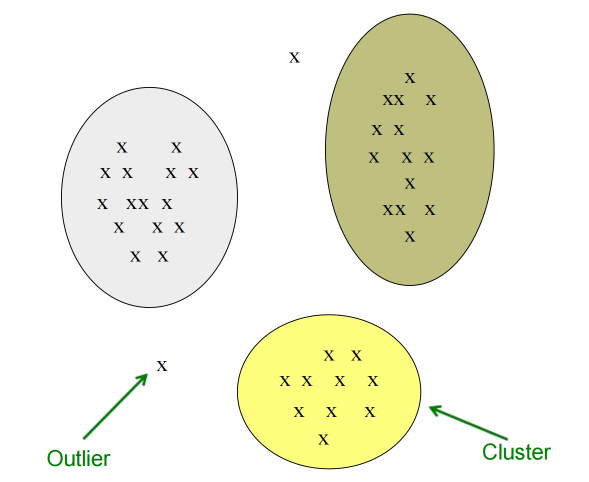

### The problem of Clustering 聚类的问题

Given a **set of points**, with a notion of **distance** between points,**group the points** into some number of **clusters**, so that 

给定一组点及其之间的距离概念，将点集划分为若干簇，使得

- Members of a cluster are close/similar to each other

  聚类中的成员彼此接近/相似 

- Members of different clusters are dissimilar

  不同聚类中的成员之间具有差异性

Usually：

- Points are in a high-dimensional space 

  数据点位于高维空间中

- Similarity is defined using a distance measure

  相似性通过距离度量来定义

  - Euclidean, Cosine, Jaccard, edit distance, …

    欧几里得距离、余弦相似度、杰卡德系数、编辑距离……

**为什么聚类非常的困难？**

- Clustering in two dimensions looks easy

  二维空间中的聚类看似简单

- Clustering small amounts of data looks easy

  对少量数据进行聚类看似简单

- And in most cases, looks are not deceiving

  在大多数情况下，外表往往不会欺骗人。（很容易从当前的分布中看出大致的聚类方式）

- Many applications involve not 2, but 10 or 10,000 dimensions

  许多应用场景不仅涉及二维，更需处理十维乃至万维空间

- High-dimensional spaces look different: Almost all pairs of points are at about the same distance

  高维空间呈现独特特性：几乎所有点对之间的距离都大致相等

#### Clustering Problem: GALAXIES 星系

- A catalog of 2 billion “sky objects” represents objects by their radiation in 7 dimensions (frequency bands)

  包含20亿个“天体的星表”通过7个维度（频段）的辐射数据来表征天体

- **Problem:** Cluster into similar objects, e.g., galaxies, nearby stars, quasars, etc. 

  问题： 将相似天体进行聚类，例如星系、邻近恒星、类星体等。

- **Sloan Digital Sky Survey**

  斯隆数字化巡天

#### Clustering Problem: Music CDs

- **Intuitively:** Music divides into categories, and customers prefer a few categories 

  直观来看： 音乐可分为不同类别，而顾客往往偏好少数几个类别。

  - But what are categories really?

    但范畴究竟是什么？（范畴要怎么去定义呢）

- Represent a CD by a set of customers who bought it: 

  用购买该CD的客户集合来表示一张CD：

  - Similar CDs have similar sets of customers, and vice-versa

    相似的CD拥有相似的客户群体，反之亦然。

**Space of all CDs:** 

- Think of a space with one dim. for each customer 

  设想一个空间，其维度与客户数量一一对应

  - Values in a dimension maybe 0 or 1 only

    维度中的数值只能为0或1

  - A CD is a point in this space (*x*1 , *x*2 ,…, *xk*), where *xi* = 1 iff the ith customer bought the CD

    在该空间中，一个CD对应一个坐标点(x1, x2, …, xk)，当且仅当第i位顾客购买了该CD时，xi取值为1。

- For Amazon, the dimension is tens of millions

  对亚马逊而言，这一维度达到数千万量级

- **Task:** Find clusters of similar CDs

  任务：查找相似CD的群集

#### Clustering Problem: Documents

**Finding topics:** 查找文档所属的主题

Represent a document by a vector (*x1*, *x2*,…, *xk*), where *xi* = 1 iff the *i* th word (in some order) appears in the document 

将文档表示为向量 (x1, x2,…, xk)，其中当且仅当第 i 个单词（按特定顺序）出现在文档中时 xi = 1

- It actually doesn’t matter if*k* is infinite; i.e., we don’t limit the set of words

  实际上，k是否为无穷大并不重要；也就是说，我们并不限制词汇集合的规模

- **Documents with similar sets of words may be about the same topic**

  具有相似词汇组合的文档可能涉及同一主题

### COSINE, JACCARD, AND EUCLIDEAN 余弦、杰卡德与欧几里得

- Different ways of representing documents or CDs lead to different distance measures

  不同的文档或光盘表示方法会导致不同的距离度量

- Document = set of words 
  - Jaccard distance

- Document = point in space of words 

  文档 = 词语空间中的点

  - (*x1*, *x2*,..., *xN*), where *xi* = 1 iff word *i* appears in doc 

    （x1, x2, ..., xN），其中当且仅当词语i出现在文档中时，xi = 1

  - Euclidean distance

- Document = vector in space of words 

  文档 = 词空间中的向量

  - Vector from origin to (*x1* *, x2* *,..., xN*) 

    从原点到点 (x1 , x2 ,..., xN) 的向量

  - Cosine distance

### Overview: Method of clustering 聚类的方法

- **Hierarchical:** 

  层次化：

  - **Agglomerative** (bottom up): 

    聚合式（自底向上）：

    - Initially, each point is a cluster

      初始状态下，每个点均为一个独立的聚类簇

    - Repeatedly combine the two “nearest” clusters into one 

      反复将两个“最近”的簇合并为一个

  - **Divisive** (top down): 

    分裂式（自上而下）：

    - Start with one cluster and recursively split it

      从单个聚类开始，递归地进行分割

- **Point assignment:** 

  点分配

  - Maintain a set of clusters 

    维护一组集群

  - Points belong to “nearest” cluster

    数据点归属于“最近”聚类

## Hierarchical Clustering 层次聚类

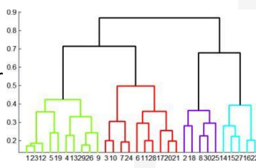

- Key operation: Repeatedly combine two nearest clusters

  核心操作：反复合并两个最近的聚类

- Three important questions:

  - **1)** How do you represent a cluster of more than one point? 

    如何表示包含多个点的簇？

  - **2)** How do you determine the “nearness” of clusters? 

    如何确定簇的“邻近度”？

  - **3)** When to stop combining clusters?

    何时停止合并聚类？

### Euclidean Space 欧几里得空间

- **Key operation:** **Repeatedly combine two nearest clusters**

  关键操作： 反复合并两个最近的聚类

- **(1) How to represent a cluster of many points?** 

  (1) 如何表示包含多个点的集群？

  - **Key problem:** As you merge clusters, how do you represent the “location” of each cluster, to tell which pair of clusters is closest?

    核心问题： 在合并聚类时，如何表征每个聚类的"位置"，以判断哪对聚类距离最近？

  - **Euclidean case:** each cluster has a **centroid** = average of its (data) points

    欧几里得情形： 每个聚类具有一个质心，即其（数据）点的平均值。

- **(2) How to determine “nearness” of clusters?** 

  (2) 如何确定簇的“邻近性”？

  - Measure cluster distances by distances of centroids

    通过质心间距测量聚类距离

#### Example: Hierarchical Clustering 层次聚类

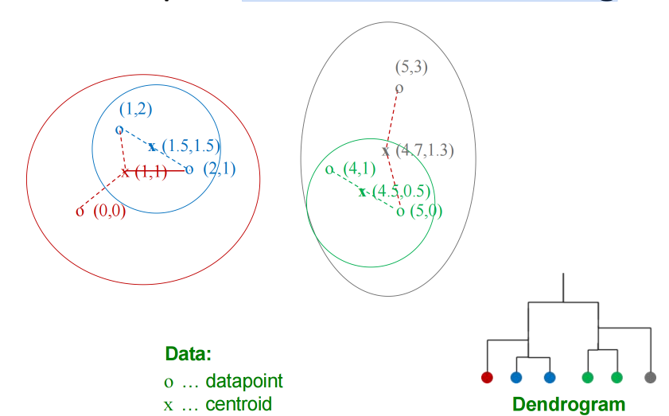

### For Non-Euclidean case

**What about the Non-Euclidean case?**

- The only “locations” we can talk about are the points themselves 

  那么非欧几何的情况又如何呢？

  - i.e., there is no “average” of two points

    即，不存在两个点的“平均值”

- **(1) How to represent a cluster of many points? clustroid** = (data) point “**closest**” to other points

  如何表示多个点的聚类簇？聚类中心体=（数据）点中“最接近”其他点的点

- **(2) How do you determine the “nearness” of clusters?** Treat clustroid as if it were centroid, when computing inter-cluster distances

  如何确定簇间的“邻近度”？ 在计算簇间距离时，将簇核心视作质心来进行辅助计算

### Clustroid 簇状体

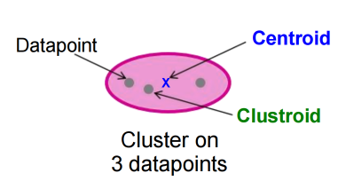

**Centroid** is the avg. of all (data)points in the cluster. This means centroid is an “**artificial**” point.

**质心**是簇中所有数据点的平均值，这意味着质心是一个“人为”设定的点。

**Clustroid** is an **existing** (data) point that is “closest” to all other points in the cluster.

**簇中心点**是指簇中与所有其他数据点“距离最近”的现有数据点。

### Cloest Point 最近的点

clustroid = point "closest" to other points

- Possible meanings of "Cloest":

  - Smallest maximum distance to other points 

  - Smallest average distance to other points 

  - Smallest sum of squares of distances to other points

    - For distance metric **d**clustroid **c** of cluster **C** is;

    - $$
      \min_{c} \sum_{x \in C} d(x, c)^{2}
      $$

### Termination Condition 终止条件

- **(3) When do you stop combining clusters?** 

  你何时停止合并聚类？

  - **Approach 1:** Pick a number *k* upfront, and stop when we have *k* clusters

    **步骤一**： 预先选定数值k，在形成k个聚类时停止

    - Makes sense when we know that the data naturally falls into *k* classes 

      当我们知道数据自然分为k个类别时，这就说得通了。

  - **Approach 2:** Stop when the next merge would create a cluster with low “cohesion”

    **步骤二**： 当下一轮合并将生成低内聚性聚类时终止（也就是如果下一轮变化无法将当前的簇变得更紧密，则可以终止）

    - i.e, a “bad” cluster

#### Cohesion 紧凑性

- **Approach 3.1:** Use the **diameter** of the merged cluster = maximum distance between points in the cluster

  方法 3.1： 使用合并后簇的直径 = 簇内点之间的最大距离

- **Approach 3.2:** Use the **radius** = maximum distance of a point from centroid (or clustroid)

  方法3.2： 使用半径 = 点到质心（或聚类中心点）的最大距离

- **Approach 3.3:** Use a**density-based approach** 

  方法3.3： 采用基于密度的方法

  - Density = number of points per unit volume 

    密度 = 单位体积内的点数

  - E.g., divide number of points in cluster by diameter or radius of the cluster 

    例如，将簇中的点数除以簇的直径或半径

  - Perhaps use a power of the radius (e.g., square or cube)

    或许可以采用半径的幂次（例如平方或立方）

### Implementation 执行

- **Naïve implementation of hierarchical clustering:** 

  - At each step, compute pairwise distances between all pairs of clusters, then merge 

    每一步计算所有簇间的成对距离，然后合并

  - O(*N3*)

- Careful implementation using priority queue can reduce time to O(*N2log N*) 

  通过优先队列的谨慎实现，可将时间复杂度降至O(N²log N)

  - Still too expensive for really big datasets that do not fit in memory

    对于无法装入内存的超大型数据集而言，其成本仍然过高

## K-means Clustering

- Assumes Euclidean space/distance

  假设为欧几里得空间/距离

- Start by picking **k**, the number of clusters

  首先选择k值，即聚类数量

- Initialize clusters by picking one point per cluster 

  从每个簇中选取一个点初始化簇心

  - **Example:** Pick one point at random, then **k-1** other points, each as faraway as possible from the previous points

    示例： 随机选取一个点，随后依次选取k-1个点，每个新点均与已选点集保持最远距离

### Populating Clusters 填充群集

1. For each point, place it in the cluster whose current centroid it is nearest

   将每个点归入其最邻近当前质心的聚类中

2. After all points are assigned, update the locations of centroids of the **k** clusters

   所有点分配完成后，更新k个簇的质心位置

3. Reassign all points to their closest centroid  

   将所有点重新分配至最近质心

   - Sometimes moves points between clusters

     偶尔会在集群间移动数据点

**Repeat 2 and 3 until convergence** 

重复步骤2和3直至收敛

- **Convergence:** Points don’t move between clusters and centroids stabilize

  收敛性：数据点不再在聚类间移动，且质心位置趋于稳定

#### Example: Assigning Clusters 示例：分配聚类

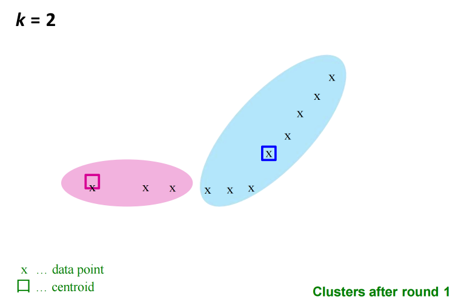

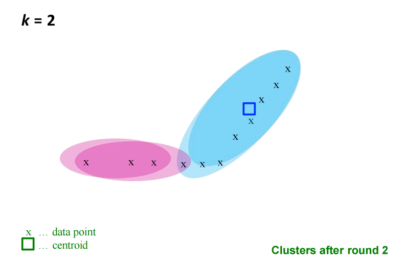

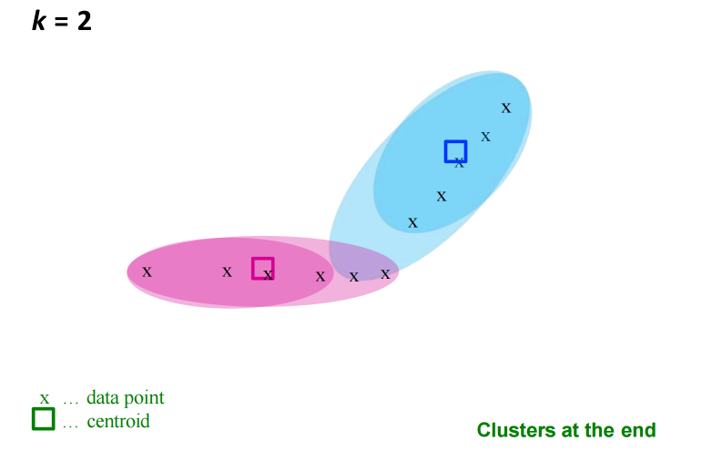

### Getting the K right 正确地决定k的大小

- Try different **k**, looking at the change in the average distance to centroid, as **k** increases.

  尝试不同的k值，观察各点到质心的平均距离变化，直至其开始增大。

#### Example: Picking K

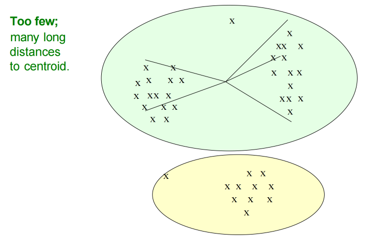

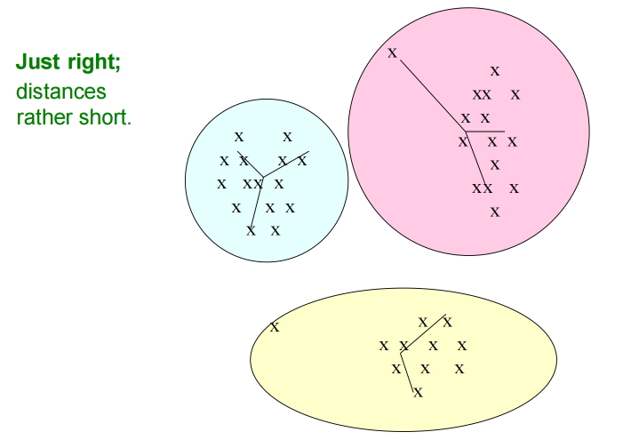

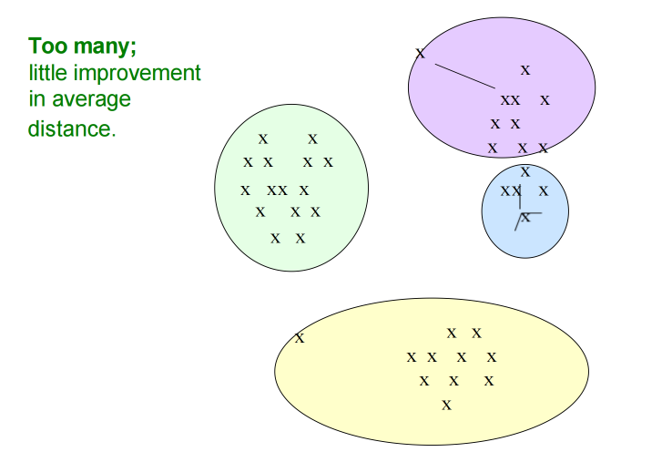

- Average falls rapidly until right **k**, then changes little

  平均值在达到正确k值前迅速下降，之后变化甚微

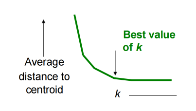

### Picking the initial k points 选取初始k个点

- **Approach 1: Sampling** 

  方法一：抽样法

  - Cluster a sample of the data using hierarchical clustering, to obtain *k* clusters 

    采用层次聚类方法对数据样本进行聚类分析，获得k个簇

  - Pick a point from each cluster (e.g. point closest to centroid)

    从每个簇中选取一个点（例如最接近质心的点） 

  - Sample fits in main memory

    样本可载入主内存

- **Approach 2: Pick “dispersed” set of points** 

  方法二：选取“分散式”点位集

  - Pick first point at random

    随机选择第一个点

  - Pick the next point to be the one whose minimum distance from the selected points is as large as possible 

    选择下一个点的原则是：该点与已选点之间的最小距离应尽可能最大化

  - Repeat until we have *k* points

    重复此过程直至获得k个点

### Complexity 复杂度

- In each round, we have to examine each input point exactly once to find closest centroid

  每轮计算中，我们必须对每个输入点进行一次精确检查以确定最近质心

- Each round is *O*(*kN*) for *N* points, *k* clusters

  每轮处理N个点、k个簇的时间复杂度为O(kN)

- But the number of rounds to convergence can be very large!

  但收敛所需的迭代次数可能非常巨大！

- Can we cluster in a single passover the data?

  我们能否一次性完成数据聚类？

### BFR Algorithm: Overview

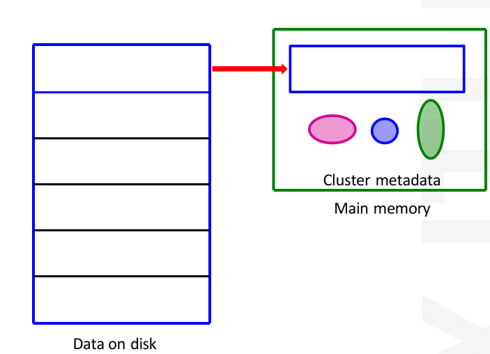

### Limitations of BFR Algorithm BFR算法的局限性

- Make strong assumptions: 

  提出强有力的假设：

  - Clusters are normally distributed in each dimension 

    聚类在各维度上通常呈正态分布

  - Axes are fixed – ellipsesatan angle are **not** OK

    坐标轴为固定设置——不接受倾斜角度的椭圆

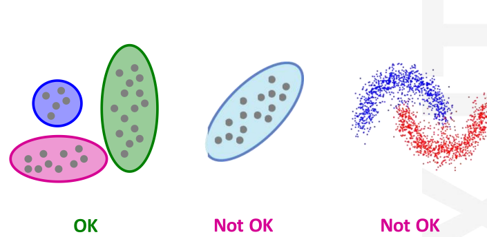

### Cure Algorithm 核心算法

**CURE (Clustering Using REpresentatives):** 

- Assumes a Euclidean distance 

  采用欧氏距离

- Allows clusters to assume any shape 

  支持聚类呈现任意形状

- **Uses a collection of representative points to represent clusters**

  采用代表性点集合来表征聚类

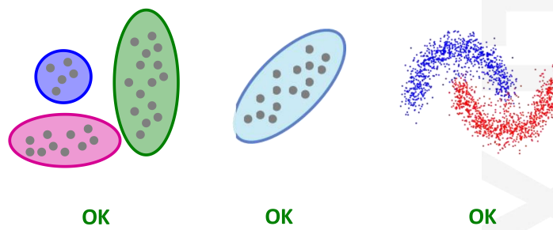

### Summary

- **Clustering:** Given a **set of points**, with a notion of **distance** between points, **group the points** into some number of **clusters**

  聚类： 给定一组具有距离定义的数据点，将数据点划分为若干簇

- **Algorithms:** 

  - Agglomerative **hierarchical clustering**: 

    凝聚式层次聚类：

    - Centroid and clustroid

      质心与聚类中心点

  - **k-means:** 

    - Initialization, picking *k*

      初始化，选取k个中心点

  - **BFR**

  - **CURE**

## Supplementary of Clustering 关于聚类的补充知识

**Important Note**: The core of the assessment for all content in this explanation lies in the conceptual key points specified in the slides, including the application scenarios of distance measurements, the key steps of algorithm processes, and the understanding of core ideas. You need to focus on mastering the corresponding relationship between "principle + application scenario" rather than complex formula derivation; the example part is designed to assist in understanding concepts, and similar scenarios will be used for questions in the examination.

重要提示：本讲解所有内容的考核核心均以课件中明确的概念要点为准，包括**距离度量**的应用场景、**算法流程的关键步骤**、**核心思想的理解**。需要重点掌握"**原理+应用场景**"的对应关系，而非复杂的公式推导；示例部分旨在辅助概念理解，考试提问将采用同类场景。

### I. Three Common Distance Measurements 三种常见距离测量方法

Distance measurement is the core foundation of clustering, used to measure the "similarity" between samples—the smaller the distance, the more similar the samples, and the more likely they are to be grouped into the same cluster.

**距离度量**是聚类的核心基础，用于衡量**样本间的“相似性”**——**距离越小则样本越相似**，越可能被划分到同一簇中。

#### 1. Euclidean Distance 欧几里得距离

**Key Points to Master**: Intuitive spatial straight-line distance in n-dimensional space; applicable to continuous numerical data with consistent dimensions (or standardized);  sensitive to dimension differences, requiring standardization/normalization when dimensions are inconsistent. 

**需掌握要点**：n维空间中的直观空间直线距离；适用于维度一致（或经标准化处理）的连续数值数据；对维度差异敏感，在维度不一致时需进行标准化/归一化处理。

#### 2. Jaccard Distance 杰卡德距离

**Key Points to Master**: Derived from set theory (1 - Jaccard Similarity); measures the overlap between two sets; applicable to discrete data and boolean data (0-1 variables), such as shopping lists and keyword sets. 

需掌握要点：源于集合论（1 雅卡尔德相似系数）；用于衡量两个集合的重叠程度；适用于离散数据与布尔数据（0-1变量），如购物清单和关键词集合。

**Simple Example**: User A's shopping set {Milk, Bread, Egg}, User B's {Bread, Egg, Ham}; Jaccard Similarity = 2/4 = 0.5, Jaccard Distance = 0.5.

简单示例：用户A的购物集合为{牛奶, 面包, 鸡蛋}，用户B的集合为{面包, 鸡蛋, 火腿}；杰卡德相似度 = 2/4 = 0.5，杰卡德距离 = 0.5。

#### 3. Cosine Distance 余弦距离

**Key Points to Master**: Measures the angle between two vectors, reflecting directional similarity (not length); calculated as 1 - Cosine Similarity; applicable to high-dimensional data focusing on "trend similarity", such as document term frequency vectors. 

需掌握的关键点：衡量两个向量间的夹角，反映方向相似性（与长度无关）；计算方式为1减去余弦相似度；适用于高维数据中关注"趋势相似性"的场景，例如文档词频向量分析。

**Simple Example**: Document A's term frequency (AI:2, ML:3), Document B's (AI:4, ML:6); Cosine Similarity = 1, Cosine Distance = 0 (same topic)

简单示例：文档A的词频（AI:2次，ML:3次），文档B的词频（AI:4次，ML:6次）；余弦相似度=1，余弦距离=0（主题相同）

## II. Agglomerative Hierarchical Clustering (Bottom-Up) 凝聚式层次聚类（自底向上）

**Core Idea**: Start with each sample as an independent cluster, repeatedly merge the two most similar clusters until the stop condition is met, forming a dendrogram. 

**核心思想**：从每个样本作为独立聚类开始，反复合并两个最相似的聚类直至满足停止条件，最终形成树状图结构。

**Key Algorithm Process**

1. Initialize: Treat N samples as N clusters. 

   初始化：将N个样本视为N个簇。

2. Calculate inter-cluster distances: Build a distance matrix using the specified metric. 

   计算簇间距离：使用指定度量标准构建距离矩阵。

3. Merge clusters: Combine the pair of clusters with the smallest distance into a new cluster. 

   合并聚类簇：将距离最小的一对聚类簇合并为新簇。

4. Update distance matrix: Recalculate the distance between the new cluster and other clusters. 

   更新距离矩阵：重新计算新聚类与其他聚类之间的距离。

5. Check stop condition: Stop if only 1 cluster remains or the target cluster number is reached; otherwise iterate. 

   检查停止条件：若仅剩1个聚类或达到目标聚类数则停止，否则继续迭代。

6. Generate results: Obtain the final clustering by truncating the dendrogram. 

   生成结果：通过截断树状图获得最终聚类。

**Key Supplementary: Inter-Cluster Distance Methods** 

关键补充：聚类间距离方法

- Single Linkage: Minimum distance between any two samples of the two clusters. 

  单联动：两个聚类中任意两样本间的最小距离。

- Complete Linkage: Maximum distance between any two samples of the two clusters.

  完全连接法：两个聚类中任意样本间最大距离。

- Average Linkage: Average distance between all sample pairs of the two clusters (most widely used).

  平均链接法：计算两个聚类中所有样本对之间的平均距离（应用最广泛）。

## III. K-Means Clustering Algorithm K均值聚类算法

**Core Idea**: Divide N samples into K pre-specified clusters, minimizing the Within- Cluster Sum of Squares (WCSS) through iteration. 

核心思想：通过迭代将N个样本划分为K个预设聚类，最小化组内平方和（WCSS）。

**Key Algorithm Process (Lloyd's Iteration)**

关键算法流程（劳埃德迭代）

1. Determine K: Specify the number of clusters (via business experience or elbow method). 

   确定K值：指定聚类数量（可通过业务经验或肘部法则确定）。

2. Initialize centroids: Randomly select K samples as initial centroids (K- Means++ is recommended for optimization). 

   初始化质心：随机选择K个样本作为初始质心（推荐使用KMeans++算法进行优化）。

3. Assign samples: Allocate each sample to the cluster with the nearest centroid. 

   分配样本：将每个样本分配至最近的质心所在的簇。

4. Update centroids: Calculate the mean of samples in each cluster as the new centroid. 

   更新质心：计算每个聚类中样本的均值作为新质心。

5. Check convergence: Stop if cluster assignments/centroids stabilize or WCSS change is minimal; otherwise iterate. 

   检查收敛性：若聚类分配/质心稳定或WCSS变化极小则停止；否则继续迭代。

6. Output results: Obtain K clusters and their centroids. 

   检查收敛性：若聚类分配/质心稳定或WCSS变化极小则停止；否则继续迭代。

**Key Notes** 

- K selection is critical: Use elbow method or business knowledge. 

  K值选择至关重要：可采用肘部法则或依据业务知识确定。

- Sensitive to initial centroids: Run multiple times or use K-Means++. 

  对初始质心敏感：需多次运行或采用K-Means++算法。

- Data preprocessing: Standardize continuous data; not suitable for discretedata.

  数据预处理：适用于连续型数据标准化；不适用于离散型数据。
