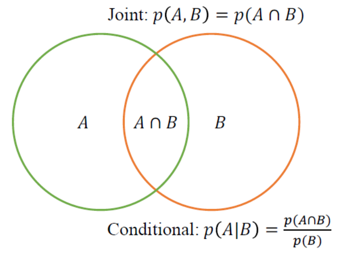
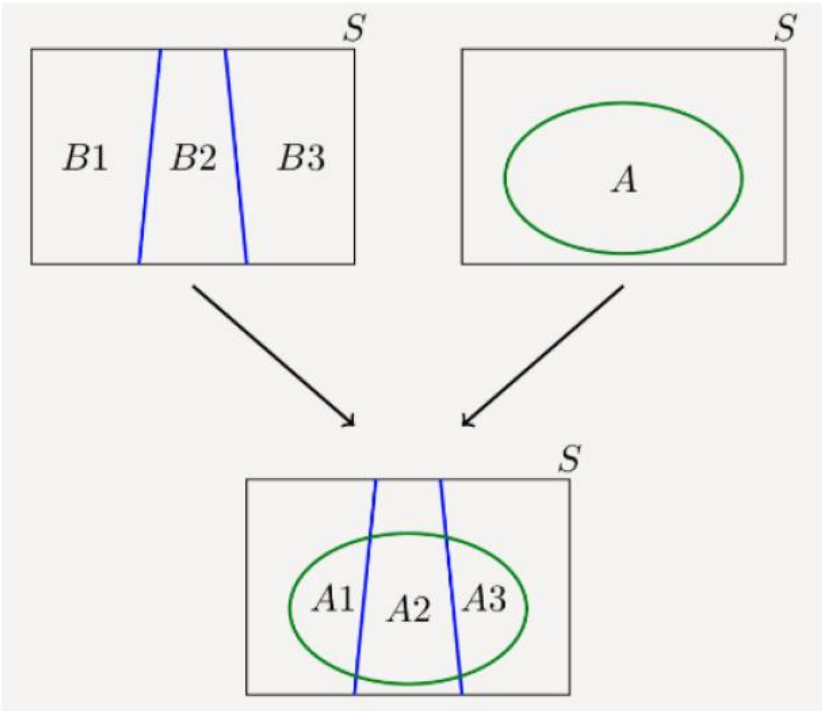
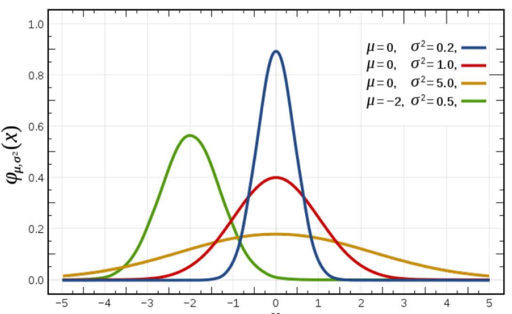
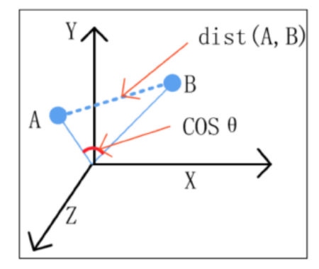
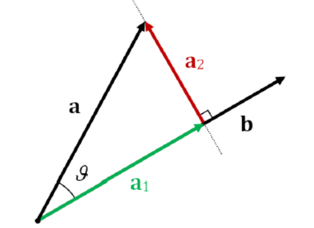
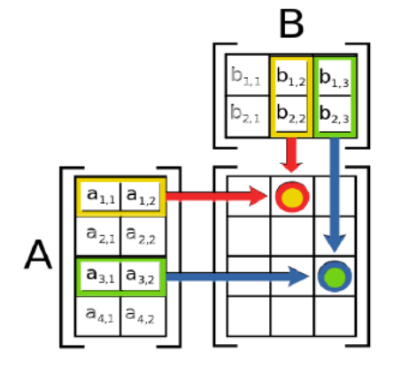
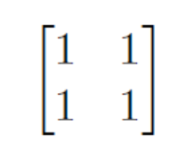
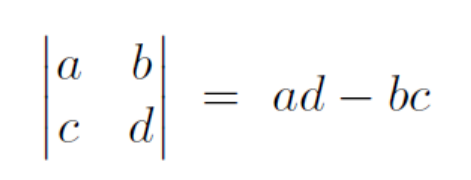
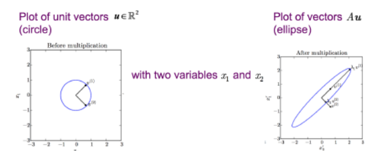

## Probability Review for Machine Learning 机器学习概率论回顾

### Motivation

Uncertainties arises through:

不确定性产生于：

- Noisy measurement

  噪声测量

- Variability between samples

  样本间的变异性

- Finite size of data set

  数据集有限规模

Probability provides a consistent framework for the quantification and manipulation of uncertainty.

概率为量化和处理不确定性提供了一致的框架。

### Sample Space 样本空间

**Sample space** Ω is the set of all possible outcomes of an experiment.

**样本空间 Ω** 是一个实验中所有可能结果的集合。

**Observations** w ∈ Ω are points in the space also called sample outcomes, realizations, or elements.

**观测值 w ∈ Ω** 是空间中的点，亦称为样本结果、实现值或元素。

**Events** E ⊂ Ω are subsets of the sample space.

**事件 E ⊂ Ω** 是样本空间的子集。

In this experiment we flip a coin twice:

在本实验中，我们投掷硬币两次：

- **Sample space**: All outcomes Ω = {HH, HT, TH, TT}

  **样本空间**：所有可能的结果 Ω = {HH, HT, TH, TT}

- **Observation**: w = HT valid sample since w ∈ Ω

  **观察结果**：w为HT有效样本，因为w ∈ Ω。

- **Event**: Both flips same E = {HH. TT} valid event since E ⊂ Ω

  **事件**：两次投掷结果相同 E = {正正, 反反} 为有效事件，因为 E ⊆ Ω

The probability of an event E, P(E) satisfies three axioms:

1. P(E) ≥ 0 for every E

2. P(Ω) = 1

3. If E1, E2, ... are disjoint then
   $$
   P(\cup_{i=1}^{\infty}E_{i}) = \sum^{\infty}_{i=1}P(E_{i})
   $$

### Joint and Conditional Probabilities 联合概率与条件概率

**Joint Probability** of A and B is denoted P(A, B)

A和B的**联合概率**表示为P(A, B)。

**Conditional Probability** of A given B is denoted P(A|B)

给定B的条件下事件A发生的**条件概率**记作P(A|B)。

$$
p(A, B) = p(A|B)p(B) = p(B|A)p(A)
$$

#### Conditional Example 条件性示例

Probability of passing the midterm is 60% and probability of passing both the final and the midterm is 45%.

期中考试通过的概率为60%，同时通过期末考试和期中考试的概率为45%。

What is the probability of passing the final given the student passed the midterm?

已知学生通过了期中考试，通过期末考试的概率是多少？

P(E|M) = P(M, F)/P(M) = 0.45/0.6 = 0.75

### Independence 自变量

Events A and B are **independent** if **P(A, B) = P(A)P(B)**

事件A和B是**独立的**，当且仅当 **P(A, B) = P(A)P(B)**。

- Independent: A: First toss is HEAD; B: Second toss is HEAD

  独立事件：A：第一次抛掷为正面；B：第二次抛掷为正面

  - P(A, B) = 0.5 * 0.5 = P(A)P(B)

- Not Independent: A: First toss is HEAD; B: first toss is HEAD;

  非独立事件：A: 首次投掷为正面；B: 首次投掷为正面。

  - P(A, B) = 0.5 ≠ P(A)P(B)

Events A and B are **conditionally independent** given C if **P(A, B|C) = P(B|C)P(A|C)**

事件A和B在给定C的条件下是条件独立的，若满足 P(A, B|C) = P(B|C)P(A|C)。

Consider two coins: A regular coin and a coin which always outputs HEAD or always outputs TAIL.

考虑两枚硬币：一枚普通硬币和一枚始终输出正面或始终输出反面的硬币。

A = The first toss is HEAD; B = The second toss is HEAD; C = The regular coin is used. D = The other coin is used

A = 第一次投掷结果为正面；B = 第二次投掷结果为正面；C = 使用常规硬币；D = 使用另一枚硬币。

Then A and B are conditionally independent given C, but A and B are NOT conditionally independent given D.

在给定C的条件下，A和B是条件独立的；然而，在给定D的条件下，A和B并非条件独立。

### Marginalization and Law of Total Probability 边缘化与全概率法则

Law of Total Probability: 
$$
\sum_{Y}P(X, Y) = \sum_{Y}P(X|Y)P(Y)
$$

### Bayes' Rule 贝叶斯法则

$$
P(A|B)=\frac{P(B|A)P(A)}{P(B)}
$$

$$
P(θ|x)=\frac{P(x|θ)P(θ)}{P(x)}
$$

$$
Posterior = \frac{Likelihood * Prior}{Evidence}
$$

$$
Posterior \propto Likelihood \times Prior
$$

#### Bayes' Example 贝叶斯案例

Suppose you have tested positive for a disease. What is the probability you actually have the disease?

假设你检测出患有某种疾病。实际上你患病的概率是多少？

P(T = 1 | D = 1) = 0.95 (true positive)

P(T = 1 | D = 0) = 0.10 (false positive)

P(D = 1) = 0.1 (prior)

So P(D = 1 | T = 1) = ?

Use Bayes' Rule:

$$
P(D = 1|T = 1) = \frac{P(T = 1|T = 1)P(D = 1)}{P(T = 1)} = \frac{0.95 * 0.1}{P(T = 1)} = 0.51
$$

$$
P(T = 1) = o(t = 1|D = 1)P(D = 1) + P(T = 1|D = 0)P(D = 1) = 0.95 * 0.1 + 0.1 * 0.90 = 0.185
$$

### Random Variable 随机参数

How do we connect sample spaces and events to data?

如何将样本空间与事件与数据联系起来？

- A random variable is a mapping which assigns a real number X(w) to each observed outcome w ∈ Ω

  随机变量是一个映射，它将一个实数X(w)赋予每个观察到的结果w ∈ Ω。

For example, Let's flip a coin 10 times. X(w) counts the number of Heads we observe in our sequence. If w = HHTHTHHTHT then X(w) = 6.

例如，让我们抛硬币10次。X（w）计算我们在序列中观察到的正面的数量。如果w = HHTHTTHHTHT，则X（w）= 6。

### Discrete and Continuous Random Variables 离散与连续随机变量

**Discrete** Random Variables

离散随机变量

- Takes countably many values, e.g., number of heads

  取可数个值，例如，正面的次数

- Distribution defined by probability mass function (PMF)

  由概率质量函数（PMF）定义的分布

- Marginalization 边缘化: p(x) = ∑yp(x, y)

**Continuous** Random Variables

连续随机变量

- Takes uncountably many values, e.g., time to complete task

  取不可数多个值，例如，完成任务所需的时间。

- Distribution defined by probability density function (PDF)

  由概率密度函数（PDF）定义的概率分布

- Marginalization 边缘化: p(x) = ∫yp(x, y)dy

### I.I.D.

Random variables are said to be **independent and identically distributed**(i.i.d.) if they are sampled from the same probability distribution and are mutually independent.

随机变量若从同一概率分布中**抽样且彼此相互独立**，则称其具有独立同分布（i.i.d.）性质。

This is a concern assumption for observatrions. For example, coin flips are assumed to be iid.

这是一个关于观测的常见假设。例如，抛硬币通常被假定为独立同分布（i.i.d.）。

### Probability Distribution Statistics 概率分布统计

**Mean**: First Moment, **μ**

均值：第一矩，μ
$$
E[x] = \sum_{i=1}^{\infty}x_{i}p(x_{i}) \space (univariate \space discrete \space r.v.)
$$

$$
E[x] = \int_{-\infty}^{\infty}xp(x)dx \space (univariate \space continuous \space r.v.)
$$

**Variance**: Second (central Moment), **σ2**

方差：第二（中心矩），σ2
$$
Var[x] = \int_{-\infty}^{\infty}(x-\mu)^{2}p(x)dx \\ = E[(x = \mu)^{2}] \\ = E[x^{2}] - E[x]^{2}
$$
Also known as the Normal Distribution, **N(μ, σ2)**

亦称正态分布，N(μ, σ²)
$$
N(x|\mu,\sigma^{2}) = \frac{1}{\sqrt{2\pi\sigma^{2}}}exp\{-\frac{1}{2\sigma^{2}}(x-\mu)^{2}\}
$$

### Multivariate aussian Distribution 多元高斯分布

Multidimensional generalization of the Gaussian 

高斯分布的多维推广

- x is a D-dimensional vector
- μ is a D-dimensional mean vector
- ∑ is a D x D covariance matrix with determinant |∑|

$$
N(x|\mu,\Sigma) = \frac{1}{(2\pi)^{D/2}}\frac{1}{|\sum|^{1/2}}exp\{-\frac{1}{2}(x-\mu)^{T}\Sigma^{-1}(x-\mu)\}
$$

### Covariance Matrix 协方差矩阵

Recall that x an μ are D-dimensional vector

回忆一下，x 和 μ 是 D 维向量。

Covariance matrix ∑ is a matrix whose (i, j) entry is the covariance

协方差矩阵∑是一个矩阵，其(i, j)位置的元素即为协方差。
$$
\Sigma_{ij} = Cov(X_{i}, x_{j}) \\ = E[(x_{i}-\mu_{i})(x_{j}-\mu_{j})] \\ = E[(x_{i}x_{j})] - \mu_{i}\mu_{j}
$$
so notice that the diagonal entries are the variance of each elements. The covariant matrix has the property thta it is symmetrix and positive-semidefinite (this is useful for whitening)

请注意，对角线上的元素表示每个变量的方差。协方差矩阵具有对称性和半正定性的特性（这一特性在白化处理中非常有用）。

### Inferring Parameters 参数推断

We have datya X and we assum it is sampled from some distribution. How do we figure our the parameters that 'best' fit that distribution? 

我们拥有数据X，并假设其来自某种分布。如何确定“最佳”拟合该分布的参数？

Maximum Likelihood Estimation (MLE)

最大似然估计（MLE）方法。
$$
\hat{\theta}_{MLE} = \underset{\theta}{\operatorname{argmax}} P(X|\theta)
$$

Maximum A posteriori Probability (MAP)
$$
\hat{\theta}_{MAP} = \underset{\theta}{\operatorname{argmax}} P(\theta|X)
$$

### MLE for Univariate Gaussian Distribution 单变量高斯分布的最大似然估计

We are trying to infer the paramters for a Univariatre Gaussian Distribution, mean (μ) and variance (σ2)

我们尝试推断单变量高斯分布的参数，即均值（μ）和方差（σ²）。
$$
N(x|\mu, \sigma^{2}) = \frac{1}{\sqrt{2\pi\sigma^{2}}}exp\{-\frac{1}{2\sigma^{2}}(x-\mu)^{2}\}
$$
The likelihood that our observations x1, ..., xn were generated by a univariate Gauissian with parameters μ and σ2 is

我们观测到的数据x1, ..., xn由参数为μ和σ²的一元高斯分布生成的概率是
$$
Likelihood = p(x_{1}...x_{N}|\,u,\sigma^{2}) = \prod_{2}^{N}\frac{1}{\sqrt{2\pi\sigma^{2}}}exp\{-\frac{1}{2\sigma^{2}}(x_{i}-\mu)^{2}\}
$$
For MLE we want to maximize this likelihood, which is difficult because it is represented by a product of terms

对于极大似然估计（MLE），我们需要最大化此似然函数，但由于其由多项乘积表示，这一过程颇具挑战性。
$$
Likelihood = p(x_{1}...x_{N}|\,u,\sigma^{2}) = \prod_{2}^{N}\frac{1}{\sqrt{2\pi\sigma^{2}}}exp\{-\frac{1}{2\sigma^{2}}(x_{i}-\mu)^{2}\}
$$
So we take the log of the log of the likelihood so the product becomes a sum

因此，我们对似然函数的对数再取对数，从而使乘积转化为求和。
$$
Log Likelihood = logp(x_{1}...x_{N}|\mu,\sigma^{2}) \\ = \sum_{i=1}^{N}log\frac{1}{\sqrt{2\pi\sigma^{2}}}exp\{-\frac{1}{2\sigma^{2}}(x_{i}-\mu)^{2}\}
$$
Since log is monotonically increasing max **L(θ) = max log L(θ)**

由于对数函数是单调递增的，最大似然函数 L(θ) 的最大值等于其对数似然函数 log L(θ) 的最大值。

The log Likelihood simplifies to 可以被简化为
$$
L(\mu,\sigma) = \sum_{i=1}^{N}log\frac{1}{\sqrt{2\pi\sigma^{2}}}exp\{-\frac{1}{2\sigma^{2}}(x_{i}-\mu)^{2}\} \\ = -\frac{1}{2}Nlog(2\pi\sigma^{2})-\sum^{N}_{i=1}\frac{(x_{i}-\mu)^{2}}{2\sigma^{2}}
$$
To maximize we take the derivatives, set equal to 0, and solve:
$$
L(\mu,\sigma) = -\frac{1}{2}Nlog(2\pi\sigma^{2})-\sum^{N}_{i=1}\frac{(x_{i}-\mu)^{2}}{2\sigma^{2}}
$$
Derivative w.r.t. μ, set equal to 0, and solve for mean μ

对μ的导数令其等于零，并求解均值μ。
$$
\frac{\partial \mathcal{L}(\mu, \sigma)}{\partial \mu} = 0 \Rightarrow \hat{\mu} = \frac{1}{N} \sum_{i=1}^{N} x_i
$$

Therefore the mean μ that maximizes the likelihood is the average of the data points

因此，使似然函数最大化的均值μ即为数据点的平均值。

Derivative w.r.t. σ2, set equal to 0, and solve for mean σ2

对σ²求导，令其等于零，求解σ²的均值。
$$
\frac{\partial \mathcal{L}(\mu, \sigma)}{\partial \sigma^2} = 0 \Rightarrow \hat{\sigma}^2 = \frac{1}{N} \sum_{i=1}^{N} (x_i - \hat{\mu})^2
$$

## Linear Algrbra Review for Machine Learning 机器学习线性代数回顾

### Basic 基础

- A scalar is a number

  标量是一个数字。

- A vector is a 1-D array of numbers. The set of vectors of lenght n with real elements is denoted by **Rn**

  向量是一维数字数组。长度为n且元素为实数的向量集合记作Rn。

  - Vectors can be multiplied by a scalar

    向量可以与标量相乘。

  - Vector can be added together if dimensions match

    如果维度匹配，向量可以相加。

- A matrix is a 2-D array of numbers. The set of m x n matrices with real elements is denoted by Rm*n

  矩阵是一个二维数字阵列。具有实元素的 m x n 矩阵集合记作 Rm*n。

  - Matrices can be added together or multiplied by a scalar.

    矩阵可以相加或与标量相乘。

  - We can multiply Matrices to a vector if dimensions match

    如果维度匹配，我们可以将矩阵与向量相乘。

- In the rest we denote scalars with lowercase letters like a, vectors with bold lowercase v, and matrices with bold uppercase A.

  在接下来的部分中，我们将用如a所示的小写字母表示标量，用粗体小写字母v表示向量，用粗体大写字母A表示矩阵。

### Norms 范数

- Norms measure how "large" a vector is. They can be defined for matrices too.

  范数用于衡量向量的“大小”程度，该概念亦可推广至矩阵定义。

- The Lp-norm for a vecrtor x: 

  向量x的Lp-范数：

  - $$
    \| \mathbf{x} \|_p = \biggl[ \sum_i |x_i|^p \biggr]^{\frac{1}{p}}
    $$

  - The l2-norm is known as the Euclidean norm

    L2范数也被称为欧几里得范数。

  - The l1-norm is known as the Manhattan norm. i.e., ||x||1 = ∑i|x1|

    l1范数被称为曼哈顿范数，即||x||1 = ∑i|x1|。

  - The l♾️ is the max (or supermum) norm, i.e., ||x||♾️ = maxi|x1|

    l♾️ 表示最大（或上确界）范数，即 ||x||♾️ = maxi|x1|。

### Dot Product 点乘

- Dot product is defined as 

  点积的定义为

  - $$
    \mathbf{v} \cdot \mathbf{u} = \mathbf{v}^\top \mathbf{u} = \sum_i u_i v_i
    $$

- The l2 norm can be written in terms of dot product: ||u||2 = √u.u.

  l₂范数可以用点积的形式表示：||u||₂ = √(u·u)。

- Dot product of two vectors can be written in terms of their l2 norms and the angle θ between them:

  两个向量的点积可以用它们的l2范数及它们之间的夹角θ表示：

  - $$
    \mathbf{a}^\top \mathbf{b} = \| \mathbf{a} \|_2 \| \mathbf{b} \|_2 \cos(\theta).
    $$

## Cosine Similarity 余弦相似度

Cosine between two vectors is a measure of their similarity:

两个向量之间的余弦相似度是衡量它们相似性的指标。

- $$
  \cos(\theta) = \frac{\mathbf{a} \cdot \mathbf{b}}{\| \mathbf{a} \| \| \mathbf{b} \|}
  $$

**Orthogonal Vectors**: Two vectors a and b are orthogonal to each other if a·b = 0.

**正交向量**：若两个向量a与b的点积a·b等于0，则称这两个向量彼此正交。

此外，点积的正负号也直接反映了夹角的大致范围：

- **a⋅b>0**：cos(θ)>0，说明夹角 θ 是锐角 (0≤θ<90)，两个向量指向大致相同的方向。
- **a⋅b=0**：cos(θ)=0，说明夹角 θ 是直角 (90)，两个向量**正交（垂直）**。
- **a⋅b<0**：cos(θ)<0，说明夹角 θ 是钝角 (90<θ≤180)，两个向量指向大致相反的方向。

### Vector Projection 向量投影

Given two vectors a and b, let mean b = b/||b|| be the unit vector in the direction of b.

已知向量a和b，令单位向量 b̂ = b/||b||。单位向量非常特殊，它的长度**永远是 1**。它的存在只有一个目的：**只提供方向，不改变大小**。就像一个只负责指路的箭头，告诉你“往那边走”，但不管你走多远。把任意一个非零向量 **b** 除以它自己的长度（我们用 ∣∣b∣∣ 来表示长度），得到的就是指向同一个方向、但长度为 1 的单位向量 **b̂**。

在上面的图像中，

- a1：向量 a 在向量 b 方向上的**正交投影 (orthogonal projection)**。你可以想象在向量 b 的直线上方有一个光源，a1 就是向量 a 在这条直线上的“影子”。
- a2：与向量 b 垂直的分量。

接下来如果计算**点积和投影的长度**，则可以通过公式

- $$
  \mathbf{a}_1 = a_1 \cdot \hat{\mathbf{b}}
  $$

结合点积的定义公式，$$ \mathbf{a} \cdot \mathbf{b} = \| \mathbf{a} \| \| \mathbf{b} \| \cos(\theta) $$，我们可以变形为 $$ \mathbf{a} \cdot \mathbf{b} = (\| \mathbf{a} \| \cos(\theta)) \| \mathbf{b} \| $$。在这里可以发现括号里的部分 $$(\| \mathbf{a} \| \cos(\theta))$$ 正是投影的长度 a1，所以可以再次改写为 $$ \mathbf{a} \cdot \mathbf{b} = a_{1} \cdot \| \mathbf{b} \| $$

**点积的核心意义1**：向量 a 和 b 的点积，等于 a 在 b 方向上投影的长度，再乘以 b 的长度。

点积与单位向量，可以通过公式：

- $$
  \mathbf{a}_1 = a \cdot \frac{b}{\|b\|}
  $$

里的 $$\frac{b}{\|b\|}$$ 是指向量 b 方向上的**单位向量**（长度为1的向量），通常记作 $$\hat{\mathbf{b}}$$。

**点积的核心意义2**：如果一个向量 a 与一个**单位向量** $$\hat{\mathbf{b}}$$ 做点积，得到的结果**直接就是** a 在 $$\hat{\mathbf{b}}$$ 方向上投影的长度。

### Trace 迹

Trace is the sum of all the diagonal elements of a matrix, i.e.,

迹是一个矩阵所有对角线元素的总和，即，

- $$
  Tr(A) = \sum_{i}A_{i,i}
  $$

Cyclic property:

循环性质：

- $$
  Tr(ABC) = Tr(CBA) = Tr(BCA)
  $$

### Multiplication 乘

Matrix-vector multiplication is a linear transfermation, In other words:

- $$
  M(v_1 + av_2) = Mv_1 + aMv_2 \Rightarrow (Mv)_i = \sum_jM_{i,j}v_{j}
  $$

 Matrix-matrix multiplication is the composition of linear transformations, i.e.,

- $$
  (AB)v = A(Bv)\Rightarrow (AB)_{i,j} = \sum_{k}A_{i,k}B_{k,j}
  $$

### Invertibality 可逆性

**单位矩阵 identity matrix I**。它的样子是一个**对角线上是1、其他地方是0的方阵**。它的核心作用是在矩阵乘法中充当**数字1**的角色，任何矩阵或向量乘以它之后都**保持原样**

t has the property IA = A (BI = B) and Iv = v.

它具有性质：IA = A（BI = B）以及Iv = v。

A square matrix A is invertible if A-1 exists such that A-1A=AA-1=I

若存在矩阵A⁻¹使得A⁻¹A=AA⁻¹=I，则称方阵A可逆。

Not all non-zero matrices ate invertble, e.g., the following matrix is not invertible.

并非所有非零矩阵都可逆，例如，以下矩阵便不可逆。

- 

### Transposition 换位

Transposition is an operation on matrices (and vectors) that interchange rows with columns. $$(A^{T})_{i,j}=A_{j,i}$$

转置是一种对矩阵（及向量）进行的运算，它将行与列互换。

- $$(\mathbf{A}\mathbf{B})^\top = \mathbf{B}^\top \mathbf{A}^\top$$

- $$\mathbf{A}$$ is called **symmetrix** when $$\mathbf{A} = \mathbf{A}^\top$$

  当矩阵$$\mathbf{A}$$满足$$\mathbf{A} = \mathbf{A}^\top$$时，称其为对称矩阵。

- $$\mathbf{A}$$ is called **orthogonal** when $$\mathbf{A}\mathbf{A} = \mathbf{A}^\top \mathbf{A} = \mathbf{I}$$ or $$\mathbf{A}^{-1} = \mathbf{A}^\top$$

  当矩阵$$\mathbf{A}$$满足$$\mathbf{A}\mathbf{A} = \mathbf{A}^\top \mathbf{A} = \mathbf{I}$$或$$\mathbf{A}^{-1} = \mathbf{A}^\top$$时，称其为正交矩阵。

### Diagonal Matrix 对角矩阵

- A diagonal matrix has all entries equal to zero except the diagonal entries which might or might not be zero, e.g., identity matrix.

  对角矩阵是指除对角线上的元素（可能为零也可能非零）外，其余元素均为零的矩阵，例如单位矩阵。

- A square diagonal matrix with diagonal eneries given by entries of vector v is denoted by diag(v).

- Multiplying vector x by a diagonal matrix is efficient

  - $$ \operatorname{diag}(\mathbf{v})\mathbf{x} = \mathbf{v} \odot \mathbf{x}, $$ where $$\odot$$ is the entrywise product

- Inverting a square diagonal matrix is efficient

  - $$ \operatorname{diag}(\mathbf{v})^{-1} = \operatorname{diag}\left(\left[\frac{1}{v_1}, \dots, \frac{1}{v_n}\right]^\top\right) $$

### Determinant 行列式

- Determinant of a square matrix is amapping to scalars

  方阵的行列式是一个映射到标量的运算。

  - det(A) or |A|

- Measures how much multiplication by the matrix expands or contracts the space.

  衡量矩阵乘法对空间进行扩张或收缩的程度。

- Determinant of product is the product of determinants:

  乘积的行列式等于行列式的乘积：

  - det(AB) = det(A)det(B)

### List of Equivalencies 等价性列表

Assuming that A is a square matrix, the following statements are equivalent

假设A是一个方阵，则以下命题等价。

- Ax = b has a unique solution (for every b will correct dimension)

  Ax = b 具有唯一解（对于任意具有正确维度的b均成立）

- Ax = 0 has a unique, trivial solution: x = 0

  方程 Ax = 0 具有唯一平凡解：x = 0。

- Columns of A are linearly independent

  矩阵A的列向量线性无关。

- A is invertible, i.e. A-1 exists

  A是可逆的，即A⁻¹存在。

- det(A) ≠ 0

  矩阵A的行列式不为零。

### Zero Determinant

If det(A) = 0, then:

- A is linearly dependent

  A是线性相关的。

- Ax = b has infinitely many solutions or no solution. These cases correspond to when b is in the span of columns of A or out of it

  方程组Ax = b有无穷多解或无解，这两种情况分别对应向量b位于矩阵A列空间的内部与外部。

- Ax = 0 has a non-zero solution (since every scalar multiple of one solution is a solution and there is a non-zero solution we gey infinitely many solutions)

  方程Ax = 0存在非零解（由于每个解的标量倍仍是解，且存在非零解，因此我们得到无穷多解）。

### Matrix Decomposition 矩阵分解

- We can decompose an integer into its prime factors, e.g., 12 = 2 x 2 x 3

  我们可以将一个整数分解为其质因数，例如，12 = 2 × 2 × 3。

- Similarly, matrices can be decomposed into product of other matrices

  同样地，矩阵也可以分解为其他矩阵的乘积。

  - $$ \mathbf{A} = \mathbf{V} \operatorname{diag}(\boldsymbol{\lambda}) \mathbf{V}^{-1} $$

- Examples are Eigendecomposition, SVD, Schur decomposition, LU decomposition

  例如特征分解、奇异值分解（SVD）、舒尔分解、LU分解。

### Eigenvectors 特征向量

- An eigenvector of a square matrix A is a nonzero vector v such that multiplication by A only changes the scale of v

  方阵A的一个特征向量是指一个非零向量v，当它被A乘时，仅改变其尺度大小。

  - $$\mathbf{Av} = \lambda\mathbf{v}$$

- The scalar $$\lambda$$ is known as the eigenvalue

  标量λ被称为特征值。

- If v is an eigenvector of A, so is any rescaled vector sv. Moreover, sv still has the same eigenvalue. Thus, we constrain the eigenvector to be of unit length:

  若向量v是矩阵A的一个特征向量，则其任意缩放形式sv同样是特征向量。此外，sv仍保持相同的特征值。因此，我们通常将特征向量约束为单位长度：

  - $$\|v\|_{2} = 1$$

### Characteristic Polynomial 特征多项式 n  

- Eigenvalue equation of matrix A

  矩阵A的特征值方程

  - $$\mathbf{Av} = \lambda\mathbf{v}$$

  - $$\lambda\mathbf{v} - \mathbf{Av} = 0$$

  - $$(\lambda\mathbf{I} - \mathbf{A})\mathbf{v} = 0$$

- If nonzero solution for v exists, then it must be the case that:

  若v存在非零解，则必有：

  - $$det(\lambda\mathbf{I} - \mathbf{A}) = 0$$

- Unpacking the determinant as a function of λ, we get:

  将行列式展开为λ的函数，我们得到：

  - $$ P_A(\lambda) = \det(\lambda \mathbf{I} - \mathbf{A}) = 1 \times \lambda^n + c_{n-1} \times \lambda^{n-1} + \dots + a_0 $$

- This is called the characteristic polynomial of A

  这被称为A的特征多项式。

- If $$\lambda_1,\lambda_2...,\lambda_n$$ are roots of the characteristic polynomial, they are eigenvalues of $$A$$ and we have $$ P_A(\lambda) = \prod_{i=1}^{n} (\lambda - \lambda_i) $$

- $$ c_{n-1} = - \sum_{i=1}^{n} \lambda_i = -\operatorname{tr}(A) $$. This means that the sum of eigenvalues equals to the trace f the matrix.

- $$ c_0 = (-1)^n \prod_{i=1}^{n} \lambda_i = (-1)^n det(\mathbf{A}) $$. The determinant is equal to the product of eigenvalues.

- Roots might be complex. If a root has multiplicity of rj > 1 (This is called the algebraic dimension of eignvalue), then the geometric dimension of eigenspace for that eigenvalue might be less than rj (or equal but never more). But for every eigenvalue, one eigenvector is guaranteed.

  根可能是复数。若某根的重数rj > 1（这称为特征值的代数重数），则该特征值对应的特征空间的几何维数可能小于rj（或等于但绝不会大于）。但每个特征值至少保证存在一个特征向量。

#### Example

- Consider the matrix: $$ \mathbf{A} = \begin{bmatrix} 2 & 1 \\ 1 & 2 \end{bmatrix} $$

  考虑这个矩阵

- The characteristic polynomial is: $$ det(\lambda \mathbf{I} - \mathbf{A}) = det \begin{bmatrix} \lambda - 2 & -1 \\ -1 & \lambda - 2 \end{bmatrix} = 3 - 4\lambda + \lambda^2 = 0 $$

  特征多项式是

- It has roots $$\lambda = 1$$ and $$\lambda = 3$$ which are the two eigenvalues of $$A$$

  该方程具有根 $$\lambda = 1$$ 和 $$\lambda = 3$$，这两个根是矩阵 $$A$$ 的特征值。

- We can then solve for eigenvectors using $$\mathbf{Av} = \lambda\mathbf{v}$$:

  随后，我们可以通过求解特征方程$$\mathbf{Av} = \lambda\mathbf{v}$$来得到特征向量：

  - $$ \mathbf{v}_{\lambda=1} = [1, -1]^\top \quad \text{and} \quad \mathbf{v}_{\lambda=3} = [1, 1]^\top $$

### Eigendecomposition 特征值分解

- Suppose that n x n matrix $$A$$ has linearly independent eigenvectors $$\{\mathbf{v}^{(1)}, ..., \mathbf{v}^{(n)}\}$$ with eigenvalues $$\{\lambda_1,...,\lambda_n\}$$

- Concatenate eigenvectors (as columns) to form matrix $$\mathbf{V}$$
- Concatenate eigenvalues to form vector $$\lambda = [\lambda_1,...,\lambda_n]^\top$$.
- The eigendecomposition of $$A$$ is given by:
  - $$ \mathbf{A}\mathbf{V} = \mathbf{V} diag(\boldsymbol{\lambda}) \Rightarrow \mathbf{A} = \mathbf{V} diag(\boldsymbol{\lambda}) \mathbf{V}^{-1} $$

### Symmetric Matrices 对称矩阵

- Every symmetric (hermitian) matrix of dimension n has a set of (not necessarily unqique) n orthogonal eigenvectors. Furthermore, all eigenvalues are real.

  每个维度为n的对称（厄米特）矩阵均具有一组（不一定唯一）n个正交特征向量。此外，所有特征值均为实数。

- Every real symmetric matrix $$A$$ can be decomposed into real-world eigenvectors and eigenvalues:

  每一个实对称矩阵$$A$$都可以被分解为实特征向量和实特征值。

  - $$\mathbf{A} = \mathbf{QAQ}^{\top}$$

- $$Q$$ is an orthogonal matrix of the eigenvectors of $$A$$, and $$\Lambda$$ is an diagonal matrix of eigenvalues.

  Q 是矩阵 A 特征向量构成的正交矩阵，Λ 是由特征值组成的对角矩阵。

- We can think of $$A$$ as scaling spcae by $$\lambda_i$$ in direction $$\mathbf{v}^{(i)}$$

  我们可以将$$A$$视为沿方向$$\mathbf{v}^{(i)}$$以$$\lambda_i$$为因子对空间进行缩放。

### Eigendecomposition is not Unique 特征分解不唯一。

- Decomposition is not unique when two eigenvalues are the same.

  当两个特征值相同时，分解不是唯一的。

- By convention, order entries of $$\Lambda$$ in descending order. Then, eigendecomposition is unique if all eigenvalues have multiplicity equal to one.

  按照惯例，将$$\Lambda$$的对角元素按降序排列。若所有特征值的重数均为一，则特征分解是唯一的。

- If any eigenvalue is zero, then the matrix is singular. Because if $$v$$ is the corresponding eigenvector we have: $$\mathbf{Av} = 0\mathbf{v} = 0$$.

  若存在特征值为零，则该矩阵为奇异矩阵。因为若 $$v$$ 是对应的特征向量，则有：$$\mathbf{Av} = 0\mathbf{v} = 0$$。

### Positive Definite Matrix 正定矩阵

- If a symmetrix matrix $$A$$ has the property:

  若对称矩阵$$A$$具有如下性质：

  - $$\mathbf{x^{\top}Ax}$$ > 0 for any nonzero vector x, Then A is called **positive definite**.

    对于任意非零向量x，若$$\mathbf{x^{\top}Ax}$$ > 0，则称矩阵A为正定矩阵。

- If the above inequality is not strict then A is called **positive semidefinite**

  若上述不等式不严格，则称A为**半正定矩阵**。

- For positive (semi) definite matrices all eigenvalues are positive(non-negative)

  对于正定（半定）矩阵，所有特征值均为正（非负）。

### Sigular Value Decomposition (SVD) 奇异值分解（SVD）

- If $$A$$ is not square, eigendecomposition is undefined

  如果矩阵 $$A$$ 不是方阵，则其特征分解未定义。

- $$SVD$$ is a decomposition of the form $$\mathbf{A = UDV^{\top}}$$

  奇异值分解（SVD）是一种形式为$$\mathbf{A = UDV^{\top}}$$的分解方法。

- SVD is more general than eigendecomposition

  奇异值分解（SVD）比特征分解更具普适性。

- Every real matrix has a SVD

  每个实矩阵都有一个奇异值分解。

### SVD Definition 奇异值分解定义

- Write $$\mathbf{A}$$ as a product of three matrices: $$\mathbf{A = UDV^{\top}}$$

  将$$\mathbf{A}$$表示为三个矩阵的乘积：$$\mathbf{A = UDV^{\top}}$$

- if $$\mathbf{A}$$ is m x n, then U is m x m, D is m x n, and V is n x n.

  如果矩阵$$\mathbf{A}$$的大小为m×n，那么矩阵U的大小为m×m，矩阵D的大小为m×n，矩阵V的大小为n×n。

- U and V are orthogonal matrices, and D is a diagonal matrix (not necessarily square)

  U和V是正交矩阵，D是对角矩阵（不一定为方阵）。

- Diagnomal entries of D are called singular values of A

  D的对角线元素被称为A的奇异值。

- Columns of U are the **left sigular vectors**, and columns of V are the **right singular vectors**.

  矩阵U的列是左奇异向量，矩阵V的列是右奇异向量。

- SVD can be interpreted in terms of eigendecomposition.

  SVD可依据特征分解进行解释。

- Left singular vectors of A are the eigenvectors of $$\mathbf{AA}^{\top}$$

  A的左奇异向量是$$\mathbf{AA}^{\top}$$的特征向量。

- Right singular vectors of A are the eigenvectors of $$\mathbf{A^{\top}A}$$

  矩阵A的右奇异向量是$$\mathbf{A^{\top}A}$$的特征向量。

- Nonzero singular values of A are square roots of eigenvalues of $$\mathbf{A^{\top}A}$$ and  $$\mathbf{AA}^{\top}$$.

  A的非零奇异值是$$\mathbf{A^{\top}A}$$和$$\mathbf{AA}^{\top}$$特征值的平方根。

- Number on the diagonal ofd D are sorted largest to smallest and are non-negative ($$\mathbf{A^{\top}A}$$ and  $$\mathbf{AA}^{\top}$$ are semipostive definite)

  对角线上的数字按从大到小排序，且均为非负数（$$\mathbf{A^{\top}A}$$ 和 $$\mathbf{AA}^{\top}$$ 是半正定矩阵）。

### Matrix Norms 矩阵范数

- We may define norms for matrices too. We can either treat a matrix as a vector, and define a norm based on an entrywise norm (example: Frobenius norm). Or we may use a vector norm to "include" a norm on matrices.

  我们也可以为矩阵定义范数。我们可以将矩阵视为向量，并基于逐项范数来定义范数（例如：Frobenius范数）。或者，我们可以使用向量范数来“包含”矩阵上的范数。

- Frobenius norm 弗罗贝尼乌斯范数: $$ \|A\|_F = \sqrt{\sum_{i,j} a_{i,j}^2}. $$

- Vector-induced (or operator, or spectral) norm 向量诱导（或算子，或谱）范数: $$ \|A\|_2 = \sup_{\|x\|_2=1} \|Ax\|_2. $$

### SVD Optimality SVD最优性

- Given a matrix $$\mathbf{A}$$, SVD allows us to find its "best" (to be defined) rank-r approximation $$\mathbf{A}r$$

  给定一个矩阵$$\mathbf{A}$$，奇异值分解（SVD）使我们能够找到其“最佳”（待定义）的秩-r近似$$\mathbf{A}_r$$。

- We can write $$\mathbf{A = UDV^{\top}}$$ as $$ \mathbf{A} = \sum_{i=1}^{n} d_i \mathbf{u}_i \mathbf{v}_i^\top $$

- For r ≤ n, construct $$ \mathbf{A}_r = \sum_{i=1}^{r} d_i \mathbf{u}_i \mathbf{v}_i^\top $$

  对于r ≤ n，构造 $$ \mathbf{A}r = \sum{i=1}^{r} di \mathbf{u}i \mathbf{v}_i^\top $$

- The matrix $$\mathbf{A}r$$ is a rank-r approximation of A, Moreover, it is the best approximation of ran r by many norms.

  矩阵$$\mathbf{A}_r$$是A的一个秩为r的近似，此外，根据多种范数标准，它都是秩r中的最佳近似。

  - When considering the operator (or spectral) norm, it is optimal. This means that $$ \|A - A_r\|_2 \leq \|A - B\|_2 $$ for any rank r matrix B.

    在考虑算子（或谱）范数时，该方案具有最优性。这意味着对于任意秩为r的矩阵B，都有 $$ \|A Ar\|2 \leq \|A B\|_2 $$ 成立。

  - When considering Frobenius norm, it is optimal. This means that $$ \|A - A_r\|_F \leq \|A - B\|_F $$ for any rank r matrix B. One way to interpret this inequality is that rows (or columns) of $$\mathbf{A}r$$ are the projection of rows (or columns) of A on ther best r dimentional subspace, in the sense that this projection minimizes the sum of squared distances.

    在考虑Frobenius范数时，该解是最优的。这意味着对于任意秩为r的矩阵B，有$$ \|A Ar\|F \leq \|A B\|F $$。对此不等式的一种解释是：$$\mathbf{A}r$$的行（或列）是A的行（或列）在最佳r维子空间上的投影，其意义在于该投影能够最小化平方距离之和。

