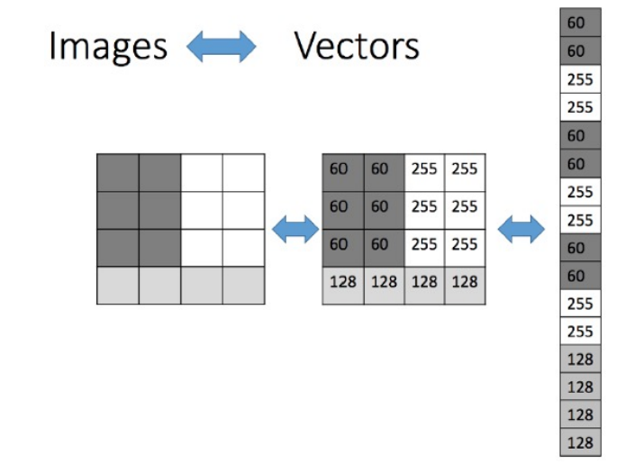
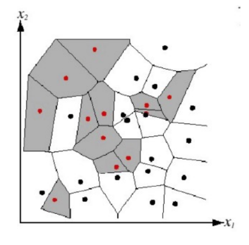
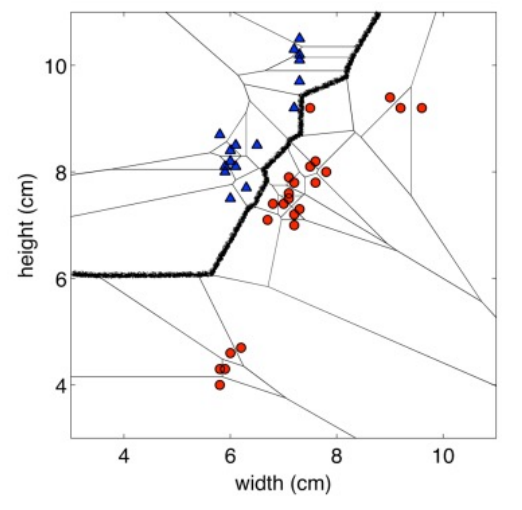
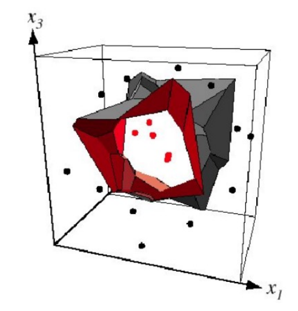
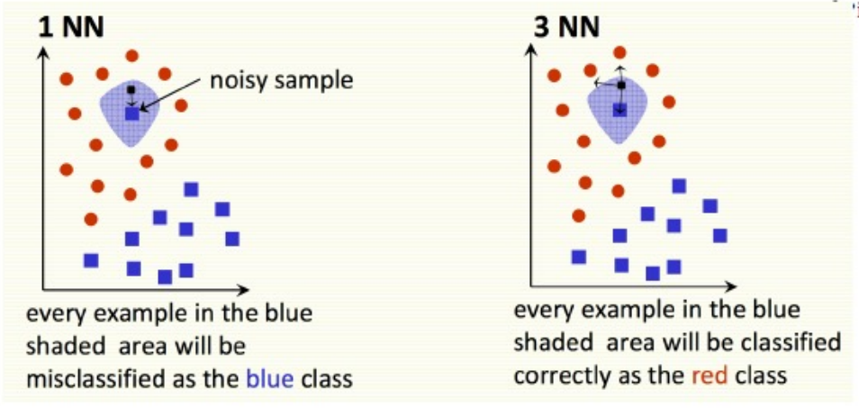
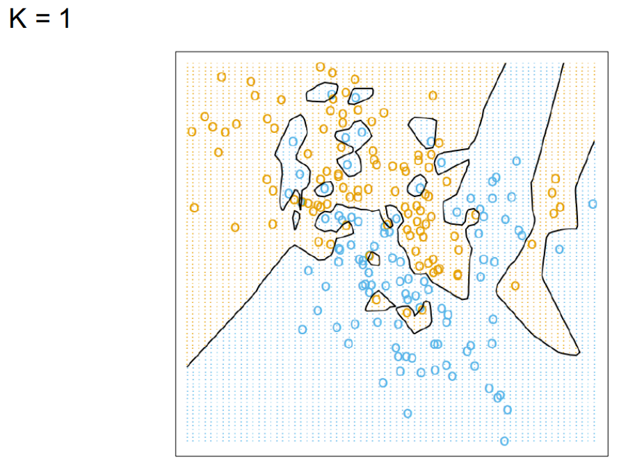
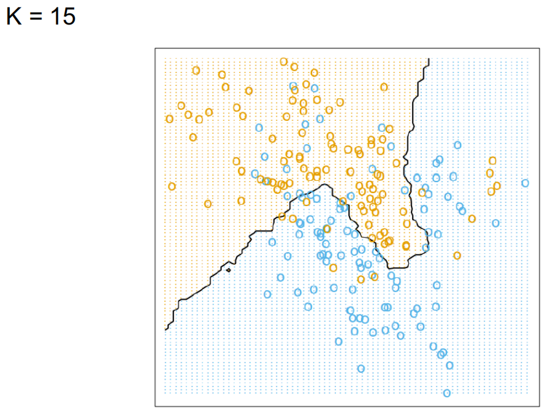
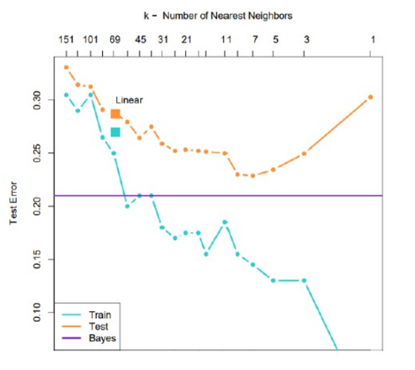
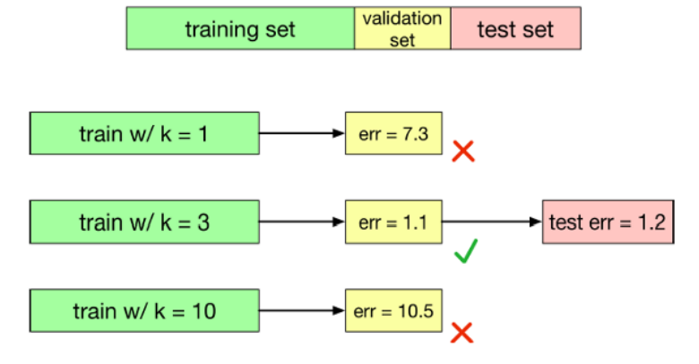

# Introduction to Machine Learning

## Course Structure

- Supervised Learning 监督学习

  - Nearest Neighbors 最近邻

  - Decision Trees 决策树

  - Ensembles  集成方法

  - Linear Regression 线性回归

  - Logistic Regression 逻辑回归

  - Neural Networks 神经网络

  - SVMs 支持向量机

- Unsupervised Learning 无监督学习

  - K-means

  - Mixture models 

- Basics of Reinforcement Learning 强化学习

## What is Machine Learning

Why might you want to use a learning algorithm?

为什么要使用学习算法？

- Hard to code up a solution by hand (e.g. vision, speech)

  手动编写解决方案较为困难（例如视觉、语音处理）。

- System needs to adapt to a changing environment (e.g. spam detection)

  系统需要适应不断变化的环境（例如垃圾邮件检测）。

- Want the system to perform better than the human programmers

  希望系统性能超越人类程序员的水平。

- Privacy/Fairness (e.g. ranking search results)

  隐私/公平性（例如，搜索结果排序）

Machine Learning 和 Statistics 实际上很相似：

- Both fields try to uncover patterns in data

  这两个领域都致力于揭示数据中的规律。

- Both fields draw heavily on calculus, probability, and linear algebra, and share many of the same core algorithms

  这两个领域都大量运用微积分、概率论和线性代数，并共享许多相同的核心算法。

但是也不能直接就简单地将两者相提并论，他们还是有区别所在的：

- Statistics is more concerned with helping scientists and policymakers draw good conclusions; ML is more concerned with building autonomous agents.

  统计学更侧重于帮助科学家和政策制定者得出有效结论；而机器学习则更致力于构建自主智能体。

- Statistics puts more emphasis on interpretability and mathematical rigor; ML puts more emphasis on predictive performance, scalability, and autonomy

  统计学更侧重于可解释性与数学严谨性；机器学习则更强调预测性能、可扩展性及自主性。

### Relations to AI

Nowadays, “machine learning” is often brought up with “artificial intelligence” (AI).

如今，“机器学习”常与“人工智能”（AI）并提。

- AI does not always imply a learning based system.

  人工智能并不总是指基于学习的系统。

  - Symbolic reasoning

    符号推理

  - Rule based system

    基于规则的系统

  - Tree search

    树形搜索

- Learning based system → learned based on the data more → flexibility, good at solving pattern recognition problems.

  基于学习的系统 → 通过数据学习获得能力 → 具备灵活性，擅长解决模式识别问题。

### Relations to Human Learning

Human learning is:

- Very data efficient

- An entire multitasking system (vision, language, motor control, etc.)

- Takes at least a few years J

For serving specific purposes, machine learning doesn’t have to look like human learning in the end.

为达成特定目的，机器学习最终无需模仿人类学习方式。

It may borrow ideas from biological systems, e.g., neural networks.

它可能借鉴了生物系统的理念，例如神经网络。

It may perform better or worse than humans.

其表现可能优于或劣于人类。

**Types of machine learning：**

**机器学习的种类：**

- **Supervised learning**: **have** labeled examples of the correct behavior

  **监督学习**：**拥有**正确行为的标记示例。

- **Reinforcement learning**: learning system (agent) interacts with the world and learns to maximize a scalar reward signal.

  **强化学习**：学习系统（智能体）通过与环境的交互，学习如何最大化一个标量奖励信号。

- **Unsupervised learning**: **no** labeled examples – instead, looking for “interesting” patterns in the data.

  **无监督学习**：**无需**标注样本——而是在数据中寻找“有意义”的模式

### Machine Learning in computer vision

Computer vision: Object detection, semantic segmentation, pose estimation, and almost every other task is done with ML.

计算机视觉：目标检测、语义分割、姿态估计以及几乎所有其他任务均通过机器学习技术实现。

### Machine learning in speech processing

Speech: Speech to text, personal assistants, speaker identification…

语音：语音转文本、个人助理、说话人识别……

### Machine learning in NLP

NLP: Machine translation, sentiment analysis, topic modeling, spam filtering.

自然语言处理（NLP）：机器翻译、情感分析、主题建模、垃圾邮件过滤。

## Machine Learning Workflow

**ML workflow sketch:**

机器学习的工作流程

1. Should I use ML on this problem?

   我是否应该在此问题上运用机器学习？

   - Is there a pattern to detect?

     是否存在可检测的模式？

   - Can I solve it analytically?

     我能用分析方法解决吗？

   - Do I have data?

     我有数据吗

2. Gather and organize data.

   收集并整理数据。

   - Preprocessing, cleaning, visualizing.

     预处理、数据清洗与可视化。

3. Establishing a baseline.

   建立基准线。

4. Choosing a model, loss, regularization, …

   选择模型、损失函数、正则化方法……

5. Optimization (could be simple, could be a Phd…).

   优化（可能简单，也可能复杂到博士学位级别…）。

6. Hyperparameter search.

   超参数搜索。

7. Analyze performance & mistakes and iterate back to step 4 (or 2).

   分析表现与错误，并迭代回至步骤4（或步骤2）。

## Implementing machine learning systems

You will often need to derive an algorithm (with pencil and paper), and then translate the math into code.

在编程过程中，经常需要先用纸笔推导算法，随后将数学逻辑转化为代码实现。

Array processing (NumPy)

数组处理（NumPy）

- **vectorize** computations (express them in terms of matrix/vector operations) to exploit hardware efficiency.

  **向量化**计算（以矩阵/向量运算形式表达），以充分利用硬件效率。

- This also makes your code cleaner and more readable!

  这也使你的代码更清晰，更可读！

Neural net frameworks: PyTorch, TensorFlow, JAX, etc.

神经网络框架：PyTorch、TensorFlow、JAX等

- automatic differentiation

  自动微分

- compiling computation graphs

  编译计算图

- libraries of algorithms and network primitives

  算法库与网络原语库

- support for graphics processing units (GPUs)

  支持图形处理单元（GPU）

## Nearest Neighbor 最近邻居

Preliminaries and Nearest Neighbor Methods 预备知识与最近邻方法

### Introduction

This means we are given a **training set** consisting of **inputs** and **corresponding labels**, e.g.

这意味着我们获得了一个包含**输入**及其**对应标签**的**训练集**。

### Input Vectors

Machine learning algorithms need to handle lots of types of data: images, text, audio waveforms, credit card transactions, etc.

机器学习算法需要处理多种类型的数据：图像、文本、音频波形、信用卡交易等。

Common strategy: represent the input as an **input vector** in **Rd**!

常用策略：将输入表示为 **Rd** 空间中的 **输入向量**！

- Representation = mapping to another space that’s easy to manipulate

  Representation = 映射到另一个易于操作的空间

- Vectors are a great representation since we can do linear algebra!

  向量是一种极佳的表示方式，因为它能让我们进行线性代数运算！

We can use raw pixel, Can do much better if you compute a vector of meaningful features.

我们可以使用原始像素，但若计算出一组有意义的特征向量，效果会好得多。

Mathematically, our training set consists of a collection of pairs of an input vector **𝑥 ∈ Rd!** and its corresponding **target**, or **label**, **t**?

从数学角度来看，我们的训练集由一系列输入向量 **𝑥 ∈ Rd** 及其对应的**目标值**或**标签** t 的配对组成。

- Regression: 𝑡 is a real number (e.g., stock price)

  回归：𝑡 是一个实数（例如，股票价格）

- Classification: 𝑡 is an element of a discrete set {1, ⋯ , 𝐶}

  分类：𝑡 属于离散集合 {1, ⋯ , 𝐶} 中的一个元素

- These days, 𝑡 is often a highly structured object (e.g. image)

  如今，𝑡 通常是一种高度结构化的对象（如图像）。

Denote the training set { (𝑥(1) ,𝑡(1)) , ⋯ , (𝑥(N) ,𝑡(N) )}

- Note: these superscripts have nothing to do with exponentiation!

  注意：这些上标与指数运算无关！

- Suppose we’re given a novel input vector 𝑥 we’d like to classify.

  假设给定一个待分类的新**输入向量 𝑥**。

- The idea: find the nearest input vector to 𝑥 in the training set and copy its label.

  该思路是：在训练集中找到与𝑥最接近的输入向量，并复制其标签。

- Can formalize “nearest” in terms of Euclidean distance

  可以用欧几里得距离来形式化“最近”的概念。

$$
||x^{(a)}-x^{(b)}|| = \sqrt{\sum^{d}_{j=1}(x_{j}^{(a)}-x_{j}^{b})^{2}}
$$

Algorithm:

- Find example (X*, t\*) (from the stored training set) closet to X. That is:
  - X* = argmin distance(X(i), x)
  - X(i) ∈ train set
- output y = t*

Note: we don’t need to compute the square root. 

注意：我们无需计算平方根。

### Nearest Neighbors: Decision Boundaries 最近邻算法：决策边界

We can visualize the behavior in the classification setting using a **Voronoi diagram**.

我们可以借助**Voronoi图**在分类情境中可视化其行为特征。

**Decision boundary**: the boundary between regions of input space assigned to different categories.

**决策边界**：输入空间中划分不同类别区域的分界线。

Nearest neighbors **sensitive to noise or mis-labeled data** (“class noise”). Solution?

**对噪声或错误标记的数据（“类别噪声”）敏感**的最近邻算法。**解决方案是什么**？

### Solution: k-Nearest Neighbors

- Smooth by having **k nearest neighbors** vote.

  通过**k个最近邻**投票实现平滑处理。

Algorithm (kNN):

1. Find k examples {X(N), t(N)} closest to the test instance x

2. Classification output is majority class

   - $$
     y = argmax \sum_{i=1}^{k}I(t^{(z)}=t^{(i)})
     $$

   - argmax tz

**𝕀** statement is the identity function and is equal to one whenever the statement is true. We could also 

write this as 𝛿(t(z), t(i)) , with 𝛿(a, b)= 1 if a = b, 0 otherwise.

Tradeoffs in choosing k?

选择k的权衡是什么

- Small k

  - Good at capturing fine-grained patterns.

    擅长捕捉细粒度的模式。

  - May overfit, i.e. be sensitive to random idiosyncrasies in the training data.

    可能出现过拟合现象，即对训练数据中的随机特性过于敏感。

- Large k

  - Makes stable predictions by averaging over lots of examples.

    通过大量实例的平均来进行稳定预测。

  - May underfit, i.e. fail to capture important regularities.

    可能欠拟合，即未能捕获重要的规律性。

- Balancing k

  - Optimal choice of k depends on number of data points n.

    k的最优选择取决于数据点的数量n。

  - Nice theoretical properties if k → ∞ and  k/n → 0.

    当k趋近于无穷大且k/n趋近于0时，具有良好的理论性质。

  - Rule of thumb: choose k < √n.

    经验法则：选择 k 小于 √n。

  - We can choose k using validation set.

    我们可以通过验证集来选择k值。

We would like our algorithm to generalize to data it hasn’t seen before.

我们希望算法能够泛化到未曾见过的数据上。

We can measure the generalization error (error rate on new examples) using a test set.

我们可以通过测试集来衡量泛化误差（即在新样本上的错误率）。

k is an example of a **hyperparameter**, something we can’t fit as part of the learning algorithms itself.

k是**超参数**的一个实例，此类参数无法作为学习算法本身的组成部分进行拟合。

We can tune hyperparameters using a **validation set**:

我们可以通过**验证集**来调整超参数：

The **test set** is used only at the very end, to measure the generalization performance of the final configuration.

**测试集**仅在最终阶段使用，用以评估最终配置的泛化性能。

### Example: Digit Classification

- KNN can perform a lot better with a good similarity measure.

  一个好的相似性度量可以显著提升KNN算法的性能。

- Example: shape contexts for object recognition. In order to achieve invariance to image transformations, they tried to warp one image to match the other image.

  示例：用于对象识别的形状上下文。为了实现图像变换的不变性，他们试图扭曲一个图像以匹配另一个图像。

  - Distance measure: average distance between corresponding points on **warped** images

    距离度量：经变形处理图像上对应点之间的平均距离。

- Achieved 0.63% error on MNIST, compared with 3% for Euclidean KNN.

  在MNIST数据集上实现了0.63%的误差率，而欧几里得KNN方法的误差率为3%。

- Competitive with conv nets at the time, but required careful engineering.

  与当时的卷积网络相比具有竞争力，但需要精密的工程设计。

## Conclusion

- Simple algorithm that does all it work at test time – in a sense, no learning!

  一种简单的算法，在测试时完成所有工作——从某种意义上说，不需要学习！

- Can control the complexity by varying k.

  通过改变k值来控制复杂度。

- Suffers from the Curse of Dimensionality.

  会收到维度的严重影响

- Next time: parametric models, which learn a compact summary of the data rather than referring back to it at test time.

  下次内容：参数化模型，这种模型学习数据的紧凑摘要，而非在测试时回溯原始数据。