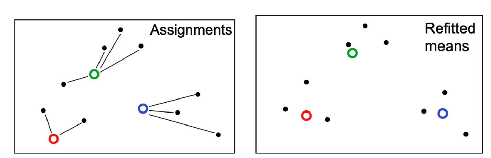
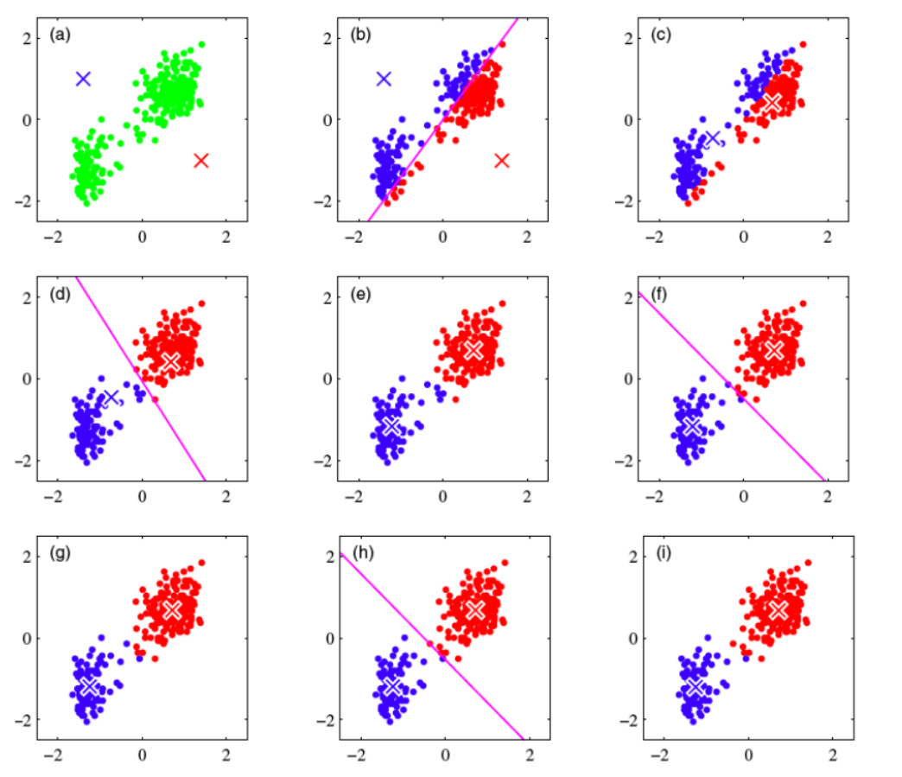
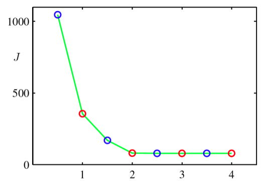
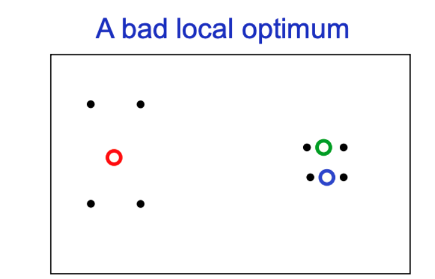
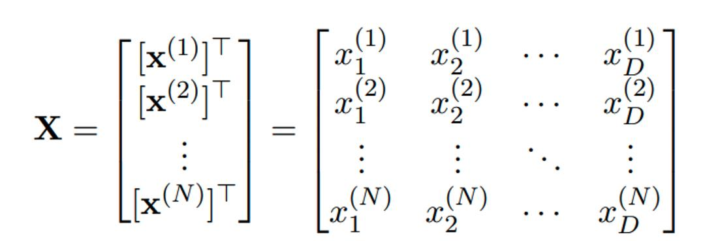
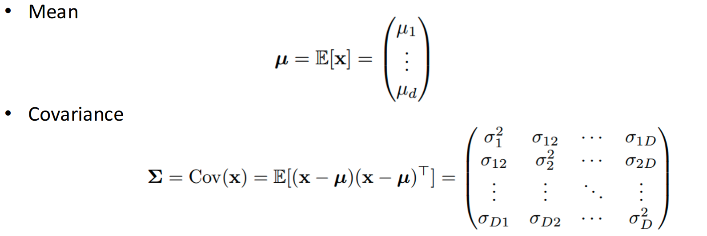
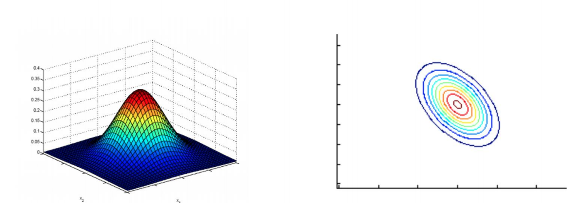
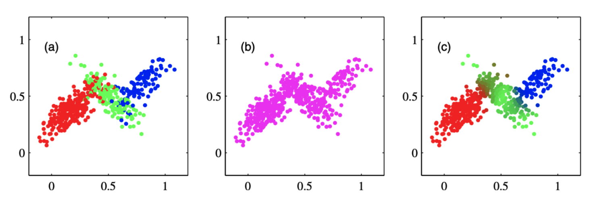
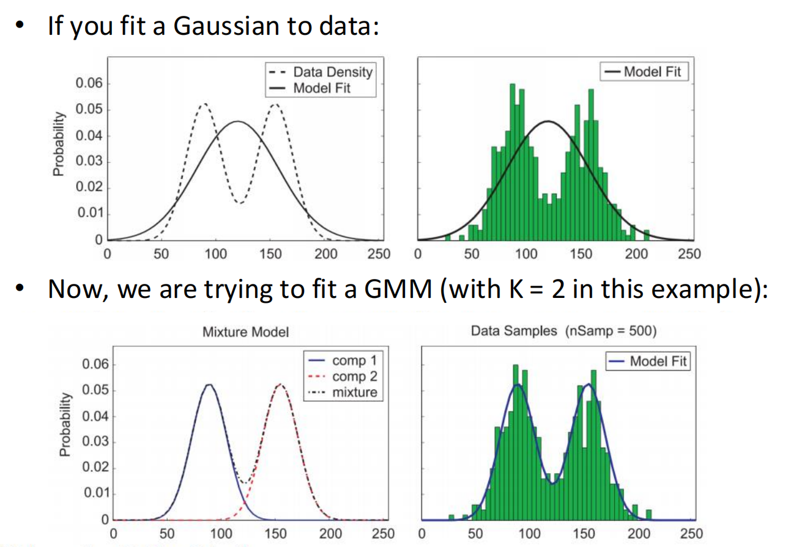
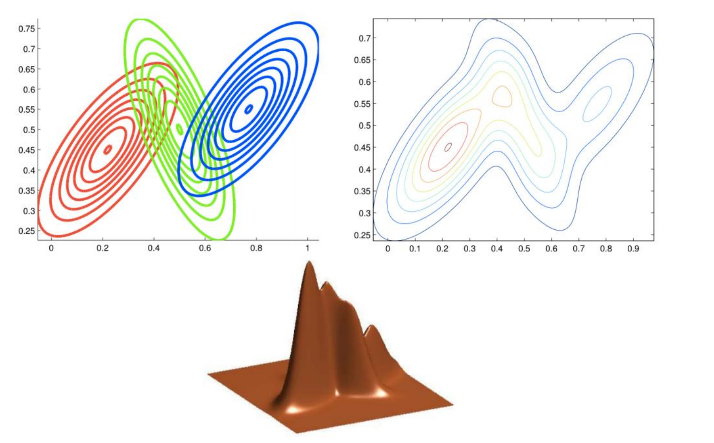

# 10 K-Means and Expectation-Maximization algorithm

## Clustering 聚类

**聚类的直观理解**：

- 有时数据会形成簇（Clusters）。在同一个簇内的样本彼此之间是**相似的**，而处于不同簇的样本之间则是**不相似的** 。

**定义与性质**：

- 在没有观测标签（labels）的情况下，将数据点分组到簇中的过程被称为**聚类（clustering）**。
- 这是一种**无监督学习（unsupervised learning）**技术 。

**举例说明**：

- 例如，可以根据主题（如深度学习、贝叶斯模型等）对机器学习论文进行聚类 。
- 在这种无监督的情况下，具体的“主题”标签是**从未被观测到的（never observed）** 

### 聚类问题

聚类任务的数学假设和核心目标：

1. **数据假设**

   - 假设我们有一组数据点 $\{x^{(1)}, ..., x^{(N)}\}$，它们存在于一个欧几里得空间中。

   - 每个数据点 $x^{(n)}$ 都是 $D$ 维实数空间 $\mathbb{R}^D$ 中的一个向量。

2. **簇的假设**
   - 假设每个数据点都归属于 $K$ 个簇（Clusters）中的某一个。

3. **相似性的定义**

   - 我们假设来自同一个簇的数据点是**相似的**。

   - 在这里，“相似”的具体定义是：它们在**欧几里得距离（Euclidean distance）**上是接近的。

4. **核心问题与解决思路**

   - 我们面临的问题是：在没有标签的情况下，如何识别这些簇（即确定哪些数据点属于哪个簇）？。

   - 幻灯片提出的解决思路是：让我们将这个问题表述为一个**优化问题（optimization problem）**。这意味着接下来的几页将会通过最小化某种损失函数来寻找最佳的聚类结果。

## K-Means Objective 目标函数

### K-means 的目标 (K-means Objective)

这一页用自然语言描述了我们的优化目标：

- **目标**：我们需要找到两组未知量：
  1. **聚类中心 (Cluster centers)** $\{m_{k}\}_{k=1}^{K}$。
  2. **分配方案 (Assignments)** $\{r^{(n)}\}_{n=1}^{N}$，即每个数据点属于哪个中心。
- **最小化对象**：我们要最小化的是所有数据点 $\{x^{(n)}\}$ 到其**被分配的中心**的**距离平方和 (sum of squared distances)** 。
- **变量定义**：
  - $x^{(n)} \in \mathbb{R}^{D}$：数据样本，这是**已观测到的 (observed)** 。
  - $m_{k} \in \mathbb{R}^{D}$：聚类中心，这是**未观测到的 (not observed)** 。
  - $r^{(n)} \in \mathbb{R}^{K}$：称为“责任”或“归属度” (Responsibilities)，表示样本 $n$ 的聚类分配情况，使用 **1-of-K 编码**，这也是**未观测到的**。

### 数学公式化 (Mathematically)

这一页将上述文字描述转化为了具体的数学公式：

- 优化公式：

  我们需要针对 $\{m_{k}\}$ 和 $\{r^{(n)}\}$ 最小化目标函数 $J$：

  $$\min_{\{m_{k}\},\{r^{(n)}\}} J(\{m_{k}\},\{r^{(n)}\}) = \min_{\{m_{k}\},\{r^{(n)}\}} \sum_{n=1}^{N} \sum_{k=1}^{K} r_{k}^{(n)} ||m_{k} - x^{(n)}||^{2}$$

- **关于 $r^{(n)}$ 的解释**：

  - $r_{k}^{(n)}$ 是一个指示函数 $\mathbb{I}$。如果数据点 $x^{(n)}$ 被分配给簇 $k$，则 $r_{k}^{(n)} = 1$，否则为 0。
  - 这种向量形式被称为 **1-of-K encoding**，例如 $r^{(n)} = [0, ..., 1, ..., 0]^T$。

- **计算复杂度**：

  - 幻灯片指出，找到这个问题的**最优解**是一个 **NP-hard** 问题。

### 案例

想象你是一家物流公司的老板，你接管了一个新的城市。

- 数据样本 $x^{(n)}$（Observed）：

  这就是城市里居民的房子。

  - 这些房子的位置是固定的，是你**已观测到的**事实，你不能移动房子。
  - 假设城市里有 $N$ 个房子。

- 聚类中心 $m_k$（Not Observed）：

  这代表你要建设的 $K$ 个配送站。

  - 目前你还不知道要把这些站建在哪里，这是你需要**去寻找（Find）**的未知量。
  - 假设你预算有限，只能建 $K$ 个（比如 3 个）站点。

- 分配方案 $r^{(n)}$（Responsibilities）：

  这代表服务区的划分。

  - 即：哪个房子归哪个配送站负责送货？
  - 这也是未知的，需要你来决定的。

#### 目标

作为老板，你的终极目标是**省油钱**和**提高效率**。

- **直观理解**：你不希望快递员每天跑很远的路去送货。你希望每个房子都离负责它的那个配送站**越近越好**。
- **数学目标**：我们要找到最佳的**配送站位置 ($m_k$)** 和最佳的**服务区划分 ($r^{(n)}$)**，使得全城所有房子到它们各自配送站的**距离平方和最小**。

#### 数学公式是如何表达“省油钱”的？

幻灯片上的公式虽然看起来吓人，但其实就是一本“总账”：

$$J = \sum_{n=1}^{N} \sum_{k=1}^{K} r_{k}^{(n)} ||m_{k} - x^{(n)}||^{2}$$

- **$||m_{k} - x^{(n)}||^{2}$**：这是**“单次路费”**。
  - 它计算的是第 $k$ 个配送站到第 $n$ 个房子之间的距离（的平方）。
- **$r_{k}^{(n)}$**：这是一个**“开关”**。
  - 如果第 $n$ 个房子**归**第 $k$ 个配送站管，这个开关就是 **1**（开）。
  - 如果**不归**它管，这个开关就是 **0**（关）。
- **$r_{k}^{(n)} ||m_{k} - x^{(n)}||^{2}$**：
  - 这意味着：我们只计算**有效路费**。如果这个房子不归你管，距离再远也不产生油费（乘以0），因为你的车根本不去那儿。
- **$\sum \sum$ (双重求和)**：
  - 这就是把全城每一栋房子、每一个潜在站点的有效路费都加起来，算出**总成本**。
  - **Min (最小化)**：你的任务就是调整站点的选址 ($m$) 和划分方案 ($r$)，让这个“总成本”降到最低。

#### 为什么“开关”只能开一个？

这就解释了 **1-of-K encoding** 的含义。

- 在现实中，一个包裹通常只由**一个**最近的配送站负责派送，不会有两个站同时派车去送同一个包裹。
- **例子**：
  - 假设房子 $n$（比如张三家）被划给了第 3 号配送站。
  - 那么张三家的分配向量 $r^{(n)}$ 就是 `[0, 0, 1, 0, ...]`。
  - 在计算总账时，虽然公式里写了 $\sum_{k=1}^{K}$（把所有站都遍历一遍），但只有第 3 号站的那一项算数：
    - 去 1 号站的距离 × 0
    - 去 2 号站的距离 × 0
    - **去 3 号站的距离 × 1**
  - 最终结果就是：**只计算张三家到 3 号站的距离**。

## Alternating Minimization 交替最小化

同时求两个未知数很难，所以我们采取“固定一个，求另一个”的策略，分两步走。

### 优化思路：分而治之

**面临的困难**：

- 我们面对的优化问题是：$min_{\{m_{k}\},\{r^{(n)}\}}\sum_{n=1}^{N}\sum_{k=1}^{K}r_{k}^{(n)}||m_{k}-x^{(n)}||^{2}$。
- 如果想要**同时**针对参数 $\{m_{k}\}$（中心）和 $\{r^{(n)}\}$（分配）进行联合最小化，这个问题是非常困难的。

**解决策略**：

- 但是，如果我们**固定其中一组参数**，只针对另一组参数进行最小化，问题就会变得非常简单。

### 步骤一：固定中心，优化分配 (Assignment Step)

这一步假设我们已经有了聚类中心的位置（可能是随机初始化的，也可能是上一步算出来的），现在要决定数据点归谁管。

- **操作方法**：
  - **固定**聚类中心 $\{m_{k}\}$ 不动。
  - 针对每个样本 $n$，找到最优的分配方案 $\{r^{(n)}\}$。
- **具体规则**：
  - 将每个数据点分配给**最近的**那个聚类中心。
- **数学表达**：
  - $r_{k}^{(n)} = 1$，当且仅当第 $k$ 个簇的中心是离 $x^{(n)}$ 最近的（即 $k = arg~min_{j}||x^{(n)}-m_{j}||^{2}$），否则为 0。
  - 这就形成了之前提到的 1-of-K 编码形式，例如 $[0,0,...,1,...,0]^{\top}$，只有对应最近中心的那个位置是 1。

### 步骤：二固定分配，优化中心 (Refitting Step)

这一步假设我们已经知道每个点属于哪个簇，现在要重新计算中心的位置。

- **操作方法**：

  - **固定**分配方案 $\{r^{(n)}\}$ 不动。
  - 找到最优的聚类中心 $\{m_{k}\}$。

- **具体规则**：

  - 将每个簇的中心移动到所有分配给它的数据点的**平均值（均值）**位置。

- **数学推导（为什么是均值？）**：

  - 对目标函数关于 $m_{l}$ 求导并令其为 0：

    $$0 = \frac{\partial}{\partial m_{l}}\sum_{n=1}^{N}\sum_{k=1}^{K}r_{k}^{(n)}||m_{k}-x^{(n)}||^{2}$$

  - 推导结果显示最优解正是加权平均值：

    $$m_{l} = \frac{\sum_{n}r_{l}^{(n)}x^{(n)}}{\sum_{n}r_{l}^{(n)}}$$

    这表示：新的中心 $m_l$ 等于所有属于该簇的数据点坐标之和除以该簇的数据点数量

这种在这两个步骤之间交替进行，分别针对 $\{m_{k}\}$ 和 $\{r^{(n)}\}$ 最小化目标函数 $J$ 的过程，就称为**交替最小化 (Alternating Minimization)** 。

## K-Means Algorithm

### 算法的高层概览 (High level overview)

这一页用自然语言描述了算法的整体流程：

- **初始化 (Initialization)**：首先随机初始化聚类中心的位置 。
- **迭代循环**：算法在以下两个步骤之间交替进行 ：
  1. **分配步骤 (Assignment step)**：将每个数据点分配给离它**最近**的那个簇 。
  2. **重新拟合步骤 (Refitting step)**：将每个簇的中心移动到分配给该簇的所有数据的**平均值（mean）**位置 。
- **图示**：配图展示了这两个步骤：上图是根据中心位置分配点，下图是根据点的分布移动中心 。

### 可视化演示 (Visual Demo)

这一页引用了 Bishop 的经典图例，展示了算法从开始到结束的完整演变过程 。

- **(a) 图**：初始状态。绿色点是数据，红色和蓝色的叉（X）是**随机初始化**的中心 。
- **(b) 图**：第一次分配步骤。画面中出现了一条紫色的分界线（垂直平分线），数据点根据离哪个中心近被染成了红色或蓝色 。
- **(c) 图**：第一次重新拟合步骤。红叉移动到了红色点群的中心，蓝叉移动到了蓝色点群的中心 。
- **(d) ~ (i) 图**：随后的迭代过程。可以看到分界线不断调整，中心位置不断微调，直到最后稳定下来，不再发生变化 

### 算法的正式描述 (The K-means Algorithm)

算法的具体执行步骤和停止条件：

1. **初始化**：将 $K$ 个聚类均值 $m_1, ..., m_K$ 设置为随机值 。
2. **循环 (Repeat)**：重复以下步骤，直到**收敛 (convergence)**，即直到分配结果不再发生变化为止 。
   - **分配 (Assignment)**：
     - 固定 $\{m\}$，优化 $\{r\}$。
     - 将每个数据点 $x^{(n)}$ 分配给最近的中心：$\hat{k}^{(n)} = \arg \min_k ||m_k - x^{(n)}||^2$ 。
     - 更新责任向量（使用 1-hot 编码）：$r_k^{(n)} = \mathbb{I}[\hat{k}^{(n)} = k]$ 。
   - **重新拟合 (Refitting)**：
     - 固定 $\{r\}$，优化 $\{m\}$。
     - 将每个中心设置为归属数据的均值：$m_k = \frac{\sum_n r_k^{(n)} x^{(n)}}{\sum_n r_k^{(n)}}$ 。

### 实际应用

#### K-means 用于矢量量化 (Vector Quantization)

这一页展示了如何利用 K-means 进行图像压缩（或称色彩量化）。

- **基本原理**：
  - 将图像中的每一个像素点看作数据集中的一个样本。每个样本由其 **RGB 像素强度**（颜色值）来表示
  - 运行 K-means 算法，将所有像素聚类成 $K$ 个簇。
  - 最后，用该像素所属簇的**聚类中心**（即该簇的代表颜色）来替换原始像素的颜色

#### K-means 用于图像分割 (Image Segmentation)

K-means 的另一个视觉应用——生成“超像素” (Superpixels)。

- **与上一个的区别**：
  - 在矢量量化中，我们只利用了颜色的 RGB 信息。
  - 而在图像分割任务中，构建数据集时，像素不仅由 RGB 强度表示，还包含了它们的**网格位置 (grid locations)** 。这意味着物理位置相近的像素更容易被聚在一起。
- **结果**：
  - 运行 K-means（需做一定修改）后，图像被分割成了若干个连贯的小区域（即超像素），如幻灯片中的人物、鱼和风景图所示，被分割线划分成了许多不规则的小块 。

#### 为什么 K-means 会收敛 (Why K-means Converges)

这一页回答了上一页关于“收敛性”的问题，并给出了理论解释和收敛曲线图。

- **核心逻辑**：
  - K-means 算法保证在每一次迭代中都会**降低**代价函数 $J$ 的值。
  - **分配步骤**：当分配发生改变时，意味着数据点找到了一个更近的中心，因此数据点到中心的距离平方和减少了。
  - **重拟合步骤**：当聚类中心移动到均值位置时，根据数学性质，这也必然减少 $J$ 值

- **收敛判定**：

  - 测试收敛的方法是：如果在分配步骤中，没有任何一个数据点的分配发生变化，算法就收敛了（至少到达了一个局部最小值） 。

  - 由于可能的分配组合数量是**有限的**（finite），因此算法总是会在有限次迭代后停止 。

- **图表说明**：
  - 折线图展示了代价函数 $J$ 随迭代次数的变化。蓝色圆圈代表分配步骤后的成本，红色圆圈代表重拟合步骤后的成本。可以看到 $J$ 值迅速下降并在第 3 次重拟合步骤后不再变化，表明算法已收敛。

### Local  Minima 局部最小值

- 目标函数𝐽是非凸的（因此对𝐽进行坐标下降法不能保证收敛到全局最小值）  

- 无法阻止k均值算法陷入局部极小值  
- 我们可以尝试多个随机起始点

### Soft K-means Algorithm 软分配

### Soft K-means 的概念

从“硬分配”到“软分配”的转变：

- **基本理念**：
  - 传统的 K-means 进行的是**硬分配 (hard assignments)**，即一个数据点要么属于这个簇，要么不属于（0 或 1）。
  - Soft K-means 则采用**软分配 (soft assignments)**。这意味着一个数据点可以同时“部分”属于多个簇 。
- **举例**：
  - 例如，一个簇可能对某个数据点有 **0.7** 的责任（responsibility），而另一个簇对同一个点有 **0.3** 的责任 。
- **优势**：
  - 这种方法允许簇在重新拟合步骤中利用更多关于数据的细微信息 。
- **类比**：
  - 这就像我们在多类分类中看到的：**1-of-K 编码**（硬）与 **Softmax 分配**（软）的区别 。

#### Soft K-means 算法流程

具体如何执行 Soft K-means，特别是公式的变化：

1. **初始化 (Initialization)**：将 $K$ 个均值 $\{m_k\}$ 设置为随机值。

2. **迭代 (Repeat)**：重复以下步骤直到收敛（根据 $J$ 的变化量判断）：

   - **分配步骤 (Assignment)**：

     - 每个数据点 $n$ 根据其与中心 $k$ 的距离，获得一个**软性的“归属程度”**。

     - 计算公式使用了带有参数 $\beta$ 的 Softmax 函数：

       $$r_{k}^{(n)}=\frac{exp[-\beta||m_{k}-x^{(n)}||^{2}]}{\sum_{j}exp[-\beta||m_{j}-x^{(n)}||^{2}]}$$

     - 这里的 $\beta$ 是一个刚度参数（stiffness parameter），决定了分配的“软硬”程度。

   - **重新拟合步骤 (Refitting)**：

     - 调整模型参数（均值），使其与它们负责的数据点的样本均值相匹配。

     - 新的中心位置是所有数据点的加权平均值，权重就是归属度 $r$：

       $$m_{k}=\frac{\sum_{n}r_{k}^{(n)}x^{(n)}}{\sum_{n}r_{k}^{(n)}}$$

#### Soft K-means 的遗留问题

这一页指了 Soft K-means 仍然无法解决的一些核心问题，为引入更复杂的模型做铺垫：

- **遗留问题**：
  - **如何设置 $\beta$？** 这个参数很难确定。
  - **如何处理不等权重和宽度的簇？** 如果簇的大小（方差）不同，或者某些簇比其他簇更重要，K-means（即使是软分配版本）也很难处理。
- **结论**：
  - 这些问题在 K-means 的框架下很难直接解决。
  - 因此，接下来的课程将把聚类问题重新表述为一个**生成模型 (generative model)**。这实际上就是为后面介绍的高斯混合模型（GMM）做铺垫。

## 生成模型视角与高斯分布回顾

### 聚类的生成式视角 (A Generative View of Clustering)

这一页提出了一个新的思考角度：不要只盯着已经存在的数据看怎么分组，而是去想象**数据最初是怎么产生出来的**。

- **生成模型 (Generative Model)**：我们假设数据是由某种潜在的概率模型“生产”出来的 。
- **最大似然 (Maximum Likelihood)**：既然假设了模型存在，我们的任务就是调整模型的参数，使得这个模型“生产”出我们手头这组观测数据的概率最大化 。
  - 简单说就是：**调整参数，让模型最像那个产生真实数据的“幕后黑手”。**

### 单变量高斯分布 (Univariate Gaussian distribution)

为了构建这个生成模型，我们需要一个基础组件。这里回顾了最经典的**高斯分布（正态分布）**。

- 公式：对于单个变量 $x$，其概率密度函数由均值 $\mu$ 和方差 $\sigma^2$ 决定：

  $$\mathcal{N}(x;\mu,\sigma^{2})=\frac{1}{\sqrt{2\pi}\sigma}exp(-\frac{(x-\mu)^{2}}{2\sigma^{2}})$$

- **为什么用它？**

  1. **中心极限定理 (Central Limit Theorem)**：大量独立随机变量的和近似服从高斯分布，这使得它在自然界非常普遍 。

  2. **数学便利性**：在机器学习中，高斯分布能让计算变得简单容易

### 多变量数据 (Multivariate Data)

现实中的数据通常不仅仅是一个数字，而是多个特征的组合。

- **数据结构**：我们有 $N$ 个观测样本，每个样本有 $D$ 个特征（输入/属性）。
- **矩阵表示**：所有数据可以表示为一个矩阵 $X$，其中每一行是一个样本向量 $x^{(n)}$ 的转置。

### 多变量均值与协方差 (Multivariate Mean and Covariance)

当数据从 1 维变成 $D$ 维时，描述分布的参数也升级了：

- **均值 (Mean)**：从一个数 $\mu$ 变成了**向量** $\mu = (\mu_1, ..., \mu_d)^T$。
- **协方差 (Covariance)**：从一个数 $\sigma^2$ 变成了**矩阵** $\Sigma$。这是一个 $D \times D$ 的矩阵，描述了各个特征之间的相关性。
- **唯一性**：只要确定了均值向量 $\mu$ 和协方差矩阵 $\Sigma$，就唯一确定了一个多变量高斯分布。

### 多变量高斯分布公式 (Multivariate Gaussian Distribution)

这一页展示了多变量高斯分布的“完全体”公式和图像。

- 概率密度公式：

  $$p(x)=\frac{1}{(2\pi)^{d/2}|\Sigma|^{1/2}}exp[-\frac{1}{2}(x-\mu)^{T}\Sigma^{-1}(x-\mu)]$$

  - 虽然公式看起来很复杂，但核心结构还是指数函数 $e^{-(\text{距离})^2}$，只是这里的“距离”考虑了协方差矩阵（称为马氏距离）。

- **可视化**：

  - 图展示了二维高斯分布的样子：像一个立体的“山包” 。
  - 俯视图（等高线图）是一圈圈的椭圆。

## 高斯混合模型 (GMM) 

### 生成模型 (The Generative Model)

这一页定义了数据是如何被“创造”出来的。我们假设每个数据点 $x$ 的生成过程分两步走：

1. **第一步：选簇 (Choose a cluster)**

   - 首先，从 $K$ 个簇中选择一个簇 $z$。

   - 选择第 $k$ 个簇的概率是 $\pi_k$。

   - 公式：

     $$p(z=k)=\pi_{k}$$

2. **第二步：生成数据 (Sample x)**

   - 一旦选定了簇 $z=k$，就从该簇对应的的高斯分布中采样得到数据点 $x$。

   - 公式：

     $$p(x|z=k)=\mathcal{N}(x|\mu_{k},I)$$

   - *注意：这里为了简化，假设协方差矩阵为单位矩阵 $I$，即假设簇是圆形的。*

### 联合分布与边缘分布 (Clusters from Generative Model)

有了上面的两个步骤，我们可以用概率公式来描述整个系统：

- **联合分布 (Joint Distribution)**：

  - 即“既选中簇 $z$ 又产生点 $x$”的概率：$p(z,x)=p(z)p(x|z)$，参数由 $\{\pi_{k},\mu_{k}\}$ 决定。

- **边缘分布 (Marginal of x)**：

  - 如果我们不管它是哪个簇产生的，只看观测到点 $x$ 的总概率，就需要把所有可能的簇 $z$ 加起来（积分掉）：

    $$p(x)=\sum_{z}p(z,x)$$

- **后验概率 (Posterior Probability)**：

  - 这是聚类中最关键的一步：**给定一个数据点 $x$，它倒底属于簇 $k$ 的概率是多少？**

  - 利用贝叶斯公式计算：

    $$p(z=k|x)=\frac{p(x|z=k)p(z=k)}{p(x)}$$

  - 这就告诉了我们 $x$ 来自第 $k$ 个簇的概率。

### 过程的可视化

这一页展示了上述概率过程的图像：

- **(a) 图**：展示了 $p(x|z)$ 的采样结果，不同颜色的点代表来自不同的高斯分布。
- **(b) 图**：展示了边缘分布 $p(x)$，这里不再区分颜色，这是我们在现实中看到的原始数据样子。
- **(c) 图**：展示了后验概率 $p(z|x)$（即 Responsibility），颜色混合代表了模型对该点属于哪个簇的不确定性。

### 含隐变量的最大似然 (Maximum Likelihood with Latent Variables)

既然我们要拟合模型，目标自然是**最大化观测数据的似然度**。

- **观测数据**：我们有一组数据 $\mathcal{D}=\{x^{(n)}\}_{n=1}^{N}$。

- 目标函数：我们要最大化对数似然函数 $log~p(\mathcal{D})$：

  $$log~p(\mathcal{D})=\sum_{n=1}^{N}log~p(x^{(n)})$$

- 如何计算 $p(x)$：

  由于我们不知道具体的簇 $z$（$z$ 是隐变量），我们需要对 $z$ 进行边缘化（求和）：

  $$p(x)=\sum_{k=1}^{K}p(z=k,x)=\sum_{k=1}^{K}p(z=k)p(x|z=k)$$

### 高斯混合模型 (GMM) 定义

将第 30 页的公式展开，就得到了大名鼎鼎的 **GMM 公式**：

- GMM 分布公式：

  $$p(x)=\sum_{k=1}^{K}\pi_{k}\mathcal{N}(x|\mu_{k},I)$$

  - 这意味着：任意一个数据点 $x$ 的概率密度，是由 $K$ 个高斯分布的密度函数加权求和得到的。
  - $\pi_k$ 被称为**混合系数 (mixing coefficients)** 。

- **一般形式**：

  - 一般情况下，每个簇会有不同的协方差矩阵 $\Sigma_k$，即 $p(x|z=k)=\mathcal{N}(x|\mu_{k},\Sigma_{k})$ 。
  - 但本课程为了简化，假设 $\Sigma_k = I$

### GMM 的可视化

这两页直观地展示了 GMM 是如何拟合复杂数据的。

- **1D 视角**：

  - 如果你只有一个高斯分布（上图），你只能拟合一个单峰。如果数据有两个峰（双峰分布），拟合效果就很差。

  - 如果你用 GMM（下图，比如 $K=2$），你可以把两个高斯波峰（蓝色虚线和红色虚线）叠加起来，形成的黑色实线就能完美贴合数据的双峰形状。

    

- **2D 视角**：

  - 左图展示了三个独立的二维高斯分布的等高线。

  - 右图和下方的 3D 图展示了它们叠加后的效果：形成了一个复杂的、多峰的地形图。这意味着 GMM 可以用来描述形状非常复杂的数据分布

    

**总结这部分**： 这几页建立了 GMM 的数学框架：**一个复杂的数据分布 $p(x)$ 可以看作是多个简单高斯分布 $\mathcal{N}$ 的加权和**。我们的任务变成了：找到那组最好的权重 $\pi_k$ 和中心 $\mu_k$，让这个加权和最像我们的数据。

## 最大似然估计与“完全数据”假设

### 数学上的“死结” (The Log-Sum Problem)

首先，我们要面对现实。我们的目标是最大化对数似然函数，也就是让模型产生现有数据的概率最大。

- 公式：

  $$log~p(\mathcal{D})=\sum_{n=1}^{N}log(\sum_{k=1}^{K}\pi_{k}\mathcal{N}(x^{(n)}|\mu_{k},I))$$

- **困难点**：请注意看公式里的结构，是 $log(\sum ...)$，即**对数里面套着求和**。

  - **数学解释**：我们都知道 $\log(a \cdot b) = \log a + \log b$，乘积的对数可以拆开，变简单。但是 $\log(a + b)$ 是拆不开的！
  - **后果**：如果你试图对这个公式求导让它等于 0（求极值），你会发现方程复杂到无法求解，根本得不到一个干净的公式（Closed form solution）。

- 形象的比喻：

  这就好比你要算一堆混在一起的硬币的总面值，但这些硬币被封在一个打不开的玻璃罐（Log）里，而且它们还粘成了一团（Sum）。你没法把它们一个个分开来数。

### 如果世界是完美的 (The Complete Data)

既然硬解解不开，我们不妨先做一个**完美的假设**：假如我们知道每个数据点是哪个簇生成的，会怎样？

- **“完全数据”假设**：

  - 假设除了看到数据 $x$，全知的我们还知道我们要找的标签 $z$。那么我们的数据集就变成了“完全数据集” $\mathcal{D}_{complete} = \{(z^{(n)},x^{(n)})\}$。
  - **比喻**：这就好比之前那堆硬币，上帝给每个硬币都贴上了标签：“这是1号簇生成的”，“那是2号簇生成的”。

- 梦幻般的公式：

  一旦有了标签 $z$，对数似然函数就神奇地解开了：

  $$log~p(\mathcal{D}_{complete})=\sum_{n=1}^{N}\sum_{k=1}^{K}\mathbb{I}[z^{(n)}=k](log\mathcal{N}(x^{(n)}|\mu_{k},I)+log~\pi_{k})$$

  - **为什么变简单了？** 因为这里没有 $log(\sum)$ 了，只有 $\sum log$。我们可以把不同簇的数据分开处理。

- 简单的解法：

  在知道标签的情况下，求最优参数简直易如反掌，这和 Naive Bayes 分类器一模一样：

  - **求均值 $\hat{\mu}_{k}$**：就是把所有贴着“k号标签”的数据点加起来求平均。
  - **求混合系数 $\hat{\pi}_{k}$**：就是数一数贴“k号标签”的数据点占总数的比例。

### 回归现实 (Computing Posterior)

但是实际情况是，现实是我们并没有标签 $z$。但是，我们虽然没有“硬标签”，却有“软线索”。

- 利用贝叶斯公式：

  虽然我们不知道 $z$ 肯定是几，但我们可以计算“$x$ 属于簇 $k$ 的概率”是多少。这就是后验概率 $p(z=k|x)$：

  $$p(z=k|x)=\frac{\pi_{k}\mathcal{N}(x|\mu_{k},I)}{\sum_{j=1}^{K}\pi_{j}\mathcal{N}(x|\mu_{j},I)}$$

  - **解释**：这就像我们虽然没有上帝视角的标签，但我们有一个**侦探**。侦探说：“根据现有的线索（目前的 $\mu$ 和 $\pi$），我认为这个数据点有 **80% 的可能性**属于簇 1，**20% 的可能性**属于簇 2。”

### 第 38 页：以“软”代“硬” (Expected Complete Log-Likelihood)

这是 EM 算法最天才的一步。我们虽然没有真实的标签 $\mathbb{I}[z^{(n)}=k]$（非 0 即 1），但我们可以用侦探给出的**概率** $r_{k}^{(n)}$（Responsibility）来替代它。

- 新的策略：

  我们在上面“简单解法中”的那个“完美公式”中，把未知的硬标签 $\mathbb{I}$ 替换为已知的软概率 $r$（即 $\mathbb{E}[\mathbb{I}]$）。

- 最终的更新公式：

  这样一来，我们依然可以得到类似“求平均值”的简单公式，只不过这次是加权平均：

  $$\hat{\mu}_{k}=\frac{\sum_{n=1}^{N}r_{k}^{(n)}x^{(n)}}{\sum_{n=1}^{N}r_{k}^{(n)}}$$

  - **含义**：在算簇 $k$ 的中心时，如果某个点属于 $k$ 的概率只有 0.1，那它在算平均值时就只贡献 0.1 的份量；如果概率是 0.9，就贡献 0.9 的份量。

- 前提：

  注意，这个简便算法成立的前提是：我们在计算 $r$ 的时候，要把参数 $\mu$ 和 $\pi$ 当作是固定的。

## EM 算法详解与总结

### 如何拟合高斯混合模型？ (How Can We Fit a Mixture of Gaussians?)

既然我们面临“鸡生蛋，蛋生鸡”的问题（不知道中心就没法分配，不分配就不知道中心），EM 算法给出的策略就是**交替迭代**。

- **E-step (Expectation 步)**：
  - **动作**：固定当前的参数（模型），计算后验概率。
  - **直观理解**：这就是“侦探时间”。假设现在的配送站位置是准确的，我们来计算每个房子属于每个站的**概率** $r$。
- **M-step (Maximization 步)**：
  - **动作**：固定刚才算出的概率 $r$，更新参数（模型）。
  - **直观理解**：这就是“搬家时间”。根据刚才侦探给出的概率报告，把配送站移动到它负责区域的“加权中心”去，以最大化生成数据的可能性。

### GMM 的 EM 算法详解 (EM Algorithm for GMM)

这是全课最重要的算法总结页，详细列出了数学公式。

#### 1. E-step：评估责任 (Evaluate Responsibilities)

我们需要计算第 $n$ 个数据点属于第 $k$ 个簇的概率 $r_k^{(n)}$。

$$r_{k}^{(n)} = \frac{\pi_{k}\mathcal{N}(x^{(n)}|\hat{\mu}_{k},I)}{\sum_{j=1}^{K}\pi_{j}\mathcal{N}(x^{(n)}|\hat{\mu}_{j},I)}$$

- **参数详解**：
  - $x^{(n)}$：**当前数据点**。这是我们要判断归属的对象。
  - $\hat{\mu}_{k}$：**当前第 $k$ 个簇的均值（中心）**。这是上一步迭代留下来的旧参数。
  - $\pi_{k}$：**当前第 $k$ 个簇的混合系数**（Prior）。表示在这个模型中，第 $k$ 个簇原本大概占多大比例。
  - $\mathcal{N}(\dots)$：**高斯概率密度函数**。计算的是“在当前中心 $\mu_k$ 下，出现数据点 $x^{(n)}$ 的概率密度有多大”。
  - **分母**：所有 $K$ 个簇产生该数据的概率之和（归一化因子），确保 $r$ 加起来等于 1。

#### 2. M-step：重新估计参数 (Re-estimate Parameters)

有了概率 $r$，我们现在要更新模型的两个核心参数：新的均值 $\hat{\mu}$ 和新的混合系数 $\hat{\pi}$。

公式 A：更新均值

$$\hat{\mu}_{k}=\frac{1}{N_{k}}\sum_{n=1}^{N}r_{k}^{(n)}x^{(n)}$$

- **参数详解**：
  - $r_{k}^{(n)}$：**权重**（来自 E-step）。如果点 $n$ 很大概率属于簇 $k$，这个值就接近 1，否则接近 0。
  - $x^{(n)}$：**数据点坐标**。
  - $N_{k}$：**簇 $k$ 的“有效”样本总数**。它不是整数，而是所有数据点属于簇 $k$ 的概率之和（见下方公式）。
  - **直观解释**：这是一个**加权平均**。新的中心会被拉向那些“高概率属于我”的数据点。

公式 B：更新混合系数

$$\hat{\pi}_{k}=\frac{N_{k}}{N}$$

其中 $N_{k}=\sum_{n=1}^{N}r_{k}^{(n)}$。

- **参数详解**：
  - $N_{k}$：**簇 $k$ 的有效容量**。
  - $N$：**数据点总数**。
  - **直观解释**：这就是在算“市场份额”。如果这一轮算下来，发现属于簇 $k$ 的概率总和很大，那么下一轮我们就认为簇 $k$ 是一个大簇，调高它的 $\pi_k$。

#### 3. 收敛检查 (Check for Convergence)

最后，我们需要计算对数似然函数，看看它是否还在显著增加：

$$log~p(\mathcal{D})=\sum_{n=1}^{N}log(\sum_{k=1}^{K}\hat{\pi}_{k}\mathcal{N}(x^{(n)}|\hat{\mu}_{k},I))$$

如果这个值不再变化，说明模型已经找到了最优解，可以停止了

### 回顾与理论升华 (A Review)

最后的内容是对刚才算法的理论背书，解释了我们到底在优化什么。

- 核心替换：

  我们原本想用硬指标 $\mathbb{I}[z^{(n)}=k]$（非黑即白）来做优化，但因为它是隐变量，所以我们用它的期望值 $\mathbb{E}[\mathbb{I}]$，也就是后验概率 $r_{k}^{(n)}$ 来代替它。

- 优化的本质：

  EM 算法本质上是在最大化**“期望完全数据对数似然” (Expected complete data log-likelihood)** 5。

  - **E-step**：计算期望（即计算 $r$）。
  - **M-step**：最大化这个期望（即更新 $\mu, \pi$）

### K-means 与 EM 的关系 (Relation to k-Means)

这是课程的最后一张幻灯片，非常精彩地将 EM 算法与开头的 K-means 算法联系了起来。实际上，**K-means 只是 EM 算法的一个特例（Hard version）**。

| **步骤**     | **K-Means (硬分配)**                                         | **EM 算法 (软分配)**                                         |
| ------------ | ------------------------------------------------------------ | ------------------------------------------------------------ |
| **第一步**   | **Assignment Step** 将数据点分配给**最近**的一个簇（非 0 即 1）。 | **E-step** 计算数据点属于每个簇的**后验概率**（0 到 1 之间的实数）6。 |
| **第二步**   | **Refitting Step** 计算被分配数据的**算术平均值**作为新中心。 | **M-step** 计算所有数据的**加权平均值**（概率作为权重）作为新中心 7。 |
| **模型假设** | 假设簇是**圆形**的，且**大小相等**（硬边界）。               | 假设数据由**高斯分布**生成（软边界，可以描述概率密度）。     |

## Conclusion

这节课从简单的 K-means 出发，为了解决硬分配的局限性，引入了概率视角的 GMM，最终导出了强大的 EM 算法。EM 算法不仅能做聚类，还是解决所有“含隐变量”模型参数估计问题的通用框架。