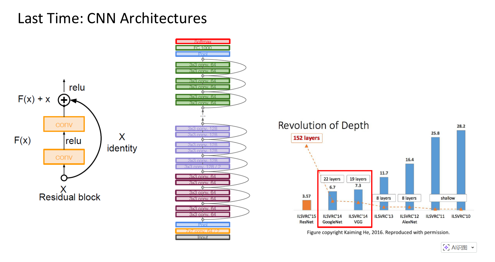

# 11 Recurrent Neural Network 循环神经网络

## 复习 Recap

- **2012年 AlexNet：** 只有 **8层** 网络，错误率是 16.4% 。这在当时是一个巨大的突破。
- **2014年 VGG/GoogleNet：** 网络层数增加到了 **19层** 和 **22层**，错误率降到了 7.3% 和 6.7% 。
- **2015年 ResNet：** 这是一个极其夸张的跳跃，网络层数达到了 **152层** ，错误率惊人地降到了 **3.57%** 。

### ResNet 与残差块

既然楼盖高了效果好，为什么以前不盖高呢？因为楼太高容易“塌”（在数学上叫梯度消失，导致无法训练）。 ResNet 被设计出来解决这个问题。

- **核心结构 (Residual Block)：** ResNet 发明了一种特殊的结构，叫做“残差块”。
- **数学公式：** $F(x) + x$。
- **原理图解：**
  - 通常数据是 $x$ 经过一层层处理变成 $F(x)$ 。
  - ResNet 增加了一条“捷径”，直接把原始数据 $x$ 加到了处理后的结果上，形成 $F(x) + x$。这被称为 **Identity Mapping（恒等映射）**。
  - ResNet = (3x3 卷积 + 3x3 卷积) + 跳跃连接
- **通俗解释：** 传统的深度网络就像传话游戏，传了 100 个人后，最初的信息可能全丢了。ResNet 的做法是：每个人在传话处理（$F(x)$）的同时，还给下一个人递一张写着原话的纸条（$x$）。这样即使处理过程中出错了，原始信息也能保留下来。这就让训练 152 层的“摩天大楼”成为了可能。

通过增加网络的深度（层数）并使用像 ResNet 这样的巧妙结构（跳跃连接），我们可以极大地提高 AI 模型的性能。