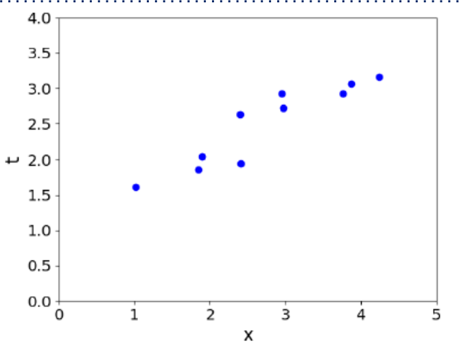

# Linear Methods for Regression, Optimization 线性回归与优化方法

## Overview 总结

- Second learning algorithm of the course: **linear regression**.

  课程的第二学习算法：**线性回归**。

  - **Task**: predict scalar-valued targets (e.g. stock prices)

    **任务**：预测标量值目标（如股票价格）

  - **Architecture**: linear function of the inputs

    **架构**：输入量的线性函数

- While KNN was a complete algorithm, linear regression exemplifies a modular approach that will be used through this course:

  尽管KNN是一个完整的算法，线性回归则代表了本课程将贯穿使用的模块化方法。

  - choose a **model** describing the relationships between variables of interest

    选择一个模型来描述感兴趣变量之间的关系。

  - define a **loss function** quantifying how bad the fit to the data is

    定义一个损失函数，用于量化数据拟合效果的不佳程度。

  - choose a **regularizer** saying how much we prefer different candidate models (or explanations of data)

    选择一个正则化器，以表明我们更偏好哪些候选模型（或对数据的解释）。

  - fit a model that minimizes the loss function and satisfies the constraint/penalty imposed by the regularizer, possibly using an **optimization algorithm**.

    拟合一个模型，使其最小化损失函数，并满足正则化器施加的约束/惩罚条件，可能需要使用优化算法。

- Mixing and matching these modular components give us a lot of new ML methods.

  混合搭配这些模块化组件为我们提供了众多新的机器学习方法。

## Supervised Learning Setup 监督学习设置

- In supervised learning:

  在监督学习中：

  - There is input 𝐱 $x \in X$ , typically a vector of features (or covariates)

    输入𝐱 $x \in X$，通常为一组特征（或协变量）向量。

  - There is target $t \in T$, (also called response, outcome, output, class)

    存在目标变量 $t \in T$（亦称响应变量、结果变量、输出变量或类别变量）。

  - Objective is to learn a function $f: X \rightarrow T$  such that $t \approx y = f(x)$ based on some data $\mathcal{D} = \left\{ \left( \mathbf{x}^{(i)}, t^{(i)} \right) \; \middle| \; i = 1, 2, \ldots, N \right\}$

    目标是从数据集 $\mathcal{D} = \left\{ \left( \mathbf{x}^{(i)}, t^{(i)} \right) \; \middle| \; i = 1, 2, \ldots, N \right\}$ 中学习一个函数 $f: X \rightarrow T$，使得 $t \approx y = f(x)$。

## Linear Regression - Modal 线性回归模型

